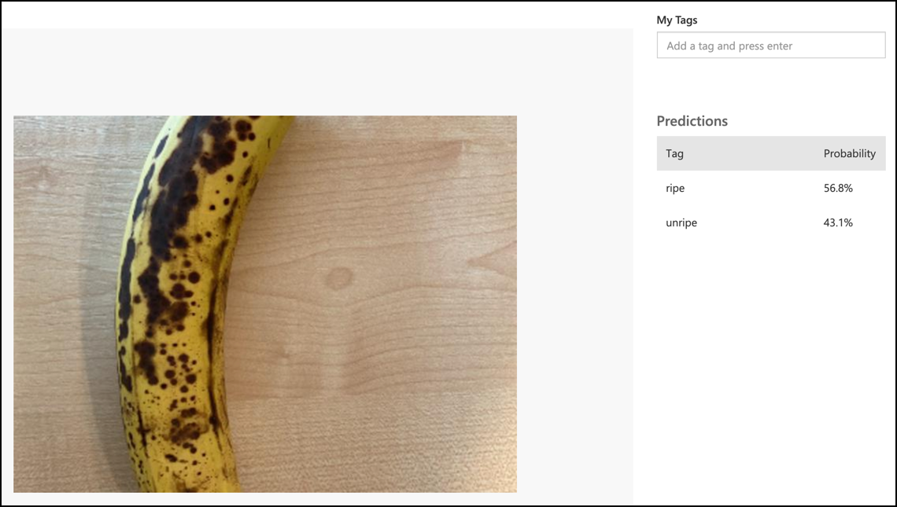

<!--
CO_OP_TRANSLATOR_METADATA:
{
  "original_hash": "e5896207b304ce1abaf065b8acc0cc79",
  "translation_date": "2025-08-26T21:50:35+00:00",
  "source_file": "4-manufacturing/lessons/2-check-fruit-from-device/single-board-computer-classify-image.md",
  "language_code": "mo"
}
-->
# 分類圖片 - 虛擬 IoT 硬體與 Raspberry Pi

在本課程的這部分，你將把相機捕捉的圖片發送到 Custom Vision 服務進行分類。

## 發送圖片到 Custom Vision

Custom Vision 服務提供了一個 Python SDK，可用於分類圖片。

### 任務 - 發送圖片到 Custom Vision

1. 在 VS Code 中打開 `fruit-quality-detector` 資料夾。如果你使用的是虛擬 IoT 裝置，請確保虛擬環境已在終端機中運行。

1. 用於發送圖片到 Custom Vision 的 Python SDK 可作為 Pip 套件安裝。使用以下指令進行安裝：

    ```sh
    pip3 install azure-cognitiveservices-vision-customvision
    ```

1. 在 `app.py` 文件的頂部添加以下 import 語句：

    ```python
    from msrest.authentication import ApiKeyCredentials
    from azure.cognitiveservices.vision.customvision.prediction import CustomVisionPredictionClient
    ```

    這會引入一些 Custom Vision 庫中的模組，一個用於使用預測金鑰進行身份驗證，另一個提供可調用 Custom Vision 的預測客戶端類。

1. 在文件末尾添加以下程式碼：

    ```python
    prediction_url = '<prediction_url>'
    prediction_key = '<prediction key>'
    ```

    將 `<prediction_url>` 替換為你在本課程早些時候從 *Prediction URL* 對話框中複製的 URL。將 `<prediction key>` 替換為你從同一對話框中複製的預測金鑰。

1. *Prediction URL* 對話框提供的預測 URL 是為直接調用 REST 端點設計的。Python SDK 在不同的地方使用 URL 的部分。添加以下程式碼以分解此 URL 為所需的部分：

    ```python
    parts = prediction_url.split('/')
    endpoint = 'https://' + parts[2]
    project_id = parts[6]
    iteration_name = parts[9]
    ```

    這會分解 URL，提取出 `https://<location>.api.cognitive.microsoft.com` 的端點、專案 ID 和已發佈的迭代名稱。

1. 創建一個預測器物件以執行預測，使用以下程式碼：

    ```python
    prediction_credentials = ApiKeyCredentials(in_headers={"Prediction-key": prediction_key})
    predictor = CustomVisionPredictionClient(endpoint, prediction_credentials)
    ```

    `prediction_credentials` 將預測金鑰封裝起來。這些隨後用於創建指向端點的預測客戶端物件。

1. 使用以下程式碼將圖片發送到 Custom Vision：

    ```python
    image.seek(0)
    results = predictor.classify_image(project_id, iteration_name, image)
    ```

    這會將圖片回卷到起始位置，然後將其發送到預測客戶端。

1. 最後，使用以下程式碼顯示結果：

    ```python
    for prediction in results.predictions:
        print(f'{prediction.tag_name}:\t{prediction.probability * 100:.2f}%')
    ```

    這會迴圈所有返回的預測並在終端機中顯示它們。返回的概率是 0-1 的浮點數，其中 0 表示與標籤匹配的可能性為 0%，1 表示與標籤匹配的可能性為 100%。

    > 💁 圖片分類器會返回所有使用過的標籤的百分比。每個標籤都會有一個圖片與該標籤匹配的概率。

1. 運行你的程式，讓相機對準一些水果，或者使用適當的圖片集，或者如果使用虛擬 IoT 硬體，讓水果在你的網路攝影機中可見。你會在控制台中看到輸出：

    ```output
    (.venv) ➜  fruit-quality-detector python app.py
    ripe:   56.84%
    unripe: 43.16%
    ```

    你將能看到拍攝的圖片，以及這些值在 Custom Vision 的 **Predictions** 標籤中顯示。

    

> 💁 你可以在 [code-classify/pi](../../../../../4-manufacturing/lessons/2-check-fruit-from-device/code-classify/pi) 或 [code-classify/virtual-iot-device](../../../../../4-manufacturing/lessons/2-check-fruit-from-device/code-classify/virtual-iot-device) 資料夾中找到這段程式碼。

😀 你的水果品質分類程式成功了！

---

**免責聲明**：  
本文件已使用 AI 翻譯服務 [Co-op Translator](https://github.com/Azure/co-op-translator) 進行翻譯。儘管我們努力確保翻譯的準確性，但請注意，自動翻譯可能包含錯誤或不準確之處。原始文件的母語版本應被視為權威來源。對於關鍵資訊，建議使用專業人工翻譯。我們對因使用此翻譯而引起的任何誤解或誤釋不承擔責任。