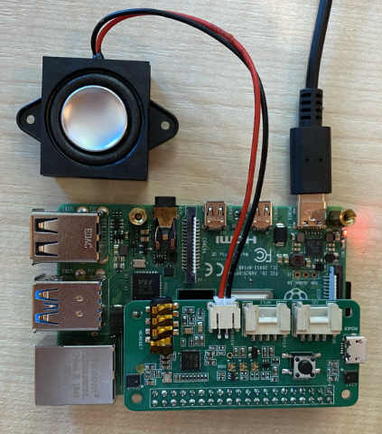

<!--
CO_OP_TRANSLATOR_METADATA:
{
  "original_hash": "7e45d884493c5222348b43fbc4481b6a",
  "translation_date": "2025-08-27T00:30:50+00:00",
  "source_file": "6-consumer/lessons/1-speech-recognition/pi-microphone.md",
  "language_code": "mo"
}
-->
# 配置您的麥克風和揚聲器 - Raspberry Pi

在本課程中，您將為您的 Raspberry Pi 添加麥克風和揚聲器。

## 硬體

Raspberry Pi 需要一個麥克風。

Pi 本身並未內建麥克風，因此您需要添加外接麥克風。有多種方式可以實現：

* USB 麥克風
* USB 耳機
* USB 一體式會議麥克風
* USB 音頻轉接器和帶 3.5mm 插孔的麥克風
* [ReSpeaker 2-Mics Pi HAT](https://www.seeedstudio.com/ReSpeaker-2-Mics-Pi-HAT.html)

> 💁 並非所有藍牙麥克風都能在 Raspberry Pi 上使用，因此如果您有藍牙麥克風或耳機，可能會遇到配對或錄音問題。

Raspberry Pi 配備了一個 3.5mm 耳機插孔。您可以使用它來連接耳機、耳麥或揚聲器。您也可以通過以下方式添加揚聲器：

* 通過顯示器或電視的 HDMI 音頻
* USB 揚聲器
* USB 耳機
* USB 一體式會議麥克風
* [ReSpeaker 2-Mics Pi HAT](https://www.seeedstudio.com/ReSpeaker-2-Mics-Pi-HAT.html)，並通過 3.5mm 插孔或 JST 接口連接揚聲器

## 連接並配置麥克風和揚聲器

麥克風和揚聲器需要連接並進行配置。

### 任務 - 連接並配置麥克風

1. 使用適當的方法連接麥克風。例如，通過其中一個 USB 端口連接。

1. 如果您使用的是 ReSpeaker 2-Mics Pi HAT，可以移除 Grove 基座帽，然後將 ReSpeaker 帽安裝到其位置。

    

    在本課程稍後您將需要一個 Grove 按鈕，但此帽已內建一個按鈕，因此不需要 Grove 基座帽。

    安裝帽子後，您需要安裝一些驅動程式。請參考 [Seeed 的入門指南](https://wiki.seeedstudio.com/ReSpeaker_2_Mics_Pi_HAT_Raspberry/#getting-started) 以獲取驅動程式安裝指引。

    > ⚠️ 指引中使用了 `git` 來克隆一個倉庫。如果您的 Pi 上未安裝 `git`，可以通過以下命令進行安裝：
    >
    > ```sh
    > sudo apt install git --yes
    > ```

1. 在 Pi 的終端中運行以下命令，或者通過 VS Code 和遠端 SSH 連線運行，以查看已連接的麥克風資訊：

    ```sh
    arecord -l
    ```

    您將看到已連接的麥克風列表。它可能類似於以下內容：

    ```output
    pi@raspberrypi:~ $ arecord -l
    **** List of CAPTURE Hardware Devices ****
    card 1: M0 [eMeet M0], device 0: USB Audio [USB Audio]
      Subdevices: 1/1
      Subdevice #0: subdevice #0
    ```

    假設您只有一個麥克風，您應該只看到一個條目。在 Linux 上配置麥克風可能會比較棘手，因此最好只使用一個麥克風並拔掉其他的。

    記下卡號，稍後您將需要使用它。在上述輸出中，卡號為 1。

### 任務 - 連接並配置揚聲器

1. 使用適當的方法連接揚聲器。

1. 在 Pi 的終端中運行以下命令，或者通過 VS Code 和遠端 SSH 連線運行，以查看已連接的揚聲器資訊：

    ```sh
    aplay -l
    ```

    您將看到已連接的揚聲器列表。它可能類似於以下內容：

    ```output
    pi@raspberrypi:~ $ aplay -l
    **** List of PLAYBACK Hardware Devices ****
    card 0: Headphones [bcm2835 Headphones], device 0: bcm2835 Headphones [bcm2835 Headphones]
      Subdevices: 8/8
      Subdevice #0: subdevice #0
      Subdevice #1: subdevice #1
      Subdevice #2: subdevice #2
      Subdevice #3: subdevice #3
      Subdevice #4: subdevice #4
      Subdevice #5: subdevice #5
      Subdevice #6: subdevice #6
      Subdevice #7: subdevice #7
    card 1: M0 [eMeet M0], device 0: USB Audio [USB Audio]
      Subdevices: 1/1
      Subdevice #0: subdevice #0
    ```

    您將始終看到 `card 0: Headphones`，因為這是內建的耳機插孔。如果您添加了額外的揚聲器，例如 USB 揚聲器，您也會看到它列出。

1. 如果您使用的是額外的揚聲器，而不是連接到內建耳機插孔的揚聲器或耳機，您需要將其配置為預設設備。為此，請運行以下命令：

    ```sh
    sudo nano /usr/share/alsa/alsa.conf
    ```

    這將在 `nano` 中打開一個配置檔案，`nano` 是一個基於終端的文字編輯器。使用鍵盤上的箭頭鍵向下滾動，直到找到以下行：

    ```output
    defaults.pcm.card 0
    ```

    將值從 `0` 更改為您希望使用的卡號，該卡號來自 `aplay -l` 命令的返回列表。例如，在上述輸出中，有一個名為 `card 1: M0 [eMeet M0], device 0: USB Audio [USB Audio]` 的第二個聲卡，使用卡號 1。要使用此卡，我會將該行更新為：

    ```output
    defaults.pcm.card 1
    ```

    將此值設置為適當的卡號。您可以使用鍵盤上的箭頭鍵導航到該數字，然後像編輯文字檔案一樣刪除並輸入新數字。

1. 按 `Ctrl+x` 保存更改並關閉檔案。按 `y` 保存檔案，然後按 `return` 確認檔案名稱。

### 任務 - 測試麥克風和揚聲器

1. 運行以下命令以通過麥克風錄製 5 秒的音頻：

    ```sh
    arecord --format=S16_LE --duration=5 --rate=16000 --file-type=wav out.wav
    ```

    在此命令運行期間，對著麥克風發出聲音，例如說話、唱歌、節奏口技、演奏樂器或任何您喜歡的方式。

1. 5 秒後，錄音將停止。運行以下命令以播放音頻：

    ```sh
    aplay --format=S16_LE --rate=16000 out.wav
    ```

    您將聽到音頻通過揚聲器播放。根據需要調整揚聲器的輸出音量。

1. 如果需要調整內建麥克風端口的音量或麥克風的增益，可以使用 `alsamixer` 工具。您可以在 [Linux alsamixer 手冊頁](https://linux.die.net/man/1/alsamixer) 上了解更多關於此工具的資訊。

1. 如果播放音頻時出現錯誤，請檢查您在 `alsa.conf` 檔案中設置的 `defaults.pcm.card` 卡號是否正確。

---

**免責聲明**：  
本文件已使用 AI 翻譯服務 [Co-op Translator](https://github.com/Azure/co-op-translator) 進行翻譯。雖然我們致力於提供準確的翻譯，但請注意，自動翻譯可能包含錯誤或不準確之處。原始文件的母語版本應被視為權威來源。對於關鍵資訊，建議使用專業人工翻譯。我們對因使用此翻譯而引起的任何誤解或誤釋不承擔責任。