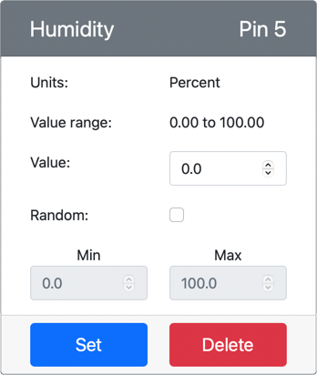

<!--
CO_OP_TRANSLATOR_METADATA:
{
  "original_hash": "70e5a428b607cd5a9a4f422c2a4df03d",
  "translation_date": "2025-08-27T11:08:34+00:00",
  "source_file": "2-farm/lessons/1-predict-plant-growth/virtual-device-temp.md",
  "language_code": "mr"
}
-->
# तापमान मोजा - व्हर्च्युअल IoT हार्डवेअर

या धड्याच्या भागात, तुम्ही तुमच्या व्हर्च्युअल IoT डिव्हाइसवर तापमान सेन्सर जोडाल.

## व्हर्च्युअल हार्डवेअर

व्हर्च्युअल IoT डिव्हाइस सिम्युलेटेड Grove Digital Humidity आणि Temperature सेन्सर वापरेल. हे प्रयोगशाळा Raspberry Pi आणि फिजिकल Grove DHT11 सेन्सर वापरण्यासारखेच ठेवते.

सेन्सर **तापमान सेन्सर** आणि **आर्द्रता सेन्सर** एकत्रित करतो, परंतु या प्रयोगशाळेत तुम्हाला फक्त तापमान सेन्सर घटकाचीच गरज आहे. फिजिकल IoT डिव्हाइसमध्ये, तापमान सेन्सर [थर्मिस्टर](https://wikipedia.org/wiki/Thermistor) असेल, जो तापमान बदलल्यावर प्रतिकार बदल जाणवून तापमान मोजतो. तापमान सेन्सर सामान्यतः डिजिटल सेन्सर असतात जे अंतर्गत प्रतिकार मोजून डिग्री सेल्सियस (किंवा केल्विन, किंवा फॅरेनहाइट) मध्ये तापमानात रूपांतर करतात.

### CounterFit मध्ये सेन्सर जोडा

व्हर्च्युअल आर्द्रता आणि तापमान सेन्सर वापरण्यासाठी, तुम्हाला CounterFit अॅपमध्ये दोन सेन्सर जोडावे लागतील.

#### कार्य - CounterFit मध्ये सेन्सर जोडा

CounterFit अॅपमध्ये आर्द्रता आणि तापमान सेन्सर जोडा.

1. तुमच्या संगणकावर `temperature-sensor` नावाच्या फोल्डरमध्ये एक नवीन Python अॅप तयार करा, ज्यामध्ये `app.py` नावाची एक फाइल आणि Python व्हर्च्युअल वातावरण असेल, आणि CounterFit pip पॅकेजेस जोडा.

    > ⚠️ [CounterFit Python प्रोजेक्ट तयार करण्यासाठी आणि सेटअप करण्यासाठी धडा 1 मधील सूचना आवश्यक असल्यास](../../../1-getting-started/lessons/1-introduction-to-iot/virtual-device.md) पाहा.

1. DHT11 सेन्सरसाठी CounterFit शिम स्थापित करण्यासाठी एक अतिरिक्त Pip पॅकेज स्थापित करा. हे व्हर्च्युअल वातावरण सक्रिय असलेल्या टर्मिनलमधून स्थापित करत असल्याची खात्री करा.

    ```sh
    pip install counterfit-shims-seeed-python-dht
    ```

1. CounterFit वेब अॅप चालू असल्याची खात्री करा.

1. आर्द्रता सेन्सर तयार करा:

    1. *Sensors* पॅनमधील *Create sensor* बॉक्समध्ये, *Sensor type* ड्रॉपडाउन करा आणि *Humidity* निवडा.

    1. *Units* *Percentage* वर सेट ठेवा.

    1. *Pin* *5* वर सेट असल्याची खात्री करा.

    1. **Add** बटण निवडा जेणेकरून Pin 5 वर आर्द्रता सेन्सर तयार होईल.

    

    आर्द्रता सेन्सर तयार होईल आणि सेन्सर यादीत दिसेल.

    

1. तापमान सेन्सर तयार करा:

    1. *Sensors* पॅनमधील *Create sensor* बॉक्समध्ये, *Sensor type* ड्रॉपडाउन करा आणि *Temperature* निवडा.

    1. *Units* *Celsius* वर सेट ठेवा.

    1. *Pin* *6* वर सेट असल्याची खात्री करा.

    1. **Add** बटण निवडा जेणेकरून Pin 6 वर तापमान सेन्सर तयार होईल.

    

    तापमान सेन्सर तयार होईल आणि सेन्सर यादीत दिसेल.

    

## तापमान सेन्सर अॅप प्रोग्राम करा

तापमान सेन्सर अॅप आता CounterFit सेन्सर वापरून प्रोग्राम केला जाऊ शकतो.

### कार्य - तापमान सेन्सर अॅप प्रोग्राम करा

तापमान सेन्सर अॅप प्रोग्राम करा.

1. `temperature-sensor` अॅप VS Code मध्ये उघडा.

1. `app.py` फाइल उघडा.

1. CounterFit शी अॅप कनेक्ट करण्यासाठी `app.py` च्या शीर्षस्थानी खालील कोड जोडा:

    ```python
    from counterfit_connection import CounterFitConnection
    CounterFitConnection.init('127.0.0.1', 5000)
    ```

1. आवश्यक लायब्ररी आयात करण्यासाठी `app.py` फाइलमध्ये खालील कोड जोडा:

    ```python
    import time
    from counterfit_shims_seeed_python_dht import DHT
    ```

    `from seeed_dht import DHT` स्टेटमेंट `DHT` सेन्सर वर्ग आयात करते, जो `counterfit_shims_seeed_python_dht` मॉड्यूलमधील शिम वापरून व्हर्च्युअल Grove तापमान सेन्सरशी संवाद साधतो.

1. व्हर्च्युअल आर्द्रता आणि तापमान सेन्सर व्यवस्थापित करणाऱ्या वर्गाची उदाहरण तयार करण्यासाठी वरील कोडनंतर खालील कोड जोडा:

    ```python
    sensor = DHT("11", 5)
    ```

    हे **D**igital **H**umidity आणि **T**emperature सेन्सर व्यवस्थापित करणाऱ्या `DHT` वर्गाचे उदाहरण घोषित करते. पहिला पॅरामीटर कोडला सांगतो की वापरला जाणारा सेन्सर व्हर्च्युअल *DHT11* सेन्सर आहे. दुसरा पॅरामीटर कोडला सांगतो की सेन्सर पोर्ट `5` वर कनेक्ट आहे.

    > 💁 CounterFit हा एकत्रित आर्द्रता आणि तापमान सेन्सर सिम्युलेट करतो, जो दोन सेन्सरशी कनेक्ट होतो - एक आर्द्रता सेन्सर दिलेल्या पिनवर आणि दुसरा तापमान सेन्सर पुढील पिनवर चालतो. जर आर्द्रता सेन्सर पिन 5 वर असेल, तर शिम तापमान सेन्सर पिन 6 वर अपेक्षित करते.

1. तापमान सेन्सरचे मूल्य पोल करण्यासाठी आणि कन्सोलवर प्रिंट करण्यासाठी वरील कोडनंतर एक अनंत लूप जोडा:

    ```python
    while True:
        _, temp = sensor.read()
        print(f'Temperature {temp}°C')
    ```

    `sensor.read()` कॉल आर्द्रता आणि तापमानाचा ट्युपल परत करतो. तुम्हाला फक्त तापमान मूल्याची गरज आहे, त्यामुळे आर्द्रता दुर्लक्षित केली जाते. तापमान मूल्य नंतर कन्सोलवर प्रिंट केले जाते.

1. `loop` च्या शेवटी दहा सेकंदांची छोटी झोप जोडा, कारण तापमान पातळी सतत तपासण्याची गरज नाही. झोप डिव्हाइसचा ऊर्जा वापर कमी करते.

    ```python
    time.sleep(10)
    ```

1. सक्रिय व्हर्च्युअल वातावरणासह VS Code टर्मिनलमधून खालील कमांड चालवा:

    ```sh
    python app.py
    ```

1. CounterFit अॅपमधून, अॅपद्वारे वाचले जाणारे तापमान सेन्सरचे मूल्य बदला. तुम्ही हे दोन प्रकारे करू शकता:

    * तापमान सेन्सरसाठी *Value* बॉक्समध्ये एक नंबर प्रविष्ट करा, नंतर **Set** बटण निवडा. तुम्ही प्रविष्ट केलेला नंबर सेन्सरद्वारे परत दिलेले मूल्य असेल.

    * *Random* चेकबॉक्स तपासा, आणि *Min* आणि *Max* मूल्य प्रविष्ट करा, नंतर **Set** बटण निवडा. प्रत्येक वेळी सेन्सर मूल्य वाचतो, ते *Min* आणि *Max* दरम्यान एक रँडम नंबर वाचेल.

    तुम्ही सेट केलेली मूल्ये कन्सोलमध्ये दिसतील. *Value* किंवा *Random* सेटिंग्ज बदला आणि मूल्य बदलताना पहा.

    ```output
    (.venv) ➜  temperature-sensor python app.py
    Temperature 28.25°C
    Temperature 30.71°C
    Temperature 25.17°C
    ```

> 💁 तुम्ही हा कोड [code-temperature/virtual-device](../../../../../2-farm/lessons/1-predict-plant-growth/code-temperature/virtual-device) फोल्डरमध्ये शोधू शकता.

😀 तुमचा तापमान सेन्सर प्रोग्राम यशस्वी झाला!

---

**अस्वीकरण**:  
हा दस्तऐवज AI भाषांतर सेवा [Co-op Translator](https://github.com/Azure/co-op-translator) चा वापर करून भाषांतरित करण्यात आला आहे. आम्ही अचूकतेसाठी प्रयत्नशील असलो तरी कृपया लक्षात ठेवा की स्वयंचलित भाषांतरे त्रुटी किंवा अचूकतेच्या अभावाने युक्त असू शकतात. मूळ भाषेतील दस्तऐवज हा अधिकृत स्रोत मानला जावा. महत्त्वाच्या माहितीसाठी व्यावसायिक मानवी भाषांतराची शिफारस केली जाते. या भाषांतराचा वापर करून निर्माण होणाऱ्या कोणत्याही गैरसमज किंवा चुकीच्या अर्थासाठी आम्ही जबाबदार राहणार नाही.