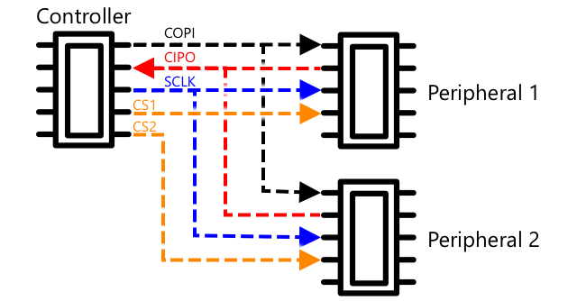

<!--
CO_OP_TRANSLATOR_METADATA:
{
  "original_hash": "4fb20273d299dc8d07a8f06c9cd0cdd9",
  "translation_date": "2025-08-27T11:41:12+00:00",
  "source_file": "2-farm/lessons/2-detect-soil-moisture/README.md",
  "language_code": "mr"
}
-->
C, उच्चार *I-squared-C*, हा एक मल्टी-कंट्रोलर, मल्टी-पेरिफेरल प्रोटोकॉल आहे, ज्यामध्ये कोणतेही कनेक्ट केलेले उपकरण नियंत्रक किंवा पेरिफेरल म्हणून I²C बसवर संवाद साधू शकते (डेटा हस्तांतरित करण्यासाठी वापरली जाणारी प्रणाली). डेटा पत्त्याच्या पॅकेट्सच्या स्वरूपात पाठवला जातो, ज्यामध्ये प्रत्येक पॅकेटमध्ये संबंधित उपकरणाचा पत्ता असतो.

> 💁 पूर्वी या मॉडेलला मास्टर/स्लेव्ह म्हणून संबोधले जात असे, परंतु गुलामगिरीशी संबंधित असलेल्या या शब्दावलीचा वापर टाळला जात आहे. [ओपन सोर्स हार्डवेअर असोसिएशनने कंट्रोलर/पेरिफेरल ही संज्ञा स्वीकारली आहे](https://www.oshwa.org/a-resolution-to-redefine-spi-signal-names/), परंतु तुम्हाला अजूनही जुन्या शब्दावलीचा संदर्भ दिसू शकतो.

उपकरणे I²C बसशी कनेक्ट होताना एक पत्ता वापरतात, जो सहसा उपकरणावर हार्ड कोड केलेला असतो. उदाहरणार्थ, Seeed कडून प्रत्येक प्रकारच्या Grove सेन्सरचा समान पत्ता असतो, त्यामुळे सर्व लाइट सेन्सरचा समान पत्ता असतो, सर्व बटणांचा पत्ता लाइट सेन्सरच्या पत्त्यापेक्षा वेगळा असतो. काही उपकरणांमध्ये पत्ता बदलण्याचे मार्ग असतात, जसे की जंपर सेटिंग्ज बदलणे किंवा पिन्स एकत्र सोल्डर करणे.

I²C बसमध्ये 2 मुख्य वायर असतात, तसेच 2 पॉवर वायर:

| वायर | नाव | वर्णन |
| ---- | --------- | ----------- |
| SDA | सिरियल डेटा | ही वायर उपकरणांमध्ये डेटा पाठवण्यासाठी वापरली जाते. |
| SCL | सिरियल क्लॉक | ही वायर नियंत्रकाद्वारे सेट केलेल्या दराने क्लॉक सिग्नल पाठवते. |
| VCC | व्होल्टेज कॉमन कलेक्टर | उपकरणांसाठी पॉवर पुरवठा. हे SDA आणि SCL वायरला जोडले जाते जेणेकरून पुल-अप रेझिस्टरद्वारे सिग्नल बंद होईल जेव्हा कोणतेही उपकरण नियंत्रक नसते. |
| GND | ग्राउंड | इलेक्ट्रिकल सर्किटसाठी सामान्य ग्राउंड पुरवते. |

डेटा पाठवण्यासाठी, एक उपकरण स्टार्ट कंडीशन जारी करेल ज्यामुळे ते डेटा पाठवण्यासाठी तयार असल्याचे दर्शवेल. त्यानंतर ते नियंत्रक बनते. नियंत्रक नंतर त्या उपकरणाचा पत्ता पाठवतो ज्याच्याशी तो संवाद साधू इच्छित आहे, तसेच तो डेटा वाचू इच्छित आहे की लिहू इच्छित आहे हे दर्शवतो. डेटा प्रसारित झाल्यानंतर, नियंत्रक स्टॉप कंडीशन पाठवतो ज्यामुळे त्याने आपले काम पूर्ण केले आहे हे सूचित होते. यानंतर दुसरे उपकरण नियंत्रक बनू शकते आणि डेटा पाठवू किंवा प्राप्त करू शकते.

22C ला वेग मर्यादा आहेत, ज्यामध्ये 3 वेगवेगळ्या मोड्स निश्चित वेगाने चालतात. सर्वात जलद म्हणजे हाय स्पीड मोड, ज्याचा कमाल वेग 3.4Mbps (मेगाबिट्स प्रति सेकंद) आहे, परंतु फार कमी उपकरणे त्या वेगाला समर्थन देतात. उदाहरणार्थ, रास्पबेरी पाय फास्ट मोडमध्ये 400Kbps (किलोबिट्स प्रति सेकंद) पर्यंत मर्यादित आहे. स्टँडर्ड मोड 100Kbps वेगाने चालतो.

> 💁 जर तुम्ही रास्पबेरी पायसह ग्रोव्ह बेस हॅट तुमच्या IoT हार्डवेअर म्हणून वापरत असाल, तर तुम्हाला बोर्डावर I2C सॉकेट्स दिसतील ज्याचा वापर तुम्ही I2C सेन्सर्सशी संवाद साधण्यासाठी करू शकता. अॅनालॉग ग्रोव्ह सेन्सर्स देखील ADC चा वापर करून अॅनालॉग मूल्ये डिजिटल डेटामध्ये पाठवण्यासाठी I2C वापरतात, त्यामुळे तुम्ही वापरलेला लाइट सेन्सर अॅनालॉग पिनचे अनुकरण करत होता, ज्याचे मूल्य I2C वरून पाठवले गेले कारण रास्पबेरी पाय फक्त डिजिटल पिनला समर्थन देते.

### युनिव्हर्सल असिंक्रोनस रिसीव्हर-ट्रान्समीटर (UART)

UART मध्ये दोन उपकरणांना संवाद साधण्यासाठी भौतिक सर्किटरीचा समावेश असतो. प्रत्येक उपकरणाला 2 कम्युनिकेशन पिन्स असतात - ट्रान्समिट (Tx) आणि रिसीव्ह (Rx), ज्यामध्ये पहिल्या उपकरणाचा Tx पिन दुसऱ्या उपकरणाच्या Rx पिनशी जोडलेला असतो, आणि दुसऱ्या उपकरणाचा Tx पिन पहिल्या उपकरणाच्या Rx पिनशी जोडलेला असतो. यामुळे डेटा दोन्ही दिशांनी पाठवला जाऊ शकतो.

* उपकरण 1 त्याच्या Tx पिनवरून डेटा पाठवते, जो उपकरण 2 च्या Rx पिनवर प्राप्त होतो.
* उपकरण 1 त्याच्या Rx पिनवर डेटा प्राप्त करते, जो उपकरण 2 च्या Tx पिनवरून पाठवला जातो.

> 🎓 डेटा एकावेळी एक बिट पाठवला जातो, आणि याला *सिरीयल* कम्युनिकेशन म्हणतात. बहुतेक ऑपरेटिंग सिस्टीम्स आणि मायक्रोकंट्रोलर्समध्ये *सिरीयल पोर्ट्स* असतात, म्हणजेच कनेक्शन जे सिरीयल डेटा पाठवू आणि प्राप्त करू शकतात आणि तुमच्या कोडसाठी उपलब्ध असतात.

UART उपकरणांमध्ये [baud rate](https://wikipedia.org/wiki/Symbol_rate) (ज्याला Symbol rate देखील म्हणतात) असतो, जो डेटा पाठवला आणि प्राप्त केला जाईल अशा वेगाने बिट्स प्रति सेकंद मोजला जातो. सामान्य baud rate 9,600 आहे, म्हणजे 9,600 बिट्स (0s आणि 1s) डेटा प्रत्येक सेकंदाला पाठवला जातो.

UART स्टार्ट आणि स्टॉप बिट्स वापरते - म्हणजेच ते एक बाइट (8 बिट्स) डेटा पाठवण्याच्या तयारीसाठी एक स्टार्ट बिट पाठवते, आणि 8 बिट्स पाठवल्यानंतर एक स्टॉप बिट पाठवते.

UART चा वेग हार्डवेअरवर अवलंबून असतो, परंतु सर्वात जलद अंमलबजावणी देखील 6.5 Mbps (मेगाबिट्स प्रति सेकंद, किंवा लाखो बिट्स, 0 किंवा 1, प्रति सेकंद पाठवले जातात) पेक्षा जास्त नसते.

तुम्ही GPIO पिन्सवर UART वापरू शकता - तुम्ही एक पिन Tx म्हणून आणि दुसरा Rx म्हणून सेट करू शकता, नंतर हे दुसऱ्या उपकरणाशी जोडू शकता.

> 💁 जर तुम्ही रास्पबेरी पायसह ग्रोव्ह बेस हॅट तुमच्या IoT हार्डवेअर म्हणून वापरत असाल, तर तुम्हाला बोर्डावर UART सॉकेट दिसेल ज्याचा वापर तुम्ही UART प्रोटोकॉल वापरणाऱ्या सेन्सर्सशी संवाद साधण्यासाठी करू शकता.

### सिरीयल पेरिफेरल इंटरफेस (SPI)

SPI लहान अंतरावर संवाद साधण्यासाठी डिझाइन केले गेले आहे, जसे की मायक्रोकंट्रोलरवरून स्टोरेज डिव्हाइससारख्या फ्लॅश मेमरीशी संवाद साधणे. हे कंट्रोलर/पेरिफेरल मॉडेलवर आधारित आहे ज्यामध्ये एकच कंट्रोलर (सामान्यतः IoT उपकरणाचा प्रोसेसर) अनेक पेरिफेरल्सशी संवाद साधतो. कंट्रोलर प्रत्येक गोष्ट नियंत्रित करते, पेरिफेरल निवडून डेटा पाठवतो किंवा मागतो.

> 💁 I2C प्रमाणे, कंट्रोलर आणि पेरिफेरल ही अलीकडील संज्ञा आहेत, त्यामुळे तुम्हाला जुने शब्द अजूनही वापरले जाताना दिसू शकतात.

SPI कंट्रोलर्स 3 वायर वापरतात, सोबत प्रत्येक पेरिफेरलसाठी 1 अतिरिक्त वायर. पेरिफेरल्स 4 वायर वापरतात. या वायर आहेत:

| वायर | नाव | वर्णन |
| ---- | --------- | ----------- |
| COPI | कंट्रोलर आउटपुट, पेरिफेरल इनपुट | ही वायर कंट्रोलरकडून पेरिफेरलकडे डेटा पाठवण्यासाठी आहे. |
| CIPO | कंट्रोलर इनपुट, पेरिफेरल आउटपुट | ही वायर पेरिफेरलकडून कंट्रोलरकडे डेटा पाठवण्यासाठी आहे. |
| SCLK | सिरीयल क्लॉक | ही वायर कंट्रोलरने सेट केलेल्या दराने क्लॉक सिग्नल पाठवते. |
| CS   | चिप सिलेक्ट | कंट्रोलरकडे अनेक वायर असतात, प्रत्येक पेरिफेरलसाठी एक, आणि प्रत्येक वायर संबंधित पेरिफेरलच्या CS वायरशी जोडलेली असते. |

CS वायर एकावेळी एक पेरिफेरल सक्रिय करण्यासाठी वापरली जाते, COPI आणि CIPO वायरवर संवाद साधण्यासाठी. जेव्हा कंट्रोलरला पेरिफेरल बदलायचे असते, तेव्हा ते सध्या सक्रिय असलेल्या पेरिफेरलशी जोडलेल्या CS वायरला निष्क्रिय करते, नंतर ते पुढील पेरिफेरलशी संवाद साधण्यासाठी जोडलेल्या वायरला सक्रिय करते.

SPI *फुल-डुप्लेक्स* आहे, म्हणजेच कंट्रोलर COPI आणि CIPO वायर वापरून एकाच वेळी एकाच पेरिफेरलकडून डेटा पाठवू आणि प्राप्त करू शकतो. SPI SCLK वायरवर क्लॉक सिग्नल वापरते ज्यामुळे उपकरणे सिंकमध्ये राहतात, त्यामुळे UART वर थेट पाठवण्याप्रमाणे स्टार्ट आणि स्टॉप बिट्सची गरज नसते.

SPI साठी कोणत्याही वेग मर्यादा परिभाषित केलेल्या नाहीत, अंमलबजावणी अनेक मेगाबाइट्स प्रति सेकंद डेटा पाठवू शकते.

IoT डेव्हलपर किट्समध्ये GPIO पिन्सवर SPI ला समर्थन असते. उदाहरणार्थ, रास्पबेरी पायवर तुम्ही GPIO पिन्स 19, 21, 23, 24 आणि 26 SPI साठी वापरू शकता.

### वायरलेस

काही सेन्सर्स मानक वायरलेस प्रोटोकॉल्सवर संवाद साधू शकतात, जसे की ब्लूटूथ (मुख्यतः ब्लूटूथ लो एनर्जी, किंवा BLE), LoRaWAN (एक **Lo**ng **Ra**nge लो पॉवर नेटवर्किंग प्रोटोकॉल), किंवा WiFi. यामुळे IoT उपकरणाशी शारीरिकदृष्ट्या जोडलेले नसलेले रिमोट सेन्सर्स शक्य होतात.

याचे एक उदाहरण म्हणजे व्यावसायिक मातीतील आर्द्रता सेन्सर्स. हे मातीतील आर्द्रता मोजतील आणि नंतर LoRaWAN वरून हब उपकरणाकडे डेटा पाठवतील, जे डेटा प्रक्रिया करेल किंवा इंटरनेटवर पाठवेल. यामुळे सेन्सर IoT उपकरणापासून दूर राहू शकतो जो डेटा व्यवस्थापित करतो, वीज वापर कमी करतो आणि मोठ्या WiFi नेटवर्क्स किंवा लांब केबल्सची गरज कमी करतो.

BLE प्रगत सेन्सर्ससाठी लोकप्रिय आहे जसे की फिटनेस ट्रॅकर्स जे मनगटावर काम करतात. हे अनेक सेन्सर्स एकत्र करतात आणि सेन्सर डेटा BLE च्या माध्यमातून तुमच्या फोनसारख्या IoT उपकरणाकडे पाठवतात.

✅ तुमच्याकडे तुमच्यासोबत, तुमच्या घरात किंवा तुमच्या शाळेत कोणतेही ब्लूटूथ सेन्सर्स आहेत का? यामध्ये तापमान सेन्सर्स, उपस्थिती सेन्सर्स, उपकरण ट्रॅकर्स आणि फिटनेस उपकरणांचा समावेश असू शकतो.

व्यावसायिक उपकरणे कनेक्ट करण्याचा एक लोकप्रिय मार्ग म्हणजे Zigbee. Zigbee WiFi वापरून उपकरणांमध्ये जाळी नेटवर्क तयार करते, जिथे प्रत्येक उपकरण शक्य तितक्या जवळच्या उपकरणांशी कनेक्ट होते, मोठ्या संख्येने कनेक्शन तयार करते जसे की कोळ्याच्या जाळ्यासारखे. जेव्हा एक उपकरण इंटरनेटवर संदेश पाठवू इच्छिते तेव्हा ते जवळच्या उपकरणांकडे पाठवू शकते, जे नंतर ते इतर जवळच्या उपकरणांकडे पुढे पाठवते आणि असेच चालू राहते, जोपर्यंत ते समन्वयकाकडे पोहोचत नाही आणि इंटरनेटवर पाठवले जाऊ शकते.

> 🐝 Zigbee हे नाव मधमाशांच्या मधाच्या पोळ्यात परत आल्यावर त्यांच्या नृत्याला संदर्भित करते.

## मातीतील आर्द्रता पातळी मोजा

तुम्ही मातीतील आर्द्रता पातळी मोजण्यासाठी मातीतील आर्द्रता सेन्सर, IoT उपकरण आणि घरातील झाड किंवा जवळच्या मातीचा तुकडा वापरू शकता.

### कार्य - मातीतील आर्द्रता मोजा

तुमच्या IoT उपकरणाचा वापर करून मातीतील आर्द्रता मोजण्यासाठी संबंधित मार्गदर्शक पूर्ण करा:

* [Arduino - Wio Terminal](wio-terminal-soil-moisture.md)
* [Single-board computer - Raspberry Pi](pi-soil-moisture.md)
* [Single-board computer - Virtual device](virtual-device-soil-moisture.md)

## सेन्सर कॅलिब्रेशन

सेन्सर्स इलेक्ट्रिकल गुणधर्म जसे की प्रतिकार किंवा धारिता मोजण्यावर अवलंबून असतात.

> 🎓 प्रतिकार, ओहम्स (Ω) मध्ये मोजले जाते, म्हणजे विद्युत प्रवाहाला प्रवास करताना किती विरोध आहे. जेव्हा एखाद्या पदार्थावर व्होल्टेज लागू केले जाते, तेव्हा त्यातून किती प्रवाह जातो हे त्या पदार्थाच्या प्रतिकारावर अवलंबून असते. तुम्ही [विकिपीडियावर विद्युत प्रतिकार पृष्ठावर](https://wikipedia.org/wiki/Electrical_resistance_and_conductance) अधिक वाचू शकता.

> 🎓 धारिता, फॅरड्स (F) मध्ये मोजली जाते, म्हणजे एखाद्या घटक किंवा सर्किटमध्ये विद्युत ऊर्जा गोळा आणि साठवण्याची क्षमता. तुम्ही [विकिपीडियावर धारिता पृष्ठावर](https://wikipedia.org/wiki/Capacitance) धारितेबद्दल अधिक वाचू शकता.

ही मोजमापे नेहमी उपयुक्त नसतात - कल्पना करा की तापमान सेन्सर तुम्हाला 22.5KΩ मोजमाप देतो! त्याऐवजी मोजलेले मूल्य उपयुक्त युनिटमध्ये रूपांतरित करणे आवश्यक आहे, कॅलिब्रेट करून - म्हणजे मोजलेले मूल्य मोजलेल्या प्रमाणाशी जुळवणे जेणेकरून नवीन मोजमाप योग्य युनिटमध्ये रूपांतरित करता येईल.

काही सेन्सर्स पूर्व-कॅलिब्रेटेड येतात. उदाहरणार्थ, तुम्ही मागील धडामध्ये वापरलेला तापमान सेन्सर आधीच कॅलिब्रेटेड होता, त्यामुळे तो °C मध्ये तापमान मोजमाप परत करू शकतो. फॅक्टरीमध्ये तयार केलेला पहिला सेन्सर ज्ञात तापमानांच्या श्रेणीसाठी उघड केला जाईल आणि प्रतिकार मोजला जाईल. याचा वापर करून एक गणना तयार केली जाईल जी Ω (प्रतिकाराचे युनिट) मध्ये मोजलेल्या मूल्यावरून °C मध्ये रूपांतर करू शकते.

> 💁 तापमानातून प्रतिकार मोजण्यासाठीचा फॉर्म्युला [Steinhart–Hart equation](https://wikipedia.org/wiki/Steinhart–Hart_equation) म्हणून ओळखला जातो.

### मातीतील आर्द्रता सेन्सर कॅलिब्रेशन

मातीतील आर्द्रता ग्रॅव्हिमेट्रिक किंवा व्हॉल्युमेट्रिक वॉटर कंटेंट वापरून मोजली जाते.

* ग्रॅव्हिमेट्रिक म्हणजे मातीच्या युनिट वजनामध्ये पाण्याचे वजन मोजले जाते, कोरड्या मातीच्या प्रति किलो पाण्याचे किलो म्हणून.
* व्हॉल्युमेट्रिक म्हणजे मातीच्या युनिट व्हॉल्युममध्ये पाण्याचे व्हॉल्युम मोजले जाते, कोरड्या मातीच्या प्रति घन मीटर पाण्याचे घन मीटर म्हणून.

> 🇺🇸 अमेरिकन लोकांसाठी, युनिट्सच्या सुसंगततेमुळे, हे किलोच्या ऐवजी पाउंड्स किंवा घन मीटरच्या ऐवजी घन फूटांमध्ये मोजले जाऊ शकते.

मातीतील आर्द्रता सेन्सर्स इलेक्ट्रिकल प्रतिकार किंवा धारिता मोजतात - हे केवळ मातीतील आर्द्रतेनुसार बदलते असे नाही, तर मातीच्या प्रकारानुसार देखील बदलते कारण मातीतील घटक तिच्या विद्युत वैशिष्ट्यांमध्ये बदल करू शकतात. आदर्शपणे सेन्सर्स कॅलिब्रेट केले पाहिजेत - म्हणजे सेन्सरमधून वाचन घेणे आणि अधिक वैज्ञानिक दृष्टिकोन वापरून आढळलेल्या मोजमापांशी तुलना करणे. उदाहरणार्थ, प्रयोगशाळा विशिष्ट क्षेत्राच्या नमुन्यांवरून ग्रॅव्हिमेट्रिक मातीतील आर्द्रता मोजू शकते, आणि हे आकडे सेन्सर कॅलिब्रेट करण्यासाठी वापरले जाऊ शकतात, सेन्सर वाचन ग्रॅव्हिमेट्रिक मातीतील आर्द्रतेशी जुळवण्यासाठी.

वरील ग्राफ सेन्सर कॅलिब्रेट कसा करायचा हे दाखवतो. मातीच्या नमुन्यासाठी व्होल्टेज कॅप्चर केले जाते, जे नंतर प्रयोगशाळेत ओल्या वजनाची कोरड्या वजनाशी तुलना करून मोजले जाते (ओले मोजून, नंतर ओव्हनमध्ये कोरडे करून कोरडे मोजून). एकदा काही वाचन घेतले की, हे ग्राफवर प्लॉट केले जाऊ शकते आणि पॉइंट्सवर एक रेषा फिट केली जाऊ शकते. ही रेषा नंतर IoT उपकरणाद्वारे घेतलेल्या मातीतील आर्द्रता सेन्सर वाचनांना वास्तविक मातीतील आर्द्रता मोजमापांमध्ये रूपांतरित करण्यासाठी वापरली जाऊ शकते.

💁 प्रतिरोधक मातीतील आर्द्रता सेन्सर्ससाठी, मातीतील आर्द्रता वाढल्यावर व्होल्टेज वाढते. धारितात्मक मातीतील आर्द्रता सेन्सर्ससाठी, मातीतील आर्द्रता वाढल्यावर व्होल्टेज कमी होते, त्यामुळे यासाठी ग्राफ्स खाली झुकतात, वर नाही.

वरील ग्राफ मातीतील आर्द्रता सेन्सरमधून व्होल्टेज वाचन दाखवतो, आणि ग्राफवरील रेषेपर्यंत त्याचे अनुसरण करून, वास्तविक मातीतील आर्द्रता मोजली जाऊ शकते.

या दृष्टिकोनाचा अर्थ असा आहे की शेतकऱ्याला फक्त क्षेत्रासाठी काही प्रयोगशाळा मोजमाप मिळवावे लागतील, नंतर IoT उपकरणांचा वापर करून मातीतील आर्द्रता मोजता येईल - मोजमाप घेण्याचा वेळ मोठ्या प्रमाणात कमी होतो.

---

## 🚀 आव्हान

प्रतिरोधक आणि धारितात्मक मातीतील आर्द्रता सेन्सर्समध्ये अनेक फरक आहेत. हे फरक कोणते आहेत, आणि शेतकऱ्याने वापरण्यासाठी कोणता प्रकार (जर असेल तर) सर्वोत्तम आहे? हे उत्तर विकसनशील आणि विकसित देशांमध्ये बदलते का?

## पोस्ट-लेक्चर क्विझ

[पोस्ट-लेक्चर क्विझ](https://black-meadow-040d15503.1.azurestaticapps.net/quiz/12)

## पुनरावलोकन आणि स्व-अभ्यास

सेन्सर्स आणि अॅक्ट्युएटर्सद्वारे वापरलेले हार्डवेअर आणि प्रोटोकॉल्सबद्दल वाचा:

* [GPIO विकिपीडिया पृष्ठ](https://wikipedia.org/wiki/General-purpose_input/output)
* [UART विकिपीडिया पृष्ठ](https://wikipedia.org/wiki/Universal_asynchronous_receiver-transmitter)
* [SPI विकिपीडिया पृष्ठ](https://wikipedia.org/wiki/Serial_Peripheral_Interface)
* [I2C विकिपीडिया पृष्ठ](https://

---

**अस्वीकरण**:  
हा दस्तऐवज AI भाषांतर सेवा [Co-op Translator](https://github.com/Azure/co-op-translator) वापरून भाषांतरित करण्यात आला आहे. आम्ही अचूकतेसाठी प्रयत्नशील असलो तरी, कृपया लक्षात ठेवा की स्वयंचलित भाषांतरांमध्ये त्रुटी किंवा अचूकतेचा अभाव असू शकतो. मूळ भाषेतील दस्तऐवज हा अधिकृत स्रोत मानला जावा. महत्त्वाच्या माहितीसाठी व्यावसायिक मानवी भाषांतराची शिफारस केली जाते. या भाषांतराचा वापर करून निर्माण होणाऱ्या कोणत्याही गैरसमज किंवा चुकीच्या अर्थासाठी आम्ही जबाबदार राहणार नाही.