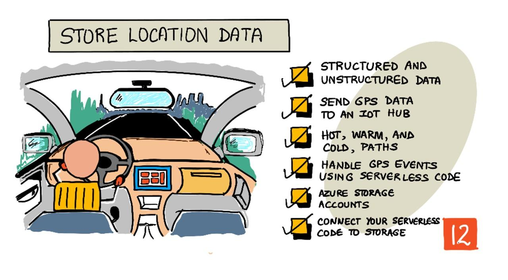
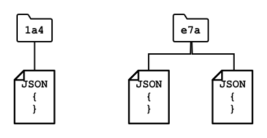

<!--
CO_OP_TRANSLATOR_METADATA:
{
  "original_hash": "e345843ccfeb7261d81500d19c64d476",
  "translation_date": "2025-08-27T14:58:29+00:00",
  "source_file": "3-transport/lessons/2-store-location-data/README.md",
  "language_code": "mr"
}
-->
# स्टोअर स्थान डेटा



> स्केच नोट [नित्या नरसिंहन](https://github.com/nitya) यांनी तयार केले. मोठ्या आवृत्तीसाठी प्रतिमेवर क्लिक करा.

## व्याख्यानपूर्व प्रश्नमंजुषा

[व्याख्यानपूर्व प्रश्नमंजुषा](https://black-meadow-040d15503.1.azurestaticapps.net/quiz/23)

## परिचय

मागील धड्यात, तुम्ही GPS सेन्सर वापरून स्थान डेटा कसा कॅप्चर करायचा हे शिकला. ट्रकच्या प्रवासाचा आणि त्याच्या स्थानाचा व्हिज्युअलायझेशन करण्यासाठी हा डेटा IoT सेवेला क्लाउडमध्ये पाठवावा लागतो आणि नंतर कुठेतरी साठवावा लागतो.

या धड्यात तुम्ही IoT डेटा साठवण्याच्या विविध पद्धतींबद्दल शिकाल आणि सर्व्हरलेस कोड वापरून तुमच्या IoT सेवेतून डेटा कसा साठवायचा हे शिकाल.

या धड्यात आपण शिकणार आहोत:

* [संरचित आणि असंरचित डेटा](../../../../../3-transport/lessons/2-store-location-data)
* [GPS डेटा IoT हबला पाठवा](../../../../../3-transport/lessons/2-store-location-data)
* [हॉट, वॉर्म, आणि कोल्ड पाथ्स](../../../../../3-transport/lessons/2-store-location-data)
* [सर्व्हरलेस कोड वापरून GPS इव्हेंट्स हाताळा](../../../../../3-transport/lessons/2-store-location-data)
* [Azure स्टोरेज अकाउंट्स](../../../../../3-transport/lessons/2-store-location-data)
* [तुमच्या सर्व्हरलेस कोडला स्टोरेजशी जोडा](../../../../../3-transport/lessons/2-store-location-data)

## संरचित आणि असंरचित डेटा

संगणक प्रणाली डेटा हाताळतात, आणि हा डेटा विविध प्रकारच्या स्वरूपात असतो. हा डेटा एकेरी संख्यांपासून मोठ्या मजकूर, व्हिडिओ, प्रतिमा आणि IoT डेटापर्यंत असतो. डेटा प्रामुख्याने दोन प्रकारांमध्ये विभागला जातो - *संरचित* डेटा आणि *असंरचित* डेटा.

* **संरचित डेटा** म्हणजे चांगल्या प्रकारे परिभाषित, कठोर संरचनेसह डेटा जो बदलत नाही आणि सामान्यतः डेटा टेबल्सशी संबंधित असतो. उदाहरणार्थ, एखाद्या व्यक्तीचे नाव, जन्मतारीख आणि पत्त्यासह तपशील.

* **असंरचित डेटा** म्हणजे चांगल्या प्रकारे परिभाषित नसलेला, कठोर संरचनेसह नसलेला डेटा, ज्यामध्ये संरचना वारंवार बदलू शकते. उदाहरणार्थ, लिखित दस्तऐवज किंवा स्प्रेडशीट्स.

✅ संशोधन करा: तुम्हाला संरचित आणि असंरचित डेटाचे आणखी काही उदाहरणे सुचतात का?

> 💁 अर्ध-संरचित डेटा देखील असतो, जो संरचित असतो पण निश्चित टेबल्समध्ये बसत नाही.

IoT डेटा सामान्यतः असंरचित डेटा मानला जातो.

कल्पना करा की तुम्ही मोठ्या व्यावसायिक शेतासाठी वाहनांच्या ताफ्यात IoT उपकरणे जोडत आहात. तुम्हाला वेगवेगळ्या प्रकारच्या वाहनांसाठी वेगवेगळ्या उपकरणांचा वापर करायचा असेल. उदाहरणार्थ:

* ट्रॅक्टरसारख्या शेतातील वाहनांसाठी तुम्हाला GPS डेटा हवा आहे जेणेकरून ते योग्य शेतांवर काम करत आहेत याची खात्री करता येईल.
* गोदामांमध्ये अन्न वाहून नेणाऱ्या डिलिव्हरी ट्रकसाठी तुम्हाला GPS डेटा, वेग आणि प्रवेग डेटा हवा आहे जेणेकरून चालक सुरक्षितपणे चालवत आहे याची खात्री करता येईल, तसेच स्थानिक कायद्यांनुसार कामाच्या तासांचे पालन होत आहे याची खात्री करण्यासाठी ड्राइव्ह ओळख आणि सुरू/थांबवण्याचा डेटा हवा आहे.
* रेफ्रिजरेटेड ट्रकसाठी तुम्हाला तापमान डेटा हवा आहे जेणेकरून अन्न खूप गरम किंवा थंड होऊन खराब होणार नाही याची खात्री करता येईल.

हा डेटा सतत बदलत असतो. उदाहरणार्थ, जर IoT डिव्हाइस ट्रकच्या केबिनमध्ये असेल, तर ट्रेलर बदलल्यावर तो पाठवलेला डेटा बदलू शकतो, जसे की रेफ्रिजरेटेड ट्रेलर वापरल्यावर फक्त तापमान डेटा पाठवणे.

✅ आणखी कोणता IoT डेटा कॅप्चर केला जाऊ शकतो? ट्रक कोणत्या प्रकारचे माल वाहून नेतात आणि देखभाल डेटा याचा विचार करा.

हा डेटा वाहनानुसार बदलतो, परंतु तो सर्व IoT सेवेला प्रक्रिया करण्यासाठी पाठवला जातो. IoT सेवेला हा असंरचित डेटा प्रक्रिया करण्यास सक्षम असणे आवश्यक आहे, तो शोधण्यासाठी किंवा विश्लेषणासाठी साठवणे आवश्यक आहे, परंतु या डेटाच्या वेगवेगळ्या संरचनांसह कार्य करणे आवश्यक आहे.

### SQL विरुद्ध NoSQL स्टोरेज

डेटाबेस म्हणजे डेटा साठवण्यासाठी आणि क्वेरी करण्यासाठी सेवा. डेटाबेस दोन प्रकारचे असतात - SQL आणि NoSQL.

#### SQL डेटाबेस

पहिले डेटाबेस रिलेशनल डेटाबेस मॅनेजमेंट सिस्टम्स (RDBMS) होते, किंवा रिलेशनल डेटाबेस. यांना SQL डेटाबेस असेही म्हणतात कारण त्यांना Structured Query Language (SQL) वापरून डेटा जोडणे, काढणे, अद्यतनित करणे किंवा क्वेरी करणे शक्य होते. हे डेटाबेस एका स्कीमामध्ये असतात - डेटा टेबल्सचा चांगल्या प्रकारे परिभाषित संच, जो स्प्रेडशीटसारखा असतो. प्रत्येक टेबलमध्ये अनेक नाव असलेले कॉलम असतात. डेटा समाविष्ट करताना, तुम्ही टेबलमध्ये एक पंक्ती जोडता, प्रत्येक कॉलममध्ये मूल्ये ठेवता. हे डेटाला खूप कठोर संरचनेत ठेवते - जरी तुम्ही कॉलम रिकामे ठेवू शकता, तरी नवीन कॉलम जोडायचा असल्यास तुम्हाला डेटाबेसवर हे करावे लागते, विद्यमान पंक्त्यांसाठी मूल्ये भरावी लागतात. हे डेटाबेस रिलेशनल असतात - म्हणजे एका टेबलचा दुसऱ्या टेबलशी संबंध असतो.


उदाहरणार्थ, जर तुम्ही युजरचे वैयक्तिक तपशील एका टेबलमध्ये साठवले, तर त्या युजरसाठी काही प्रकारचा अंतर्गत अद्वितीय ID असेल जो त्या युजरचे नाव आणि पत्ता असलेल्या टेबलमधील पंक्तीमध्ये वापरला जाईल. जर तुम्हाला त्या युजरबद्दल इतर तपशील, जसे की त्याच्या खरेदी, दुसऱ्या टेबलमध्ये साठवायचे असतील, तर नवीन टेबलमध्ये त्या युजरच्या ID साठी एक कॉलम असेल. जेव्हा तुम्ही युजर शोधता, तेव्हा तुम्ही त्यांच्या ID चा वापर करून एका टेबलमधून त्यांचे वैयक्तिक तपशील मिळवू शकता आणि दुसऱ्या टेबलमधून त्यांची खरेदी मिळवू शकता.

SQL डेटाबेस संरचित डेटा साठवण्यासाठी आणि तुमचा डेटा तुमच्या स्कीमाशी जुळत असल्याची खात्री करण्यासाठी आदर्श आहेत.

✅ जर तुम्ही SQL वापरले नसेल, तर [SQL पृष्ठ Wikipedia वर](https://wikipedia.org/wiki/SQL) वाचून घ्या.

मायक्रोसॉफ्ट SQL सर्व्हर, MySQL, आणि PostgreSQL हे काही प्रसिद्ध SQL डेटाबेस आहेत.

✅ संशोधन करा: या SQL डेटाबेस आणि त्यांच्या क्षमतांबद्दल वाचा.

#### NoSQL डेटाबेस

NoSQL डेटाबेस यांना NoSQL असे म्हणतात कारण त्यांच्याकडे SQL डेटाबेससारखी कठोर संरचना नसते. त्यांना डॉक्युमेंट डेटाबेस असेही म्हणतात कारण ते असंरचित डेटा जसे की दस्तऐवज साठवू शकतात.

> 💁 त्यांच्या नावाच्या विरोधात, काही NoSQL डेटाबेस तुम्हाला डेटा क्वेरी करण्यासाठी SQL वापरण्याची परवानगी देतात.



NoSQL डेटाबेसमध्ये पूर्वनिर्धारित स्कीमा नसते जी डेटा साठवण्यावर मर्यादा घालते, त्याऐवजी तुम्ही कोणताही असंरचित डेटा समाविष्ट करू शकता, सामान्यतः JSON दस्तऐवज वापरून. हे दस्तऐवज फोल्डर्समध्ये आयोजित केले जाऊ शकतात, जसे की तुमच्या संगणकावरील फायली. प्रत्येक दस्तऐवज इतर दस्तऐवजांपेक्षा वेगळे फील्ड असू शकते - उदाहरणार्थ, जर तुम्ही तुमच्या शेतातील वाहनांमधून IoT डेटा साठवत असाल, तर काहींमध्ये अॅक्सेलरोमीटर आणि वेग डेटा फील्ड असतील, तर इतरांमध्ये ट्रेलरमधील तापमानासाठी फील्ड असतील. जर तुम्ही नवीन प्रकारचा ट्रक जोडला, जसे की वजन मोजण्यासाठी अंगभूत स्केल असलेला ट्रक, तर तुमचे IoT डिव्हाइस हे नवीन फील्ड जोडू शकते आणि ते डेटाबेसमध्ये कोणत्याही बदलांशिवाय साठवले जाऊ शकते.

Azure CosmosDB, MongoDB, आणि CouchDB हे काही प्रसिद्ध NoSQL डेटाबेस आहेत.

✅ संशोधन करा: या NoSQL डेटाबेस आणि त्यांच्या क्षमतांबद्दल वाचा.

या धड्यात, तुम्ही IoT डेटा साठवण्यासाठी NoSQL स्टोरेज वापरणार आहात.

## GPS डेटा IoT हबला पाठवा

मागील धड्यात तुम्ही तुमच्या IoT डिव्हाइसशी जोडलेल्या GPS सेन्सरमधून GPS डेटा कॅप्चर केला. हा IoT डेटा क्लाउडमध्ये साठवण्यासाठी, तुम्हाला तो IoT सेवेला पाठवावा लागेल. पुन्हा एकदा, तुम्ही Azure IoT Hub वापरणार आहात, जो तुम्ही मागील प्रकल्पात वापरला होता.


### कार्य - GPS डेटा IoT हबला पाठवा

1. फ्री टियर वापरून नवीन IoT हब तयार करा.

    > ⚠️ [प्रकल्प 2, धडा 4 मधील IoT हब तयार करण्याच्या सूचना](../../../2-farm/lessons/4-migrate-your-plant-to-the-cloud/README.md#create-an-iot-service-in-the-cloud) आवश्यक असल्यास पहा.

    नवीन रिसोर्स ग्रुप तयार करा. नवीन रिसोर्स ग्रुपचे नाव `gps-sensor` ठेवा, आणि नवीन IoT हबचे नाव `gps-sensor` वर आधारित एक अद्वितीय नाव ठेवा, जसे की `gps-sensor-<तुमचे नाव>`.

    > 💁 जर तुमच्याकडे मागील प्रकल्पातील IoT हब अजूनही असेल, तर तुम्ही ते पुन्हा वापरू शकता. नवीन सेवा तयार करताना त्या IoT हबचे नाव आणि त्याच्या रिसोर्स ग्रुपचे नाव वापरण्याचे लक्षात ठेवा.

1. IoT हबमध्ये नवीन डिव्हाइस जोडा. या डिव्हाइसचे नाव `gps-sensor` ठेवा. डिव्हाइससाठी कनेक्शन स्ट्रिंग मिळवा.

1. तुमचा डिव्हाइस कोड अद्यतनित करा आणि नवीन IoT हबला GPS डेटा पाठवा, मागील टप्प्यातील डिव्हाइस कनेक्शन स्ट्रिंग वापरून.

    > ⚠️ [प्रकल्प 2, धडा 4 मधील तुमचे डिव्हाइस IoT सेवेशी कनेक्ट करण्याच्या सूचना](../../../2-farm/lessons/4-migrate-your-plant-to-the-cloud/README.md#connect-your-device-to-the-iot-service) आवश्यक असल्यास पहा.

1. GPS डेटा JSON स्वरूपात पाठवा:

    ```json
    {
        "gps" :
        {
            "lat" : <latitude>,
            "lon" : <longitude>
        }
    }
    ```

1. दर मिनिटाला GPS डेटा पाठवा जेणेकरून तुमचा दैनिक संदेश कोटा संपणार नाही.

जर तुम्ही Wio Terminal वापरत असाल, तर सर्व आवश्यक लायब्ररी जोडा आणि NTP सर्व्हर वापरून वेळ सेट करा. तुमच्या कोडमध्ये GPS स्थान पाठवण्यापूर्वी सिरीयल पोर्टमधून सर्व डेटा वाचला आहे याची खात्री करण्यासाठी मागील धडातील विद्यमान कोड वापरा. JSON दस्तऐवज तयार करण्यासाठी खालील कोड वापरा:

```cpp
DynamicJsonDocument doc(1024);
doc["gps"]["lat"] = gps.location.lat();
doc["gps"]["lon"] = gps.location.lng();
```

जर तुम्ही व्हर्च्युअल IoT डिव्हाइस वापरत असाल, तर व्हर्च्युअल वातावरण वापरून सर्व आवश्यक लायब्ररी स्थापित करा.

Raspberry Pi आणि व्हर्च्युअल IoT डिव्हाइससाठी, मागील धडातील विद्यमान कोड वापरून अक्षांश आणि रेखांश मूल्ये मिळवा, नंतर खालील कोड वापरून योग्य JSON स्वरूपात पाठवा:

```python
message_json = { "gps" : { "lat":lat, "lon":lon } }
print("Sending telemetry", message_json)
message = Message(json.dumps(message_json))
```

> 💁 तुम्हाला हा कोड [code/wio-terminal](../../../../../3-transport/lessons/2-store-location-data/code/wio-terminal), [code/pi](../../../../../3-transport/lessons/2-store-location-data/code/pi) किंवा [code/virtual-device](../../../../../3-transport/lessons/2-store-location-data/code/virtual-device) फोल्डरमध्ये सापडेल.

तुमचा डिव्हाइस कोड चालवा आणि `az iot hub monitor-events` CLI कमांड वापरून IoT हबमध्ये संदेश प्रवाहित होत आहेत याची खात्री करा.

## हॉट, वॉर्म, आणि कोल्ड पाथ्स

IoT डिव्हाइसवरून क्लाउडमध्ये डेटा प्रवाहित होतो, तो नेहमीच रिअल टाइममध्ये प्रक्रिया केला जात नाही. काही डेटा रिअल टाइममध्ये प्रक्रिया करणे आवश्यक असते, तर काही डेटा थोड्या वेळाने प्रक्रिया केला जाऊ शकतो, आणि काही डेटा खूप उशिरा प्रक्रिया केला जाऊ शकतो. डेटा वेगवेगळ्या सेवांमध्ये प्रवाहित होतो, ज्या वेगवेगळ्या वेळेस डेटा प्रक्रिया करतात, याला हॉट, वॉर्म आणि कोल्ड पाथ्स म्हणतात.

### हॉट पाथ

हॉट पाथ म्हणजे डेटा जो रिअल टाइम किंवा जवळपास रिअल टाइममध्ये प्रक्रिया करणे आवश्यक असते. तुम्ही हॉट पाथ डेटा अलर्टसाठी वापराल, जसे की वाहन डेपोकडे येत आहे किंवा रेफ्रिजरेटेड ट्रकमधील तापमान खूप जास्त आहे याबद्दल अलर्ट मिळवणे.

हॉट पाथ डेटा वापरण्यासाठी, तुमचा कोड तुमच्या क्लाउड सेवांद्वारे प्राप्त झालेल्या इव्हेंट्सना त्वरित प्रतिसाद देईल.

### वॉर्म पाथ

वॉर्म पाथ म्हणजे डेटा जो प्राप्त झाल्यानंतर थोड्या वेळाने प्रक्रिया केला जाऊ शकतो, उदाहरणार्थ रिपोर्टिंग किंवा अल्पकालीन विश्लेषणासाठी. तुम्ही वॉर्म पाथ डेटा दररोजच्या वाहनांच्या मायलेज रिपोर्टसाठी वापराल, जो मागील दिवशी गोळा केलेल्या डेटाचा वापर करतो.

वॉर्म पाथ डेटा क्लाउड सेवेद्वारे प्राप्त झाल्यानंतर अशा प्रकारच्या स्टोरेजमध्ये साठवला जातो, जो पटकन प्रवेशयोग्य असतो.

### कोल्ड पाथ

कोल्ड पाथ म्हणजे ऐतिहासिक डेटा, दीर्घकालीन साठवलेला डेटा जो आवश्यकतेनुसार प्रक्रिया केला जाऊ शकतो. उदाहरणार्थ, तुम्ही कोल्ड पाथ डेटा वार्षिक वाहन मायलेज रिपोर्ट मिळवण्यासाठी किंवा इंधन खर्च कमी करण्यासाठी सर्वात योग्य मार्ग शोधण्यासाठी विश्लेषण चालवण्यासाठी वापरू शकता.

कोल्ड पाथ डेटा डेटा वेअरहाऊसेसमध्ये साठवला जातो - मोठ्या प्रमाणात डेटा साठवण्यासाठी डिझाइन केलेले डेटाबेस, जो कधीही बदलत नाही आणि पटकन क्वेरी केला जाऊ शकतो. तुमच्या क्लाउड अॅप्लिकेशनमध्ये नियमित वेळेवर, दररोज, आठवड्याला किंवा महिन्याला वॉर्म पाथ स्टोरेजमधून डेटा डेटा वेअरहाऊसमध्ये हलवण्यासाठी नियमित जॉब चालवला जातो.

✅ या धड्यांमध्ये तुम्ही आतापर्यंत कॅप्चर केलेल्या डेटाचा विचार करा. तो हॉट, वॉर्म किंवा कोल्ड पाथ डेटा आहे का?

## सर्व्हरलेस कोड वापरून GPS इव्हेंट्स हाताळा

एकदा डेटा तुमच्या IoT हबमध्ये प्रवाहित होऊ लागला की, तुम्ही काही सर्व्हरलेस कोड लिहू शकता जो इव्हेंट-हब सुसंगत एंडपॉइंटवर प्रकाशित झालेल्या इव्हेंट्ससाठी ऐकतो. हा वॉर्म पाथ आहे - हा डेटा साठवला जाईल आणि पुढील धड्यात प्रवासाच्या रिपोर्टिंगसाठी वापरला जाईल.


### कार्य - सर्व्हरलेस कोड वापरून GPS इव्हेंट्स हाताळा

1. Azure Functions CLI वापरून Azure Functions अॅप तयार करा. Python रनटाइम वापरा, आणि `gps-trigger` नावाच्या फोल्डरमध्ये तयार करा, आणि Functions App प्रकल्पाचे नाव देखील `gps-trigger` ठेवा. यासाठी व्हर्च्युअल वातावरण तयार करण्याचे लक्षात ठेवा.
> ⚠️ तुम्ही [Azure Functions प्रोजेक्ट तयार करण्याच्या सूचना प्रोजेक्ट 2, धडा 5](../../../2-farm/lessons/5-migrate-application-to-the-cloud/README.md#create-a-serverless-application) येथे पाहू शकता, जर आवश्यक असेल.
1. IoT Hub च्या Event Hub सुसंगत endpoint वापरणारा IoT Hub इव्हेंट ट्रिगर जोडा.

    > ⚠️ गरज असल्यास [प्रोजेक्ट 2, धडा 5 मधील IoT Hub इव्हेंट ट्रिगर तयार करण्याच्या सूचना](../../../2-farm/lessons/5-migrate-application-to-the-cloud/README.md#create-an-iot-hub-event-trigger) पाहू शकता.

1. `local.settings.json` फाइलमध्ये Event Hub सुसंगत endpoint कनेक्शन स्ट्रिंग सेट करा आणि त्या एंट्रीसाठी की `function.json` फाइलमध्ये वापरा.

1. Azurite अॅप स्थानिक स्टोरेज एम्युलेटर म्हणून वापरा.

1. तुमचे functions app चालवा आणि खात्री करा की ते तुमच्या GPS डिव्हाइसकडून इव्हेंट्स प्राप्त करत आहे. तुमचे IoT डिव्हाइस चालू आहे आणि GPS डेटा पाठवत आहे याची खात्री करा.

    ```output
    Python EventHub trigger processed an event: {"gps": {"lat": 47.73481, "lon": -122.25701}}
    ```

## Azure Storage Accounts


Azure Storage Accounts ही एक सामान्य उद्देशाची स्टोरेज सेवा आहे जी विविध प्रकारे डेटा संग्रहित करू शकते. तुम्ही डेटा blobs, queues, tables किंवा files म्हणून संग्रहित करू शकता, आणि हे सर्व एकाच वेळी करू शकता.

### Blob storage

*Blob* म्हणजे binary large objects, परंतु हे कोणत्याही असंरचित डेटासाठी वापरले जाणारे शब्द बनले आहे. तुम्ही blob storage मध्ये कोणताही डेटा संग्रहित करू शकता, जसे की IoT डेटा असलेले JSON दस्तऐवज, प्रतिमा आणि चित्रपट फाइल्स. Blob storage मध्ये *containers* ही संकल्पना असते, ज्याला buckets म्हणतात, ज्यामध्ये तुम्ही डेटा संग्रहित करू शकता, relational database मधील tables प्रमाणे. या containers मध्ये एक किंवा अधिक फोल्डर्स असू शकतात ज्यामध्ये blobs संग्रहित केले जातात, आणि प्रत्येक फोल्डरमध्ये इतर फोल्डर्स असू शकतात, जसे की तुमच्या संगणकाच्या हार्ड डिस्कवर फाइल्स संग्रहित केल्या जातात.

या धड्यात तुम्ही IoT डेटा संग्रहित करण्यासाठी blob storage वापरणार आहात.

✅ संशोधन करा: [Azure Blob Storage](https://docs.microsoft.com/azure/storage/blobs/storage-blobs-overview?WT.mc_id=academic-17441-jabenn) बद्दल वाचा.

### Table storage

Table storage तुम्हाला अर्ध-संरचित डेटा संग्रहित करण्याची परवानगी देते. Table storage प्रत्यक्षात एक NoSQL डेटाबेस आहे, त्यामुळे यासाठी आधीच परिभाषित केलेल्या tables ची आवश्यकता नसते, परंतु हे डेटा एक किंवा अधिक tables मध्ये संग्रहित करण्यासाठी डिझाइन केलेले आहे, प्रत्येक ओळ परिभाषित करण्यासाठी unique keys सह.

✅ संशोधन करा: [Azure Table Storage](https://docs.microsoft.com/azure/storage/tables/table-storage-overview?WT.mc_id=academic-17441-jabenn) बद्दल वाचा.

### Queue storage

Queue storage तुम्हाला 64KB पर्यंत आकाराचे संदेश एका queue मध्ये संग्रहित करण्याची परवानगी देते. तुम्ही संदेश queue च्या मागील बाजूस जोडू शकता आणि ते पुढील बाजूस वाचू शकता. Queue मध्ये संदेश अनिश्चित काळासाठी संग्रहित केले जातात जोपर्यंत स्टोरेज स्पेस उपलब्ध आहे, त्यामुळे संदेश दीर्घकालीन संग्रहित करण्याची परवानगी मिळते आणि आवश्यकतेनुसार वाचले जाऊ शकते. उदाहरणार्थ, जर तुम्हाला GPS डेटा प्रक्रिया करण्यासाठी मासिक काम चालवायचे असेल तर तुम्ही ते दररोज एका महिन्यासाठी queue मध्ये जोडू शकता आणि नंतर महिन्याच्या शेवटी queue मधून सर्व संदेश प्रक्रिया करू शकता.

✅ संशोधन करा: [Azure Queue Storage](https://docs.microsoft.com/azure/storage/queues/storage-queues-introduction?WT.mc_id=academic-17441-jabenn) बद्दल वाचा.

### File storage

File storage म्हणजे क्लाउडमध्ये फाइल्स संग्रहित करणे, आणि कोणतेही अॅप्स किंवा डिव्हाइस industry standard protocols वापरून कनेक्ट होऊ शकतात. तुम्ही फाइल्स file storage मध्ये लिहू शकता, आणि नंतर तुमच्या PC किंवा Mac वर ड्राइव्ह म्हणून mount करू शकता.

✅ संशोधन करा: [Azure File Storage](https://docs.microsoft.com/azure/storage/files/storage-files-introduction?WT.mc_id=academic-17441-jabenn) बद्दल वाचा.

## तुमच्या serverless कोडला स्टोरेजशी कनेक्ट करा

तुमच्या function app ला आता IoT Hub मधून संदेश blob storage मध्ये संग्रहित करण्यासाठी कनेक्ट करणे आवश्यक आहे. हे करण्याचे 2 मार्ग आहेत:

* function कोडमध्ये, blob storage कनेक्ट करण्यासाठी blob storage Python SDK वापरा आणि डेटा blobs म्हणून लिहा.
* output function binding वापरा ज्यामुळे function च्या return value ला blob storage शी bind केले जाईल आणि blob आपोआप संग्रहित होईल.

या धड्यात, तुम्ही blob storage शी संवाद साधण्यासाठी Python SDK वापरणार आहात.


डेटा खालील स्वरूपात JSON blob म्हणून संग्रहित केला जाईल:

```json
{
    "device_id": <device_id>,
    "timestamp" : <time>,
    "gps" :
    {
        "lat" : <latitude>,
        "lon" : <longitude>
    }
}
```

### कार्य - तुमच्या serverless कोडला स्टोरेजशी कनेक्ट करा

1. Azure Storage account तयार करा. त्याला `gps<तुमचे नाव>` असे काहीतरी नाव द्या.

    > ⚠️ गरज असल्यास [प्रोजेक्ट 2, धडा 5 मधील स्टोरेज account तयार करण्याच्या सूचना](../../../2-farm/lessons/5-migrate-application-to-the-cloud/README.md#task---create-the-cloud-resources) पाहू शकता.

    जर तुमच्याकडे मागील प्रोजेक्टमधून स्टोरेज account असेल, तर तुम्ही ते पुन्हा वापरू शकता.

    > 💁 तुम्ही नंतर या धड्यात तुमचे Azure Functions app तैनात करण्यासाठी समान स्टोरेज account वापरू शकता.

1. स्टोरेज account साठी कनेक्शन स्ट्रिंग मिळवण्यासाठी खालील कमांड चालवा:

    ```sh
    az storage account show-connection-string --output table \
                                              --name <storage_name>
    ```

    `<storage_name>` च्या जागी तुम्ही तयार केलेल्या स्टोरेज account चे नाव बदला.

1. `local.settings.json` फाइलमध्ये तुमच्या स्टोरेज account कनेक्शन स्ट्रिंगसाठी नवीन एंट्री जोडा, आणि त्याला `STORAGE_CONNECTION_STRING` असे नाव द्या.

1. Azure storage Pip packages स्थापित करण्यासाठी `requirements.txt` फाइलमध्ये खालील जोडा:

    ```sh
    azure-storage-blob
    ```

    तुमच्या virtual environment मध्ये या फाइलमधून packages स्थापित करा.

    > जर तुम्हाला त्रुटी आली, तर तुमच्या virtual environment मध्ये Pip ची आवृत्ती नवीनतम आवृत्तीत अपग्रेड करण्यासाठी खालील कमांड वापरा, आणि पुन्हा प्रयत्न करा:
    >
    > ```sh
    > pip install --upgrade pip
    > ```

1. `iot-hub-trigger` साठी `__init__.py` फाइलमध्ये खालील import statements जोडा:

    ```python
    import json
    import os
    import uuid
    from azure.storage.blob import BlobServiceClient, PublicAccess
    ```

    `json` system module JSON वाचण्यासाठी आणि लिहिण्यासाठी वापरले जाईल, `os` system module कनेक्शन स्ट्रिंग वाचण्यासाठी वापरले जाईल, `uuid` system module GPS वाचनासाठी unique ID तयार करण्यासाठी वापरले जाईल.

    `azure.storage.blob` package blob storage शी काम करण्यासाठी Python SDK समाविष्ट करते.

1. `main` पद्धतीच्या आधी खालील helper function जोडा:

    ```python
    def get_or_create_container(name):
        connection_str = os.environ['STORAGE_CONNECTION_STRING']
        blob_service_client = BlobServiceClient.from_connection_string(connection_str)
    
        for container in blob_service_client.list_containers():
            if container.name == name:
                return blob_service_client.get_container_client(container.name)
        
        return blob_service_client.create_container(name, public_access=PublicAccess.Container)
    ```

    Python blob SDK मध्ये container तयार करण्यासाठी helper method नाही जर ते अस्तित्वात नसेल. हा कोड `local.settings.json` फाइलमधून (क्लाउडमध्ये तैनात केल्यानंतर Application Settings मधून) कनेक्शन स्ट्रिंग लोड करतो, नंतर blob storage account शी संवाद साधण्यासाठी `BlobServiceClient` class तयार करतो. नंतर तो blob storage account साठी सर्व containers मध्ये loop करतो, दिलेल्या नावासह एक शोधतो - जर तो सापडला तर तो container शी संवाद साधण्यासाठी `ContainerClient` class परत करतो. जर तो सापडला नाही, तर container तयार केला जातो आणि नवीन container साठी client परत केला जातो.

    नवीन container तयार केल्यावर, blobs query करण्यासाठी सार्वजनिक प्रवेश दिला जातो. पुढील धड्यात GPS डेटा नकाशावर visualize करण्यासाठी याचा वापर केला जाईल.

1. मातीच्या आर्द्रतेसाठी असलेल्या कोडच्या विपरीत, या कोडसह आम्हाला प्रत्येक इव्हेंट संग्रहित करायचा आहे, त्यामुळे `main` function मधील `for event in events:` loop मध्ये, `logging` statement खाली खालील कोड जोडा:

    ```python
    device_id = event.iothub_metadata['connection-device-id']
    blob_name = f'{device_id}/{str(uuid.uuid1())}.json'
    ```

    हा कोड इव्हेंट metadata मधून device ID मिळवतो, आणि नंतर त्याचा वापर blob नाव तयार करण्यासाठी करतो. Blobs फोल्डर्समध्ये संग्रहित केले जाऊ शकतात, आणि device ID फोल्डर नावासाठी वापरला जाईल, त्यामुळे प्रत्येक डिव्हाइसचे सर्व GPS इव्हेंट एका फोल्डरमध्ये असतील. Blob नाव हे फोल्डर, त्यानंतर दस्तऐवजाचे नाव, forward slashes ने वेगळे केलेले, Linux आणि macOS paths प्रमाणे (Windows प्रमाणे देखील, परंतु Windows back slashes वापरतो) असते. दस्तऐवजाचे नाव Python `uuid` module वापरून तयार केलेला unique ID आहे, फाइल प्रकार `json` सह.

    उदाहरणार्थ, `gps-sensor` device ID साठी, blob नाव `gps-sensor/a9487ac2-b9cf-11eb-b5cd-1e00621e3648.json` असू शकते.

1. खालील कोड याखाली जोडा:

    ```python
    container_client = get_or_create_container('gps-data')
    blob = container_client.get_blob_client(blob_name)
    ```

    हा कोड `get_or_create_container` helper class वापरून container client मिळवतो, आणि नंतर blob नाव वापरून blob client object मिळवतो. हे blob clients विद्यमान blobs संदर्भित करू शकतात, किंवा या प्रकरणात, नवीन blob.

1. यानंतर खालील कोड जोडा:

    ```python
    event_body = json.loads(event.get_body().decode('utf-8'))
    blob_body = {
        'device_id' : device_id,
        'timestamp' : event.iothub_metadata['enqueuedtime'],
        'gps': event_body['gps']
    }
    ```

    हे blob storage मध्ये लिहिले जाणारे blob चे body तयार करते. हे JSON दस्तऐवज आहे ज्यामध्ये device ID, IoT Hub वर टेलीमेट्री पाठवण्याचा वेळ, आणि टेलीमेट्रीमधील GPS coordinates आहेत.

    > 💁 संदेश पाठवण्याचा वेळ मिळवण्यासाठी संदेशाचा enqueued time वापरणे महत्त्वाचे आहे, सध्याचा वेळ नाही. जर Functions App चालू नसेल तर संदेश hub वर काही वेळ बसलेला असू शकतो.

1. याखालील कोड जोडा:

    ```python
    logging.info(f'Writing blob to {blob_name} - {blob_body}')
    blob.upload_blob(json.dumps(blob_body).encode('utf-8'))
    ```

    हा कोड blob लिहिले जाणार असल्याचे त्याच्या तपशीलांसह लॉग करतो, आणि नंतर blob body नवीन blob च्या content म्हणून अपलोड करतो.

1. Functions app चालवा. तुम्हाला GPS इव्हेंट्ससाठी blobs लिहिले जात असल्याचे output मध्ये दिसेल:

    ```output
    [2021-05-21T01:31:14.325Z] Python EventHub trigger processed an event: {"gps": {"lat": 47.73092, "lon": -122.26206}}
    ...
    [2021-05-21T01:31:14.351Z] Writing blob to gps-sensor/4b6089fe-ba8d-11eb-bc7b-1e00621e3648.json - {'device_id': 'gps-sensor', 'timestamp': '2021-05-21T00:57:53.878Z', 'gps': {'lat': 47.73092, 'lon': -122.26206}}
    ```

    > 💁 खात्री करा की तुम्ही IoT Hub इव्हेंट मॉनिटर एकाच वेळी चालवत नाही.

> 💁 तुम्ही हा कोड [code/functions](../../../../../3-transport/lessons/2-store-location-data/code/functions) फोल्डरमध्ये शोधू शकता.

### कार्य - अपलोड केलेल्या blobs सत्यापित करा

1. तयार केलेले blobs पाहण्यासाठी, तुम्ही [Azure Storage Explorer](https://azure.microsoft.com/features/storage-explorer/?WT.mc_id=academic-17441-jabenn), एक विनामूल्य साधन जे तुम्हाला तुमचे स्टोरेज accounts पाहण्याची आणि व्यवस्थापित करण्याची परवानगी देते, किंवा CLI वापरू शकता.

    1. CLI वापरण्यासाठी, प्रथम तुम्हाला account key आवश्यक आहे. हा key मिळवण्यासाठी खालील कमांड चालवा:

        ```sh
        az storage account keys list --output table \
                                     --account-name <storage_name>
        ```

        `<storage_name>` च्या जागी स्टोरेज account चे नाव बदला.

        `key1` चे मूल्य कॉपी करा.

    1. कंटेनरमधील blobs सूचीबद्ध करण्यासाठी खालील कमांड चालवा:

        ```sh
        az storage blob list --container-name gps-data \
                             --output table \
                             --account-name <storage_name> \
                             --account-key <key1>
        ```

        `<storage_name>` च्या जागी स्टोरेज account चे नाव बदला, आणि `<key1>` च्या जागी मागील चरणात कॉपी केलेले `key1` चे मूल्य बदला.

        हे कंटेनरमधील सर्व blobs सूचीबद्ध करेल:

        ```output
        Name                                                  Blob Type    Blob Tier    Length    Content Type              Last Modified              Snapshot
        ----------------------------------------------------  -----------  -----------  --------  ------------------------  -------------------------  ----------
        gps-sensor/1810d55e-b9cf-11eb-9f5b-1e00621e3648.json  BlockBlob    Hot          45        application/octet-stream  2021-05-21T00:54:27+00:00
        gps-sensor/18293e46-b9cf-11eb-9f5b-1e00621e3648.json  BlockBlob    Hot          45        application/octet-stream  2021-05-21T00:54:28+00:00
        gps-sensor/1844549c-b9cf-11eb-9f5b-1e00621e3648.json  BlockBlob    Hot          45        application/octet-stream  2021-05-21T00:54:28+00:00
        gps-sensor/1894d714-b9cf-11eb-9f5b-1e00621e3648.json  BlockBlob    Hot          45        application/octet-stream  2021-05-21T00:54:28+00:00
        ```

    1. खालील कमांड वापरून blobs पैकी एक डाउनलोड करा:

        ```sh
        az storage blob download --container-name gps-data \
                                 --account-name <storage_name> \
                                 --account-key <key1> \
                                 --name <blob_name> \
                                 --file <file_name>
        ```

        `<storage_name>` च्या जागी स्टोरेज account चे नाव बदला, आणि `<key1>` च्या जागी मागील चरणात कॉपी केलेले `key1` चे मूल्य बदला.

        `<blob_name>` च्या जागी मागील चरणाच्या output मधील `Name` कॉलममधून पूर्ण नाव, फोल्डर नावासह, बदला. `<file_name>` च्या जागी स्थानिक फाइलचे नाव बदला ज्यामध्ये blob संग्रहित करायचा आहे.

    एकदा डाउनलोड झाल्यावर, तुम्ही JSON फाइल VS Code मध्ये उघडू शकता, आणि तुम्हाला GPS स्थान तपशील असलेला blob दिसेल:

    ```json
    {"device_id": "gps-sensor", "timestamp": "2021-05-21T00:57:53.878Z", "gps": {"lat": 47.73092, "lon": -122.26206}}
    ```

### कार्य - तुमचे Functions App क्लाउडमध्ये तैनात करा

आता तुमचे Function app कार्यरत आहे, तुम्ही ते क्लाउडमध्ये तैनात करू शकता.

1. नवीन Azure Functions app तयार करा, तुम्ही पूर्वी तयार केलेल्या स्टोरेज account वापरून. याला `gps-sensor-` असे काहीतरी नाव द्या आणि शेवटी काही unique identifier जोडा, जसे की काही random शब्द किंवा तुमचे नाव.

    > ⚠️ गरज असल्यास [प्रोजेक्ट 2, धडा 5 मधील Functions app तयार करण्याच्या सूचना](../../../2-farm/lessons/5-migrate-application-to-the-cloud/README.md#task---create-the-cloud-resources) पाहू शकता.

1. `IOT_HUB_CONNECTION_STRING` आणि `STORAGE_CONNECTION_STRING` मूल्ये Application Settings मध्ये अपलोड करा.

    > ⚠️ गरज असल्यास [प्रोजेक्ट 2, धडा 5 मधील Application Settings अपलोड करण्याच्या सूचना](../../../2-farm/lessons/5-migrate-application-to-the-cloud/README.md#task---upload-your-application-settings) पाहू शकता.

1. तुमचे स्थानिक Functions app क्लाउडमध्ये तैनात करा.
> ⚠️ तुम्हाला गरज असल्यास [प्रोजेक्ट 2, धडा 5 मधील तुमचे Functions अॅप डिप्लॉय करण्याच्या सूचना](../../../2-farm/lessons/5-migrate-application-to-the-cloud/README.md#task---deploy-your-functions-app-to-the-cloud) पाहू शकता.
## 🚀 आव्हान

GPS डेटा पूर्णपणे अचूक नसतो, आणि शोधलेली ठिकाणे काही मीटरने चुकीची असू शकतात, विशेषतः बोगद्यांमध्ये आणि उंच इमारतींच्या भागांमध्ये.

सॅटेलाइट नेव्हिगेशनने हे कसे सुधारावे याचा विचार करा? तुमच्या सॅट-नॅव्हकडे कोणता डेटा आहे जो तुमचे स्थान अधिक चांगल्या प्रकारे अंदाज करण्यास मदत करू शकतो?

## व्याख्यानानंतरचा प्रश्नमंजूषा

[व्याख्यानानंतरचा प्रश्नमंजूषा](https://black-meadow-040d15503.1.azurestaticapps.net/quiz/24)

## पुनरावलोकन आणि स्व-अभ्यास

* विकिपीडियाच्या [डेटा मॉडेल पृष्ठावर](https://wikipedia.org/wiki/Data_model) संरचित डेटाबद्दल वाचा
* विकिपीडियाच्या [अर्ध-संरचित डेटा पृष्ठावर](https://wikipedia.org/wiki/Semi-structured_data) अर्ध-संरचित डेटाबद्दल वाचा
* विकिपीडियाच्या [असंरचित डेटा पृष्ठावर](https://wikipedia.org/wiki/Unstructured_data) असंरचित डेटाबद्दल वाचा
* Azure Storage आणि वेगवेगळ्या स्टोरेज प्रकारांबद्दल अधिक माहिती [Azure Storage दस्तऐवज](https://docs.microsoft.com/azure/storage/?WT.mc_id=academic-17441-jabenn) मध्ये वाचा

## असाइनमेंट

[फंक्शन बाइंडिंग्सचा अभ्यास करा](assignment.md)

---

**अस्वीकरण**:  
हा दस्तऐवज AI भाषांतर सेवा [Co-op Translator](https://github.com/Azure/co-op-translator) वापरून भाषांतरित करण्यात आला आहे. आम्ही अचूकतेसाठी प्रयत्नशील असलो तरी, कृपया लक्षात ठेवा की स्वयंचलित भाषांतरांमध्ये त्रुटी किंवा अचूकतेचा अभाव असू शकतो. मूळ भाषेतील दस्तऐवज हा अधिकृत स्रोत मानला जावा. महत्त्वाच्या माहितीसाठी व्यावसायिक मानवी भाषांतराची शिफारस केली जाते. या भाषांतराचा वापर करून उद्भवलेल्या कोणत्याही गैरसमज किंवा चुकीच्या अर्थासाठी आम्ही जबाबदार राहणार नाही.