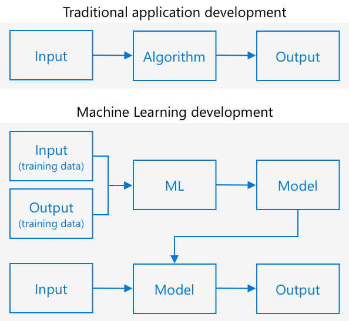

<!--
CO_OP_TRANSLATOR_METADATA:
{
  "original_hash": "f5e63c916d2dd97d58be12aaf76bd9f1",
  "translation_date": "2025-08-27T10:08:26+00:00",
  "source_file": "4-manufacturing/lessons/1-train-fruit-detector/README.md",
  "language_code": "mr"
}
-->
# फळांची गुणवत्ता ओळखणारा डिटेक्टर तयार करा


> स्केच नोट [नित्य नरसिंहन](https://github.com/nitya) यांनी तयार केली आहे. मोठ्या आवृत्तीसाठी प्रतिमेवर क्लिक करा.

या व्हिडिओमध्ये Azure Custom Vision सेवेसाठी आढावा दिला आहे, जी सेवा या धड्यात समाविष्ट केली जाईल.

[](https://www.youtube.com/watch?v=TETcDLJlWR4)

> 🎥 वर दिलेल्या प्रतिमेवर क्लिक करून व्हिडिओ पहा

## पूर्व-व्याख्यान प्रश्नमंजुषा

[पूर्व-व्याख्यान प्रश्नमंजुषा](https://black-meadow-040d15503.1.azurestaticapps.net/quiz/29)

## परिचय

कृत्रिम बुद्धिमत्ता (AI) आणि मशीन लर्निंग (ML) च्या अलीकडील वाढीमुळे आजच्या विकसकांना विविध प्रकारच्या क्षमता उपलब्ध होत आहेत. ML मॉडेल्सना प्रतिमांमधील विविध गोष्टी ओळखण्यासाठी प्रशिक्षण दिले जाऊ शकते, जसे की कच्चे फळ, आणि हे IoT उपकरणांमध्ये वापरले जाऊ शकते जेणेकरून उत्पादनाची छाननी करता येईल, कापणी करताना किंवा कारखाने किंवा गोदामांमध्ये प्रक्रिया करताना.

या धड्यात तुम्ही प्रतिमा वर्गीकरणाबद्दल शिकाल - ML मॉडेल्स वापरून विविध गोष्टींच्या प्रतिमांमध्ये फरक ओळखणे. तुम्ही प्रतिमा वर्गीकर्त्याला चांगल्या फळांमध्ये आणि खराब फळांमध्ये, जसे की कच्चे, जास्त पिकलेले, ठेचलेले किंवा सडलेले, फरक ओळखण्यासाठी प्रशिक्षण देणे शिकाल.

या धड्यात आपण शिकणार आहोत:

* [AI आणि ML वापरून अन्नाची छाननी करणे](../../../../../4-manufacturing/lessons/1-train-fruit-detector)
* [मशीन लर्निंगद्वारे प्रतिमा वर्गीकरण](../../../../../4-manufacturing/lessons/1-train-fruit-detector)
* [प्रतिमा वर्गीकर्त्याला प्रशिक्षण द्या](../../../../../4-manufacturing/lessons/1-train-fruit-detector)
* [तुमच्या प्रतिमा वर्गीकर्त्याची चाचणी घ्या](../../../../../4-manufacturing/lessons/1-train-fruit-detector)
* [तुमच्या प्रतिमा वर्गीकर्त्याला पुन्हा प्रशिक्षण द्या](../../../../../4-manufacturing/lessons/1-train-fruit-detector)

## AI आणि ML वापरून अन्नाची छाननी करणे

जगभरातील लोकसंख्येला अन्न पुरवणे कठीण आहे, विशेषतः अशा किमतीत जे सर्वांसाठी परवडणारे आहे. सर्वात मोठा खर्च म्हणजे मजुरी, त्यामुळे शेतकरी मजुरीचा खर्च कमी करण्यासाठी ऑटोमेशन आणि IoT सारख्या साधनांकडे वळत आहेत. हाताने कापणी करणे मजुरीसाठी खूप मेहनतीचे (आणि अनेकदा पाठदुखीचे काम) असते, आणि श्रीमंत देशांमध्ये याची जागा यंत्रसामग्री घेत आहे. यंत्रसामग्री वापरून कापणी करण्याच्या खर्चात बचत असूनही, एक तोटा आहे - कापणी करताना अन्नाची छाननी करण्याची क्षमता.

सर्व पिके समान रीतीने पिकत नाहीत. उदाहरणार्थ, टोमॅटो अजूनही काही हिरव्या फळांसह वेलावर असू शकतात जेव्हा बहुतेक कापणीसाठी तयार असतात. जरी ही फळे लवकर कापणी करणे वाया जाते, तरीही शेतकऱ्याला यंत्रसामग्री वापरून सर्व काही कापणी करणे आणि नंतर कच्च्या उत्पादनाची विल्हेवाट लावणे स्वस्त आणि सोपे आहे.

✅ शेतात किंवा तुमच्या बागेत किंवा दुकानांमध्ये उगवणारी विविध फळे किंवा भाज्या पाहा. ती सर्व समान पिकलेली आहेत का, किंवा तुम्हाला फरक दिसतो का?

स्वयंचलित कापणीच्या उदयानंतर उत्पादनाची छाननी कापणीपासून कारखान्यात हलवली गेली. अन्न लांब वाहतूक पट्ट्यांवर प्रवास करत असे, जिथे लोकांच्या टीम्स उत्पादनावरून गुणवत्ता मानकांनुसार योग्य नसलेले काहीही काढून टाकत असत. यंत्रसामग्रीमुळे कापणी स्वस्त झाली, परंतु अन्नाची मॅन्युअल छाननी करण्यासाठी अजूनही खर्च होता.


पुढील उत्क्रांती म्हणजे छाननीसाठी मशीन वापरणे, कापणी यंत्रात किंवा प्रक्रिया संयंत्रांमध्ये तयार केलेले. या मशीनच्या पहिल्या पिढीने रंग शोधण्यासाठी ऑप्टिकल सेन्सर्स वापरले, हिरव्या टोमॅटोला लिव्हर्स किंवा हवेच्या फुंक्यांनी कचऱ्याच्या डब्यात ढकलण्यासाठी नियंत्रक वापरले, लाल टोमॅटोला वाहतूक पट्ट्यांच्या नेटवर्कवर पुढे जाण्यासाठी सोडले.

या व्हिडिओमध्ये, टोमॅटो एका वाहतूक पट्ट्यापासून दुसऱ्यावर पडत असताना, हिरवे टोमॅटो शोधले जातात आणि लिव्हर्सद्वारे एका डब्यात टाकले जातात.

✅ या ऑप्टिकल सेन्सर्स योग्यरित्या काम करण्यासाठी तुम्हाला कारखान्यात किंवा शेतात कोणत्या अटींची आवश्यकता असेल?

या छाननी मशीनच्या नवीनतम उत्क्रांती AI आणि ML चा फायदा घेतात, चांगले उत्पादन आणि खराब उत्पादन यामधील फरक ओळखण्यासाठी प्रशिक्षित मॉडेल्स वापरून, केवळ हिरव्या टोमॅटो विरुद्ध लाल यासारख्या स्पष्ट रंग फरकांद्वारेच नव्हे तर रोग किंवा ठेचल्यामुळे होणाऱ्या सूक्ष्म फरकांद्वारे.

## मशीन लर्निंगद्वारे प्रतिमा वर्गीकरण

पारंपरिक प्रोग्रामिंगमध्ये तुम्ही डेटा घेतात, त्या डेटावर अल्गोरिदम लागू करतात आणि आउटपुट मिळवतात. उदाहरणार्थ, मागील प्रकल्पात तुम्ही GPS समन्वय आणि एक जिओफेन्स घेतला, Azure Maps द्वारे प्रदान केलेला अल्गोरिदम लागू केला आणि पॉइंट जिओफेन्सच्या आत आहे की बाहेर आहे याचा निकाल मिळवला. तुम्ही अधिक डेटा इनपुट करता, तुम्हाला अधिक आउटपुट मिळते.



मशीन लर्निंग याला उलट करते - तुम्ही डेटा आणि ज्ञात आउटपुटसह सुरुवात करता, आणि मशीन लर्निंग अल्गोरिदम डेटामधून शिकते. तुम्ही नंतर प्रशिक्षित अल्गोरिदम, ज्याला *मशीन लर्निंग मॉडेल* किंवा *मॉडेल* म्हणतात, घेऊन नवीन डेटा इनपुट करू शकता आणि नवीन आउटपुट मिळवू शकता.

> 🎓 मशीन लर्निंग अल्गोरिदमच्या डेटामधून शिकण्याच्या प्रक्रियेला *प्रशिक्षण* म्हणतात. इनपुट्स आणि ज्ञात आउटपुट्सला *प्रशिक्षण डेटा* म्हणतात.

उदाहरणार्थ, तुम्ही मॉडेलला लाखो कच्च्या केळ्यांच्या प्रतिमा इनपुट प्रशिक्षण डेटा म्हणून देऊ शकता, ज्याचे प्रशिक्षण आउटपुट `कच्चे` असे सेट केले जाईल, आणि लाखो पिकलेल्या केळ्यांच्या प्रतिमा प्रशिक्षण डेटा म्हणून देऊ शकता ज्याचे आउटपुट `पिकलेले` असे सेट केले जाईल. ML अल्गोरिदम नंतर या डेटावर आधारित मॉडेल तयार करेल. तुम्ही नंतर या मॉडेलला केळ्याची नवीन प्रतिमा देता आणि ते नवीन प्रतिमा पिकलेली आहे की कच्ची आहे हे अंदाज लावेल.

> 🎓 ML मॉडेल्सचे निकाल *अंदाज* म्हणून ओळखले जातात.


ML मॉडेल्स द्विआधारी उत्तर देत नाहीत, त्याऐवजी ते संभाव्यता देतात. उदाहरणार्थ, मॉडेलला केळ्याची प्रतिमा दिली जाऊ शकते आणि `पिकलेली` 99.7% आणि `कच्ची` 0.3% असा अंदाज लावला जाऊ शकतो. तुमचा कोड नंतर सर्वोत्तम अंदाज निवडेल आणि ठरवेल की केळी पिकलेली आहे.

प्रतिमा ओळखण्यासाठी वापरले जाणारे ML मॉडेल *प्रतिमा वर्गीकर्ता* म्हणून ओळखले जाते - त्याला लेबल केलेल्या प्रतिमा दिल्या जातात, आणि नंतर या लेबल्सच्या आधारे नवीन प्रतिमांचे वर्गीकरण केले जाते.

> 💁 हे एक अतिसुलभ स्पष्टीकरण आहे, आणि मॉडेल्स प्रशिक्षण देण्यासाठी अनेक इतर पद्धती आहेत ज्यांना नेहमी लेबल केलेले आउटपुट आवश्यक नसते, जसे की अनसुपरव्हाइज्ड लर्निंग. जर तुम्हाला ML बद्दल अधिक शिकायचे असेल, तर [ML for beginners, मशीन लर्निंगवरील 24 धड्यांचा अभ्यासक्रम](https://aka.ms/ML-beginners) पहा.

## प्रतिमा वर्गीकर्त्याला प्रशिक्षण द्या

यशस्वीपणे प्रतिमा वर्गीकर्त्याला प्रशिक्षण देण्यासाठी तुम्हाला लाखो प्रतिमांची आवश्यकता आहे. असे दिसते की, एकदा तुम्ही लाखो किंवा अब्जो विविध प्रतिमांवर प्रशिक्षित केलेला प्रतिमा वर्गीकर्ता तयार केला की, तुम्ही तो पुन्हा वापरू शकता आणि थोड्या प्रतिमांचा संच वापरून पुन्हा प्रशिक्षण देऊ शकता आणि उत्तम परिणाम मिळवू शकता, ज्याला *ट्रान्सफर लर्निंग* म्हणतात.

> 🎓 ट्रान्सफर लर्निंग म्हणजे विद्यमान ML मॉडेलमधील शिक्षण नवीन डेटावर आधारित नवीन मॉडेलमध्ये हस्तांतरित करणे.

एकदा प्रतिमा वर्गीकर्त्याला विविध प्रकारच्या प्रतिमांसाठी प्रशिक्षण दिले गेले की, त्याचे अंतर्गत भाग आकार, रंग आणि नमुने ओळखण्यात उत्कृष्ट असतात. ट्रान्सफर लर्निंग मॉडेलला प्रतिमांचे भाग ओळखण्यात आधीच शिकलेले आहे ते घेण्याची आणि नवीन प्रतिमा ओळखण्यासाठी वापरण्याची परवानगी देते.


तुम्ही याला मुलांच्या आकाराच्या पुस्तकांसारखे समजू शकता, जिथे एकदा तुम्ही अर्धवर्तुळ, आयत आणि त्रिकोण ओळखू शकता, तुम्ही या आकारांच्या कॉन्फिगरेशनवर आधारित बोट किंवा मांजर ओळखू शकता. प्रतिमा वर्गीकर्ता आकार ओळखू शकतो, आणि ट्रान्सफर लर्निंग त्याला कोणते संयोजन बोट किंवा मांजर बनवते - किंवा पिकलेले केळे बनवते हे शिकवते.

यासाठी मदत करणारी अनेक साधने उपलब्ध आहेत, ज्यात क्लाउड-आधारित सेवा समाविष्ट आहेत ज्या तुम्हाला तुमचे मॉडेल प्रशिक्षण देण्यास मदत करू शकतात, नंतर वेब API द्वारे वापरण्यासाठी.

> 💁 या मॉडेल्सना प्रशिक्षण देण्यासाठी खूप संगणकीय शक्ती लागते, सामान्यतः ग्राफिक्स प्रोसेसिंग युनिट्स, किंवा GPUs द्वारे. तुमच्या Xbox वर गेम्स अप्रतिम दिसण्यासाठी वापरले जाणारे तेच विशेष हार्डवेअर मशीन लर्निंग मॉडेल्सना प्रशिक्षण देण्यासाठी वापरले जाऊ शकते. क्लाउड वापरून तुम्ही GPUs असलेल्या शक्तिशाली संगणकांवर वेळ भाड्याने घेऊ शकता, तुम्हाला आवश्यक असलेल्या वेळेसाठी संगणकीय शक्ती मिळवून.

## कस्टम व्हिजन

कस्टम व्हिजन हे प्रतिमा वर्गीकर्त्यांना प्रशिक्षण देण्यासाठी क्लाउड-आधारित साधन आहे. हे तुम्हाला फक्त काही प्रतिमांचा वापर करून वर्गीकर्त्याला प्रशिक्षण देण्याची परवानगी देते. तुम्ही वेब पोर्टल, वेब API किंवा SDK द्वारे प्रतिमा अपलोड करू शकता, प्रत्येक प्रतिमेला त्या प्रतिमेचे वर्गीकरण असलेला *टॅग* देऊ शकता. तुम्ही नंतर मॉडेलला प्रशिक्षण देता, आणि ते किती चांगले कार्य करते हे पाहण्यासाठी त्याची चाचणी घेता. एकदा तुम्ही मॉडेलसाठी समाधानी झाल्यावर, तुम्ही त्याचे आवृत्त्या प्रकाशित करू शकता ज्याचा वेब API किंवा SDK द्वारे प्रवेश केला जाऊ शकतो.


> 💁 तुम्ही प्रत्येक वर्गीकरणासाठी फक्त 5 प्रतिमांसह कस्टम व्हिजन मॉडेलला प्रशिक्षण देऊ शकता, परंतु अधिक चांगले आहे. किमान 30 प्रतिमांसह तुम्हाला चांगले परिणाम मिळू शकतात.

कस्टम व्हिजन Microsoft च्या AI साधनांच्या श्रेणीचा भाग आहे ज्याला Cognitive Services म्हणतात. ही AI साधने आहेत जी प्रशिक्षणाशिवाय किंवा थोड्या प्रशिक्षणासह वापरली जाऊ शकतात. यामध्ये भाषण ओळख आणि भाषांतर, भाषा समज आणि प्रतिमा विश्लेषण समाविष्ट आहे. ही Azure मध्ये सेवांमध्ये मोफत स्तरासह उपलब्ध आहेत.

> 💁 मोफत स्तर मॉडेल तयार करण्यासाठी, त्याला प्रशिक्षण देण्यासाठी आणि नंतर विकास कार्यासाठी वापरण्यासाठी पुरेसा आहे. तुम्ही Microsoft Docs वर [Custom Vision Limits and quotas पृष्ठावर](https://docs.microsoft.com/azure/cognitive-services/custom-vision-service/limits-and-quotas?WT.mc_id=academic-17441-jabenn) मोफत स्तराच्या मर्यादांबद्दल वाचू शकता.

### कार्य - कॉग्निटिव्ह सर्व्हिसेस संसाधन तयार करा

कस्टम व्हिजन वापरण्यासाठी, तुम्हाला Azure मध्ये Azure CLI वापरून दोन कॉग्निटिव्ह सर्व्हिसेस संसाधने तयार करावी लागतील, एक कस्टम व्हिजन प्रशिक्षणासाठी आणि एक कस्टम व्हिजन अंदाजासाठी.

1. या प्रकल्पासाठी `fruit-quality-detector` नावाचा एक Resource Group तयार करा.

1. खालील आदेश वापरून मोफत कस्टम व्हिजन प्रशिक्षण संसाधन तयार करा:

    ```sh
    az cognitiveservices account create --name fruit-quality-detector-training \
                                        --resource-group fruit-quality-detector \
                                        --kind CustomVision.Training \
                                        --sku F0 \
                                        --yes \
                                        --location <location>
    ```

    `<location>` ला Resource Group तयार करताना वापरलेल्या स्थानाने बदला.

    हे तुमच्या Resource Group मध्ये कस्टम व्हिजन प्रशिक्षण संसाधन तयार करेल. याला `fruit-quality-detector-training` असे नाव दिले जाईल आणि `F0` sku वापरले जाईल, जे मोफत स्तर आहे. `--yes` पर्यायाचा अर्थ तुम्ही कॉग्निटिव्ह सर्व्हिसेसच्या अटी आणि शर्तींशी सहमत आहात.

> 💁 जर तुम्ही आधीच कॉग्निटिव्ह सर्व्हिसेसपैकी कोणत्याही मोफत खात्याचा वापर करत असाल तर `S0` sku वापरा.

1. खालील आदेश वापरून मोफत कस्टम व्हिजन अंदाज संसाधन तयार करा:

    ```sh
    az cognitiveservices account create --name fruit-quality-detector-prediction \
                                        --resource-group fruit-quality-detector \
                                        --kind CustomVision.Prediction \
                                        --sku F0 \
                                        --yes \
                                        --location <location>
    ```

    `<location>` ला Resource Group तयार करताना वापरलेल्या स्थानाने बदला.

    हे तुमच्या Resource Group मध्ये कस्टम व्हिजन अंदाज संसाधन तयार करेल. याला `fruit-quality-detector-prediction` असे नाव दिले जाईल आणि `F0` sku वापरले जाईल, जे मोफत स्तर आहे. `--yes` पर्यायाचा अर्थ तुम्ही कॉग्निटिव्ह सर्व्हिसेसच्या अटी आणि शर्तींशी सहमत आहात.

### कार्य - प्रतिमा वर्गीकर्ता प्रकल्प तयार करा

1. [CustomVision.ai](https://customvision.ai) येथे कस्टम व्हिजन पोर्टल सुरू करा, आणि तुमच्या Azure खात्यासाठी वापरलेल्या Microsoft खात्याने साइन इन करा.

1. Microsoft Docs वर [build a classifier quickstart च्या नवीन प्रकल्प तयार करण्याच्या विभागाचे](https://docs.microsoft.com/azure/cognitive-services/custom-vision-service/getting-started-build-a-classifier?WT.mc_id=academic-17441-jabenn#create-a-new-project) अनुसरण करा आणि नवीन कस्टम व्हिजन प्रकल्प तयार करा. UI बदलू शकतो आणि हे Docs नेहमी सर्वात अद्ययावत संदर्भ असतात.

    तुमच्या प्रकल्पाला `fruit-quality-detector` असे नाव द्या.

    प्रकल्प तयार करताना, तुम्ही पूर्वी तयार केलेल्या `fruit-quality-detector-training` संसाधनाचा वापर करा. *Classification* प्रकल्प प्रकार, *Multiclass* वर्गीकरण प्रकार, आणि *Food* डोमेन वापरा.

    ![कस्टम व्हिजन प्रकल्पासाठी सेटिंग्ज, नाव `fruit-quality-detector`, वर्णन नाही, संसाधन `fruit-quality-detector-training`, प्रकल्प प्रकार `classification`,
💁 हे वर्गीकरण करणारे साधन कोणत्याही गोष्टींच्या प्रतिमा वर्गीकृत करू शकतात, त्यामुळे जर तुमच्याकडे वेगवेगळ्या गुणवत्तेची फळे उपलब्ध नसतील, तर तुम्ही दोन वेगवेगळ्या प्रकारची फळे किंवा मांजरे आणि कुत्रे वापरू शकता!
प्रत्येक चित्रात फक्त फळ असावे, एकसारखा पार्श्वभूमी असावा किंवा विविध प्रकारच्या पार्श्वभूमी असाव्या. पार्श्वभूमीत असे काहीही नसावे जे पिकलेले किंवा न पिकलेले फळ ओळखण्यासाठी विशिष्ट असेल.

> 💁 प्रत्येक टॅगसाठी वर्गीकरण करताना विशिष्ट पार्श्वभूमी किंवा संबंधित नसलेल्या वस्तू नसणे महत्त्वाचे आहे, अन्यथा वर्गीकरण फक्त पार्श्वभूमीवर आधारित होऊ शकते. त्वचेच्या कर्करोगासाठी एक वर्गीकरणकर्ता तयार करण्यात आला होता ज्यामध्ये सामान्य आणि कर्करोगग्रस्त मोल्स होते, आणि कर्करोगग्रस्त मोल्समध्ये आकार मोजण्यासाठी रूलर्स होते. वर्गीकरणकर्त्याने जवळजवळ 100% अचूकतेने चित्रांमधील रूलर्स ओळखले, पण कर्करोगग्रस्त मोल्स नाही.

इमेज वर्गीकरणकर्ते खूप कमी रिझोल्यूशनवर चालतात. उदाहरणार्थ, Custom Vision प्रशिक्षण आणि अंदाजासाठी 10240x10240 पर्यंत चित्रे घेऊ शकते, पण मॉडेल 227x227 आकाराच्या चित्रांवर प्रशिक्षण देते आणि चालते. मोठ्या चित्रांना या आकारात कमी केले जाते, त्यामुळे तुम्ही वर्गीकृत करत असलेली गोष्ट चित्रात मोठ्या भागात असावी, अन्यथा ती वर्गीकरणकर्त्याने वापरलेल्या छोट्या चित्रात खूप लहान होऊ शकते.

1. तुमच्या वर्गीकरणकर्त्यासाठी चित्रे गोळा करा. प्रत्येक लेबलसाठी वर्गीकरणकर्त्याला प्रशिक्षण देण्यासाठी किमान 5 चित्रे आवश्यक असतील, पण जितकी जास्त तितके चांगले. तुम्हाला वर्गीकरणकर्त्याची चाचणी घेण्यासाठी काही अतिरिक्त चित्रे देखील आवश्यक असतील. ही चित्रे एकाच गोष्टीची वेगवेगळी चित्रे असावीत. उदाहरणार्थ:

    * 2 पिकलेल्या केळ्यांचा वापर करून, प्रत्येक केळ्याचे वेगवेगळ्या कोनातून काही चित्रे घ्या, किमान 7 चित्रे (5 प्रशिक्षणासाठी, 2 चाचणीसाठी), पण शक्यतो अधिक.

        

    * 2 न पिकलेल्या केळ्यांसाठीही हाच प्रक्रिया पुन्हा करा.

    तुम्ही किमान 10 प्रशिक्षण चित्रे गोळा केली पाहिजेत, ज्यामध्ये किमान 5 पिकलेली आणि 5 न पिकलेली, आणि 4 चाचणी चित्रे, 2 पिकलेली, 2 न पिकलेली. तुमची चित्रे png किंवा jpeg स्वरूपात असावीत, 6MB पेक्षा लहान. उदाहरणार्थ, जर तुम्ही iPhone वापरून चित्रे तयार केली तर ती उच्च-रिझोल्यूशन HEIC स्वरूपात असू शकतात, त्यामुळे ती रूपांतरित आणि कमी आकारात करावी लागतील. जितकी जास्त चित्रे तितके चांगले, आणि पिकलेल्या आणि न पिकलेल्या फळांची संख्या समान असावी.

    जर तुमच्याकडे पिकलेली आणि न पिकलेली फळे नसतील, तर तुम्ही वेगवेगळ्या फळांचा वापर करू शकता, किंवा तुमच्याकडे उपलब्ध असलेल्या कोणत्याही दोन वस्तूंचा वापर करू शकता. तुम्ही [images](../../../../../4-manufacturing/lessons/1-train-fruit-detector/images) फोल्डरमध्ये पिकलेल्या आणि न पिकलेल्या केळ्यांची उदाहरण चित्रे देखील शोधू शकता.

1. [Microsoft docs वर वर्गीकरणकर्ता तयार करण्याच्या क्विकस्टार्टमधील चित्रे अपलोड आणि टॅग करण्याचा विभाग](https://docs.microsoft.com/azure/cognitive-services/custom-vision-service/getting-started-build-a-classifier?WT.mc_id=academic-17441-jabenn#upload-and-tag-images) अनुसरा आणि तुमची प्रशिक्षण चित्रे अपलोड करा. पिकलेल्या फळांना `ripe` म्हणून टॅग करा, आणि न पिकलेल्या फळांना `unripe` म्हणून टॅग करा.

    

1. [Microsoft docs वर वर्गीकरणकर्ता प्रशिक्षण विभाग](https://docs.microsoft.com/azure/cognitive-services/custom-vision-service/getting-started-build-a-classifier?WT.mc_id=academic-17441-jabenn#train-the-classifier) अनुसरा आणि तुमच्या अपलोड केलेल्या चित्रांवर इमेज वर्गीकरणकर्त्याला प्रशिक्षण द्या.

    तुम्हाला प्रशिक्षण प्रकार निवडण्याचा पर्याय दिला जाईल. **Quick Training** निवडा.

वर्गीकरणकर्ता प्रशिक्षण घेईल. प्रशिक्षण पूर्ण होण्यासाठी काही मिनिटे लागतील.

> 🍌 जर तुम्ही वर्गीकरणकर्ता प्रशिक्षण घेत असताना तुमचे फळ खाण्याचा विचार करत असाल, तर आधी चाचणीसाठी पुरेसे चित्रे असल्याची खात्री करा!

## तुमचा इमेज वर्गीकरणकर्ता चाचणी करा

एकदा तुमचा वर्गीकरणकर्ता प्रशिक्षित झाल्यावर, तुम्ही त्याला वर्गीकृत करण्यासाठी नवीन चित्र देऊन चाचणी करू शकता.

### कार्य - तुमचा इमेज वर्गीकरणकर्ता चाचणी करा

1. [Microsoft docs वर तुमचा मॉडेल चाचणी करण्याचे दस्तऐवज](https://docs.microsoft.com/azure/cognitive-services/custom-vision-service/test-your-model?WT.mc_id=academic-17441-jabenn#test-your-model) अनुसरा आणि तुमचा इमेज वर्गीकरणकर्ता चाचणी करा. तुम्ही आधी तयार केलेली चाचणी चित्रे वापरा, प्रशिक्षणासाठी वापरलेली कोणतीही चित्रे वापरू नका.

    

1. तुमच्याकडे असलेल्या सर्व चाचणी चित्रांची चाचणी करा आणि संभाव्यता निरीक्षण करा.

## तुमचा इमेज वर्गीकरणकर्ता पुन्हा प्रशिक्षित करा

तुम्ही तुमचा वर्गीकरणकर्ता चाचणी करत असताना, तो अपेक्षित निकाल देत नसेल. इमेज वर्गीकरणकर्ते मशीन लर्निंग वापरून अंदाज करतात की चित्रात काय आहे, विशिष्ट वैशिष्ट्ये विशिष्ट लेबलशी जुळतात यावर आधारित संभाव्यता वापरून. त्याला चित्रात काय आहे हे समजत नाही - त्याला केळे काय आहे किंवा केळे बोटाऐवजी केळे बनवणारे काय आहे हे समजत नाही. तुम्ही चुकीच्या चित्रांसह पुन्हा प्रशिक्षण देऊन तुमचा वर्गीकरणकर्ता सुधारू शकता.

प्रत्येक वेळी तुम्ही क्विक टेस्ट पर्याय वापरून अंदाज करता, चित्र आणि निकाल संग्रहित केले जातात. तुम्ही या चित्रांचा वापर तुमचा मॉडेल पुन्हा प्रशिक्षित करण्यासाठी करू शकता.

### कार्य - तुमचा इमेज वर्गीकरणकर्ता पुन्हा प्रशिक्षित करा

1. [Microsoft docs वर अंदाज केलेल्या चित्राचा प्रशिक्षणासाठी वापर करण्याचे दस्तऐवज](https://docs.microsoft.com/azure/cognitive-services/custom-vision-service/test-your-model?WT.mc_id=academic-17441-jabenn#use-the-predicted-image-for-training) अनुसरा आणि प्रत्येक चित्रासाठी योग्य टॅग वापरून तुमचा मॉडेल पुन्हा प्रशिक्षित करा.

1. एकदा तुमचा मॉडेल पुन्हा प्रशिक्षित झाल्यावर, नवीन चित्रांवर चाचणी करा.

---

## 🚀 आव्हान

तुम्ही केळ्यांवर प्रशिक्षित केलेल्या मॉडेलसह स्ट्रॉबेरीचे चित्र, किंवा फुगवलेले केळे, किंवा केळ्याच्या पोशाखात असलेली व्यक्ती, किंवा अगदी पिवळ्या रंगाचा कार्टून पात्र जसे सिम्पसन्समधील कोणीतरी वापरल्यास काय होईल असे तुम्हाला वाटते?

हे करून पहा आणि अंदाज काय आहेत ते पहा. तुम्ही [Bing Image search](https://www.bing.com/images/trending) वापरून प्रयत्न करण्यासाठी चित्रे शोधू शकता.

## व्याख्यानानंतरचा क्विझ

[व्याख्यानानंतरचा क्विझ](https://black-meadow-040d15503.1.azurestaticapps.net/quiz/30)

## पुनरावलोकन आणि स्व-अभ्यास

* तुम्ही तुमचा वर्गीकरणकर्ता प्रशिक्षित करत असताना, तुम्हाला *Precision*, *Recall*, आणि *AP* चे मूल्य दिसले असेल जे तयार केलेल्या मॉडेलचे मूल्यांकन करतात. [Microsoft docs वर वर्गीकरणकर्ता मूल्यांकन विभाग](https://docs.microsoft.com/azure/cognitive-services/custom-vision-service/getting-started-build-a-classifier?WT.mc_id=academic-17441-jabenn#evaluate-the-classifier) वापरून या मूल्यांबद्दल वाचा.
* [Microsoft docs वर तुमचा Custom Vision मॉडेल सुधारण्याचे कसे करावे](https://docs.microsoft.com/azure/cognitive-services/custom-vision-service/getting-started-improving-your-classifier?WT.mc_id=academic-17441-jabenn) याबद्दल वाचा.

## असाइनमेंट

[अनेक फळे आणि भाज्यांसाठी तुमचा वर्गीकरणकर्ता प्रशिक्षित करा](assignment.md)

---

**अस्वीकरण**:  
हा दस्तऐवज AI भाषांतर सेवा [Co-op Translator](https://github.com/Azure/co-op-translator) वापरून भाषांतरित करण्यात आला आहे. आम्ही अचूकतेसाठी प्रयत्नशील असलो तरी कृपया लक्षात ठेवा की स्वयंचलित भाषांतरांमध्ये त्रुटी किंवा अचूकतेचा अभाव असू शकतो. मूळ भाषेतील दस्तऐवज हा अधिकृत स्रोत मानला जावा. महत्त्वाच्या माहितीसाठी व्यावसायिक मानवी भाषांतराची शिफारस केली जाते. या भाषांतराचा वापर करून निर्माण होणाऱ्या कोणत्याही गैरसमज किंवा चुकीच्या अर्थासाठी आम्ही जबाबदार राहणार नाही.