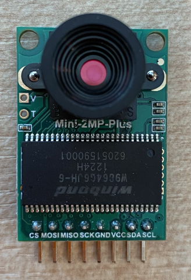
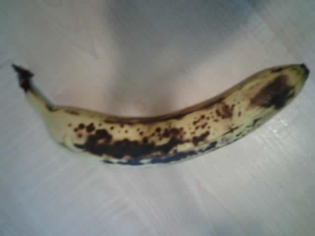

<!--
CO_OP_TRANSLATOR_METADATA:
{
  "original_hash": "160be8c0f558687f6686dca64f10f739",
  "translation_date": "2025-08-27T10:27:15+00:00",
  "source_file": "4-manufacturing/lessons/2-check-fruit-from-device/wio-terminal-camera.md",
  "language_code": "mr"
}
-->
# प्रतिमा कॅप्चर करा - Wio Terminal

या धड्याच्या भागात, तुम्ही Wio Terminal ला कॅमेरा जोडाल आणि त्यातून प्रतिमा कॅप्चर कराल.

## हार्डवेअर

Wio Terminal साठी कॅमेरा आवश्यक आहे.

तुम्ही वापरणारा कॅमेरा [ArduCam Mini 2MP Plus](https://www.arducam.com/product/arducam-2mp-spi-camera-b0067-arduino/) आहे. हा 2 मेगापिक्सेल कॅमेरा OV2640 इमेज सेन्सरवर आधारित आहे. तो SPI इंटरफेसद्वारे संवाद साधतो आणि प्रतिमा कॅप्चर करतो, तसेच I2C सेन्सर कॉन्फिगर करण्यासाठी वापरतो.

## कॅमेरा कनेक्ट करा

ArduCam मध्ये Grove सॉकेट नाही, त्याऐवजी तो SPI आणि I2C बस GPIO पिन्सद्वारे Wio Terminal शी जोडतो.

### कार्य - कॅमेरा कनेक्ट करा

कॅमेरा कनेक्ट करा.



1. ArduCam च्या तळाशी असलेल्या पिन्स Wio Terminal च्या GPIO पिन्सशी जोडल्या पाहिजेत. योग्य पिन्स शोधणे सोपे करण्यासाठी, Wio Terminal सोबत येणारा GPIO पिन स्टिकर पिन्सभोवती लावा:

    

1. जंपर वायर वापरून खालील कनेक्शन करा:

    | ArduCAM पिन | Wio Terminal पिन | वर्णन                                   |
    | ----------- | ---------------- | --------------------------------------- |
    | CS          | 24 (SPI_CS)      | SPI चिप सिलेक्ट                         |
    | MOSI        | 19 (SPI_MOSI)    | SPI कंट्रोलर आउटपुट, पेरिफेरल इनपुट     |
    | MISO        | 21 (SPI_MISO)    | SPI कंट्रोलर इनपुट, पेरिफेरल आउटपुट     |
    | SCK         | 23 (SPI_SCLK)    | SPI सिरियल क्लॉक                        |
    | GND         | 6 (GND)          | ग्राउंड - 0V                            |
    | VCC         | 4 (5V)           | 5V पॉवर सप्लाय                          |
    | SDA         | 3 (I2C1_SDA)     | I2C सिरियल डेटा                         |
    | SCL         | 5 (I2C1_SCL)     | I2C सिरियल क्लॉक                        |

    

    GND आणि VCC कनेक्शन ArduCam ला 5V पॉवर सप्लाय प्रदान करतात. तो 5V वर चालतो, Grove सेन्सर्सच्या विपरीत जे 3V वर चालतात. हे पॉवर थेट USB-C कनेक्शनमधून येते जे डिव्हाइसला पॉवर पुरवते.

    > 💁 SPI कनेक्शनसाठी ArduCam आणि Wio Terminal पिन लेबल्स कोडमध्ये जुन्या नामकरण पद्धतीचा वापर करतात. या धड्याच्या सूचना नवीन नामकरण पद्धतीचा वापर करतील, फक्त कोडमध्ये पिन नावे वापरली जातात तेव्हा वगळता.

1. आता तुम्ही Wio Terminal तुमच्या संगणकाशी कनेक्ट करू शकता.

## कॅमेरा कनेक्ट करण्यासाठी डिव्हाइस प्रोग्राम करा

आता Wio Terminal ला जोडलेल्या ArduCAM कॅमेरा वापरण्यासाठी प्रोग्राम करता येईल.

### कार्य - कॅमेरा कनेक्ट करण्यासाठी डिव्हाइस प्रोग्राम करा

1. PlatformIO वापरून एक नवीन Wio Terminal प्रोजेक्ट तयार करा. या प्रोजेक्टचे नाव `fruit-quality-detector` ठेवा. `setup` फंक्शनमध्ये सिरियल पोर्ट कॉन्फिगर करण्यासाठी कोड जोडा.

1. WiFi शी कनेक्ट होण्यासाठी कोड जोडा, तुमच्या WiFi क्रेडेन्शियल्स `config.h` नावाच्या फाइलमध्ये ठेवा. `platformio.ini` फाइलमध्ये आवश्यक लायब्ररी जोडायला विसरू नका.

1. ArduCam लायब्ररी Arduino लायब्ररी म्हणून उपलब्ध नाही जी `platformio.ini` फाइलमधून स्थापित केली जाऊ शकते. त्याऐवजी ती त्यांच्या GitHub पेजवरून स्रोत म्हणून स्थापित करावी लागेल. तुम्ही हे खालीलपैकी एक करून मिळवू शकता:

    * [https://github.com/ArduCAM/Arduino.git](https://github.com/ArduCAM/Arduino.git) वरून रेपो क्लोन करा
    * GitHub वर रेपोला [github.com/ArduCAM/Arduino](https://github.com/ArduCAM/Arduino) येथे जा आणि **Code** बटणावरून कोड झिप स्वरूपात डाउनलोड करा

1. तुम्हाला फक्त `ArduCAM` फोल्डरची आवश्यकता आहे. संपूर्ण फोल्डर तुमच्या प्रोजेक्टच्या `lib` फोल्डरमध्ये कॉपी करा.

    > ⚠️ संपूर्ण फोल्डर कॉपी करणे आवश्यक आहे, त्यामुळे कोड `lib/ArduCam` मध्ये असेल. फक्त `ArduCam` फोल्डरची सामग्री `lib` फोल्डरमध्ये कॉपी करू नका, संपूर्ण फोल्डर कॉपी करा.

1. ArduCam लायब्ररी कोड अनेक प्रकारच्या कॅमेरासाठी कार्य करते. तुम्ही वापरू इच्छित असलेल्या कॅमेराचा प्रकार कंपाइलर फ्लॅग्स वापरून कॉन्फिगर केला जातो - यामुळे लायब्ररी लहान ठेवली जाते कारण तुम्ही वापरत नसलेल्या कॅमेरासाठी कोड काढून टाकला जातो. OV2640 कॅमेरासाठी लायब्ररी कॉन्फिगर करण्यासाठी, `platformio.ini` फाइलच्या शेवटी खालील कोड जोडा:

    ```ini
    build_flags =
        -DARDUCAM_SHIELD_V2
        -DOV2640_CAM
    ```

    हे 2 कंपाइलर फ्लॅग्स सेट करते:

      * `ARDUCAM_SHIELD_V2` लायब्ररीला कॅमेरा Arduino बोर्डवर असल्याचे सांगते.
      * `OV2640_CAM` लायब्ररीला फक्त OV2640 कॅमेरासाठी कोड समाविष्ट करण्यास सांगते.

1. `src` फोल्डरमध्ये `camera.h` नावाचा हेडर फाइल जोडा. यात कॅमेराशी संवाद साधण्यासाठी कोड असेल. या फाइलमध्ये खालील कोड जोडा:

    ```cpp
    #pragma once
    
    #include <ArduCAM.h>
    #include <Wire.h>
    
    class Camera
    {
    public:
        Camera(int format, int image_size) : _arducam(OV2640, PIN_SPI_SS)
        {
            _format = format;
            _image_size = image_size;
        }
    
        bool init()
        {
            // Reset the CPLD
            _arducam.write_reg(0x07, 0x80);
            delay(100);
    
            _arducam.write_reg(0x07, 0x00);
            delay(100);
    
            // Check if the ArduCAM SPI bus is OK
            _arducam.write_reg(ARDUCHIP_TEST1, 0x55);
            if (_arducam.read_reg(ARDUCHIP_TEST1) != 0x55)
            {
                return false;
            }
                
            // Change MCU mode
            _arducam.set_mode(MCU2LCD_MODE);
    
            uint8_t vid, pid;
    
            // Check if the camera module type is OV2640
            _arducam.wrSensorReg8_8(0xff, 0x01);
            _arducam.rdSensorReg8_8(OV2640_CHIPID_HIGH, &vid);
            _arducam.rdSensorReg8_8(OV2640_CHIPID_LOW, &pid);
            if ((vid != 0x26) && ((pid != 0x41) || (pid != 0x42)))
            {
                return false;
            }
            
            _arducam.set_format(_format);
            _arducam.InitCAM();
            _arducam.OV2640_set_JPEG_size(_image_size);
            _arducam.OV2640_set_Light_Mode(Auto);
            _arducam.OV2640_set_Special_effects(Normal);
            delay(1000);
    
            return true;
        }
    
        void startCapture()
        {
            _arducam.flush_fifo();
            _arducam.clear_fifo_flag();
            _arducam.start_capture();
        }
    
        bool captureReady()
        {
            return _arducam.get_bit(ARDUCHIP_TRIG, CAP_DONE_MASK);
        }
    
        bool readImageToBuffer(byte **buffer, uint32_t &buffer_length)
        {
            if (!captureReady()) return false;
    
            // Get the image file length
            uint32_t length = _arducam.read_fifo_length();
            buffer_length = length;
    
            if (length >= MAX_FIFO_SIZE)
            {
                return false;
            }
            if (length == 0)
            {
                return false;
            }
    
            // create the buffer
            byte *buf = new byte[length];
    
            uint8_t temp = 0, temp_last = 0;
            int i = 0;
            uint32_t buffer_pos = 0;
            bool is_header = false;
    
            _arducam.CS_LOW();
            _arducam.set_fifo_burst();
            
            while (length--)
            {
                temp_last = temp;
                temp = SPI.transfer(0x00);
                //Read JPEG data from FIFO
                if ((temp == 0xD9) && (temp_last == 0xFF)) //If find the end ,break while,
                {
                    buf[buffer_pos] = temp;
    
                    buffer_pos++;
                    i++;
                    
                    _arducam.CS_HIGH();
                }
                if (is_header == true)
                {
                    //Write image data to buffer if not full
                    if (i < 256)
                    {
                        buf[buffer_pos] = temp;
                        buffer_pos++;
                        i++;
                    }
                    else
                    {
                        _arducam.CS_HIGH();
    
                        i = 0;
                        buf[buffer_pos] = temp;
    
                        buffer_pos++;
                        i++;
    
                        _arducam.CS_LOW();
                        _arducam.set_fifo_burst();
                    }
                }
                else if ((temp == 0xD8) & (temp_last == 0xFF))
                {
                    is_header = true;
    
                    buf[buffer_pos] = temp_last;
                    buffer_pos++;
                    i++;
    
                    buf[buffer_pos] = temp;
                    buffer_pos++;
                    i++;
                }
            }
            
            _arducam.clear_fifo_flag();
    
            _arducam.set_format(_format);
            _arducam.InitCAM();
            _arducam.OV2640_set_JPEG_size(_image_size);
    
            // return the buffer
            *buffer = buf;
        }
    
    private:
        ArduCAM _arducam;
        int _format;
        int _image_size;
    };
    ```

    हा लो लेव्हल कोड ArduCam लायब्ररी वापरून कॅमेरा कॉन्फिगर करतो आणि आवश्यक असल्यास SPI बस वापरून प्रतिमा काढतो. हा कोड ArduCam साठी खूप विशिष्ट आहे, त्यामुळे तुम्हाला सध्या त्याच्या कार्यपद्धतीची चिंता करण्याची गरज नाही.

1. `main.cpp` मध्ये, इतर `include` स्टेटमेंट्सखाली हा नवीन फाइल समाविष्ट करण्यासाठी आणि कॅमेरा क्लासचे उदाहरण तयार करण्यासाठी खालील कोड जोडा:

    ```cpp
    #include "camera.h"

    Camera camera = Camera(JPEG, OV2640_640x480);
    ```

    हे `Camera` तयार करते जे प्रतिमा JPEG स्वरूपात 640x480 रिझोल्यूशनवर सेव्ह करते. जरी उच्च रिझोल्यूशन समर्थित असले (3280x2464 पर्यंत), प्रतिमा वर्गीकरणासाठी खूप लहान प्रतिमा (227x227) आवश्यक असतात, त्यामुळे मोठ्या प्रतिमा कॅप्चर आणि पाठवण्याची गरज नाही.

1. कॅमेरा सेटअप करण्यासाठी फंक्शन परिभाषित करण्यासाठी खालील कोड जोडा:

    ```cpp
    void setupCamera()
    {
        pinMode(PIN_SPI_SS, OUTPUT);
        digitalWrite(PIN_SPI_SS, HIGH);
    
        Wire.begin();
        SPI.begin();
    
        if (!camera.init())
        {
            Serial.println("Error setting up the camera!");
        }
    }
    ```

    `setupCamera` फंक्शन SPI चिप सिलेक्ट पिन (`PIN_SPI_SS`) उच्च म्हणून कॉन्फिगर करून सुरू होते, ज्यामुळे Wio Terminal SPI कंट्रोलर बनतो. त्यानंतर I2C आणि SPI बस सुरू करते. शेवटी, कॅमेरा क्लास प्रारंभ करते जो कॅमेरा सेन्सर सेटिंग्ज कॉन्फिगर करतो आणि सर्व काही योग्य प्रकारे वायर केले आहे याची खात्री करतो.

1. `setup` फंक्शनच्या शेवटी हे फंक्शन कॉल करा:

    ```cpp
    setupCamera();
    ```

1. हा कोड बिल्ड आणि अपलोड करा आणि सिरियल मॉनिटरमधून आउटपुट तपासा. जर तुम्हाला `Error setting up the camera!` दिसत असेल तर ArduCam च्या योग्य GPIO पिन्सशी सर्व केबल्स कनेक्ट आहेत याची खात्री करण्यासाठी वायरिंग तपासा आणि सर्व जंपर केबल्स योग्य प्रकारे बसवलेल्या आहेत याची खात्री करा.

## प्रतिमा कॅप्चर करा

आता Wio Terminal प्रोग्राम करून बटण दाबल्यावर प्रतिमा कॅप्चर करता येईल.

### कार्य - प्रतिमा कॅप्चर करा

1. मायक्रोकंट्रोलर्स तुमचा कोड सतत चालवतात, त्यामुळे फोटो घेणे जसे काहीतरी ट्रिगर करणे सोपे नाही. Wio Terminal मध्ये बटणे आहेत, त्यामुळे कॅमेरा एका बटणाने ट्रिगर होण्यासाठी सेट केला जाऊ शकतो. `setup` फंक्शनच्या शेवटी खालील कोड जोडा जेणेकरून C बटण (तीन बटणांपैकी एक, पॉवर स्विचजवळचे) कॉन्फिगर केले जाईल.

    

    ```cpp
    pinMode(WIO_KEY_C, INPUT_PULLUP);
    ```

    `INPUT_PULLUP` मोड इनपुटला उलट करतो. उदाहरणार्थ, सामान्यतः बटण दाबलेले नसताना लो सिग्नल पाठवते आणि दाबले असताना हाय सिग्नल पाठवते. `INPUT_PULLUP` सेट केल्यावर, ते दाबलेले नसताना हाय सिग्नल पाठवते आणि दाबले असताना लो सिग्नल पाठवते.

1. `loop` फंक्शनच्या आधी बटण प्रेसला प्रतिसाद देण्यासाठी एक रिक्त फंक्शन जोडा:

    ```cpp
    void buttonPressed()
    {
        
    }
    ```

1. बटण दाबले असताना `loop` पद्धतीमध्ये हे फंक्शन कॉल करा:

    ```cpp
    void loop()
    {
        if (digitalRead(WIO_KEY_C) == LOW)
        {
            buttonPressed();
            delay(2000);
        }
    
        delay(200);
    }
    ```

    हे की बटण दाबले आहे का ते तपासते. जर ते दाबले गेले असेल, तर `buttonPressed` फंक्शन कॉल केले जाते आणि लूप 2 सेकंदांसाठी विलंबित होते. हे बटण सोडण्यासाठी वेळ देण्यासाठी आहे जेणेकरून दीर्घ प्रेस दोनदा नोंदवला जाऊ नये.

    > 💁 Wio Terminal वरील बटण `INPUT_PULLUP` सेट केले आहे, त्यामुळे दाबलेले नसताना हाय सिग्नल पाठवते आणि दाबले असताना लो सिग्नल पाठवते.

1. `buttonPressed` फंक्शनमध्ये खालील कोड जोडा:

    ```cpp
    camera.startCapture();
 
    while (!camera.captureReady())
        delay(100);

    Serial.println("Image captured");

    byte *buffer;
    uint32_t length;

    if (camera.readImageToBuffer(&buffer, length))
    {
        Serial.print("Image read to buffer with length ");
        Serial.println(length);

        delete(buffer);
    }
    ```

    हा कोड `startCapture` कॉल करून कॅमेरा कॅप्चर सुरू करतो. कॅमेरा हार्डवेअर तुमच्याकडून डेटा परत करत नाही, त्याऐवजी तुम्ही कॅप्चर सुरू करण्यासाठी सूचना पाठवता आणि कॅमेरा पार्श्वभूमीत प्रतिमा कॅप्चर करण्यासाठी, JPEG मध्ये रूपांतरित करण्यासाठी आणि कॅमेरामध्ये स्थानिक बफरमध्ये संग्रहित करण्यासाठी कार्य करतो. `captureReady` कॉल नंतर प्रतिमा कॅप्चर पूर्ण झाले आहे का ते तपासते.

    कॅप्चर पूर्ण झाल्यानंतर, कॅमेरामधील बफरमधून स्थानिक बफरमध्ये (बाइट्सच्या अ‍ॅरेमध्ये) डेटा कॉपी केला जातो `readImageToBuffer` कॉल वापरून. बफरची लांबी नंतर सिरियल मॉनिटरवर पाठवली जाते.

1. हा कोड बिल्ड आणि अपलोड करा आणि सिरियल मॉनिटरवरील आउटपुट तपासा. प्रत्येक वेळी तुम्ही C बटण दाबता, प्रतिमा कॅप्चर केली जाईल आणि तुम्हाला सिरियल मॉनिटरवर प्रतिमेचा आकार दिसेल.

    ```output
    Connecting to WiFi..
    Connected!
    Image captured
    Image read to buffer with length 9224
    Image captured
    Image read to buffer with length 11272
    ```

    वेगवेगळ्या प्रतिमांचे वेगवेगळे आकार असतील. त्या JPEG स्वरूपात संकुचित केल्या जातात आणि दिलेल्या रिझोल्यूशनसाठी JPEG फाइलचा आकार प्रतिमेमध्ये काय आहे यावर अवलंबून असतो.

> 💁 तुम्ही हा कोड [code-camera/wio-terminal](../../../../../4-manufacturing/lessons/2-check-fruit-from-device/code-camera/wio-terminal) फोल्डरमध्ये शोधू शकता.

😀 तुम्ही यशस्वीरित्या Wio Terminal सह प्रतिमा कॅप्चर केल्या आहेत.

## पर्यायी - SD कार्ड वापरून कॅमेरा प्रतिमा सत्यापित करा

कॅमेराद्वारे कॅप्चर केलेल्या प्रतिमा पाहण्याचा सर्वात सोपा मार्ग म्हणजे त्या Wio Terminal मधील SD कार्डवर लिहिणे आणि नंतर तुमच्या संगणकावर पाहणे. जर तुमच्याकडे अतिरिक्त microSD कार्ड आणि तुमच्या संगणकात microSD कार्ड सॉकेट किंवा अडॅप्टर असेल तर हा चरण करा.

Wio Terminal फक्त 16GB पर्यंतच्या microSD कार्ड्सना समर्थन देते. जर तुमच्याकडे मोठे SD कार्ड असेल तर ते कार्य करणार नाही.

### कार्य - SD कार्ड वापरून कॅमेरा प्रतिमा सत्यापित करा

1. FAT32 किंवा exFAT म्हणून microSD कार्ड फॉरमॅट करा, तुमच्या संगणकावरील संबंधित अ‍ॅप्लिकेशन्स वापरून (macOS वर Disk Utility, Windows वर File Explorer, किंवा Linux मध्ये कमांड लाइन टूल्स वापरून)

1. पॉवर स्विचच्या खाली असलेल्या सॉकेटमध्ये microSD कार्ड घाला. ते क्लिक होईपर्यंत आणि जागेवर राहेपर्यंत पूर्णपणे आत घाला, तुम्हाला ते नखाने किंवा पातळ साधनाने ढकलावे लागेल.

1. `main.cpp` फाइलच्या शीर्षस्थानी खालील `include` स्टेटमेंट्स जोडा:

    ```cpp
    #include "SD/Seeed_SD.h"
    #include <Seeed_FS.h>
    ```

1. `setup` फंक्शनच्या आधी खालील फंक्शन जोडा:

    ```cpp
    void setupSDCard()
    {
        while (!SD.begin(SDCARD_SS_PIN, SDCARD_SPI))
        {
            Serial.println("SD Card Error");
        }
    }
    ```

    हे SPI बस वापरून SD कार्ड कॉन्फिगर करते.

1. `setup` फंक्शनमधून हे कॉल करा:

    ```cpp
    setupSDCard();
    ```

1. `buttonPressed` फंक्शनच्या वर खालील कोड जोडा:

    ```cpp
    int fileNum = 1;

    void saveToSDCard(byte *buffer, uint32_t length)
    {
        char buff[16];
        sprintf(buff, "%d.jpg", fileNum);
        fileNum++;
    
        File outFile = SD.open(buff, FILE_WRITE );
        outFile.write(buffer, length);
        outFile.close();

        Serial.print("Image written to file ");
        Serial.println(buff);
    }
    ```

    हे फाइल काउंटसाठी एक ग्लोबल व्हेरिएबल परिभाषित करते. हे प्रतिमा फाइल नावांसाठी वापरले जाते जेणेकरून अनेक प्रतिमा कॅप्चर केल्या जाऊ शकतात आणि वाढत्या फाइल नावांसह - `1.jpg`, `2.jpg` आणि असेच.

    नंतर `saveToSDCard` परिभाषित करते जे बाइट डेटा बफर आणि बफरची लांबी घेते. फाइल काउंट वापरून फाइल नाव तयार केले जाते आणि पुढील फाइलसाठी फाइल काउंट वाढवले जाते. बफरमधील बायनरी डेटा नंतर फाइलमध्ये लिहिला जातो.

1. बफर हटवण्याच्या **आधी** `buttonPressed` फंक्शनमधून `saveToSDCard` फंक्शन कॉल करा:

    ```cpp
    Serial.print("Image read to buffer with length ");
    Serial.println(length);

    saveToSDCard(buffer, length);
    
    delete(buffer);
    ```

1. हा कोड बिल्ड आणि अपलोड करा आणि सिरियल मॉनिटरवरील आउटपुट तपासा. प्रत्येक वेळी तुम्ही C बटण दाबता, प्रतिमा कॅप्चर केली जाईल आणि SD कार्डवर सेव्ह केली जाईल.

    ```output
    Connecting to WiFi..
    Connected!
    Image captured
    Image read to buffer with length 16392
    Image written to file 1.jpg
    Image captured
    Image read to buffer with length 14344
    Image written to file 2.jpg
    ```

1. microSD कार्ड पॉवर ऑफ करा आणि थोडेसे ढकलून आणि सोडून ते बाहेर काढा, आणि ते बाहेर येईल. हे करण्यासाठी तुम्हाला पातळ साधन वापरावे लागेल. प्रतिमा पाहण्यासाठी microSD कार्ड तुमच्या संगणकात प्लग करा.

    
💁 कॅमेराच्या व्हाइट बॅलन्सला स्वतःला समायोजित करण्यासाठी काही प्रतिमा लागू शकतात. तुम्ही हे कॅप्चर केलेल्या प्रतिमांच्या रंगावरून लक्षात घेऊ शकता, सुरुवातीच्या काही प्रतिमा रंगाच्या दृष्टीने चुकीच्या दिसू शकतात. तुम्ही नेहमीच यावर उपाय करू शकता, `setup` फंक्शनमध्ये दुर्लक्षित केल्या जाणाऱ्या काही प्रतिमा कॅप्चर करण्यासाठी कोड बदलून.


---

**अस्वीकरण**:  
हा दस्तऐवज AI भाषांतर सेवा [Co-op Translator](https://github.com/Azure/co-op-translator) चा वापर करून भाषांतरित करण्यात आला आहे. आम्ही अचूकतेसाठी प्रयत्नशील असलो तरी कृपया लक्षात ठेवा की स्वयंचलित भाषांतरे त्रुटी किंवा अचूकतेच्या अभावाने युक्त असू शकतात. मूळ भाषेतील दस्तऐवज हा अधिकृत स्रोत मानला जावा. महत्त्वाच्या माहितीसाठी व्यावसायिक मानवी भाषांतराची शिफारस केली जाते. या भाषांतराचा वापर करून उद्भवलेल्या कोणत्याही गैरसमज किंवा चुकीच्या अर्थासाठी आम्ही जबाबदार राहणार नाही.