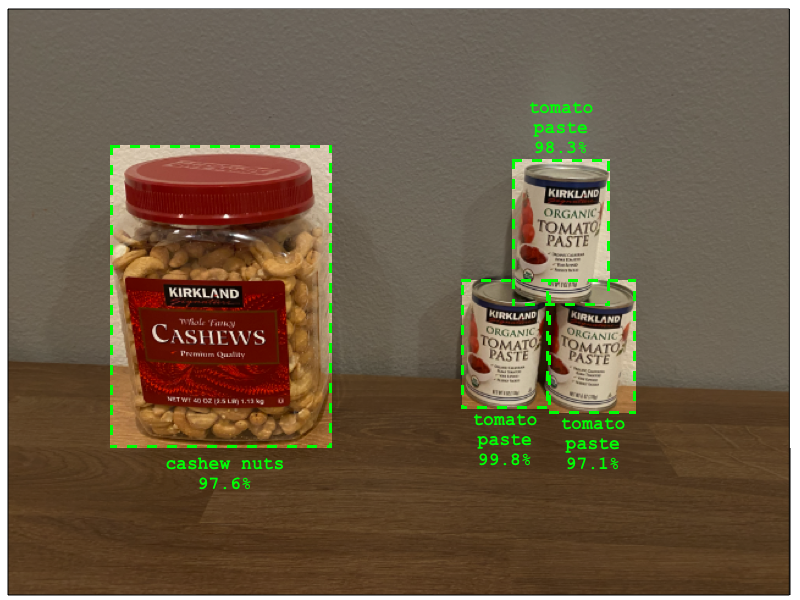

<!--
CO_OP_TRANSLATOR_METADATA:
{
  "original_hash": "8df310a42f902139a01417dacb1ffbef",
  "translation_date": "2025-08-27T10:01:12+00:00",
  "source_file": "5-retail/lessons/1-train-stock-detector/README.md",
  "language_code": "mr"
}
-->
# स्टॉक डिटेक्टर प्रशिक्षण द्या

> स्केच नोट [नित्य नरसिंहन](https://github.com/nitya) यांनी तयार केले. मोठ्या आवृत्तीसाठी प्रतिमेवर क्लिक करा.

हा व्हिडिओ Azure Custom Vision सेवेमधील ऑब्जेक्ट डिटेक्शनचा आढावा देतो, ही सेवा या धड्यात समाविष्ट केली जाईल.

> 🎥 वरच्या प्रतिमेवर क्लिक करून व्हिडिओ पहा

## पूर्व-व्याख्यान प्रश्नमंजुषा

[पूर्व-व्याख्यान प्रश्नमंजुषा](https://black-meadow-040d15503.1.azurestaticapps.net/quiz/37)

## परिचय

मागील प्रकल्पात, तुम्ही एआय वापरून एक इमेज क्लासिफायर तयार केला - एक मॉडेल जे सांगते की एखाद्या प्रतिमेत काहीतरी आहे का, जसे की पिकलेले फळ किंवा न पिकलेले फळ. प्रतिमांसाठी वापरले जाणारे आणखी एक प्रकारचे एआय मॉडेल म्हणजे ऑब्जेक्ट डिटेक्शन. ही मॉडेल्स प्रतिमेला टॅगद्वारे वर्गीकृत करत नाहीत, त्याऐवजी ती वस्तू ओळखण्यासाठी प्रशिक्षित केली जातात आणि प्रतिमांमध्ये वस्तू शोधू शकतात, केवळ प्रतिमा अस्तित्वात आहे हे ओळखत नाहीत तर प्रतिमेत ती कुठे आहे हे ओळखतात. यामुळे तुम्हाला प्रतिमांमधील वस्तूंची गणना करता येते.

या धड्यात तुम्ही ऑब्जेक्ट डिटेक्शनबद्दल शिकाल, त्याचा किरकोळ विक्रीमध्ये कसा उपयोग होतो हे समजून घ्याल. तुम्ही क्लाउडमध्ये ऑब्जेक्ट डिटेक्टर कसा प्रशिक्षण द्यायचा हे देखील शिकाल.

या धड्यात आपण कव्हर करू:

* [ऑब्जेक्ट डिटेक्शन](../../../../../5-retail/lessons/1-train-stock-detector)
* [किरकोळ विक्रीमध्ये ऑब्जेक्ट डिटेक्शनचा उपयोग](../../../../../5-retail/lessons/1-train-stock-detector)
* [ऑब्जेक्ट डिटेक्टर प्रशिक्षण द्या](../../../../../5-retail/lessons/1-train-stock-detector)
* [तुमचा ऑब्जेक्ट डिटेक्टर चाचणी करा](../../../../../5-retail/lessons/1-train-stock-detector)
* [तुमचा ऑब्जेक्ट डिटेक्टर पुन्हा प्रशिक्षण द्या](../../../../../5-retail/lessons/1-train-stock-detector)

## ऑब्जेक्ट डिटेक्शन

ऑब्जेक्ट डिटेक्शन म्हणजे एआय वापरून प्रतिमांमधील वस्तू शोधणे. मागील प्रकल्पात तुम्ही तयार केलेल्या इमेज क्लासिफायरच्या विपरीत, ऑब्जेक्ट डिटेक्शन हे संपूर्ण प्रतिमेसाठी सर्वोत्तम टॅगचा अंदाज लावण्याबद्दल नाही, तर प्रतिमेमध्ये एक किंवा अधिक वस्तू शोधण्याबद्दल आहे.

### ऑब्जेक्ट डिटेक्शन वि. इमेज क्लासिफिकेशन

इमेज क्लासिफिकेशन म्हणजे संपूर्ण प्रतिमेचे वर्गीकरण करणे - संपूर्ण प्रतिमा प्रत्येक टॅगशी जुळण्याची शक्यता किती आहे. तुम्हाला मॉडेल प्रशिक्षणासाठी वापरलेल्या प्रत्येक टॅगसाठी शक्यता परत मिळते.

वरील उदाहरणात, दोन प्रतिमा काजूच्या डब्यांचे किंवा टोमॅटो पेस्टच्या कॅनचे वर्गीकरण करण्यासाठी प्रशिक्षित केलेल्या मॉडेलचा वापर करून वर्गीकृत केल्या जातात. पहिली प्रतिमा काजूच्या डब्याची आहे आणि इमेज क्लासिफायरकडून दोन निकाल आहेत:

| टॅग            | शक्यता |
| -------------- | ----------: |
| `cashew nuts`  | 98.4%       |
| `tomato paste` | 1.6%        |

दुसरी प्रतिमा टोमॅटो पेस्टच्या कॅनची आहे आणि निकाल आहेत:

| टॅग            | शक्यता |
| -------------- | ----------: |
| `cashew nuts`  | 0.7%        |
| `tomato paste` | 99.3%       |

तुम्ही या मूल्यांचा वापर करून प्रतिमेमध्ये काय आहे याचा अंदाज लावण्यासाठी टक्केवारी थ्रेशोल्ड वापरू शकता. पण जर प्रतिमेमध्ये टोमॅटो पेस्टचे अनेक कॅन किंवा काजू आणि टोमॅटो पेस्ट दोन्ही असतील तर काय? निकाल कदाचित तुम्हाला हवे ते देणार नाहीत. यासाठी ऑब्जेक्ट डिटेक्शन उपयोगी ठरते.

ऑब्जेक्ट डिटेक्शनमध्ये मॉडेलला वस्तू ओळखण्यासाठी प्रशिक्षण दिले जाते. प्रतिमेमध्ये वस्तू असलेल्या विभागाला हायलाइट करून टॅग दिला जातो. तुम्ही एका प्रतिमेमध्ये एकच वस्तू किंवा अनेक वस्तू टॅग करू शकता. यामुळे मॉडेलला वस्तू स्वतः कशी दिसते हे शिकता येते, केवळ वस्तू असलेल्या प्रतिमा कशा दिसतात हे नाही.

जेव्हा तुम्ही याचा वापर करून प्रतिमांचा अंदाज लावता, तेव्हा तुम्हाला टॅग आणि टक्केवारींची यादी मिळण्याऐवजी, शोधलेल्या वस्तूंची यादी मिळते, त्यांचे बॉक्सिंग बॉक्स आणि टॅगशी जुळण्याची शक्यता मिळते.

> 🎓 *बॉक्सिंग बॉक्सेस* म्हणजे वस्तूभोवती असलेले बॉक्सेस.

वरील प्रतिमेमध्ये काजूचा डबा आणि टोमॅटो पेस्टचे तीन कॅन आहेत. ऑब्जेक्ट डिटेक्टरने काजू ओळखले, काजू असलेल्या बॉक्सिंग बॉक्ससह परत दिले ज्यामध्ये वस्तू असण्याची शक्यता 97.6% आहे. ऑब्जेक्ट डिटेक्टरने टोमॅटो पेस्टचे तीन कॅन देखील ओळखले आहेत आणि तीन वेगळे बॉक्सिंग बॉक्स दिले आहेत, प्रत्येक शोधलेल्या कॅनसाठी एक, आणि प्रत्येक बॉक्समध्ये टोमॅटो पेस्टचा कॅन असण्याची टक्केवारी दिली आहे.

✅ प्रतिमांवर आधारित एआय मॉडेल्ससाठी तुम्ही वापरू इच्छित असलेल्या वेगवेगळ्या परिस्थितींचा विचार करा. कोणत्या वर्गीकरणाची आवश्यकता आहे आणि कोणत्या ऑब्जेक्ट डिटेक्शनची आवश्यकता आहे?

### ऑब्जेक्ट डिटेक्शन कसे कार्य करते

ऑब्जेक्ट डिटेक्शन जटिल एमएल मॉडेल्स वापरते. ही मॉडेल्स प्रतिमेला अनेक सेल्समध्ये विभागून काम करतात, नंतर बॉक्सिंग बॉक्सचा केंद्र प्रतिमेच्या केंद्राशी जुळतो का हे तपासतात, जे मॉडेल प्रशिक्षणासाठी वापरलेल्या प्रतिमांपैकी एकाशी जुळते. तुम्ही याचा विचार इमेज क्लासिफायर वेगवेगळ्या भागांवर चालवून जुळणारे शोधण्यासारखा करू शकता.

> 💁 हे खूपच साधे स्पष्टीकरण आहे. ऑब्जेक्ट डिटेक्शनसाठी अनेक तंत्रे आहेत, आणि तुम्ही [विकिपीडियावर ऑब्जेक्ट डिटेक्शन पृष्ठावर](https://wikipedia.org/wiki/Object_detection) अधिक वाचू शकता.

ऑब्जेक्ट डिटेक्शनसाठी अनेक मॉडेल्स आहेत. एक प्रसिद्ध मॉडेल म्हणजे [YOLO (You only look once)](https://pjreddie.com/darknet/yolo/), जे खूप वेगवान आहे आणि लोक, कुत्रे, बाटल्या आणि कार यासारख्या 20 वेगवेगळ्या वर्गातील वस्तू ओळखू शकते.

✅ YOLO मॉडेलबद्दल [pjreddie.com/darknet/yolo/](https://pjreddie.com/darknet/yolo/) येथे वाचा.

ऑब्जेक्ट डिटेक्शन मॉडेल्स कस्टम वस्तू ओळखण्यासाठी ट्रान्सफर लर्निंग वापरून पुन्हा प्रशिक्षण दिले जाऊ शकतात.

## किरकोळ विक्रीमध्ये ऑब्जेक्ट डिटेक्शनचा उपयोग

ऑब्जेक्ट डिटेक्शनचा किरकोळ विक्रीमध्ये अनेक उपयोग आहेत. काही उदाहरणे:

* **स्टॉक तपासणी आणि गणना** - शेल्फवर स्टॉक कमी असल्याचे ओळखणे. जर स्टॉक खूप कमी असेल, तर कर्मचाऱ्यांना किंवा रोबोट्सना शेल्फ पुन्हा भरण्यासाठी सूचना पाठवता येतात.
* **मास्क डिटेक्शन** - सार्वजनिक आरोग्याच्या घटनांमध्ये मास्क धोरण असलेल्या स्टोअरमध्ये, ऑब्जेक्ट डिटेक्शन मास्क असलेल्या आणि नसलेल्या लोकांना ओळखू शकते.
* **स्वयंचलित बिलिंग** - शेल्फवरून घेतलेल्या वस्तू ओळखणे आणि ग्राहकांना योग्य बिलिंग करणे.
* **धोक्याचा शोध** - तुटलेल्या वस्तू किंवा सांडलेल्या द्रवपदार्थ ओळखणे आणि साफसफाईच्या कर्मचाऱ्यांना सूचना देणे.

✅ संशोधन करा: किरकोळ विक्रीमध्ये ऑब्जेक्ट डिटेक्शनसाठी आणखी कोणते उपयोग असू शकतात?

## ऑब्जेक्ट डिटेक्टर प्रशिक्षण द्या

तुम्ही Custom Vision वापरून ऑब्जेक्ट डिटेक्टर तयार करू शकता, जसे तुम्ही इमेज क्लासिफायर तयार केले होते.

### कार्य - ऑब्जेक्ट डिटेक्टर तयार करा

1. या प्रकल्पासाठी `stock-detector` नावाचा एक Resource Group तयार करा.

1. `stock-detector` Resource Group मध्ये एक मोफत Custom Vision प्रशिक्षण संसाधन आणि एक मोफत Custom Vision अंदाज संसाधन तयार करा. त्यांना `stock-detector-training` आणि `stock-detector-prediction` असे नाव द्या.

    > 💁 तुम्ही फक्त एक मोफत प्रशिक्षण आणि अंदाज संसाधन ठेवू शकता, त्यामुळे तुम्ही मागील धड्यांमधील प्रकल्प साफ केला आहे याची खात्री करा.

    > ⚠️ [प्रकल्प 4, धडा 1 मधील प्रशिक्षण आणि अंदाज संसाधने तयार करण्याच्या सूचनांचा संदर्भ घ्या](../../../4-manufacturing/lessons/1-train-fruit-detector/README.md#task---create-a-cognitive-services-resource).

1. [CustomVision.ai](https://customvision.ai) येथे Custom Vision पोर्टल लॉन्च करा आणि तुमच्या Azure खात्यासाठी वापरलेल्या Microsoft खात्याने साइन इन करा.

1. [Microsoft Docs वर Build an object detector quickstart च्या Create a new Project विभागाचे अनुसरण करा](https://docs.microsoft.com/azure/cognitive-services/custom-vision-service/get-started-build-detector?WT.mc_id=academic-17441-jabenn#create-a-new-project) नवीन Custom Vision प्रकल्प तयार करण्यासाठी. UI बदलू शकतो आणि हे दस्तऐवज नेहमी सर्वात अद्ययावत संदर्भ असतात.

    तुमच्या प्रकल्पाला `stock-detector` असे नाव द्या.

    प्रकल्प तयार करताना, तुम्ही पूर्वी तयार केलेल्या `stock-detector-training` संसाधनाचा वापर करा. *Object Detection* प्रकल्प प्रकार आणि *Products on Shelves* डोमेन वापरा.

    

    ✅ स्टोअर शेल्फवरील स्टॉक ओळखण्यासाठी *Products on Shelves* डोमेन विशेषतः लक्ष्यित आहे. [Microsoft Docs वर Select a domain दस्तऐवज](https://docs.microsoft.com/azure/cognitive-services/custom-vision-service/select-domain?WT.mc_id=academic-17441-jabenn#object-detection) मध्ये वेगवेगळ्या डोमेनबद्दल अधिक वाचा.

✅ तुमच्या ऑब्जेक्ट डिटेक्टरसाठी Custom Vision UI एक्सप्लोर करण्यासाठी थोडा वेळ घ्या.

### कार्य - तुमचा ऑब्जेक्ट डिटेक्टर प्रशिक्षण द्या

तुमच्या मॉडेलला प्रशिक्षण देण्यासाठी तुम्हाला ओळखायच्या वस्तू असलेल्या प्रतिमांचा संच आवश्यक आहे.

1. ओळखायच्या वस्तू असलेल्या प्रतिमा गोळा करा. तुम्हाला प्रत्येक वस्तूसाठी किमान 15 प्रतिमा आवश्यक आहेत, वेगवेगळ्या कोनातून आणि वेगवेगळ्या प्रकाश परिस्थितीत, परंतु जितक्या जास्त प्रतिमा तितके चांगले. हा ऑब्जेक्ट डिटेक्टर *Products on Shelves* डोमेन वापरतो, त्यामुळे वस्तू स्टोअर शेल्फवर असल्यासारखे सेट करण्याचा प्रयत्न करा. तुम्हाला मॉडेल चाचणीसाठी काही प्रतिमांची आवश्यकता असेल. जर तुम्ही एकापेक्षा जास्त वस्तू शोधत असाल, तर तुम्हाला सर्व वस्तू असलेल्या चाचणी प्रतिमा हव्या असतील.

    > 💁 वेगवेगळ्या वस्तू असलेल्या प्रतिमा प्रतिमेमध्ये असलेल्या सर्व वस्तूंसाठी 15 प्रतिमांच्या किमान मर्यादेत गणल्या जातात.

    तुमच्या प्रतिमा png किंवा jpeg असाव्यात, 6MB पेक्षा कमी. जर तुम्ही त्यांना iPhone वापरून तयार केले तर त्या उच्च-रिझोल्यूशन HEIC प्रतिमा असू शकतात, त्यामुळे त्यांना रूपांतरित करावे लागेल आणि कदाचित कमी करावे लागेल. जितक्या जास्त प्रतिमा तितके चांगले, आणि तुम्ही पिकलेल्या आणि न पिकलेल्या वस्तूंची समान संख्या असावी.

    मॉडेल उत्पादने शेल्फवर ओळखण्यासाठी डिझाइन केले आहे, त्यामुळे वस्तू शेल्फवर असताना फोटो काढण्याचा प्रयत्न करा.

    तुम्ही [images](../../../../../5-retail/lessons/1-train-stock-detector/images) फोल्डरमध्ये काजू आणि टोमॅटो पेस्टच्या काही उदाहरण प्रतिमा शोधू शकता ज्या तुम्ही वापरू शकता.

1. [Microsoft Docs वर Build an object detector quickstart च्या Upload and tag images विभागाचे अनुसरण करा](https://docs.microsoft.com/azure/cognitive-services/custom-vision-service/get-started-build-detector?WT.mc_id=academic-17441-jabenn#upload-and-tag-images) तुमच्या प्रशिक्षण प्रतिमा अपलोड करण्यासाठी. तुम्ही शोधू इच्छित वस्तूंच्या प्रकारांनुसार संबंधित टॅग तयार करा.

    

    वस्तूंसाठी बॉक्सिंग बॉक्स काढताना, वस्तूभोवती घट्ट ठेवा. सर्व प्रतिमांचे रूपरेषा तयार करणे वेळखाऊ असू शकते, परंतु टूल बॉक्सिंग बॉक्स काय आहेत ते शोधेल, ज्यामुळे ते वेगवान होईल.

    

    > 💁 जर तुमच्याकडे प्रत्येक वस्तूसाठी 15 पेक्षा जास्त प्रतिमा असतील, तर तुम्ही 15 नंतर प्रशिक्षण देऊ शकता आणि **Suggested tags** वैशिष्ट्य वापरू शकता. हे प्रशिक्षित मॉडेल वापरून अनटॅग केलेल्या प्रतिमांमध्ये वस्तू शोधेल. तुम्ही शोधलेल्या वस्तूंची पुष्टी करू शकता, किंवा नाकारू शकता आणि बॉक्सिंग बॉक्स पुन्हा काढू शकता. यामुळे *खूप* वेळ वाचतो.

1. [Microsoft Docs वर Build an object detector quickstart च्या Train the detector विभागाचे अनुसरण करा](https://docs.microsoft.com/azure/cognitive-services/custom-vision-service/get-started-build-detector?WT.mc_id=academic-17441-jabenn#train-the-detector) तुमच्या टॅग केलेल्या प्रतिमांवर ऑब्जेक्ट डिटेक्टर प्रशिक्षण देण्यासाठी.

    तुम्हाला प्रशिक्षण प्रकाराची निवड दिली जाईल. **Quick Training** निवडा.

ऑब्जेक्ट डिटेक्टर प्रशिक्षण घेईल. प्रशिक्षण पूर्ण होण्यासाठी काही मिनिटे लागतील.

## तुमचा ऑब्जेक्ट डिटेक्टर चाचणी करा

तुमचा ऑब्जेक्ट डिटेक्टर प्रशिक्षित झाल्यानंतर, तुम्ही त्याला नवीन प्रतिमा देऊन वस्तू शोधण्यासाठी चाचणी करू शकता.

### कार्य - तुमचा ऑब्जेक्ट डिटेक्टर चाचणी करा

1. **Quick Test** बटण वापरून चाचणी प्रतिमा अपलोड करा आणि वस्तू शोधल्या जात आहेत का ते सत्यापित करा. तुम्ही पूर्वी तयार केलेल्या चाचणी प्रतिमा वापरा, प्रशिक्षणासाठी वापरलेल्या प्रतिमा वापरू नका.

    

1. तुमच्याकडे असलेल्या सर्व चाचणी प्रतिमा वापरून पहा आणि शक्यता निरीक्षण करा.

## तुमचा ऑब्जेक्ट डिटेक्टर पुन्हा प्रशिक्षण द्या

तुम्ही तुमचा ऑब्जेक्ट डिटेक्टर चाचणी करता तेव्हा, तो अपेक्षित निकाल देत नाही, मागील प्रकल्पातील इमेज क्लासिफायरप्रमाणे. तुम्ही चुकीच्या प्रतिमांसह पुन्हा प्रशिक्षण देऊन तुमचा ऑब्जेक्ट डिटेक्टर सुधारू शकता.

तुम्ही प्रत्येक वेळी क्विक टेस्ट पर्याय वापरून अंदाज लावता, प्रतिमा आणि निकाल संग्रहित केले जातात. तुम्ही या प्रतिमांचा वापर तुमचे मॉडेल पुन्हा प्रशिक्षण देण्यासाठी करू शकता.

1. **Pred
[पोस्ट-लेक्चर क्विझ](https://black-meadow-040d15503.1.azurestaticapps.net/quiz/38)

## पुनरावलोकन आणि स्व-अभ्यास

* जेव्हा तुम्ही तुमचा ऑब्जेक्ट डिटेक्टर प्रशिक्षित केला, तेव्हा तुम्हाला *Precision*, *Recall*, आणि *mAP* या मूल्यांचे दर्शन झाले असेल, जे तयार केलेल्या मॉडेलचे मूल्यांकन करतात. [Microsoft डॉक्युमेंट्सवरील Build an object detector quickstart च्या Evaluate the detector विभागाचा](https://docs.microsoft.com/azure/cognitive-services/custom-vision-service/get-started-build-detector?WT.mc_id=academic-17441-jabenn#evaluate-the-detector) वापर करून या मूल्यांबद्दल अधिक वाचा.
* [विकिपीडियाच्या Object detection पृष्ठावर](https://wikipedia.org/wiki/Object_detection) ऑब्जेक्ट डिटेक्शनबद्दल अधिक माहिती मिळवा.

## असाइनमेंट

[डोमेनची तुलना करा](assignment.md)

---

**अस्वीकरण**:  
हा दस्तऐवज AI भाषांतर सेवा [Co-op Translator](https://github.com/Azure/co-op-translator) वापरून भाषांतरित करण्यात आला आहे. आम्ही अचूकतेसाठी प्रयत्नशील असलो तरी, कृपया लक्षात ठेवा की स्वयंचलित भाषांतरांमध्ये त्रुटी किंवा अचूकतेचा अभाव असू शकतो. मूळ भाषेतील दस्तऐवज हा अधिकृत स्रोत मानला जावा. महत्त्वाच्या माहितीसाठी, व्यावसायिक मानवी भाषांतराची शिफारस केली जाते. या भाषांतराचा वापर करून उद्भवलेल्या कोणत्याही गैरसमज किंवा चुकीच्या अर्थासाठी आम्ही जबाबदार राहणार नाही.