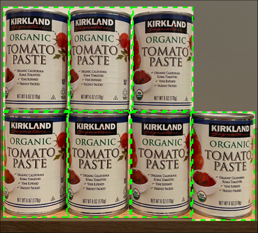

<!--
CO_OP_TRANSLATOR_METADATA:
{
  "original_hash": "1c9e5fa8b7be726c75a97232b1e41c97",
  "translation_date": "2025-08-27T09:51:08+00:00",
  "source_file": "5-retail/lessons/2-check-stock-device/README.md",
  "language_code": "mr"
}
-->
# IoT डिव्हाइसवरून स्टॉक तपासणे


> स्केच नोट [नित्य नरसिंहन](https://github.com/nitya) यांनी तयार केले. मोठ्या आवृत्तीसाठी प्रतिमेवर क्लिक करा.

## पूर्व-व्याख्यान प्रश्नमंजुषा

[पूर्व-व्याख्यान प्रश्नमंजुषा](https://black-meadow-040d15503.1.azurestaticapps.net/quiz/39)

## परिचय

मागील धड्यात तुम्ही किरकोळ विक्रीमध्ये वस्तू ओळखण्याच्या विविध उपयोगांबद्दल शिकले. तुम्ही वस्तू ओळखण्यासाठी ऑब्जेक्ट डिटेक्टर कसा प्रशिक्षित करायचा हे देखील शिकले. या धड्यात तुम्ही तुमच्या IoT डिव्हाइसवरून ऑब्जेक्ट डिटेक्टर वापरून स्टॉक कसा मोजायचा हे शिकाल.

या धड्यात आपण खालील गोष्टींचा आढावा घेणार आहोत:

* [स्टॉक मोजणे](../../../../../5-retail/lessons/2-check-stock-device)
* [तुमच्या IoT डिव्हाइसवरून ऑब्जेक्ट डिटेक्टरला कॉल करा](../../../../../5-retail/lessons/2-check-stock-device)
* [बाउंडिंग बॉक्सेस](../../../../../5-retail/lessons/2-check-stock-device)
* [मॉडेल पुन्हा प्रशिक्षित करा](../../../../../5-retail/lessons/2-check-stock-device)
* [स्टॉक मोजा](../../../../../5-retail/lessons/2-check-stock-device)

> 🗑 हा प्रकल्पातील शेवटचा धडा आहे, त्यामुळे हा धडा आणि असाइनमेंट पूर्ण केल्यानंतर, तुमच्या क्लाउड सेवांची साफसफाई करायला विसरू नका. असाइनमेंट पूर्ण करण्यासाठी तुम्हाला सेवांची आवश्यकता असेल, त्यामुळे प्रथम ती पूर्ण करा.
>
> आवश्यक असल्यास [तुमच्या प्रकल्पाची साफसफाई मार्गदर्शक](../../../clean-up.md) पहा.

## स्टॉक मोजणे

ऑब्जेक्ट डिटेक्टर स्टॉक तपासण्यासाठी वापरले जाऊ शकतात, स्टॉक मोजण्यासाठी किंवा स्टॉक योग्य ठिकाणी आहे याची खात्री करण्यासाठी. कॅमेऱ्यांसह IoT डिव्हाइस स्टोअरमध्ये सर्वत्र तैनात केली जाऊ शकतात, विशेषतः अशा ठिकाणी जिथे उच्च मूल्याच्या वस्तूंचा छोटा साठा असतो.

उदाहरणार्थ, जर कॅमेरा अशा शेल्फकडे निर्देशित केला असेल ज्यावर 8 टोमॅटो पेस्टचे डबे ठेवता येतात, आणि ऑब्जेक्ट डिटेक्टर फक्त 7 डबे ओळखतो, तर एक डबा गायब आहे आणि तो पुन्हा साठवणे आवश्यक आहे.



वरील प्रतिमेत, ऑब्जेक्ट डिटेक्टरने शेल्फवर 7 टोमॅटो पेस्टचे डबे ओळखले आहेत, जिथे 8 डबे ठेवता येतात. IoT डिव्हाइस केवळ पुन्हा साठवण्याची सूचना पाठवू शकत नाही, तर गायब झालेल्या वस्तूचे स्थान देखील सूचित करू शकते, जे शेल्फ पुन्हा साठवण्यासाठी रोबोट्स वापरत असल्यास महत्त्वाचे डेटा आहे.

> 💁 स्टोअर आणि वस्तूंच्या लोकप्रियतेनुसार, जर फक्त 1 डबा गायब असेल तर पुन्हा साठवण्याची शक्यता कमी आहे. तुम्हाला तुमच्या उत्पादन, ग्राहक आणि इतर निकषांवर आधारित पुन्हा साठवण्याचा निर्णय घेणारा अल्गोरिदम तयार करावा लागेल.

✅ तुम्ही ऑब्जेक्ट डिटेक्शन आणि रोबोट्स एकत्र कशा प्रकारे वापरू शकता?

कधी कधी शेल्फवर चुकीचा स्टॉक असतो. हे पुन्हा साठवताना मानवी त्रुटीमुळे किंवा ग्राहकांनी खरेदीचा विचार बदलल्यामुळे आणि वस्तू प्रथम उपलब्ध जागेत ठेवल्यामुळे होऊ शकते. जर ही वस्तू नाशवंत नसलेली असेल, जसे की डबाबंद वस्तू, तर ही एक गैरसोय आहे. जर ही वस्तू नाशवंत असेल, जसे की गोठवलेली किंवा थंड ठेवलेली वस्तू, तर ती विकली जाऊ शकत नाही कारण वस्तू किती वेळ फ्रीजरच्या बाहेर होती हे सांगणे अशक्य होऊ शकते.

ऑब्जेक्ट डिटेक्शन अनपेक्षित वस्तू ओळखण्यासाठी वापरले जाऊ शकते, पुन्हा वस्तू योग्य ठिकाणी ठेवण्यासाठी मानव किंवा रोबोटला सतर्क करते.


वरील प्रतिमेत, टोमॅटो पेस्टच्या शेल्फवर बेबी कॉर्नचा डबा ठेवलेला आहे. ऑब्जेक्ट डिटेक्टरने हे ओळखले आहे, ज्यामुळे IoT डिव्हाइसला मानव किंवा रोबोटला डबा योग्य ठिकाणी परत ठेवण्याची सूचना पाठवता येते.

## तुमच्या IoT डिव्हाइसवरून ऑब्जेक्ट डिटेक्टरला कॉल करा

तुम्ही मागील धड्यात प्रशिक्षित केलेला ऑब्जेक्ट डिटेक्टर तुमच्या IoT डिव्हाइसवरून कॉल केला जाऊ शकतो.

### कार्य - तुमच्या ऑब्जेक्ट डिटेक्टरची आवृत्ती प्रकाशित करा

कस्टम व्हिजन पोर्टलमधून आवृत्त्या प्रकाशित केल्या जातात.

1. [CustomVision.ai](https://customvision.ai) येथे कस्टम व्हिजन पोर्टल सुरू करा आणि साइन इन करा. जर तुम्ही आधीच उघडले नसेल तर तुमचा `stock-detector` प्रकल्प उघडा.

1. वरच्या पर्यायांमधून **Performance** टॅब निवडा.

1. बाजूच्या *Iterations* यादीमधून नवीनतम आवृत्ती निवडा.

1. आवृत्तीच्या **Publish** बटणावर क्लिक करा.

    

1. *Publish Model* संवादात, *Prediction resource* म्हणून तुम्ही मागील धड्यात तयार केलेल्या `stock-detector-prediction` संसाधनाची निवड करा. नाव `Iteration2` म्हणून ठेवा आणि **Publish** बटणावर क्लिक करा.

1. प्रकाशित झाल्यानंतर, **Prediction URL** बटणावर क्लिक करा. हे भविष्यवाणी API चा तपशील दर्शवेल, आणि तुम्हाला तुमच्या IoT डिव्हाइसवरून मॉडेल कॉल करण्यासाठी याची आवश्यकता असेल. खालचा विभाग *If you have an image file* लेबल केलेला आहे, आणि तुम्हाला याच तपशीलांची आवश्यकता आहे. URL ची प्रत घ्या, जी काहीतरी अशा प्रकारे असेल:

    ```output
    https://<location>.api.cognitive.microsoft.com/customvision/v3.0/Prediction/<id>/detect/iterations/Iteration2/image
    ```

    जिथे `<location>` तुम्ही कस्टम व्हिजन संसाधन तयार करताना वापरलेले स्थान असेल, आणि `<id>` अक्षरे आणि संख्यांनी बनलेला लांब ID असेल.

    *Prediction-Key* मूल्याची प्रत देखील घ्या. हे एक सुरक्षित की आहे, जे तुम्हाला मॉडेल कॉल करताना पास करावे लागते. फक्त ही की पास करणाऱ्या अनुप्रयोगांना मॉडेल वापरण्याची परवानगी आहे, इतर कोणतेही अनुप्रयोग नाकारले जातात.

    

✅ नवीन आवृत्ती प्रकाशित झाल्यावर, त्याला वेगळे नाव असेल. तुम्ही IoT डिव्हाइसवर वापरली जाणारी आवृत्ती कशी बदलाल असे तुम्हाला वाटते?

### कार्य - तुमच्या IoT डिव्हाइसवरून ऑब्जेक्ट डिटेक्टरला कॉल करा

तुमच्या IoT डिव्हाइसवरून ऑब्जेक्ट डिटेक्टर वापरण्यासाठी खालील संबंधित मार्गदर्शक अनुसरण करा:

* [Arduino - Wio Terminal](wio-terminal-object-detector.md)
* [Single-board computer - Raspberry Pi/Virtual device](single-board-computer-object-detector.md)

## बाउंडिंग बॉक्सेस

तुम्ही ऑब्जेक्ट डिटेक्टर वापरता तेव्हा, तुम्हाला ओळखलेल्या वस्तूंचे टॅग आणि संभाव्यता मिळतात, तसेच वस्तूंच्या बाउंडिंग बॉक्सेस देखील मिळतात. हे बॉक्स वस्तू ओळखण्याची संभाव्यता असलेल्या क्षेत्राची व्याख्या करतात.

> 💁 बाउंडिंग बॉक्स म्हणजे ओळखलेल्या वस्तू असलेल्या क्षेत्राची व्याख्या करणारा बॉक्स, वस्तूच्या सीमा परिभाषित करणारा बॉक्स.

कस्टम व्हिजनमधील **Predictions** टॅबमधील भविष्यवाणीच्या निकालांमध्ये, भविष्यवाणीसाठी पाठवलेल्या प्रतिमेवर बाउंडिंग बॉक्सेस काढले जातात.


वरील प्रतिमेत, 4 टोमॅटो पेस्टचे डबे ओळखले गेले आहेत. निकालांमध्ये प्रत्येक ओळखलेल्या वस्तूसाठी लाल चौकोन ओव्हरले केले गेले आहेत, जे प्रतिमेतील वस्तूंसाठी बाउंडिंग बॉक्स सूचित करतात.

✅ कस्टम व्हिजनमधील भविष्यवाणी उघडा आणि बाउंडिंग बॉक्सेस तपासा.

बाउंडिंग बॉक्सेस 4 मूल्यांसह परिभाषित केले जातात - टॉप, लेफ्ट, हाइट आणि विड्थ. ही मूल्ये 0-1 च्या स्केलवर असतात, प्रतिमेच्या आकाराच्या टक्केवारीनुसार स्थानांचे प्रतिनिधित्व करतात. मूळ (0,0 स्थान) प्रतिमेच्या वरच्या डाव्या बाजूला असते, त्यामुळे टॉप मूल्य हे वरून अंतर असते, आणि बाउंडिंग बॉक्सचा तळ हा टॉप प्लस हाइट असतो.


वरील प्रतिमा 600 पिक्सेल रुंद आणि 800 पिक्सेल उंच आहे. बाउंडिंग बॉक्स 320 पिक्सेल खाली सुरू होतो, ज्यामुळे टॉप समन्वय 0.4 (800 x 0.4 = 320) मिळतो. डावीकडून, बाउंडिंग बॉक्स 240 पिक्सेलवर सुरू होतो, ज्यामुळे लेफ्ट समन्वय 0.4 (600 x 0.4 = 240) मिळतो. बाउंडिंग बॉक्सची उंची 240 पिक्सेल आहे, ज्यामुळे हाइट मूल्य 0.3 (800 x 0.3 = 240) मिळते. बाउंडिंग बॉक्सची रुंदी 120 पिक्सेल आहे, ज्यामुळे विड्थ मूल्य 0.2 (600 x 0.2 = 120) मिळते.

| समन्वय | मूल्य |
| ---------- | ----: |
| टॉप        | 0.4   |
| लेफ्ट       | 0.4   |
| हाइट       | 0.3   |
| विड्थ      | 0.2   |

0-1 च्या टक्केवारीच्या मूल्यांचा वापर केल्याने प्रतिमा कोणत्याही आकारात स्केल केली तरी बाउंडिंग बॉक्स 0.4 च्या अंतरावर सुरू होतो आणि 0.3 उंची आणि 0.2 रुंदी असतो.

तुम्ही बाउंडिंग बॉक्सेस आणि संभाव्यता एकत्र वापरून ओळख किती अचूक आहे हे मूल्यांकन करू शकता. उदाहरणार्थ, ऑब्जेक्ट डिटेक्टर अनेक वस्तू ओळखू शकतो ज्या एकमेकांवर ओव्हरलॅप होतात, उदाहरणार्थ एका डब्याच्या आत दुसरा डबा ओळखणे. तुमचा कोड बाउंडिंग बॉक्सेस तपासू शकतो, हे समजू शकतो की हे अशक्य आहे, आणि इतर वस्तूंसोबत लक्षणीय ओव्हरलॅप असलेल्या वस्तूंना दुर्लक्ष करू शकतो.


वरील उदाहरणात, एका बाउंडिंग बॉक्सने 78.3% संभाव्यतेसह टोमॅटो पेस्टचा डबा ओळखला आहे. दुसरा बाउंडिंग बॉक्स थोडा लहान आहे, आणि पहिल्या बाउंडिंग बॉक्सच्या आत 64.3% संभाव्यतेसह आहे. तुमचा कोड बाउंडिंग बॉक्सेस तपासू शकतो, पाहू शकतो की ते पूर्णपणे ओव्हरलॅप होतात, आणि कमी संभाव्यता असलेल्या वस्तूला दुर्लक्ष करू शकतो कारण एका डब्याच्या आत दुसरा डबा असणे शक्य नाही.

✅ अशा परिस्थितीचा विचार करा जिथे एका वस्तूच्या आत दुसरी वस्तू ओळखणे वैध आहे.

## मॉडेल पुन्हा प्रशिक्षित करा

प्रतिमा वर्गीकरणासारखे, तुम्ही तुमच्या IoT डिव्हाइसद्वारे कॅप्चर केलेल्या डेटाचा वापर करून तुमचे मॉडेल पुन्हा प्रशिक्षित करू शकता. या वास्तविक-जगातील डेटाचा वापर करून तुमचे मॉडेल IoT डिव्हाइसवरून वापरताना चांगले कार्य करेल याची खात्री होईल.

प्रतिमा वर्गीकरणापेक्षा वेगळे, तुम्ही फक्त प्रतिमेला टॅग करू शकत नाही. त्याऐवजी तुम्हाला मॉडेलने ओळखलेल्या प्रत्येक बाउंडिंग बॉक्सचे पुनरावलोकन करावे लागेल. जर बॉक्स चुकीच्या वस्तूभोवती असेल तर तो हटवावा लागेल, जर तो चुकीच्या ठिकाणी असेल तर तो समायोजित करावा लागेल.

### कार्य - मॉडेल पुन्हा प्रशिक्षित करा

1. तुमच्या IoT डिव्हाइसचा वापर करून विविध प्रतिमा कॅप्चर केल्या आहेत याची खात्री करा.

1. **Predictions** टॅबमधून प्रतिमा निवडा. तुम्हाला ओळखलेल्या वस्तूंचे बाउंडिंग बॉक्सेस लाल रंगात दिसतील.

1. प्रत्येक बाउंडिंग बॉक्सवर काम करा. प्रथम त्यावर क्लिक करा आणि तुम्हाला टॅग दर्शविणारा पॉप-अप दिसेल. आवश्यक असल्यास बाउंडिंग बॉक्सचा आकार समायोजित करण्यासाठी कोपऱ्यांवरील हँडल्स वापरा. जर टॅग चुकीचा असेल तर **X** बटण वापरून तो काढा आणि योग्य टॅग जोडा. जर बाउंडिंग बॉक्समध्ये वस्तू नसेल तर कचरापेटी बटण वापरून तो हटवा.

1. संपादक बंद करा आणि प्रतिमा **Predictions** टॅबमधून **Training Images** टॅबमध्ये हलवली जाईल. सर्व भविष्यवाणींसाठी प्रक्रिया पुन्हा करा.

1. **Train** बटण वापरून तुमचे मॉडेल पुन्हा प्रशिक्षित करा. एकदा ते प्रशिक्षित झाल्यावर, आवृत्ती प्रकाशित करा आणि तुमच्या IoT डिव्हाइसला नवीन आवृत्तीचा URL वापरण्यासाठी अपडेट करा.

1. तुमचा कोड पुन्हा तैनात करा आणि तुमचे IoT डिव्हाइस तपासा.

## स्टॉक मोजा

ओळखलेल्या वस्तूंच्या संख्येचा आणि बाउंडिंग बॉक्सेसचा वापर करून, तुम्ही शेल्फवरील स्टॉक मोजू शकता.

### कार्य - स्टॉक मोजा

तुमच्या IoT डिव्हाइसवरून ऑब्जेक्ट डिटेक्टरच्या निकालांचा वापर करून स्टॉक मोजण्यासाठी खालील संबंधित मार्गदर्शक अनुसरण करा:

* [Arduino - Wio Terminal](wio-terminal-count-stock.md)
* [Single-board computer - Raspberry Pi/Virtual device](single-board-computer-count-stock.md)

---

## 🚀 आव्हान

तुम्ही चुकीचा स्टॉक ओळखू शकता का? तुमचे मॉडेल एकाधिक वस्तूंवर प्रशिक्षित करा, आणि चुकीचा स्टॉक ओळखल्यास तुमच्या अ‍ॅपला सतर्क करण्यासाठी अपडेट करा.

कदाचित यापुढे जाऊन, शेल्फवर बाजू बाजूने ठेवलेला स्टॉक ओळखा, आणि बाउंडिंग बॉक्सेसवर मर्यादा परिभाषित करून चुकीच्या ठिकाणी ठेवलेली वस्तू शोधा.

## व्याख्यानानंतर प्रश्नमंजुषा

[व्याख्यानानंतर प्रश्नमंजुषा](https://black-meadow-040d15503.1.azurestaticapps.net/quiz/40)

## पुनरावलोकन आणि स्व-अभ्यास

* [Microsoft Docs](https://docs.microsoft.com/hybrid/app-solutions/pattern-out-of-stock-at-edge?WT.mc_id=academic-17441-jabenn) वरून "Out of stock detection at the edge pattern guide" वाचून स्टॉक डिटेक्शन सिस्टम कसे तयार करावे याबद्दल अधिक जाणून घ्या.
* IoT आणि क्लाउड सेवांचा वापर करून एंड-टू-एंड किरकोळ समाधान तयार करण्याचे इतर मार्ग जाणून घेण्यासाठी [Behind the scenes of a retail solution - Hands On! video on YouTube](https://www.youtube.com/watch?v=m3Pc300x2Mw) पहा.

## असाइनमेंट

[तुमच्या ऑब्जेक्ट डिटेक्टरचा वापर एजवर करा](assignment.md)

---

**अस्वीकरण**:  
हा दस्तऐवज AI भाषांतर सेवा [Co-op Translator](https://github.com/Azure/co-op-translator) वापरून भाषांतरित करण्यात आला आहे. आम्ही अचूकतेसाठी प्रयत्नशील असलो तरी, कृपया लक्षात ठेवा की स्वयंचलित भाषांतरांमध्ये त्रुटी किंवा अचूकतेचा अभाव असू शकतो. मूळ भाषेतील दस्तऐवज हा अधिकृत स्रोत मानावा. महत्त्वाच्या माहितीसाठी व्यावसायिक मानवी भाषांतराची शिफारस केली जाते. या भाषांतराचा वापर करून निर्माण होणाऱ्या कोणत्याही गैरसमज किंवा चुकीच्या अर्थासाठी आम्ही जबाबदार राहणार नाही.