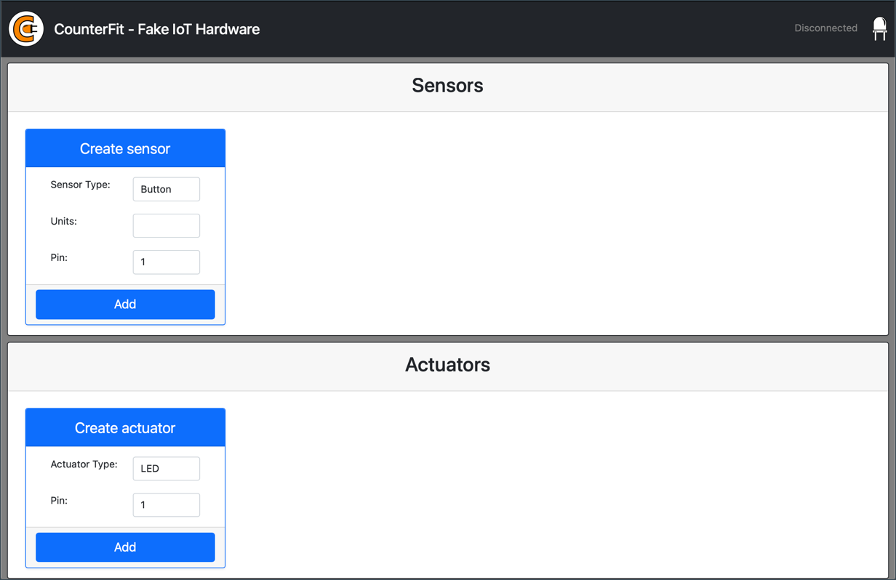

<!--
CO_OP_TRANSLATOR_METADATA:
{
  "original_hash": "52b4de6144b2efdced7797a5339d6035",
  "translation_date": "2025-08-27T22:41:58+00:00",
  "source_file": "1-getting-started/lessons/1-introduction-to-iot/virtual-device.md",
  "language_code": "ms"
}
-->
# Komputer Papan Tunggal Maya

Daripada membeli peranti IoT bersama sensor dan aktuator, anda boleh menggunakan komputer anda untuk mensimulasikan perkakasan IoT. Projek [CounterFit](https://github.com/CounterFit-IoT/CounterFit) membolehkan anda menjalankan aplikasi secara tempatan yang mensimulasikan perkakasan IoT seperti sensor dan aktuator, serta mengakses sensor dan aktuator tersebut daripada kod Python tempatan yang ditulis dengan cara yang sama seperti kod yang anda tulis pada Raspberry Pi menggunakan perkakasan fizikal.

## Persediaan

Untuk menggunakan CounterFit, anda perlu memasang beberapa perisian percuma pada komputer anda.

### Tugasan

Pasang perisian yang diperlukan.

1. Pasang Python. Rujuk [halaman muat turun Python](https://www.python.org/downloads/) untuk arahan memasang versi terkini Python.

1. Pasang Visual Studio Code (VS Code). Ini adalah editor yang akan anda gunakan untuk menulis kod peranti maya anda dalam Python. Rujuk [dokumentasi VS Code](https://code.visualstudio.com?WT.mc_id=academic-17441-jabenn) untuk arahan memasang VS Code.

    > 💁 Anda bebas menggunakan mana-mana IDE atau editor Python untuk pelajaran ini jika anda mempunyai alat pilihan, tetapi pelajaran ini akan memberikan arahan berdasarkan penggunaan VS Code.

1. Pasang sambungan Pylance untuk VS Code. Ini adalah sambungan untuk VS Code yang menyediakan sokongan bahasa Python. Rujuk [dokumentasi sambungan Pylance](https://marketplace.visualstudio.com/items?WT.mc_id=academic-17441-jabenn&itemName=ms-python.vscode-pylance) untuk arahan memasang sambungan ini dalam VS Code.

Arahan untuk memasang dan mengkonfigurasi aplikasi CounterFit akan diberikan pada masa yang sesuai dalam arahan tugasan kerana ia dipasang berdasarkan setiap projek.

## Hello World

Adalah tradisi apabila memulakan dengan bahasa pengaturcaraan atau teknologi baru untuk mencipta aplikasi 'Hello World' - aplikasi kecil yang mengeluarkan sesuatu seperti teks `"Hello World"` untuk menunjukkan bahawa semua alat telah dikonfigurasi dengan betul.

Aplikasi Hello World untuk perkakasan IoT maya akan memastikan bahawa anda telah memasang Python dan Visual Studio Code dengan betul. Ia juga akan menyambung ke CounterFit untuk sensor dan aktuator IoT maya. Ia tidak akan menggunakan sebarang perkakasan, ia hanya akan menyambung untuk membuktikan semuanya berfungsi.

Aplikasi ini akan berada dalam folder bernama `nightlight`, dan ia akan digunakan semula dengan kod yang berbeza dalam bahagian tugasan seterusnya untuk membina aplikasi lampu malam.

### Konfigurasi Persekitaran Maya Python

Salah satu ciri kuat Python ialah keupayaan untuk memasang [pakej Pip](https://pypi.org) - ini adalah pakej kod yang ditulis oleh orang lain dan diterbitkan di Internet. Anda boleh memasang pakej Pip pada komputer anda dengan satu arahan, kemudian menggunakan pakej itu dalam kod anda. Anda akan menggunakan Pip untuk memasang pakej untuk berkomunikasi dengan CounterFit.

Secara lalai, apabila anda memasang pakej, ia tersedia di mana-mana sahaja pada komputer anda, dan ini boleh menyebabkan masalah dengan versi pakej - seperti satu aplikasi bergantung pada satu versi pakej yang rosak apabila anda memasang versi baru untuk aplikasi lain. Untuk mengatasi masalah ini, anda boleh menggunakan [persekitaran maya Python](https://docs.python.org/3/library/venv.html), yang pada dasarnya adalah salinan Python dalam folder khusus, dan apabila anda memasang pakej Pip, ia hanya dipasang pada folder tersebut.

> 💁 Jika anda menggunakan Raspberry Pi, anda tidak menyediakan persekitaran maya pada peranti itu untuk menguruskan pakej Pip, sebaliknya anda menggunakan pakej global, kerana pakej Grove dipasang secara global oleh skrip pemasang.

#### Tugasan - konfigurasi persekitaran maya Python

Konfigurasikan persekitaran maya Python dan pasang pakej Pip untuk CounterFit.

1. Dari terminal atau baris arahan anda, jalankan arahan berikut di lokasi pilihan anda untuk mencipta dan menavigasi ke direktori baru:

    ```sh
    mkdir nightlight
    cd nightlight
    ```

1. Sekarang jalankan arahan berikut untuk mencipta persekitaran maya dalam folder `.venv`:

    ```sh
    python3 -m venv .venv
    ```

    > 💁 Anda perlu secara eksplisit memanggil `python3` untuk mencipta persekitaran maya sekiranya anda mempunyai Python 2 yang dipasang selain Python 3 (versi terkini). Jika anda mempunyai Python 2 yang dipasang, maka memanggil `python` akan menggunakan Python 2 dan bukannya Python 3.

1. Aktifkan persekitaran maya:

    * Pada Windows:
        * Jika anda menggunakan Command Prompt, atau Command Prompt melalui Windows Terminal, jalankan:

            ```cmd
            .venv\Scripts\activate.bat
            ```

        * Jika anda menggunakan PowerShell, jalankan:

            ```powershell
            .\.venv\Scripts\Activate.ps1
            ```

            > Jika anda mendapat ralat tentang skrip yang tidak dibenarkan dijalankan pada sistem ini, anda perlu membenarkan skrip dijalankan dengan menetapkan dasar pelaksanaan yang sesuai. Anda boleh melakukannya dengan melancarkan PowerShell sebagai pentadbir, kemudian menjalankan arahan berikut:

            ```powershell
            Set-ExecutionPolicy -ExecutionPolicy Unrestricted
            ```

            Masukkan `Y` apabila diminta untuk mengesahkan. Kemudian lancarkan semula PowerShell dan cuba lagi.

            Anda boleh menetapkan semula dasar pelaksanaan ini pada masa akan datang jika diperlukan. Anda boleh membaca lebih lanjut mengenainya di [halaman Dasar Pelaksanaan di Microsoft Docs](https://docs.microsoft.com/powershell/module/microsoft.powershell.core/about/about_execution_policies?WT.mc_id=academic-17441-jabenn).

    * Pada macOS atau Linux, jalankan:

        ```cmd
        source ./.venv/bin/activate
        ```

    > 💁 Arahan ini harus dijalankan dari lokasi yang sama di mana anda menjalankan arahan untuk mencipta persekitaran maya. Anda tidak perlu menavigasi ke dalam folder `.venv`, anda hanya perlu menjalankan arahan pengaktifan dan sebarang arahan untuk memasang pakej atau menjalankan kod dari folder tempat anda mencipta persekitaran maya.

1. Setelah persekitaran maya diaktifkan, arahan `python` lalai akan menjalankan versi Python yang digunakan untuk mencipta persekitaran maya. Jalankan arahan berikut untuk mendapatkan versinya:

    ```sh
    python --version
    ```

    Outputnya seharusnya mengandungi perkara berikut:

    ```output
    (.venv) ➜  nightlight python --version
    Python 3.9.1
    ```

    > 💁 Versi Python anda mungkin berbeza - selagi ia versi 3.6 atau lebih tinggi, anda sudah bersedia. Jika tidak, hapuskan folder ini, pasang versi Python yang lebih baru dan cuba lagi.

1. Jalankan arahan berikut untuk memasang pakej Pip untuk CounterFit. Pakej ini termasuk aplikasi utama CounterFit serta shims untuk perkakasan Grove. Shims ini membolehkan anda menulis kod seolah-olah anda sedang memprogram menggunakan sensor dan aktuator fizikal dari ekosistem Grove tetapi disambungkan ke peranti IoT maya.

    ```sh
    pip install CounterFit
    pip install counterfit-connection
    pip install counterfit-shims-grove
    ```

    Pakej Pip ini hanya akan dipasang dalam persekitaran maya, dan tidak akan tersedia di luar persekitaran ini.

### Tulis Kod

Setelah persekitaran maya Python sedia, anda boleh menulis kod untuk aplikasi 'Hello World'.

#### Tugasan - tulis kod

Cipta aplikasi Python untuk mencetak `"Hello World"` ke konsol.

1. Dari terminal atau baris arahan anda, jalankan arahan berikut di dalam persekitaran maya untuk mencipta fail Python bernama `app.py`:

    * Dari Windows jalankan:

        ```cmd
        type nul > app.py
        ```

    * Pada macOS atau Linux, jalankan:

        ```cmd
        touch app.py
        ```

1. Buka folder semasa dalam VS Code:

    ```sh
    code .
    ```

    > 💁 Jika terminal anda mengembalikan `command not found` pada macOS, ini bermakna VS Code belum ditambahkan ke PATH anda. Anda boleh menambahkan VS Code ke PATH dengan mengikuti arahan dalam [bahagian Melancarkan dari baris arahan dalam dokumentasi VS Code](https://code.visualstudio.com/docs/setup/mac?WT.mc_id=academic-17441-jabenn#_launching-from-the-command-line) dan jalankan arahan selepas itu. VS Code ditambahkan ke PATH secara lalai pada Windows dan Linux.

1. Apabila VS Code dilancarkan, ia akan mengaktifkan persekitaran maya Python. Persekitaran maya yang dipilih akan muncul di bar status bawah:

    

1. Jika Terminal VS Code sudah berjalan semasa VS Code dimulakan, ia tidak akan mempunyai persekitaran maya yang diaktifkan di dalamnya. Cara paling mudah ialah mematikan terminal menggunakan butang **Kill the active terminal instance**:

    

    Anda boleh mengetahui jika terminal mempunyai persekitaran maya yang diaktifkan kerana nama persekitaran maya akan menjadi awalan pada prompt terminal. Sebagai contoh, ia mungkin:

    ```sh
    (.venv) ➜  nightlight
    ```

    Jika anda tidak mempunyai `.venv` sebagai awalan pada prompt, persekitaran maya tidak diaktifkan dalam terminal.

1. Lancarkan terminal VS Code baru dengan memilih *Terminal -> New Terminal*, atau menekan `` CTRL+` ``. Terminal baru akan memuatkan persekitaran maya, dan panggilan untuk mengaktifkan ini akan muncul dalam terminal. Prompt juga akan mempunyai nama persekitaran maya (`.venv`):

    ```output
    ➜  nightlight source .venv/bin/activate
    (.venv) ➜  nightlight 
    ```

1. Buka fail `app.py` dari penjelajah VS Code dan tambahkan kod berikut:

    ```python
    print('Hello World!')
    ```

    Fungsi `print` mencetak apa sahaja yang dihantar kepadanya ke konsol.

1. Dari terminal VS Code, jalankan arahan berikut untuk menjalankan aplikasi Python anda:

    ```sh
    python app.py
    ```

    Output berikut akan muncul:

    ```output
    (.venv) ➜  nightlight python app.py 
    Hello World!
    ```

😀 Program 'Hello World' anda berjaya!

### Sambungkan 'Perkakasan'

Sebagai langkah kedua 'Hello World', anda akan menjalankan aplikasi CounterFit dan menyambungkan kod anda kepadanya. Ini adalah setara maya dengan menyambungkan beberapa perkakasan IoT ke kit pembangunan.

#### Tugasan - sambungkan 'perkakasan'

1. Dari terminal VS Code, lancarkan aplikasi CounterFit dengan arahan berikut:

    ```sh
    counterfit
    ```

    Aplikasi akan mula berjalan dan dibuka dalam pelayar web anda:

    

    Ia akan ditandakan sebagai *Disconnected*, dengan LED di sudut kanan atas dimatikan.

1. Tambahkan kod berikut ke bahagian atas `app.py`:

    ```python
    from counterfit_connection import CounterFitConnection
    CounterFitConnection.init('127.0.0.1', 5000)
    ```

    Kod ini mengimport kelas `CounterFitConnection` dari modul `counterfit_connection`, yang berasal dari pakej pip `counterfit-connection` yang anda pasang sebelum ini. Ia kemudian memulakan sambungan ke aplikasi CounterFit yang berjalan pada `127.0.0.1`, yang merupakan alamat IP yang sentiasa boleh anda gunakan untuk mengakses komputer tempatan anda (sering dirujuk sebagai *localhost*), pada port 5000.

    > 💁 Jika anda mempunyai aplikasi lain yang berjalan pada port 5000, anda boleh menukarnya dengan mengemas kini port dalam kod, dan menjalankan CounterFit menggunakan `CounterFit --port <port_number>`, menggantikan `<port_number>` dengan port yang anda mahu gunakan.

1. Anda perlu melancarkan terminal VS Code baru dengan memilih butang **Create a new integrated terminal**. Ini kerana aplikasi CounterFit sedang berjalan dalam terminal semasa.

    

1. Dalam terminal baru ini, jalankan fail `app.py` seperti sebelumnya. Status CounterFit akan berubah kepada **Connected** dan LED akan menyala.

    

> 💁 Anda boleh menemui kod ini dalam folder [code/virtual-device](../../../../../1-getting-started/lessons/1-introduction-to-iot/code/virtual-device).

😀 Sambungan anda ke perkakasan berjaya!

---

**Penafian**:  
Dokumen ini telah diterjemahkan menggunakan perkhidmatan terjemahan AI [Co-op Translator](https://github.com/Azure/co-op-translator). Walaupun kami berusaha untuk memastikan ketepatan, sila ambil perhatian bahawa terjemahan automatik mungkin mengandungi kesilapan atau ketidaktepatan. Dokumen asal dalam bahasa asalnya harus dianggap sebagai sumber yang berwibawa. Untuk maklumat yang kritikal, terjemahan manusia profesional adalah disyorkan. Kami tidak bertanggungjawab atas sebarang salah faham atau salah tafsir yang timbul daripada penggunaan terjemahan ini.