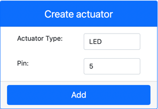

<!--
CO_OP_TRANSLATOR_METADATA:
{
  "original_hash": "9c640f93263fd9adbfda920739e09feb",
  "translation_date": "2025-08-28T00:46:07+00:00",
  "source_file": "1-getting-started/lessons/3-sensors-and-actuators/virtual-device-actuator.md",
  "language_code": "ms"
}
-->
# Bina Lampu Malam - Perkakasan IoT Maya

Dalam bahagian pelajaran ini, anda akan menambah LED pada peranti IoT maya anda dan menggunakannya untuk mencipta lampu malam.

## Perkakasan Maya

Lampu malam memerlukan satu penggerak, yang dicipta dalam aplikasi CounterFit.

Penggerak tersebut adalah **LED**. Dalam peranti IoT fizikal, ia adalah [diod pemancar cahaya](https://wikipedia.org/wiki/Light-emitting_diode) yang memancarkan cahaya apabila arus mengalir melaluinya. Ini adalah penggerak digital yang mempunyai 2 keadaan, hidup dan mati. Menghantar nilai 1 akan menghidupkan LED, dan 0 akan mematikannya.

Logik lampu malam dalam pseudo-kod adalah:

```output
Check the light level.
If the light is less than 300
    Turn the LED on
Otherwise
    Turn the LED off
```

### Tambah Penggerak ke CounterFit

Untuk menggunakan LED maya, anda perlu menambahkannya ke aplikasi CounterFit.

#### Tugasan - tambah penggerak ke CounterFit

Tambah LED ke aplikasi CounterFit.

1. Pastikan aplikasi web CounterFit sedang berjalan dari bahagian tugasan sebelumnya. Jika tidak, mulakan semula dan tambahkan semula penderia cahaya.

1. Cipta LED:

    1. Dalam kotak *Create actuator* di panel *Actuator*, klik menu lungsur *Actuator type* dan pilih *LED*.

    1. Tetapkan *Pin* kepada *5*.

    1. Pilih butang **Add** untuk mencipta LED pada Pin 5.

    

    LED akan dicipta dan muncul dalam senarai penggerak.

    

    Setelah LED dicipta, anda boleh menukar warnanya menggunakan pemilih *Color*. Pilih butang **Set** untuk menukar warna selepas anda memilihnya.

### Programkan Lampu Malam

Lampu malam kini boleh diprogramkan menggunakan penderia cahaya dan LED CounterFit.

#### Tugasan - programkan lampu malam

Programkan lampu malam.

1. Buka projek lampu malam dalam VS Code yang anda cipta dalam bahagian tugasan sebelumnya. Matikan dan cipta semula terminal untuk memastikan ia berjalan menggunakan persekitaran maya jika perlu.

1. Buka fail `app.py`.

1. Tambahkan kod berikut ke fail `app.py` untuk mengimport pustaka yang diperlukan. Kod ini perlu ditambah di bahagian atas, di bawah baris `import` yang lain.

    ```python
    from counterfit_shims_grove.grove_led import GroveLed
    ```

    Pernyataan `from counterfit_shims_grove.grove_led import GroveLed` mengimport `GroveLed` daripada pustaka Python CounterFit Grove shim. Pustaka ini mengandungi kod untuk berinteraksi dengan LED yang dicipta dalam aplikasi CounterFit.

1. Tambahkan kod berikut selepas deklarasi `light_sensor` untuk mencipta satu instance kelas yang menguruskan LED:

    ```python
    led = GroveLed(5)
    ```

    Baris `led = GroveLed(5)` mencipta satu instance kelas `GroveLed` yang disambungkan ke pin **5** - pin CounterFit Grove yang disambungkan kepada LED.

1. Tambahkan semakan di dalam gelung `while`, dan sebelum `time.sleep` untuk memeriksa tahap cahaya dan menghidupkan atau mematikan LED:

    ```python
    if light < 300:
        led.on()
    else:
        led.off()
    ```

    Kod ini memeriksa nilai `light`. Jika nilai ini kurang daripada 300, ia memanggil kaedah `on` dari kelas `GroveLed` yang menghantar nilai digital 1 kepada LED, menghidupkannya. Jika nilai cahaya lebih besar atau sama dengan 300, ia memanggil kaedah `off`, menghantar nilai digital 0 kepada LED, mematikannya.

    > 💁 Kod ini perlu diindentas pada tahap yang sama dengan baris `print('Light level:', light)` untuk berada di dalam gelung while!

1. Dari Terminal VS Code, jalankan arahan berikut untuk menjalankan aplikasi Python anda:

    ```sh
    python3 app.py
    ```

    Nilai cahaya akan dipaparkan di konsol.

    ```output
    (.venv) ➜  GroveTest python3 app.py 
    Light level: 143
    Light level: 244
    Light level: 246
    Light level: 253
    ```

1. Tukar tetapan *Value* atau *Random* untuk mengubah tahap cahaya di atas dan di bawah 300. LED akan hidup dan mati.


> 💁 Anda boleh menemui kod ini dalam folder [code-actuator/virtual-device](../../../../../1-getting-started/lessons/3-sensors-and-actuators/code-actuator/virtual-device).

😀 Program lampu malam anda berjaya!

---

**Penafian**:  
Dokumen ini telah diterjemahkan menggunakan perkhidmatan terjemahan AI [Co-op Translator](https://github.com/Azure/co-op-translator). Walaupun kami berusaha untuk memastikan ketepatan, sila ambil perhatian bahawa terjemahan automatik mungkin mengandungi kesilapan atau ketidaktepatan. Dokumen asal dalam bahasa asalnya harus dianggap sebagai sumber yang berwibawa. Untuk maklumat penting, terjemahan manusia profesional adalah disyorkan. Kami tidak bertanggungjawab atas sebarang salah faham atau salah tafsir yang timbul daripada penggunaan terjemahan ini.