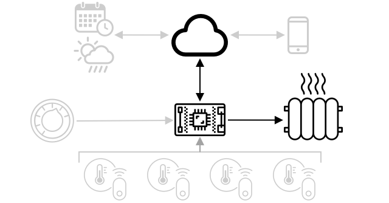

<!--
CO_OP_TRANSLATOR_METADATA:
{
  "original_hash": "71b5040e0b3472f1c0949c9b55f224c0",
  "translation_date": "2025-08-27T22:17:22+00:00",
  "source_file": "1-getting-started/lessons/4-connect-internet/README.md",
  "language_code": "ms"
}
-->
# Sambungkan peranti anda ke Internet


> Sketchnote oleh [Nitya Narasimhan](https://github.com/nitya). Klik imej untuk versi yang lebih besar.

Pelajaran ini diajar sebagai sebahagian daripada siri [Hello IoT](https://youtube.com/playlist?list=PLmsFUfdnGr3xRts0TIwyaHyQuHaNQcb6-) dari [Microsoft Reactor](https://developer.microsoft.com/reactor/?WT.mc_id=academic-17441-jabenn). Pelajaran ini disampaikan dalam 2 video - satu pelajaran selama 1 jam, dan satu sesi soal jawab selama 1 jam yang mendalami bahagian pelajaran dan menjawab soalan.

[](https://youtu.be/O4dd172mZhs)

[](https://youtu.be/j-cVCzRDE2Q)

> 🎥 Klik imej di atas untuk menonton video

## Kuiz sebelum pelajaran

[Kuiz sebelum pelajaran](https://black-meadow-040d15503.1.azurestaticapps.net/quiz/7)

## Pengenalan

Huruf **I** dalam IoT bermaksud **Internet** - sambungan awan dan perkhidmatan yang membolehkan banyak ciri peranti IoT, daripada mengumpul bacaan dari sensor yang disambungkan ke peranti, hingga menghantar mesej untuk mengawal aktuator. Peranti IoT biasanya disambungkan ke satu perkhidmatan awan IoT menggunakan protokol komunikasi standard, dan perkhidmatan itu disambungkan ke seluruh aplikasi IoT anda, daripada perkhidmatan AI untuk membuat keputusan pintar berdasarkan data anda, hingga aplikasi web untuk kawalan atau pelaporan.

> 🎓 Data yang dikumpulkan dari sensor dan dihantar ke awan dipanggil telemetri.

Peranti IoT boleh menerima mesej dari awan. Selalunya mesej ini mengandungi arahan - iaitu arahan untuk melaksanakan tindakan sama ada secara dalaman (seperti reboot atau kemas kini firmware), atau menggunakan aktuator (seperti menyalakan lampu).

Pelajaran ini memperkenalkan beberapa protokol komunikasi yang boleh digunakan oleh peranti IoT untuk disambungkan ke awan, dan jenis data yang mungkin dihantar atau diterima. Anda juga akan mencuba sendiri kedua-duanya, menambah kawalan internet pada lampu malam anda, memindahkan logik kawalan LED ke kod 'server' yang berjalan secara tempatan.

Dalam pelajaran ini, kita akan membincangkan:

* [Protokol komunikasi](../../../../../1-getting-started/lessons/4-connect-internet)
* [Message Queueing Telemetry Transport (MQTT)](../../../../../1-getting-started/lessons/4-connect-internet)
* [Telemetri](../../../../../1-getting-started/lessons/4-connect-internet)
* [Arahan](../../../../../1-getting-started/lessons/4-connect-internet)

## Protokol komunikasi

Terdapat beberapa protokol komunikasi popular yang digunakan oleh peranti IoT untuk berkomunikasi dengan Internet. Yang paling popular adalah berdasarkan pemesejan publish/subscribe melalui sejenis broker. Peranti IoT disambungkan ke broker dan menerbitkan telemetri serta melanggan arahan. Perkhidmatan awan juga disambungkan ke broker dan melanggan semua mesej telemetri serta menerbitkan arahan sama ada kepada peranti tertentu, atau kepada kumpulan peranti.


MQTT adalah protokol komunikasi paling popular untuk peranti IoT dan akan dibincangkan dalam pelajaran ini. Protokol lain termasuk AMQP dan HTTP/HTTPS.

## Message Queueing Telemetry Transport (MQTT)

[MQTT](http://mqtt.org) adalah protokol pemesejan standard terbuka yang ringan dan boleh menghantar mesej antara peranti. Ia direka pada tahun 1999 untuk memantau saluran paip minyak, sebelum dikeluarkan sebagai standard terbuka 15 tahun kemudian oleh IBM.

MQTT mempunyai satu broker dan pelbagai klien. Semua klien disambungkan ke broker, dan broker mengarahkan mesej kepada klien yang relevan. Mesej diarahkan menggunakan topik yang dinamakan, bukannya dihantar terus kepada klien individu. Klien boleh menerbitkan kepada satu topik, dan mana-mana klien yang melanggan topik itu akan menerima mesej tersebut.


✅ Lakukan penyelidikan. Jika anda mempunyai banyak peranti IoT, bagaimana anda boleh memastikan broker MQTT anda dapat mengendalikan semua mesej?

### Sambungkan peranti IoT anda ke MQTT

Bahagian pertama untuk menambah kawalan Internet pada lampu malam anda adalah menyambungkannya ke broker MQTT.

#### Tugas

Sambungkan peranti anda ke broker MQTT.

Dalam bahagian pelajaran ini, anda akan menyambungkan lampu malam IoT anda ke Internet untuk membolehkan ia dikawal dari jauh. Kemudian dalam pelajaran ini, peranti IoT anda akan menghantar mesej telemetri melalui MQTT ke broker MQTT awam dengan tahap cahaya, di mana ia akan diambil oleh beberapa kod server yang akan anda tulis. Kod ini akan memeriksa tahap cahaya dan menghantar mesej arahan kembali ke peranti untuk memberitahu sama ada LED perlu dihidupkan atau dimatikan.

Kes penggunaan dunia nyata untuk tetapan seperti ini boleh menjadi untuk mengumpul data dari pelbagai sensor cahaya sebelum memutuskan untuk menyalakan lampu, di lokasi yang mempunyai banyak lampu, seperti stadium. Ini boleh menghalang lampu daripada dinyalakan jika hanya satu sensor yang dilindungi oleh awan atau burung, tetapi sensor lain mengesan cahaya yang mencukupi.

✅ Apakah situasi lain yang memerlukan data dari pelbagai sensor untuk dinilai sebelum menghantar arahan?

Daripada menangani kerumitan menyiapkan broker MQTT sebagai sebahagian daripada tugasan ini, anda boleh menggunakan pelayan ujian awam yang menjalankan [Eclipse Mosquitto](https://www.mosquitto.org), broker MQTT sumber terbuka. Broker ujian ini tersedia secara awam di [test.mosquitto.org](https://test.mosquitto.org), dan tidak memerlukan akaun untuk disediakan, menjadikannya alat yang hebat untuk menguji klien dan pelayan MQTT.

> 💁 Broker ujian ini adalah awam dan tidak selamat. Sesiapa sahaja boleh mendengar apa yang anda terbitkan, jadi ia tidak boleh digunakan dengan data yang perlu dirahsiakan.


Ikuti langkah yang relevan di bawah untuk menyambungkan peranti anda ke broker MQTT:

* [Arduino - Wio Terminal](wio-terminal-mqtt.md)
* [Komputer papan tunggal - Raspberry Pi/Peranti IoT Maya](single-board-computer-mqtt.md)

### Penjelasan lebih mendalam tentang MQTT

Topik boleh mempunyai hierarki, dan klien boleh melanggan tahap hierarki yang berbeza menggunakan wildcard. Sebagai contoh, anda boleh menghantar mesej telemetri suhu ke topik `/telemetry/temperature` dan mesej kelembapan ke topik `/telemetry/humidity`, kemudian dalam aplikasi awan anda melanggan topik `/telemetry/*` untuk menerima kedua-dua mesej telemetri suhu dan kelembapan.

Mesej boleh dihantar dengan kualiti perkhidmatan (QoS), yang menentukan jaminan mesej diterima.

* Sekali sahaja - mesej dihantar hanya sekali dan klien serta broker tidak mengambil langkah tambahan untuk mengesahkan penghantaran (fire and forget).
* Sekurang-kurangnya sekali - mesej dicuba semula oleh penghantar beberapa kali sehingga pengesahan diterima (acknowledged delivery).
* Tepat sekali - penghantar dan penerima terlibat dalam jabat tangan dua peringkat untuk memastikan hanya satu salinan mesej diterima (assured delivery).

✅ Apakah situasi yang mungkin memerlukan mesej penghantaran terjamin berbanding mesej fire and forget?

Walaupun namanya Message Queueing (singkatan dalam MQTT), ia sebenarnya tidak menyokong antrian mesej. Ini bermakna jika klien terputus sambungan, kemudian menyambung semula, ia tidak akan menerima mesej yang dihantar semasa pemutusan sambungan, kecuali mesej yang telah mula diproses menggunakan proses QoS. Mesej boleh mempunyai bendera retained yang ditetapkan padanya. Jika ini ditetapkan, broker MQTT akan menyimpan mesej terakhir yang dihantar pada topik dengan bendera ini, dan menghantarnya kepada mana-mana klien yang kemudian melanggan topik tersebut. Dengan cara ini, klien akan sentiasa mendapat mesej terkini.

MQTT juga menyokong fungsi keep alive yang memeriksa sama ada sambungan masih hidup semasa jurang panjang antara mesej.

> 🦟 [Mosquitto dari Eclipse Foundation](https://mosquitto.org) mempunyai broker MQTT percuma yang boleh anda jalankan sendiri untuk bereksperimen dengan MQTT, bersama dengan broker MQTT awam yang boleh anda gunakan untuk menguji kod anda, dihoskan di [test.mosquitto.org](https://test.mosquitto.org).

Sambungan MQTT boleh menjadi awam dan terbuka, atau disulitkan dan dilindungi menggunakan nama pengguna dan kata laluan, atau sijil.

> 💁 MQTT berkomunikasi melalui TCP/IP, protokol rangkaian asas yang sama seperti HTTP, tetapi pada port yang berbeza. Anda juga boleh menggunakan MQTT melalui websockets untuk berkomunikasi dengan aplikasi web yang berjalan dalam pelayar, atau dalam situasi di mana firewall atau peraturan rangkaian lain menyekat sambungan MQTT standard.

## Telemetri

Perkataan telemetri berasal dari akar bahasa Yunani yang bermaksud mengukur dari jauh. Telemetri adalah tindakan mengumpul data dari sensor dan menghantarnya ke awan.

> 💁 Salah satu peranti telemetri terawal dicipta di Perancis pada tahun 1874 dan menghantar data cuaca dan kedalaman salji secara masa nyata dari Mont Blanc ke Paris. Ia menggunakan wayar fizikal kerana teknologi tanpa wayar belum tersedia pada masa itu.

Mari kita lihat kembali contoh termostat pintar dari Pelajaran 1.


Termostat mempunyai sensor suhu untuk mengumpul telemetri. Ia kemungkinan besar mempunyai satu sensor suhu terbina dalam, dan mungkin disambungkan ke pelbagai sensor suhu luaran melalui protokol tanpa wayar seperti [Bluetooth Low Energy](https://wikipedia.org/wiki/Bluetooth_Low_Energy) (BLE).

Contoh data telemetri yang akan dihantar mungkin:

| Nama | Nilai | Penerangan |
| ---- | ----- | ----------- |
| `thermostat_temperature` | 18°C | Suhu yang diukur oleh sensor suhu terbina dalam termostat |
| `livingroom_temperature` | 19°C | Suhu yang diukur oleh sensor suhu jauh yang dinamakan `livingroom` untuk mengenal pasti bilik di mana ia berada |
| `bedroom_temperature` | 21°C | Suhu yang diukur oleh sensor suhu jauh yang dinamakan `bedroom` untuk mengenal pasti bilik di mana ia berada |

Perkhidmatan awan kemudian boleh menggunakan data telemetri ini untuk membuat keputusan tentang arahan yang akan dihantar untuk mengawal pemanasan.

### Hantar telemetri dari peranti IoT anda

Bahagian seterusnya dalam menambah kawalan Internet pada lampu malam anda adalah menghantar telemetri tahap cahaya ke broker MQTT pada topik telemetri.

#### Tugas - hantar telemetri dari peranti IoT anda

Hantar telemetri tahap cahaya ke broker MQTT.

Data dihantar dalam format JSON - singkatan untuk JavaScript Object Notation, satu standard untuk menyandikan data dalam teks menggunakan pasangan kunci/nilai.

✅ Jika anda belum pernah menemui JSON sebelum ini, anda boleh belajar lebih lanjut mengenainya di [dokumentasi JSON.org](https://www.json.org/).

Ikuti langkah yang relevan di bawah untuk menghantar telemetri dari peranti anda ke broker MQTT:

* [Arduino - Wio Terminal](wio-terminal-telemetry.md)
* [Komputer papan tunggal - Raspberry Pi/Peranti IoT Maya](single-board-computer-telemetry.md)

### Terima telemetri dari broker MQTT

Tiada gunanya menghantar telemetri jika tiada apa-apa di hujung lain untuk mendengarnya. Telemetri tahap cahaya memerlukan sesuatu untuk mendengarnya bagi memproses data. Kod 'server' ini adalah jenis kod yang akan anda gunakan pada perkhidmatan awan sebagai sebahagian daripada aplikasi IoT yang lebih besar, tetapi di sini anda akan menjalankan kod ini secara tempatan pada komputer anda (atau pada Pi anda jika anda menulis kod terus di sana). Kod server ini terdiri daripada aplikasi Python yang mendengar mesej telemetri melalui MQTT dengan tahap cahaya. Kemudian dalam pelajaran ini, anda akan membuatnya membalas dengan mesej arahan dengan arahan untuk menyalakan atau mematikan LED.

✅ Lakukan penyelidikan: Apa yang berlaku kepada mesej MQTT jika tiada pendengar?

#### Pasang Python dan VS Code

Jika anda belum memasang Python dan VS Code secara tempatan, anda perlu memasangnya untuk menulis kod server. Jika anda menggunakan peranti IoT maya, atau bekerja pada Raspberry Pi anda, anda boleh melangkau langkah ini kerana ia sepatutnya sudah dipasang dan dikonfigurasikan.

##### Tugas - pasang Python dan VS Code

Pasang Python dan VS Code.

1. Pasang Python. Rujuk [halaman muat turun Python](https://www.python.org/downloads/) untuk arahan memasang versi Python terkini.

1. Pasang Visual Studio Code (VS Code). Ini adalah editor yang akan anda gunakan untuk menulis kod peranti maya anda dalam Python. Rujuk [dokumentasi VS Code](https://code.visualstudio.com?WT.mc_id=academic-17441-jabenn) untuk arahan memasang VS Code.
💁 Anda bebas menggunakan mana-mana IDE atau editor Python untuk pelajaran ini jika anda mempunyai alat pilihan, tetapi pelajaran akan memberikan arahan berdasarkan penggunaan VS Code.
1. Pasang sambungan Pylance untuk VS Code. Ini adalah sambungan untuk VS Code yang menyediakan sokongan bahasa Python. Rujuk [dokumentasi sambungan Pylance](https://marketplace.visualstudio.com/items?WT.mc_id=academic-17441-jabenn&itemName=ms-python.vscode-pylance) untuk arahan memasang sambungan ini dalam VS Code.

#### Konfigurasi persekitaran maya Python

Salah satu ciri hebat Python ialah keupayaan untuk memasang [pakej pip](https://pypi.org) - iaitu pakej kod yang ditulis oleh orang lain dan diterbitkan di Internet. Anda boleh memasang pakej pip ke komputer anda dengan satu arahan, kemudian menggunakan pakej itu dalam kod anda. Anda akan menggunakan pip untuk memasang pakej bagi berkomunikasi melalui MQTT.

Secara lalai, apabila anda memasang pakej, ia tersedia di seluruh komputer anda, dan ini boleh menyebabkan masalah dengan versi pakej - seperti satu aplikasi bergantung pada satu versi pakej yang rosak apabila anda memasang versi baru untuk aplikasi lain. Untuk mengatasi masalah ini, anda boleh menggunakan [persekitaran maya Python](https://docs.python.org/3/library/venv.html), yang pada dasarnya adalah salinan Python dalam folder khusus, dan apabila anda memasang pakej pip, ia hanya dipasang ke folder itu.

##### Tugasan - konfigurasi persekitaran maya Python

Konfigurasi persekitaran maya Python dan pasang pakej pip MQTT.

1. Dari terminal atau baris arahan anda, jalankan arahan berikut di lokasi pilihan anda untuk mencipta dan menavigasi ke direktori baru:

    ```sh
    mkdir nightlight-server
    cd nightlight-server
    ```

1. Sekarang jalankan arahan berikut untuk mencipta persekitaran maya dalam folder `.venv`:

    ```sh
    python3 -m venv .venv
    ```

    > 💁 Anda perlu secara eksplisit memanggil `python3` untuk mencipta persekitaran maya sekiranya anda mempunyai Python 2 dipasang selain Python 3 (versi terkini). Jika anda mempunyai Python 2 dipasang, maka memanggil `python` akan menggunakan Python 2 dan bukannya Python 3.

1. Aktifkan persekitaran maya:

    * Pada Windows:
        * Jika anda menggunakan Command Prompt, atau Command Prompt melalui Windows Terminal, jalankan:

            ```cmd
            .venv\Scripts\activate.bat
            ```

        * Jika anda menggunakan PowerShell, jalankan:

            ```powershell
            .\.venv\Scripts\Activate.ps1
            ```

    * Pada macOS atau Linux, jalankan:

        ```cmd
        source ./.venv/bin/activate
        ```

    > 💁 Arahan ini harus dijalankan dari lokasi yang sama di mana anda menjalankan arahan untuk mencipta persekitaran maya. Anda tidak perlu menavigasi ke dalam folder `.venv`, anda hanya perlu menjalankan arahan pengaktifan dan sebarang arahan untuk memasang pakej atau menjalankan kod dari folder tempat anda mencipta persekitaran maya.

1. Setelah persekitaran maya diaktifkan, arahan `python` lalai akan menjalankan versi Python yang digunakan untuk mencipta persekitaran maya. Jalankan arahan berikut untuk mendapatkan versinya:

    ```sh
    python --version
    ```

    Outputnya akan serupa dengan berikut:

    ```output
    (.venv) ➜  nightlight-server python --version
    Python 3.9.1
    ```

    > 💁 Versi Python anda mungkin berbeza - selagi ia versi 3.6 atau lebih tinggi, anda sudah bersedia. Jika tidak, hapuskan folder ini, pasang versi Python yang lebih baru dan cuba lagi.

1. Jalankan arahan berikut untuk memasang pakej pip untuk [Paho-MQTT](https://pypi.org/project/paho-mqtt/), sebuah perpustakaan MQTT yang popular.

    ```sh
    pip install paho-mqtt
    ```

    Pakej pip ini hanya akan dipasang dalam persekitaran maya, dan tidak akan tersedia di luar persekitaran ini.

#### Tulis kod pelayan

Kod pelayan kini boleh ditulis dalam Python.

##### Tugasan - tulis kod pelayan

Tulis kod pelayan.

1. Dari terminal atau baris arahan anda, jalankan arahan berikut di dalam persekitaran maya untuk mencipta fail Python bernama `app.py`:

    * Dari Windows jalankan:

        ```cmd
        type nul > app.py
        ```

    * Pada macOS atau Linux, jalankan:

        ```cmd
        touch app.py
        ```

1. Buka folder semasa dalam VS Code:

    ```sh
    code .
    ```

1. Apabila VS Code dilancarkan, ia akan mengaktifkan persekitaran maya Python. Ini akan dilaporkan di bar status bawah:

    

1. Jika Terminal VS Code sudah berjalan semasa VS Code dimulakan, ia tidak akan mempunyai persekitaran maya yang diaktifkan di dalamnya. Cara paling mudah ialah mematikan terminal menggunakan butang **Kill the active terminal instance**:

    

1. Lancarkan Terminal VS Code baru dengan memilih *Terminal -> New Terminal*, atau menekan `` CTRL+` ``. Terminal baru akan memuatkan persekitaran maya, dengan panggilan untuk mengaktifkannya muncul di terminal. Nama persekitaran maya (`.venv`) juga akan berada dalam prompt:

    ```output
    ➜  nightlight-server source .venv/bin/activate
    (.venv) ➜  nightlight 
    ```

1. Buka fail `app.py` dari penjelajah VS Code dan tambahkan kod berikut:

    ```python
    import json
    import time
    
    import paho.mqtt.client as mqtt
    
    id = '<ID>'
    
    client_telemetry_topic = id + '/telemetry'
    client_name = id + 'nightlight_server'
    
    mqtt_client = mqtt.Client(client_name)
    mqtt_client.connect('test.mosquitto.org')
    
    mqtt_client.loop_start()
    
    def handle_telemetry(client, userdata, message):
        payload = json.loads(message.payload.decode())
        print("Message received:", payload)
    
    mqtt_client.subscribe(client_telemetry_topic)
    mqtt_client.on_message = handle_telemetry
    
    while True:
        time.sleep(2)
    ```

    Gantikan `<ID>` pada baris 6 dengan ID unik yang anda gunakan semasa mencipta kod peranti anda.

    ⚠️ Ini **mesti** ID yang sama yang anda gunakan pada peranti anda, jika tidak, kod pelayan tidak akan melanggan atau menerbitkan ke topik yang betul.

    Kod ini mencipta klien MQTT dengan nama unik, dan menyambung ke broker *test.mosquitto.org*. Ia kemudian memulakan gelung pemprosesan yang berjalan di latar belakang mendengar mesej pada mana-mana topik yang dilanggan.

    Klien kemudian melanggan mesej pada topik telemetri, dan mentakrifkan fungsi yang dipanggil apabila mesej diterima. Apabila mesej telemetri diterima, fungsi `handle_telemetry` dipanggil, mencetak mesej yang diterima ke konsol.

    Akhir sekali, gelung tak terhingga memastikan aplikasi terus berjalan. Klien MQTT mendengar mesej di latar belakang dan berjalan sepanjang masa aplikasi utama berjalan.

1. Dari terminal VS Code, jalankan arahan berikut untuk menjalankan aplikasi Python anda:

    ```sh
    python app.py
    ```

    Aplikasi akan mula mendengar mesej dari peranti IoT.

1. Pastikan peranti anda berjalan dan menghantar mesej telemetri. Laraskan tahap cahaya yang dikesan oleh peranti fizikal atau maya anda. Mesej yang diterima akan dicetak ke terminal.

    ```output
    (.venv) ➜  nightlight-server python app.py
    Message received: {'light': 0}
    Message received: {'light': 400}
    ```

    Fail app.py dalam persekitaran maya nightlight mesti berjalan supaya fail app.py dalam persekitaran maya nightlight-server dapat menerima mesej yang dihantar.

> 💁 Anda boleh menemui kod ini dalam folder [code-server/server](../../../../../1-getting-started/lessons/4-connect-internet/code-server/server).

### Berapa kerap telemetri harus dihantar?

Satu pertimbangan penting dengan telemetri ialah berapa kerap untuk mengukur dan menghantar data? Jawapannya - ia bergantung. Jika anda mengukur dengan kerap, anda boleh bertindak balas dengan lebih cepat terhadap perubahan dalam pengukuran, tetapi anda menggunakan lebih banyak kuasa, lebih banyak jalur lebar, menghasilkan lebih banyak data dan memerlukan lebih banyak sumber awan untuk memprosesnya. Anda perlu mengukur dengan kerap, tetapi tidak terlalu kerap.

Untuk termostat, mengukur setiap beberapa minit mungkin lebih daripada mencukupi kerana suhu tidak berubah dengan kerap. Jika anda hanya mengukur sekali sehari, anda mungkin memanaskan rumah anda untuk suhu malam pada tengah hari yang cerah, manakala jika anda mengukur setiap saat, anda akan mempunyai ribuan pengukuran suhu yang tidak perlu yang akan memakan kelajuan dan jalur lebar Internet pengguna (masalah untuk orang dengan pelan jalur lebar terhad), menggunakan lebih banyak kuasa yang boleh menjadi masalah untuk peranti berkuasa bateri seperti sensor jauh, dan meningkatkan kos sumber pengkomputeran awan penyedia untuk memproses dan menyimpannya.

Jika anda memantau data sekitar mesin di kilang yang jika gagal boleh menyebabkan kerosakan besar dan kerugian berjuta-juta dolar, maka mengukur beberapa kali sesaat mungkin diperlukan. Lebih baik membazirkan jalur lebar daripada terlepas telemetri yang menunjukkan bahawa mesin perlu dihentikan dan diperbaiki sebelum ia rosak.

> 💁 Dalam situasi ini, anda mungkin mempertimbangkan untuk mempunyai peranti tepi untuk memproses telemetri terlebih dahulu bagi mengurangkan kebergantungan pada Internet.

### Kehilangan sambungan

Sambungan Internet boleh menjadi tidak stabil, dengan gangguan yang biasa. Apa yang harus dilakukan oleh peranti IoT dalam keadaan ini - adakah ia harus kehilangan data, atau menyimpannya sehingga sambungan dipulihkan? Sekali lagi, jawapannya bergantung.

Untuk termostat, data mungkin boleh hilang sebaik sahaja pengukuran suhu baru diambil. Sistem pemanasan tidak peduli bahawa 20 minit yang lalu suhu adalah 20.5°C jika suhu sekarang adalah 19°C, suhu sekarang yang menentukan sama ada pemanasan harus dihidupkan atau dimatikan.

Untuk mesin, anda mungkin ingin menyimpan data, terutamanya jika ia digunakan untuk mencari tren. Terdapat model pembelajaran mesin yang dapat mengesan anomali dalam aliran data dengan melihat data dari tempoh masa tertentu (seperti sejam terakhir) dan mengenal pasti data yang tidak normal. Ini sering digunakan untuk penyelenggaraan ramalan, mencari petunjuk bahawa sesuatu mungkin rosak tidak lama lagi supaya anda boleh memperbaiki atau menggantikannya sebelum itu berlaku. Anda mungkin mahu setiap bit telemetri untuk mesin dihantar supaya ia boleh diproses untuk pengesanan anomali, jadi sebaik sahaja peranti IoT dapat menyambung semula, ia akan menghantar semua telemetri yang dihasilkan semasa gangguan Internet.

Pereka peranti IoT juga harus mempertimbangkan sama ada peranti IoT boleh digunakan semasa gangguan Internet atau kehilangan isyarat disebabkan oleh lokasi. Termostat pintar harus dapat membuat beberapa keputusan terhad untuk mengawal pemanasan jika ia tidak dapat menghantar telemetri ke awan disebabkan oleh gangguan.

[](https://twitter.com/internetofshit/status/1315736960082808832)

Untuk MQTT menangani kehilangan sambungan, kod peranti dan pelayan perlu bertanggungjawab untuk memastikan penghantaran mesej jika diperlukan, contohnya dengan memerlukan semua mesej yang dihantar dijawab oleh mesej tambahan pada topik balasan, dan jika tidak, ia diletakkan dalam barisan secara manual untuk dihantar semula kemudian.

## Arahan

Arahan adalah mesej yang dihantar oleh awan kepada peranti, mengarahkannya untuk melakukan sesuatu. Kebanyakan masa ini melibatkan memberikan beberapa jenis output melalui aktuator, tetapi ia juga boleh menjadi arahan untuk peranti itu sendiri, seperti untuk memulakan semula, atau mengumpulkan telemetri tambahan dan mengembalikannya sebagai respons kepada arahan.



Termostat boleh menerima arahan dari awan untuk menghidupkan pemanasan. Berdasarkan data telemetri dari semua sensor, jika perkhidmatan awan telah memutuskan bahawa pemanasan harus dihidupkan, maka ia menghantar arahan yang berkaitan.

### Hantar arahan ke broker MQTT

Langkah seterusnya untuk lampu malam yang dikawal melalui Internet ialah kod pelayan menghantar arahan kembali ke peranti IoT untuk mengawal lampu berdasarkan tahap cahaya yang dikesannya.

1. Buka kod pelayan dalam VS Code

1. Tambahkan baris berikut selepas deklarasi `client_telemetry_topic` untuk mentakrifkan topik mana untuk menghantar arahan:

    ```python
    server_command_topic = id + '/commands'
    ```

1. Tambahkan kod berikut ke akhir fungsi `handle_telemetry`:

    ```python
    command = { 'led_on' : payload['light'] < 300 }
    print("Sending message:", command)
    
    client.publish(server_command_topic, json.dumps(command))
    ```

    Ini menghantar mesej JSON ke topik arahan dengan nilai `led_on` ditetapkan kepada true atau false bergantung pada sama ada cahaya kurang daripada 300 atau tidak. Jika cahaya kurang daripada 300, true dihantar untuk mengarahkan peranti menghidupkan LED.

1. Jalankan kod seperti sebelumnya

1. Laraskan tahap cahaya yang dikesan oleh peranti fizikal atau maya anda. Mesej yang diterima dan arahan yang dihantar akan ditulis ke terminal:

    ```output
    (.venv) ➜  nightlight-server python app.py
    Message received: {'light': 0}
    Sending message: {'led_on': True}
    Message received: {'light': 400}
    Sending message: {'led_on': False}
    ```

> 💁 Telemetri dan arahan dihantar pada satu topik masing-masing. Ini bermakna telemetri dari pelbagai peranti akan muncul pada topik telemetri yang sama, dan arahan kepada pelbagai peranti akan muncul pada topik arahan yang sama. Jika anda ingin menghantar arahan kepada peranti tertentu, anda boleh menggunakan pelbagai topik, dinamakan dengan ID peranti unik, seperti `/commands/device1`, `/commands/device2`. Dengan cara itu, peranti boleh mendengar mesej yang hanya ditujukan untuk peranti tersebut.

> 💁 Anda boleh menemui kod ini dalam folder [code-commands/server](../../../../../1-getting-started/lessons/4-connect-internet/code-commands/server).

### Tangani arahan pada peranti IoT

Sekarang arahan dihantar dari pelayan, anda kini boleh menambahkan kod pada peranti IoT untuk menanganinya dan mengawal LED.

Ikuti langkah yang berkaitan di bawah untuk mendengar arahan dari broker MQTT:

* [Arduino - Wio Terminal](wio-terminal-commands.md)
* [Komputer papan tunggal - Raspberry Pi/Peranti IoT Maya](single-board-computer-commands.md)

Setelah kod ini ditulis dan berjalan, cuba ubah tahap cahaya. Perhatikan output dari pelayan dan peranti, dan perhatikan LED semasa anda mengubah tahap cahaya.

### Kehilangan sambungan

Apa yang harus dilakukan oleh perkhidmatan awan jika ia perlu menghantar arahan kepada peranti IoT yang sedang offline? Sekali lagi, jawapannya bergantung.

Jika arahan terkini menggantikan arahan sebelumnya, maka arahan sebelumnya mungkin boleh diabaikan. Jika perkhidmatan awan menghantar arahan untuk menghidupkan pemanasan, kemudian menghantar arahan untuk mematikannya, maka arahan hidup boleh diabaikan dan tidak dihantar semula.

Jika arahan perlu diproses mengikut urutan, seperti menggerakkan lengan robot ke atas, kemudian menutup penggenggam, maka arahan tersebut perlu dihantar mengikut urutan setelah sambungan dipulihkan.

✅ Bagaimana peranti atau kod pelayan dapat memastikan arahan sentiasa dihantar dan ditangani mengikut urutan melalui MQTT jika diperlukan?

---

## 🚀 Cabaran

Cabaran dalam tiga pelajaran terakhir adalah untuk menyenaraikan sebanyak mungkin peranti IoT yang terdapat di rumah, sekolah, atau tempat kerja anda dan memutuskan sama ada ia dibina di sekitar mikropengawal atau komputer papan tunggal, atau bahkan campuran kedua-duanya, dan fikirkan tentang sensor dan aktuator yang mereka gunakan.
Untuk peranti ini, fikirkan tentang mesej yang mungkin dihantar atau diterima. Telemetri apa yang mereka hantar? Mesej atau arahan apa yang mungkin mereka terima? Adakah anda fikir ia selamat?

## Kuiz selepas kuliah

[Kuiz selepas kuliah](https://black-meadow-040d15503.1.azurestaticapps.net/quiz/8)

## Ulasan & Kajian Kendiri

Baca lebih lanjut tentang MQTT di [halaman Wikipedia MQTT](https://wikipedia.org/wiki/MQTT).

Cuba jalankan broker MQTT sendiri menggunakan [Mosquitto](https://www.mosquitto.org) dan sambungkan ke peranti IoT anda serta kod pelayan.

> 💁 Tip - secara lalai, Mosquitto tidak membenarkan sambungan tanpa nama (iaitu sambungan tanpa nama pengguna dan kata laluan), dan tidak membenarkan sambungan dari luar komputer tempat ia dijalankan.
> Anda boleh membetulkannya dengan fail konfigurasi [`mosquitto.conf`](https://www.mosquitto.org/man/mosquitto-conf-5.html) seperti berikut:
>
> ```sh
> listener 1883 0.0.0.0
> allow_anonymous true
> ```

## Tugasan

[Bandingkan dan bezakan MQTT dengan protokol komunikasi lain](assignment.md)

---

**Penafian**:  
Dokumen ini telah diterjemahkan menggunakan perkhidmatan terjemahan AI [Co-op Translator](https://github.com/Azure/co-op-translator). Walaupun kami berusaha untuk memastikan ketepatan, sila ambil perhatian bahawa terjemahan automatik mungkin mengandungi kesilapan atau ketidaktepatan. Dokumen asal dalam bahasa asalnya harus dianggap sebagai sumber yang berwibawa. Untuk maklumat yang kritikal, terjemahan manusia profesional adalah disyorkan. Kami tidak bertanggungjawab atas sebarang salah faham atau salah tafsir yang timbul daripada penggunaan terjemahan ini.