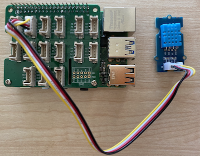

<!--
CO_OP_TRANSLATOR_METADATA:
{
  "original_hash": "7678f7c67b97ee52d5727496dcd7d346",
  "translation_date": "2025-08-28T01:40:30+00:00",
  "source_file": "2-farm/lessons/1-predict-plant-growth/pi-temp.md",
  "language_code": "ms"
}
-->
# Ukur Suhu - Raspberry Pi

Dalam bahagian pelajaran ini, anda akan menambah sensor suhu pada Raspberry Pi anda.

## Perkakasan

Sensor yang akan anda gunakan ialah [sensor kelembapan dan suhu DHT11](https://www.seeedstudio.com/Grove-Temperature-Humidity-Sensor-DHT11.html), yang menggabungkan 2 sensor dalam satu pakej. Sensor ini agak popular, dengan beberapa sensor komersial yang menggabungkan suhu, kelembapan, dan kadangkala tekanan atmosfera. Komponen sensor suhu adalah termistor koefisien suhu negatif (NTC), iaitu termistor di mana rintangan berkurang apabila suhu meningkat.

Ini adalah sensor digital, jadi ia mempunyai ADC onboard untuk menghasilkan isyarat digital yang mengandungi data suhu dan kelembapan yang boleh dibaca oleh mikropengawal.

### Sambungkan sensor suhu

Sensor suhu Grove boleh disambungkan ke Raspberry Pi.

#### Tugasan

Sambungkan sensor suhu


1. Masukkan satu hujung kabel Grove ke soket pada sensor kelembapan dan suhu. Ia hanya boleh dimasukkan dalam satu arah sahaja.

1. Dengan Raspberry Pi dimatikan, sambungkan hujung lain kabel Grove ke soket digital yang ditandakan **D5** pada Grove Base hat yang disambungkan ke Pi. Soket ini adalah yang kedua dari kiri, pada barisan soket bersebelahan dengan pin GPIO.



## Programkan sensor suhu

Peranti kini boleh diprogramkan untuk menggunakan sensor suhu yang disambungkan.

### Tugasan

Programkan peranti.

1. Hidupkan Pi dan tunggu sehingga ia selesai boot.

1. Lancarkan VS Code, sama ada secara langsung pada Pi, atau sambung melalui sambungan Remote SSH.

    > ⚠️ Anda boleh merujuk kepada [arahan untuk menyediakan dan melancarkan VS Code dalam pelajaran 1 jika diperlukan](../../../1-getting-started/lessons/1-introduction-to-iot/pi.md).

1. Dari terminal, buat folder baru dalam direktori rumah pengguna `pi` yang dipanggil `temperature-sensor`. Buat fail dalam folder ini yang dipanggil `app.py`:

    ```sh
    mkdir temperature-sensor
    cd temperature-sensor
    touch app.py
    ```

1. Buka folder ini dalam VS Code.

1. Untuk menggunakan sensor suhu dan kelembapan, pakej Pip tambahan perlu dipasang. Dari Terminal dalam VS Code, jalankan arahan berikut untuk memasang pakej Pip ini pada Pi:

    ```sh
    pip3 install seeed-python-dht
    ```

1. Tambahkan kod berikut ke fail `app.py` untuk mengimport pustaka yang diperlukan:

    ```python
    import time
    from seeed_dht import DHT
    ```

    Pernyataan `from seeed_dht import DHT` mengimport kelas `DHT` untuk berinteraksi dengan sensor suhu Grove dari modul `seeed_dht`.

1. Tambahkan kod berikut selepas kod di atas untuk mencipta satu instance kelas yang menguruskan sensor suhu:

    ```python
    sensor = DHT("11", 5)
    ```

    Ini mengisytiharkan satu instance kelas `DHT` yang menguruskan sensor **D**igital **H**umidity dan **T**emperature. Parameter pertama memberitahu kod bahawa sensor yang digunakan ialah sensor *DHT11* - pustaka yang anda gunakan menyokong varian lain sensor ini. Parameter kedua memberitahu kod bahawa sensor disambungkan ke port digital `D5` pada Grove base hat.

    > ✅ Ingat, semua soket mempunyai nombor pin unik. Pin 0, 2, 4, dan 6 adalah pin analog, manakala pin 5, 16, 18, 22, 24, dan 26 adalah pin digital.

1. Tambahkan gelung infiniti selepas kod di atas untuk mendapatkan nilai sensor suhu dan mencetaknya ke konsol:

    ```python
    while True:
        _, temp = sensor.read()
        print(f'Temperature {temp}°C')
    ```

    Panggilan kepada `sensor.read()` mengembalikan tuple kelembapan dan suhu. Anda hanya memerlukan nilai suhu, jadi kelembapan diabaikan. Nilai suhu kemudian dicetak ke konsol.

1. Tambahkan jeda kecil selama sepuluh saat di akhir `loop` kerana tahap suhu tidak perlu diperiksa secara berterusan. Jeda mengurangkan penggunaan kuasa peranti.

    ```python
    time.sleep(10)
    ```

1. Dari Terminal VS Code, jalankan arahan berikut untuk menjalankan aplikasi Python anda:

    ```sh
    python3 app.py
    ```

    Anda sepatutnya melihat nilai suhu dipaparkan di konsol. Gunakan sesuatu untuk memanaskan sensor, seperti menekan ibu jari anda padanya, atau menggunakan kipas untuk melihat perubahan nilai:

    ```output
    pi@raspberrypi:~/temperature-sensor $ python3 app.py 
    Temperature 26°C
    Temperature 26°C
    Temperature 28°C
    Temperature 30°C
    Temperature 32°C
    ```

> 💁 Anda boleh menemui kod ini dalam folder [code-temperature/pi](../../../../../2-farm/lessons/1-predict-plant-growth/code-temperature/pi).

😀 Program sensor suhu anda berjaya!

---

**Penafian**:  
Dokumen ini telah diterjemahkan menggunakan perkhidmatan terjemahan AI [Co-op Translator](https://github.com/Azure/co-op-translator). Walaupun kami berusaha untuk memastikan ketepatan, sila ambil perhatian bahawa terjemahan automatik mungkin mengandungi kesilapan atau ketidaktepatan. Dokumen asal dalam bahasa asalnya harus dianggap sebagai sumber yang berwibawa. Untuk maklumat yang kritikal, terjemahan manusia profesional adalah disyorkan. Kami tidak bertanggungjawab atas sebarang salah faham atau salah tafsir yang timbul daripada penggunaan terjemahan ini.