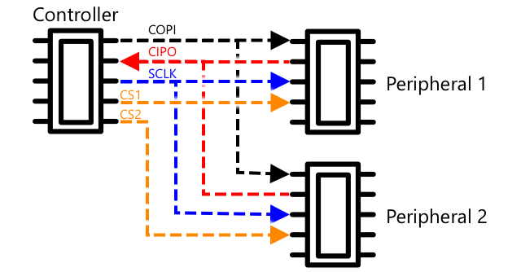

<!--
CO_OP_TRANSLATOR_METADATA:
{
  "original_hash": "4fb20273d299dc8d07a8f06c9cd0cdd9",
  "translation_date": "2025-08-27T21:50:56+00:00",
  "source_file": "2-farm/lessons/2-detect-soil-moisture/README.md",
  "language_code": "ms"
}
-->
C, disebut *I-squared-C*, adalah protokol multi-pengawal, multi-periferal, di mana mana-mana peranti yang disambungkan boleh bertindak sebagai pengawal atau periferal yang berkomunikasi melalui bas I²C (nama untuk sistem komunikasi yang memindahkan data). Data dihantar sebagai paket yang dialamatkan, dengan setiap paket mengandungi alamat peranti yang disambungkan yang ditujukan untuknya.

> 💁 Model ini dahulunya dirujuk sebagai master/slave, tetapi istilah ini sedang digugurkan kerana kaitannya dengan perhambaan. [Persatuan Perkakasan Sumber Terbuka telah mengguna pakai istilah pengawal/periferal](https://www.oshwa.org/a-resolution-to-redefine-spi-signal-names/), tetapi anda mungkin masih melihat rujukan kepada istilah lama.

Peranti mempunyai alamat yang digunakan apabila ia disambungkan ke bas I²C, dan biasanya ditetapkan secara tetap pada peranti. Sebagai contoh, setiap jenis sensor Grove dari Seeed mempunyai alamat yang sama, jadi semua sensor cahaya mempunyai alamat yang sama, semua butang mempunyai alamat yang sama yang berbeza daripada alamat sensor cahaya. Sesetengah peranti mempunyai cara untuk menukar alamat, dengan menukar tetapan jumper atau menyolder pin bersama.

I²C mempunyai bas yang terdiri daripada 2 wayar utama, bersama dengan 2 wayar kuasa:

| Wayar | Nama | Penerangan |
| ---- | --------- | ----------- |
| SDA | Serial Data | Wayar ini digunakan untuk menghantar data antara peranti. |
| SCL | Serial Clock | Wayar ini menghantar isyarat jam pada kadar yang ditetapkan oleh pengawal. |
| VCC | Voltage common collector | Bekalan kuasa untuk peranti. Ini disambungkan ke wayar SDA dan SCL untuk menyediakan kuasa mereka melalui perintang pull-up yang mematikan isyarat apabila tiada peranti menjadi pengawal. |
| GND | Ground | Memberikan tanah biasa untuk litar elektrik. |

Untuk menghantar data, satu peranti akan mengeluarkan keadaan mula untuk menunjukkan ia bersedia menghantar data. Ia kemudian akan menjadi pengawal. Pengawal kemudian menghantar alamat peranti yang ingin dikomunikasikan, bersama-sama dengan sama ada ia ingin membaca atau menulis data. Selepas data dihantar, pengawal menghantar keadaan berhenti untuk menunjukkan bahawa ia telah selesai. Selepas ini, peranti lain boleh menjadi pengawal dan menghantar atau menerima data.

I2C mempunyai had kelajuan, dengan 3 mod berbeza yang berjalan pada kelajuan tetap. Mod terpantas ialah mod Kelajuan Tinggi dengan kelajuan maksimum 3.4Mbps (megabit per saat), walaupun sangat sedikit peranti yang menyokong kelajuan tersebut. Sebagai contoh, Raspberry Pi dihadkan kepada mod pantas pada 400Kbps (kilobit per saat). Mod standard berjalan pada 100Kbps.

> 💁 Jika anda menggunakan Raspberry Pi dengan Grove Base hat sebagai perkakasan IoT anda, anda akan dapat melihat beberapa soket I2C pada papan yang boleh digunakan untuk berkomunikasi dengan sensor I2C. Sensor Grove analog juga menggunakan I2C dengan ADC untuk menghantar nilai analog sebagai data digital, jadi sensor cahaya yang anda gunakan mensimulasikan pin analog, dengan nilai dihantar melalui I2C kerana Raspberry Pi hanya menyokong pin digital.

### Universal asynchronous receiver-transmitter (UART)

UART melibatkan litar fizikal yang membolehkan dua peranti berkomunikasi. Setiap peranti mempunyai 2 pin komunikasi - transmit (Tx) dan receive (Rx), dengan pin Tx peranti pertama disambungkan ke pin Rx peranti kedua, dan pin Tx peranti kedua disambungkan ke pin Rx peranti pertama. Ini membolehkan data dihantar dalam kedua-dua arah.

* Peranti 1 menghantar data dari pin Tx-nya, yang diterima oleh peranti 2 pada pin Rx-nya
* Peranti 1 menerima data pada pin Rx-nya yang dihantar oleh peranti 2 dari pin Tx-nya

> 🎓 Data dihantar satu bit pada satu masa, dan ini dikenali sebagai komunikasi *serial*. Kebanyakan sistem operasi dan mikrokontroler mempunyai *serial ports*, iaitu sambungan yang boleh menghantar dan menerima data serial yang tersedia untuk kod anda.

Peranti UART mempunyai [baud rate](https://wikipedia.org/wiki/Symbol_rate) (juga dikenali sebagai kadar simbol), iaitu kelajuan data akan dihantar dan diterima dalam bit per saat. Kadar baud yang biasa ialah 9,600, bermaksud 9,600 bit (0s dan 1s) data dihantar setiap saat.

UART menggunakan bit mula dan bit tamat - iaitu ia menghantar bit mula untuk menunjukkan bahawa ia akan menghantar satu byte (8 bit) data, kemudian bit tamat selepas ia menghantar 8 bit tersebut.

Kelajuan UART bergantung pada perkakasan, tetapi walaupun implementasi terpantas tidak melebihi 6.5 Mbps (megabit per saat, atau berjuta-juta bit, 0 atau 1, dihantar setiap saat).

Anda boleh menggunakan UART melalui pin GPIO - anda boleh menetapkan satu pin sebagai Tx dan satu lagi sebagai Rx, kemudian menyambungkannya ke peranti lain.

> 💁 Jika anda menggunakan Raspberry Pi dengan Grove Base hat sebagai perkakasan IoT anda, anda akan dapat melihat soket UART pada papan yang boleh digunakan untuk berkomunikasi dengan sensor yang menggunakan protokol UART.

### Serial Peripheral Interface (SPI)

SPI direka untuk berkomunikasi dalam jarak pendek, seperti pada mikrokontroler untuk bercakap dengan peranti storan seperti memori flash. Ia berdasarkan model pengawal/periferal dengan satu pengawal (biasanya pemproses peranti IoT) berinteraksi dengan pelbagai periferal. Pengawal mengawal segalanya dengan memilih periferal dan menghantar atau meminta data.

> 💁 Seperti I2C, istilah pengawal dan periferal adalah perubahan terkini, jadi anda mungkin melihat istilah lama masih digunakan.

Pengawal SPI menggunakan 3 wayar, bersama dengan 1 wayar tambahan bagi setiap periferal. Periferal menggunakan 4 wayar. Wayar-wayar ini adalah:

| Wayar | Nama | Penerangan |
| ---- | --------- | ----------- |
| COPI | Controller Output, Peripheral Input | Wayar ini untuk menghantar data dari pengawal ke periferal. |
| CIPO | Controller Input, Peripheral Output | Wayar ini untuk menghantar data dari periferal ke pengawal. |
| SCLK | Serial Clock | Wayar ini menghantar isyarat jam pada kadar yang ditetapkan oleh pengawal. |
| CS   | Chip Select | Pengawal mempunyai pelbagai wayar, satu bagi setiap periferal, dan setiap wayar disambungkan ke wayar CS pada periferal yang sepadan. |

Wayar CS digunakan untuk mengaktifkan satu periferal pada satu masa, berkomunikasi melalui wayar COPI dan CIPO. Apabila pengawal perlu menukar periferal, ia menyahaktifkan wayar CS yang disambungkan ke periferal yang sedang aktif, kemudian mengaktifkan wayar yang disambungkan ke periferal yang ingin berkomunikasi seterusnya.

SPI adalah *full-duplex*, bermaksud pengawal boleh menghantar dan menerima data pada masa yang sama dari periferal yang sama menggunakan wayar COPI dan CIPO. SPI menggunakan isyarat jam pada wayar SCLK untuk memastikan peranti selaras, jadi tidak seperti menghantar secara langsung melalui UART, ia tidak memerlukan bit mula dan bit tamat.

Tiada had kelajuan yang ditetapkan untuk SPI, dengan implementasi sering mampu menghantar pelbagai megabait data setiap saat.

Kit pembangun IoT sering menyokong SPI melalui beberapa pin GPIO. Sebagai contoh, pada Raspberry Pi anda boleh menggunakan pin GPIO 19, 21, 23, 24 dan 26 untuk SPI.

### Tanpa Wayar

Beberapa sensor boleh berkomunikasi melalui protokol tanpa wayar standard, seperti Bluetooth (terutamanya Bluetooth Low Energy, atau BLE), LoRaWAN (protokol rangkaian kuasa rendah **Lo**ng **Ra**nge), atau WiFi. Ini membolehkan sensor jauh yang tidak disambungkan secara fizikal ke peranti IoT.

Satu contoh ialah dalam sensor kelembapan tanah komersial. Sensor ini akan mengukur kelembapan tanah di ladang, kemudian menghantar data melalui LoRaWAN ke peranti hab, yang akan memproses data atau menghantarnya melalui Internet. Ini membolehkan sensor berada jauh dari peranti IoT yang menguruskan data, mengurangkan penggunaan kuasa dan keperluan untuk rangkaian WiFi besar atau kabel panjang.

BLE popular untuk sensor canggih seperti penjejak kecergasan yang dipakai di pergelangan tangan. Sensor ini menggabungkan pelbagai sensor dan menghantar data sensor ke peranti IoT dalam bentuk telefon anda melalui BLE.

✅ Adakah anda mempunyai sebarang sensor Bluetooth pada diri anda, di rumah anda atau di sekolah anda? Ini mungkin termasuk sensor suhu, sensor kehadiran, penjejak peranti dan peranti kecergasan.

Satu cara popular untuk peranti komersial berhubung ialah Zigbee. Zigbee menggunakan WiFi untuk membentuk rangkaian mesh antara peranti, di mana setiap peranti berhubung dengan sebanyak mungkin peranti berdekatan, membentuk sejumlah besar sambungan seperti sarang labah-labah. Apabila satu peranti ingin menghantar mesej ke Internet, ia boleh menghantarnya ke peranti terdekat, yang kemudian meneruskannya ke peranti berdekatan lain dan seterusnya, sehingga ia sampai ke penyelaras dan boleh dihantar ke Internet.

> 🐝 Nama Zigbee merujuk kepada tarian waggle lebah madu selepas mereka kembali ke sarang lebah.

## Mengukur tahap kelembapan tanah

Anda boleh mengukur tahap kelembapan tanah menggunakan sensor kelembapan tanah, peranti IoT, dan tumbuhan rumah atau tanah berdekatan.

### Tugasan - mengukur kelembapan tanah

Ikuti panduan yang relevan untuk mengukur kelembapan tanah menggunakan peranti IoT anda:

* [Arduino - Wio Terminal](wio-terminal-soil-moisture.md)
* [Komputer papan tunggal - Raspberry Pi](pi-soil-moisture.md)
* [Komputer papan tunggal - Peranti maya](virtual-device-soil-moisture.md)

## Penentukuran sensor

Sensor bergantung pada pengukuran sifat elektrik seperti rintangan atau kapasitans.

> 🎓 Rintangan, diukur dalam ohm (Ω) ialah berapa banyak halangan terhadap arus elektrik yang melalui sesuatu. Apabila voltan digunakan pada bahan, jumlah arus yang melaluinya bergantung pada rintangan bahan tersebut. Anda boleh membaca lebih lanjut di [halaman rintangan elektrik di Wikipedia](https://wikipedia.org/wiki/Electrical_resistance_and_conductance).

> 🎓 Kapasitans, diukur dalam farad (F), ialah keupayaan komponen atau litar untuk mengumpul dan menyimpan tenaga elektrik. Anda boleh membaca lebih lanjut tentang kapasitans di [halaman kapasitans di Wikipedia](https://wikipedia.org/wiki/Capacitance).

Pengukuran ini tidak selalu berguna - bayangkan sensor suhu yang memberikan anda pengukuran 22.5KΩ! Sebaliknya nilai yang diukur perlu ditukar kepada unit yang berguna dengan ditentukur - iaitu memadankan nilai yang diukur kepada kuantiti yang diukur untuk membolehkan pengukuran baru ditukar kepada unit yang betul.

Beberapa sensor datang dengan penentukuran awal. Sebagai contoh, sensor suhu yang anda gunakan dalam pelajaran lepas telah ditentukur supaya ia boleh memberikan pengukuran suhu dalam °C. Di kilang, sensor pertama yang dicipta akan didedahkan kepada pelbagai suhu yang diketahui dan rintangan diukur. Ini kemudian digunakan untuk membina pengiraan yang boleh menukar dari nilai yang diukur dalam Ω (unit rintangan) kepada °C.

> 💁 Formula untuk mengira rintangan dari suhu dipanggil [persamaan Steinhart–Hart](https://wikipedia.org/wiki/Steinhart–Hart_equation).

### Penentukuran sensor kelembapan tanah

Kelembapan tanah diukur menggunakan kandungan air gravimetrik atau volumetrik.

* Gravimetrik ialah berat air dalam berat unit tanah yang diukur, sebagai bilangan kilogram air per kilogram tanah kering
* Volumetrik ialah isipadu air dalam isipadu unit tanah yang diukur, sebagai bilangan meter padu air per meter padu tanah kering

> 🇺🇸 Untuk orang Amerika, kerana konsistensi unit, ini boleh diukur dalam paun dan bukannya kilogram atau kaki padu dan bukannya meter padu.

Sensor kelembapan tanah mengukur rintangan elektrik atau kapasitans - ini bukan sahaja berbeza mengikut kelembapan tanah, tetapi juga jenis tanah kerana komponen dalam tanah boleh mengubah ciri elektriknya. Sebaiknya sensor perlu ditentukur - iaitu mengambil bacaan dari sensor dan membandingkannya dengan pengukuran yang diperoleh menggunakan pendekatan yang lebih saintifik. Sebagai contoh, makmal boleh mengira kelembapan tanah gravimetrik menggunakan sampel dari ladang tertentu yang diambil beberapa kali setahun, dan nombor-nombor ini digunakan untuk menentukur sensor, memadankan bacaan sensor kepada kelembapan tanah gravimetrik.

Graf di atas menunjukkan cara menentukur sensor. Voltan ditangkap untuk sampel tanah yang kemudian diukur di makmal dengan membandingkan berat lembap dengan berat kering (dengan mengukur berat basah, kemudian mengeringkan dalam ketuhar dan mengukur berat kering). Setelah beberapa bacaan diambil, ini boleh diplotkan pada graf dan garis dipasang pada titik-titik tersebut. Garis ini kemudian boleh digunakan untuk menukar bacaan sensor kelembapan tanah yang diambil oleh peranti IoT kepada pengukuran kelembapan tanah sebenar.

💁 Untuk sensor kelembapan tanah resistif, voltan meningkat apabila kelembapan tanah meningkat. Untuk sensor kelembapan tanah kapasitif, voltan menurun apabila kelembapan tanah meningkat, jadi graf untuk ini akan condong ke bawah, bukan ke atas.

Graf di atas menunjukkan bacaan voltan dari sensor kelembapan tanah, dan dengan mengikuti bacaan tersebut ke garis pada graf, kelembapan tanah sebenar boleh dikira.

Pendekatan ini bermaksud petani hanya perlu mendapatkan beberapa pengukuran makmal untuk ladang, kemudian mereka boleh menggunakan peranti IoT untuk mengukur kelembapan tanah - secara drastik mempercepatkan masa untuk mengambil pengukuran.

---

## 🚀 Cabaran

Sensor kelembapan tanah resistif dan kapasitif mempunyai beberapa perbezaan. Apakah perbezaan ini, dan jenis mana (jika ada) yang terbaik untuk digunakan oleh petani? Adakah jawapan ini berubah antara negara membangun dan negara maju?

## Kuiz selepas kuliah

[Kuiz selepas kuliah](https://black-meadow-040d15503.1.azurestaticapps.net/quiz/12)

## Kajian & Pembelajaran Kendiri

Baca tentang perkakasan dan protokol yang digunakan oleh sensor dan aktuator:

* [Halaman Wikipedia GPIO](https://wikipedia.org/wiki/General-purpose_input/output)
* [Halaman Wikipedia UART](https://wikipedia.org/wiki/Universal_asynchronous_receiver-transmitter)
* [Halaman Wikipedia SPI](https://wikipedia.org/wiki/Serial_Peripheral_Interface)
* [Halaman Wikipedia I2C](https://wikipedia.org/wiki/I²C)
* [Halaman Wikipedia Zigbee](https://wikipedia.org/wiki/Zigbee)

## Tugasan

[Menentukur sensor anda](assignment.md)

---

**Penafian**:  
Dokumen ini telah diterjemahkan menggunakan perkhidmatan terjemahan AI [Co-op Translator](https://github.com/Azure/co-op-translator). Walaupun kami berusaha untuk memastikan ketepatan, sila ambil perhatian bahawa terjemahan automatik mungkin mengandungi kesilapan atau ketidaktepatan. Dokumen asal dalam bahasa asalnya harus dianggap sebagai sumber yang berwibawa. Untuk maklumat yang kritikal, terjemahan manusia profesional adalah disyorkan. Kami tidak bertanggungjawab atas sebarang salah faham atau salah tafsir yang timbul daripada penggunaan terjemahan ini.