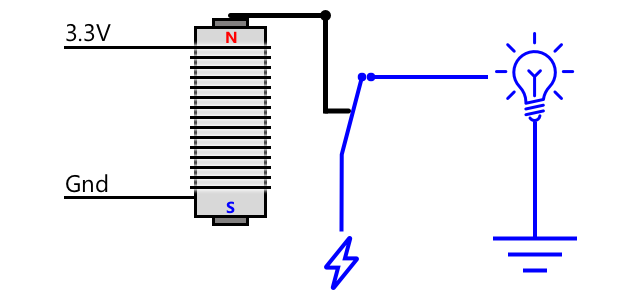

<!--
CO_OP_TRANSLATOR_METADATA:
{
  "original_hash": "f7bb24ba53fb627ddb38a8b24a05e594",
  "translation_date": "2025-08-28T01:51:55+00:00",
  "source_file": "2-farm/lessons/3-automated-plant-watering/README.md",
  "language_code": "ms"
}
-->
## Penyiraman tumbuhan automatik


> Sketchnote oleh [Nitya Narasimhan](https://github.com/nitya). Klik imej untuk versi yang lebih besar.

Pelajaran ini diajar sebagai sebahagian daripada siri [IoT for Beginners Project 2 - Digital Agriculture](https://youtube.com/playlist?list=PLmsFUfdnGr3yCutmcVg6eAUEfsGiFXgcx) dari [Microsoft Reactor](https://developer.microsoft.com/reactor/?WT.mc_id=academic-17441-jabenn).

[](https://youtu.be/g9FfZwv9R58)

## Kuiz sebelum kuliah

[Kuiz sebelum kuliah](https://black-meadow-040d15503.1.azurestaticapps.net/quiz/13)

## Pengenalan

Dalam pelajaran sebelum ini, anda telah belajar cara memantau kelembapan tanah. Dalam pelajaran ini, anda akan belajar cara membina komponen utama sistem penyiraman automatik yang bertindak balas terhadap kelembapan tanah. Anda juga akan belajar tentang masa - bagaimana sensor memerlukan masa untuk bertindak balas terhadap perubahan, dan bagaimana aktuator memerlukan masa untuk mengubah sifat yang diukur oleh sensor.

Dalam pelajaran ini, kita akan membincangkan:

* [Mengawal peranti berkuasa tinggi dari peranti IoT berkuasa rendah](../../../../../2-farm/lessons/3-automated-plant-watering)
* [Mengawal relay](../../../../../2-farm/lessons/3-automated-plant-watering)
* [Mengawal tumbuhan anda melalui MQTT](../../../../../2-farm/lessons/3-automated-plant-watering)
* [Masa sensor dan aktuator](../../../../../2-farm/lessons/3-automated-plant-watering)
* [Menambah masa pada pelayan kawalan tumbuhan anda](../../../../../2-farm/lessons/3-automated-plant-watering)

## Mengawal peranti berkuasa tinggi dari peranti IoT berkuasa rendah

Peranti IoT menggunakan voltan rendah. Walaupun ini mencukupi untuk sensor dan aktuator berkuasa rendah seperti LED, ia terlalu rendah untuk mengawal perkakasan yang lebih besar, seperti pam air yang digunakan untuk pengairan. Malah pam kecil yang boleh digunakan untuk tumbuhan rumah memerlukan arus yang terlalu tinggi untuk kit pembangunan IoT dan boleh merosakkan papan tersebut.

> 🎓 Arus, diukur dalam Amper (A), adalah jumlah elektrik yang bergerak melalui litar. Voltan memberikan tolakan, arus adalah jumlah yang ditolak. Anda boleh membaca lebih lanjut tentang arus di [laman arus elektrik di Wikipedia](https://wikipedia.org/wiki/Electric_current).

Penyelesaiannya adalah dengan menyambungkan pam kepada bekalan kuasa luaran, dan menggunakan aktuator untuk menghidupkan pam, sama seperti anda menghidupkan lampu. Ia hanya memerlukan sedikit kuasa (dalam bentuk tenaga dari badan anda) untuk jari anda menekan suis, dan ini menyambungkan lampu kepada elektrik utama yang berjalan pada 110v/240v.


> 🎓 [Elektrik utama](https://wikipedia.org/wiki/Mains_electricity) merujuk kepada elektrik yang dihantar ke rumah dan perniagaan melalui infrastruktur kebangsaan di banyak bahagian dunia.

✅ Peranti IoT biasanya boleh menyediakan 3.3V atau 5V, pada kurang daripada 1 amp (1A) arus. Bandingkan ini dengan elektrik utama yang kebanyakannya pada 230V (120V di Amerika Utara dan 100V di Jepun), dan boleh menyediakan kuasa untuk peranti yang menggunakan 30A.

Terdapat beberapa aktuator yang boleh melakukan ini, termasuk peranti mekanikal yang boleh anda pasang pada suis sedia ada yang meniru jari menghidupkannya. Yang paling popular ialah relay.

### Relay

Relay ialah suis elektromekanikal yang menukar isyarat elektrik kepada pergerakan mekanikal yang menghidupkan suis. Teras relay ialah elektromagnet.

> 🎓 [Elektromagnet](https://wikipedia.org/wiki/Electromagnet) ialah magnet yang dicipta dengan mengalirkan elektrik melalui gegelung wayar. Apabila elektrik dihidupkan, gegelung menjadi bermagnet. Apabila elektrik dimatikan, gegelung kehilangan kemagnetannya.



Dalam relay, litar kawalan membekalkan kuasa kepada elektromagnet. Apabila elektromagnet dihidupkan, ia menarik tuil yang menggerakkan suis, menutup sepasang kenalan dan melengkapkan litar output.


Apabila litar kawalan dimatikan, elektromagnet dimatikan, melepaskan tuil dan membuka kenalan, mematikan litar output. Relay ialah aktuator digital - isyarat tinggi kepada relay menghidupkannya, isyarat rendah mematikannya.

Litar output boleh digunakan untuk membekalkan kuasa kepada perkakasan tambahan, seperti sistem pengairan. Peranti IoT boleh menghidupkan relay, melengkapkan litar output yang membekalkan kuasa kepada sistem pengairan, dan tumbuhan disiram. Peranti IoT kemudian boleh mematikan relay, memotong kuasa kepada sistem pengairan, mematikan air.


Dalam video di atas, relay dihidupkan. LED pada relay menyala untuk menunjukkan ia dihidupkan (sesetengah papan relay mempunyai LED untuk menunjukkan sama ada relay dihidupkan atau dimatikan), dan kuasa dihantar ke pam, menghidupkannya dan mengepam air ke dalam tumbuhan.

> 💁 Relay juga boleh digunakan untuk menukar antara dua litar output dan bukannya menghidupkan atau mematikannya. Apabila tuil bergerak, ia menggerakkan suis daripada melengkapkan satu litar output kepada melengkapkan litar output yang lain, biasanya berkongsi sambungan kuasa biasa, atau sambungan tanah biasa.

✅ Lakukan penyelidikan: Terdapat pelbagai jenis relay, dengan perbezaan seperti sama ada litar kawalan menghidupkan atau mematikan relay apabila kuasa digunakan, atau pelbagai litar output. Ketahui tentang jenis-jenis ini.

Apabila tuil bergerak, anda biasanya boleh mendengar ia membuat sentuhan dengan elektromagnet dengan bunyi klik yang jelas.

> 💁 Relay boleh disambungkan supaya membuat sambungan sebenarnya memutuskan kuasa kepada relay, mematikan relay, yang kemudian menghantar kuasa kepada relay menghidupkannya semula, dan seterusnya. Ini bermakna relay akan mengklik dengan sangat pantas menghasilkan bunyi berdengung. Inilah cara beberapa loceng pintu elektrik pertama berfungsi.

### Kuasa relay

Elektromagnet tidak memerlukan banyak kuasa untuk diaktifkan dan menarik tuil, ia boleh dikawal menggunakan output 3.3V atau 5V daripada kit pembangunan IoT. Litar output boleh membawa lebih banyak kuasa, bergantung pada relay, termasuk voltan utama atau tahap kuasa yang lebih tinggi untuk kegunaan industri. Dengan cara ini, kit pembangunan IoT boleh mengawal sistem pengairan, daripada pam kecil untuk satu tumbuhan, sehingga sistem industri besar untuk seluruh ladang komersial.


Imej di atas menunjukkan relay Grove. Litar kawalan disambungkan kepada peranti IoT dan menghidupkan atau mematikan relay menggunakan 3.3V atau 5V. Litar output mempunyai dua terminal, salah satu daripadanya boleh menjadi kuasa atau tanah. Litar output boleh mengendalikan sehingga 250V pada 10A, mencukupi untuk pelbagai peranti berkuasa utama. Anda boleh mendapatkan relay yang boleh mengendalikan tahap kuasa yang lebih tinggi.


Dalam imej di atas, kuasa dibekalkan kepada pam melalui relay. Terdapat wayar merah yang menyambungkan terminal +5V bekalan kuasa USB ke satu terminal litar output relay, dan satu lagi wayar merah menyambungkan terminal lain litar output ke pam. Wayar hitam menyambungkan pam ke tanah pada bekalan kuasa USB. Apabila relay dihidupkan, ia melengkapkan litar, menghantar 5V ke pam, menghidupkan pam.

## Mengawal relay

Anda boleh mengawal relay daripada kit pembangunan IoT anda.

### Tugasan - mengawal relay

Ikuti panduan yang berkaitan untuk mengawal relay menggunakan peranti IoT anda:

* [Arduino - Wio Terminal](wio-terminal-relay.md)
* [Komputer papan tunggal - Raspberry Pi](pi-relay.md)
* [Komputer papan tunggal - Peranti maya](virtual-device-relay.md)

## Mengawal tumbuhan anda melalui MQTT

Setakat ini relay anda dikawal secara langsung oleh peranti IoT berdasarkan satu bacaan kelembapan tanah. Dalam sistem pengairan komersial, logik kawalan akan disentralisasi, membolehkan keputusan penyiraman dibuat menggunakan data daripada pelbagai sensor, dan membolehkan sebarang konfigurasi diubah di satu tempat sahaja. Untuk mensimulasikan ini, anda boleh mengawal relay melalui MQTT.

### Tugasan - mengawal relay melalui MQTT

1. Tambahkan pustaka/pakej pip MQTT yang berkaitan dan kod ke projek `soil-moisture-sensor` anda untuk menyambung ke MQTT. Namakan ID klien sebagai `soilmoisturesensor_client` dengan awalan ID anda.

    > ⚠️ Anda boleh merujuk kepada [arahan untuk menyambung ke MQTT dalam projek 1, pelajaran 4 jika diperlukan](../../../1-getting-started/lessons/4-connect-internet/README.md#connect-your-iot-device-to-mqtt).

2. Tambahkan kod peranti yang berkaitan untuk menghantar telemetri dengan tetapan kelembapan tanah. Untuk mesej telemetri, namakan sifatnya `soil_moisture`.

    > ⚠️ Anda boleh merujuk kepada [arahan untuk menghantar telemetri ke MQTT dalam projek 1, pelajaran 4 jika diperlukan](../../../1-getting-started/lessons/4-connect-internet/README.md#send-telemetry-from-your-iot-device).

3. Cipta kod pelayan tempatan untuk melanggan telemetri dan menghantar arahan untuk mengawal relay dalam folder bernama `soil-moisture-sensor-server`. Namakan sifat dalam mesej arahan sebagai `relay_on`, dan tetapkan ID klien sebagai `soilmoisturesensor_server` dengan awalan ID anda. Kekalkan struktur yang sama seperti kod pelayan yang anda tulis untuk projek 1, pelajaran 4 kerana anda akan menambah kod ini kemudian dalam pelajaran ini.

    > ⚠️ Anda boleh merujuk kepada [arahan untuk menghantar telemetri ke MQTT](../../../1-getting-started/lessons/4-connect-internet/README.md#write-the-server-code) dan [menghantar arahan melalui MQTT](../../../1-getting-started/lessons/4-connect-internet/README.md#send-commands-to-the-mqtt-broker) dalam projek 1, pelajaran 4 jika diperlukan.

4. Tambahkan kod peranti yang berkaitan untuk mengawal relay daripada arahan yang diterima, menggunakan sifat `relay_on` daripada mesej. Hantar nilai true untuk `relay_on` jika `soil_moisture` lebih besar daripada 450, jika tidak hantar nilai false, sama seperti logik yang anda tambahkan untuk peranti IoT sebelum ini.

    > ⚠️ Anda boleh merujuk kepada [arahan untuk bertindak balas terhadap arahan daripada MQTT dalam projek 1, pelajaran 4 jika diperlukan](../../../1-getting-started/lessons/4-connect-internet/README.md#handle-commands-on-the-iot-device).

> 💁 Anda boleh menemui kod ini dalam folder [code-mqtt](../../../../../2-farm/lessons/3-automated-plant-watering/code-mqtt).

Pastikan kod berjalan pada peranti dan pelayan tempatan anda, dan uji dengan mengubah tahap kelembapan tanah, sama ada dengan mengubah nilai yang dihantar oleh sensor maya, atau dengan mengubah tahap kelembapan tanah dengan menambah air atau mengeluarkan sensor daripada tanah.

## Masa sensor dan aktuator

Dalam pelajaran 3, anda telah membina lampu malam - LED yang menyala sebaik sahaja tahap cahaya rendah dikesan oleh sensor cahaya. Sensor cahaya mengesan perubahan tahap cahaya dengan serta-merta, dan peranti dapat bertindak balas dengan cepat, hanya terhad oleh panjang kelewatan dalam fungsi `loop` atau gelung `while True:`. Sebagai pembangun IoT, anda tidak selalu boleh bergantung pada gelung maklum balas yang begitu pantas.

### Masa untuk kelembapan tanah

Jika anda telah melakukan pelajaran terakhir tentang kelembapan tanah menggunakan sensor fizikal, anda mungkin perasan bahawa bacaan kelembapan tanah mengambil masa beberapa saat untuk menurun selepas anda menyiram tumbuhan anda. Ini bukan kerana sensor lambat, tetapi kerana air memerlukan masa untuk meresap ke dalam tanah.
💁 Jika anda menyiram terlalu dekat dengan sensor, anda mungkin melihat bacaan menurun dengan cepat, kemudian naik semula - ini disebabkan oleh air berhampiran sensor yang tersebar ke seluruh tanah lain, mengurangkan kelembapan tanah di sekitar sensor.


Dalam rajah di atas, bacaan kelembapan tanah menunjukkan 658. Tumbuhan disiram, tetapi bacaan ini tidak berubah serta-merta kerana air belum sampai ke sensor. Penyiraman boleh selesai sebelum air sampai ke sensor dan nilai turun untuk mencerminkan tahap kelembapan yang baru.

Jika anda menulis kod untuk mengawal sistem pengairan melalui relay berdasarkan tahap kelembapan tanah, anda perlu mengambil kira kelewatan ini dan membina pemasaan yang lebih bijak ke dalam peranti IoT anda.

✅ Luangkan masa untuk memikirkan bagaimana anda boleh melakukannya.

### Kawal pemasaan sensor dan penggerak

Bayangkan anda diberi tugas untuk membina sistem pengairan untuk ladang. Berdasarkan jenis tanah, tahap kelembapan tanah yang ideal untuk tanaman yang ditanam telah didapati sepadan dengan bacaan voltan analog 400-450.

Anda boleh memprogramkan peranti dengan cara yang sama seperti lampu malam - setiap kali sensor membaca di atas 450, hidupkan relay untuk menghidupkan pam. Masalahnya ialah air mengambil masa untuk sampai dari pam, melalui tanah ke sensor. Sensor akan menghentikan air apabila ia mengesan tahap 450, tetapi tahap air akan terus turun kerana air yang dipam terus meresap ke dalam tanah. Hasil akhirnya ialah pembaziran air dan risiko kerosakan akar.

✅ Ingat - terlalu banyak air boleh menjadi buruk untuk tanaman seperti terlalu sedikit, dan membazirkan sumber yang berharga.

Penyelesaian yang lebih baik ialah memahami bahawa terdapat kelewatan antara penggerak dihidupkan dan sifat yang dibaca oleh sensor berubah. Ini bermakna bukan sahaja sensor perlu menunggu seketika sebelum mengukur nilai semula, tetapi penggerak perlu dimatikan seketika sebelum pengukuran sensor seterusnya diambil.

Berapa lama relay perlu dihidupkan setiap kali? Lebih baik berhati-hati dan hanya hidupkan relay untuk masa yang singkat, kemudian tunggu air meresap, kemudian periksa semula tahap kelembapan. Lagipun, anda sentiasa boleh menghidupkannya semula untuk menambah lebih banyak air, tetapi anda tidak boleh mengeluarkan air dari tanah.

> 💁 Kawalan pemasaan seperti ini sangat khusus untuk peranti IoT yang anda bina, sifat yang anda ukur dan sensor serta penggerak yang digunakan.


Sebagai contoh, saya mempunyai tumbuhan strawberi dengan sensor kelembapan tanah dan pam yang dikawal oleh relay. Saya telah memerhatikan bahawa apabila saya menambah air, ia mengambil masa kira-kira 20 saat untuk bacaan kelembapan tanah stabil. Ini bermakna saya perlu mematikan relay dan menunggu 20 saat sebelum memeriksa tahap kelembapan. Saya lebih suka mempunyai terlalu sedikit air daripada terlalu banyak - saya sentiasa boleh menghidupkan pam semula, tetapi saya tidak boleh mengeluarkan air daripada tumbuhan.


Ini bermakna proses terbaik ialah kitaran penyiraman yang seperti berikut:

* Hidupkan pam selama 5 saat
* Tunggu 20 saat
* Periksa kelembapan tanah
* Jika tahap masih di atas apa yang diperlukan, ulang langkah di atas

5 saat mungkin terlalu lama untuk pam, terutamanya jika tahap kelembapan hanya sedikit di atas tahap yang diperlukan. Cara terbaik untuk mengetahui pemasaan yang perlu digunakan ialah mencubanya, kemudian laraskan apabila anda mempunyai data sensor, dengan gelung maklum balas yang berterusan. Ini malah boleh membawa kepada pemasaan yang lebih terperinci, seperti menghidupkan pam selama 1 saat untuk setiap 100 di atas tahap kelembapan tanah yang diperlukan, bukannya tetap 5 saat.

✅ Lakukan penyelidikan: Adakah terdapat pertimbangan pemasaan lain? Bolehkah tumbuhan disiram pada bila-bila masa apabila kelembapan tanah terlalu rendah, atau adakah terdapat masa tertentu dalam sehari yang baik dan buruk untuk menyiram tumbuhan?

> 💁 Ramalan cuaca juga boleh diambil kira apabila mengawal sistem penyiraman automatik untuk penanaman luar. Jika hujan dijangka, maka penyiraman boleh ditangguhkan sehingga selepas hujan selesai. Pada ketika itu, tanah mungkin cukup lembap sehingga tidak memerlukan penyiraman, jauh lebih cekap daripada membazirkan air dengan menyiram sebelum hujan.

## Tambah pemasaan kepada pelayan kawalan tumbuhan anda

Kod pelayan boleh diubah suai untuk menambah kawalan sekitar pemasaan kitaran penyiraman, dan menunggu tahap kelembapan tanah berubah. Logik pelayan untuk mengawal pemasaan relay adalah:

1. Mesej telemetri diterima
1. Periksa tahap kelembapan tanah
1. Jika ia ok, jangan buat apa-apa. Jika bacaan terlalu tinggi (bermaksud kelembapan tanah terlalu rendah) maka:
    1. Hantar arahan untuk menghidupkan relay
    1. Tunggu selama 5 saat
    1. Hantar arahan untuk mematikan relay
    1. Tunggu selama 20 saat untuk tahap kelembapan tanah stabil

Kitaran penyiraman, proses daripada menerima mesej telemetri sehingga bersedia untuk memproses tahap kelembapan tanah semula, mengambil masa kira-kira 25 saat. Kami menghantar tahap kelembapan tanah setiap 10 saat, jadi terdapat pertindihan di mana mesej diterima semasa pelayan sedang menunggu tahap kelembapan tanah stabil, yang boleh memulakan kitaran penyiraman lain.

Terdapat dua pilihan untuk mengatasi masalah ini:

* Tukar kod peranti IoT untuk hanya menghantar telemetri setiap minit, dengan cara ini kitaran penyiraman akan selesai sebelum mesej seterusnya dihantar
* Nyahlanggan telemetri semasa kitaran penyiraman

Pilihan pertama tidak selalu menjadi penyelesaian yang baik untuk ladang besar. Petani mungkin ingin menangkap tahap kelembapan tanah semasa tanah disiram untuk analisis kemudian, contohnya untuk mengetahui aliran air di kawasan yang berbeza di ladang bagi membimbing penyiraman yang lebih disasarkan. Pilihan kedua adalah lebih baik - kod hanya mengabaikan telemetri apabila ia tidak boleh menggunakannya, tetapi telemetri masih ada untuk perkhidmatan lain yang mungkin melanggannya.

> 💁 Data IoT tidak dihantar daripada satu peranti kepada satu perkhidmatan sahaja, sebaliknya banyak peranti boleh menghantar data kepada broker, dan banyak perkhidmatan boleh mendengar data daripada broker. Sebagai contoh, satu perkhidmatan boleh mendengar data kelembapan tanah dan menyimpannya dalam pangkalan data untuk analisis pada masa akan datang. Perkhidmatan lain juga boleh mendengar telemetri yang sama untuk mengawal sistem pengairan.

### Tugasan - tambah pemasaan kepada pelayan kawalan tumbuhan anda

Kemas kini kod pelayan anda untuk menjalankan relay selama 5 saat, kemudian tunggu 20 saat.

1. Buka folder `soil-moisture-sensor-server` dalam VS Code jika ia belum dibuka. Pastikan persekitaran maya diaktifkan.

1. Buka fail `app.py`

1. Tambahkan kod berikut ke fail `app.py` di bawah import sedia ada:

    ```python
    import threading
    ```

    Pernyataan ini mengimport `threading` daripada pustaka Python, threading membolehkan Python melaksanakan kod lain semasa menunggu.

1. Tambahkan kod berikut sebelum fungsi `handle_telemetry` yang mengendalikan mesej telemetri yang diterima oleh kod pelayan:

    ```python
    water_time = 5
    wait_time = 20
    ```

    Ini mentakrifkan berapa lama untuk menjalankan relay (`water_time`), dan berapa lama untuk menunggu selepas itu untuk memeriksa kelembapan tanah (`wait_time`).

1. Di bawah kod ini, tambahkan yang berikut:

    ```python
    def send_relay_command(client, state):
        command = { 'relay_on' : state }
        print("Sending message:", command)
        client.publish(server_command_topic, json.dumps(command))
    ```

    Kod ini mentakrifkan fungsi yang dipanggil `send_relay_command` yang menghantar arahan melalui MQTT untuk mengawal relay. Telemetri dicipta sebagai kamus, kemudian ditukar kepada rentetan JSON. Nilai yang dimasukkan ke dalam `state` menentukan sama ada relay harus dihidupkan atau dimatikan.

1. Selepas fungsi `send_relay_code`, tambahkan kod berikut:

    ```python
    def control_relay(client):
        print("Unsubscribing from telemetry")
        mqtt_client.unsubscribe(client_telemetry_topic)
    
        send_relay_command(client, True)
        time.sleep(water_time)
        send_relay_command(client, False)
    
        time.sleep(wait_time)
    
        print("Subscribing to telemetry")
        mqtt_client.subscribe(client_telemetry_topic)
    ```

    Ini mentakrifkan fungsi untuk mengawal relay berdasarkan pemasaan yang diperlukan. Ia bermula dengan nyahlanggan daripada telemetri supaya mesej kelembapan tanah tidak diproses semasa penyiraman berlaku. Seterusnya ia menghantar arahan untuk menghidupkan relay. Ia kemudian menunggu `water_time` sebelum menghantar arahan untuk mematikan relay. Akhirnya ia menunggu tahap kelembapan tanah stabil selama `wait_time` saat. Ia kemudian melanggan semula telemetri.

1. Tukar fungsi `handle_telemetry` kepada yang berikut:

    ```python
    def handle_telemetry(client, userdata, message):
        payload = json.loads(message.payload.decode())
        print("Message received:", payload)
    
        if payload['soil_moisture'] > 450:
            threading.Thread(target=control_relay, args=(client,)).start()
    ```

    Kod ini memeriksa tahap kelembapan tanah. Jika ia lebih besar daripada 450, tanah memerlukan penyiraman, jadi ia memanggil fungsi `control_relay`. Fungsi ini dijalankan pada thread berasingan, berjalan di latar belakang.

1. Pastikan peranti IoT anda berjalan, kemudian jalankan kod ini. Tukar tahap kelembapan tanah dan perhatikan apa yang berlaku kepada relay - ia sepatutnya dihidupkan selama 5 saat kemudian kekal dimatikan sekurang-kurangnya 20 saat, hanya dihidupkan jika tahap kelembapan tanah tidak mencukupi.

    ```output
    (.venv) ➜  soil-moisture-sensor-server ✗ python app.py
    Message received: {'soil_moisture': 457}
    Unsubscribing from telemetry
    Sending message: {'relay_on': True}
    Sending message: {'relay_on': False}
    Subscribing to telemetry
    Message received: {'soil_moisture': 302}
    ```

    Cara yang baik untuk menguji ini dalam sistem pengairan simulasi ialah menggunakan tanah kering, kemudian tuangkan air secara manual semasa relay dihidupkan, berhenti menuang apabila relay dimatikan.

> 💁 Anda boleh menemui kod ini dalam folder [code-timing](../../../../../2-farm/lessons/3-automated-plant-watering/code-timing).

> 💁 Jika anda ingin menggunakan pam untuk membina sistem pengairan sebenar, maka anda boleh menggunakan [pam air 6V](https://www.seeedstudio.com/6V-Mini-Water-Pump-p-1945.html) dengan [bekalan kuasa terminal USB](https://www.adafruit.com/product/3628). Pastikan kuasa kepada atau daripada pam disambungkan melalui relay.

---

## 🚀 Cabaran

Bolehkah anda memikirkan peranti IoT atau peranti elektrik lain yang mempunyai masalah serupa di mana ia mengambil masa untuk hasil penggerak sampai ke sensor? Anda mungkin mempunyai beberapa di rumah atau sekolah anda.

* Sifat apa yang mereka ukur?
* Berapa lama masa yang diambil untuk sifat berubah selepas penggerak digunakan?
* Adakah ok untuk sifat berubah melebihi nilai yang diperlukan?
* Bagaimana ia boleh dikembalikan kepada nilai yang diperlukan jika perlu?

## Kuiz selepas kuliah

[Kuiz selepas kuliah](https://black-meadow-040d15503.1.azurestaticapps.net/quiz/14)

## Kajian Semula & Kajian Kendiri

* Baca lebih lanjut tentang relay termasuk penggunaannya secara sejarah dalam pertukaran telefon di [halaman Wikipedia relay](https://wikipedia.org/wiki/Relay).

## Tugasan

[Bina kitaran penyiraman yang lebih cekap](assignment.md)

---

**Penafian**:  
Dokumen ini telah diterjemahkan menggunakan perkhidmatan terjemahan AI [Co-op Translator](https://github.com/Azure/co-op-translator). Walaupun kami berusaha untuk memastikan ketepatan, sila ambil perhatian bahawa terjemahan automatik mungkin mengandungi kesilapan atau ketidaktepatan. Dokumen asal dalam bahasa asalnya harus dianggap sebagai sumber yang berwibawa. Untuk maklumat penting, terjemahan manusia profesional adalah disyorkan. Kami tidak bertanggungjawab atas sebarang salah faham atau salah tafsir yang timbul daripada penggunaan terjemahan ini.