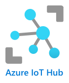

<!--
CO_OP_TRANSLATOR_METADATA:
{
  "original_hash": "4d8e7a066d75b625e7a979c14157041d",
  "translation_date": "2025-08-28T01:33:56+00:00",
  "source_file": "2-farm/lessons/4-migrate-your-plant-to-the-cloud/README.md",
  "language_code": "ms"
}
-->
# Migrasikan Tumbuhan Anda ke Awan


> Sketchnote oleh [Nitya Narasimhan](https://github.com/nitya). Klik imej untuk versi yang lebih besar.

Pelajaran ini diajar sebagai sebahagian daripada siri [IoT untuk Pemula Projek 2 - Pertanian Digital](https://youtube.com/playlist?list=PLmsFUfdnGr3yCutmcVg6eAUEfsGiFXgcx) dari [Microsoft Reactor](https://developer.microsoft.com/reactor/?WT.mc_id=academic-17441-jabenn).

[](https://youtu.be/bNxjopXkhvk)

## Kuiz Pra-Pelajaran

[Kuiz Pra-Pelajaran](https://black-meadow-040d15503.1.azurestaticapps.net/quiz/15)

## Pengenalan

Dalam pelajaran sebelumnya, anda telah belajar cara menyambungkan tumbuhan anda ke broker MQTT dan mengawal relay menggunakan kod pelayan yang dijalankan secara tempatan. Ini adalah asas kepada sistem penyiraman automatik yang disambungkan ke internet, yang digunakan dari tumbuhan individu di rumah hingga ke ladang komersial.

Peranti IoT berkomunikasi dengan broker MQTT awam sebagai cara untuk menunjukkan prinsip asas, tetapi ini bukan cara yang paling boleh dipercayai atau selamat. Dalam pelajaran ini, anda akan belajar tentang awan dan keupayaan IoT yang disediakan oleh perkhidmatan awan awam. Anda juga akan belajar cara memindahkan tumbuhan anda ke salah satu perkhidmatan awan ini daripada broker MQTT awam.

Dalam pelajaran ini, kita akan membincangkan:

* [Apa itu awan?](../../../../../2-farm/lessons/4-migrate-your-plant-to-the-cloud)
* [Buat langganan awan](../../../../../2-farm/lessons/4-migrate-your-plant-to-the-cloud)
* [Perkhidmatan IoT awan](../../../../../2-farm/lessons/4-migrate-your-plant-to-the-cloud)
* [Buat perkhidmatan IoT di awan](../../../../../2-farm/lessons/4-migrate-your-plant-to-the-cloud)
* [Berkomunikasi dengan IoT Hub](../../../../../2-farm/lessons/4-migrate-your-plant-to-the-cloud)
* [Sambungkan peranti anda ke perkhidmatan IoT](../../../../../2-farm/lessons/4-migrate-your-plant-to-the-cloud)

## Apa itu awan?

Sebelum adanya awan, apabila sesebuah syarikat ingin menyediakan perkhidmatan kepada pekerja mereka (seperti pangkalan data atau penyimpanan fail), atau kepada orang awam (seperti laman web), mereka akan membina dan mengurus pusat data. Ini boleh berkisar dari sebuah bilik dengan beberapa komputer hingga sebuah bangunan dengan banyak komputer. Syarikat tersebut akan menguruskan segalanya, termasuk:

* Membeli komputer
* Penyelenggaraan perkakasan
* Kuasa dan penyejukan
* Rangkaian
* Keselamatan, termasuk keselamatan bangunan dan perisian pada komputer
* Pemasangan dan kemas kini perisian

Ini boleh menjadi sangat mahal, memerlukan pelbagai jenis pekerja yang mahir, dan sangat lambat untuk berubah apabila diperlukan. Sebagai contoh, jika sebuah kedai dalam talian perlu merancang untuk musim percutian yang sibuk, mereka perlu merancang berbulan-bulan lebih awal untuk membeli lebih banyak perkakasan, mengkonfigurasinya, memasangnya, dan memasang perisian untuk menjalankan proses jualan mereka. Selepas musim percutian berakhir dan jualan menurun, mereka akan ditinggalkan dengan komputer yang telah dibayar tetapi tidak digunakan sehingga musim sibuk berikutnya.

✅ Adakah anda fikir ini akan membolehkan syarikat bergerak dengan cepat? Jika sebuah peruncit pakaian dalam talian tiba-tiba menjadi popular kerana seorang selebriti dilihat memakai pakaian mereka, adakah mereka dapat meningkatkan kuasa pengkomputeran mereka dengan cukup cepat untuk menyokong lonjakan pesanan yang tiba-tiba?

### Komputer orang lain

Awan sering disebut secara bergurau sebagai 'komputer orang lain'. Idea awalnya adalah mudah - daripada membeli komputer, anda menyewa komputer orang lain. Orang lain, penyedia pengkomputeran awan, akan menguruskan pusat data yang besar. Mereka akan bertanggungjawab membeli dan memasang perkakasan, menguruskan kuasa dan penyejukan, rangkaian, keselamatan bangunan, kemas kini perkakasan dan perisian, segalanya. Sebagai pelanggan, anda akan menyewa komputer yang anda perlukan, menyewa lebih banyak apabila permintaan meningkat, kemudian mengurangkan jumlah yang anda sewa jika permintaan menurun. Pusat data awan ini terdapat di seluruh dunia.


Pusat data ini boleh berukuran beberapa kilometer persegi. Gambar di atas diambil beberapa tahun lalu di pusat data awan Microsoft, dan menunjukkan saiz awal, bersama dengan perluasan yang dirancang. Kawasan yang dibersihkan untuk perluasan adalah lebih dari 5 kilometer persegi.

> 💁 Pusat data ini memerlukan jumlah kuasa yang sangat besar sehingga ada yang mempunyai stesen kuasa mereka sendiri. Disebabkan saiz mereka dan tahap pelaburan dari penyedia awan, mereka biasanya sangat mesra alam. Mereka lebih cekap daripada sejumlah besar pusat data kecil, mereka kebanyakannya menggunakan tenaga boleh diperbaharui, dan penyedia awan bekerja keras untuk mengurangkan sisa, mengurangkan penggunaan air, dan menanam semula hutan untuk menggantikan yang ditebang untuk menyediakan ruang membina pusat data. Anda boleh membaca lebih lanjut tentang bagaimana salah satu penyedia awan bekerja untuk kelestarian di [laman kelestarian Azure](https://azure.microsoft.com/global-infrastructure/sustainability/?WT.mc_id=academic-17441-jabenn).

✅ Lakukan penyelidikan: Baca tentang awan utama seperti [Azure dari Microsoft](https://azure.microsoft.com/?WT.mc_id=academic-17441-jabenn) atau [GCP dari Google](https://cloud.google.com). Berapa banyak pusat data yang mereka ada, dan di mana mereka berada di dunia?

Menggunakan awan membantu syarikat mengurangkan kos, dan membolehkan mereka fokus pada apa yang mereka lakukan dengan baik, meninggalkan kepakaran pengkomputeran awan kepada penyedia. Syarikat tidak lagi perlu menyewa atau membeli ruang pusat data, membayar penyedia yang berbeza untuk sambungan dan kuasa, atau menggaji pakar. Sebaliknya, mereka boleh membayar satu bil bulanan kepada penyedia awan untuk menguruskan segalanya.

Penyedia awan kemudian boleh menggunakan skala ekonomi untuk mengurangkan kos, membeli komputer secara pukal dengan harga yang lebih rendah, melabur dalam alat untuk mengurangkan beban kerja mereka untuk penyelenggaraan, malah mereka bentuk dan membina perkakasan mereka sendiri untuk meningkatkan tawaran awan mereka.

### Microsoft Azure

Azure adalah awan untuk pembangun dari Microsoft, dan ini adalah awan yang akan anda gunakan untuk pelajaran ini. Video di bawah memberikan gambaran ringkas tentang Azure:

[](https://www.microsoft.com/videoplayer/embed/RE4Ibng?WT.mc_id=academic-17441-jabenn)

## Buat langganan awan

Untuk menggunakan perkhidmatan di awan, anda perlu mendaftar untuk langganan dengan penyedia awan. Untuk pelajaran ini, anda akan mendaftar untuk langganan Microsoft Azure. Jika anda sudah mempunyai langganan Azure, anda boleh melangkau tugas ini. Butiran langganan yang diterangkan di sini adalah betul pada masa penulisan, tetapi mungkin berubah.

> 💁 Jika anda mengakses pelajaran ini melalui sekolah anda, anda mungkin sudah mempunyai langganan Azure yang tersedia untuk anda. Periksa dengan guru anda.

Terdapat dua jenis langganan Azure percuma yang boleh anda daftar:

* **Azure untuk Pelajar** - Ini adalah langganan yang direka untuk pelajar berumur 18+. Anda tidak memerlukan kad kredit untuk mendaftar, dan anda menggunakan alamat e-mel sekolah anda untuk mengesahkan bahawa anda seorang pelajar. Apabila anda mendaftar, anda mendapat US$100 untuk dibelanjakan pada sumber awan, bersama dengan perkhidmatan percuma termasuk versi percuma perkhidmatan IoT. Ini berlangsung selama 12 bulan, dan anda boleh memperbaharui setiap tahun selagi anda kekal sebagai pelajar.

* **Langganan Azure percuma** - Ini adalah langganan untuk sesiapa sahaja yang bukan pelajar. Anda memerlukan kad kredit untuk mendaftar untuk langganan ini, tetapi kad anda tidak akan dikenakan bayaran, ini hanya digunakan untuk mengesahkan bahawa anda adalah manusia sebenar, bukan bot. Anda mendapat $200 kredit untuk digunakan dalam 30 hari pertama pada mana-mana perkhidmatan, bersama dengan tahap percuma perkhidmatan Azure. Setelah kredit anda habis digunakan, kad anda tidak akan dikenakan bayaran kecuali anda menukar kepada langganan bayar mengikut penggunaan.

> 💁 Microsoft juga menawarkan langganan Azure untuk Pelajar Starter untuk pelajar di bawah umur 18 tahun, tetapi pada masa penulisan ini tidak menyokong sebarang perkhidmatan IoT.

### Tugas - daftar untuk langganan awan percuma

Jika anda seorang pelajar berumur 18+, maka anda boleh mendaftar untuk langganan Azure untuk Pelajar. Anda perlu mengesahkan dengan alamat e-mel sekolah. Anda boleh melakukannya dengan salah satu daripada dua cara:

* Daftar untuk pakej pembangun pelajar GitHub di [education.github.com/pack](https://education.github.com/pack). Ini memberikan anda akses kepada pelbagai alat dan tawaran, termasuk GitHub dan Microsoft Azure. Setelah anda mendaftar untuk pakej pembangun, anda boleh mengaktifkan tawaran Azure untuk Pelajar.

* Daftar secara langsung untuk akaun Azure untuk Pelajar di [azure.microsoft.com/free/students](https://azure.microsoft.com/free/students/?WT.mc_id=academic-17441-jabenn).

> ⚠️ Jika alamat e-mel sekolah anda tidak dikenali, laporkan [isu dalam repo ini](https://github.com/Microsoft/IoT-For-Beginners/issues) dan kami akan melihat jika ia boleh ditambahkan ke senarai benarkan Azure untuk Pelajar.

Jika anda bukan pelajar, atau anda tidak mempunyai alamat e-mel sekolah yang sah, maka anda boleh mendaftar untuk langganan Azure Percuma.

* Daftar untuk Langganan Azure Percuma di [azure.microsoft.com/free](https://azure.microsoft.com/free/?WT.mc_id=academic-17441-jabenn)

## Perkhidmatan IoT awan

Broker MQTT ujian awam yang anda gunakan adalah alat yang hebat semasa belajar, tetapi mempunyai beberapa kelemahan sebagai alat untuk digunakan dalam persekitaran komersial:

* Kebolehpercayaan - ia adalah perkhidmatan percuma tanpa jaminan, dan boleh dimatikan pada bila-bila masa
* Keselamatan - ia adalah awam, jadi sesiapa sahaja boleh mendengar telemetri anda atau menghantar arahan untuk mengawal perkakasan anda
* Prestasi - ia direka untuk hanya beberapa mesej ujian, jadi tidak akan mampu menangani sejumlah besar mesej yang dihantar
* Penemuan - tiada cara untuk mengetahui peranti apa yang disambungkan

Perkhidmatan IoT di awan menyelesaikan masalah ini. Ia dikendalikan oleh penyedia awan besar yang melabur banyak dalam kebolehpercayaan dan bersedia untuk memperbaiki sebarang masalah yang mungkin timbul. Ia mempunyai keselamatan yang terintegrasi untuk menghentikan penggodam daripada membaca data anda atau menghantar arahan palsu. Ia juga berprestasi tinggi, mampu menangani berjuta-juta mesej setiap hari, mengambil kesempatan daripada awan untuk skala mengikut keperluan.

> 💁 Walaupun anda membayar untuk kelebihan ini dengan yuran bulanan, kebanyakan penyedia awan menawarkan versi percuma perkhidmatan IoT mereka dengan jumlah mesej per hari atau peranti yang boleh disambungkan yang terhad. Versi percuma ini biasanya lebih daripada cukup untuk pembangun belajar tentang perkhidmatan tersebut. Dalam pelajaran ini, anda akan menggunakan versi percuma.

Peranti IoT menyambung ke perkhidmatan awan sama ada menggunakan SDK peranti (pustaka yang menyediakan kod untuk bekerja dengan ciri-ciri perkhidmatan), atau secara langsung melalui protokol komunikasi seperti MQTT atau HTTP. SDK peranti biasanya adalah laluan yang paling mudah kerana ia menguruskan segalanya untuk anda, seperti mengetahui topik apa yang perlu diterbitkan atau dilanggan, dan cara menguruskan keselamatan.


Peranti anda kemudian berkomunikasi dengan bahagian lain aplikasi anda melalui perkhidmatan ini - serupa dengan cara anda menghantar telemetri dan menerima arahan melalui MQTT. Ini biasanya menggunakan SDK perkhidmatan atau pustaka serupa. Mesej datang dari peranti anda ke perkhidmatan di mana komponen lain aplikasi anda boleh membacanya, dan mesej kemudian boleh dihantar kembali ke peranti anda.


Perkhidmatan ini melaksanakan keselamatan dengan mengetahui semua peranti yang boleh menyambung dan menghantar data, sama ada dengan mendaftarkan peranti dengan perkhidmatan terlebih dahulu, atau dengan memberikan peranti kunci rahsia atau sijil yang boleh mereka gunakan untuk mendaftarkan diri mereka dengan perkhidmatan pada kali pertama mereka menyambung. Peranti yang tidak dikenali tidak dapat menyambung, jika mereka mencuba, perkhidmatan akan menolak sambungan dan mengabaikan mesej yang dihantar oleh mereka.

✅ Lakukan penyelidikan: Apakah kelemahan mempunyai perkhidmatan IoT terbuka di mana mana-mana peranti atau kod boleh menyambung? Bolehkah anda mencari contoh spesifik penggodam yang mengambil kesempatan daripada ini?

Komponen lain aplikasi anda boleh menyambung ke perkhidmatan IoT dan mengetahui semua peranti yang disambungkan atau didaftarkan, serta berkomunikasi dengan mereka secara langsung secara pukal atau individu.
💁 Perkhidmatan IoT juga melaksanakan keupayaan tambahan, dan penyedia awan mempunyai perkhidmatan serta aplikasi tambahan yang boleh disambungkan kepada perkhidmatan tersebut. Sebagai contoh, jika anda ingin menyimpan semua mesej telemetri yang dihantar oleh semua peranti dalam pangkalan data, biasanya hanya memerlukan beberapa klik dalam alat konfigurasi penyedia awan untuk menyambungkan perkhidmatan kepada pangkalan data dan menyalurkan data ke dalamnya.
## Buat perkhidmatan IoT di awan

Sekarang anda mempunyai langganan Azure, anda boleh mendaftar untuk perkhidmatan IoT. Perkhidmatan IoT daripada Microsoft dipanggil Azure IoT Hub.



Video di bawah memberikan gambaran ringkas tentang Azure IoT Hub:

[](https://www.youtube.com/watch?v=smuZaZZXKsU)

> 🎥 Klik imej di atas untuk menonton video

✅ Luangkan masa untuk membuat penyelidikan dan baca gambaran keseluruhan IoT Hub dalam [dokumentasi Microsoft IoT Hub](https://docs.microsoft.com/azure/iot-hub/about-iot-hub?WT.mc_id=academic-17441-jabenn).

Perkhidmatan awan yang tersedia di Azure boleh dikonfigurasi melalui portal berasaskan web, atau melalui antara muka baris perintah (CLI). Untuk tugasan ini, anda akan menggunakan CLI.

### Tugasan - pasang Azure CLI

Untuk menggunakan Azure CLI, ia mesti dipasang terlebih dahulu pada PC atau Mac anda.

1. Ikuti arahan dalam [dokumentasi Azure CLI](https://docs.microsoft.com/cli/azure/install-azure-cli?WT.mc_id=academic-17441-jabenn) untuk memasang CLI.

1. Azure CLI menyokong beberapa sambungan yang menambah keupayaan untuk mengurus pelbagai perkhidmatan Azure. Pasang sambungan IoT dengan menjalankan arahan berikut dari baris perintah atau terminal anda:

    ```sh
    az extension add --name azure-iot
    ```

1. Dari baris perintah atau terminal anda, jalankan arahan berikut untuk log masuk ke langganan Azure anda dari Azure CLI.

    ```sh
    az login
    ```

    Halaman web akan dilancarkan dalam pelayar lalai anda. Log masuk menggunakan akaun yang anda gunakan untuk mendaftar langganan Azure anda. Setelah anda log masuk, anda boleh menutup tab pelayar.

1. Jika anda mempunyai beberapa langganan Azure, seperti langganan yang disediakan oleh sekolah dan langganan Azure untuk Pelajar anda sendiri, anda perlu memilih yang ingin digunakan. Jalankan arahan berikut untuk menyenaraikan semua langganan yang anda ada akses:

    ```sh
    az account list --output table
    ```

    Dalam output, anda akan melihat nama setiap langganan bersama `SubscriptionId`nya.

    ```output
    ➜  ~ az account list --output table
    Name                    CloudName    SubscriptionId                        State    IsDefault
    ----------------------  -----------  ------------------------------------  -------  -----------
    School-subscription     AzureCloud   cb30cde9-814a-42f0-a111-754cb788e4e1  Enabled  True
    Azure for Students      AzureCloud   fa51c31b-162c-4599-add6-781def2e1fbf  Enabled  False
    ```

    Untuk memilih langganan yang ingin digunakan, gunakan arahan berikut:

    ```sh
    az account set --subscription <SubscriptionId>
    ```

    Gantikan `<SubscriptionId>` dengan Id langganan yang ingin anda gunakan. Selepas menjalankan arahan ini, jalankan semula arahan untuk menyenaraikan akaun anda. Anda akan melihat lajur `IsDefault` ditandai sebagai `True` untuk langganan yang baru anda tetapkan.

### Tugasan - buat kumpulan sumber

Perkhidmatan Azure, seperti contoh IoT Hub, mesin maya, pangkalan data, atau perkhidmatan AI, dirujuk sebagai **sumber**. Setiap sumber mesti berada dalam **Kumpulan Sumber**, kumpulan logik yang terdiri daripada satu atau lebih sumber.

> 💁 Menggunakan kumpulan sumber bermaksud anda boleh menguruskan pelbagai perkhidmatan sekaligus. Sebagai contoh, setelah anda menyelesaikan semua pelajaran untuk projek ini, anda boleh memadamkan kumpulan sumber, dan semua sumber di dalamnya akan dipadamkan secara automatik.

1. Terdapat beberapa pusat data Azure di seluruh dunia, dibahagikan kepada wilayah. Apabila anda membuat sumber atau kumpulan sumber Azure, anda perlu menentukan di mana anda mahu ia dibuat. Jalankan arahan berikut untuk mendapatkan senarai lokasi:

    ```sh
    az account list-locations --output table
    ```

    Anda akan melihat senarai lokasi. Senarai ini akan panjang.

    > 💁 Pada masa penulisan, terdapat 65 lokasi yang boleh anda gunakan.

    ```output
        ➜  ~ az account list-locations --output table
    DisplayName               Name                 RegionalDisplayName
    ------------------------  -------------------  -------------------------------------
    East US                   eastus               (US) East US
    East US 2                 eastus2              (US) East US 2
    South Central US          southcentralus       (US) South Central US
    ...
    ```

    Catat nilai dari lajur `Name` wilayah yang paling dekat dengan anda. Anda boleh mencari wilayah pada peta di [halaman geografi Azure](https://azure.microsoft.com/global-infrastructure/geographies/?WT.mc_id=academic-17441-jabenn).

1. Jalankan arahan berikut untuk membuat kumpulan sumber yang dipanggil `soil-moisture-sensor`. Nama kumpulan sumber mesti unik dalam langganan anda.

    ```sh
    az group create --name soil-moisture-sensor \
                    --location <location>
    ```

    Gantikan `<location>` dengan lokasi yang anda pilih dalam langkah sebelumnya.

### Tugasan - buat IoT Hub

Anda kini boleh membuat sumber IoT Hub dalam kumpulan sumber anda.

1. Gunakan arahan berikut untuk membuat sumber IoT Hub anda:

    ```sh
    az iot hub create --resource-group soil-moisture-sensor \
                      --sku F1 \
                      --partition-count 2 \
                      --name <hub_name>
    ```

    Gantikan `<hub_name>` dengan nama untuk hub anda. Nama ini perlu unik secara global - iaitu tiada IoT Hub lain yang dibuat oleh sesiapa pun boleh mempunyai nama yang sama. Nama ini digunakan dalam URL yang menunjuk ke hub, jadi perlu unik. Gunakan sesuatu seperti `soil-moisture-sensor-` dan tambahkan pengenal pasti unik di hujungnya, seperti beberapa perkataan rawak atau nama anda.

    Pilihan `--sku F1` memberitahu untuk menggunakan tier percuma. Tier percuma menyokong 8,000 mesej sehari bersama kebanyakan ciri tier berbayar penuh.

    > 🎓 Tahap harga perkhidmatan Azure dirujuk sebagai tier. Setiap tier mempunyai kos yang berbeza dan menyediakan ciri atau jumlah data yang berbeza.

    > 💁 Jika anda ingin mengetahui lebih lanjut tentang harga, anda boleh melihat [panduan harga Azure IoT Hub](https://azure.microsoft.com/pricing/details/iot-hub/?WT.mc_id=academic-17441-jabenn).

    Pilihan `--partition-count 2` menentukan berapa banyak aliran data yang disokong oleh IoT Hub, lebih banyak partisi mengurangkan penyekatan data apabila pelbagai perkara membaca dan menulis dari IoT Hub. Partisi berada di luar skop pelajaran ini, tetapi nilai ini perlu ditetapkan untuk membuat IoT Hub tier percuma.

    > 💁 Anda hanya boleh mempunyai satu IoT Hub tier percuma bagi setiap langganan.

IoT Hub akan dibuat. Ia mungkin mengambil masa satu minit atau lebih untuk selesai.

## Berkomunikasi dengan IoT Hub

Dalam pelajaran sebelumnya, anda menggunakan MQTT dan menghantar mesej ke depan dan ke belakang pada topik yang berbeza, dengan topik yang berbeza mempunyai tujuan yang berbeza. Daripada menghantar mesej melalui topik yang berbeza, IoT Hub mempunyai beberapa cara yang ditentukan untuk peranti berkomunikasi dengan Hub, atau Hub berkomunikasi dengan peranti.

> 💁 Di belakang tabir, komunikasi antara IoT Hub dan peranti anda boleh menggunakan MQTT, HTTPS atau AMQP.

* Mesej peranti ke awan (D2C) - ini adalah mesej yang dihantar dari peranti ke IoT Hub, seperti telemetri. Ia kemudian boleh dibaca dari IoT Hub oleh kod aplikasi anda.

    > 🎓 Di belakang tabir, IoT Hub menggunakan perkhidmatan Azure yang dipanggil [Event Hubs](https://docs.microsoft.com/azure/event-hubs/?WT.mc_id=academic-17441-jabenn). Apabila anda menulis kod untuk membaca mesej yang dihantar ke hub, ini sering dipanggil acara.

* Mesej awan ke peranti (C2D) - ini adalah mesej yang dihantar dari kod aplikasi, melalui IoT Hub ke peranti IoT

* Permintaan kaedah langsung - ini adalah mesej yang dihantar dari kod aplikasi melalui IoT Hub ke peranti IoT untuk meminta peranti melakukan sesuatu, seperti mengawal penggerak. Mesej ini memerlukan respons supaya kod aplikasi anda dapat mengetahui sama ada ia berjaya diproses.

* Kembar peranti - ini adalah dokumen JSON yang diselaraskan antara peranti dan IoT Hub, dan digunakan untuk menyimpan tetapan atau sifat lain sama ada dilaporkan oleh peranti, atau harus ditetapkan pada peranti (dikenali sebagai yang diinginkan) oleh IoT Hub.

IoT Hub boleh menyimpan mesej dan permintaan kaedah langsung untuk tempoh masa yang boleh dikonfigurasi (lalai satu hari), jadi jika peranti atau kod aplikasi kehilangan sambungan, ia masih boleh mendapatkan mesej yang dihantar semasa ia tidak dalam talian selepas ia menyambung semula. Kembar peranti disimpan secara kekal dalam IoT Hub, jadi pada bila-bila masa peranti boleh menyambung semula dan mendapatkan kembar peranti terkini.

✅ Buat penyelidikan: Baca lebih lanjut tentang jenis mesej ini dalam [panduan komunikasi peranti ke awan](https://docs.microsoft.com/azure/iot-hub/iot-hub-devguide-d2c-guidance?WT.mc_id=academic-17441-jabenn), dan [panduan komunikasi awan ke peranti](https://docs.microsoft.com/azure/iot-hub/iot-hub-devguide-c2d-guidance?WT.mc_id=academic-17441-jabenn) dalam dokumentasi IoT Hub.

## Sambungkan peranti anda ke perkhidmatan IoT

Setelah hub dibuat, peranti IoT anda boleh menyambung kepadanya. Hanya peranti yang didaftarkan boleh menyambung ke perkhidmatan, jadi anda perlu mendaftarkan peranti anda terlebih dahulu. Apabila anda mendaftar, anda boleh mendapatkan kembali rentetan sambungan yang boleh digunakan oleh peranti untuk menyambung. Rentetan sambungan ini adalah khusus peranti, dan mengandungi maklumat tentang IoT Hub, peranti, dan kunci rahsia yang akan membolehkan peranti ini menyambung.

> 🎓 Rentetan sambungan adalah istilah umum untuk sekeping teks yang mengandungi butiran sambungan. Ini digunakan semasa menyambung ke IoT Hub, pangkalan data dan banyak perkhidmatan lain. Ia biasanya terdiri daripada pengenal pasti untuk perkhidmatan, seperti URL, dan maklumat keselamatan seperti kunci rahsia. Ini diserahkan kepada SDK untuk menyambung ke perkhidmatan.

> ⚠️ Rentetan sambungan harus disimpan dengan selamat! Keselamatan akan dibincangkan dengan lebih terperinci dalam pelajaran akan datang.

### Tugasan - daftar peranti IoT anda

Peranti IoT boleh didaftarkan dengan IoT Hub anda menggunakan Azure CLI.

1. Jalankan arahan berikut untuk mendaftarkan peranti:

    ```sh
    az iot hub device-identity create --device-id soil-moisture-sensor \
                                      --hub-name <hub_name>
    ```

    Gantikan `<hub_name>` dengan nama yang anda gunakan untuk IoT Hub anda.

    Ini akan membuat peranti dengan ID `soil-moisture-sensor`.

1. Apabila peranti IoT anda menyambung ke IoT Hub anda menggunakan SDK, ia perlu menggunakan rentetan sambungan yang memberikan URL hub, bersama kunci rahsia. Jalankan arahan berikut untuk mendapatkan rentetan sambungan:

    ```sh
    az iot hub device-identity connection-string show --device-id soil-moisture-sensor \
                                                      --output table \
                                                      --hub-name <hub_name>
    ```

    Gantikan `<hub_name>` dengan nama yang anda gunakan untuk IoT Hub anda.

1. Simpan rentetan sambungan yang ditunjukkan dalam output kerana anda akan memerlukannya kemudian.

### Tugasan - sambungkan peranti IoT anda ke awan

Ikuti panduan yang relevan untuk menyambungkan peranti IoT anda ke awan:

* [Arduino - Wio Terminal](wio-terminal-connect-hub.md)
* [Komputer papan tunggal - Raspberry Pi/Peranti IoT maya](single-board-computer-connect-hub.md)

### Tugasan - pantau acara

Buat masa ini, anda tidak akan mengemas kini kod pelayan anda. Sebaliknya, anda boleh menggunakan Azure CLI untuk memantau acara daripada peranti IoT anda.

1. Pastikan peranti IoT anda berjalan dan menghantar nilai telemetri kelembapan tanah

1. Jalankan arahan berikut dalam command prompt atau terminal anda untuk memantau mesej yang dihantar ke IoT Hub anda:

    ```sh
    az iot hub monitor-events --hub-name <hub_name>
    ```

    Gantikan `<hub_name>` dengan nama yang anda gunakan untuk IoT Hub anda.

    Anda akan melihat mesej muncul dalam output konsol semasa ia dihantar oleh peranti IoT anda.

    ```output
    Starting event monitor, use ctrl-c to stop...
    {
        "event": {
            "origin": "soil-moisture-sensor",
            "module": "",
            "interface": "",
            "component": "",
            "payload": "{\"soil_moisture\": 376}"
        }
    },
    {
        "event": {
            "origin": "soil-moisture-sensor",
            "module": "",
            "interface": "",
            "component": "",
            "payload": "{\"soil_moisture\": 381}"
        }
    }
    ```

    Kandungan `payload` akan sepadan dengan mesej yang dihantar oleh peranti IoT anda.

    > Pada masa penulisan, sambungan `az iot` tidak berfungsi sepenuhnya pada Apple Silicon. Jika anda menggunakan peranti Apple Silicon, anda perlu memantau mesej dengan cara yang berbeza, seperti menggunakan [Azure IoT Tools untuk Visual Studio Code](https://docs.microsoft.com/en-us/azure/iot-hub/iot-hub-vscode-iot-toolkit-cloud-device-messaging).

1. Mesej ini mempunyai beberapa sifat yang dilampirkan secara automatik, seperti cap masa ia dihantar. Ini dikenali sebagai *annotasi*. Untuk melihat semua annotasi mesej, gunakan arahan berikut:

    ```sh
    az iot hub monitor-events --properties anno --hub-name <hub_name>
    ```

    Gantikan `<hub_name>` dengan nama yang anda gunakan untuk IoT Hub anda.

    Anda akan melihat mesej muncul dalam output konsol semasa ia dihantar oleh peranti IoT anda.

    ```output
    Starting event monitor, use ctrl-c to stop...
    {
        "event": {
            "origin": "soil-moisture-sensor",
            "module": "",
            "interface": "",
            "component": "",
            "properties": {},
            "annotations": {
                "iothub-connection-device-id": "soil-moisture-sensor",
                "iothub-connection-auth-method": "{\"scope\":\"device\",\"type\":\"sas\",\"issuer\":\"iothub\",\"acceptingIpFilterRule\":null}",
                "iothub-connection-auth-generation-id": "637553997165220462",
                "iothub-enqueuedtime": 1619976150288,
                "iothub-message-source": "Telemetry",
                "x-opt-sequence-number": 1379,
                "x-opt-offset": "550576",
                "x-opt-enqueued-time": 1619976150277
            },
            "payload": "{\"soil_moisture\": 381}"
        }
    }
    ```

    Nilai masa dalam annotasi adalah dalam [masa UNIX](https://wikipedia.org/wiki/Unix_time), mewakili bilangan saat sejak tengah malam pada 1<sup>hb</sup> Januari 1970.

    Keluar dari pemantau acara apabila anda selesai.

### Tugasan - kawal peranti IoT anda

Anda juga boleh menggunakan Azure CLI untuk memanggil kaedah langsung pada peranti IoT anda.

1. Jalankan arahan berikut dalam command prompt atau terminal anda untuk memanggil kaedah `relay_on` pada peranti IoT:
<hub_name>
` dengan nama yang anda gunakan untuk IoT Hub anda.

    Ini menghantar permintaan kaedah langsung untuk kaedah yang ditentukan oleh `method-name`. Kaedah langsung boleh mengambil payload yang mengandungi data untuk kaedah tersebut, dan ini boleh ditentukan dalam parameter `method-payload` sebagai JSON.

    Anda akan melihat relay dihidupkan, dan output yang sepadan daripada peranti IoT anda:

    ```output
    Direct method received -  relay_on
    ```

1. Ulang langkah di atas, tetapi tetapkan `--method-name` kepada `relay_off`. Anda akan melihat relay dimatikan dan output yang sepadan daripada peranti IoT.

---

## 🚀 Cabaran

Tier percuma IoT Hub membenarkan 8,000 mesej sehari. Kod yang anda tulis menghantar mesej telemetri setiap 10 saat. Berapa banyak mesej sehari jika satu mesej dihantar setiap 10 saat?

Fikirkan tentang kekerapan pengukuran kelembapan tanah perlu dihantar? Bagaimana anda boleh mengubah kod anda untuk kekal dalam tier percuma dan memeriksa sekerap yang diperlukan tetapi tidak terlalu kerap? Bagaimana jika anda ingin menambah peranti kedua?

## Kuiz selepas kuliah

[Kuiz selepas kuliah](https://black-meadow-040d15503.1.azurestaticapps.net/quiz/16)

## Ulasan & Kajian Kendiri

SDK IoT Hub adalah sumber terbuka untuk Arduino dan Python. Dalam repositori kod di GitHub terdapat beberapa contoh yang menunjukkan cara bekerja dengan ciri-ciri IoT Hub yang berbeza.

* Jika anda menggunakan Wio Terminal, lihat [contoh Arduino di GitHub](https://github.com/Azure/azure-iot-pal-arduino/tree/master/pal/samples)
* Jika anda menggunakan Raspberry Pi atau peranti maya, lihat [contoh Python di GitHub](https://github.com/Azure/azure-iot-sdk-python/tree/master/azure-iot-hub/samples)

## Tugasan

[Pelajari tentang perkhidmatan awan](assignment.md)

---

**Penafian**:  
Dokumen ini telah diterjemahkan menggunakan perkhidmatan terjemahan AI [Co-op Translator](https://github.com/Azure/co-op-translator). Walaupun kami berusaha untuk memastikan ketepatan, sila ambil perhatian bahawa terjemahan automatik mungkin mengandungi kesilapan atau ketidaktepatan. Dokumen asal dalam bahasa asalnya harus dianggap sebagai sumber yang berwibawa. Untuk maklumat yang kritikal, terjemahan manusia profesional adalah disyorkan. Kami tidak bertanggungjawab atas sebarang salah faham atau salah tafsir yang timbul daripada penggunaan terjemahan ini.