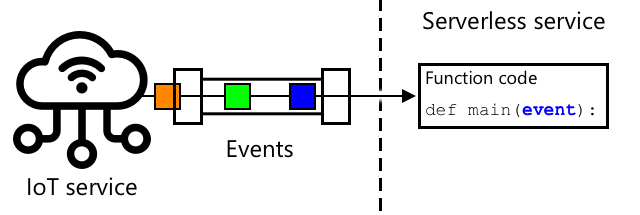

<!--
CO_OP_TRANSLATOR_METADATA:
{
  "original_hash": "5f2d2f4a5a023c93ab34a0cc5b47c0c4",
  "translation_date": "2025-08-27T21:42:50+00:00",
  "source_file": "2-farm/lessons/5-migrate-application-to-the-cloud/README.md",
  "language_code": "ms"
}
-->
# Migrasikan logik aplikasi anda ke awan


> Sketchnote oleh [Nitya Narasimhan](https://github.com/nitya). Klik imej untuk versi yang lebih besar.

Pelajaran ini diajar sebagai sebahagian daripada [Projek IoT untuk Pemula 2 - Siri Pertanian Digital](https://youtube.com/playlist?list=PLmsFUfdnGr3yCutmcVg6eAUEfsGiFXgcx) daripada [Microsoft Reactor](https://developer.microsoft.com/reactor/?WT.mc_id=academic-17441-jabenn).

[](https://youtu.be/VVZDcs5u1_I)

## Kuiz sebelum kuliah

[Kuiz sebelum kuliah](https://black-meadow-040d15503.1.azurestaticapps.net/quiz/17)

## Pengenalan

Dalam pelajaran sebelum ini, anda telah belajar cara menyambungkan pemantauan kelembapan tanah tumbuhan anda dan kawalan relay ke perkhidmatan IoT berasaskan awan. Langkah seterusnya adalah memindahkan kod pelayan yang mengawal masa relay ke awan. Dalam pelajaran ini, anda akan belajar cara melakukannya menggunakan fungsi tanpa pelayan.

Dalam pelajaran ini, kita akan membincangkan:

* [Apa itu tanpa pelayan?](../../../../../2-farm/lessons/5-migrate-application-to-the-cloud)
* [Cipta aplikasi tanpa pelayan](../../../../../2-farm/lessons/5-migrate-application-to-the-cloud)
* [Cipta pencetus acara IoT Hub](../../../../../2-farm/lessons/5-migrate-application-to-the-cloud)
* [Hantar permintaan kaedah langsung daripada kod tanpa pelayan](../../../../../2-farm/lessons/5-migrate-application-to-the-cloud)
* [Sebarkan kod tanpa pelayan anda ke awan](../../../../../2-farm/lessons/5-migrate-application-to-the-cloud)

## Apa itu tanpa pelayan?

Tanpa pelayan, atau pengkomputeran tanpa pelayan, melibatkan penciptaan blok kecil kod yang dijalankan di awan sebagai tindak balas kepada pelbagai jenis acara. Apabila acara berlaku, kod anda dijalankan dan menerima data tentang acara tersebut. Acara ini boleh datang daripada pelbagai sumber, termasuk permintaan web, mesej yang diletakkan dalam barisan, perubahan data dalam pangkalan data, atau mesej yang dihantar ke perkhidmatan IoT oleh peranti IoT.



> 💁 Jika anda pernah menggunakan pencetus pangkalan data sebelum ini, anda boleh menganggap ini sebagai perkara yang sama, iaitu kod yang dicetuskan oleh acara seperti memasukkan baris.


Kod anda hanya dijalankan apabila acara berlaku, dan tidak akan aktif pada masa lain. Apabila acara berlaku, kod anda dimuatkan dan dijalankan. Ini menjadikan tanpa pelayan sangat berskala - jika banyak acara berlaku serentak, penyedia awan boleh menjalankan fungsi anda sebanyak yang diperlukan pada masa yang sama di seluruh pelayan yang tersedia. Kelemahannya ialah jika anda perlu berkongsi maklumat antara acara, anda perlu menyimpannya di tempat lain seperti pangkalan data dan bukannya menyimpannya dalam memori.

Kod anda ditulis sebagai fungsi yang menerima butiran tentang acara sebagai parameter. Anda boleh menggunakan pelbagai bahasa pengaturcaraan untuk menulis fungsi tanpa pelayan ini.

> 🎓 Tanpa pelayan juga dikenali sebagai Fungsi sebagai Perkhidmatan (FaaS) kerana setiap pencetus acara dilaksanakan sebagai fungsi dalam kod.

Walaupun namanya, tanpa pelayan sebenarnya menggunakan pelayan. Nama ini digunakan kerana sebagai pembangun, anda tidak perlu mengambil berat tentang pelayan yang diperlukan untuk menjalankan kod anda, yang penting hanyalah kod anda dijalankan sebagai tindak balas kepada acara. Penyedia awan mempunyai *runtime* tanpa pelayan yang menguruskan peruntukan pelayan, rangkaian, storan, CPU, memori, dan segala yang diperlukan untuk menjalankan kod anda. Model ini bermaksud anda tidak membayar per pelayan, tetapi membayar untuk masa kod anda dijalankan dan jumlah memori yang digunakan.

> 💰 Tanpa pelayan adalah salah satu cara paling murah untuk menjalankan kod di awan. Sebagai contoh, pada masa penulisan, satu penyedia awan membenarkan semua fungsi tanpa pelayan anda dijalankan sebanyak 1,000,000 kali sebulan sebelum mereka mula mengenakan bayaran, dan selepas itu mereka mengenakan bayaran sebanyak US$0.20 untuk setiap 1,000,000 pelaksanaan. Apabila kod anda tidak dijalankan, anda tidak membayar.

Sebagai pembangun IoT, model tanpa pelayan sangat ideal. Anda boleh menulis fungsi yang dipanggil sebagai tindak balas kepada mesej yang dihantar daripada mana-mana peranti IoT yang disambungkan ke perkhidmatan IoT yang dihoskan di awan. Kod anda akan mengendalikan semua mesej yang dihantar, tetapi hanya dijalankan apabila diperlukan.

✅ Lihat kembali kod yang anda tulis sebagai kod pelayan yang mendengar mesej melalui MQTT. Bagaimana kod ini boleh dijalankan di awan menggunakan tanpa pelayan? Bagaimana anda fikir kod tersebut mungkin perlu diubah untuk menyokong pengkomputeran tanpa pelayan?

> 💁 Model tanpa pelayan juga berkembang ke perkhidmatan awan lain selain menjalankan kod. Sebagai contoh, pangkalan data tanpa pelayan tersedia di awan menggunakan model harga tanpa pelayan di mana anda membayar per permintaan yang dibuat terhadap pangkalan data, seperti pertanyaan atau sisipan, biasanya berdasarkan jumlah kerja yang dilakukan untuk melayani permintaan tersebut. Sebagai contoh, satu pertanyaan untuk memilih satu baris berdasarkan kunci utama akan lebih murah daripada operasi rumit yang menyambungkan banyak jadual dan mengembalikan ribuan baris.

## Cipta aplikasi tanpa pelayan

Perkhidmatan pengkomputeran tanpa pelayan daripada Microsoft dikenali sebagai Azure Functions.


Video pendek di bawah memberikan gambaran keseluruhan tentang Azure Functions.

[](https://www.youtube.com/watch?v=8-jz5f_JyEQ)

> 🎥 Klik imej di atas untuk menonton video

✅ Luangkan masa untuk melakukan penyelidikan dan baca gambaran keseluruhan Azure Functions dalam [dokumentasi Microsoft Azure Functions](https://docs.microsoft.com/azure/azure-functions/functions-overview?WT.mc_id=academic-17441-jabenn).

Untuk menulis Azure Functions, anda bermula dengan aplikasi Azure Functions dalam bahasa pilihan anda. Secara lalai, Azure Functions menyokong Python, JavaScript, TypeScript, C#, F#, Java, dan Powershell. Dalam pelajaran ini, anda akan belajar cara menulis aplikasi Azure Functions dalam Python.

> 💁 Azure Functions juga menyokong pengendali tersuai, jadi anda boleh menulis fungsi anda dalam mana-mana bahasa yang menyokong permintaan HTTP, termasuk bahasa lama seperti COBOL.

Aplikasi fungsi terdiri daripada satu atau lebih *pencetus* - fungsi yang bertindak balas kepada acara. Anda boleh mempunyai pelbagai pencetus dalam satu aplikasi fungsi, semuanya berkongsi konfigurasi yang sama. Sebagai contoh, dalam fail konfigurasi untuk aplikasi Functions anda, anda boleh mempunyai butiran sambungan IoT Hub anda, dan semua fungsi dalam aplikasi boleh menggunakan ini untuk menyambung dan mendengar acara.

### Tugas - pasang alat Azure Functions

> Pada masa penulisan, alat kod Azure Functions tidak sepenuhnya berfungsi pada Apple Silicon dengan projek Python. Anda perlu menggunakan Mac berasaskan Intel, PC Windows, atau PC Linux sebagai gantinya.

Satu ciri hebat Azure Functions ialah anda boleh menjalankannya secara tempatan. Runtime yang sama yang digunakan di awan boleh dijalankan pada komputer anda, membolehkan anda menulis kod yang bertindak balas kepada mesej IoT dan menjalankannya secara tempatan. Anda juga boleh menyahpepijat kod anda semasa acara dikendalikan. Setelah anda berpuas hati dengan kod anda, ia boleh disebarkan ke awan.

Alat Azure Functions tersedia sebagai CLI, dikenali sebagai Azure Functions Core Tools.

1. Pasang alat teras Azure Functions dengan mengikuti arahan dalam [dokumentasi Azure Functions Core Tools](https://docs.microsoft.com/azure/azure-functions/functions-run-local?WT.mc_id=academic-17441-jabenn).

1. Pasang sambungan Azure Functions untuk VS Code. Sambungan ini menyediakan sokongan untuk mencipta, menyahpepijat, dan menyebarkan fungsi Azure. Rujuk [dokumentasi sambungan Azure Functions](https://marketplace.visualstudio.com/items?WT.mc_id=academic-17441-jabenn&itemName=ms-azuretools.vscode-azurefunctions) untuk arahan memasang sambungan ini dalam VS Code.

Apabila anda menyebarkan aplikasi Azure Functions anda ke awan, ia memerlukan sedikit storan awan untuk menyimpan fail aplikasi dan fail log. Apabila anda menjalankan aplikasi Functions anda secara tempatan, anda masih perlu menyambung ke storan awan, tetapi bukannya menggunakan storan awan sebenar, anda boleh menggunakan emulator storan yang dipanggil [Azurite](https://github.com/Azure/Azurite). Ini dijalankan secara tempatan tetapi bertindak seperti storan awan.

> 🎓 Dalam Azure, storan yang digunakan oleh Azure Functions ialah Akaun Storan Azure. Akaun ini boleh menyimpan fail, blob, data dalam jadual, atau data dalam barisan. Anda boleh berkongsi satu akaun storan antara banyak aplikasi, seperti aplikasi Functions dan aplikasi web.

1. Azurite ialah aplikasi Node.js, jadi anda perlu memasang Node.js. Anda boleh mencari muat turun dan arahan pemasangan di [laman web Node.js](https://nodejs.org/). Jika anda menggunakan Mac, anda juga boleh memasangnya daripada [Homebrew](https://formulae.brew.sh/formula/node).

1. Pasang Azurite menggunakan arahan berikut (`npm` ialah alat yang dipasang apabila anda memasang Node.js):

    ```sh
    npm install -g azurite
    ```

1. Cipta folder bernama `azurite` untuk Azurite menyimpan data:

    ```sh
    mkdir azurite
    ```

1. Jalankan Azurite, dengan memberikan folder baru ini:

    ```sh
    azurite --location azurite
    ```

    Emulator storan Azurite akan dilancarkan dan bersedia untuk runtime Functions tempatan untuk menyambung.

    ```output
    ➜  ~ azurite --location azurite  
    Azurite Blob service is starting at http://127.0.0.1:10000
    Azurite Blob service is successfully listening at http://127.0.0.1:10000
    Azurite Queue service is starting at http://127.0.0.1:10001
    Azurite Queue service is successfully listening at http://127.0.0.1:10001
    Azurite Table service is starting at http://127.0.0.1:10002
    Azurite Table service is successfully listening at http://127.0.0.1:10002
    ```

### Tugas - cipta projek Azure Functions

CLI Azure Functions boleh digunakan untuk mencipta aplikasi Functions baru.

1. Cipta folder untuk aplikasi Functions anda dan navigasi ke dalamnya. Namakan ia `soil-moisture-trigger`:

    ```sh
    mkdir soil-moisture-trigger
    cd soil-moisture-trigger
    ```

1. Cipta persekitaran maya Python di dalam folder ini:

    ```sh
    python3 -m venv .venv
    ```

1. Aktifkan persekitaran maya:

    * Pada Windows:
        * Jika anda menggunakan Command Prompt, atau Command Prompt melalui Windows Terminal, jalankan:

            ```cmd
            .venv\Scripts\activate.bat
            ```

        * Jika anda menggunakan PowerShell, jalankan:

            ```powershell
            .\.venv\Scripts\Activate.ps1
            ```

    * Pada macOS atau Linux, jalankan:

        ```cmd
        source ./.venv/bin/activate
        ```

    > 💁 Arahan ini harus dijalankan dari lokasi yang sama di mana anda menjalankan arahan untuk mencipta persekitaran maya. Anda tidak perlu menavigasi ke dalam folder `.venv`, anda hanya perlu menjalankan arahan pengaktifan dan sebarang arahan untuk memasang pakej atau menjalankan kod dari folder tempat anda mencipta persekitaran maya.

1. Jalankan arahan berikut untuk mencipta aplikasi Functions dalam folder ini:

    ```sh
    func init --worker-runtime python soil-moisture-trigger
    ```

    Ini akan mencipta tiga fail dalam folder semasa:

    * `host.json` - dokumen JSON ini mengandungi tetapan untuk aplikasi Functions anda. Anda tidak perlu mengubah tetapan ini.
    * `local.settings.json` - dokumen JSON ini mengandungi tetapan yang digunakan aplikasi anda semasa dijalankan secara tempatan, seperti rentetan sambungan untuk IoT Hub anda. Tetapan ini hanya untuk kegunaan tempatan dan tidak boleh ditambahkan ke kawalan kod sumber. Apabila anda menyebarkan aplikasi ke awan, tetapan ini tidak disebarkan, sebaliknya tetapan anda dimuatkan dari tetapan aplikasi. Ini akan dibincangkan kemudian dalam pelajaran ini.
    * `requirements.txt` - ini adalah [fail keperluan Pip](https://pip.pypa.io/en/stable/user_guide/#requirements-files) yang mengandungi pakej Pip yang diperlukan untuk menjalankan aplikasi Functions anda.

1. Fail `local.settings.json` mempunyai tetapan untuk akaun storan yang akan digunakan oleh aplikasi Functions. Tetapan ini secara lalai kosong, jadi perlu diubah. Untuk menyambung ke emulator storan tempatan Azurite, tetapkan nilai ini kepada:

    ```json
    "AzureWebJobsStorage": "UseDevelopmentStorage=true",
    ```

1. Pasang pakej Pip yang diperlukan menggunakan fail keperluan:

    ```sh
    pip install -r requirements.txt
    ```

    > 💁 Pakej Pip yang diperlukan perlu berada dalam fail ini, supaya apabila aplikasi Functions disebarkan ke awan, runtime boleh memastikan ia memasang pakej yang betul.

1. Untuk menguji sama ada semuanya berfungsi dengan betul, anda boleh memulakan runtime Functions. Jalankan arahan berikut untuk melakukannya:

    ```sh
    func start
    ```

    Anda akan melihat runtime bermula dan melaporkan bahawa ia tidak menemui sebarang fungsi tugas (pencetus).

    ```output
    (.venv) ➜  soil-moisture-trigger func start
    Found Python version 3.9.1 (python3).
    
    Azure Functions Core Tools
    Core Tools Version:       3.0.3442 Commit hash: 6bfab24b2743f8421475d996402c398d2fe4a9e0  (64-bit)
    Function Runtime Version: 3.0.15417.0
    
    [2021-05-05T01:24:46.795Z] No job functions found.
    ```
> ⚠️ Jika anda menerima notifikasi firewall, berikan akses kerana aplikasi `func` perlu dapat membaca dan menulis ke rangkaian anda.
> ⚠️ Jika anda menggunakan macOS, mungkin terdapat amaran dalam output:
>
> ```output
    > (.venv) ➜  soil-moisture-trigger func start
    > Found Python version 3.9.1 (python3).
    >
    > Azure Functions Core Tools
    > Core Tools Version:       3.0.3442 Commit hash: 6bfab24b2743f8421475d996402c398d2fe4a9e0  (64-bit)
    > Function Runtime Version: 3.0.15417.0
    >
    > [2021-06-16T08:18:28.315Z] Cannot create directory for shared memory usage: /dev/shm/AzureFunctions
    > [2021-06-16T08:18:28.316Z] System.IO.FileSystem: Access to the path '/dev/shm/AzureFunctions' is denied. Operation not permitted.
    > [2021-06-16T08:18:30.361Z] No job functions found.
    > ```
>
> Anda boleh mengabaikan ini selagi aplikasi Functions bermula dengan betul dan menyenaraikan fungsi yang sedang berjalan. Seperti yang dinyatakan dalam [soalan ini di Microsoft Docs Q&A](https://docs.microsoft.com/answers/questions/396617/azure-functions-core-tools-error-osx-devshmazurefu.html?WT.mc_id=academic-17441-jabenn), ia boleh diabaikan.

1. Hentikan aplikasi Functions dengan menekan `ctrl+c`.

1. Buka folder semasa dalam VS Code, sama ada dengan membuka VS Code, kemudian membuka folder ini, atau dengan menjalankan perintah berikut:

    ```sh
    code .
    ```

    VS Code akan mengesan projek Functions anda dan menunjukkan notifikasi yang mengatakan:

    ```output
    Detected an Azure Functions Project in folder "soil-moisture-trigger" that may have been created outside of
    VS Code. Initialize for optimal use with VS Code?
    ```

    

    Pilih **Yes** dari notifikasi ini.

1. Pastikan persekitaran maya Python sedang berjalan dalam terminal VS Code. Hentikan dan mulakan semula jika perlu.

## Cipta pencetus acara IoT Hub

Aplikasi Functions adalah kerangka untuk kod tanpa pelayan anda. Untuk bertindak balas kepada acara IoT Hub, anda boleh menambah pencetus IoT Hub ke aplikasi ini. Pencetus ini perlu disambungkan ke aliran mesej yang dihantar ke IoT Hub dan bertindak balas terhadapnya. Untuk mendapatkan aliran mesej ini, pencetus anda perlu disambungkan ke *event hub compatible endpoint* IoT Hub.

IoT Hub dibina berdasarkan perkhidmatan Azure lain yang dipanggil Azure Event Hubs. Event Hubs adalah perkhidmatan yang membolehkan anda menghantar dan menerima mesej, dan IoT Hub memperluaskannya dengan menambah ciri untuk peranti IoT. Cara anda menyambung untuk membaca mesej dari IoT Hub adalah sama seperti jika anda menggunakan Event Hubs.

✅ Lakukan penyelidikan: Baca gambaran keseluruhan Event Hubs dalam [dokumentasi Azure Event Hubs](https://docs.microsoft.com/azure/event-hubs/event-hubs-about?WT.mc_id=academic-17441-jabenn). Bagaimana ciri asasnya dibandingkan dengan IoT Hub?

Untuk peranti IoT menyambung ke IoT Hub, ia perlu menggunakan kunci rahsia yang memastikan hanya peranti yang dibenarkan boleh menyambung. Perkara yang sama berlaku apabila menyambung untuk membaca mesej, kod anda memerlukan rentetan sambungan yang mengandungi kunci rahsia, bersama dengan butiran IoT Hub.

> 💁 Rentetan sambungan lalai yang anda dapat mempunyai kebenaran **iothubowner**, yang memberikan sebarang kod yang menggunakannya kebenaran penuh pada IoT Hub. Sebaiknya anda menyambung dengan tahap kebenaran paling rendah yang diperlukan. Ini akan dibincangkan dalam pelajaran seterusnya.

Setelah pencetus anda disambungkan, kod dalam fungsi akan dipanggil untuk setiap mesej yang dihantar ke IoT Hub, tanpa mengira peranti mana yang menghantarnya. Pencetus akan menerima mesej tersebut sebagai parameter.

### Tugasan - dapatkan rentetan sambungan *event hub compatible endpoint*

1. Dari terminal VS Code, jalankan perintah berikut untuk mendapatkan rentetan sambungan untuk *event hub compatible endpoint* IoT Hub:

    ```sh
    az iot hub connection-string show --default-eventhub \
                                      --output table \
                                      --hub-name <hub_name>
    ```

    Gantikan `<hub_name>` dengan nama yang anda gunakan untuk IoT Hub anda.

1. Dalam VS Code, buka fail `local.settings.json`. Tambahkan nilai tambahan berikut di dalam bahagian `Values`:

    ```json
    "IOT_HUB_CONNECTION_STRING": "<connection string>"
    ```

    Gantikan `<connection string>` dengan nilai dari langkah sebelumnya. Anda perlu menambah koma selepas baris di atas untuk menjadikannya JSON yang sah.

### Tugasan - cipta pencetus acara

Anda kini bersedia untuk mencipta pencetus acara.

1. Dari terminal VS Code, jalankan perintah berikut dari dalam folder `soil-moisture-trigger`:

    ```sh
    func new --name iot-hub-trigger --template "Azure Event Hub trigger"
    ```

    Ini akan mencipta Fungsi baru yang dipanggil `iot-hub-trigger`. Pencetus ini akan disambungkan ke *event hub compatible endpoint* pada IoT Hub, jadi anda boleh menggunakan pencetus event hub. Tiada pencetus khusus untuk IoT Hub.

Ini akan mencipta folder di dalam folder `soil-moisture-trigger` yang dipanggil `iot-hub-trigger` yang mengandungi fungsi ini. Folder ini akan mempunyai fail berikut di dalamnya:

* `__init__.py` - ini adalah fail kod Python yang mengandungi pencetus, menggunakan konvensi nama fail Python standard untuk menjadikan folder ini sebagai modul Python.

    Fail ini akan mengandungi kod berikut:

    ```python
    import logging

    import azure.functions as func


    def main(event: func.EventHubEvent):
        logging.info('Python EventHub trigger processed an event: %s',
                    event.get_body().decode('utf-8'))
    ```

    Inti pencetus adalah fungsi `main`. Fungsi inilah yang dipanggil dengan acara dari IoT Hub. Fungsi ini mempunyai parameter yang dipanggil `event` yang mengandungi `EventHubEvent`. Setiap kali mesej dihantar ke IoT Hub, fungsi ini dipanggil dengan mesej tersebut sebagai `event`, bersama dengan sifat-sifat yang sama seperti anotasi yang anda lihat dalam pelajaran sebelumnya.

    Inti fungsi ini adalah untuk mencatatkan acara tersebut.

* `function.json` - ini mengandungi konfigurasi untuk pencetus. Konfigurasi utama adalah dalam bahagian yang dipanggil `bindings`. Binding adalah istilah untuk sambungan antara Azure Functions dan perkhidmatan Azure lain. Fungsi ini mempunyai input binding ke event hub - ia menyambung ke event hub dan menerima data.

    > 💁 Anda juga boleh mempunyai output binding supaya output fungsi dihantar ke perkhidmatan lain. Sebagai contoh, anda boleh menambah output binding ke pangkalan data dan mengembalikan acara IoT Hub dari fungsi, dan ia akan secara automatik dimasukkan ke dalam pangkalan data.

    ✅ Lakukan penyelidikan: Baca tentang binding dalam [dokumentasi konsep Azure Functions triggers and bindings](https://docs.microsoft.com/azure/azure-functions/functions-triggers-bindings?WT.mc_id=academic-17441-jabenn&tabs=python).

    Bahagian `bindings` termasuk konfigurasi untuk binding. Nilai yang penting adalah:

  * `"type": "eventHubTrigger"` - ini memberitahu fungsi bahawa ia perlu mendengar acara dari Event Hub
  * `"name": "events"` - ini adalah nama parameter untuk acara Event Hub. Ini sepadan dengan nama parameter dalam fungsi `main` dalam kod Python.
  * `"direction": "in"` - ini adalah input binding, data dari event hub masuk ke fungsi
  * `"connection": ""` - ini menentukan nama tetapan untuk membaca rentetan sambungan. Apabila dijalankan secara tempatan, ini akan membaca tetapan ini dari fail `local.settings.json`.

    > 💁 Rentetan sambungan tidak boleh disimpan dalam fail `function.json`, ia mesti dibaca dari tetapan. Ini untuk mengelakkan anda secara tidak sengaja mendedahkan rentetan sambungan anda.

1. Disebabkan oleh [bug dalam templat Azure Functions](https://github.com/Azure/azure-functions-templates/issues/1250), `function.json` mempunyai nilai yang salah untuk medan `cardinality`. Kemas kini medan ini dari `many` ke `one`:

    ```json
    "cardinality": "one",
    ```

1. Kemas kini nilai `"connection"` dalam fail `function.json` untuk menunjuk kepada nilai baru yang anda tambahkan ke fail `local.settings.json`:

    ```json
    "connection": "IOT_HUB_CONNECTION_STRING",
    ```

    > 💁 Ingat - ini perlu menunjuk kepada tetapan, bukan mengandungi rentetan sambungan sebenar.

1. Rentetan sambungan mengandungi nilai `eventHubName`, jadi nilai untuk ini dalam fail `function.json` perlu dikosongkan. Kemas kini nilai ini kepada rentetan kosong:

    ```json
    "eventHubName": "",
    ```

### Tugasan - jalankan pencetus acara

1. Pastikan anda tidak menjalankan monitor acara IoT Hub. Jika ini berjalan pada masa yang sama dengan aplikasi Functions, aplikasi Functions tidak akan dapat menyambung dan menggunakan acara.

    > 💁 Beberapa aplikasi boleh menyambung ke endpoint IoT Hub menggunakan *consumer groups* yang berbeza. Ini akan dibincangkan dalam pelajaran seterusnya.

1. Untuk menjalankan aplikasi Functions, jalankan perintah berikut dari terminal VS Code:

    ```sh
    func start
    ```

    Aplikasi Functions akan bermula, dan akan mengesan fungsi `iot-hub-trigger`. Ia kemudian akan memproses sebarang acara yang telah dihantar ke IoT Hub dalam tempoh sehari yang lalu.

    ```output
    (.venv) ➜  soil-moisture-trigger func start
    Found Python version 3.9.1 (python3).
    
    Azure Functions Core Tools
    Core Tools Version:       3.0.3442 Commit hash: 6bfab24b2743f8421475d996402c398d2fe4a9e0  (64-bit)
    Function Runtime Version: 3.0.15417.0
    
    Functions:
    
            iot-hub-trigger: eventHubTrigger
    
    For detailed output, run func with --verbose flag.
    [2021-05-05T02:44:07.517Z] Worker process started and initialized.
    [2021-05-05T02:44:09.202Z] Executing 'Functions.iot-hub-trigger' (Reason='(null)', Id=802803a5-eae9-4401-a1f4-176631456ce4)
    [2021-05-05T02:44:09.205Z] Trigger Details: PartitionId: 0, Offset: 1011240-1011632, EnqueueTimeUtc: 2021-05-04T19:04:04.2030000Z-2021-05-04T19:04:04.3900000Z, SequenceNumber: 2546-2547, Count: 2
    [2021-05-05T02:44:09.352Z] Python EventHub trigger processed an event: {"soil_moisture":628}
    [2021-05-05T02:44:09.354Z] Python EventHub trigger processed an event: {"soil_moisture":624}
    [2021-05-05T02:44:09.395Z] Executed 'Functions.iot-hub-trigger' (Succeeded, Id=802803a5-eae9-4401-a1f4-176631456ce4, Duration=245ms)
    ```

    Setiap panggilan ke fungsi akan dikelilingi oleh blok `Executing 'Functions.iot-hub-trigger'`/`Executed 'Functions.iot-hub-trigger'` dalam output, jadi anda boleh melihat berapa banyak mesej yang diproses dalam setiap panggilan fungsi.

1. Pastikan peranti IoT anda berjalan. Anda akan melihat mesej kelembapan tanah baru muncul dalam aplikasi Functions.

1. Hentikan dan mulakan semula aplikasi Functions. Anda akan melihat bahawa ia tidak akan memproses mesej sebelumnya lagi, ia hanya akan memproses mesej baru.

> 💁 VS Code juga menyokong debugging untuk Functions anda. Anda boleh menetapkan breakpoint dengan mengklik pada sempadan di permulaan setiap baris kod, atau meletakkan kursor pada baris kod dan memilih *Run -> Toggle breakpoint*, atau menekan `F9`. Anda boleh melancarkan debugger dengan memilih *Run -> Start debugging*, menekan `F5`, atau memilih panel *Run and debug* dan memilih butang **Start debugging**. Dengan cara ini anda boleh melihat butiran acara yang sedang diproses.

#### Penyelesaian Masalah

* Jika anda mendapat ralat berikut:

    ```output
    The listener for function 'Functions.iot-hub-trigger' was unable to start. Microsoft.WindowsAzure.Storage: Connection refused. System.Net.Http: Connection refused. System.Private.CoreLib: Connection refused.
    ```

    Periksa sama ada Azurite sedang berjalan dan anda telah menetapkan `AzureWebJobsStorage` dalam fail `local.settings.json` kepada `UseDevelopmentStorage=true`.

* Jika anda mendapat ralat berikut:

    ```output
    System.Private.CoreLib: Exception while executing function: Functions.iot-hub-trigger. System.Private.CoreLib: Result: Failure Exception: AttributeError: 'list' object has no attribute 'get_body'
    ```

    Periksa bahawa anda telah menetapkan `cardinality` dalam fail `function.json` kepada `one`.

* Jika anda mendapat ralat berikut:

    ```output
    Azure.Messaging.EventHubs: The path to an Event Hub may be specified as part of the connection string or as a separate value, but not both.  Please verify that your connection string does not have the `EntityPath` token if you are passing an explicit Event Hub name. (Parameter 'connectionString').
    ```

    Periksa bahawa anda telah menetapkan `eventHubName` dalam fail `function.json` kepada rentetan kosong.

## Hantar permintaan kaedah langsung dari kod tanpa pelayan

Setakat ini aplikasi Functions anda mendengar mesej dari IoT Hub menggunakan *Event Hub compatible endpoint*. Kini anda perlu menghantar arahan kepada peranti IoT. Ini dilakukan dengan menggunakan sambungan yang berbeza ke IoT Hub melalui *Registry Manager*. Registry Manager adalah alat yang membolehkan anda melihat peranti yang didaftarkan dengan IoT Hub, dan berkomunikasi dengan peranti tersebut dengan menghantar mesej dari awan ke peranti, permintaan kaedah langsung, atau mengemas kini *device twin*. Anda juga boleh menggunakannya untuk mendaftarkan, mengemas kini, atau memadam peranti IoT dari IoT Hub.

Untuk menyambung ke Registry Manager, anda memerlukan rentetan sambungan.

### Tugasan - dapatkan rentetan sambungan Registry Manager

1. Untuk mendapatkan rentetan sambungan, jalankan perintah berikut:

    ```sh
    az iot hub connection-string show --policy-name service \
                                      --output table \
                                      --hub-name <hub_name>
    ```

    Gantikan `<hub_name>` dengan nama yang anda gunakan untuk IoT Hub anda.

    Rentetan sambungan diminta untuk polisi *ServiceConnect* menggunakan parameter `--policy-name service`. Apabila anda meminta rentetan sambungan, anda boleh menentukan kebenaran apa yang akan dibenarkan oleh rentetan sambungan tersebut. Polisi ServiceConnect membolehkan kod anda menyambung dan menghantar mesej kepada peranti IoT.

    ✅ Lakukan penyelidikan: Baca tentang polisi yang berbeza dalam [dokumentasi kebenaran IoT Hub](https://docs.microsoft.com/azure/iot-hub/iot-hub-devguide-security#iot-hub-permissions?WT.mc_id=academic-17441-jabenn)

1. Dalam VS Code, buka fail `local.settings.json`. Tambahkan nilai tambahan berikut di dalam bahagian `Values`:

    ```json
    "REGISTRY_MANAGER_CONNECTION_STRING": "<connection string>"
    ```

    Gantikan `<connection string>` dengan nilai dari langkah sebelumnya. Anda perlu menambah koma selepas baris di atas untuk menjadikannya JSON yang sah.

### Tugasan - hantar permintaan kaedah langsung kepada peranti

1. SDK untuk Registry Manager tersedia melalui pakej Pip. Tambahkan baris berikut ke fail `requirements.txt` untuk menambah kebergantungan pada pakej ini:

    ```sh
    azure-iot-hub
    ```

1. Pastikan terminal VS Code mempunyai persekitaran maya diaktifkan, dan jalankan perintah berikut untuk memasang pakej Pip:

    ```sh
    pip install -r requirements.txt
    ```

1. Tambahkan import berikut ke fail `__init__.py`:

    ```python
    import json
    import os
    from azure.iot.hub import IoTHubRegistryManager
    from azure.iot.hub.models import CloudToDeviceMethod
    ```

    Ini mengimport beberapa pustaka sistem, serta pustaka untuk berinteraksi dengan Registry Manager dan menghantar permintaan kaedah langsung.

1. Keluarkan kod dari dalam kaedah `main`, tetapi kekalkan kaedah itu sendiri.

1. Dalam kaedah `main`, tambahkan kod berikut:

    ```python
    body = json.loads(event.get_body().decode('utf-8'))
    device_id = event.iothub_metadata['connection-device-id']

    logging.info(f'Received message: {body} from {device_id}')
    ```

    Kod ini mengekstrak isi acara yang mengandungi mesej JSON yang dihantar oleh peranti IoT.

    Ia kemudian mendapatkan ID peranti dari anotasi yang dihantar bersama mesej. Isi acara mengandungi mesej yang dihantar sebagai telemetri, manakala kamus `iothub_metadata` mengandungi sifat-sifat yang ditetapkan oleh IoT Hub seperti ID peranti penghantar dan masa mesej dihantar.

    Maklumat ini kemudian dicatatkan. Anda akan melihat log ini dalam terminal apabila anda menjalankan aplikasi Function secara tempatan.

1. Di bawah ini, tambahkan kod berikut:

    ```python
    soil_moisture = body['soil_moisture']

    if soil_moisture > 450:
        direct_method = CloudToDeviceMethod(method_name='relay_on', payload='{}')
    else:
        direct_method = CloudToDeviceMethod(method_name='relay_off', payload='{}')
    ```

    Kod ini mendapatkan kelembapan tanah dari mesej. Ia kemudian memeriksa kelembapan tanah, dan bergantung pada nilainya, mencipta kelas pembantu untuk permintaan kaedah langsung untuk kaedah `relay_on` atau `relay_off`. Permintaan kaedah tidak memerlukan payload, jadi dokumen JSON kosong dihantar.

1. Di bawah ini tambahkan kod berikut:

    ```python
    logging.info(f'Sending direct method request for {direct_method.method_name} for device {device_id}')

    registry_manager_connection_string = os.environ['REGISTRY_MANAGER_CONNECTION_STRING']
    registry_manager = IoTHubRegistryManager(registry_manager_connection_string)
    ```
Kod ini memuatkan `REGISTRY_MANAGER_CONNECTION_STRING` daripada fail `local.settings.json`. Nilai-nilai dalam fail ini tersedia sebagai pembolehubah persekitaran, dan ia boleh dibaca menggunakan fungsi `os.environ`, iaitu fungsi yang mengembalikan kamus semua pembolehubah persekitaran.

> 💁 Apabila kod ini dikerahkan ke awan, nilai-nilai dalam fail `local.settings.json` akan ditetapkan sebagai *Application Settings*, dan ia boleh dibaca daripada pembolehubah persekitaran.

Kod ini kemudian mencipta satu instance kelas pembantu Registry Manager menggunakan connection string.

1. Tambahkan kod berikut di bawah ini:

    ```python
    registry_manager.invoke_device_method(device_id, direct_method)

    logging.info('Direct method request sent!')
    ```

    Kod ini memberitahu registry manager untuk menghantar permintaan kaedah langsung kepada peranti yang menghantar telemetri.

    > 💁 Dalam versi aplikasi yang anda cipta dalam pelajaran terdahulu menggunakan MQTT, arahan kawalan relay dihantar kepada semua peranti. Kod tersebut menganggap anda hanya mempunyai satu peranti. Versi kod ini menghantar permintaan kaedah kepada satu peranti sahaja, jadi ia akan berfungsi jika anda mempunyai beberapa tetapan sensor kelembapan dan relay, menghantar permintaan kaedah langsung yang betul kepada peranti yang betul.

1. Jalankan aplikasi Functions, dan pastikan peranti IoT anda menghantar data. Anda akan melihat mesej diproses dan permintaan kaedah langsung dihantar. Gerakkan sensor kelembapan tanah masuk dan keluar dari tanah untuk melihat nilai berubah dan relay dihidupkan dan dimatikan.

> 💁 Anda boleh menemui kod ini dalam folder [code/functions](../../../../../2-farm/lessons/5-migrate-application-to-the-cloud/code/functions).

## Kerahkan kod tanpa pelayan anda ke awan

Kod anda kini berfungsi secara tempatan, jadi langkah seterusnya adalah mengerahkan aplikasi Functions ke awan.

### Tugas - cipta sumber awan

Aplikasi Functions anda perlu dikerahkan ke sumber Functions App di Azure, yang berada dalam Resource Group yang anda cipta untuk IoT Hub anda. Anda juga perlu mencipta Storage Account di Azure untuk menggantikan emulator yang anda jalankan secara tempatan.

1. Jalankan arahan berikut untuk mencipta storage account:

    ```sh
    az storage account create --resource-group soil-moisture-sensor \
                              --sku Standard_LRS \
                              --name <storage_name> 
    ```

    Gantikan `<storage_name>` dengan nama untuk storage account anda. Nama ini perlu unik secara global kerana ia membentuk sebahagian daripada URL yang digunakan untuk mengakses storage account. Anda hanya boleh menggunakan huruf kecil dan nombor untuk nama ini, tiada watak lain, dan ia terhad kepada 24 aksara. Gunakan sesuatu seperti `sms` dan tambahkan pengenal unik di hujungnya, seperti beberapa perkataan rawak atau nama anda.

    Pilihan `--sku Standard_LRS` memilih tier harga, memilih akaun tujuan umum kos terendah. Tiada tier percuma untuk storan, dan anda membayar untuk apa yang anda gunakan. Kosnya agak rendah, dengan storan paling mahal kurang daripada US$0.05 sebulan setiap gigabyte yang disimpan.

    ✅ Baca tentang harga di [halaman harga Azure Storage Account](https://azure.microsoft.com/pricing/details/storage/?WT.mc_id=academic-17441-jabenn)

1. Jalankan arahan berikut untuk mencipta Function App:

    ```sh
    az functionapp create --resource-group soil-moisture-sensor \
                          --runtime python \
                          --functions-version 3 \
                          --os-type Linux \
                          --consumption-plan-location <location> \
                          --storage-account <storage_name> \
                          --name <functions_app_name>
    ```

    Gantikan `<location>` dengan lokasi yang anda gunakan semasa mencipta Resource Group dalam pelajaran sebelumnya.

    Gantikan `<storage_name>` dengan nama storage account yang anda cipta dalam langkah sebelumnya.

    Gantikan `<functions_app_name>` dengan nama unik untuk Function App anda. Nama ini perlu unik secara global kerana ia membentuk sebahagian daripada URL yang boleh digunakan untuk mengakses Function App. Gunakan sesuatu seperti `soil-moisture-sensor-` dan tambahkan pengenal unik di hujungnya, seperti beberapa perkataan rawak atau nama anda.

    Pilihan `--functions-version 3` menetapkan versi Azure Functions yang akan digunakan. Versi 3 adalah versi terkini.

    Pilihan `--os-type Linux` memberitahu runtime Functions untuk menggunakan Linux sebagai OS untuk menjadi hos fungsi ini. Functions boleh dihoskan di Linux atau Windows, bergantung pada bahasa pengaturcaraan yang digunakan. Aplikasi Python hanya disokong di Linux.

### Tugas - muat naik tetapan aplikasi anda

Semasa anda membangunkan Function App anda, anda menyimpan beberapa tetapan dalam fail `local.settings.json` untuk connection string IoT Hub anda. Tetapan ini perlu ditulis ke Application Settings dalam Function App di Azure supaya ia boleh digunakan oleh kod anda.

> 🎓 Fail `local.settings.json` hanya untuk tetapan pembangunan tempatan, dan ia tidak sepatutnya dimasukkan ke dalam kawalan kod sumber, seperti GitHub. Apabila dikerahkan ke awan, Application Settings digunakan. Application Settings adalah pasangan kunci/nilai yang dihoskan di awan dan dibaca daripada pembolehubah persekitaran sama ada dalam kod anda atau oleh runtime semasa menyambungkan kod anda ke IoT Hub.

1. Jalankan arahan berikut untuk menetapkan tetapan `IOT_HUB_CONNECTION_STRING` dalam Application Settings Function App:

    ```sh
    az functionapp config appsettings set --resource-group soil-moisture-sensor \
                                          --name <functions_app_name> \
                                          --settings "IOT_HUB_CONNECTION_STRING=<connection string>"
    ```

    Gantikan `<functions_app_name>` dengan nama yang anda gunakan untuk Function App anda.

    Gantikan `<connection string>` dengan nilai `IOT_HUB_CONNECTION_STRING` daripada fail `local.settings.json` anda.

1. Ulang langkah di atas, tetapi tetapkan nilai `REGISTRY_MANAGER_CONNECTION_STRING` kepada nilai yang sepadan daripada fail `local.settings.json` anda.

Apabila anda menjalankan arahan ini, ia juga akan mengeluarkan senarai semua Application Settings untuk Function App. Anda boleh menggunakan ini untuk memeriksa bahawa nilai anda ditetapkan dengan betul.

> 💁 Anda akan melihat nilai yang telah ditetapkan untuk `AzureWebJobsStorage`. Dalam fail `local.settings.json` anda, ini ditetapkan kepada nilai untuk menggunakan emulator storan tempatan. Apabila anda mencipta Function App, anda memberikan storage account sebagai parameter, dan ini ditetapkan secara automatik dalam tetapan ini.

### Tugas - kerahkan Function App anda ke awan

Sekarang Function App sudah siap, kod anda boleh dikerahkan.

1. Jalankan arahan berikut dari terminal VS Code untuk menerbitkan Function App anda:

    ```sh
    func azure functionapp publish <functions_app_name>
    ```

    Gantikan `<functions_app_name>` dengan nama yang anda gunakan untuk Function App anda.

Kod akan dibungkus dan dihantar ke Function App, di mana ia akan dikerahkan dan dimulakan. Akan ada banyak output konsol, diakhiri dengan pengesahan pengkerahan dan senarai fungsi yang dikerahkan. Dalam kes ini senarai hanya akan mengandungi trigger.

```output
Deployment successful.
Remote build succeeded!
Syncing triggers...
Functions in soil-moisture-sensor:
    iot-hub-trigger - [eventHubTrigger]
```

Pastikan peranti IoT anda berjalan. Ubah tahap kelembapan dengan menyesuaikan kelembapan tanah, atau menggerakkan sensor masuk dan keluar dari tanah. Anda akan melihat relay dihidupkan dan dimatikan apabila kelembapan tanah berubah.

---

## 🚀 Cabaran

Dalam pelajaran sebelumnya, anda menguruskan masa untuk relay dengan berhenti melanggan mesej MQTT semasa relay dihidupkan, dan untuk seketika selepas ia dimatikan. Anda tidak boleh menggunakan kaedah ini di sini - anda tidak boleh berhenti melanggan trigger IoT Hub anda.

Fikirkan cara lain yang boleh anda gunakan untuk menguruskan ini dalam Function App anda.

## Kuiz selepas kuliah

[Kuiz selepas kuliah](https://black-meadow-040d15503.1.azurestaticapps.net/quiz/18)

## Ulasan & Kajian Kendiri

* Baca tentang pengkomputeran tanpa pelayan di [halaman Serverless Computing di Wikipedia](https://wikipedia.org/wiki/Serverless_computing)
* Baca tentang menggunakan tanpa pelayan di Azure termasuk beberapa contoh lagi di [catatan blog Go serverless for your IoT needs Azure](https://azure.microsoft.com/blog/go-serverless-for-your-iot-needs/?WT.mc_id=academic-17441-jabenn)
* Ketahui lebih lanjut tentang Azure Functions di [saluran YouTube Azure Functions](https://www.youtube.com/c/AzureFunctions)

## Tugasan

[Tambah kawalan relay manual](assignment.md)

---

**Penafian**:  
Dokumen ini telah diterjemahkan menggunakan perkhidmatan terjemahan AI [Co-op Translator](https://github.com/Azure/co-op-translator). Walaupun kami berusaha untuk memastikan ketepatan, sila ambil perhatian bahawa terjemahan automatik mungkin mengandungi kesilapan atau ketidaktepatan. Dokumen asal dalam bahasa asalnya harus dianggap sebagai sumber yang berwibawa. Untuk maklumat yang kritikal, terjemahan manusia profesional adalah disyorkan. Kami tidak bertanggungjawab atas sebarang salah faham atau salah tafsir yang timbul daripada penggunaan terjemahan ini.