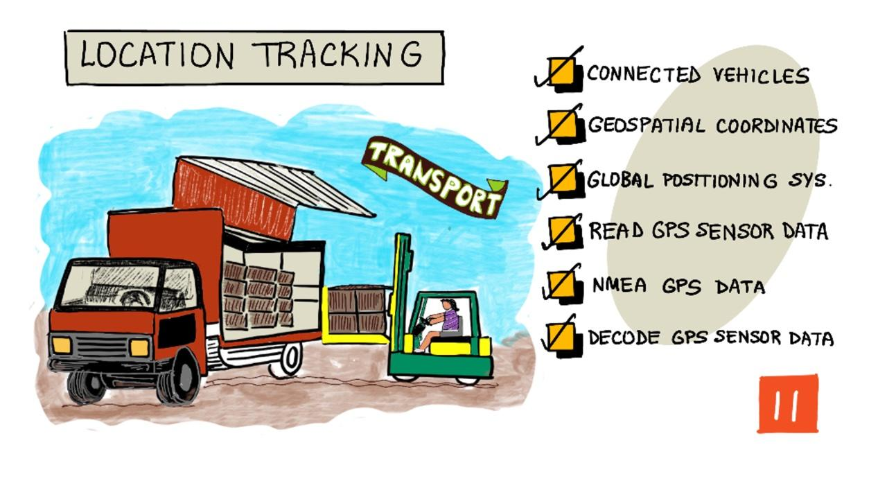
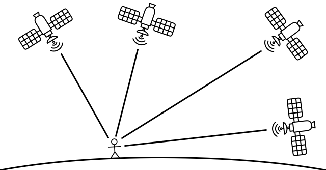

<!--
CO_OP_TRANSLATOR_METADATA:
{
  "original_hash": "52ed2bd997d08040f79a1a6ef2bac958",
  "translation_date": "2025-08-27T23:47:32+00:00",
  "source_file": "3-transport/lessons/1-location-tracking/README.md",
  "language_code": "ms"
}
-->
# Penjejakan Lokasi

> Sketchnote oleh [Nitya Narasimhan](https://github.com/nitya). Klik imej untuk versi yang lebih besar.

## Kuiz Pra-Kuliah

[Kuiz Pra-Kuliah](https://black-meadow-040d15503.1.azurestaticapps.net/quiz/21)

## Pengenalan

Proses utama untuk membawa makanan dari petani kepada pengguna melibatkan pemuatan kotak hasil tanaman ke dalam trak, kapal, kapal terbang, atau kenderaan pengangkutan komersial lain, dan menghantar makanan ke suatu tempat - sama ada terus kepada pelanggan, atau ke hab pusat atau gudang untuk diproses. Keseluruhan proses dari ladang ke pengguna adalah sebahagian daripada proses yang dipanggil *rantaian bekalan*. Video di bawah dari W. P. Carey School of Business, Arizona State University, membincangkan idea rantaian bekalan dan bagaimana ia diuruskan dengan lebih terperinci.

> 🎥 Klik imej di atas untuk menonton video

Penambahan peranti IoT boleh meningkatkan rantaian bekalan anda secara drastik, membolehkan anda menguruskan lokasi barang, merancang pengangkutan dan pengendalian barang dengan lebih baik, serta bertindak balas dengan lebih cepat terhadap masalah.

Apabila menguruskan armada kenderaan seperti trak, adalah berguna untuk mengetahui lokasi setiap kenderaan pada masa tertentu. Kenderaan boleh dilengkapi dengan sensor GPS yang menghantar lokasi mereka ke sistem IoT, membolehkan pemilik mengenal pasti lokasi mereka, melihat laluan yang telah diambil, dan mengetahui bila mereka akan tiba di destinasi. Kebanyakan kenderaan beroperasi di luar liputan WiFi, jadi mereka menggunakan rangkaian selular untuk menghantar data seperti ini. Kadangkala sensor GPS dibina dalam peranti IoT yang lebih kompleks seperti buku log elektronik. Peranti ini menjejaki berapa lama trak telah dalam perjalanan untuk memastikan pemandu mematuhi undang-undang tempatan mengenai waktu bekerja.

Dalam pelajaran ini, anda akan belajar cara menjejaki lokasi kenderaan menggunakan sensor Sistem Penentududukan Global (GPS).

Dalam pelajaran ini, kita akan membincangkan:

* [Kenderaan bersambung](../../../../../3-transport/lessons/1-location-tracking)
* [Koordinat geospatial](../../../../../3-transport/lessons/1-location-tracking)
* [Sistem Penentududukan Global (GPS)](../../../../../3-transport/lessons/1-location-tracking)
* [Membaca data sensor GPS](../../../../../3-transport/lessons/1-location-tracking)
* [Data GPS NMEA](../../../../../3-transport/lessons/1-location-tracking)
* [Menyahkod data sensor GPS](../../../../../3-transport/lessons/1-location-tracking)

## Kenderaan Bersambung

IoT sedang mengubah cara barang diangkut dengan mencipta armada *kenderaan bersambung*. Kenderaan ini disambungkan ke sistem IT pusat yang melaporkan maklumat tentang lokasi mereka, dan data sensor lain. Memiliki armada kenderaan bersambung memberikan pelbagai manfaat:

* Penjejakan lokasi - anda boleh mengenal pasti lokasi kenderaan pada bila-bila masa, membolehkan anda:

  * Mendapatkan pemberitahuan apabila kenderaan hampir tiba di destinasi untuk menyediakan kru bagi pemunggahan
  * Mengesan kenderaan yang dicuri
  * Menggabungkan data lokasi dan laluan dengan masalah trafik untuk membolehkan anda mengubah laluan kenderaan di tengah perjalanan
  * Mematuhi cukai. Sesetengah negara mengenakan cukai berdasarkan jarak perjalanan kenderaan di jalan awam (seperti [RUC New Zealand](https://www.nzta.govt.nz/vehicles/licensing-rego/road-user-charges/)), jadi mengetahui bila kenderaan berada di jalan awam berbanding jalan persendirian memudahkan pengiraan cukai yang perlu dibayar.
  * Mengetahui lokasi untuk menghantar kru penyelenggaraan sekiranya berlaku kerosakan

* Telemetri pemandu - memastikan pemandu mematuhi had laju, membelok pada kelajuan yang sesuai, membrek dengan awal dan cekap, serta memandu dengan selamat. Kenderaan bersambung juga boleh dilengkapi kamera untuk merakam insiden. Ini boleh dikaitkan dengan insurans, memberikan kadar yang lebih rendah untuk pemandu yang baik.

* Pematuhan waktu pemandu - memastikan pemandu hanya memandu dalam waktu yang dibenarkan secara sah berdasarkan masa mereka menghidupkan dan mematikan enjin.

Manfaat ini boleh digabungkan - sebagai contoh, menggabungkan pematuhan waktu pemandu dengan penjejakan lokasi untuk mengubah laluan pemandu jika mereka tidak dapat mencapai destinasi dalam waktu memandu yang dibenarkan. Ini juga boleh digabungkan dengan telemetri kenderaan lain, seperti data suhu dari trak yang dikawal suhu, membolehkan kenderaan diubah laluan jika laluan semasa mereka bermaksud barang tidak dapat disimpan pada suhu yang sesuai.

> 🎓 Logistik adalah proses mengangkut barang dari satu tempat ke tempat lain, seperti dari ladang ke pasar raya melalui satu atau lebih gudang. Seorang petani membungkus kotak tomato yang dimuatkan ke dalam trak, dihantar ke gudang pusat, dan dimuatkan ke trak kedua yang mungkin mengandungi campuran pelbagai jenis hasil tanaman yang kemudian dihantar ke pasar raya.

Komponen utama penjejakan kenderaan adalah GPS - sensor yang boleh mengenal pasti lokasi mereka di mana-mana sahaja di Bumi. Dalam pelajaran ini, anda akan belajar cara menggunakan sensor GPS, bermula dengan mempelajari cara menentukan lokasi di Bumi.

## Koordinat Geospatial

Koordinat geospatial digunakan untuk menentukan titik di permukaan Bumi, serupa dengan bagaimana koordinat digunakan untuk melukis piksel pada skrin komputer atau meletakkan jahitan dalam sulaman silang. Untuk satu titik, anda mempunyai sepasang koordinat. Sebagai contoh, Kampus Microsoft di Redmond, Washington, USA terletak pada 47.6423109, -122.1390293.

### Latitud dan Longitud

Bumi adalah sfera - bulatan tiga dimensi. Oleh itu, titik-titik ditentukan dengan membahagikannya kepada 360 darjah, sama seperti geometri bulatan. Latitud mengukur bilangan darjah dari utara ke selatan, longitud mengukur bilangan darjah dari timur ke barat.

> 💁 Tiada siapa yang benar-benar tahu sebab asal mengapa bulatan dibahagikan kepada 360 darjah. [Halaman darjah (sudut) di Wikipedia](https://wikipedia.org/wiki/Degree_(angle)) merangkumi beberapa sebab yang mungkin.

Latitud diukur menggunakan garis yang mengelilingi Bumi dan berjalan selari dengan khatulistiwa, membahagikan Hemisfera Utara dan Selatan kepada 90° setiap satu. Khatulistiwa berada pada 0°, Kutub Utara berada pada 90°, juga dikenali sebagai 90° Utara, dan Kutub Selatan berada pada -90°, atau 90° Selatan.

Longitud diukur sebagai bilangan darjah yang diukur ke timur dan barat. Asal 0° longitud dipanggil *Meridian Perdana*, dan ditakrifkan pada tahun 1884 sebagai garis dari Kutub Utara ke Kutub Selatan yang melalui [Balai Cerap Diraja British di Greenwich, England](https://wikipedia.org/wiki/Royal_Observatory,_Greenwich).

> 🎓 Meridian adalah garis lurus khayalan yang pergi dari Kutub Utara ke Kutub Selatan, membentuk separuh bulatan.

Untuk mengukur longitud sesuatu titik, anda mengukur bilangan darjah di sekitar khatulistiwa dari Meridian Perdana ke meridian yang melalui titik tersebut. Longitud bermula dari -180°, atau 180° Barat, melalui 0° di Meridian Perdana, hingga 180°, atau 180° Timur. 180° dan -180° merujuk kepada titik yang sama, antimeridian atau meridian ke-180. Ini adalah meridian di sisi bertentangan Bumi dari Meridian Perdana.

> 💁 Antimeridian tidak boleh dikelirukan dengan Garis Tarikh Antarabangsa, yang berada di kedudukan yang hampir sama, tetapi bukan garis lurus dan berbeza untuk menyesuaikan sempadan geo-politik.

✅ Lakukan penyelidikan: Cuba cari latitud dan longitud lokasi anda sekarang.

### Darjah, Minit dan Saat vs Darjah Perpuluhan

Secara tradisional, ukuran darjah latitud dan longitud dilakukan menggunakan penomboran seksagesimal, atau asas-60, sistem penomboran yang digunakan oleh orang Babilonia Purba yang pertama kali mengukur dan merekodkan masa dan jarak. Anda mungkin menggunakan seksagesimal setiap hari tanpa menyedarinya - membahagikan jam kepada 60 minit dan minit kepada 60 saat.

Longitud dan latitud diukur dalam darjah, minit dan saat, dengan satu minit bersamaan 1/60 darjah, dan 1 saat bersamaan 1/60 minit.

Sebagai contoh, di khatulistiwa:

* 1° latitud adalah **111.3 kilometer**
* 1 minit latitud adalah 111.3/60 = **1.855 kilometer**
* 1 saat latitud adalah 1.855/60 = **0.031 kilometer**

Simbol untuk minit adalah tanda petik tunggal, untuk saat adalah tanda petik berganda. Sebagai contoh, 2 darjah, 17 minit, dan 43 saat akan ditulis sebagai 2°17'43". Bahagian saat diberikan sebagai perpuluhan, contohnya setengah saat adalah 0°0'0.5".

Komputer tidak berfungsi dalam asas-60, jadi koordinat ini diberikan sebagai darjah perpuluhan apabila menggunakan data GPS dalam kebanyakan sistem komputer. Sebagai contoh, 2°17'43" adalah 2.295277. Simbol darjah biasanya diabaikan.

Koordinat untuk satu titik sentiasa diberikan sebagai `latitud, longitud`, jadi contoh sebelumnya Kampus Microsoft pada 47.6423109,-122.117198 mempunyai:

* Latitud 47.6423109 (47.6423109 darjah utara khatulistiwa)
* Longitud -122.1390293 (122.1390293 darjah barat Meridian Perdana).

## Sistem Penentududukan Global (GPS)

Sistem GPS menggunakan pelbagai satelit yang mengorbit Bumi untuk menentukan lokasi anda. Anda mungkin telah menggunakan sistem GPS tanpa menyedarinya - untuk mencari lokasi anda pada aplikasi peta di telefon seperti Apple Maps atau Google Maps, atau untuk melihat lokasi kenderaan anda dalam aplikasi seperti Uber atau Lyft, atau semasa menggunakan navigasi satelit (sat-nav) dalam kereta anda.

> 🎓 Satelit dalam 'navigasi satelit' adalah satelit GPS!

Sistem GPS berfungsi dengan mempunyai sejumlah satelit yang menghantar isyarat dengan kedudukan semasa setiap satelit, dan cap masa yang tepat. Isyarat ini dihantar melalui gelombang radio dan dikesan oleh antena dalam sensor GPS. Sensor GPS akan mengesan isyarat ini, dan menggunakan masa semasa untuk mengukur berapa lama masa yang diambil untuk isyarat sampai ke sensor dari satelit. Oleh kerana kelajuan gelombang radio adalah tetap, sensor GPS boleh menggunakan cap masa yang dihantar untuk mengira sejauh mana sensor dari satelit. Dengan menggabungkan data dari sekurang-kurangnya 3 satelit dengan kedudukan yang dihantar, sensor GPS dapat menentukan lokasi mereka di Bumi.

> 💁 Sensor GPS memerlukan antena untuk mengesan gelombang radio. Antena yang dibina dalam trak dan kereta dengan GPS terbina dalam diposisikan untuk mendapatkan isyarat yang baik, biasanya pada cermin depan atau bumbung. Jika anda menggunakan sistem GPS yang berasingan, seperti telefon pintar atau peranti IoT, maka anda perlu memastikan bahawa antena yang dibina dalam sistem GPS atau telefon mempunyai pandangan yang jelas ke langit, seperti dipasang pada cermin depan anda.

Satelit GPS mengelilingi Bumi, bukan pada titik tetap di atas sensor, jadi data lokasi termasuk ketinggian di atas paras laut serta latitud dan longitud.

GPS dahulu mempunyai had ketepatan yang dikuatkuasakan oleh tentera AS, mengehadkan ketepatan kepada sekitar 5 meter. Had ini telah dihapuskan pada tahun 2000, membolehkan ketepatan sehingga 30 sentimeter. Mendapatkan ketepatan ini tidak selalu mungkin disebabkan oleh gangguan dengan isyarat.

✅ Jika anda mempunyai telefon pintar, lancarkan aplikasi peta dan lihat sejauh mana ketepatan lokasi anda. Ia mungkin mengambil sedikit masa untuk telefon anda mengesan pelbagai satelit untuk mendapatkan lokasi yang lebih tepat.
💁 Satelit mengandungi jam atom yang sangat tepat, tetapi ia hanyut sebanyak 38 mikrodetik (0.0000038 saat) sehari berbanding jam atom di Bumi, disebabkan oleh masa yang melambat apabila kelajuan meningkat seperti yang diramalkan oleh teori relativiti khas dan umum Einstein - satelit bergerak lebih laju daripada putaran Bumi. Hanyutan ini telah digunakan untuk membuktikan ramalan teori relativiti khas dan umum, dan perlu disesuaikan dalam reka bentuk sistem GPS. Secara literal, masa bergerak lebih perlahan pada satelit GPS.
Sistem GPS telah dibangunkan dan digunakan oleh beberapa negara dan kesatuan politik termasuk AS, Rusia, Jepun, India, EU, dan China. Sensor GPS moden boleh berhubung dengan kebanyakan sistem ini untuk mendapatkan lokasi dengan lebih cepat dan tepat.

> 🎓 Kumpulan satelit dalam setiap pelancaran dirujuk sebagai konstelasi.

## Membaca data sensor GPS

Kebanyakan sensor GPS menghantar data GPS melalui UART.

> ⚠️ UART telah dibincangkan dalam [projek 2, pelajaran 2](../../../2-farm/lessons/2-detect-soil-moisture/README.md#universal-asynchronous-receiver-transmitter-uart). Rujuk kembali pelajaran tersebut jika diperlukan.

Anda boleh menggunakan sensor GPS pada peranti IoT anda untuk mendapatkan data GPS.

### Tugasan - sambungkan sensor GPS dan baca data GPS

Ikuti panduan yang berkaitan untuk membaca data GPS menggunakan peranti IoT anda:

* [Arduino - Wio Terminal](wio-terminal-gps-sensor.md)
* [Komputer papan tunggal - Raspberry Pi](pi-gps-sensor.md)
* [Komputer papan tunggal - Peranti maya](virtual-device-gps-sensor.md)

## Data GPS NMEA

Apabila anda menjalankan kod anda, anda mungkin melihat apa yang kelihatan seperti tulisan yang tidak bermakna dalam output. Ini sebenarnya data GPS standard, dan semuanya mempunyai makna.

Sensor GPS menghasilkan data menggunakan mesej NMEA, berdasarkan standard NMEA 0183. NMEA adalah singkatan untuk [National Marine Electronics Association](https://www.nmea.org), sebuah organisasi perdagangan yang berpangkalan di AS yang menetapkan standard untuk komunikasi antara elektronik marin.

> 💁 Standard ini adalah hak milik dan dijual dengan harga sekurang-kurangnya US$2,000, tetapi maklumat yang mencukupi mengenainya berada dalam domain awam sehingga kebanyakan standard telah direka semula dan boleh digunakan dalam kod sumber terbuka dan bukan komersial.

Mesej-mesej ini berasaskan teks. Setiap mesej terdiri daripada *ayat* yang bermula dengan watak `$`, diikuti oleh 2 watak untuk menunjukkan sumber mesej (contohnya GP untuk sistem GPS AS, GN untuk GLONASS, sistem GPS Rusia), dan 3 watak untuk menunjukkan jenis mesej. Selebihnya mesej adalah medan yang dipisahkan oleh koma, diakhiri dengan watak baris baru.

Beberapa jenis mesej yang boleh diterima adalah:

| Jenis | Penerangan |
| ---- | ----------- |
| GGA | Data Lokasi GPS, termasuk latitud, longitud, dan altitud sensor GPS, bersama dengan bilangan satelit yang dapat dilihat untuk mengira lokasi ini. |
| ZDA | Tarikh dan masa semasa, termasuk zon masa tempatan |
| GSV | Butiran satelit yang dapat dilihat - ditakrifkan sebagai satelit yang sensor GPS boleh mengesan isyaratnya |

> 💁 Data GPS termasuk cap masa, jadi peranti IoT anda boleh mendapatkan masa jika diperlukan daripada sensor GPS, daripada bergantung kepada pelayan NTP atau jam masa nyata dalaman.

Mesej GGA termasuk lokasi semasa menggunakan format `(dd)dmm.mmmm`, bersama dengan satu watak untuk menunjukkan arah. `d` dalam format adalah darjah, `m` adalah minit, dengan saat sebagai pecahan minit. Sebagai contoh, 2°17'43" akan menjadi 217.716666667 - 2 darjah, 17.716666667 minit.

Watak arah boleh menjadi `N` atau `S` untuk latitud untuk menunjukkan utara atau selatan, dan `E` atau `W` untuk longitud untuk menunjukkan timur atau barat. Sebagai contoh, latitud 2°17'43" akan mempunyai watak arah `N`, -2°17'43" akan mempunyai watak arah `S`.

Sebagai contoh - ayat NMEA `$GNGGA,020604.001,4738.538654,N,12208.341758,W,1,3,,164.7,M,-17.1,M,,*67`

* Bahagian latitud adalah `4738.538654,N`, yang ditukar kepada 47.6423109 dalam darjah perpuluhan. `4738.538654` adalah 47.6423109, dan arah adalah `N` (utara), jadi ia adalah latitud positif.

* Bahagian longitud adalah `12208.341758,W`, yang ditukar kepada -122.1390293 dalam darjah perpuluhan. `12208.341758` adalah 122.1390293°, dan arah adalah `W` (barat), jadi ia adalah longitud negatif.

## Menyahkod data sensor GPS

Daripada menggunakan data NMEA mentah, adalah lebih baik untuk menyahkodnya ke dalam format yang lebih berguna. Terdapat banyak perpustakaan sumber terbuka yang boleh anda gunakan untuk membantu mengekstrak data berguna daripada mesej NMEA mentah.

### Tugasan - menyahkod data sensor GPS

Ikuti panduan yang berkaitan untuk menyahkod data sensor GPS menggunakan peranti IoT anda:

* [Arduino - Wio Terminal](wio-terminal-gps-decode.md)
* [Komputer papan tunggal - Raspberry Pi/Peranti IoT maya](single-board-computer-gps-decode.md)

---

## 🚀 Cabaran

Tulis penyahkod NMEA anda sendiri! Daripada bergantung kepada perpustakaan pihak ketiga untuk menyahkod ayat NMEA, bolehkah anda menulis penyahkod anda sendiri untuk mengekstrak latitud dan longitud daripada ayat NMEA?

## Kuiz selepas kuliah

[Kuiz selepas kuliah](https://black-meadow-040d15503.1.azurestaticapps.net/quiz/22)

## Ulasan & Kajian Kendiri

* Baca lebih lanjut tentang Koordinat Geospatial di [halaman sistem koordinat geografi di Wikipedia](https://wikipedia.org/wiki/Geographic_coordinate_system).
* Baca tentang Meridian Utama pada badan cakerawala lain selain Bumi di [halaman Meridian Utama di Wikipedia](https://wikipedia.org/wiki/Prime_meridian#Prime_meridian_on_other_planetary_bodies)
* Selidik pelbagai sistem GPS yang berbeza daripada pelbagai kerajaan dunia dan kesatuan politik seperti EU, Jepun, Rusia, India dan AS.

## Tugasan

[Selidik data GPS lain](assignment.md)

---

**Penafian**:  
Dokumen ini telah diterjemahkan menggunakan perkhidmatan terjemahan AI [Co-op Translator](https://github.com/Azure/co-op-translator). Walaupun kami berusaha untuk memastikan ketepatan, sila ambil perhatian bahawa terjemahan automatik mungkin mengandungi kesilapan atau ketidaktepatan. Dokumen asal dalam bahasa asalnya harus dianggap sebagai sumber yang berwibawa. Untuk maklumat yang kritikal, terjemahan manusia profesional adalah disyorkan. Kami tidak bertanggungjawab atas sebarang salah faham atau salah tafsir yang timbul daripada penggunaan terjemahan ini.