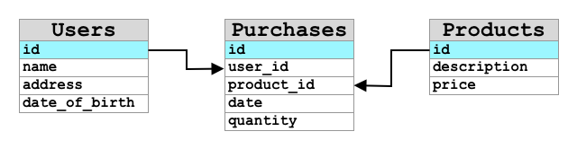

<!--
CO_OP_TRANSLATOR_METADATA:
{
  "original_hash": "e345843ccfeb7261d81500d19c64d476",
  "translation_date": "2025-08-27T23:54:38+00:00",
  "source_file": "3-transport/lessons/2-store-location-data/README.md",
  "language_code": "ms"
}
-->
# Data Lokasi Kedai


> Sketchnote oleh [Nitya Narasimhan](https://github.com/nitya). Klik imej untuk versi yang lebih besar.

## Kuiz Pra-Kuliah

[Kuiz Pra-Kuliah](https://black-meadow-040d15503.1.azurestaticapps.net/quiz/23)

## Pengenalan

Dalam pelajaran sebelumnya, anda telah belajar cara menggunakan sensor GPS untuk menangkap data lokasi. Untuk menggunakan data ini bagi memvisualisasikan lokasi trak yang membawa makanan dan perjalanannya, data tersebut perlu dihantar ke perkhidmatan IoT di awan dan disimpan di suatu tempat.

Dalam pelajaran ini, anda akan mempelajari cara-cara berbeza untuk menyimpan data IoT dan belajar cara menyimpan data daripada perkhidmatan IoT anda menggunakan kod tanpa pelayan.

Dalam pelajaran ini, kita akan membincangkan:

* [Data berstruktur dan tidak berstruktur](../../../../../3-transport/lessons/2-store-location-data)
* [Hantar data GPS ke IoT Hub](../../../../../3-transport/lessons/2-store-location-data)
* [Laluan panas, suam, dan sejuk](../../../../../3-transport/lessons/2-store-location-data)
* [Kendalikan acara GPS menggunakan kod tanpa pelayan](../../../../../3-transport/lessons/2-store-location-data)
* [Akaun Penyimpanan Azure](../../../../../3-transport/lessons/2-store-location-data)
* [Sambungkan kod tanpa pelayan anda ke penyimpanan](../../../../../3-transport/lessons/2-store-location-data)

## Data Berstruktur dan Tidak Berstruktur

Sistem komputer berurusan dengan data, dan data ini datang dalam pelbagai bentuk dan saiz. Ia boleh terdiri daripada nombor tunggal, teks yang banyak, video dan imej, hingga data IoT. Data biasanya boleh dibahagikan kepada dua kategori - *data berstruktur* dan *data tidak berstruktur*.

* **Data berstruktur** ialah data dengan struktur yang jelas dan tegar yang tidak berubah dan biasanya dipetakan kepada jadual data dengan hubungan. Contohnya ialah butiran seseorang termasuk nama, tarikh lahir, dan alamat mereka.

* **Data tidak berstruktur** ialah data tanpa struktur yang jelas dan tegar, termasuk data yang boleh berubah struktur dengan kerap. Contohnya ialah dokumen seperti dokumen bertulis atau hamparan.

✅ Lakukan sedikit penyelidikan: Bolehkah anda memikirkan contoh lain untuk data berstruktur dan tidak berstruktur?

> 💁 Terdapat juga data separa berstruktur yang berstruktur tetapi tidak sesuai dengan jadual data tetap.

Data IoT biasanya dianggap sebagai data tidak berstruktur.

Bayangkan anda menambah peranti IoT pada armada kenderaan untuk ladang komersial yang besar. Anda mungkin ingin menggunakan peranti yang berbeza untuk jenis kenderaan yang berbeza. Sebagai contoh:

* Untuk kenderaan ladang seperti traktor, anda mahukan data GPS untuk memastikan mereka bekerja di ladang yang betul.
* Untuk trak penghantaran yang membawa makanan ke gudang, anda mahukan data GPS serta data kelajuan dan pecutan untuk memastikan pemandu memandu dengan selamat, serta identiti pemandu dan data mula/berhenti untuk memastikan pematuhan pemandu terhadap undang-undang tempatan mengenai waktu bekerja.
* Untuk trak berpendingin, anda juga mahukan data suhu untuk memastikan makanan tidak terlalu panas atau sejuk dan rosak semasa transit.

Data ini boleh berubah secara berterusan. Sebagai contoh, jika peranti IoT berada di kabin trak, data yang dihantar mungkin berubah apabila treler berubah, contohnya hanya menghantar data suhu apabila treler berpendingin digunakan.

✅ Apakah data IoT lain yang mungkin ditangkap? Fikirkan tentang jenis muatan yang boleh dibawa oleh trak, serta data penyelenggaraan.

Data ini berbeza dari kenderaan ke kenderaan, tetapi semuanya dihantar ke perkhidmatan IoT yang sama untuk diproses. Perkhidmatan IoT perlu dapat memproses data tidak berstruktur ini, menyimpannya dengan cara yang membolehkan ia dicari atau dianalisis, tetapi berfungsi dengan struktur yang berbeza untuk data ini.

### Penyimpanan SQL vs NoSQL

Pangkalan data ialah perkhidmatan yang membolehkan anda menyimpan dan menyoal data. Pangkalan data datang dalam dua jenis - SQL dan NoSQL.

#### Pangkalan Data SQL

Pangkalan data pertama ialah Sistem Pengurusan Pangkalan Data Relasi (RDBMS), atau pangkalan data relasi. Ini juga dikenali sebagai pangkalan data SQL kerana Bahasa Pertanyaan Berstruktur (SQL) digunakan untuk berinteraksi dengannya untuk menambah, menghapus, mengemas kini atau menyoal data. Pangkalan data ini terdiri daripada skema - satu set jadual data yang jelas, serupa dengan hamparan. Setiap jadual mempunyai pelbagai lajur bernama. Apabila anda memasukkan data, anda menambah baris ke jadual, meletakkan nilai ke dalam setiap lajur. Ini mengekalkan data dalam struktur yang sangat tegar - walaupun anda boleh meninggalkan lajur kosong, jika anda ingin menambah lajur baru, anda perlu melakukannya pada pangkalan data, mengisi nilai untuk baris yang sedia ada. Pangkalan data ini adalah relasi - di mana satu jadual boleh mempunyai hubungan dengan yang lain.



Sebagai contoh, jika anda menyimpan butiran peribadi pengguna dalam jadual, anda akan mempunyai beberapa jenis ID unik dalaman bagi setiap pengguna yang digunakan dalam baris dalam jadual yang mengandungi nama dan alamat pengguna. Jika anda kemudian ingin menyimpan butiran lain tentang pengguna itu, seperti pembelian mereka, dalam jadual lain, anda akan mempunyai satu lajur dalam jadual baru untuk ID pengguna tersebut. Apabila anda mencari pengguna, anda boleh menggunakan ID mereka untuk mendapatkan butiran peribadi mereka daripada satu jadual, dan pembelian mereka daripada yang lain.

Pangkalan data SQL sangat sesuai untuk menyimpan data berstruktur, dan untuk memastikan data sesuai dengan skema anda.

✅ Jika anda belum pernah menggunakan SQL sebelum ini, luangkan masa untuk membaca tentangnya di [halaman SQL di Wikipedia](https://wikipedia.org/wiki/SQL).

Beberapa pangkalan data SQL yang terkenal ialah Microsoft SQL Server, MySQL, dan PostgreSQL.

✅ Lakukan sedikit penyelidikan: Baca tentang beberapa pangkalan data SQL ini dan keupayaannya.

#### Pangkalan Data NoSQL

Pangkalan data NoSQL dinamakan NoSQL kerana ia tidak mempunyai struktur tegar yang sama seperti pangkalan data SQL. Ia juga dikenali sebagai pangkalan data dokumen kerana ia boleh menyimpan data tidak berstruktur seperti dokumen.

> 💁 Walaupun namanya, beberapa pangkalan data NoSQL membolehkan anda menggunakan SQL untuk menyoal data.


Pangkalan data NoSQL tidak mempunyai skema yang telah ditetapkan yang mengehadkan cara data disimpan, sebaliknya anda boleh memasukkan sebarang data tidak berstruktur, biasanya menggunakan dokumen JSON. Dokumen ini boleh diatur dalam folder, serupa dengan fail pada komputer anda. Setiap dokumen boleh mempunyai medan yang berbeza daripada dokumen lain - contohnya jika anda menyimpan data IoT daripada kenderaan ladang anda, sesetengahnya mungkin mempunyai medan untuk data pecutan dan kelajuan, yang lain mungkin mempunyai medan untuk suhu dalam treler. Jika anda ingin menambah jenis trak baru, seperti yang mempunyai skala terbina dalam untuk menjejaki berat hasil yang dibawa, maka peranti IoT anda boleh menambah medan baru ini dan ia boleh disimpan tanpa sebarang perubahan pada pangkalan data.

Beberapa pangkalan data NoSQL yang terkenal termasuk Azure CosmosDB, MongoDB, dan CouchDB.

✅ Lakukan sedikit penyelidikan: Baca tentang beberapa pangkalan data NoSQL ini dan keupayaannya.

Dalam pelajaran ini, anda akan menggunakan penyimpanan NoSQL untuk menyimpan data IoT.

## Hantar Data GPS ke IoT Hub

Dalam pelajaran sebelumnya, anda telah menangkap data GPS daripada sensor GPS yang disambungkan ke peranti IoT anda. Untuk menyimpan data IoT ini di awan, anda perlu menghantarnya ke perkhidmatan IoT. Sekali lagi, anda akan menggunakan Azure IoT Hub, perkhidmatan awan IoT yang sama yang anda gunakan dalam projek sebelumnya.


### Tugas - Hantar Data GPS ke IoT Hub

1. Buat IoT Hub baru menggunakan tier percuma.

    > ⚠️ Anda boleh merujuk kepada [arahan untuk membuat IoT Hub daripada projek 2, pelajaran 4](../../../2-farm/lessons/4-migrate-your-plant-to-the-cloud/README.md#create-an-iot-service-in-the-cloud) jika diperlukan.

    Ingat untuk membuat Kumpulan Sumber baru. Namakan Kumpulan Sumber baru `gps-sensor`, dan IoT Hub baru dengan nama unik berdasarkan `gps-sensor`, seperti `gps-sensor-<nama anda>`.

    > 💁 Jika anda masih mempunyai IoT Hub daripada projek sebelumnya, anda boleh menggunakannya semula. Ingat untuk menggunakan nama IoT Hub ini dan Kumpulan Sumber di mana ia berada semasa membuat perkhidmatan lain.

1. Tambahkan peranti baru ke IoT Hub. Namakan peranti ini `gps-sensor`. Ambil string sambungan untuk peranti tersebut.

1. Kemas kini kod peranti anda untuk menghantar data GPS ke IoT Hub baru menggunakan string sambungan peranti daripada langkah sebelumnya.

    > ⚠️ Anda boleh merujuk kepada [arahan untuk menyambungkan peranti anda ke IoT daripada projek 2, pelajaran 4](../../../2-farm/lessons/4-migrate-your-plant-to-the-cloud/README.md#connect-your-device-to-the-iot-service) jika diperlukan.

1. Apabila anda menghantar data GPS, lakukan dalam format JSON berikut:

    ```json
    {
        "gps" :
        {
            "lat" : <latitude>,
            "lon" : <longitude>
        }
    }
    ```

1. Hantar data GPS setiap minit supaya anda tidak menggunakan kuota mesej harian anda.

Jika anda menggunakan Wio Terminal, ingat untuk menambah semua perpustakaan yang diperlukan, dan tetapkan masa menggunakan pelayan NTP. Kod anda juga perlu memastikan bahawa ia telah membaca semua data daripada port serial sebelum menghantar lokasi GPS, menggunakan kod sedia ada daripada pelajaran sebelumnya. Gunakan kod berikut untuk membina dokumen JSON:

```cpp
DynamicJsonDocument doc(1024);
doc["gps"]["lat"] = gps.location.lat();
doc["gps"]["lon"] = gps.location.lng();
```

Jika anda menggunakan Peranti IoT Maya, ingat untuk memasang semua perpustakaan yang diperlukan menggunakan persekitaran maya.

Untuk kedua-dua Raspberry Pi dan Peranti IoT Maya, gunakan kod sedia ada daripada pelajaran sebelumnya untuk mendapatkan nilai latitud dan longitud, kemudian hantar dalam format JSON yang betul dengan kod berikut:

```python
message_json = { "gps" : { "lat":lat, "lon":lon } }
print("Sending telemetry", message_json)
message = Message(json.dumps(message_json))
```

> 💁 Anda boleh menemui kod ini dalam folder [code/wio-terminal](../../../../../3-transport/lessons/2-store-location-data/code/wio-terminal), [code/pi](../../../../../3-transport/lessons/2-store-location-data/code/pi) atau [code/virtual-device](../../../../../3-transport/lessons/2-store-location-data/code/virtual-device).

Jalankan kod peranti anda dan pastikan mesej mengalir ke IoT Hub menggunakan perintah CLI `az iot hub monitor-events`.

## Laluan Panas, Suam, dan Sejuk

Data yang mengalir daripada peranti IoT ke awan tidak selalu diproses secara masa nyata. Sesetengah data memerlukan pemprosesan masa nyata, data lain boleh diproses sedikit kemudian, dan data lain boleh diproses jauh lebih lewat. Aliran data ke perkhidmatan yang berbeza yang memproses data pada masa yang berbeza dirujuk sebagai laluan panas, suam, dan sejuk.

### Laluan Panas

Laluan panas merujuk kepada data yang perlu diproses secara masa nyata atau hampir masa nyata. Anda akan menggunakan data laluan panas untuk amaran, seperti mendapatkan amaran bahawa kenderaan menghampiri depot, atau bahawa suhu dalam trak berpendingin terlalu tinggi.

Untuk menggunakan data laluan panas, kod anda akan bertindak balas terhadap acara sebaik sahaja ia diterima oleh perkhidmatan awan anda.

### Laluan Suam

Laluan suam merujuk kepada data yang boleh diproses sedikit masa selepas diterima, contohnya untuk pelaporan atau analitik jangka pendek. Anda akan menggunakan data laluan suam untuk laporan harian tentang jarak perjalanan kenderaan, menggunakan data yang dikumpulkan pada hari sebelumnya.

Data laluan suam disimpan sebaik sahaja ia diterima oleh perkhidmatan awan di dalam beberapa jenis penyimpanan yang boleh diakses dengan cepat.

### Laluan Sejuk

Laluan sejuk merujuk kepada data sejarah, menyimpan data untuk jangka masa panjang untuk diproses bila-bila masa diperlukan. Sebagai contoh, anda boleh menggunakan laluan sejuk untuk mendapatkan laporan jarak perjalanan tahunan untuk kenderaan, atau menjalankan analitik pada laluan untuk mencari laluan paling optimum bagi mengurangkan kos bahan api.

Data laluan sejuk disimpan dalam gudang data - pangkalan data yang direka untuk menyimpan sejumlah besar data yang tidak akan berubah dan boleh disoal dengan cepat dan mudah. Anda biasanya akan mempunyai tugas tetap dalam aplikasi awan anda yang akan dijalankan pada masa tetap setiap hari, minggu, atau bulan untuk memindahkan data daripada penyimpanan laluan suam ke dalam gudang data.

✅ Fikirkan tentang data yang telah anda tangkap setakat ini dalam pelajaran ini. Adakah ia data laluan panas, suam, atau sejuk?

## Kendalikan Acara GPS Menggunakan Kod Tanpa Pelayan

Setelah data mengalir ke IoT Hub anda, anda boleh menulis kod tanpa pelayan untuk mendengar acara yang diterbitkan ke titik akhir yang serasi dengan Event-Hub. Ini adalah laluan suam - data ini akan disimpan dan digunakan dalam pelajaran seterusnya untuk pelaporan perjalanan.


### Tugas - Kendalikan Acara GPS Menggunakan Kod Tanpa Pelayan

1. Buat aplikasi Azure Functions menggunakan CLI Azure Functions. Gunakan runtime Python, dan buatnya dalam folder bernama `gps-trigger`, dan gunakan nama yang sama untuk nama projek Aplikasi Functions. Pastikan anda membuat persekitaran maya untuk ini.
> ⚠️ Anda boleh merujuk kepada [arahan untuk mencipta Projek Azure Functions dari projek 2, pelajaran 5](../../../2-farm/lessons/5-migrate-application-to-the-cloud/README.md#create-a-serverless-application) jika diperlukan.
1. Tambahkan pencetus acara IoT Hub yang menggunakan titik akhir serasi Event Hub dari IoT Hub.

    > ⚠️ Anda boleh merujuk kepada [arahan untuk mencipta pencetus acara IoT Hub dari projek 2, pelajaran 5](../../../2-farm/lessons/5-migrate-application-to-the-cloud/README.md#create-an-iot-hub-event-trigger) jika diperlukan.

1. Tetapkan rentetan sambungan titik akhir serasi Event Hub dalam fail `local.settings.json`, dan gunakan kunci untuk entri tersebut dalam fail `function.json`.

1. Gunakan aplikasi Azurite sebagai emulator storan tempatan.

1. Jalankan aplikasi fungsi anda untuk memastikan ia menerima acara daripada peranti GPS anda. Pastikan peranti IoT anda juga berjalan dan menghantar data GPS.

    ```output
    Python EventHub trigger processed an event: {"gps": {"lat": 47.73481, "lon": -122.25701}}
    ```

## Akaun Storan Azure


Akaun Storan Azure adalah perkhidmatan storan serba guna yang boleh menyimpan data dalam pelbagai cara. Anda boleh menyimpan data sebagai blob, dalam barisan, dalam jadual, atau sebagai fail, dan semuanya pada masa yang sama.

### Storan Blob

Perkataan *Blob* bermaksud objek binari besar, tetapi telah menjadi istilah untuk sebarang data tidak berstruktur. Anda boleh menyimpan sebarang data dalam storan blob, daripada dokumen JSON yang mengandungi data IoT, kepada fail imej dan filem. Storan blob mempunyai konsep *kontena*, iaitu baldi bernama yang anda boleh simpan data di dalamnya, serupa dengan jadual dalam pangkalan data relasi. Kontena ini boleh mempunyai satu atau lebih folder untuk menyimpan blob, dan setiap folder boleh mengandungi folder lain, serupa dengan cara fail disimpan pada cakera keras komputer anda.

Anda akan menggunakan storan blob dalam pelajaran ini untuk menyimpan data IoT.

✅ Lakukan penyelidikan: Baca tentang [Storan Blob Azure](https://docs.microsoft.com/azure/storage/blobs/storage-blobs-overview?WT.mc_id=academic-17441-jabenn)

### Storan Jadual

Storan jadual membolehkan anda menyimpan data separa berstruktur. Storan jadual sebenarnya adalah pangkalan data NoSQL, jadi tidak memerlukan set jadual yang ditakrifkan terlebih dahulu, tetapi ia direka untuk menyimpan data dalam satu atau lebih jadual, dengan kunci unik untuk mentakrifkan setiap baris.

✅ Lakukan penyelidikan: Baca tentang [Storan Jadual Azure](https://docs.microsoft.com/azure/storage/tables/table-storage-overview?WT.mc_id=academic-17441-jabenn)

### Storan Barisan

Storan barisan membolehkan anda menyimpan mesej sehingga 64KB dalam saiz dalam barisan. Anda boleh menambah mesej di belakang barisan, dan membacanya dari depan. Barisan menyimpan mesej tanpa had selagi masih ada ruang storan, jadi ia membolehkan mesej disimpan untuk jangka masa panjang, kemudian dibaca apabila diperlukan. Sebagai contoh, jika anda ingin menjalankan tugas bulanan untuk memproses data GPS, anda boleh menambahnya ke barisan setiap hari selama sebulan, kemudian pada akhir bulan memproses semua mesej dari barisan.

✅ Lakukan penyelidikan: Baca tentang [Storan Barisan Azure](https://docs.microsoft.com/azure/storage/queues/storage-queues-introduction?WT.mc_id=academic-17441-jabenn)

### Storan Fail

Storan fail adalah storan fail di awan, dan sebarang aplikasi atau peranti boleh menyambung menggunakan protokol standard industri. Anda boleh menulis fail ke storan fail, kemudian memasangnya sebagai pemacu pada PC atau Mac anda.

✅ Lakukan penyelidikan: Baca tentang [Storan Fail Azure](https://docs.microsoft.com/azure/storage/files/storage-files-introduction?WT.mc_id=academic-17441-jabenn)

## Sambungkan kod tanpa pelayan anda ke storan

Aplikasi fungsi anda kini perlu disambungkan ke storan blob untuk menyimpan mesej daripada IoT Hub. Terdapat 2 cara untuk melakukan ini:

* Di dalam kod fungsi, sambungkan ke storan blob menggunakan SDK Python storan blob dan tulis data sebagai blob.
* Gunakan pengikatan fungsi output untuk mengikat nilai pulangan fungsi ke storan blob dan membolehkan blob disimpan secara automatik.

Dalam pelajaran ini, anda akan menggunakan SDK Python untuk melihat cara berinteraksi dengan storan blob.


Data akan disimpan sebagai blob JSON dengan format berikut:

```json
{
    "device_id": <device_id>,
    "timestamp" : <time>,
    "gps" :
    {
        "lat" : <latitude>,
        "lon" : <longitude>
    }
}
```

### Tugas - sambungkan kod tanpa pelayan anda ke storan

1. Cipta akaun Storan Azure. Namakan ia sesuatu seperti `gps<nama anda>`.

    > ⚠️ Anda boleh merujuk kepada [arahan untuk mencipta akaun storan dari projek 2, pelajaran 5](../../../2-farm/lessons/5-migrate-application-to-the-cloud/README.md#task---create-the-cloud-resources) jika diperlukan.

    Jika anda masih mempunyai akaun storan dari projek sebelumnya, anda boleh menggunakannya semula.

    > 💁 Anda akan dapat menggunakan akaun storan yang sama untuk melancarkan aplikasi Azure Functions anda kemudian dalam pelajaran ini.

1. Jalankan arahan berikut untuk mendapatkan rentetan sambungan untuk akaun storan:

    ```sh
    az storage account show-connection-string --output table \
                                              --name <storage_name>
    ```

    Gantikan `<storage_name>` dengan nama akaun storan yang anda cipta dalam langkah sebelumnya.

1. Tambahkan entri baharu ke fail `local.settings.json` untuk rentetan sambungan akaun storan anda, menggunakan nilai dari langkah sebelumnya. Namakan ia `STORAGE_CONNECTION_STRING`.

1. Tambahkan perkara berikut ke fail `requirements.txt` untuk memasang pakej Pip storan Azure:

    ```sh
    azure-storage-blob
    ```

    Pasang pakej dari fail ini dalam persekitaran maya anda.

    > Jika anda mendapat ralat, tingkatkan versi Pip anda dalam persekitaran maya ke versi terkini dengan arahan berikut, kemudian cuba lagi:
    >
    > ```sh
    > pip install --upgrade pip
    > ```

1. Dalam fail `__init__.py` untuk `iot-hub-trigger`, tambahkan pernyataan import berikut:

    ```python
    import json
    import os
    import uuid
    from azure.storage.blob import BlobServiceClient, PublicAccess
    ```

    Modul sistem `json` akan digunakan untuk membaca dan menulis JSON, modul sistem `os` akan digunakan untuk membaca rentetan sambungan, modul sistem `uuid` akan digunakan untuk menjana ID unik untuk bacaan GPS.

    Pakej `azure.storage.blob` mengandungi SDK Python untuk bekerja dengan storan blob.

1. Sebelum kaedah `main`, tambahkan fungsi pembantu berikut:

    ```python
    def get_or_create_container(name):
        connection_str = os.environ['STORAGE_CONNECTION_STRING']
        blob_service_client = BlobServiceClient.from_connection_string(connection_str)
    
        for container in blob_service_client.list_containers():
            if container.name == name:
                return blob_service_client.get_container_client(container.name)
        
        return blob_service_client.create_container(name, public_access=PublicAccess.Container)
    ```

    SDK blob Python tidak mempunyai kaedah pembantu untuk mencipta kontena jika ia tidak wujud. Kod ini akan memuatkan rentetan sambungan dari fail `local.settings.json` (atau Tetapan Aplikasi setelah dilancarkan ke awan), kemudian mencipta kelas `BlobServiceClient` daripada ini untuk berinteraksi dengan akaun storan blob. Ia kemudian melangkau semua kontena untuk akaun storan blob, mencari satu dengan nama yang diberikan - jika ia menemui satu, ia akan mengembalikan kelas `ContainerClient` yang boleh berinteraksi dengan kontena untuk mencipta blob. Jika ia tidak menemui satu, maka kontena akan dicipta dan klien untuk kontena baharu akan dikembalikan.

    Apabila kontena baharu dicipta, akses awam diberikan untuk menyoal blob dalam kontena. Ini akan digunakan dalam pelajaran seterusnya untuk memvisualisasikan data GPS pada peta.

1. Tidak seperti kelembapan tanah, dengan kod ini kita ingin menyimpan setiap acara, jadi tambahkan kod berikut di dalam gelung `for event in events:` dalam fungsi `main`, di bawah pernyataan `logging`:

    ```python
    device_id = event.iothub_metadata['connection-device-id']
    blob_name = f'{device_id}/{str(uuid.uuid1())}.json'
    ```

    Kod ini mendapatkan ID peranti daripada metadata acara, kemudian menggunakannya untuk mencipta nama blob. Blob boleh disimpan dalam folder, dan ID peranti akan digunakan untuk nama folder, jadi setiap peranti akan mempunyai semua acara GPSnya dalam satu folder. Nama blob adalah folder ini, diikuti dengan nama dokumen, dipisahkan dengan garis miring ke depan, serupa dengan laluan Linux dan macOS (serupa dengan Windows juga, tetapi Windows menggunakan garis miring ke belakang). Nama dokumen adalah ID unik yang dijana menggunakan modul Python `uuid`, dengan jenis fail `json`.

    Sebagai contoh, untuk ID peranti `gps-sensor`, nama blob mungkin `gps-sensor/a9487ac2-b9cf-11eb-b5cd-1e00621e3648.json`.

1. Tambahkan kod berikut di bawah ini:

    ```python
    container_client = get_or_create_container('gps-data')
    blob = container_client.get_blob_client(blob_name)
    ```

    Kod ini mendapatkan klien kontena menggunakan kelas pembantu `get_or_create_container`, dan kemudian mendapatkan objek klien blob menggunakan nama blob. Klien blob ini boleh merujuk kepada blob yang sedia ada, atau seperti dalam kes ini, kepada blob baharu.

1. Tambahkan kod berikut selepas ini:

    ```python
    event_body = json.loads(event.get_body().decode('utf-8'))
    blob_body = {
        'device_id' : device_id,
        'timestamp' : event.iothub_metadata['enqueuedtime'],
        'gps': event_body['gps']
    }
    ```

    Ini membina badan blob yang akan ditulis ke storan blob. Ia adalah dokumen JSON yang mengandungi ID peranti, masa telemetri dihantar ke IoT Hub, dan koordinat GPS daripada telemetri.

    > 💁 Penting untuk menggunakan masa antrian mesej berbanding masa semasa untuk mendapatkan masa mesej dihantar. Ia mungkin berada di hub untuk beberapa waktu sebelum diambil jika Aplikasi Fungsi tidak berjalan.

1. Tambahkan perkara berikut di bawah kod ini:

    ```python
    logging.info(f'Writing blob to {blob_name} - {blob_body}')
    blob.upload_blob(json.dumps(blob_body).encode('utf-8'))
    ```

    Kod ini mencatatkan bahawa blob akan ditulis dengan butirannya, kemudian memuat naik badan blob sebagai kandungan blob baharu.

1. Jalankan aplikasi Fungsi. Anda akan melihat blob ditulis untuk semua acara GPS dalam output:

    ```output
    [2021-05-21T01:31:14.325Z] Python EventHub trigger processed an event: {"gps": {"lat": 47.73092, "lon": -122.26206}}
    ...
    [2021-05-21T01:31:14.351Z] Writing blob to gps-sensor/4b6089fe-ba8d-11eb-bc7b-1e00621e3648.json - {'device_id': 'gps-sensor', 'timestamp': '2021-05-21T00:57:53.878Z', 'gps': {'lat': 47.73092, 'lon': -122.26206}}
    ```

    > 💁 Pastikan anda tidak menjalankan pemantau acara IoT Hub pada masa yang sama.

> 💁 Anda boleh menemui kod ini dalam folder [code/functions](../../../../../3-transport/lessons/2-store-location-data/code/functions).

### Tugas - sahkan blob yang dimuat naik

1. Untuk melihat blob yang dicipta, anda boleh menggunakan [Azure Storage Explorer](https://azure.microsoft.com/features/storage-explorer/?WT.mc_id=academic-17441-jabenn), alat percuma yang membolehkan anda melihat dan mengurus akaun storan anda, atau dari CLI.

    1. Untuk menggunakan CLI, pertama anda memerlukan kunci akaun. Jalankan arahan berikut untuk mendapatkan kunci ini:

        ```sh
        az storage account keys list --output table \
                                     --account-name <storage_name>
        ```

        Gantikan `<storage_name>` dengan nama akaun storan.

        Salin nilai `key1`.

    1. Jalankan arahan berikut untuk menyenaraikan blob dalam kontena:

        ```sh
        az storage blob list --container-name gps-data \
                             --output table \
                             --account-name <storage_name> \
                             --account-key <key1>
        ```

        Gantikan `<storage_name>` dengan nama akaun storan, dan `<key1>` dengan nilai `key1` yang anda salin dalam langkah terakhir.

        Ini akan menyenaraikan semua blob dalam kontena:

        ```output
        Name                                                  Blob Type    Blob Tier    Length    Content Type              Last Modified              Snapshot
        ----------------------------------------------------  -----------  -----------  --------  ------------------------  -------------------------  ----------
        gps-sensor/1810d55e-b9cf-11eb-9f5b-1e00621e3648.json  BlockBlob    Hot          45        application/octet-stream  2021-05-21T00:54:27+00:00
        gps-sensor/18293e46-b9cf-11eb-9f5b-1e00621e3648.json  BlockBlob    Hot          45        application/octet-stream  2021-05-21T00:54:28+00:00
        gps-sensor/1844549c-b9cf-11eb-9f5b-1e00621e3648.json  BlockBlob    Hot          45        application/octet-stream  2021-05-21T00:54:28+00:00
        gps-sensor/1894d714-b9cf-11eb-9f5b-1e00621e3648.json  BlockBlob    Hot          45        application/octet-stream  2021-05-21T00:54:28+00:00
        ```

    1. Muat turun salah satu blob menggunakan arahan berikut:

        ```sh
        az storage blob download --container-name gps-data \
                                 --account-name <storage_name> \
                                 --account-key <key1> \
                                 --name <blob_name> \
                                 --file <file_name>
        ```

        Gantikan `<storage_name>` dengan nama akaun storan, dan `<key1>` dengan nilai `key1` yang anda salin dalam langkah sebelumnya.

        Gantikan `<blob_name>` dengan nama penuh dari lajur `Name` output langkah terakhir, termasuk nama folder. Gantikan `<file_name>` dengan nama fail tempatan untuk menyimpan blob.

    Setelah dimuat turun, anda boleh membuka fail JSON dalam VS Code, dan anda akan melihat blob yang mengandungi butiran lokasi GPS:

    ```json
    {"device_id": "gps-sensor", "timestamp": "2021-05-21T00:57:53.878Z", "gps": {"lat": 47.73092, "lon": -122.26206}}
    ```

### Tugas - lancarkan aplikasi Fungsi anda ke awan

Sekarang aplikasi Fungsi anda berfungsi, anda boleh melancarkannya ke awan.

1. Cipta aplikasi Azure Functions baharu, menggunakan akaun storan yang anda cipta sebelum ini. Namakan ini sesuatu seperti `gps-sensor-` dan tambahkan pengecam unik di hujungnya, seperti beberapa perkataan rawak atau nama anda.

    > ⚠️ Anda boleh merujuk kepada [arahan untuk mencipta aplikasi Fungsi dari projek 2, pelajaran 5](../../../2-farm/lessons/5-migrate-application-to-the-cloud/README.md#task---create-the-cloud-resources) jika diperlukan.

1. Muat naik nilai `IOT_HUB_CONNECTION_STRING` dan `STORAGE_CONNECTION_STRING` ke Tetapan Aplikasi.

    > ⚠️ Anda boleh merujuk kepada [arahan untuk memuat naik Tetapan Aplikasi dari projek 2, pelajaran 5](../../../2-farm/lessons/5-migrate-application-to-the-cloud/README.md#task---upload-your-application-settings) jika diperlukan.

1. Lancarkan aplikasi Fungsi tempatan anda ke awan.
> ⚠️ Anda boleh merujuk kepada [arahan untuk melancarkan aplikasi Functions anda dari projek 2, pelajaran 5](../../../2-farm/lessons/5-migrate-application-to-the-cloud/README.md#task---deploy-your-functions-app-to-the-cloud) jika diperlukan.
## 🚀 Cabaran

Data GPS tidak sentiasa tepat, dan lokasi yang dikesan boleh tersasar beberapa meter, atau lebih terutamanya di dalam terowong dan kawasan dengan bangunan tinggi.

Fikirkan bagaimana navigasi satelit boleh mengatasi masalah ini? Apakah data yang dimiliki oleh sat-nav anda yang boleh membantu membuat ramalan lokasi yang lebih baik?

## Kuiz selepas kuliah

[Kuiz selepas kuliah](https://black-meadow-040d15503.1.azurestaticapps.net/quiz/24)

## Ulasan & Kajian Kendiri

* Baca tentang data berstruktur di [halaman model data di Wikipedia](https://wikipedia.org/wiki/Data_model)
* Baca tentang data separa berstruktur di [halaman data separa berstruktur di Wikipedia](https://wikipedia.org/wiki/Semi-structured_data)
* Baca tentang data tidak berstruktur di [halaman data tidak berstruktur di Wikipedia](https://wikipedia.org/wiki/Unstructured_data)
* Baca lebih lanjut tentang Azure Storage dan jenis-jenis storan yang berbeza dalam [dokumentasi Azure Storage](https://docs.microsoft.com/azure/storage/?WT.mc_id=academic-17441-jabenn)

## Tugasan

[Selidiki pengikatan fungsi](assignment.md)

---

**Penafian**:  
Dokumen ini telah diterjemahkan menggunakan perkhidmatan terjemahan AI [Co-op Translator](https://github.com/Azure/co-op-translator). Walaupun kami berusaha untuk memastikan ketepatan, sila ambil perhatian bahawa terjemahan automatik mungkin mengandungi kesilapan atau ketidaktepatan. Dokumen asal dalam bahasa asalnya harus dianggap sebagai sumber yang berwibawa. Untuk maklumat yang kritikal, terjemahan manusia profesional adalah disyorkan. Kami tidak bertanggungjawab atas sebarang salah faham atau salah tafsir yang timbul daripada penggunaan terjemahan ini.