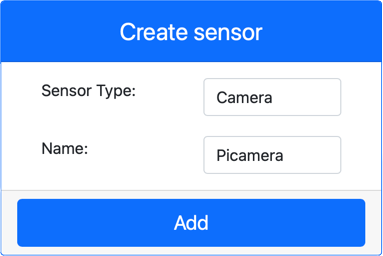

<!--
CO_OP_TRANSLATOR_METADATA:
{
  "original_hash": "3ba7150ffc4a6999f6c3cfb4906ec7df",
  "translation_date": "2025-08-27T23:01:27+00:00",
  "source_file": "4-manufacturing/lessons/2-check-fruit-from-device/virtual-device-camera.md",
  "language_code": "ms"
}
-->
# Tangkap Imej - Perkakasan IoT Maya

Dalam bahagian pelajaran ini, anda akan menambah sensor kamera pada peranti IoT maya anda, dan membaca imej daripadanya.

## Perkakasan

Peranti IoT maya akan menggunakan kamera simulasi yang menghantar sama ada imej daripada fail atau daripada kamera web anda.

### Tambah kamera ke CounterFit

Untuk menggunakan kamera maya, anda perlu menambahkannya ke aplikasi CounterFit.

#### Tugas - tambah kamera ke CounterFit

Tambah Kamera ke aplikasi CounterFit.

1. Cipta aplikasi Python baharu pada komputer anda dalam folder bernama `fruit-quality-detector` dengan satu fail bernama `app.py` dan persekitaran maya Python, serta tambahkan pakej pip CounterFit.

    > ⚠️ Anda boleh merujuk kepada [arahan untuk mencipta dan menyediakan projek Python CounterFit dalam pelajaran 1 jika diperlukan](../../../1-getting-started/lessons/1-introduction-to-iot/virtual-device.md).

1. Pasang pakej Pip tambahan untuk memasang shim CounterFit yang boleh berkomunikasi dengan sensor Kamera dengan mensimulasikan beberapa fungsi daripada [Pakej Pip Picamera](https://pypi.org/project/picamera/). Pastikan anda memasangnya dari terminal dengan persekitaran maya diaktifkan.

    ```sh
    pip install counterfit-shims-picamera
    ```

1. Pastikan aplikasi web CounterFit sedang berjalan.

1. Cipta kamera:

    1. Dalam kotak *Create sensor* di panel *Sensors*, klik menu dropdown *Sensor type* dan pilih *Camera*.

    1. Tetapkan *Name* kepada `Picamera`.

    1. Pilih butang **Add** untuk mencipta kamera.

    

    Kamera akan dicipta dan muncul dalam senarai sensor.

    

## Programkan kamera

Peranti IoT maya kini boleh diprogramkan untuk menggunakan kamera maya.

### Tugas - programkan kamera

Programkan peranti.

1. Pastikan aplikasi `fruit-quality-detector` dibuka dalam VS Code.

1. Buka fail `app.py`.

1. Tambahkan kod berikut di bahagian atas `app.py` untuk menyambungkan aplikasi ke CounterFit:

    ```python
    from counterfit_connection import CounterFitConnection
    CounterFitConnection.init('127.0.0.1', 5000)
    ```

1. Tambahkan kod berikut ke fail `app.py` anda:

    ```python
    import io
    from counterfit_shims_picamera import PiCamera
    ```

    Kod ini mengimport beberapa perpustakaan yang diperlukan, termasuk kelas `PiCamera` daripada perpustakaan counterfit_shims_picamera.

1. Tambahkan kod berikut di bawah ini untuk menginisialisasi kamera:

    ```python
    camera = PiCamera()
    camera.resolution = (640, 480)
    camera.rotation = 0
    ```

    Kod ini mencipta objek PiCamera, menetapkan resolusi kepada 640x480. Walaupun resolusi yang lebih tinggi disokong, pengklasifikasi imej berfungsi pada imej yang jauh lebih kecil (227x227), jadi tidak perlu menangkap dan menghantar imej yang lebih besar.

    Baris `camera.rotation = 0` menetapkan putaran imej dalam darjah. Jika anda perlu memutar imej daripada kamera web atau fail, tetapkan nilai ini seperti yang sesuai. Sebagai contoh, jika anda ingin menukar imej pisang pada kamera web dalam mod landskap kepada mod potret, tetapkan `camera.rotation = 90`.

1. Tambahkan kod berikut di bawah ini untuk menangkap imej sebagai data binari:

    ```python
    image = io.BytesIO()
    camera.capture(image, 'jpeg')
    image.seek(0)
    ```

    Kod ini mencipta objek `BytesIO` untuk menyimpan data binari. Imej dibaca daripada kamera sebagai fail JPEG dan disimpan dalam objek ini. Objek ini mempunyai penunjuk kedudukan untuk mengetahui di mana ia berada dalam data supaya lebih banyak data boleh ditulis di hujung jika diperlukan, jadi baris `image.seek(0)` menggerakkan kedudukan ini kembali ke permulaan supaya semua data boleh dibaca kemudian.

1. Di bawah ini, tambahkan kod berikut untuk menyimpan imej ke fail:

    ```python
    with open('image.jpg', 'wb') as image_file:
        image_file.write(image.read())
    ```

    Kod ini membuka fail bernama `image.jpg` untuk penulisan, kemudian membaca semua data daripada objek `BytesIO` dan menulisnya ke fail.

    > 💁 Anda boleh menangkap imej terus ke fail dan bukannya ke objek `BytesIO` dengan memberikan nama fail kepada panggilan `camera.capture`. Sebab menggunakan objek `BytesIO` adalah supaya kemudian dalam pelajaran ini anda boleh menghantar imej ke pengklasifikasi imej anda.

1. Konfigurasikan imej yang akan ditangkap oleh kamera dalam CounterFit. Anda boleh menetapkan *Source* kepada *File*, kemudian muat naik fail imej, atau tetapkan *Source* kepada *WebCam*, dan imej akan ditangkap daripada kamera web anda. Pastikan anda memilih butang **Set** selepas memilih gambar atau kamera web anda.

    

1. Imej akan ditangkap dan disimpan sebagai `image.jpg` dalam folder semasa. Anda akan melihat fail ini dalam penjelajah VS Code. Pilih fail untuk melihat imej. Jika ia memerlukan putaran, kemas kini baris `camera.rotation = 0` seperti yang diperlukan dan ambil gambar lain.

> 💁 Anda boleh menemui kod ini dalam folder [code-camera/virtual-iot-device](../../../../../4-manufacturing/lessons/2-check-fruit-from-device/code-camera/virtual-iot-device).

😀 Program kamera anda berjaya!

---

**Penafian**:  
Dokumen ini telah diterjemahkan menggunakan perkhidmatan terjemahan AI [Co-op Translator](https://github.com/Azure/co-op-translator). Walaupun kami berusaha untuk memastikan ketepatan, sila ambil perhatian bahawa terjemahan automatik mungkin mengandungi kesilapan atau ketidaktepatan. Dokumen asal dalam bahasa asalnya harus dianggap sebagai sumber yang berwibawa. Untuk maklumat penting, terjemahan manusia profesional adalah disyorkan. Kami tidak bertanggungjawab atas sebarang salah faham atau salah tafsir yang timbul daripada penggunaan terjemahan ini.