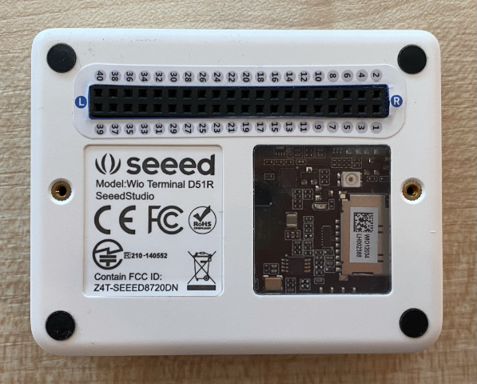

<!--
CO_OP_TRANSLATOR_METADATA:
{
  "original_hash": "160be8c0f558687f6686dca64f10f739",
  "translation_date": "2025-08-27T23:03:21+00:00",
  "source_file": "4-manufacturing/lessons/2-check-fruit-from-device/wio-terminal-camera.md",
  "language_code": "ms"
}
-->
# Tangkap Gambar - Wio Terminal

Dalam bahagian pelajaran ini, anda akan menambah kamera pada Wio Terminal anda dan menangkap gambar daripadanya.

## Perkakasan

Wio Terminal memerlukan kamera.

Kamera yang akan anda gunakan ialah [ArduCam Mini 2MP Plus](https://www.arducam.com/product/arducam-2mp-spi-camera-b0067-arduino/). Ini adalah kamera 2 megapiksel berdasarkan sensor imej OV2640. Ia berkomunikasi melalui antara muka SPI untuk menangkap gambar dan menggunakan I2C untuk mengkonfigurasi sensor.

## Sambungkan kamera

ArduCam tidak mempunyai soket Grove, sebaliknya ia disambungkan ke bas SPI dan I2C melalui pin GPIO pada Wio Terminal.

### Tugas - sambungkan kamera

Sambungkan kamera.


1. Pin di bahagian bawah ArduCam perlu disambungkan ke pin GPIO pada Wio Terminal. Untuk memudahkan mencari pin yang betul, pasangkan pelekat pin GPIO yang disertakan dengan Wio Terminal di sekeliling pin:

    

1. Gunakan wayar jumper untuk membuat sambungan berikut:

    | Pin ArduCAM | Pin Wio Terminal | Penerangan                              |
    | ----------- | ---------------- | --------------------------------------- |
    | CS          | 24 (SPI_CS)      | SPI Chip Select                         |
    | MOSI        | 19 (SPI_MOSI)    | SPI Controller Output, Peripheral Input |
    | MISO        | 21 (SPI_MISO)    | SPI Controller Input, Peripheral Output |
    | SCK         | 23 (SPI_SCLK)    | SPI Serial Clock                        |
    | GND         | 6 (GND)          | Ground - 0V                             |
    | VCC         | 4 (5V)           | Bekalan kuasa 5V                        |
    | SDA         | 3 (I2C1_SDA)     | I2C Serial Data                         |
    | SCL         | 5 (I2C1_SCL)     | I2C Serial Clock                        |

    

    Sambungan GND dan VCC menyediakan bekalan kuasa 5V kepada ArduCam. Ia beroperasi pada 5V, tidak seperti sensor Grove yang beroperasi pada 3V. Kuasa ini datang terus daripada sambungan USB-C yang membekalkan kuasa kepada peranti.

    > 💁 Untuk sambungan SPI, label pin pada ArduCam dan nama pin Wio Terminal yang digunakan dalam kod masih menggunakan konvensyen penamaan lama. Arahan dalam pelajaran ini akan menggunakan konvensyen penamaan baharu, kecuali apabila nama pin digunakan dalam kod.

1. Anda kini boleh menyambungkan Wio Terminal ke komputer anda.

## Programkan peranti untuk menyambung ke kamera

Wio Terminal kini boleh diprogramkan untuk menggunakan kamera ArduCAM yang disambungkan.

### Tugas - programkan peranti untuk menyambung ke kamera

1. Cipta projek Wio Terminal baharu menggunakan PlatformIO. Namakan projek ini `fruit-quality-detector`. Tambahkan kod dalam fungsi `setup` untuk mengkonfigurasi port serial.

1. Tambahkan kod untuk menyambung ke WiFi, dengan kelayakan WiFi anda dalam fail bernama `config.h`. Jangan lupa untuk menambah perpustakaan yang diperlukan ke dalam fail `platformio.ini`.

1. Perpustakaan ArduCam tidak tersedia sebagai perpustakaan Arduino yang boleh dipasang dari fail `platformio.ini`. Sebaliknya, ia perlu dipasang dari sumber di halaman GitHub mereka. Anda boleh mendapatkannya dengan:

    * Mengklon repo dari [https://github.com/ArduCAM/Arduino.git](https://github.com/ArduCAM/Arduino.git)
    * Pergi ke repo di GitHub di [github.com/ArduCAM/Arduino](https://github.com/ArduCAM/Arduino) dan memuat turun kod sebagai zip dari butang **Code**

1. Anda hanya memerlukan folder `ArduCAM` dari kod ini. Salin keseluruhan folder ke dalam folder `lib` dalam projek anda.

    > ⚠️ Seluruh folder mesti disalin, jadi kod berada dalam `lib/ArduCam`. Jangan hanya salin kandungan folder `ArduCam` ke dalam folder `lib`, salin keseluruhan folder.

1. Kod perpustakaan ArduCam berfungsi untuk pelbagai jenis kamera. Jenis kamera yang anda ingin gunakan dikonfigurasi menggunakan bendera pengkompil - ini menjadikan perpustakaan yang dibina sekecil mungkin dengan membuang kod untuk kamera yang tidak anda gunakan. Untuk mengkonfigurasi perpustakaan untuk kamera OV2640, tambahkan yang berikut ke akhir fail `platformio.ini`:

    ```ini
    build_flags =
        -DARDUCAM_SHIELD_V2
        -DOV2640_CAM
    ```

    Ini menetapkan 2 bendera pengkompil:

      * `ARDUCAM_SHIELD_V2` untuk memberitahu perpustakaan bahawa kamera berada pada papan Arduino, dikenali sebagai shield.
      * `OV2640_CAM` untuk memberitahu perpustakaan untuk hanya memasukkan kod untuk kamera OV2640.

1. Tambahkan fail header ke dalam folder `src` bernama `camera.h`. Fail ini akan mengandungi kod untuk berkomunikasi dengan kamera. Tambahkan kod berikut ke dalam fail ini:

    ```cpp
    #pragma once
    
    #include <ArduCAM.h>
    #include <Wire.h>
    
    class Camera
    {
    public:
        Camera(int format, int image_size) : _arducam(OV2640, PIN_SPI_SS)
        {
            _format = format;
            _image_size = image_size;
        }
    
        bool init()
        {
            // Reset the CPLD
            _arducam.write_reg(0x07, 0x80);
            delay(100);
    
            _arducam.write_reg(0x07, 0x00);
            delay(100);
    
            // Check if the ArduCAM SPI bus is OK
            _arducam.write_reg(ARDUCHIP_TEST1, 0x55);
            if (_arducam.read_reg(ARDUCHIP_TEST1) != 0x55)
            {
                return false;
            }
                
            // Change MCU mode
            _arducam.set_mode(MCU2LCD_MODE);
    
            uint8_t vid, pid;
    
            // Check if the camera module type is OV2640
            _arducam.wrSensorReg8_8(0xff, 0x01);
            _arducam.rdSensorReg8_8(OV2640_CHIPID_HIGH, &vid);
            _arducam.rdSensorReg8_8(OV2640_CHIPID_LOW, &pid);
            if ((vid != 0x26) && ((pid != 0x41) || (pid != 0x42)))
            {
                return false;
            }
            
            _arducam.set_format(_format);
            _arducam.InitCAM();
            _arducam.OV2640_set_JPEG_size(_image_size);
            _arducam.OV2640_set_Light_Mode(Auto);
            _arducam.OV2640_set_Special_effects(Normal);
            delay(1000);
    
            return true;
        }
    
        void startCapture()
        {
            _arducam.flush_fifo();
            _arducam.clear_fifo_flag();
            _arducam.start_capture();
        }
    
        bool captureReady()
        {
            return _arducam.get_bit(ARDUCHIP_TRIG, CAP_DONE_MASK);
        }
    
        bool readImageToBuffer(byte **buffer, uint32_t &buffer_length)
        {
            if (!captureReady()) return false;
    
            // Get the image file length
            uint32_t length = _arducam.read_fifo_length();
            buffer_length = length;
    
            if (length >= MAX_FIFO_SIZE)
            {
                return false;
            }
            if (length == 0)
            {
                return false;
            }
    
            // create the buffer
            byte *buf = new byte[length];
    
            uint8_t temp = 0, temp_last = 0;
            int i = 0;
            uint32_t buffer_pos = 0;
            bool is_header = false;
    
            _arducam.CS_LOW();
            _arducam.set_fifo_burst();
            
            while (length--)
            {
                temp_last = temp;
                temp = SPI.transfer(0x00);
                //Read JPEG data from FIFO
                if ((temp == 0xD9) && (temp_last == 0xFF)) //If find the end ,break while,
                {
                    buf[buffer_pos] = temp;
    
                    buffer_pos++;
                    i++;
                    
                    _arducam.CS_HIGH();
                }
                if (is_header == true)
                {
                    //Write image data to buffer if not full
                    if (i < 256)
                    {
                        buf[buffer_pos] = temp;
                        buffer_pos++;
                        i++;
                    }
                    else
                    {
                        _arducam.CS_HIGH();
    
                        i = 0;
                        buf[buffer_pos] = temp;
    
                        buffer_pos++;
                        i++;
    
                        _arducam.CS_LOW();
                        _arducam.set_fifo_burst();
                    }
                }
                else if ((temp == 0xD8) & (temp_last == 0xFF))
                {
                    is_header = true;
    
                    buf[buffer_pos] = temp_last;
                    buffer_pos++;
                    i++;
    
                    buf[buffer_pos] = temp;
                    buffer_pos++;
                    i++;
                }
            }
            
            _arducam.clear_fifo_flag();
    
            _arducam.set_format(_format);
            _arducam.InitCAM();
            _arducam.OV2640_set_JPEG_size(_image_size);
    
            // return the buffer
            *buffer = buf;
        }
    
    private:
        ArduCAM _arducam;
        int _format;
        int _image_size;
    };
    ```

    Ini adalah kod tahap rendah yang mengkonfigurasi kamera menggunakan perpustakaan ArduCam, dan mengekstrak imej apabila diperlukan menggunakan bas SPI. Kod ini sangat khusus untuk ArduCam, jadi anda tidak perlu risau tentang cara ia berfungsi buat masa ini.

1. Dalam `main.cpp`, tambahkan kod berikut di bawah pernyataan `include` lain untuk memasukkan fail baharu ini dan mencipta satu instance kelas kamera:

    ```cpp
    #include "camera.h"

    Camera camera = Camera(JPEG, OV2640_640x480);
    ```

    Ini mencipta `Camera` yang menyimpan imej sebagai JPEG pada resolusi 640 x 480. Walaupun resolusi yang lebih tinggi disokong (sehingga 3280x2464), pengelas imej berfungsi pada imej yang jauh lebih kecil (227x227), jadi tidak perlu menangkap dan menghantar imej yang lebih besar.

1. Tambahkan kod berikut di bawah ini untuk mentakrifkan fungsi untuk menyediakan kamera:

    ```cpp
    void setupCamera()
    {
        pinMode(PIN_SPI_SS, OUTPUT);
        digitalWrite(PIN_SPI_SS, HIGH);
    
        Wire.begin();
        SPI.begin();
    
        if (!camera.init())
        {
            Serial.println("Error setting up the camera!");
        }
    }
    ```

    Fungsi `setupCamera` ini bermula dengan mengkonfigurasi pin SPI chip select (`PIN_SPI_SS`) sebagai tinggi, menjadikan Wio Terminal sebagai pengawal SPI. Ia kemudian memulakan bas I2C dan SPI. Akhirnya, ia memulakan kelas kamera yang mengkonfigurasi tetapan sensor kamera dan memastikan semuanya disambungkan dengan betul.

1. Panggil fungsi ini di akhir fungsi `setup`:

    ```cpp
    setupCamera();
    ```

1. Bina dan muat naik kod ini, dan periksa output dari monitor serial. Jika anda melihat `Error setting up the camera!`, periksa pendawaian untuk memastikan semua kabel menyambungkan pin yang betul pada ArduCam ke pin GPIO yang betul pada Wio Terminal, dan semua kabel jumper dipasang dengan betul.

## Tangkap gambar

Wio Terminal kini boleh diprogramkan untuk menangkap gambar apabila butang ditekan.

### Tugas - tangkap gambar

1. Mikropengawal menjalankan kod anda secara berterusan, jadi tidak mudah untuk mencetuskan sesuatu seperti mengambil gambar tanpa bertindak balas kepada sensor. Wio Terminal mempunyai butang, jadi kamera boleh disediakan untuk dicetuskan oleh salah satu butang. Tambahkan kod berikut ke akhir fungsi `setup` untuk mengkonfigurasi butang C (salah satu daripada tiga butang di atas, yang paling dekat dengan suis kuasa).

    

    ```cpp
    pinMode(WIO_KEY_C, INPUT_PULLUP);
    ```

    Mod `INPUT_PULLUP` pada dasarnya membalikkan input. Sebagai contoh, biasanya butang akan menghantar isyarat rendah apabila tidak ditekan, dan isyarat tinggi apabila ditekan. Apabila ditetapkan kepada `INPUT_PULLUP`, ia menghantar isyarat tinggi apabila tidak ditekan, dan isyarat rendah apabila ditekan.

1. Tambahkan fungsi kosong untuk bertindak balas kepada penekanan butang sebelum fungsi `loop`:

    ```cpp
    void buttonPressed()
    {
        
    }
    ```

1. Panggil fungsi ini dalam kaedah `loop` apabila butang ditekan:

    ```cpp
    void loop()
    {
        if (digitalRead(WIO_KEY_C) == LOW)
        {
            buttonPressed();
            delay(2000);
        }
    
        delay(200);
    }
    ```

    Kod ini memeriksa sama ada butang ditekan. Jika ia ditekan, fungsi `buttonPressed` dipanggil, dan gelung menunggu selama 2 saat. Ini untuk memberi masa kepada butang untuk dilepaskan supaya penekanan panjang tidak didaftarkan dua kali.

    > 💁 Butang pada Wio Terminal ditetapkan kepada `INPUT_PULLUP`, jadi ia menghantar isyarat tinggi apabila tidak ditekan, dan isyarat rendah apabila ditekan.

1. Tambahkan kod berikut ke fungsi `buttonPressed`:

    ```cpp
    camera.startCapture();
 
    while (!camera.captureReady())
        delay(100);

    Serial.println("Image captured");

    byte *buffer;
    uint32_t length;

    if (camera.readImageToBuffer(&buffer, length))
    {
        Serial.print("Image read to buffer with length ");
        Serial.println(length);

        delete(buffer);
    }
    ```

    Kod ini memulakan tangkapan kamera dengan memanggil `startCapture`. Perkakasan kamera tidak berfungsi dengan mengembalikan data apabila anda memintanya, sebaliknya anda menghantar arahan untuk memulakan tangkapan, dan kamera akan bekerja di latar belakang untuk menangkap imej, menukarnya kepada JPEG, dan menyimpannya dalam penimbal tempatan pada kamera itu sendiri. Panggilan `captureReady` kemudian memeriksa sama ada tangkapan imej telah selesai.

    Setelah tangkapan selesai, data imej disalin dari penimbal pada kamera ke dalam penimbal tempatan (array byte) dengan panggilan `readImageToBuffer`. Panjang penimbal kemudian dihantar ke monitor serial.

1. Bina dan muat naik kod ini, dan periksa output pada monitor serial. Setiap kali anda menekan butang C, imej akan ditangkap dan anda akan melihat saiz imej dihantar ke monitor serial.

    ```output
    Connecting to WiFi..
    Connected!
    Image captured
    Image read to buffer with length 9224
    Image captured
    Image read to buffer with length 11272
    ```

    Imej yang berbeza akan mempunyai saiz yang berbeza. Ia dimampatkan sebagai JPEG dan saiz fail JPEG untuk resolusi tertentu bergantung pada apa yang ada dalam imej.

> 💁 Anda boleh menemui kod ini dalam folder [code-camera/wio-terminal](../../../../../4-manufacturing/lessons/2-check-fruit-from-device/code-camera/wio-terminal).

😀 Anda telah berjaya menangkap imej dengan Wio Terminal anda.

## Pilihan - sahkan imej kamera menggunakan kad SD

Cara paling mudah untuk melihat imej yang ditangkap oleh kamera adalah dengan menulisnya ke kad SD dalam Wio Terminal dan kemudian melihatnya di komputer anda. Lakukan langkah ini jika anda mempunyai kad microSD ganti dan soket kad microSD di komputer anda, atau penyesuai.

Wio Terminal hanya menyokong kad microSD sehingga 16GB. Jika anda mempunyai kad SD yang lebih besar, ia tidak akan berfungsi.

### Tugas - sahkan imej kamera menggunakan kad SD

1. Format kad microSD sebagai FAT32 atau exFAT menggunakan aplikasi yang relevan di komputer anda (Disk Utility pada macOS, File Explorer pada Windows, atau menggunakan alat baris perintah di Linux).

1. Masukkan kad microSD ke dalam soket tepat di bawah suis kuasa. Pastikan ia dimasukkan sepenuhnya sehingga klik dan kekal di tempatnya, anda mungkin perlu menolaknya menggunakan kuku atau alat nipis.

1. Tambahkan pernyataan include berikut di bahagian atas fail `main.cpp`:

    ```cpp
    #include "SD/Seeed_SD.h"
    #include <Seeed_FS.h>
    ```

1. Tambahkan fungsi berikut sebelum fungsi `setup`:

    ```cpp
    void setupSDCard()
    {
        while (!SD.begin(SDCARD_SS_PIN, SDCARD_SPI))
        {
            Serial.println("SD Card Error");
        }
    }
    ```

    Ini mengkonfigurasi kad SD menggunakan bas SPI.

1. Panggil ini dari fungsi `setup`:

    ```cpp
    setupSDCard();
    ```

1. Tambahkan kod berikut di atas fungsi `buttonPressed`:

    ```cpp
    int fileNum = 1;

    void saveToSDCard(byte *buffer, uint32_t length)
    {
        char buff[16];
        sprintf(buff, "%d.jpg", fileNum);
        fileNum++;
    
        File outFile = SD.open(buff, FILE_WRITE );
        outFile.write(buffer, length);
        outFile.close();

        Serial.print("Image written to file ");
        Serial.println(buff);
    }
    ```

    Ini mentakrifkan pembolehubah global untuk kiraan fail. Ini digunakan untuk nama fail imej supaya pelbagai imej boleh ditangkap dengan nama fail yang meningkat - `1.jpg`, `2.jpg` dan sebagainya.

    Ia kemudian mentakrifkan fungsi `saveToSDCard` yang mengambil penimbal data byte dan panjang penimbal. Nama fail dicipta menggunakan kiraan fail, dan kiraan fail ditingkatkan sedia untuk fail seterusnya. Data binari dari penimbal kemudian ditulis ke fail.

1. Panggil fungsi `saveToSDCard` dari fungsi `buttonPressed`. Panggilan ini harus **sebelum** penimbal dipadamkan:

    ```cpp
    Serial.print("Image read to buffer with length ");
    Serial.println(length);

    saveToSDCard(buffer, length);
    
    delete(buffer);
    ```

1. Bina dan muat naik kod ini, dan periksa output pada monitor serial. Setiap kali anda menekan butang C, imej akan ditangkap dan disimpan ke kad SD.

    ```output
    Connecting to WiFi..
    Connected!
    Image captured
    Image read to buffer with length 16392
    Image written to file 1.jpg
    Image captured
    Image read to buffer with length 14344
    Image written to file 2.jpg
    ```

1. Matikan kuasa pada kad microSD dan keluarkan dengan menolaknya sedikit ke dalam dan melepaskannya, dan ia akan keluar. Anda mungkin perlu menggunakan alat nipis untuk melakukannya. Sambungkan kad microSD ke komputer anda untuk melihat imej.

    
💁 Mungkin mengambil beberapa imej untuk keseimbangan putih kamera menyesuaikan dirinya. Anda akan perasan ini berdasarkan warna imej yang diambil, beberapa yang pertama mungkin kelihatan tidak sepadan warna. Anda sentiasa boleh mengatasi ini dengan menukar kod untuk mengambil beberapa imej yang diabaikan dalam fungsi `setup`.


---

**Penafian**:  
Dokumen ini telah diterjemahkan menggunakan perkhidmatan terjemahan AI [Co-op Translator](https://github.com/Azure/co-op-translator). Walaupun kami berusaha untuk memastikan ketepatan, sila ambil perhatian bahawa terjemahan automatik mungkin mengandungi kesilapan atau ketidaktepatan. Dokumen asal dalam bahasa asalnya harus dianggap sebagai sumber yang berwibawa. Untuk maklumat yang kritikal, terjemahan manusia profesional adalah disyorkan. Kami tidak bertanggungjawab atas sebarang salah faham atau salah tafsir yang timbul daripada penggunaan terjemahan ini.