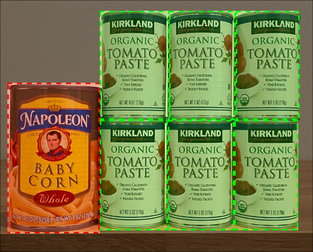

<!--
CO_OP_TRANSLATOR_METADATA:
{
  "original_hash": "1c9e5fa8b7be726c75a97232b1e41c97",
  "translation_date": "2025-08-27T20:41:38+00:00",
  "source_file": "5-retail/lessons/2-check-stock-device/README.md",
  "language_code": "ms"
}
-->
# Periksa stok menggunakan peranti IoT


> Sketchnote oleh [Nitya Narasimhan](https://github.com/nitya). Klik gambar untuk versi yang lebih besar.

## Kuiz sebelum kuliah

[Kuiz sebelum kuliah](https://black-meadow-040d15503.1.azurestaticapps.net/quiz/39)

## Pengenalan

Dalam pelajaran sebelum ini, anda telah mempelajari pelbagai kegunaan pengesanan objek dalam runcit. Anda juga telah belajar cara melatih pengesan objek untuk mengenal pasti stok. Dalam pelajaran ini, anda akan belajar cara menggunakan pengesan objek anda daripada peranti IoT untuk mengira stok.

Dalam pelajaran ini, kita akan membincangkan:

* [Pengiraan stok](../../../../../5-retail/lessons/2-check-stock-device)
* [Memanggil pengesan objek anda daripada peranti IoT](../../../../../5-retail/lessons/2-check-stock-device)
* [Kotak sempadan](../../../../../5-retail/lessons/2-check-stock-device)
* [Melatih semula model](../../../../../5-retail/lessons/2-check-stock-device)
* [Mengira stok](../../../../../5-retail/lessons/2-check-stock-device)

> 🗑 Ini adalah pelajaran terakhir dalam projek ini, jadi selepas menyelesaikan pelajaran ini dan tugasan, jangan lupa untuk membersihkan perkhidmatan awan anda. Anda akan memerlukan perkhidmatan tersebut untuk menyelesaikan tugasan, jadi pastikan anda menyelesaikannya terlebih dahulu.
>
> Rujuk [panduan membersihkan projek anda](../../../clean-up.md) jika perlu untuk arahan tentang cara melakukannya.

## Pengiraan stok

Pengesan objek boleh digunakan untuk memeriksa stok, sama ada mengira stok atau memastikan stok berada di tempat yang sepatutnya. Peranti IoT dengan kamera boleh diletakkan di seluruh kedai untuk memantau stok, bermula dengan kawasan panas di mana pengisian semula barang adalah penting, seperti kawasan yang menyimpan barang bernilai tinggi dalam jumlah kecil.

Sebagai contoh, jika kamera menghala ke rak yang boleh memuatkan 8 tin pes tomato, dan pengesan objek hanya mengesan 7 tin, maka satu tin hilang dan perlu diisi semula.


Dalam gambar di atas, pengesan objek telah mengesan 7 tin pes tomato di rak yang boleh memuatkan 8 tin. Bukan sahaja peranti IoT boleh menghantar pemberitahuan tentang keperluan untuk mengisi semula, tetapi ia juga boleh memberikan petunjuk tentang lokasi barang yang hilang, data penting jika anda menggunakan robot untuk mengisi semula rak.

> 💁 Bergantung pada kedai dan populariti barang, pengisian semula mungkin tidak dilakukan jika hanya satu tin yang hilang. Anda perlu membina algoritma yang menentukan bila untuk mengisi semula berdasarkan produk, pelanggan, dan kriteria lain.

✅ Dalam senario lain, bagaimana anda boleh menggabungkan pengesanan objek dan robot?

Kadang-kadang stok yang salah boleh berada di rak. Ini mungkin disebabkan oleh kesilapan manusia semasa mengisi semula, atau pelanggan yang berubah fikiran tentang pembelian dan meletakkan barang di ruang pertama yang tersedia. Apabila ini melibatkan barang tidak mudah rosak seperti barang dalam tin, ini adalah satu gangguan. Jika ia melibatkan barang mudah rosak seperti barang beku atau sejuk, ini boleh menyebabkan produk tidak lagi boleh dijual kerana mungkin mustahil untuk mengetahui berapa lama barang itu berada di luar peti sejuk.

Pengesanan objek boleh digunakan untuk mengesan barang yang tidak dijangka, sekali lagi memberi amaran kepada manusia atau robot untuk mengembalikan barang tersebut sebaik sahaja ia dikesan.



Dalam gambar di atas, satu tin jagung bayi telah diletakkan di rak sebelah pes tomato. Pengesan objek telah mengesan ini, membolehkan peranti IoT memberitahu manusia atau robot untuk mengembalikan tin tersebut ke lokasi yang betul.

## Memanggil pengesan objek anda daripada peranti IoT

Pengesan objek yang anda latih dalam pelajaran sebelum ini boleh dipanggil daripada peranti IoT anda.

### Tugasan - menerbitkan iterasi pengesan objek anda

Iterasi diterbitkan daripada portal Custom Vision.

1. Lancarkan portal Custom Vision di [CustomVision.ai](https://customvision.ai) dan log masuk jika anda belum membukanya. Kemudian buka projek `stock-detector` anda.

1. Pilih tab **Performance** daripada pilihan di bahagian atas.

1. Pilih iterasi terkini daripada senarai *Iterations* di sisi.

1. Pilih butang **Publish** untuk iterasi tersebut.

    

1. Dalam dialog *Publish Model*, tetapkan *Prediction resource* kepada sumber `stock-detector-prediction` yang anda buat dalam pelajaran sebelum ini. Biarkan nama sebagai `Iteration2`, dan pilih butang **Publish**.

1. Setelah diterbitkan, pilih butang **Prediction URL**. Ini akan menunjukkan butiran API ramalan, dan anda akan memerlukan ini untuk memanggil model daripada peranti IoT anda. Bahagian bawah dilabelkan *If you have an image file*, dan ini adalah butiran yang anda perlukan. Salin URL yang ditunjukkan, yang akan kelihatan seperti:

    ```output
    https://<location>.api.cognitive.microsoft.com/customvision/v3.0/Prediction/<id>/detect/iterations/Iteration2/image
    ```

    Di mana `<location>` adalah lokasi yang anda gunakan semasa membuat sumber Custom Vision anda, dan `<id>` adalah ID panjang yang terdiri daripada huruf dan nombor.

    Juga salin nilai *Prediction-Key*. Ini adalah kunci selamat yang perlu anda sertakan semasa memanggil model. Hanya aplikasi yang menyertakan kunci ini dibenarkan menggunakan model, aplikasi lain akan ditolak.

    

✅ Apabila iterasi baru diterbitkan, ia akan mempunyai nama yang berbeza. Bagaimana anda fikir anda akan menukar iterasi yang digunakan oleh peranti IoT?

### Tugasan - memanggil pengesan objek anda daripada peranti IoT

Ikuti panduan yang berkaitan di bawah untuk menggunakan pengesan objek daripada peranti IoT anda:

* [Arduino - Wio Terminal](wio-terminal-object-detector.md)
* [Komputer papan tunggal - Raspberry Pi/Peranti maya](single-board-computer-object-detector.md)

## Kotak sempadan

Apabila anda menggunakan pengesan objek, anda bukan sahaja mendapat kembali objek yang dikesan dengan tag dan kebarangkalian mereka, tetapi anda juga mendapat kotak sempadan objek tersebut. Kotak ini menentukan di mana pengesan objek mengesan objek dengan kebarangkalian tertentu.

> 💁 Kotak sempadan adalah kotak yang menentukan kawasan yang mengandungi objek yang dikesan, kotak yang menentukan sempadan untuk objek tersebut.

Hasil ramalan dalam tab **Predictions** di Custom Vision mempunyai kotak sempadan yang dilukis pada imej yang dihantar untuk ramalan.


Dalam gambar di atas, 4 tin pes tomato telah dikesan. Dalam hasilnya, kotak merah dilapisi untuk setiap objek yang dikesan dalam imej, menunjukkan kotak sempadan untuk imej tersebut.

✅ Buka ramalan dalam Custom Vision dan periksa kotak sempadan.

Kotak sempadan ditentukan dengan 4 nilai - atas, kiri, tinggi, dan lebar. Nilai-nilai ini berada pada skala 0-1, mewakili kedudukan sebagai peratusan daripada saiz imej. Asal (kedudukan 0,0) adalah bahagian atas kiri imej, jadi nilai atas adalah jarak dari atas, dan bahagian bawah kotak sempadan adalah atas ditambah tinggi.


Imej di atas adalah 600 piksel lebar dan 800 piksel tinggi. Kotak sempadan bermula pada 320 piksel ke bawah, memberikan koordinat atas 0.4 (800 x 0.4 = 320). Dari kiri, kotak sempadan bermula pada 240 piksel ke tepi, memberikan koordinat kiri 0.4 (600 x 0.4 = 240). Tinggi kotak sempadan adalah 240 piksel, memberikan nilai tinggi 0.3 (800 x 0.3 = 240). Lebar kotak sempadan adalah 120 piksel, memberikan nilai lebar 0.2 (600 x 0.2 = 120).

| Koordinat | Nilai |
| ---------- | ----: |
| Atas       | 0.4   |
| Kiri       | 0.4   |
| Tinggi     | 0.3   |
| Lebar      | 0.2   |

Menggunakan nilai peratusan dari 0-1 bermaksud tidak kira saiz imej, kotak sempadan bermula 0.4 dari atas dan ke tepi, dan mempunyai tinggi 0.3 dan lebar 0.2.

Anda boleh menggunakan kotak sempadan bersama kebarangkalian untuk menilai sejauh mana ketepatan pengesanan. Sebagai contoh, pengesan objek boleh mengesan beberapa objek yang bertindih, contohnya mengesan satu tin di dalam tin lain. Kod anda boleh melihat kotak sempadan, memahami bahawa ini mustahil, dan mengabaikan mana-mana objek yang mempunyai pertindihan ketara dengan objek lain.


Dalam contoh di atas, satu kotak sempadan menunjukkan satu tin pes tomato dengan kebarangkalian 78.3%. Kotak sempadan kedua sedikit lebih kecil, dan berada di dalam kotak sempadan pertama dengan kebarangkalian 64.3%. Kod anda boleh memeriksa kotak sempadan, melihat bahawa ia bertindih sepenuhnya, dan mengabaikan kebarangkalian yang lebih rendah kerana tidak mungkin satu tin berada di dalam tin lain.

✅ Bolehkah anda memikirkan situasi di mana sah untuk mengesan satu objek di dalam objek lain?

## Melatih semula model

Seperti dengan pengelas imej, anda boleh melatih semula model anda menggunakan data yang ditangkap oleh peranti IoT anda. Menggunakan data dunia sebenar ini akan memastikan model anda berfungsi dengan baik apabila digunakan daripada peranti IoT anda.

Tidak seperti pengelas imej, anda tidak boleh hanya menandai imej. Sebaliknya, anda perlu menyemak setiap kotak sempadan yang dikesan oleh model. Jika kotak berada di sekitar perkara yang salah, ia perlu dipadamkan; jika ia berada di lokasi yang salah, ia perlu disesuaikan.

### Tugasan - melatih semula model

1. Pastikan anda telah menangkap pelbagai imej menggunakan peranti IoT anda.

1. Dari tab **Predictions**, pilih satu imej. Anda akan melihat kotak merah yang menunjukkan kotak sempadan objek yang dikesan.

1. Kerjakan setiap kotak sempadan. Pilih kotak terlebih dahulu, dan anda akan melihat pop-up yang menunjukkan tag. Gunakan pemegang di sudut kotak sempadan untuk menyesuaikan saiz jika perlu. Jika tag salah, keluarkan dengan butang **X** dan tambahkan tag yang betul. Jika kotak sempadan tidak mengandungi objek, padamkan dengan butang tong sampah.

1. Tutup editor apabila selesai, dan imej akan berpindah dari tab **Predictions** ke tab **Training Images**. Ulangi proses untuk semua ramalan.

1. Gunakan butang **Train** untuk melatih semula model anda. Setelah ia dilatih, terbitkan iterasi dan kemas kini peranti IoT anda untuk menggunakan URL iterasi baru.

1. Susun semula kod anda dan uji peranti IoT anda.

## Mengira stok

Menggunakan gabungan bilangan objek yang dikesan dan kotak sempadan, anda boleh mengira stok di rak.

### Tugasan - mengira stok

Ikuti panduan yang berkaitan di bawah untuk mengira stok menggunakan hasil daripada pengesan objek daripada peranti IoT anda:

* [Arduino - Wio Terminal](wio-terminal-count-stock.md)
* [Komputer papan tunggal - Raspberry Pi/Peranti maya](single-board-computer-count-stock.md)

---

## 🚀 Cabaran

Bolehkah anda mengesan stok yang salah? Latih model anda pada pelbagai objek, kemudian kemas kini aplikasi anda untuk memberi amaran jika stok yang salah dikesan.

Mungkin juga bawa ini lebih jauh dan kesan stok yang diletakkan bersebelahan di rak yang sama, dan lihat jika sesuatu telah diletakkan di tempat yang salah dengan menentukan had pada kotak sempadan.

## Kuiz selepas kuliah

[Kuiz selepas kuliah](https://black-meadow-040d15503.1.azurestaticapps.net/quiz/40)

## Ulasan & Kajian Kendiri

* Ketahui lebih lanjut tentang cara merangka sistem pengesanan stok hujung ke hujung daripada [panduan corak pengesanan kehabisan stok di tepi pada Microsoft Docs](https://docs.microsoft.com/hybrid/app-solutions/pattern-out-of-stock-at-edge?WT.mc_id=academic-17441-jabenn)
* Ketahui cara lain untuk membina penyelesaian runcit hujung ke hujung yang menggabungkan pelbagai perkhidmatan IoT dan awan dengan menonton [video Hands On! di YouTube](https://www.youtube.com/watch?v=m3Pc300x2Mw).

## Tugasan

[Gunakan pengesan objek anda di tepi](assignment.md)

---

**Penafian**:  
Dokumen ini telah diterjemahkan menggunakan perkhidmatan terjemahan AI [Co-op Translator](https://github.com/Azure/co-op-translator). Walaupun kami berusaha untuk memastikan ketepatan, sila ambil perhatian bahawa terjemahan automatik mungkin mengandungi kesilapan atau ketidaktepatan. Dokumen asal dalam bahasa asalnya harus dianggap sebagai sumber yang berwibawa. Untuk maklumat yang kritikal, terjemahan manusia profesional adalah disyorkan. Kami tidak bertanggungjawab atas sebarang salah faham atau salah tafsir yang timbul daripada penggunaan terjemahan ini.