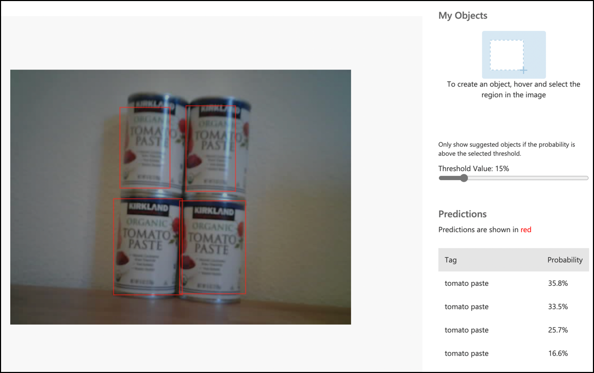

<!--
CO_OP_TRANSLATOR_METADATA:
{
  "original_hash": "4cf1421420a6fab9ab4f2c391bd523b7",
  "translation_date": "2025-08-27T20:46:20+00:00",
  "source_file": "5-retail/lessons/2-check-stock-device/wio-terminal-object-detector.md",
  "language_code": "ms"
}
-->
# Panggil pengesan objek anda dari peranti IoT - Wio Terminal

Setelah pengesan objek anda diterbitkan, ia boleh digunakan dari peranti IoT anda.

## Salin projek pengelas imej

Sebahagian besar daripada pengesan stok anda adalah sama seperti pengelas imej yang anda cipta dalam pelajaran sebelumnya.

### Tugasan - salin projek pengelas imej

1. Sambungkan ArduCam anda ke Wio Terminal, mengikut langkah-langkah dari [pelajaran 2 projek pembuatan](../../../4-manufacturing/lessons/2-check-fruit-from-device/wio-terminal-camera.md#task---connect-the-camera).

    Anda juga mungkin ingin menetapkan kamera dalam satu kedudukan tetap, contohnya, dengan menggantung kabel di atas kotak atau tin, atau melekatkan kamera ke kotak menggunakan pita dua muka.

1. Cipta projek Wio Terminal baru menggunakan PlatformIO. Namakan projek ini `stock-counter`.

1. Ulangi langkah-langkah dari [pelajaran 2 projek pembuatan](../../../4-manufacturing/lessons/2-check-fruit-from-device/README.md#task---capture-an-image-using-an-iot-device) untuk menangkap imej dari kamera.

1. Ulangi langkah-langkah dari [pelajaran 2 projek pembuatan](../../../4-manufacturing/lessons/2-check-fruit-from-device/README.md#task---classify-images-from-your-iot-device) untuk memanggil pengelas imej. Sebahagian besar kod ini akan digunakan semula untuk mengesan objek.

## Tukar kod daripada pengelas kepada pengesan imej

Kod yang anda gunakan untuk mengelas imej sangat mirip dengan kod untuk mengesan objek. Perbezaan utama adalah URL yang dipanggil yang anda peroleh daripada Custom Vision, dan hasil panggilan tersebut.

### Tugasan - tukar kod daripada pengelas kepada pengesan imej

1. Tambahkan arahan include berikut di bahagian atas fail `main.cpp`:

    ```cpp
    #include <vector>
    ```

1. Tukar nama fungsi `classifyImage` kepada `detectStock`, termasuk nama fungsi dan panggilan dalam fungsi `buttonPressed`.

1. Di atas fungsi `detectStock`, isytiharkan ambang (threshold) untuk menapis sebarang pengesanan yang mempunyai kebarangkalian rendah:

    ```cpp
    const float threshold = 0.3f;
    ```

    Tidak seperti pengelas imej yang hanya mengembalikan satu hasil bagi setiap tag, pengesan objek akan mengembalikan pelbagai hasil, jadi mana-mana dengan kebarangkalian rendah perlu ditapis.

1. Di atas fungsi `detectStock`, isytiharkan fungsi untuk memproses ramalan:

    ```cpp
    void processPredictions(std::vector<JsonVariant> &predictions)
    {
        for(JsonVariant prediction : predictions)
        {
            String tag = prediction["tagName"].as<String>();
            float probability = prediction["probability"].as<float>();
    
            char buff[32];
            sprintf(buff, "%s:\t%.2f%%", tag.c_str(), probability * 100.0);
            Serial.println(buff);
        }
    }
    ```

    Fungsi ini mengambil senarai ramalan dan mencetaknya ke monitor bersiri.

1. Dalam fungsi `detectStock`, gantikan kandungan gelung `for` yang mengulang ramalan dengan yang berikut:

    ```cpp
    std::vector<JsonVariant> passed_predictions;

    for(JsonVariant prediction : predictions) 
    {
        float probability = prediction["probability"].as<float>();
        if (probability > threshold)
        {
            passed_predictions.push_back(prediction);
        }
    }

    processPredictions(passed_predictions);
    ```

    Gelung ini mengulang ramalan, membandingkan kebarangkalian dengan ambang. Semua ramalan yang mempunyai kebarangkalian lebih tinggi daripada ambang ditambahkan ke dalam `list` dan dihantar ke fungsi `processPredictions`.

1. Muat naik dan jalankan kod anda. Arahkan kamera ke objek di rak dan tekan butang C. Anda akan melihat output di monitor bersiri:

    ```output
    Connecting to WiFi..
    Connected!
    Image captured
    Image read to buffer with length 17416
    tomato paste:   35.84%
    tomato paste:   35.87%
    tomato paste:   34.11%
    tomato paste:   35.16%
    ```

    > 💁 Anda mungkin perlu melaraskan `threshold` kepada nilai yang sesuai untuk imej anda.

    Anda akan dapat melihat imej yang diambil, dan nilai-nilai ini dalam tab **Predictions** di Custom Vision.

    

> 💁 Anda boleh menemui kod ini dalam folder [code-detect/wio-terminal](../../../../../5-retail/lessons/2-check-stock-device/code-detect/wio-terminal).

😀 Program pengesan stok anda berjaya!

---

**Penafian**:  
Dokumen ini telah diterjemahkan menggunakan perkhidmatan terjemahan AI [Co-op Translator](https://github.com/Azure/co-op-translator). Walaupun kami berusaha untuk memastikan ketepatan, sila ambil perhatian bahawa terjemahan automatik mungkin mengandungi kesilapan atau ketidaktepatan. Dokumen asal dalam bahasa asalnya harus dianggap sebagai sumber yang berwibawa. Untuk maklumat yang kritikal, terjemahan manusia profesional adalah disyorkan. Kami tidak bertanggungjawab atas sebarang salah faham atau salah tafsir yang timbul daripada penggunaan terjemahan ini.