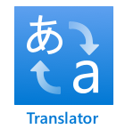

<!--
CO_OP_TRANSLATOR_METADATA:
{
  "original_hash": "c16de27b0074abe81d6a8bad5e5b1a6b",
  "translation_date": "2025-08-27T22:58:25+00:00",
  "source_file": "6-consumer/lessons/4-multiple-language-support/README.md",
  "language_code": "ms"
}
-->
# Sokongan Pelbagai Bahasa


> Sketchnote oleh [Nitya Narasimhan](https://github.com/nitya). Klik imej untuk versi yang lebih besar.

Video ini memberikan gambaran keseluruhan tentang perkhidmatan ucapan Azure, meliputi ucapan ke teks dan teks ke ucapan dari pelajaran sebelumnya, serta menterjemah ucapan, topik yang dibincangkan dalam pelajaran ini:

[](https://www.youtube.com/watch?v=h6xbpMPSGEA)

> 🎥 Klik imej di atas untuk menonton video

## Kuiz Pra-Pelajaran

[Kuiz Pra-Pelajaran](https://black-meadow-040d15503.1.azurestaticapps.net/quiz/47)

## Pengenalan

Dalam 3 pelajaran terakhir, anda telah mempelajari tentang menukar ucapan ke teks, memahami bahasa, dan menukar teks ke ucapan, semuanya dikuasakan oleh AI. Satu lagi aspek komunikasi manusia yang boleh dibantu oleh AI ialah terjemahan bahasa - menukar dari satu bahasa ke bahasa lain, seperti dari Bahasa Inggeris ke Bahasa Perancis.

Dalam pelajaran ini, anda akan mempelajari cara menggunakan AI untuk menterjemah teks, membolehkan pemasa pintar anda berinteraksi dengan pengguna dalam pelbagai bahasa.

Dalam pelajaran ini, kita akan membincangkan:

* [Menterjemah teks](../../../../../6-consumer/lessons/4-multiple-language-support)
* [Perkhidmatan terjemahan](../../../../../6-consumer/lessons/4-multiple-language-support)
* [Mencipta sumber penterjemah](../../../../../6-consumer/lessons/4-multiple-language-support)
* [Menyokong pelbagai bahasa dalam aplikasi dengan terjemahan](../../../../../6-consumer/lessons/4-multiple-language-support)
* [Menterjemah teks menggunakan perkhidmatan AI](../../../../../6-consumer/lessons/4-multiple-language-support)

> 🗑 Ini adalah pelajaran terakhir dalam projek ini, jadi selepas menyelesaikan pelajaran ini dan tugasan, jangan lupa untuk membersihkan perkhidmatan awan anda. Anda akan memerlukan perkhidmatan tersebut untuk menyelesaikan tugasan, jadi pastikan untuk menyelesaikannya terlebih dahulu.
>
> Rujuk [panduan membersihkan projek anda](../../../clean-up.md) jika perlu untuk arahan tentang cara melakukannya.

## Menterjemah teks

Terjemahan teks telah menjadi masalah sains komputer yang telah dikaji selama lebih 70 tahun, dan hanya sekarang, berkat kemajuan dalam AI dan kuasa komputer, hampir dapat diselesaikan sehingga hampir setanding dengan penterjemah manusia.

> 💁 Asal-usulnya boleh dikesan lebih jauh lagi, kepada [Al-Kindi](https://wikipedia.org/wiki/Al-Kindi), seorang kriptografer Arab abad ke-9 yang membangunkan teknik untuk terjemahan bahasa.

### Terjemahan Mesin

Terjemahan teks bermula sebagai teknologi yang dikenali sebagai Terjemahan Mesin (MT), yang boleh menterjemah antara pasangan bahasa yang berbeza. MT berfungsi dengan menggantikan perkataan dalam satu bahasa dengan bahasa lain, menambah teknik untuk memilih cara yang betul untuk menterjemah frasa atau bahagian ayat apabila terjemahan perkataan demi perkataan tidak masuk akal.

> 🎓 Apabila penterjemah menyokong terjemahan antara satu bahasa dan bahasa lain, ini dikenali sebagai *pasangan bahasa*. Alat yang berbeza menyokong pasangan bahasa yang berbeza, dan ini mungkin tidak lengkap. Sebagai contoh, penterjemah mungkin menyokong Bahasa Inggeris ke Bahasa Sepanyol sebagai pasangan bahasa, dan Bahasa Sepanyol ke Bahasa Itali sebagai pasangan bahasa, tetapi tidak Bahasa Inggeris ke Bahasa Itali.

Sebagai contoh, menterjemah "Hello world" dari Bahasa Inggeris ke Bahasa Perancis boleh dilakukan dengan penggantian - "Bonjour" untuk "Hello", dan "le monde" untuk "world", menghasilkan terjemahan yang betul "Bonjour le monde".

Penggantian tidak berfungsi apabila bahasa yang berbeza menggunakan cara yang berbeza untuk mengatakan perkara yang sama. Sebagai contoh, ayat Bahasa Inggeris "My name is Jim", diterjemahkan ke dalam Bahasa Perancis menjadi "Je m'appelle Jim" - secara literal "Saya memanggil diri saya Jim". "Je" adalah Bahasa Perancis untuk "Saya", "moi" adalah saya, tetapi digabungkan dengan kata kerja kerana ia bermula dengan vokal, jadi menjadi "m'", "appelle" adalah memanggil, dan "Jim" tidak diterjemahkan kerana ia adalah nama, dan bukan perkataan yang boleh diterjemahkan. Susunan perkataan juga menjadi isu - penggantian mudah "Je m'appelle Jim" menjadi "I myself call Jim", dengan susunan perkataan yang berbeza daripada Bahasa Inggeris.

> 💁 Sesetengah perkataan tidak pernah diterjemahkan - nama saya tetap Jim tidak kira bahasa mana yang digunakan untuk memperkenalkan saya. Apabila menterjemah ke bahasa yang menggunakan abjad yang berbeza, atau menggunakan huruf yang berbeza untuk bunyi yang berbeza, maka perkataan boleh *ditransliterasi*, iaitu memilih huruf atau aksara yang memberikan bunyi yang sesuai untuk berbunyi sama seperti perkataan yang diberikan.

Idiom juga menjadi masalah untuk terjemahan. Ini adalah frasa yang mempunyai makna yang difahami yang berbeza daripada tafsiran langsung perkataan. Sebagai contoh, dalam Bahasa Inggeris idiom "I've got ants in my pants" tidak merujuk secara literal kepada semut dalam pakaian anda, tetapi kepada rasa gelisah. Jika anda menterjemahkannya ke Bahasa Jerman, anda akan mengelirukan pendengar, kerana versi Bahasa Jerman ialah "I have bumble bees in the bottom".

> 💁 Tempat yang berbeza menambah kerumitan yang berbeza. Dengan idiom "ants in your pants", dalam Bahasa Inggeris Amerika "pants" merujuk kepada pakaian luar, dalam Bahasa Inggeris British, "pants" adalah pakaian dalam.

✅ Jika anda bercakap pelbagai bahasa, fikirkan beberapa frasa yang tidak diterjemahkan secara langsung.

Sistem terjemahan mesin bergantung pada pangkalan data besar peraturan yang menerangkan cara menterjemah frasa dan idiom tertentu, bersama dengan kaedah statistik untuk memilih terjemahan yang sesuai daripada pilihan yang mungkin. Kaedah statistik ini menggunakan pangkalan data besar karya yang diterjemahkan oleh manusia ke dalam pelbagai bahasa untuk memilih terjemahan yang paling mungkin, teknik yang dipanggil *terjemahan mesin statistik*. Sebilangan besar daripada ini menggunakan perwakilan bahasa perantaraan, membolehkan satu bahasa diterjemahkan ke perantaraan, kemudian dari perantaraan ke bahasa lain. Dengan cara ini menambah lebih banyak bahasa melibatkan terjemahan ke dan dari perantaraan, bukan ke dan dari semua bahasa lain.

### Terjemahan Neural

Terjemahan neural melibatkan penggunaan kuasa AI untuk menterjemah, biasanya menterjemah keseluruhan ayat menggunakan satu model. Model ini dilatih pada set data besar yang telah diterjemahkan oleh manusia, seperti laman web, buku dan dokumentasi Pertubuhan Bangsa-Bangsa Bersatu.

Model terjemahan neural biasanya lebih kecil daripada model terjemahan mesin kerana tidak memerlukan pangkalan data besar frasa dan idiom. Perkhidmatan AI moden yang menyediakan terjemahan sering mencampurkan pelbagai teknik, mencampurkan terjemahan mesin statistik dan terjemahan neural.

Tiada terjemahan 1:1 untuk mana-mana pasangan bahasa. Model terjemahan yang berbeza akan menghasilkan hasil yang sedikit berbeza bergantung pada data yang digunakan untuk melatih model. Terjemahan tidak selalu simetri - iaitu jika anda menterjemah ayat dari satu bahasa ke bahasa lain, kemudian kembali ke bahasa pertama, anda mungkin melihat ayat yang sedikit berbeza sebagai hasilnya.

✅ Cuba penterjemah dalam talian yang berbeza seperti [Bing Translate](https://www.bing.com/translator), [Google Translate](https://translate.google.com), atau aplikasi terjemahan Apple. Bandingkan versi terjemahan beberapa ayat. Juga cuba menterjemah dalam satu, kemudian menterjemah kembali dalam yang lain.

## Perkhidmatan Terjemahan

Terdapat beberapa perkhidmatan AI yang boleh digunakan dari aplikasi anda untuk menterjemah ucapan dan teks.

### Perkhidmatan Ucapan Cognitive Services


Perkhidmatan ucapan yang telah anda gunakan dalam beberapa pelajaran lepas mempunyai keupayaan terjemahan untuk pengenalan ucapan. Apabila anda mengenali ucapan, anda boleh meminta bukan sahaja teks ucapan dalam bahasa yang sama, tetapi juga dalam bahasa lain.

> 💁 Ini hanya tersedia dari SDK ucapan, API REST tidak mempunyai terjemahan terbina dalam.

### Perkhidmatan Penterjemah Cognitive Services



Perkhidmatan Penterjemah ialah perkhidmatan terjemahan khusus yang boleh menterjemah teks dari satu bahasa, ke satu atau lebih bahasa sasaran. Selain menterjemah, ia menyokong pelbagai ciri tambahan termasuk menyembunyikan kata-kata kesat. Ia juga membolehkan anda memberikan terjemahan tertentu untuk perkataan atau ayat tertentu, untuk bekerja dengan istilah yang anda tidak mahu diterjemahkan, atau mempunyai terjemahan yang terkenal.

Sebagai contoh, apabila menterjemah ayat "I have a Raspberry Pi", merujuk kepada komputer papan tunggal, ke bahasa lain seperti Bahasa Perancis, anda ingin mengekalkan nama "Raspberry Pi" seperti sedia ada, dan tidak menterjemahkannya, memberikan "J’ai un Raspberry Pi" dan bukannya "J’ai une pi aux framboises".

## Mencipta Sumber Penterjemah

Untuk pelajaran ini, anda memerlukan sumber Penterjemah. Anda akan menggunakan API REST untuk menterjemah teks.

### Tugas - mencipta sumber penterjemah

1. Dari terminal atau command prompt anda, jalankan arahan berikut untuk mencipta sumber penterjemah dalam kumpulan sumber `smart-timer` anda.

    ```sh
    az cognitiveservices account create --name smart-timer-translator \
                                        --resource-group smart-timer \
                                        --kind TextTranslation \
                                        --sku F0 \
                                        --yes \
                                        --location <location>
    ```

    Gantikan `<location>` dengan lokasi yang anda gunakan semasa mencipta Kumpulan Sumber.

1. Dapatkan kunci untuk perkhidmatan penterjemah:

    ```sh
    az cognitiveservices account keys list --name smart-timer-translator \
                                           --resource-group smart-timer \
                                           --output table
    ```

    Ambil salinan salah satu kunci.

## Menyokong Pelbagai Bahasa dalam Aplikasi dengan Terjemahan

Dalam dunia yang ideal, keseluruhan aplikasi anda sepatutnya memahami sebanyak mungkin bahasa yang berbeza, dari mendengar ucapan, kepada memahami bahasa, kepada memberi respons dengan ucapan. Ini adalah banyak kerja, jadi perkhidmatan terjemahan boleh mempercepatkan masa penghantaran aplikasi anda.


Bayangkan anda sedang membina pemasa pintar yang menggunakan Bahasa Inggeris sepenuhnya, memahami ucapan Bahasa Inggeris dan menukarnya kepada teks, menjalankan pemahaman bahasa dalam Bahasa Inggeris, membina respons dalam Bahasa Inggeris dan membalas dengan ucapan Bahasa Inggeris. Jika anda ingin menambah sokongan untuk Bahasa Jepun, anda boleh bermula dengan menterjemah ucapan Bahasa Jepun kepada teks Bahasa Inggeris, kemudian mengekalkan teras aplikasi yang sama, kemudian menterjemah teks respons kepada Bahasa Jepun sebelum menyampaikan respons. Ini akan membolehkan anda menambah sokongan Bahasa Jepun dengan cepat, dan anda boleh berkembang untuk menyediakan sokongan penuh Bahasa Jepun sepenuhnya kemudian.

> 💁 Kelemahan bergantung pada terjemahan mesin ialah bahasa dan budaya yang berbeza mempunyai cara yang berbeza untuk mengatakan perkara yang sama, jadi terjemahan mungkin tidak sepadan dengan ekspresi yang anda harapkan.

Terjemahan mesin juga membuka kemungkinan untuk aplikasi dan peranti yang boleh menterjemah kandungan yang dicipta pengguna semasa ia dicipta. Fiksyen sains sering menampilkan 'penterjemah sejagat', peranti yang boleh menterjemah dari bahasa asing ke (biasanya) Bahasa Inggeris Amerika. Peranti ini kurang fiksyen sains, lebih fakta sains, jika anda mengabaikan bahagian asing. Sudah ada aplikasi dan peranti yang menyediakan terjemahan masa nyata untuk ucapan dan teks bertulis, menggunakan gabungan perkhidmatan ucapan dan terjemahan.

Satu contoh ialah aplikasi telefon bimbit [Microsoft Translator](https://www.microsoft.com/translator/apps/?WT.mc_id=academic-17441-jabenn), yang ditunjukkan dalam video ini:

[](https://www.youtube.com/watch?v=16yAGeP2FuM)

> 🎥 Klik imej di atas untuk menonton video

Bayangkan mempunyai peranti seperti itu tersedia untuk anda, terutamanya semasa melancong atau berinteraksi dengan orang yang bahasanya anda tidak tahu. Mempunyai peranti terjemahan automatik di lapangan terbang atau hospital akan memberikan peningkatan kebolehcapaian yang sangat diperlukan.

✅ Lakukan sedikit penyelidikan: Adakah terdapat sebarang peranti IoT terjemahan yang tersedia secara komersial? Bagaimana pula dengan keupayaan terjemahan yang dibina dalam peranti pintar?

> 👽 Walaupun tiada penterjemah sejagat sebenar yang membolehkan kita bercakap dengan makhluk asing, [Microsoft Translator menyokong Klingon](https://www.microsoft.com/translator/blog/2013/05/14/announcing-klingon-for-bing-translator/?WT.mc_id=academic-17441-jabenn). Qapla’!

## Menterjemah Teks Menggunakan Perkhidmatan AI

Anda boleh menggunakan perkhidmatan AI untuk menambah keupayaan terjemahan ini kepada pemasa pintar anda.

### Tugas - menterjemah teks menggunakan perkhidmatan AI

Ikuti panduan yang berkaitan untuk menukar teks terjemahan pada peranti IoT anda:

* [Arduino - Wio Terminal](wio-terminal-translate-speech.md)
* [Komputer papan tunggal - Raspberry Pi](pi-translate-speech.md)
* [Komputer papan tunggal - Peranti maya](virtual-device-translate-speech.md)

---

## 🚀 Cabaran

Bagaimana terjemahan mesin boleh memberi manfaat kepada aplikasi IoT lain selain peranti pintar? Fikirkan pelbagai cara terjemahan boleh membantu, bukan sahaja dengan kata-kata yang diucapkan tetapi juga dengan teks.

## Kuiz Pasca-Pelajaran

[Kuiz Pasca-Pelajaran](https://black-meadow-040d15503.1.azurestaticapps.net/quiz/48)

## Kajian Semula & Kajian Kendiri

* Baca lebih lanjut tentang terjemahan mesin di [halaman terjemahan mesin di Wikipedia](https://wikipedia.org/wiki/Machine_translation)
* Baca lebih lanjut tentang terjemahan mesin neural di [halaman terjemahan mesin neural di Wikipedia](https://wikipedia.org/wiki/Neural_machine_translation)
* Semak senarai bahasa yang disokong untuk perkhidmatan ucapan Microsoft dalam [dokumentasi sokongan bahasa dan suara untuk perkhidmatan Ucapan di Microsoft Docs](https://docs.microsoft.com/azure/cognitive-services/speech-service/language-support?WT.mc_id=academic-17441-jabenn)

## Tugasan

[Bina penterjemah sejagat](assignment.md)

---

**Penafian**:  
Dokumen ini telah diterjemahkan menggunakan perkhidmatan terjemahan AI [Co-op Translator](https://github.com/Azure/co-op-translator). Walaupun kami berusaha untuk memastikan ketepatan, sila ambil perhatian bahawa terjemahan automatik mungkin mengandungi kesilapan atau ketidaktepatan. Dokumen asal dalam bahasa asalnya harus dianggap sebagai sumber yang berwibawa. Untuk maklumat yang kritikal, terjemahan manusia profesional adalah disyorkan. Kami tidak bertanggungjawab atas sebarang salah faham atau salah tafsir yang timbul daripada penggunaan terjemahan ini.