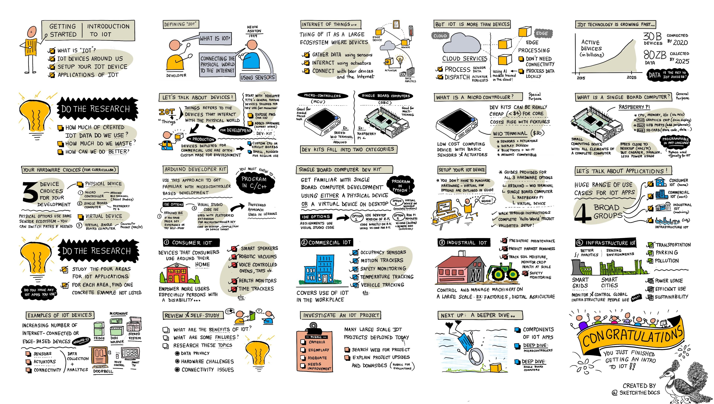

<!--
CO_OP_TRANSLATOR_METADATA:
{
  "original_hash": "9bae08314d8487cb76ddf3d8797e1544",
  "translation_date": "2025-08-28T17:16:14+00:00",
  "source_file": "1-getting-started/lessons/1-introduction-to-iot/README.md",
  "language_code": "my"
}
-->
# IoT အကြောင်းအကျဉ်း

> ပုံရေးသူ [Nitya Narasimhan](https://github.com/nitya)။ ပုံကို နှိပ်ပြီး ပိုကြီးတဲ့ဗားရှင်းကိုကြည့်ပါ။

ဒီသင်ခန်းစာကို [Microsoft Reactor](https://developer.microsoft.com/reactor/?WT.mc_id=academic-17441-jabenn) မှ [Hello IoT series](https://youtube.com/playlist?list=PLmsFUfdnGr3xRts0TIwyaHyQuHaNQcb6-) အစီအစဉ်အတွင်း သင်ကြားခဲ့သည်။ သင်ခန်းစာကို ၂ မိနစ်စာဗီဒီယိုများဖြင့် သင်ကြားခဲ့ပြီး၊ ၁ နာရီစာ သင်ခန်းစာနှင့် ၁ နာရီစာ အခန်းဖွင့်ချိန်တွင် သင်ခန်းစာ၏ အပိုင်းများကို ပိုမိုနက်ရှိုင်းစွာ လေ့လာပြီး မေးခွန်းများကို ဖြေကြားခဲ့သည်။

> 🎥 အထက်ပါပုံများကို နှိပ်ပြီး ဗီဒီယိုများကို ကြည့်ပါ။

## သင်ခန်းစာမတိုင်မီ မေးခွန်းများ

[သင်ခန်းစာမတိုင်မီ မေးခွန်းများ](https://black-meadow-040d15503.1.azurestaticapps.net/quiz/1)

## အကျဉ်းချုပ်

ဒီသင်ခန်းစာမှာ Internet of Things (IoT) အကြောင်းအခြေခံအကြောင်းအရာများကို လေ့လာပြီး၊ သင့် hardware ကို စတင်တပ်ဆင်ရန် လမ်းညွှန်ပေးပါမည်။

ဒီသင်ခန်းစာမှာ ကျွန်ုပ်တို့ လေ့လာမည့်အကြောင်းအရာများမှာ -

* [Internet of Things ဆိုတာဘာလဲ?](../../../../../1-getting-started/lessons/1-introduction-to-iot)
* [IoT စက်ပစ္စည်းများ](../../../../../1-getting-started/lessons/1-introduction-to-iot)
* [သင့်စက်ကို တပ်ဆင်ပါ](../../../../../1-getting-started/lessons/1-introduction-to-iot)
* [IoT ၏ အသုံးချမှုများ](../../../../../1-getting-started/lessons/1-introduction-to-iot)
* [သင့်ပတ်ဝန်းကျင်ရှိ IoT စက်ပစ္စည်းများ၏ ဥပမာများ](../../../../../1-getting-started/lessons/1-introduction-to-iot)

## Internet of Things ဆိုတာဘာလဲ?

'Internet of Things' ဆိုတဲ့စကားလုံးကို [Kevin Ashton](https://wikipedia.org/wiki/Kevin_Ashton) က ၁၉၉၉ ခုနှစ်မှာ စတင်အသုံးပြုခဲ့ပြီး၊ အင်တာနက်ကို sensor တွေကတဆင့် ရုပ်ပိုင်းဆိုင်ရာကမ္ဘာနဲ့ ချိတ်ဆက်ဖို့ ရည်ရွယ်ခဲ့တာဖြစ်ပါတယ်။ အဲဒီအချိန်ကစပြီး၊ ဒီစကားလုံးကို sensor တွေကနေ ဒေတာစုဆောင်းခြင်း၊ ဒါမှမဟုတ် actuator တွေ (LED မီးလင်းခြင်း၊ switch ဖွင့်ခြင်းစတဲ့ လုပ်ဆောင်မှုများ) ကတဆင့် ရုပ်ပိုင်းဆိုင်ရာလုပ်ဆောင်မှုများကို ပေးစွမ်းခြင်းတို့ဖြင့် ရုပ်ပိုင်းဆိုင်ရာကမ္ဘာနဲ့ အပြန်အလှန်ဆက်သွယ်နိုင်တဲ့ စက်ပစ္စည်းများကို ဖော်ပြဖို့ အသုံးပြုလာပါတယ်။

> **Sensor** တွေက ကမ္ဘာပတ်ဝန်းကျင်ကနေ အချက်အလက်တွေကို စုဆောင်းပေးပြီး၊ အမြန်နှုန်း၊ အပူချိန်၊ ဒေသအနေအထားစတဲ့ အချက်အလက်တွေကို တိုင်းတာပေးပါတယ်။
>
> **Actuator** တွေက လျှပ်စစ် signal တွေကို ရုပ်ပိုင်းဆိုင်ရာလုပ်ဆောင်မှုတွေ (switch ဖွင့်ခြင်း၊ မီးလင်းခြင်း၊ အသံထုတ်ခြင်း၊ ဒါမှမဟုတ် အခြား hardware တွေကို ထိန်းချုပ်တဲ့ signal ပေးခြင်း) အဖြစ် ပြောင်းလဲပေးပါတယ်။

IoT ဆိုတာ စက်ပစ္စည်းတွေထက်ပိုပြီး cloud-based service တွေကိုပါ အပါအဝင်ဖြစ်ပါတယ်။ Sensor data တွေကို process လုပ်ပေးခြင်း၊ ဒါမှမဟုတ် IoT စက်ပစ္စည်းတွေနဲ့ ချိတ်ဆက်ထားတဲ့ actuator တွေကို request ပေးခြင်းတို့ကို လုပ်ဆောင်နိုင်ပါတယ်။ Internet ချိတ်ဆက်မှုမရှိတဲ့ စက်ပစ္စည်းတွေ (edge devices) ကိုပါ အပါအဝင်ဖြစ်ပြီး၊ AI model တွေကို cloud မှာ training လုပ်ပြီး sensor data ကို ကိုယ်တိုင် process လုပ်နိုင်တဲ့ စက်ပစ္စည်းတွေဖြစ်ပါတယ်။

IoT ဆိုတာ အလွန်မြန်ဆန်စွာ တိုးတက်လာတဲ့ နည်းပညာကဏ္ဍတစ်ခုဖြစ်ပါတယ်။ ၂၀၂၀ ခုနှစ်ကုန်ပိုင်းမှာ IoT စက်ပစ္စည်း ၃၀ ဘီလီယံခန့်ကို deploy လုပ်ပြီး အင်တာနက်နဲ့ ချိတ်ဆက်ထားခဲ့ပါတယ်။ အနာဂတ်ကို ကြည့်မယ်ဆိုရင်၊ ၂၀၂၅ ခုနှစ်မှာ IoT စက်ပစ္စည်းတွေက ၈၀ zettabytes (၈၀ trillion gigabytes) ခန့် ဒေတာကို စုဆောင်းနေမယ်လို့ ခန့်မှန်းထားပါတယ်။ ဒါဟာ အလွန်များတဲ့ ဒေတာပမာဏပါ!

✅ သုတေသနလေးလုပ်ပါ: IoT စက်ပစ္စည်းတွေက စုဆောင်းတဲ့ ဒေတာတွေထဲမှာ ဘယ်နှစ်ရာခိုင်နှုန်းက အသုံးဝင်ပြီး၊ ဘယ်နှစ်ရာခိုင်နှုန်းက အလဟဿဖြစ်နေလဲ? ဒေတာများများကို မသုံးဘဲထားရတဲ့ အကြောင်းရင်းက ဘာလဲ?

ဒီဒေတာတွေက IoT ရဲ့ အောင်မြင်မှုရဲ့ အဓိကဖြစ်ပါတယ်။ IoT developer အဖြစ် အောင်မြင်ဖို့ဆိုရင်၊ သင့်အတွက်လိုအပ်တဲ့ ဒေတာကို ဘယ်လိုစုဆောင်းမလဲ၊ ဘယ်လိုဆုံးဖြတ်မလဲ၊ အဲ့ဒီဆုံးဖြတ်ချက်တွေကို ရုပ်ပိုင်းဆိုင်ရာကမ္ဘာနဲ့ ဆက်သွယ်ဖို့လိုအပ်ရင် ဘယ်လိုအသုံးချမလဲဆိုတာကို နားလည်ဖို့လိုပါတယ်။

## IoT စက်ပစ္စည်းများ

IoT ရဲ့ **T** ဆိုတာ **Things** ကို ဆိုလိုပါတယ် - sensor တွေကနေ ဒေတာစုဆောင်းခြင်း၊ ဒါမှမဟုတ် actuator တွေကတဆင့် ရုပ်ပိုင်းဆိုင်ရာလုပ်ဆောင်မှုတွေကို ပေးစွမ်းခြင်းတို့ဖြင့် ရုပ်ပိုင်းဆိုင်ရာကမ္ဘာနဲ့ ဆက်သွယ်နိုင်တဲ့ စက်ပစ္စည်းတွေကို ဆိုလိုပါတယ်။

ထုတ်လုပ်မှု သို့မဟုတ် စီးပွားရေးအတွက် အသုံးပြုတဲ့ စက်ပစ္စည်းတွေ (ဥပမာ - fitness tracker တွေ၊ စက်ရုံထိန်းချုပ်စက်တွေ) က custom-made ဖြစ်ပါတယ်။ အဲ့ဒီစက်တွေဟာ custom circuit board တွေ၊ custom processor တွေကို အသုံးပြုပြီး၊ လက်ပေါ်မှာ တပ်ဆင်နိုင်အောင် သေးငယ်ရမယ်၊ ဒါမှမဟုတ် အပူချိန်မြင့်၊ အကြမ်းခံရမယ့် စက်ရုံပတ်ဝန်းကျင်မှာ အသုံးပြုနိုင်အောင် ရည်ရွယ်ထားတဲ့ လုပ်ငန်းလိုအပ်ချက်တွေကို ဖြည့်ဆည်းနိုင်အောင် ဒီဇိုင်းဆွဲထားပါတယ်။

Developer အဖြစ် IoT ကို လေ့လာနေသူ သို့မဟုတ် စက်ပစ္စည်း prototype တစ်ခုကို ဖန်တီးနေသူအဖြစ်၊ developer kit တစ်ခုကို စတင်အသုံးပြုဖို့လိုပါတယ်။ Developer kit တွေဟာ developer တွေကို အသုံးပြုဖို့ ရည်ရွယ်ထားတဲ့ general-purpose IoT စက်ပစ္စည်းတွေဖြစ်ပြီး၊ production device တွေမှာ မပါမဖြစ် features တွေ (sensor တွေ၊ actuator တွေကို ချိတ်ဆက်ဖို့ pin တွေ၊ debugging hardware တွေ၊ large-scale ထုတ်လုပ်မှုမှာ မလိုအပ်တဲ့ အပို resource တွေ) ပါဝင်ပါတယ်။

Developer kit တွေဟာ မိုက်ခရိုကွန်ထရိုလာ (microcontroller) တွေ၊ single-board computer တွေဆိုပြီး အမျိုးအစား ၂ မျိုးရှိပါတယ်။ ဒီသင်ခန်းစာမှာ အကျဉ်းချုပ်ဖော်ပြပေးပြီး၊ နောက်သင်ခန်းစာမှာ ပိုမိုအသေးစိတ်လေ့လာပါမည်။

> 💁 သင့်ဖုန်းကို sensor တွေ၊ actuator တွေ built-in ပါဝင်တဲ့ general-purpose IoT စက်ပစ္စည်းတစ်ခုအဖြစ် သတ်မှတ်နိုင်ပါတယ်။ အမျိုးမျိုးသော app တွေက sensor တွေ၊ actuator တွေကို cloud service တွေကို အသုံးပြုပြီး အခြားနည်းလမ်းတွေနဲ့ အသုံးချနိုင်ပါတယ်။ IoT စက်ပစ္စည်းအဖြစ် ဖုန်း app ကို အသုံးပြုတဲ့ tutorial တွေကိုလည်း တွေ့နိုင်ပါတယ်။

### မိုက်ခရိုကွန်ထရိုလာ (Microcontrollers)

မိုက်ခရိုကွန်ထရိုလာ (MCU - microcontroller unit) ဆိုတာ -

🧠 CPU (central processing unit) တစ်ခု သို့မဟုတ် အများအပြား - မိုက်ခရိုကွန်ထရိုလာရဲ့ 'ဦးနှောက်' ဖြစ်ပြီး သင့် program ကို run လုပ်ပေးပါတယ်။

💾 Memory (RAM နှင့် program memory) - သင့် program, data, variable တွေကို သိမ်းဆည်းထားတဲ့နေရာ

🔌 Programmable input/output (I/O) connection - sensor တွေ၊ actuator တွေလို peripherals တွေနဲ့ ဆက်သွယ်ဖို့

မိုက်ခရိုကွန်ထရိုလာတွေဟာ အလွန်စျေးသက်သာတဲ့ computing device တွေဖြစ်ပြီး၊ custom hardware တွေမှာ အသုံးပြုတဲ့ မိုက်ခရိုကွန်ထရိုလာတွေဟာ US$0.50 လောက်အထိ စျေးကျလာပါတယ်။ Developer kit တွေဟာ US$4 ကနေ စတင်ပြီး၊ feature တွေ ပေါင်းထည့်သလို စျေးနှုန်းတက်လာပါတယ်။ [Wio Terminal](https://www.seeedstudio.com/Wio-Terminal-p-4509.html) ဆိုတဲ့ Seeed Studios မှထုတ်လုပ်တဲ့ microcontroller developer kit ဟာ sensor, actuator, WiFi, screen ပါဝင်ပြီး US$30 လောက်ကျသင့်ပါတယ်။

> 💁 မိုက်ခရိုကွန်ထရိုလာတွေကို အင်တာနက်မှာ ရှာဖွေတဲ့အခါ **MCU** ဆိုတဲ့စကားလုံးကို ရှာဖွေပါက Marvel Cinematic Universe (MCU) နဲ့ဆိုင်တဲ့ ရလဒ်တွေကို အများကြီးတွေ့နိုင်ပါတယ်။

### Single-board computers

Single-board computer ဆိုတာ -

Raspberry Pi ဟာ single-board computer တွေထဲမှာ အလွန်လူကြိုက်များတဲ့ device တစ်ခုဖြစ်ပါတယ်။

Single-board computer တွေဟာ sensor, actuator တွေနဲ့ interaction လုပ်နိုင်တဲ့ GPIO (general-purpose input/output) pin တွေပါဝင်ပြီး၊ desktop computer သို့မဟုတ် laptop computer တစ်ခုလို အပြည့်အစုံ feature တွေပါဝင်ပါတယ်။ 

> 🎓 Single-board computer ကို သင့် PC သို့မဟုတ် Mac ရဲ့ သေးငယ်ပြီး စျေးသက်သာတဲ့ version တစ်ခုအဖြစ် သတ်မှတ်နိုင်ပါတယ်။

Single-board computer တွေဟာ fully-featured computer တွေဖြစ်တဲ့အတွက် ဘယ် programming language နဲ့မဆို program ရေးနိုင်ပါတယ်။ IoT device တွေကို Python language နဲ့ program ရေးလေ့ရှိပါတယ်။

### နောက်သင်ခန်းစာများအတွက် hardware ရွေးချယ်မှု

နောက်သင်ခန်းစာတွေမှာ IoT device ကို အသုံးပြုပြီး ရုပ်ပိုင်းဆိုင်ရာကမ္ဘာနဲ့ interaction လုပ်ခြင်း၊ cloud နဲ့ ဆက်သွယ်ခြင်းတို့ကို လုပ်ဆောင်မည့် assignment တွေပါဝင်ပါတယ်။ Arduino (Seeed Studios Wio Terminal ကို အသုံးပြုခြင်း) သို့မဟုတ် single-board computer (Raspberry Pi 4 သို့မဟုတ် virtual single-board computer) တစ်ခုကို အသုံးပြုနိုင်ပါတယ်။

> 💁 IoT hardware မဝယ်ရသေးလည်း သင်ခန်းစာတွေကို virtual single-board computer ကို အသုံးပြုပြီး ပြီးစီးနိုင်ပါတယ်။

### Arduino developer kit

Microcontroller development ကို လေ့လာချင်သူများအတွက် Arduino device ကို အသုံးပြုနိုင်ပါတယ်။ C/C++ programming ကို အခြေခံနားလည်မှုရှိဖို့လိုအပ်ပြီး၊ Arduino framework, sensor, actuator, cloud library တွေကို သင်ခန်းစာမှာသာ သင်ကြားပေးပါမည်။

### Single-board computer developer kit

Single-board computer ကို အသုံးပြုပြီး IoT development ကို လေ့လာချင်သူများအတွက် Raspberry Pi သို့မဟုတ် virtual device ကို အသုံးပြုနိုင်ပါတယ်။ Python programming ကို အခြေခံနားလည်မှုရှိဖို့လိုအပ်ပြီး၊ sensor, actuator, cloud library တွေကို သင်ခန်းစာမှာသာ သင်ကြားပေးပါမည်။

> 💁 Python ကို သင်ယူချင်သူများအတွက် ဗီဒီယို series ၂ ခုကို ကြည့်ပါ:
>
> * [Python for beginners](https://channel9.msdn.com/Series/Intro-to-Python-Development?WT.mc_id=academic-17441-jabenn)
> * [More Python for beginners](https://channel9.msdn.com/Series/More-Python-for-Beginners?WT.mc_id=academic-7372-jabenn)

## သင့်စက်ကို တပ်ဆင်ပါ

IoT device ကို program ရေးမတိုင်မီ သင့်စက်ကို အနည်းငယ် setup လုပ်ဖို့လိုအပ်ပါတယ်။ သင့် device အမျိုးအစားအလိုက် လိုက်နာရမည့် လမ်းညွှန်ချက်များကို အောက်တွင် ဖော်ပြထားပါတယ်။
💁 အကယ်၍ သင့်မှာ စက်ပစ္စည်းမရှိသေးပါက [hardware guide](../../../hardware.md) ကို ကိုးကားပြီး သုံးမည့် စက်ပစ္စည်းနှင့် ဝယ်ယူရန် လိုအပ်သော ထပ်ဆောင်း hardware များကို ဆုံးဖြတ်နိုင်ပါသည်။ သင် hardware မဝယ်ယူလည်း ရနိုင်ပါသည်၊ အကြောင်းမှာ အစီအစဉ်များအားလုံးကို အတု hardware ပေါ်တွင် အလုပ်လုပ်နိုင်သောကြောင့် ဖြစ်ပါသည်။
ဒီလမ်းညွှန်စာအုပ်တွင် သင်အသုံးပြုမည့် hardware သို့မဟုတ် tools များအတွက် အမြဲတမ်းနောက်ဆုံးပေါ် လမ်းညွှန်ချက်များကို အသုံးပြုနိုင်ရန် third-party websites link များပါဝင်သည်။

သင့်စက်ကို set up လုပ်ပြီး 'Hello World' project ကို ပြီးမြောက်အောင်လုပ်ပါ။ ဒါဟာ IoT nightlight တစ်ခုကို ဖန်တီးရန် စတင်ခြင်းအဆင့်ဖြစ်ပြီး ဒီလမ်းညွှန်စာအုပ်၏ ၄ ပုဒ်တွင် ပါဝင်သည်။

* [Arduino - Wio Terminal](wio-terminal.md)
* [Single-board computer - Raspberry Pi](pi.md)
* [Single-board computer - Virtual device](virtual-device.md)

✅ Arduino နှင့် Single-board computers နှစ်ခုစလုံးအတွက် VS Code ကို အသုံးပြုမည်ဖြစ်သည်။ သင်မသုံးဖူးသေးပါက [VS Code site](https://code.visualstudio.com?WT.mc_id=academic-17441-jabenn) တွင် ပိုမိုသိရှိနိုင်ပါသည်။

## IoT ၏ အသုံးချမှုများ

IoT သည် အသုံးချမှုအမျိုးမျိုးကို အကျယ်အဝန်းဖြင့် ဖုံးလွှမ်းထားပြီး အောက်ပါ broad groups အနည်းငယ်တွင် ခွဲခြားထားသည်-

* Consumer IoT  
* Commercial IoT  
* Industrial IoT  
* Infrastructure IoT  

✅ သုတေသနအနည်းငယ်လုပ်ပါ- အောက်တွင် ဖော်ပြထားသော အပိုင်းများအတွက် စာသားတွင် မပါဝင်သော တိကျသော ဥပမာတစ်ခုကို ရှာဖွေပါ။

### Consumer IoT

Consumer IoT သည် အိမ်တွင်းတွင် အသုံးပြုရန် လူသုံးများဝယ်ယူမည့် IoT devices များကို ဆိုလိုသည်။ ဒီ devices များအနက် အလွန်အသုံးဝင်သောအရာများလည်းရှိပြီး၊ ဥပမာ- smart speakers, smart heating systems, robotic vacuum cleaners စသည်ဖြင့်။ သို့သော် အသုံးဝင်မှုအပေါ် မေးခွန်းထုတ်ရမည့်အရာများလည်းရှိသည်၊ ဥပမာ- voice-controlled taps များသည် ရေစီးသံကြောင့် voice control မကြားနိုင်သောကြောင့် ရေကိုပိတ်၍မရနိုင်ခြင်း။

Consumer IoT devices များသည် လူများကို ပတ်ဝန်းကျင်တွင် ပိုမိုအောင်မြင်စေသော အခွင့်အရေးများပေးနေသည်။ အထူးသဖြင့် မသန်စွမ်းသူ ၁ ဘီလီယံအတွက် အလွန်အကျိုးရှိစေသည်။ ဥပမာ- robotic vacuum cleaners များသည် မသန်စွမ်းသူများအတွက် အိမ်ကြမ်းကို သန့်ရှင်းစေပြီး၊ voice-controlled ovens များသည် မျက်စိမမြင်သူများ သို့မဟုတ် လက်မလှုပ်နိုင်သူများအတွက် အသံဖြင့် oven ကို အပူပေးနိုင်စေသည်။ ကျန်းမာရေးစောင့်ကြည့်စနစ်များသည် လူနာများကို ၎င်းတို့၏ ရောဂါအခြေအနေကို ပိုမိုကြိမ်နှုန်းမြင့်စွာ စောင့်ကြည့်နိုင်စေသည်။ COVID ကာလတွင် အိမ်တွင်းမှ ကျောင်းတက်နေသော ကလေးများသည် smart home devices များကို အသုံးပြု၍ ကျောင်းအလုပ်များကို စောင့်ကြည့်ရန် timer များထားခြင်း၊ သို့မဟုတ် အတန်းအစည်းအဝေးများကို သတိပေးရန် alarm များထားခြင်းတို့ကို လုပ်ဆောင်ခဲ့သည်။

✅ သင့်အိမ်တွင် သို့မဟုတ် သင့်ကိုယ်ပိုင်တွင် Consumer IoT devices များ ရှိပါသလား?

### Commercial IoT

Commercial IoT သည် အလုပ်ခွင်တွင် IoT ကို အသုံးပြုခြင်းကို ဆိုလိုသည်။ ရုံးတွင်းတွင် occupancy sensors နှင့် motion detectors များကို အသုံးပြု၍ မလိုအပ်သောအချိန်တွင် မီးနှင့် အပူပေးစနစ်များကို ပိတ်ထားနိုင်သည်။ စက်ရုံတွင် IoT devices များသည် hard hats မဝတ်ဆင်သော အလုပ်သမားများ သို့မဟုတ် အန္တရာယ်ရှိသော ဆူညံသံများကို စောင့်ကြည့်နိုင်သည်။ စျေးဝယ်စခန်းတွင် IoT devices များသည် အအေးခံထားသော အစားအစာများ၏ အပူချိန်ကို တိုင်းတာပြီး အပူချိန်အကန့်အသတ်ကို ကျော်လွန်ပါက အစီရင်ခံပေးနိုင်သည်။ သို့မဟုတ် ရောင်းချပြီးသော ပစ္စည်းများကို ပြန်လည်ဖြည့်ရန် ဝန်ထမ်းများကို ညွှန်ကြားနိုင်သည်။ သယ်ယူပို့ဆောင်ရေးလုပ်ငန်းတွင် IoT ကို အသုံးပြု၍ ယာဉ်တည်နေရာများကို စောင့်ကြည့်ခြင်း၊ လမ်းပေါ် mileage ကို တိုင်းတာခြင်း၊ ယာဉ်မောင်းအနားယူချိန်များကို စောင့်ကြည့်ခြင်း၊ သို့မဟုတ် ယာဉ်သည် depot ကို ရောက်ရှိမည့်အချိန်ကို အစီရင်ခံပေးခြင်းတို့ကို လုပ်ဆောင်သည်။

✅ သင့်ကျောင်း သို့မဟုတ် အလုပ်ခွင်တွင် Commercial IoT devices များ ရှိပါသလား?

### Industrial IoT (IIoT)

Industrial IoT သို့မဟုတ် IIoT သည် စက်ပစ္စည်းများကို အကြီးအကျယ် စီမံခန့်ခွဲရန် IoT devices များကို အသုံးပြုခြင်းဖြစ်သည်။ ဥပမာ- စက်ရုံများနှင့် digital agriculture များ။

စက်ရုံများတွင် IoT devices များကို အပူချိန်၊ တုန်ခါမှုနှင့် လည်ပတ်နှုန်းတို့ကို စောင့်ကြည့်ရန် sensor များစွာဖြင့် စက်ပစ္စည်းများကို စောင့်ကြည့်သည်။ ဒီ data များကို စက်ပစ္စည်းသည် tolerance အကန့်အသတ်များကို ကျော်လွန်ပါက ရပ်တန့်စေသည်။ ဥပမာ- အပူလွန်ကဲမှုကြောင့် စက်ကို ရပ်တန့်စေခြင်း။ ဒီ data များကို အချိန်ကြာမြင့်စွာ စုဆောင်းပြီး AI models များကို အသုံးပြု၍ failure မဖြစ်မီ ခန့်မှန်းနိုင်သော predictive maintenance ကို လုပ်ဆောင်သည်။

Digital agriculture သည် လူဦးရေတိုးလာမှုကြောင့် စိုက်ပျိုးရေးလုပ်ငန်းများကို ပိုမိုထိရောက်စေရန် အရေးကြီးသည်။ subsistence farming ကို အခြေခံသော ၅၀၀ သန်း households အတွက် အထူးအရေးကြီးသည်။ Digital agriculture သည် အနည်းငယ်သော sensor များမှ စ၍ အကြီးမားသော စိုက်ပျိုးရေးစနစ်များအထိ ကွဲပြားသည်။ ဥပမာ- စိုက်ပျိုးရေးသမားများသည် အပူချိန်ကို စောင့်ကြည့်ပြီး growing degree days ကို အသုံးပြု၍ သီးနှံရိတ်သိမ်းချိန်ကို ခန့်မှန်းနိုင်သည်။ မြေစိုထိုင်းမှုကို စောင့်ကြည့်ပြီး automated watering systems များနှင့် ချိတ်ဆက်၍ သီးနှံများအတွက် လိုအပ်သော ရေကိုပေးနိုင်သည်။ စိုက်ပျိုးရေးသမားများသည် drone, satellite data နှင့် AI ကို အသုံးပြု၍ သီးနှံများ၏ အရည်အသွေး၊ ရောဂါနှင့် မြေညီထိန်းသိမ်းမှုကို စောင့်ကြည့်နေသည်။

✅ စိုက်ပျိုးရေးသမားများအတွက် IoT devices များ ဘယ်လိုကူညီနိုင်မလဲ?

### Infrastructure IoT

Infrastructure IoT သည် လူများနေ့စဉ်အသုံးပြုသော ဒေသတွင်းနှင့် ကမ္ဘာလုံးဆိုင်ရာ အခြေခံအဆောက်အအုံများကို စောင့်ကြည့်ခြင်းနှင့် ထိန်းချုပ်ခြင်းဖြစ်သည်။

[Smart Cities](https://wikipedia.org/wiki/Smart_city) သည် IoT devices များကို အသုံးပြု၍ မြို့၏ data များကို စုဆောင်းပြီး မြို့ကို ပိုမိုထိရောက်စွာ စီမံခန့်ခွဲရန် အသုံးပြုသည်။ ဥပမာ- ဒိန်းမတ်နိုင်ငံ Copenhagen တွင် လေထုညစ်ညမ်းမှုကို စောင့်ကြည့်ပြီး cycling နှင့် jogging လမ်းကြောင်းများအတွက် အကောင်းဆုံး data ကို ပေးသည်။

[Smart power grids](https://wikipedia.org/wiki/Smart_grid) သည် အိမ်တစ်အိမ်ချင်းစီ၏ လျှပ်စစ်အသုံးပြုမှု data ကို စုဆောင်းပြီး နိုင်ငံအဆင့်တွင် လျှပ်စစ်စက်ရုံများကို ဘယ်နေရာတွင် တည်ဆောက်မည်ကို ဆုံးဖြတ်နိုင်သည်။ အိမ်အသုံးပြုသူများအတွက်လည်း လျှပ်စစ်အသုံးပြုမှု data ကို ပေးပြီး အချိန်နှင့် အကျိုးကျေးဇူးများကို သိရှိစေသည်။

✅ သင့်နေရာတွင် IoT devices များကို ဘာကို တိုင်းတာရန် ထည့်သွင်းလိုပါသလဲ?

## သင့်ပတ်ဝန်းကျင်ရှိ IoT devices များ၏ ဥပမာများ

သင့်ပတ်ဝန်းကျင်တွင် IoT devices များ အများကြီး ရှိနေသည်ကို သင်အံ့ဩမိပါမည်။ ဥပမာ- အိမ်တွင်းတွင် ရေးသားနေသောအခါ အောက်ပါ IoT devices များရှိသည်-

* Smart speakers များ
* ရေခဲသေတ္တာ၊ ပန်းကန်ဆေးစက်၊ မိုက်ခရိုဝေ့နှင့် အိုးဖို
* Solar panels အတွက် လျှပ်စစ် monitor
* Smart plugs
* Video doorbell နှင့် security cameras
* Smart thermostat နှင့် smart room sensors များ
* Garage door opener
* Home entertainment systems နှင့် voice-controlled TVs
* မီးများ
* Fitness နှင့် health trackers

ဒီ devices များအားလုံးတွင် sensor များနှင့်/သို့မဟုတ် actuator များပါဝင်ပြီး Internet နှင့် ချိတ်ဆက်ထားသည်။ ဥပမာ- garage door ကို timer ဖြင့် ညအချိန်တွင် auto-close လုပ်နိုင်သည်။ Doorbell မှာ speaker နှင့် microphone ပါဝင်ပြီး အိမ်မရှိချိန်တွင်လည်း အပြန်အလှန်ပြောဆိုနိုင်သည်။ ကျန်းမာရေး data များကို စောင့်ကြည့်ပြီး ကျန်းမာရေးကို တိုးတက်စေသည်။

---

## 🚀 စိန်ခေါ်မှု

သင့်အိမ်၊ ကျောင်း သို့မဟုတ် အလုပ်ခွင်တွင် ရှိသော IoT devices များကို အများဆုံး ရှာဖွေပါ- သင်မထင်ထားသော devices များလည်း ရှိနိုင်ပါသည်!

## Post-lecture quiz

[Post-lecture quiz](https://black-meadow-040d15503.1.azurestaticapps.net/quiz/2)

## Review & Self Study

Consumer IoT projects များ၏ အကျိုးကျေးဇူးများနှင့် အဆင်မပြေမှုများကို ဖတ်ရှုပါ။ Privacy, hardware သို့မဟုတ် connectivity မရှိခြင်းကြောင့် ဖြစ်ပေါ်သော ပြဿနာများအကြောင်း သတင်းများကို ရှာဖွေပါ။

ဥပမာ-

* Twitter account **[Internet of Sh*t](https://twitter.com/internetofshit)** *(profanity warning)* တွင် Consumer IoT ၏ အဆင်မပြေမှုများကို ကြည့်ရှုပါ။
* [c|net - My Apple Watch saved my life: 5 people share their stories](https://www.cnet.com/news/apple-watch-lifesaving-health-features-read-5-peoples-stories/)
* [c|net - ADT technician pleads guilty to spying on customer camera feeds for years](https://www.cnet.com/news/adt-home-security-technician-pleads-guilty-to-spying-on-customer-camera-feeds-for-years/) *(trigger warning - non-consensual voyeurism)*

## Assignment

[Investigate an IoT project](assignment.md)

---

**အကြောင်းကြားချက်**:  
ဤစာရွက်စာတမ်းကို AI ဘာသာပြန်ဝန်ဆောင်မှု [Co-op Translator](https://github.com/Azure/co-op-translator) ကို အသုံးပြု၍ ဘာသာပြန်ထားပါသည်။ ကျွန်ုပ်တို့သည် တိကျမှုအတွက် ကြိုးစားနေပါသော်လည်း၊ အလိုအလျောက် ဘာသာပြန်မှုများတွင် အမှားများ သို့မဟုတ် မတိကျမှုများ ပါရှိနိုင်သည်ကို သတိပြုပါ။ မူရင်းဘာသာစကားဖြင့် ရေးသားထားသော စာရွက်စာတမ်းကို အာဏာရှိသော ရင်းမြစ်အဖြစ် သတ်မှတ်သင့်ပါသည်။ အရေးကြီးသော အချက်အလက်များအတွက် လူ့ဘာသာပြန်ပညာရှင်များမှ ပရော်ဖက်ရှင်နယ် ဘာသာပြန်မှုကို အကြံပြုပါသည်။ ဤဘာသာပြန်မှုကို အသုံးပြုခြင်းမှ ဖြစ်ပေါ်လာသော အလွဲအလွတ်များ သို့မဟုတ် အနားလွဲမှုများအတွက် ကျွန်ုပ်တို့သည် တာဝန်မယူပါ။