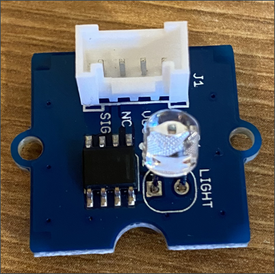

<!--
CO_OP_TRANSLATOR_METADATA:
{
  "original_hash": "ea733bd0cdf2479e082373f765a08678",
  "translation_date": "2025-08-28T17:28:16+00:00",
  "source_file": "1-getting-started/lessons/3-sensors-and-actuators/pi-sensor.md",
  "language_code": "my"
}
-->
# Raspberry Pi - ညအလင်းပွိုင့်တည်ဆောက်ခြင်း

ဒီသင်ခန်းစာအပိုင်းမှာ Raspberry Pi ကို အလင်းခံစားကိရိယာတစ်ခု ထည့်သွင်းမှာဖြစ်ပါတယ်။

## ဟာ့ဒ်ဝဲ

ဒီသင်ခန်းစာအတွက် အသုံးပြုမယ့် sensor က **အလင်းခံစားကိရိယာ** ဖြစ်ပြီး [photodiode](https://wikipedia.org/wiki/Photodiode) ကို အသုံးပြုကာ အလင်းကို လျှပ်စစ်သို့ ပြောင်းလဲပေးပါတယ်။ ဒါဟာ analog sensor ဖြစ်ပြီး အလင်းပမာဏကို 0 မှ 1,000 အတွင်း integer value အနေနဲ့ ပေးပို့ပါတယ်။ ဒီ value က [lux](https://wikipedia.org/wiki/Lux) စတဲ့ စံချိန်စနစ်တစ်ခုနဲ့ မဆက်စပ်ပါဘူး။

အလင်း sensor က Grove sensor ဖြစ်ပြီး Raspberry Pi ရဲ့ Grove Base hat နဲ့ ချိတ်ဆက်ဖို့ လိုအပ်ပါတယ်။

### အလင်း sensor ကို ချိတ်ဆက်ပါ

အလင်းအဆင့်ကို သိရှိဖို့ အသုံးပြုမယ့် Grove အလင်း sensor ကို Raspberry Pi နဲ့ ချိတ်ဆက်ဖို့ လိုအပ်ပါတယ်။

#### လုပ်ငန်း - အလင်း sensor ကို ချိတ်ဆက်ပါ

အလင်း sensor ကို ချိတ်ဆက်ပါ။



1. Grove cable ရဲ့ တစ်ဖက်အဆုံးကို အလင်း sensor module ရဲ့ socket ထဲသို့ ထည့်ပါ။ ဒီ cable က တစ်ဖက်ဘက်သာ အဆင်ပြေစွာ ထည့်နိုင်ပါမယ်။

1. Raspberry Pi ကို power ပိတ်ထားပြီး Grove cable ရဲ့ တစ်ဖက်အဆုံးကို Grove Base hat ရဲ့ analog socket **A0** မှာ ချိတ်ဆက်ပါ။ ဒီ socket က GPIO pins အနီးမှာရှိတဲ့ socket row ရဲ့ ညာဘက် ဒုတိယ socket ဖြစ်ပါတယ်။


## အလင်း sensor ကို အစီအစဉ်ရေးဆွဲပါ

အခုတော့ Grove အလင်း sensor ကို အသုံးပြုပြီး programming လုပ်နိုင်ပါပြီ။

### လုပ်ငန်း - အလင်း sensor ကို အစီအစဉ်ရေးဆွဲပါ

ဒီ device ကို programming လုပ်ပါ။

1. Pi ကို power on လုပ်ပြီး boot ဖြစ်အောင် စောင့်ပါ။

1. VS Code မှာ nightlight project ကို ဖွင့်ပါ။ ဒီ project ကို အရင်အပိုင်းမှာ ဖန်တီးထားပြီး Pi မှာ တိုက်ရိုက် run လုပ်တာဖြစ်စေ၊ Remote SSH extension ကို အသုံးပြုပြီး ချိတ်ဆက်ထားတာဖြစ်စေ။

1. `app.py` ဖိုင်ကို ဖွင့်ပြီး အဲ့ဒီမှာရှိတဲ့ code အားလုံးကို ဖျက်ပါ။

1. `app.py` ဖိုင်ထဲမှာ အောက်ပါ code ကို ထည့်ပါ။ ဒီ code က လိုအပ်တဲ့ libraries တွေကို import လုပ်ပေးပါတယ်။

    ```python
    import time
    from grove.grove_light_sensor_v1_2 import GroveLightSensor
    ```

    `import time` statement က `time` module ကို import လုပ်ပြီး ဒီ module ကို အခု assignment ရဲ့ နောက်ပိုင်းမှာ အသုံးပြုပါမယ်။

    `from grove.grove_light_sensor_v1_2 import GroveLightSensor` statement က Grove Python libraries ထဲက `GroveLightSensor` ကို import လုပ်ပါတယ်။ ဒီ library မှာ Grove အလင်း sensor နဲ့ ဆက်သွယ်ဖို့ code တွေ ပါဝင်ပြီး Pi setup လုပ်စဉ်မှာ global installation လုပ်ထားပါတယ်။

1. အပေါ်က code အပြီးမှာ အလင်း sensor ကို စီမံခန့်ခွဲမယ့် class ရဲ့ instance တစ်ခုကို ဖန်တီးဖို့ အောက်ပါ code ကို ထည့်ပါ။

    ```python
    light_sensor = GroveLightSensor(0)
    ```

    `light_sensor = GroveLightSensor(0)` line က GroveLightSensor class ရဲ့ instance တစ်ခုကို ဖန်တီးပြီး **A0** pin (အလင်း sensor ချိတ်ဆက်ထားတဲ့ analog Grove pin) ကို ချိတ်ဆက်ပါတယ်။

1. အပေါ်က code အပြီးမှာ အဆုံးမရှိတဲ့ loop တစ်ခုကို ထည့်ပါ။ ဒီ loop က အလင်း sensor value ကို poll လုပ်ပြီး console မှာ print လုပ်ပေးပါမယ်။

    ```python
    while True:
        light = light_sensor.light
        print('Light level:', light)
    ```

    ဒီ code က GroveLightSensor class ရဲ့ `light` property ကို အသုံးပြုပြီး 0-1,023 scale အတွင်းရှိ လက်ရှိအလင်းအဆင့်ကို ဖတ်ပါတယ်။ ဒီ property က pin မှာရှိတဲ့ analog value ကို ဖတ်ပါတယ်။ ဒီ value ကို console မှာ print လုပ်ပေးပါမယ်။

1. Loop ရဲ့ အဆုံးမှာ တစ်စက္ကန့်အနည်းငယ် sleep လုပ်ပါ။ အလင်းအဆင့်ကို အမြဲတမ်းစစ်ဆေးဖို့ မလိုအပ်ပါဘူး။ Sleep လုပ်ခြင်းက device ရဲ့ power consumption ကို လျှော့ချပေးပါတယ်။

    ```python
    time.sleep(1)
    ```

1. VS Code Terminal မှာ အောက်ပါ command ကို run လုပ်ပြီး Python app ကို run လုပ်ပါ။

    ```sh
    python3 app.py
    ```

    အလင်း value တွေကို console မှာ output လုပ်ပါမယ်။ အလင်း sensor ကို ဖုံးထားပြီး ပြန်ဖွင့်ပါ၊ value တွေက ပြောင်းလဲပါမယ်။

    ```output
    pi@raspberrypi:~/nightlight $ python3 app.py 
    Light level: 634
    Light level: 634
    Light level: 634
    Light level: 230
    Light level: 104
    Light level: 290
    ```

> 💁 ဒီ code ကို [code-sensor/pi](../../../../../1-getting-started/lessons/3-sensors-and-actuators/code-sensor/pi) folder မှာ ရှာနိုင်ပါတယ်။

😀 သင့် nightlight program မှာ sensor တစ်ခု ထည့်သွင်းတာ အောင်မြင်ခဲ့ပါပြီ!

---

**အကြောင်းကြားချက်**:  
ဤစာရွက်စာတမ်းကို AI ဘာသာပြန်ဝန်ဆောင်မှု [Co-op Translator](https://github.com/Azure/co-op-translator) ကို အသုံးပြု၍ ဘာသာပြန်ထားပါသည်။ ကျွန်ုပ်တို့သည် တိကျမှုအတွက် ကြိုးစားနေပါသော်လည်း၊ အလိုအလျောက် ဘာသာပြန်မှုများတွင် အမှားများ သို့မဟုတ် မတိကျမှုများ ပါဝင်နိုင်သည်ကို သတိပြုပါ။ မူရင်းစာရွက်စာတမ်းကို ၎င်း၏ မူလဘာသာစကားဖြင့် အာဏာတရားရှိသော အရင်းအမြစ်အဖြစ် ရှုလို့ရပါသည်။ အရေးကြီးသော အချက်အလက်များအတွက် လူ့ဘာသာပြန်ပညာရှင်များမှ ပရော်ဖက်ရှင်နယ် ဘာသာပြန်မှုကို အကြံပြုပါသည်။ ဤဘာသာပြန်မှုကို အသုံးပြုခြင်းမှ ဖြစ်ပေါ်လာသော အလွဲအလွတ်များ သို့မဟုတ် အနားလွဲမှုများအတွက် ကျွန်ုပ်တို့သည် တာဝန်မယူပါ။