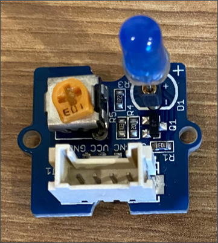

<!--
CO_OP_TRANSLATOR_METADATA:
{
  "original_hash": "db44083b4dc6fb06eac83c4f16448940",
  "translation_date": "2025-08-28T17:28:57+00:00",
  "source_file": "1-getting-started/lessons/3-sensors-and-actuators/wio-terminal-actuator.md",
  "language_code": "my"
}
-->
# ညဉ့်မီးအိပ်မီး - Wio Terminal

ဒီသင်ခန်းစာအပိုင်းမှာ သင့်ရဲ့ Wio Terminal မှာ LED တစ်ခုထည့်ပြီး ညဉ့်မီးအိပ်မီးတစ်ခုဖန်တီးပါမယ်။

## ဟာ့ဒ်ဝဲ

အခုတော့ ညဉ့်မီးအိပ်မီးအတွက် actuator တစ်ခုလိုအပ်ပါတယ်။

actuator က **LED** ဖြစ်ပြီး၊ [အလင်းထုတ်ပေးသော ဒိုင်အိုဒ်](https://wikipedia.org/wiki/Light-emitting_diode) တစ်ခုဖြစ်ပါတယ်။ လျှပ်စီးစီးဆင်းလာတဲ့အခါ အလင်းထွက်ပေါ်စေပါတယ်။ ဒါကတော့ on နဲ့ off ဆိုတဲ့ ၂ ခုသော အခြေအနေရှိတဲ့ digital actuator တစ်ခုဖြစ်ပါတယ်။ 1 တန်ဖိုးပေးလိုက်ရင် LED ကိုဖွင့်ပြီး၊ 0 တန်ဖိုးပေးလိုက်ရင် LED ကိုပိတ်ပါတယ်။ ဒါကတော့ Wio Terminal နဲ့ ချိတ်ဆက်ရမယ့် အပြင်ပ Grove actuator တစ်ခုဖြစ်ပါတယ်။

ညဉ့်မီးအိပ်မီးရဲ့ pseudo-code logic ကတော့ -

```output
Check the light level.
If the light is less than 300
    Turn the LED on
Otherwise
    Turn the LED off
```

### LED ကိုချိတ်ဆက်ပါ

Grove LED က module အနေနဲ့ ရရှိပြီး၊ အရောင်ရွေးချယ်နိုင်တဲ့ LEDs တွေပါပါတယ်။

#### လုပ်ငန်းစဉ် - LED ကိုချိတ်ဆက်ပါ

LED ကိုချိတ်ဆက်ပါ။



1. သင်နှစ်သက်ရာ LED ကိုရွေးပြီး၊ LED module ရဲ့ အပေါက် ၂ ခုထဲကို ခြေထောက်တွေထည့်ပါ။

    LEDs တွေက အလင်းထုတ်ပေးတဲ့ ဒိုင်အိုဒ်တွေဖြစ်ပြီး၊ ဒိုင်အိုဒ်တွေက လျှပ်စီးကို တစ်ဖက်ဘက်သာ သယ်ဆောင်နိုင်ပါတယ်။ ဒါကြောင့် LED ကို မှန်ကန်တဲ့ဘက်မှာသာ ချိတ်ဆက်ရမယ်၊ မဟုတ်ရင် အလုပ်မလုပ်ပါဘူး။

    LED ရဲ့ ခြေထောက်တစ်ဖက်က positive pin ဖြစ်ပြီး၊ တစ်ဖက်က negative pin ဖြစ်ပါတယ်။ LED က အပြည့်စုံမဟုတ်ဘဲ၊ တစ်ဖက်မှာ အနည်းငယ်ပြားပါတယ်။ အနည်းငယ်ပြားတဲ့ဘက်က negative pin ဖြစ်ပါတယ်။ LED ကို module နဲ့ချိတ်ဆက်တဲ့အခါ၊ ပြားတဲ့ဘက်က module ရဲ့ အလယ်ဘက်နားမှာရှိတဲ့ socket နဲ့ချိတ်ဆက်ပြီး၊ rounded ဘက်က module ရဲ့ အပြင်ဘက်မှာရှိတဲ့ **+** ဆိုတဲ့ socket နဲ့ချိတ်ဆက်ထားရမယ်။

1. LED module မှာ brightness ကိုထိန်းချုပ်နိုင်တဲ့ spin button တစ်ခုရှိပါတယ်။ စတင်ရာမှာတော့ brightness ကို အပြည့်အဝတိုးထားဖို့၊ သေးငယ်တဲ့ Phillips head screwdriver နဲ့ anti-clockwise လှည့်ပြီး အဆုံးထိလှည့်ပါ။

1. Grove cable ရဲ့ တစ်ဖက်ကို LED module ရဲ့ socket ထဲထည့်ပါ။ ဒါဟာ တစ်ဖက်ဘက်သာ ထည့်နိုင်ပါတယ်။

1. Wio Terminal ကို သင့်ကွန်ပျူတာ သို့မဟုတ် အခြား power supply နဲ့ မချိတ်ဆက်ထားတဲ့အခြေအနေမှာ၊ Grove cable ရဲ့ တစ်ဖက်ကို Wio Terminal ရဲ့ ညာဘက် Grove socket (screen ကိုကြည့်တဲ့အခါ) ထဲထည့်ပါ။ ဒါဟာ power button ကနေ အဝေးဆုံးရှိတဲ့ socket ဖြစ်ပါတယ်။

    > 💁 ညာဘက် Grove socket ကို analog သို့မဟုတ် digital sensors နဲ့ actuators တွေအတွက် အသုံးပြုနိုင်ပါတယ်။ ဘယ်ဘက် socket ကတော့ I2C နဲ့ digital sensors နဲ့ actuators တွေအတွက်သာ ဖြစ်ပါတယ်။


## ညဉ့်မီးအိပ်မီးကို အစီအစဉ်ရေးပါ

အခုတော့ built-in light sensor နဲ့ Grove LED ကို အသုံးပြုပြီး ညဉ့်မီးအိပ်မီးကို အစီအစဉ်ရေးနိုင်ပါပြီ။

### လုပ်ငန်းစဉ် - ညဉ့်မီးအိပ်မီးကို အစီအစဉ်ရေးပါ

ညဉ့်မီးအိပ်မီးကို အစီအစဉ်ရေးပါ။

1. VS Code မှာ သင်ဒီအလုပ်မှာ အစပိုင်းမှာ ဖန်တီးထားတဲ့ nightlight project ကို ဖွင့်ပါ။

1. `setup` function ရဲ့ အောက်ဆုံးမှာ အောက်ပါလိုင်းကို ထည့်ပါ -

    ```cpp
    pinMode(D0, OUTPUT);
    ```

    ဒီလိုင်းက Grove port မှတစ်ဆင့် LED နဲ့ ဆက်သွယ်ဖို့ အသုံးပြုမယ့် pin ကို configure လုပ်ပေးပါတယ်။

    `D0` pin က ညာဘက် Grove socket အတွက် digital pin ဖြစ်ပါတယ်။ ဒီ pin ကို `OUTPUT` အဖြစ် သတ်မှတ်ထားပြီး၊ ဒါက actuator နဲ့ ချိတ်ဆက်ပြီး pin ကို data ရေးသားဖို့ အတွက် ဖြစ်ပါတယ်။

1. loop function ထဲမှာ `delay` မတိုင်ခင် အောက်ပါ code ကို ထည့်ပါ -

    ```cpp
    if (light < 300)
    {
        digitalWrite(D0, HIGH);
    }
    else
    {
        digitalWrite(D0, LOW);
    }
    ```

    ဒီ code က `light` တန်ဖိုးကို စစ်ဆေးပါတယ်။ 300 ထက်နည်းရင် `D0` digital pin ကို `HIGH` တန်ဖိုးပေးပါတယ်။ ဒီ `HIGH` က 1 တန်ဖိုးဖြစ်ပြီး LED ကိုဖွင့်ပါတယ်။ အလင်းတန်ဖိုးက 300 သို့မဟုတ် 300 ထက်ကြီးရင် `LOW` တန်ဖိုး 0 ကို pin ကိုပေးပြီး LED ကိုပိတ်ပါတယ်။

    > 💁 actuator တွေကို digital တန်ဖိုးပေးတဲ့အခါ၊ LOW တန်ဖိုးက 0v ဖြစ်ပြီး၊ HIGH တန်ဖိုးက device အတွက် အများဆုံး voltage ဖြစ်ပါတယ်။ Wio Terminal အတွက် HIGH voltage က 3.3V ဖြစ်ပါတယ်။

1. Wio Terminal ကို သင့်ကွန်ပျူတာနဲ့ ပြန်ချိတ်ဆက်ပြီး၊ အရင်လိုပဲ code အသစ်ကို upload လုပ်ပါ။

1. Serial Monitor ကို ချိတ်ဆက်ပါ။ အလင်းတန်ဖိုးတွေကို terminal မှာ output လုပ်ပါမယ်။

    ```output
    > Executing task: platformio device monitor <

    --- Available filters and text transformations: colorize, debug, default, direct, hexlify, log2file, nocontrol, printable, send_on_enter, time
    --- More details at http://bit.ly/pio-monitor-filters
    --- Miniterm on /dev/cu.usbmodem101  9600,8,N,1 ---
    --- Quit: Ctrl+C | Menu: Ctrl+T | Help: Ctrl+T followed by Ctrl+H ---
    Light value: 4
    Light value: 5
    Light value: 4
    Light value: 158
    Light value: 343
    Light value: 348
    Light value: 344
    ```

1. light sensor ကို ဖုံးပြီး၊ ပြန်ဖွင့်ကြည့်ပါ။ အလင်းတန်ဖိုး 300 သို့မဟုတ် 300 ထက်နည်းရင် LED က ဖွင့်မယ်၊ အလင်းတန်ဖိုး 300 ထက်ကြီးရင် LED က ပိတ်မယ်ဆိုတာ သတိထားကြည့်ပါ။


> 💁 ဒီ code ကို [code-actuator/wio-terminal](../../../../../1-getting-started/lessons/3-sensors-and-actuators/code-actuator/wio-terminal) folder မှာ ရှာနိုင်ပါတယ်။

😀 သင့်ရဲ့ ညဉ့်မီးအိပ်မီးအစီအစဉ်အောင်မြင်ခဲ့ပါပြီ!

---

**အကြောင်းကြားချက်**:  
ဤစာရွက်စာတမ်းကို AI ဘာသာပြန်ဝန်ဆောင်မှု [Co-op Translator](https://github.com/Azure/co-op-translator) ကို အသုံးပြု၍ ဘာသာပြန်ထားပါသည်။ ကျွန်ုပ်တို့သည် တိကျမှုအတွက် ကြိုးစားနေသော်လည်း၊ အလိုအလျောက် ဘာသာပြန်မှုများတွင် အမှားများ သို့မဟုတ် မတိကျမှုများ ပါဝင်နိုင်သည်ကို သတိပြုပါ။ မူရင်းစာရွက်စာတမ်းကို ၎င်း၏ မူရင်းဘာသာစကားဖြင့် အာဏာတရားရှိသော အရင်းအမြစ်အဖြစ် သတ်မှတ်သင့်ပါသည်။ အရေးကြီးသော အချက်အလက်များအတွက် လူ့ဘာသာပြန်ပညာရှင်များမှ ပရော်ဖက်ရှင်နယ် ဘာသာပြန်မှုကို အကြံပြုပါသည်။ ဤဘာသာပြန်မှုကို အသုံးပြုခြင်းမှ ဖြစ်ပေါ်လာသော အလွဲအလွတ်များ သို့မဟုတ် အနားလွဲမှုများအတွက် ကျွန်ုပ်တို့သည် တာဝန်မယူပါ။