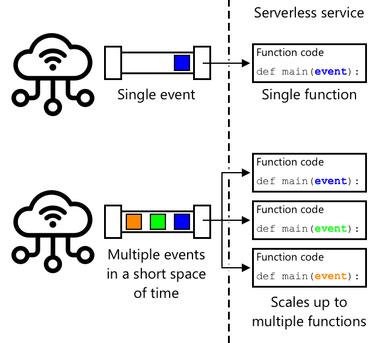

<!--
CO_OP_TRANSLATOR_METADATA:
{
  "original_hash": "5f2d2f4a5a023c93ab34a0cc5b47c0c4",
  "translation_date": "2025-08-28T17:51:28+00:00",
  "source_file": "2-farm/lessons/5-migrate-application-to-the-cloud/README.md",
  "language_code": "my"
}
-->
# သင့်အက်ပလီကေးရှင်း Logic ကို Cloud သို့ ပြောင်းရွှေ့ပါ


> Sketchnote ကို [Nitya Narasimhan](https://github.com/nitya) မှရေးသားထားသည်။ ပုံကို နှိပ်ပြီး ပိုမိုကြီးမားသော ဗားရှင်းကို ကြည့်ပါ။

ဒီသင်ခန်းစာကို [IoT for Beginners Project 2 - Digital Agriculture series](https://youtube.com/playlist?list=PLmsFUfdnGr3yCutmcVg6eAUEfsGiFXgcx) မှ [Microsoft Reactor](https://developer.microsoft.com/reactor/?WT.mc_id=academic-17441-jabenn) တွင် သင်ကြားခဲ့သည်။

[](https://youtu.be/VVZDcs5u1_I)

## သင်ခန်းစာမတိုင်မီ မေးခွန်းများ

[သင်ခန်းစာမတိုင်မီ မေးခွန်းများ](https://black-meadow-040d15503.1.azurestaticapps.net/quiz/17)

## အကျဉ်းချုပ်

ပြီးခဲ့သင်ခန်းစာတွင် သင်သည် သင့်ပန်းမိုင်းစိုထိုင်းမှုကို စောင့်ကြည့်ခြင်းနှင့် relay ကို ထိန်းချုပ်ရန် cloud-based IoT service သို့ ချိတ်ဆက်ပုံကို သင်ယူခဲ့ပါသည်။ နောက်တစ်ဆင့်မှာ relay ကို ထိန်းချုပ်ရန် server code ကို cloud သို့ ပြောင်းရွှေ့ရမည်ဖြစ်သည်။ ဒီသင်ခန်းစာတွင် သင်သည် serverless functions ကို အသုံးပြု၍ အလုပ်လုပ်ပုံကို သင်ယူပါမည်။

ဒီသင်ခန်းစာတွင် ကျော်ဖြတ်မည့်အကြောင်းအရာများမှာ -

* [Serverless ဆိုတာဘာလဲ?](../../../../../2-farm/lessons/5-migrate-application-to-the-cloud)
* [Serverless application တစ်ခုကို ဖန်တီးပါ](../../../../../2-farm/lessons/5-migrate-application-to-the-cloud)
* [IoT Hub event trigger တစ်ခုကို ဖန်တီးပါ](../../../../../2-farm/lessons/5-migrate-application-to-the-cloud)
* [Serverless code မှတစ်ဆင့် direct method requests ပို့ပါ](../../../../../2-farm/lessons/5-migrate-application-to-the-cloud)
* [သင့် serverless code ကို cloud သို့ deploy လုပ်ပါ](../../../../../2-farm/lessons/5-migrate-application-to-the-cloud)

## Serverless ဆိုတာဘာလဲ?

Serverless, သို့မဟုတ် serverless computing ဆိုသည်မှာ အမျိုးမျိုးသော အဖြစ်အပျက်များကို တုံ့ပြန်ရန် cloud တွင် အလုပ်လုပ်သော code အပိုင်းငယ်များကို ဖန်တီးခြင်းဖြစ်သည်။ အဖြစ်အပျက်တစ်ခုဖြစ်ပေါ်သောအခါ သင့် code ကို run လုပ်ပြီး အဖြစ်အပျက်နှင့်ပတ်သက်သော data ကို ပေးပို့သည်။ ဒီအဖြစ်အပျက်များသည် web requests, queue တွင် message ထည့်ခြင်း, database တွင် data ပြောင်းလဲခြင်း, သို့မဟုတ် IoT devices မှ IoT service သို့ message ပို့ခြင်းတို့အပါအဝင် အမျိုးမျိုးသောအရာများဖြစ်နိုင်သည်။


> 💁 Database triggers ကို အသုံးပြုဖူးလျှင်၊ အဖြစ်အပျက်တစ်ခုဖြစ်ပေါ်သောအခါ code ကို run လုပ်ခြင်းအနေနှင့် ယင်းကို တူညီသည်ဟု ထင်နိုင်သည်။



သင့် code သည် အဖြစ်အပျက်တစ်ခုဖြစ်ပေါ်သောအခါတွင်သာ run လုပ်ပြီး အခြားအချိန်များတွင် အသက်မရှိပါ။ အဖြစ်အပျက်ဖြစ်ပေါ်သောအခါ သင့် code ကို load လုပ်ပြီး run လုပ်သည်။ ဒီအရာသည် serverless ကို အလွန် scalable ဖြစ်စေသည် - အဖြစ်အပျက်များစွာ တစ်ချိန်တည်းတွင် ဖြစ်ပေါ်လျှင် cloud provider သည် သင့် function ကို လိုအပ်သလောက် server များတွင် run လုပ်နိုင်သည်။ သို့သော် အဖြစ်အပျက်များအကြား data ကို share လုပ်ရန်လိုအပ်ပါက memory တွင် သိမ်းဆည်းခြင်းမဟုတ်ဘဲ database တစ်ခုတွင် သိမ်းဆည်းရမည်ဖြစ်သည်။

သင့် code ကို အဖြစ်အပျက်နှင့်ပတ်သက်သော အသေးစိတ်အချက်အလက်များကို parameter အနေနှင့် လက်ခံသော function အနေနှင့် ရေးသားရမည်။ Serverless functions များကို ရေးသားရန် programming language များစွာကို အသုံးပြုနိုင်သည်။

> 🎓 Serverless ကို Functions as a service (FaaS) ဟုလည်း ခေါ်ဆိုကြသည်၊ အဖြစ်အပျက် trigger တစ်ခုစီကို code တွင် function အနေနှင့် အကောင်အထည်ဖော်ထားသည်။

Serverless ဆိုသည်မှာ server မရှိဘဲ အလုပ်လုပ်သည်ဟုဆိုသော်လည်း အမှန်တကယ် server များကို အသုံးပြုသည်။ ဒီနာမည်သည် developer အနေနှင့် server များကို စိတ်မဝင်စားဘဲ အဖြစ်အပျက်တစ်ခုဖြစ်ပေါ်သောအခါ သင့် code ကို run လုပ်နိုင်သည်ဟုသာ စိတ်ဝင်စားရန် ဖြစ်သည်။ Cloud provider သည် serverless *runtime* ကို အသုံးပြု၍ server များ, networking, storage, CPU, memory နှင့် သင့် code ကို run လုပ်ရန် လိုအပ်သော အရာအားလုံးကို စီမံခန့်ခွဲသည်။ ဒီမော်ဒယ်သည် server အရေအတွက်အလိုက် မပေးဆောင်ရဘဲ သင့် code run လုပ်နေသောအချိန်နှင့် memory အသုံးပြုမှုအရ ပေးဆောင်ရမည်ဖြစ်သည်။

> 💰 Serverless သည် cloud တွင် code run လုပ်ရန် အစျေးအနည်းဆုံးနည်းလမ်းများထဲမှ တစ်ခုဖြစ်သည်။ ဥပမာအားဖြင့်၊ ယခုအချိန်တွင် cloud provider တစ်ခုသည် သင့် serverless functions အားလုံးကို တစ်လလျှင် ၁,၀၀၀,၀၀၀ ကြိမ် run လုပ်ခွင့်ပေးပြီး၊ ထို့နောက် US$0.20 ကို ၁,၀၀၀,၀၀၀ ကြိမ် run လုပ်မှုအတွက် ကောက်ခံသည်။ သင့် code run မလုပ်နေသောအချိန်တွင် သင်ပေးဆောင်ရန် မလိုအပ်ပါ။

IoT developer အနေနှင့် serverless မော်ဒယ်သည် အလွန်အကျိုးရှိသည်။ သင့် cloud-hosted IoT service သို့ IoT device များမှ ပို့သော message များကို တုံ့ပြန်ရန် function တစ်ခုကို ရေးသားနိုင်သည်။ သင့် code သည် ပို့သော message များအားလုံးကို ကိုင်တွယ်ပေးမည်၊ သို့သော် လိုအပ်သောအခါတွင်သာ run လုပ်မည်။

✅ သင်သည် MQTT မှ message များကို နားထောင်ရန် server code အနေနှင့် ရေးသားထားသော code ကို ပြန်လည်ကြည့်ပါ။ ဒီ code ကို cloud တွင် serverless ဖြင့် run လုပ်ပုံကို သင်ဘယ်လိုထင်ပါသလဲ? Serverless computing ကို ပံ့ပိုးရန် code ကို ဘယ်လိုပြောင်းလဲရမည်ဟု သင်ထင်ပါသလဲ?

> 💁 Serverless မော်ဒယ်သည် code run လုပ်ခြင်းအပြင် cloud services အခြားအရာများသို့လည်း ရွှေ့လျှောက်နေသည်။ ဥပမာအားဖြင့်၊ serverless databases များကို cloud တွင် serverless pricing မော်ဒယ်ဖြင့် ရရှိနိုင်ပြီး database ကို query သို့မဟုတ် insert လုပ်ခြင်းကဲ့သို့သော request တစ်ခုစီအတွက် ပေးဆောင်ရမည်။ Query တစ်ခုကို service လုပ်ရန် လိုအပ်သော အလုပ်ပမာဏအပေါ်မူတည်၍ စျေးနှုန်းကို သတ်မှတ်သည်။ ဥပမာအားဖြင့်၊ primary key အပေါ် row တစ်ခုကို select လုပ်ခြင်းသည် table များစွာကို join လုပ်ပြီး row အထောင်ပေါင်းများစွာကို ပြန်ပေးသော operation ထက် စျေးနည်းပါမည်။

## Serverless application တစ်ခုကို ဖန်တီးပါ

Microsoft မှ serverless computing service ကို Azure Functions ဟုခေါ်သည်။


အောက်ပါ short video တွင် Azure Functions အကြောင်းအရာကို အကျဉ်းချုပ်ထားသည်။

[](https://www.youtube.com/watch?v=8-jz5f_JyEQ)

> 🎥 ပုံကို နှိပ်ပြီး video ကို ကြည့်ပါ

✅ ခဏတာအချိန်ယူပြီး [Microsoft Azure Functions documentation](https://docs.microsoft.com/azure/azure-functions/functions-overview?WT.mc_id=academic-17441-jabenn) တွင် Azure Functions အကြောင်းအရာကို ရှာဖွေဖတ်ရှုပါ။

Azure Functions ကို ရေးသားရန် သင်နှစ်သက်သော programming language ဖြင့် Azure Functions app ကို စတင်ရမည်။ Azure Functions သည် Python, JavaScript, TypeScript, C#, F#, Java, နှင့် Powershell ကို အထောက်အပံ့ပေးသည်။ ဒီသင်ခန်းစာတွင် သင်သည် Python ဖြင့် Azure Functions app ရေးသားပုံကို သင်ယူပါမည်။

> 💁 Azure Functions သည် custom handlers ကိုလည်း အထောက်အပံ့ပေးပြီး HTTP requests ကို ပံ့ပိုးသော ဘာသာစကားများအားလုံးဖြင့် functions များကို ရေးသားနိုင်သည်။ COBOL ကဲ့သို့သော အဟောင်းဘာသာစကားများကိုလည်း အသုံးပြုနိုင်သည်။

Functions app တွင် *triggers* များစွာ ပါဝင်နိုင်သည် - အဖြစ်အပျက်များကို တုံ့ပြန်သော functions များဖြစ်သည်။ Functions app တစ်ခုတွင် triggers များစွာ ပါဝင်နိုင်ပြီး shared configuration ကို အသုံးပြုနိုင်သည်။ ဥပမာအားဖြင့်၊ Functions app ၏ configuration ဖိုင်တွင် IoT Hub ၏ connection details ကို ထည့်သွင်းနိုင်ပြီး app ၏ functions အားလုံးသည် ယင်းကို အသုံးပြု၍ ချိတ်ဆက်ပြီး အဖြစ်အပျက်များကို နားထောင်နိုင်သည်။

### Task - Azure Functions tooling ကို install လုပ်ပါ

> ယခုအချိန်တွင် Apple Silicon တွင် Python projects အတွက် Azure Functions code tools များ အပြည့်အဝ အလုပ်မလုပ်သေးပါ။ Intel-based Mac, Windows PC, သို့မဟုတ် Linux PC ကို အသုံးပြုရန် လိုအပ်ပါသည်။

Azure Functions ၏ အားသာချက်တစ်ခုမှာ local တွင် run လုပ်နိုင်ခြင်းဖြစ်သည်။ Cloud တွင် အသုံးပြုသော runtime ကို သင့်ကွန်ပျူတာတွင် run လုပ်နိုင်ပြီး IoT messages များကို တုံ့ပြန်သော code ကို ရေးသားနိုင်သည်။ သင့် code ကို debug လုပ်နိုင်ပြီး အားလုံးအဆင်ပြေသည်ဟု သင့်တည်ကြည်မှုရှိသောအခါ cloud သို့ deploy လုပ်နိုင်သည်။

Azure Functions tooling သည် CLI အနေနှင့် ရရှိနိုင်ပြီး Azure Functions Core Tools ဟုခေါ်သည်။

1. Azure Functions core tools ကို install လုပ်ရန် [Azure Functions Core Tools documentation](https://docs.microsoft.com/azure/azure-functions/functions-run-local?WT.mc_id=academic-17441-jabenn) တွင် လမ်းညွှန်ချက်များကို လိုက်နာပါ။

1. VS Code အတွက် Azure Functions extension ကို install လုပ်ပါ။ ဒီ extension သည် Azure functions များကို ဖန်တီးခြင်း၊ debug လုပ်ခြင်းနှင့် deploy လုပ်ခြင်းအတွက် အထောက်အပံ့ပေးသည်။ VS Code တွင် extension ကို install လုပ်ရန် [Azure Functions extension documentation](https://marketplace.visualstudio.com/items?WT.mc_id=academic-17441-jabenn&itemName=ms-azuretools.vscode-azurefunctions) ကို ရည်ညွှန်းပါ။

Azure Functions app ကို cloud သို့ deploy လုပ်သောအခါ၊ application files နှင့် log files ကဲ့သို့သော အရာများကို သိမ်းဆည်းရန် cloud storage အနည်းငယ်ကို အသုံးပြုရန် လိုအပ်သည်။ Functions app ကို local တွင် run လုပ်သောအခါ cloud storage ကို ချိတ်ဆက်ရန် လိုအပ်သော်လည်း၊ actual cloud storage ကို အသုံးပြုခြင်းမဟုတ်ဘဲ [Azurite](https://github.com/Azure/Azurite) ဟုခေါ်သော storage emulator ကို အသုံးပြုနိုင်သည်။ Azurite သည် local တွင် run လုပ်သော်လည်း cloud storage ကဲ့သို့ အလုပ်လုပ်သည်။

> 🎓 Azure တွင် Azure Functions သုံးသော storage ကို Azure Storage Account ဟုခေါ်သည်။ ဒီ accounts တွင် files, blobs, tables တွင် data သို့မဟုတ် queues တွင် data ကို သိမ်းဆည်းနိုင်သည်။ Storage account တစ်ခုကို Functions app နှင့် web app ကဲ့သို့သော apps များစွာအတွက် share လုပ်နိုင်သည်။

1. Azurite သည် Node.js app ဖြစ်သောကြောင့် Node.js ကို install လုပ်ရန် လိုအပ်သည်။ [Node.js website](https://nodejs.org/) တွင် download နှင့် installation လမ်းညွှန်ချက်များကို ရှာဖွေပါ။ Mac အသုံးပြုပါက [Homebrew](https://formulae.brew.sh/formula/node) မှ install လုပ်နိုင်သည်။

1. အောက်ပါ command ကို အသုံးပြု၍ Azurite ကို install လုပ်ပါ (`npm` သည် Node.js install လုပ်သောအခါ install လုပ်ထားသော tool ဖြစ်သည်):

    ```sh
    npm install -g azurite
    ```

1. Azurite data ကို သိမ်းဆည်းရန် `azurite` ဟုခေါ်သော folder တစ်ခုကို ဖန်တီးပါ:

    ```sh
    mkdir azurite
    ```

1. Azurite ကို run လုပ်ပြီး folder ကို pass လုပ်ပါ:

    ```sh
    azurite --location azurite
    ```

    Azurite storage emulator သည် launch လုပ်ပြီး local Functions runtime ကို ချိတ်ဆက်ရန် အသင့်ဖြစ်မည်။

    ```output
    ➜  ~ azurite --location azurite  
    Azurite Blob service is starting at http://127.0.0.1:10000
    Azurite Blob service is successfully listening at http://127.0.0.1:10000
    Azurite Queue service is starting at http://127.0.0.1:10001
    Azurite Queue service is successfully listening at http://127.0.0.1:10001
    Azurite Table service is starting at http://127.0.0.1:10002
    Azurite Table service is successfully listening at http://127.0.0.1:10002
    ```

### Task - Azure Functions project တစ်ခုကို ဖန်တီးပါ

Azure Functions CLI ကို အသုံးပြု၍ Functions app အသစ်တစ်ခုကို ဖန်တီးနိုင်သည်။

1. Functions app အတွက် folder တစ်ခုကို ဖန်တီးပြီး သို့သွားပါ။ `soil-moisture-trigger` ဟုခေါ်ပါ:

    ```sh
    mkdir soil-moisture-trigger
    cd soil-moisture-trigger
    ```

1. Python virtual environment ကို folder အတွင်းဖန်တီးပါ:

    ```sh
    python3 -m venv .venv
    ```

1. Virtual environment ကို activate လုပ်ပါ:

    * Windows တွင်:
        * Command Prompt သို့မဟုတ် Windows Terminal မှ Command Prompt ကို အသုံးပြုပါက အောက်ပါ command ကို run လုပ်ပါ:

            ```cmd
            .venv\Scripts\activate.bat
            ```

        * PowerShell ကို အသုံးပြုပါက အောက်ပါ command ကို run လုပ်ပါ:

            ```powershell
            .\.venv\Scripts\Activate.ps1
            ```

    * macOS သို့မဟုတ် Linux တွင် အောက်ပါ command ကို run လုပ်ပါ:

        ```cmd
        source ./.venv/bin/activate
        ```

    > 💁 ဒီ commands များကို virtual environment ဖန်တီးသောနေရာတွင် run လုပ်ရမည်။ `.venv` folder အတွင်းသို့ သွားရန် မလိုအပ်ပါ။ Activate command နှင့် package install လုပ်ရန် commands များကို virtual environment ဖန်တီးသော folder တွင် run လုပ်ပါ။

1. Functions app ကို ဖန်တီးရန် အောက်ပါ command ကို run လုပ်ပါ:

    ```sh
    func init --worker-runtime python soil-moisture-trigger
    ```

    ဒီ command သည် current folder အတွင်း ဖိုင်သုံးခုကို ဖန်တီးမည်:

    * `host.json` - ဒီ JSON document တွင် Functions app ၏ settings များပါဝင်သည်။ ဒီ settings များကို ပြောင်းလဲရန် မလိုအပ်ပါ။
    * `local.settings.json` - ဒီ JSON document တွင် IoT Hub ၏ connection strings ကဲ့သို့သော local settings များပါဝင်သည်။ ဒီ settings များသည် local settings ဖြစ်ပြီး source code control သို့ ထည့်သွင်းရန် မလိုအပ်ပါ။ Functions app ကို cloud သို့ deploy လုပ်သောအခါ၊ ဒီ settings များကို deploy မလုပ်ပါ၊ application settings မှ settings များကို load လုပ်မည်။ ဒီအကြောင်းအရာကို ဒီသင်ခန်းစာတွင် နောက်ပိုင်းတွင် ဖော်ပြမည်။
    * `requirements.txt` - ဒီဖိုင်သည် [Pip requirements file](https://pip.pypa.io/en/stable/user_guide/#requirements-files) ဖြစ်ပြီး Functions app ကို run လုပ်ရန်လိုအပ်သော Pip packages များပါဝင်သည်။

1. `local.settings.json` ဖိုင်တွင် Functions app သုံးသော storage account setting ပါဝင်သည်။ Default အနေဖြင့် setting သည်
> ⚠️ အကယ်၍ firewall အကြောင်းကြားစာရောက်လာပါက `func` အက်ပလီကေးရှင်းသည် သင့်ကွန်ယက်ကို ဖတ်ရန်နှင့် ရေးရန် လိုအပ်သော ခွင့်ပြုချက်များ လိုအပ်နေသောကြောင့် ခွင့်ပြုပါ။
> ⚠️ macOS အသုံးပြုနေပါက အောက်ပါအချက်များကို တွေ့နိုင်ပါသည်:
>
> ```output
    > (.venv) ➜  soil-moisture-trigger func start
    > Found Python version 3.9.1 (python3).
    >
    > Azure Functions Core Tools
    > Core Tools Version:       3.0.3442 Commit hash: 6bfab24b2743f8421475d996402c398d2fe4a9e0  (64-bit)
    > Function Runtime Version: 3.0.15417.0
    >
    > [2021-06-16T08:18:28.315Z] Cannot create directory for shared memory usage: /dev/shm/AzureFunctions
    > [2021-06-16T08:18:28.316Z] System.IO.FileSystem: Access to the path '/dev/shm/AzureFunctions' is denied. Operation not permitted.
    > [2021-06-16T08:18:30.361Z] No job functions found.
    > ```
>
> Functions app သည် မှန်ကန်စွာ စတင်ပြီး လုပ်ဆောင်နေသော functions များကို ပြသနိုင်ပါက အချက်အလက်များကို လျစ်လျူရှုနိုင်ပါသည်။ Microsoft Docs Q&A တွင် [ဤမေးခွန်း](https://docs.microsoft.com/answers/questions/396617/azure-functions-core-tools-error-osx-devshmazurefu.html?WT.mc_id=academic-17441-jabenn) တွင် ဖော်ပြထားသည့်အတိုင်း ဤအချက်များကို လျစ်လျူရှုနိုင်ပါသည်။

1. `ctrl+c` ကို နှိပ်၍ Functions app ကို ရပ်တန့်ပါ။

1. VS Code တွင် လက်ရှိဖိုလ်ဒါကို ဖွင့်ပါ။ VS Code ကို ဖွင့်ပြီး ဖိုလ်ဒါကို ဖွင့်ခြင်းဖြစ်စေ၊ သို့မဟုတ် အောက်ပါ command ကို အသုံးပြု၍ ဖွင့်ပါ:

    ```sh
    code .
    ```

    VS Code သည် Functions project ကို ရှာဖွေပြီး အောက်ပါ အကြောင်းကြားချက်ကို ပြသပါမည်:

    ```output
    Detected an Azure Functions Project in folder "soil-moisture-trigger" that may have been created outside of
    VS Code. Initialize for optimal use with VS Code?
    ```

    

    ဤအကြောင်းကြားချက်မှ **Yes** ကို ရွေးချယ်ပါ။

1. VS Code terminal တွင် Python virtual environment ကို အလုပ်လုပ်နေကြောင်း သေချာပါစေ။ လိုအပ်ပါက ရပ်တန့်ပြီး ပြန်စတင်ပါ။

## IoT Hub အဖြစ်မှန်ဖြစ်မှု trigger တစ်ခု ဖန်တီးပါ

Functions app သည် သင့် serverless code ၏ shell ဖြစ်သည်။ IoT Hub မှ အဖြစ်မှန်ဖြစ်မှုများကို တုံ့ပြန်ရန်၊ ဤ app တွင် IoT Hub trigger တစ်ခု ထည့်သွင်းနိုင်သည်။ ဤ trigger သည် IoT Hub သို့ ပေးပို့သော စာတိုများ၏ စီးဆင်းမှုနှင့် ချိတ်ဆက်ပြီး၊ ထိုစာတိုများကို တုံ့ပြန်ရန် လိုအပ်သည်။ စာတိုများ၏ စီးဆင်းမှုကို ရရှိရန်၊ trigger သည် IoT Hub ၏ *event hub compatible endpoint* နှင့် ချိတ်ဆက်ရန် လိုအပ်သည်။

IoT Hub သည် Azure Event Hubs ဟုခေါ်သော အခြား Azure ဝန်ဆောင်မှုတစ်ခုအပေါ် အခြေခံထားသည်။ Event Hubs သည် စာတိုများကို ပေးပို့ခြင်းနှင့် လက်ခံခြင်းကို ခွင့်ပြုသည့် ဝန်ဆောင်မှုဖြစ်သည်။ IoT Hub သည် IoT စက်ပစ္စည်းများအတွက် အထူးအင်္ဂါရပ်များကို ထည့်သွင်းရန် ထိုဝန်ဆောင်မှုကို တိုးချဲ့ထားသည်။ IoT Hub မှ စာတိုများကို ဖတ်ရန် ချိတ်ဆက်ပုံသည် Event Hubs ကို အသုံးပြုသည့်အခါနှင့် တူသည်။

✅ သုတေသနလုပ်ပါ: [Azure Event Hubs documentation](https://docs.microsoft.com/azure/event-hubs/event-hubs-about?WT.mc_id=academic-17441-jabenn) တွင် Event Hubs ၏ အကျဉ်းချုပ်ကို ဖတ်ပါ။ အခြေခံအင်္ဂါရပ်များသည် IoT Hub နှင့် ဘယ်လို နှိုင်းယှဉ်နိုင်သလဲ?

IoT စက်ပစ္စည်းတစ်ခုသည် IoT Hub နှင့် ချိတ်ဆက်ရန်၊ ခွင့်ပြုထားသော စက်ပစ္စည်းများသာ ချိတ်ဆက်နိုင်စေရန် လျှို့ဝှက်သော key တစ်ခုကို အသုံးပြုရမည်ဖြစ်သည်။ စာတိုများကို ဖတ်ရန် ချိတ်ဆက်သောအခါတွင်လည်း ထိုအရာကို အတူတူ လိုအပ်သည်။ သင့် code သည် IoT Hub ၏ အသေးစိတ်အချက်အလက်များနှင့်အတူ လျှို့ဝှက်သော key ပါဝင်သည့် connection string တစ်ခု လိုအပ်မည်ဖြစ်သည်။

> 💁 သင်ရရှိသည့် ပုံမှန် connection string တွင် **iothubowner** ခွင့်ပြုချက်များ ပါဝင်ပြီး၊ ထို connection string ကို အသုံးပြုသည့် code မည်သည့်အရာကိုမဆို IoT Hub တွင် ပြုလုပ်နိုင်သည်။ အကောင်းဆုံးအားဖြင့် လိုအပ်သည့် အနိမ့်ဆုံး ခွင့်ပြုချက်များဖြင့် ချိတ်ဆက်သင့်သည်။ ဤအကြောင်းအရာကို နောက်ဆင့်သင်ခန်းစာတွင် ဖော်ပြပါမည်။

Trigger သည် ချိတ်ဆက်ပြီးနောက်၊ IoT Hub သို့ ပေးပို့သည့် စာတိုတစ်ခုစီအတွက် function အတွင်းရှိ code ကို ခေါ်ပါမည်။ Trigger သည် စာတိုကို parameter အဖြစ် ပေးပို့ပါမည်။

### Task - Event Hub compatible endpoint connection string ရယူပါ

1. VS Code terminal မှ အောက်ပါ command ကို run လုပ်၍ IoT Hub ၏ Event Hub compatible endpoint အတွက် connection string ကို ရယူပါ:

    ```sh
    az iot hub connection-string show --default-eventhub \
                                      --output table \
                                      --hub-name <hub_name>
    ```

    `<hub_name>` ကို သင် IoT Hub အတွက် အသုံးပြုသည့် အမည်ဖြင့် အစားထိုးပါ။

1. VS Code တွင် `local.settings.json` ဖိုင်ကို ဖွင့်ပါ။ `Values` အပိုင်းအတွင်း အောက်ပါ တန်ဖိုးအသစ်ကို ထည့်ပါ:

    ```json
    "IOT_HUB_CONNECTION_STRING": "<connection string>"
    ```

    `<connection string>` ကို ယခင်အဆင့်မှ ရရှိသည့် တန်ဖိုးဖြင့် အစားထိုးပါ။ JSON သက်မှတ်ထားမှုအတွက် အထက်တန်းတွင် comma တစ်ခု ထည့်ရန် လိုအပ်ပါမည်။

### Task - Event trigger တစ်ခု ဖန်တီးပါ

1. `soil-moisture-trigger` ဖိုလ်ဒါအတွင်းမှ VS Code terminal တွင် အောက်ပါ command ကို run လုပ်ပါ:

    ```sh
    func new --name iot-hub-trigger --template "Azure Event Hub trigger"
    ```

    ဤအရာသည် `iot-hub-trigger` ဟုခေါ်သော Function အသစ်တစ်ခု ဖန်တီးပါမည်။ Trigger သည် IoT Hub ၏ Event Hub compatible endpoint နှင့် ချိတ်ဆက်မည်ဖြစ်သည်၊ ထို့ကြောင့် Event Hub trigger ကို အသုံးပြုနိုင်သည်။ IoT Hub အတွက် သီးသန့် trigger မရှိပါ။

ဤအရာသည် `soil-moisture-trigger` ဖိုလ်ဒါအတွင်း `iot-hub-trigger` ဟုခေါ်သော ဖိုလ်ဒါတစ်ခု ဖန်တီးမည်။ ထိုဖိုလ်ဒါတွင် အောက်ပါ ဖိုင်များ ပါဝင်မည်:

* `__init__.py` - Python code ဖိုင်ဖြစ်ပြီး၊ trigger ကို ပါဝင်သည်။ Python module အဖြစ် ဖိုလ်ဒါကို သတ်မှတ်ရန် စံနာမည် convention ကို အသုံးပြုသည်။

    ```python
    import logging

    import azure.functions as func


    def main(event: func.EventHubEvent):
        logging.info('Python EventHub trigger processed an event: %s',
                    event.get_body().decode('utf-8'))
    ```

    Trigger ၏ အဓိကအချက်မှာ `main` function ဖြစ်သည်။ IoT Hub မှ အဖြစ်မှန်ဖြစ်မှုများနှင့်အတူ function ကို ခေါ်ပါမည်။ Function ၏ parameter `event` သည် `EventHubEvent` ကို ပါဝင်သည်။ IoT Hub သို့ စာတိုတစ်ခု ပေးပို့သည့်အခါ၊ function ကို ခေါ်ပြီး၊ ထိုစာတိုကို `event` အဖြစ် ပေးပို့ပါမည်။

    Function ၏ အဓိကအချက်မှာ event ကို log လုပ်ခြင်းဖြစ်သည်။

* `function.json` - Trigger အတွက် configuration ကို ပါဝင်သည်။ Configuration ၏ အဓိကအပိုင်းမှာ `bindings` ဟုခေါ်သော အပိုင်းဖြစ်သည်။ Binding သည် Azure Functions နှင့် အခြား Azure ဝန်ဆောင်မှုများအကြား ချိတ်ဆက်မှုအတွက် အသုံးပြုသော term ဖြစ်သည်။ Function ၏ input binding သည် event hub နှင့် ချိတ်ဆက်ပြီး၊ data ကို လက်ခံသည်။

    > 💁 Output bindings ကိုလည်း ထည့်သွင်းနိုင်ပြီး၊ function ၏ output ကို အခြားဝန်ဆောင်မှုသို့ ပေးပို့နိုင်သည်။ ဥပမာအားဖြင့် database သို့ output binding တစ်ခု ထည့်သွင်းပြီး၊ IoT Hub event ကို function မှ ပြန်ပေးပို့နိုင်သည်။

    ✅ သုတေသနလုပ်ပါ: [Azure Functions triggers and bindings concepts documentation](https://docs.microsoft.com/azure/azure-functions/functions-triggers-bindings?WT.mc_id=academic-17441-jabenn&tabs=python) တွင် bindings အကြောင်းကို ဖတ်ပါ။

    `bindings` အပိုင်းတွင် စိတ်ဝင်စားစရာ configuration များမှာ:

  * `"type": "eventHubTrigger"` - Function သည် Event Hub မှ အဖြစ်မှန်ဖြစ်မှုများကို နားထောင်ရန် လိုအပ်ကြောင်း ပြောသည်
  * `"name": "events"` - Event Hub events အတွက် parameter အမည်ဖြစ်သည်။ Python code ၏ `main` function တွင် parameter အမည်နှင့် ကိုက်ညီသည်။
  * `"direction": "in"` - Input binding ဖြစ်သည်၊ event hub မှ data ကို function သို့ ဝင်သည်
  * `"connection": ""` - Connection string ကို ဖတ်ရန် setting ၏ အမည်ကို သတ်မှတ်သည်။ Local တွင် run လုပ်သောအခါ၊ ဤ setting ကို `local.settings.json` ဖိုင်မှ ဖတ်မည်။

    > 💁 Connection string ကို `function.json` ဖိုင်တွင် သိမ်းဆည်း၍ မရပါ၊ settings မှ ဖတ်ရမည်။ Connection string ကို မတော်တဆ ဖော်ထုတ်မိခြင်းမှ ကာကွယ်ရန် ဖြစ်သည်။

1. Azure Functions template ၏ [bug တစ်ခု](https://github.com/Azure/azure-functions-templates/issues/1250) ကြောင့် `function.json` တွင် `cardinality` field အတွက် မှားယွင်းသော တန်ဖိုးရှိသည်။ `many` ကို `one` သို့ ပြောင်းပါ:

    ```json
    "cardinality": "one",
    ```

1. `function.json` ဖိုင်တွင် `"connection"` ၏ တန်ဖိုးကို `local.settings.json` ဖိုင်တွင် ထည့်သွင်းထားသည့် တန်ဖိုးသို့ ပြောင်းပါ:

    ```json
    "connection": "IOT_HUB_CONNECTION_STRING",
    ```

    > 💁 သတိပြုပါ - ဤအရာသည် setting ကို ညွှန်းရမည်ဖြစ်ပြီး၊ တကယ့် connection string ကို မပါဝင်ရပါ။

1. Connection string တွင် `eventHubName` တန်ဖိုးပါဝင်သည်၊ ထို့ကြောင့် `function.json` ဖိုင်တွင် ဤတန်ဖိုးကို ဖျက်ရန် လိုအပ်သည်။ ဤတန်ဖိုးကို အလွတ် string သို့ ပြောင်းပါ:

    ```json
    "eventHubName": "",
    ```

### Task - Event trigger ကို run လုပ်ပါ

1. IoT Hub event monitor ကို မ run လုပ်ထားကြောင်း သေချာပါစေ။ Functions app နှင့် တစ်ချိန်တည်းတွင် run လုပ်ပါက၊ Functions app သည် events များကို ချိတ်ဆက်၍ လက်ခံ၍ မရနိုင်ပါ။

    > 💁 အမျိုးမျိုးသော apps များသည် IoT Hub endpoints သို့ *consumer groups* မတူကွဲပြားစွာ အသုံးပြု၍ ချိတ်ဆက်နိုင်သည်။ ဤအကြောင်းအရာကို နောက်ဆင့်သင်ခန်းစာတွင် ဖော်ပြပါမည်။

1. Functions app ကို run လုပ်ရန်၊ VS Code terminal မှ အောက်ပါ command ကို run လုပ်ပါ:

    ```sh
    func start
    ```

    Functions app သည် စတင်ပြီး၊ `iot-hub-trigger` function ကို ရှာဖွေပါမည်။ ထို့နောက် IoT Hub သို့ နောက်ဆုံးတစ်ရက်အတွင်း ပေးပို့ထားသည့် events များကို လုပ်ဆောင်ပါမည်။

    ```output
    (.venv) ➜  soil-moisture-trigger func start
    Found Python version 3.9.1 (python3).
    
    Azure Functions Core Tools
    Core Tools Version:       3.0.3442 Commit hash: 6bfab24b2743f8421475d996402c398d2fe4a9e0  (64-bit)
    Function Runtime Version: 3.0.15417.0
    
    Functions:
    
            iot-hub-trigger: eventHubTrigger
    
    For detailed output, run func with --verbose flag.
    [2021-05-05T02:44:07.517Z] Worker process started and initialized.
    [2021-05-05T02:44:09.202Z] Executing 'Functions.iot-hub-trigger' (Reason='(null)', Id=802803a5-eae9-4401-a1f4-176631456ce4)
    [2021-05-05T02:44:09.205Z] Trigger Details: PartitionId: 0, Offset: 1011240-1011632, EnqueueTimeUtc: 2021-05-04T19:04:04.2030000Z-2021-05-04T19:04:04.3900000Z, SequenceNumber: 2546-2547, Count: 2
    [2021-05-05T02:44:09.352Z] Python EventHub trigger processed an event: {"soil_moisture":628}
    [2021-05-05T02:44:09.354Z] Python EventHub trigger processed an event: {"soil_moisture":624}
    [2021-05-05T02:44:09.395Z] Executed 'Functions.iot-hub-trigger' (Succeeded, Id=802803a5-eae9-4401-a1f4-176631456ce4, Duration=245ms)
    ```

    Function တစ်ခုစီကို ခေါ်သည့်အခါ၊ output တွင် `Executing 'Functions.iot-hub-trigger'`/`Executed 'Functions.iot-hub-trigger'` block ဖြင့် ပတ်လည်နေပါမည်။ Function call တစ်ခုစီတွင် မည်မျှ messages ကို လုပ်ဆောင်ခဲ့သည်ကို ကြည့်နိုင်ပါသည်။

1. သင့် IoT စက်ပစ္စည်းကို run လုပ်ထားကြောင်း သေချာပါစေ။ Functions app တွင် အသစ်သော soil moisture messages များကို တွေ့နိုင်ပါမည်။

1. Functions app ကို ရပ်တန့်ပြီး ပြန်စတင်ပါ။ ယခင် messages များကို ပြန်လည် လုပ်ဆောင်မည်မဟုတ်ပါ၊ အသစ်သော messages များကိုသာ လုပ်ဆောင်ပါမည်။

> 💁 VS Code သည် Functions များကို debugging လုပ်ရန်လည်း ပံ့ပိုးသည်။ Code တစ်ကြောင်းစီ၏ အစတွင် border ကို နှိပ်ခြင်းဖြင့် သို့မဟုတ် cursor ကို code တစ်ကြောင်းတွင်ထားပြီး *Run -> Toggle breakpoint* ကို ရွေးခြင်းဖြင့်၊ သို့မဟုတ် `F9` ကို နှိပ်ခြင်းဖြင့် break points သတ်မှတ်နိုင်သည်။ Debugger ကို *Run -> Start debugging* ကို ရွေးခြင်း၊ `F5` ကို နှိပ်ခြင်း၊ သို့မဟုတ် *Run and debug* pane ကို ရွေးပြီး **Start debugging** ခလုတ်ကို နှိပ်ခြင်းဖြင့် စတင်နိုင်သည်။ Debugging လုပ်ခြင်းဖြင့် လုပ်ဆောင်နေသော events ၏ အသေးစိတ်ကို ကြည့်နိုင်သည်။

#### Troubleshooting

* အောက်ပါ error ကို တွေ့ပါက:

    ```output
    The listener for function 'Functions.iot-hub-trigger' was unable to start. Microsoft.WindowsAzure.Storage: Connection refused. System.Net.Http: Connection refused. System.Private.CoreLib: Connection refused.
    ```

    Azurite သည် run လုပ်နေကြောင်းနှင့် `local.settings.json` ဖိုင်တွင် `AzureWebJobsStorage` ကို `UseDevelopmentStorage=true` သတ်မှတ်ထားကြောင်း စစ်ဆေးပါ။

* အောက်ပါ error ကို တွေ့ပါက:

    ```output
    System.Private.CoreLib: Exception while executing function: Functions.iot-hub-trigger. System.Private.CoreLib: Result: Failure Exception: AttributeError: 'list' object has no attribute 'get_body'
    ```

    `function.json` ဖိုင်တွင် `cardinality` ကို `one` သတ်မှတ်ထားကြောင်း စစ်ဆေးပါ။

* အောက်ပါ error ကို တွေ့ပါက:

    ```output
    Azure.Messaging.EventHubs: The path to an Event Hub may be specified as part of the connection string or as a separate value, but not both.  Please verify that your connection string does not have the `EntityPath` token if you are passing an explicit Event Hub name. (Parameter 'connectionString').
    ```

    `function.json` ဖိုင်တွင် `eventHubName` ကို အလွတ် string သတ်မှတ်ထားကြောင်း စစ်ဆေးပါ။

## Serverless code မှ တိုက်ရိုက် method requests ပေးပို့ပါ

ယခုအချိန်တွင် Functions app သည် IoT Hub ၏ Event Hub compatible endpoint ကို အသုံးပြု၍ messages များကို နားထောင်နေသည်။ ယခု သင့် IoT စက်ပစ္စည်းသို့ command များ ပေးပို့ရန် လိုအပ်သည်။ ဤအရာကို IoT Hub သို့ ချိတ်ဆက်ရန် *Registry Manager* ကို အသုံးပြု၍ ပြုလုပ်သည်။ Registry Manager သည် IoT Hub တွင် မှတ်ပုံတင်ထားသော စက်ပစ္စည်းများကို ကြည့်ရှုရန်၊ cloud-to-device messages, direct method requests, သို့မဟုတ် device twin ကို update ပြုလုပ်ရန် ခွင့်ပြုသည်။ IoT Hub မှ စက်ပစ္စည်းများကို မှတ်ပုံတင်ခြင်း၊ update ပြုလုပ်ခြင်း သို့မဟုတ် ဖျက်ခြင်းကိုလည်း ပြုလုပ်နိုင်သည်။

Registry Manager သို့ ချိတ်ဆက်ရန် connection string တစ်ခု လိုအပ်သည်။

### Task - Registry Manager connection string ရယူပါ

1. Connection string ရယူရန် အောက်ပါ command ကို run လုပ်ပါ:

    ```sh
    az iot hub connection-string show --policy-name service \
                                      --output table \
                                      --hub-name <hub_name>
    ```

    `<hub_name>` ကို သင် IoT Hub အတွက် အသုံးပြုသည့် အမည်ဖြင့် အစားထိုးပါ။

    Connection string ကို *ServiceConnect* policy အတွက် `--policy-name service` parameter ဖြင့် တောင်းဆိုသည်။ Connection string တောင်းဆိုသည့်အခါ၊ connection string သည် မည်သည့်ခွင့်ပြုချက်များကို ခွင့်ပြုမည်ကို သတ်မှတ်နိုင်သည်။ ServiceConnect policy သည် IoT စက်ပစ္စည်းများသို့ messages ပေးပို့ရန် သင့် code ကို ခွင့်ပြုသည်။

    ✅ သုတေသနလုပ်ပါ: [IoT Hub permissions documentation](https://docs.microsoft.com/azure/iot-hub/iot-hub-devguide-security#iot-hub-permissions?WT.mc_id=academic-17441-jabenn) တွင် policies များအကြောင်း ဖတ်ပါ။

1. VS Code တွင် `local.settings.json` ဖိုင်ကို ဖွင့်ပါ။ `Values` အပိုင်းအတွင်း အောက်ပါ တန်ဖိုးအသစ်ကို ထည့်ပါ:

    ```json
    "REGISTRY_MANAGER_CONNECTION_STRING": "<connection string>"
    ```

    `<connection string>` ကို ယခင်အဆင့်မှ ရရှိသည့် တန်ဖိုးဖြင့် အစားထိုးပါ။ JSON သက်မှတ်ထားမှုအတွက် အထက်တန်းတွင် comma တစ်ခု ထည့်ရန် လိုအပ်ပါမည်။

### Task - စက်ပစ္စည်းသို့ တိုက်ရိုက် method request ပေးပို့ပါ

1. Registry Manager အတွက် SDK သည် Pip package မှတဆင့် ရရှိနိုင်သည်။ `requirements.txt` ဖိုင်တွင် အောက်ပါလိုင်းကို ထည့်ပါ:

    ```sh
    azure-iot-hub
    ```

1. VS Code terminal တွင် virtual environment ကို အလုပ်လုပ်နေကြောင်း သေချာပါစေ၊ အောက်ပါ command ကို run လုပ်၍ Pip packages များကို install လုပ်ပါ:

    ```sh
    pip install -r requirements.txt
    ```

1. `__init__.py` ဖိုင်တွင် အောက်ပါ imports များကို ထည့်ပါ:

    ```python
    import json
    import os
    from azure.iot.hub import IoTHubRegistryManager
    from azure.iot.hub.models import CloudToDeviceMethod
    ```

   
ဒီကုဒ်က `local.settings.json` ဖိုင်ထဲက `REGISTRY_MANAGER_CONNECTION_STRING` ကို load လုပ်ပါတယ်။ ဒီဖိုင်ထဲက အတန့်အတန့်တန်ဖိုးတွေကို ပတ်ဝန်းကျင် variable အနေနဲ့ အသုံးပြုနိုင်ပြီး၊ `os.environ` function ကို အသုံးပြုပြီး ဖတ်ရှုနိုင်ပါတယ်။ ဒီ function က ပတ်ဝန်းကျင် variable တွေကို dictionary အနေနဲ့ ပြန်ပေးပါတယ်။

> 💁 ဒီကုဒ်ကို cloud ပေါ်မှာ deploy လုပ်တဲ့အခါ `local.settings.json` ဖိုင်ထဲက တန်ဖိုးတွေကို *Application Settings* အနေနဲ့ သတ်မှတ်ပြီး၊ ပတ်ဝန်းကျင် variable တွေကနေ ဖတ်ရှုနိုင်ပါတယ်။

ဒီကုဒ်က connection string ကို အသုံးပြုပြီး Registry Manager helper class ရဲ့ instance တစ်ခုကို ဖန်တီးပါတယ်။

1. ဒီအောက်မှာ အောက်ပါကုဒ်ကို ထည့်ပါ:

    ```python
    registry_manager.invoke_device_method(device_id, direct_method)

    logging.info('Direct method request sent!')
    ```

    ဒီကုဒ်က registry manager ကို telemetry ပေးပို့တဲ့ device ကို direct method request ပေးပို့ဖို့ ပြောပါတယ်။

    > 💁 အရင်စာရင်းတွေမှာ MQTT ကို အသုံးပြုပြီး relay control command တွေကို device အားလုံးကို ပေးပို့ခဲ့ပါတယ်။ ဒီကုဒ်က device တစ်ခုကိုသာ method request ပေးပို့တာဖြစ်ပြီး၊ moisture sensor နဲ့ relay setup အများကြီးရှိတဲ့အခါမှာ တိကျတဲ့ device ကို request ပေးပို့နိုင်ပါတယ်။

1. Functions app ကို run လုပ်ပြီး၊ IoT device က data ပေးပို့နေကြောင်း သေချာပါ။ Messages တွေ process လုပ်ပြီး direct method request ပေးပို့တာကို တွေ့ရပါမယ်။ Soil moisture sensor ကို မြေထဲထိုးပြီးထုတ်တာနဲ့ value တွေပြောင်းပြီး relay on/off ဖြစ်တာကို တွေ့ရပါမယ်။

> 💁 ဒီကုဒ်ကို [code/functions](../../../../../2-farm/lessons/5-migrate-application-to-the-cloud/code/functions) folder မှာ တွေ့နိုင်ပါတယ်။

## Serverless Code ကို Cloud ပေါ်မှာ Deploy လုပ်ပါ

ကုဒ်ကို local မှာ အလုပ်လုပ်နေပြီဆိုတော့ Functions App ကို cloud ပေါ်မှာ deploy လုပ်ဖို့ နောက်တစ်ဆင့်လုပ်ဆောင်ရပါမယ်။

### Task - Cloud Resources ဖန်တီးပါ

Functions app ကို Azure မှာ Functions App resource အနေနဲ့ deploy လုပ်ဖို့လိုပါတယ်၊ ဒါဟာ IoT Hub အတွက် ဖန်တီးထားတဲ့ Resource Group အတွင်းမှာရှိရပါမယ်။ Local မှာ run လုပ်နေတဲ့ emulated storage ကို အစားထိုးဖို့ Azure မှာ Storage Account တစ်ခုလည်း ဖန်တီးဖို့လိုပါတယ်။

1. Storage account ဖန်တီးဖို့ အောက်ပါ command ကို run လုပ်ပါ:

    ```sh
    az storage account create --resource-group soil-moisture-sensor \
                              --sku Standard_LRS \
                              --name <storage_name> 
    ```

    `<storage_name>` ကို storage account အတွက် နာမည်တစ်ခုနဲ့ အစားထိုးပါ။ ဒီနာမည်ဟာ URL ရဲ့ အစိတ်အပိုင်းဖြစ်တဲ့အတွက် global unique ဖြစ်ရပါမယ်။ အောက်စက္ကန့်အက္ခရာနဲ့ နံပါတ်တွေကိုသာ အသုံးပြုနိုင်ပြီး၊ အခြားအက္ခရာတွေကို အသုံးပြုလို့မရပါဘူး။ နာမည်အရှည်က 24 အက္ခရာအတွင်း ဖြစ်ရပါမယ်။ `sms` နဲ့ random word တွေ သို့မဟုတ် နာမည်ကို ထည့်ပြီး unique identifier တစ်ခုထည့်ပါ။

    `--sku Standard_LRS` က lowest cost general-purpose account ကို ရွေးချယ်ပါတယ်။ Storage အတွက် free tier မရှိပါဘူး၊ အသုံးပြုတဲ့အတိုင်းပေးရပါတယ်။ ကုန်ကျစရိတ်က အတော်လေးနည်းပြီး၊ အများဆုံး storage က US$0.05 တစ်လလျှင် တစ် gigabyte stored အတွက်သာ ဖြစ်ပါတယ်။

    ✅ [Azure Storage Account pricing page](https://azure.microsoft.com/pricing/details/storage/?WT.mc_id=academic-17441-jabenn) မှာ စျေးနှုန်းတွေကို ဖတ်ရှုပါ။

1. Function App ဖန်တီးဖို့ အောက်ပါ command ကို run လုပ်ပါ:

    ```sh
    az functionapp create --resource-group soil-moisture-sensor \
                          --runtime python \
                          --functions-version 3 \
                          --os-type Linux \
                          --consumption-plan-location <location> \
                          --storage-account <storage_name> \
                          --name <functions_app_name>
    ```

    `<location>` ကို Resource Group ဖန်တီးတဲ့အခါ အသုံးပြုခဲ့တဲ့ location နဲ့ အစားထိုးပါ။

    `<storage_name>` ကို storage account နာမည်နဲ့ အစားထိုးပါ။

    `<functions_app_name>` ကို Functions App အတွက် unique နာမည်နဲ့ အစားထိုးပါ။ URL ရဲ့ အစိတ်အပိုင်းဖြစ်တဲ့အတွက် global unique ဖြစ်ရပါမယ်။ `soil-moisture-sensor-` နဲ့ random word တွေ သို့မဟုတ် နာမည်ကို ထည့်ပြီး unique identifier တစ်ခုထည့်ပါ။

    `--functions-version 3` က Azure Functions ရဲ့ version ကို သတ်မှတ်ပါတယ်။ Version 3 က နောက်ဆုံး version ဖြစ်ပါတယ်။

    `--os-type Linux` က Functions runtime ကို Linux အနေနဲ့ အသုံးပြုဖို့ ပြောပါတယ်။ Functions တွေကို Linux သို့မဟုတ် Windows ပေါ်မှာ host လုပ်နိုင်ပြီး၊ programming language အပေါ်မူတည်ပါတယ်။ Python apps တွေက Linux ပေါ်မှာသာ support လုပ်ပါတယ်။

### Task - Application Settings ကို upload လုပ်ပါ

Functions App ကို develop လုပ်တဲ့အခါ IoT Hub အတွက် connection strings တွေကို `local.settings.json` ဖိုင်ထဲမှာ သိမ်းထားပါတယ်။ ဒီ setting တွေကို Azure မှာ Functions App Application Settings အနေနဲ့ ရေးသားဖို့လိုပါတယ်၊ ဒါမှ code မှာ အသုံးပြုနိုင်ပါတယ်။

> 🎓 `local.settings.json` ဖိုင်က local development settings အတွက်သာ ဖြစ်ပြီး၊ GitHub ကဲ့သို့သော source code control မှာ check in လုပ်လို့မရပါဘူး။ Cloud ပေါ်မှာ deploy လုပ်တဲ့အခါ Application Settings ကို အသုံးပြုရပါမယ်။ Application Settings တွေဟာ cloud ပေါ်မှာ host လုပ်ထားတဲ့ key/value pairs ဖြစ်ပြီး၊ code မှာ သို့မဟုတ် runtime မှာ environment variables ကနေ ဖတ်ရှုနိုင်ပါတယ်။

1. Functions App Application Settings မှာ `IOT_HUB_CONNECTION_STRING` setting ကို သတ်မှတ်ဖို့ အောက်ပါ command ကို run လုပ်ပါ:

    ```sh
    az functionapp config appsettings set --resource-group soil-moisture-sensor \
                                          --name <functions_app_name> \
                                          --settings "IOT_HUB_CONNECTION_STRING=<connection string>"
    ```

    `<functions_app_name>` ကို Functions App နာမည်နဲ့ အစားထိုးပါ။

    `<connection string>` ကို `local.settings.json` ဖိုင်ထဲက `IOT_HUB_CONNECTION_STRING` တန်ဖိုးနဲ့ အစားထိုးပါ။

1. အထက်ပါအဆင့်ကို ထပ်လုပ်ပါ၊ ဒါပေမယ့် `REGISTRY_MANAGER_CONNECTION_STRING` တန်ဖိုးကို `local.settings.json` ဖိုင်ထဲက တန်ဖိုးနဲ့ သတ်မှတ်ပါ။

ဒီ command တွေကို run လုပ်တဲ့အခါ Functions App ရဲ့ Application Settings အားလုံးကို output ပြန်ပေးပါမယ်။ သတ်မှတ်ထားတဲ့ တန်ဖိုးတွေကို မှန်ကန်ကြောင်း စစ်ဆေးနိုင်ပါတယ်။

> 💁 `AzureWebJobsStorage` အတွက် တန်ဖိုးတစ်ခုရှိနေပါမယ်။ `local.settings.json` ဖိုင်ထဲမှာ local storage emulator ကို အသုံးပြုဖို့ တန်ဖိုးတစ်ခုသတ်မှတ်ထားပါတယ်။ Functions App ဖန်တီးတဲ့အခါ storage account ကို parameter အနေနဲ့ ပေးပြီး၊ ဒီ setting မှာ auto သတ်မှတ်ထားပါတယ်။

### Task - Functions App ကို Cloud ပေါ်မှာ Deploy လုပ်ပါ

Functions App အဆင်သင့်ဖြစ်ပြီဆိုတော့ code ကို deploy လုပ်နိုင်ပါပြီ။

1. VS Code terminal မှာ အောက်ပါ command ကို run လုပ်ပြီး Functions App ကို publish လုပ်ပါ:

    ```sh
    func azure functionapp publish <functions_app_name>
    ```

    `<functions_app_name>` ကို Functions App နာမည်နဲ့ အစားထိုးပါ။

ကုဒ်ကို package လုပ်ပြီး Functions App ကို ပေးပို့ပါမယ်၊ deploy လုပ်ပြီး start လုပ်ပါမယ်။ Console output အများကြီးရှိပြီး၊ deploy လုပ်ပြီး function တွေကို စာရင်းပြပါမယ်။ ဒီအခါမှာ trigger တစ်ခုသာ စာရင်းထဲမှာပါမယ်။

```output
Deployment successful.
Remote build succeeded!
Syncing triggers...
Functions in soil-moisture-sensor:
    iot-hub-trigger - [eventHubTrigger]
```

IoT device ကို run လုပ်ထားပါ။ Soil moisture ကို ပြောင်းလဲပြီး sensor ကို မြေထဲထိုး/ထုတ်ပါ။ Soil moisture ပြောင်းလဲတာနဲ့ relay on/off ဖြစ်တာကို တွေ့ရပါမယ်။

---

## 🚀 စိန်ခေါ်မှု

အရင်စာရင်းမှာ MQTT message တွေ unsubscribe လုပ်ပြီး relay timing ကို စီမံခဲ့ပါတယ်။ ဒီမှာတော့ IoT Hub trigger ကို unsubscribe လုပ်လို့မရပါဘူး။

Functions App မှာ ဒီကို handle လုပ်နိုင်တဲ့ နည်းလမ်းတွေကို စဉ်းစားပါ။

## Post-lecture quiz

[Post-lecture quiz](https://black-meadow-040d15503.1.azurestaticapps.net/quiz/18)

## Review & Self Study

* Serverless computing အကြောင်းကို [Wikipedia](https://wikipedia.org/wiki/Serverless_computing) မှာ ဖတ်ရှုပါ။
* Azure မှာ serverless အသုံးပြုတဲ့နည်းလမ်းတွေကို [Go serverless for your IoT needs Azure blog post](https://azure.microsoft.com/blog/go-serverless-for-your-iot-needs/?WT.mc_id=academic-17441-jabenn) မှာ ဖတ်ရှုပါ။
* Azure Functions အကြောင်းကို [Azure Functions YouTube channel](https://www.youtube.com/c/AzureFunctions) မှာ လေ့လာပါ။

## Assignment

[Add manual relay control](assignment.md)

---

**အကြောင်းကြားချက်**:  
ဤစာရွက်စာတမ်းကို AI ဘာသာပြန်ဝန်ဆောင်မှု [Co-op Translator](https://github.com/Azure/co-op-translator) ကို အသုံးပြု၍ ဘာသာပြန်ထားပါသည်။ ကျွန်ုပ်တို့သည် တိကျမှုအတွက် ကြိုးစားနေသော်လည်း၊ အလိုအလျောက် ဘာသာပြန်ခြင်းတွင် အမှားများ သို့မဟုတ် မတိကျမှုများ ပါဝင်နိုင်သည်ကို သတိပြုပါ။ မူရင်းစာရွက်စာတမ်းကို ၎င်း၏ မူရင်းဘာသာစကားဖြင့် အာဏာတရားရှိသော အရင်းအမြစ်အဖြစ် သတ်မှတ်သင့်ပါသည်။ အရေးကြီးသော အချက်အလက်များအတွက် လူက ဘာသာပြန်ခြင်းကို အကြံပြုပါသည်။ ဤဘာသာပြန်ကို အသုံးပြုခြင်းမှ ဖြစ်ပေါ်လာသော အလွဲအလွတ်များ သို့မဟုတ် အနားလွဲမှုများအတွက် ကျွန်ုပ်တို့သည် တာဝန်မယူပါ။