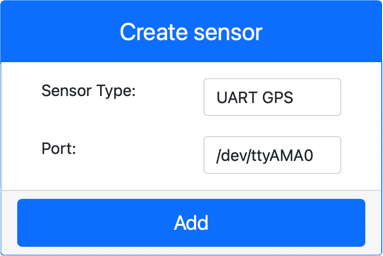

<!--
CO_OP_TRANSLATOR_METADATA:
{
  "original_hash": "64f18a8f8aaa1fef5e7320e0992d8b3a",
  "translation_date": "2025-08-28T16:48:31+00:00",
  "source_file": "3-transport/lessons/1-location-tracking/virtual-device-gps-sensor.md",
  "language_code": "my"
}
-->
# GPS ဒေတာဖတ်ခြင်း - အိမ်စီး IoT ဟာ့ဒ်ဝဲ

ဒီသင်ခန်းစာအပိုင်းမှာ သင့်ရဲ့ အိမ်စီး IoT စက်ပစ္စည်းမှာ GPS အာရုံခံကိရိယာတစ်ခု ထည့်သွင်းပြီး ဒေတာများကိုဖတ်ရှုမည်ဖြစ်သည်။

## အိမ်စီး ဟာ့ဒ်ဝဲ

အိမ်စီး IoT စက်ပစ္စည်းသည် UART မှတဆင့် serial port ကို အသုံးပြုနိုင်သော simulation GPS အာရုံခံကိရိယာကို အသုံးပြုမည်ဖြစ်သည်။

ပစ္စည်းတစ်ခုဖြစ်သော GPS အာရုံခံကိရိယာတွင် GPS ဂြိုဟ်တုများမှ ရေဒီယိုလှိုင်းများကို ဖမ်းယူရန် အင်တင်နာတစ်ခုရှိပြီး GPS signals များကို GPS ဒေတာအဖြစ် ပြောင်းလဲပေးသည်။ အိမ်စီးဗားရှင်းသည် latitude နှင့် longitude ကို သတ်မှတ်ခြင်း၊ raw NMEA စာကြောင်းများပို့ခြင်း၊ သို့မဟုတ် GPX ဖိုင်တစ်ခုကို upload လုပ်ပြီး အဆက်မပြတ်နေရာများကို အလှည့်ကျပြန်ပေးခြင်းတို့ဖြင့် simulation လုပ်သည်။

> 🎓 NMEA စာကြောင်းများကို ဒီသင်ခန်းစာတွင် နောက်ပိုင်းတွင် ရှင်းလင်းမည်

### CounterFit တွင် အာရုံခံကိရိယာ ထည့်သွင်းခြင်း

အိမ်စီး GPS အာရုံခံကိရိယာကို အသုံးပြုရန် CounterFit app တွင် ထည့်သွင်းရန်လိုအပ်သည်။

#### လုပ်ငန်း - CounterFit တွင် အာရုံခံကိရိယာ ထည့်သွင်းခြင်း

CounterFit app တွင် GPS အာရုံခံကိရိယာကို ထည့်သွင်းပါ။

1. သင့်ကွန်ပျူတာတွင် `gps-sensor` ဟုခေါ်သော folder တစ်ခုတွင် Python app အသစ်တစ်ခုဖန်တီးပြီး `app.py` ဟုခေါ်သော ဖိုင်တစ်ခုနှင့် Python virtual environment တစ်ခုထည့်သွင်းပါ။ CounterFit pip packages များကို ထည့်သွင်းပါ။

    > ⚠️ [သင်ခန်းစာ 1 တွင် CounterFit Python project ဖန်တီးခြင်းနှင့် စတင်ခြင်းဆိုင်ရာ လမ်းညွှန်ချက်များကို လိုအပ်ပါက ပြန်လည်ကြည့်ရှုနိုင်သည်](../../../1-getting-started/lessons/1-introduction-to-iot/virtual-device.md)။

1. UART အခြေခံ sensor များနှင့် serial connection မှတဆင့် ဆက်သွယ်နိုင်သော CounterFit shim ကို ထည့်သွင်းရန် အပို Pip package တစ်ခုကို ထည့်သွင်းပါ။ virtual environment ကို active လုပ်ထားသော terminal မှာ ထည့်သွင်းရမည်ဖြစ်သည်။

    ```sh
    pip install counterfit-shims-serial
    ```

1. CounterFit web app ကို run လုပ်ထားပါ။

1. GPS အာရုံခံကိရိယာကို ဖန်တီးပါ:

    1. *Sensors* pane တွင် *Create sensor* box မှ *Sensor type* box ကို drop down လုပ်ပြီး *UART GPS* ကို ရွေးပါ။

    1. *Port* ကို */dev/ttyAMA0* အတိုင်းထားပါ။

    1. **Add** button ကို ရွေးပြီး `/dev/ttyAMA0` port တွင် GPS အာရုံခံကိရိယာကို ဖန်တီးပါ။

    

    GPS အာရုံခံကိရိယာကို ဖန်တီးပြီး sensor list တွင် ပေါ်လာမည်။

    

## GPS အာရုံခံကိရိယာကို အစီအစဉ်ရေးဆွဲခြင်း

အိမ်စီး IoT စက်ပစ္စည်းသည် အိမ်စီး GPS အာရုံခံကိရိယာကို အသုံးပြုရန် အစီအစဉ်ရေးဆွဲနိုင်ပါပြီ။

### လုပ်ငန်း - GPS အာရုံခံကိရိယာကို အစီအစဉ်ရေးဆွဲခြင်း

GPS အာရုံခံကိရိယာ app ကို အစီအစဉ်ရေးဆွဲပါ။

1. `gps-sensor` app ကို VS Code တွင် ဖွင့်ထားပါ။

1. `app.py` ဖိုင်ကို ဖွင့်ပါ။

1. CounterFit app နှင့် ဆက်သွယ်ရန် `app.py` အပေါ်ပိုင်းတွင် အောက်ပါ code ကို ထည့်သွင်းပါ:

    ```python
    from counterfit_connection import CounterFitConnection
    CounterFitConnection.init('127.0.0.1', 5000)
    ```

1. CounterFit serial port အပါအဝင် လိုအပ်သော libraries များကို import လုပ်ရန် အောက်ပါ code ကို ထည့်သွင်းပါ:

    ```python
    import time
    import counterfit_shims_serial
    
    serial = counterfit_shims_serial.Serial('/dev/ttyAMA0')
    ```

    ဒီ code သည် `counterfit_shims_serial` Pip package မှ `serial` module ကို import လုပ်သည်။ ထို့နောက် `/dev/ttyAMA0` serial port ကို ချိတ်ဆက်သည် - ဤသည်မှာ virtual GPS အာရုံခံကိရိယာ၏ UART port အတွက် serial port လိပ်စာဖြစ်သည်။

1. Serial port မှ ဖတ်ပြီး console တွင် value များကို print လုပ်ရန် အောက်ပါ code ကို ထည့်သွင်းပါ:

    ```python
    def print_gps_data(line):
        print(line.rstrip())
    
    while True:
        line = serial.readline().decode('utf-8')
    
        while len(line) > 0:
            print_gps_data(line)
            line = serial.readline().decode('utf-8')
    
        time.sleep(1)
    ```

    `print_gps_data` ဟုခေါ်သော function တစ်ခုကို ဖန်တီးပြီး console တွင် line passed to it ကို print လုပ်သည်။

    ထို့နောက် code သည် အဆုံးမရှိ loop လုပ်ပြီး serial port မှ text line များကို loop တစ်ခုစီတွင် ဖတ်ရှုသည်။ loop တစ်ခုစီတွင် `print_gps_data` function ကို ခေါ်သည်။

    ဒေတာအားလုံးကို ဖတ်ပြီးနောက် loop သည် 1 စက္ကန့်အနားယူပြီး ထပ်မံကြိုးစားသည်။

1. ဒီ code ကို run လုပ်ပါ။ CounterFit app ကို run လုပ်ထားသော terminal ကို မပိတ်ဘဲ တစ်ခုခြား terminal မှ run လုပ်ပါ။

1. CounterFit app မှ GPS အာရုံခံကိရိယာ၏ value ကို ပြောင်းလဲပါ။ အောက်ပါနည်းလမ်းများမှ တစ်ခုကို အသုံးပြုနိုင်သည်:

    * **Source** ကို `Lat/Lon` သို့ ပြောင်းပြီး latitude, longitude နှင့် GPS fix ရရှိရန် satellites အရေအတွက်ကို သတ်မှတ်ပါ။ ဒီ value သည် တစ်ခါသာ ပို့မည်ဖြစ်သည်။ **Repeat** box ကို check လုပ်ပါက ဒေတာကို တစ်စက္ကန့်တိုင်း ထပ်ပို့မည်။

      

    * **Source** ကို `NMEA` သို့ ပြောင်းပြီး NMEA စာကြောင်းများကို text box တွင် ထည့်ပါ။ ဒီ value များကို ပို့မည်ဖြစ်ပြီး တစ်စက္ကန့် delay ရှိပြီး position fix sentence တစ်ခုစီကို ဖတ်နိုင်သည်။

      

      [nmeagen.org](https://www.nmeagen.org) ကဲ့သို့သော tool ကို အသုံးပြု၍ map ပေါ်တွင် ရေးဆွဲပြီး ဒီစာကြောင်းများကို ဖန်တီးနိုင်သည်။ ဒီ value များကို တစ်ခါသာ ပို့မည်ဖြစ်သည်။ **Repeat** box ကို check လုပ်ပါက ဒေတာကို တစ်စက္ကန့်အကြာတွင် ထပ်ပို့မည်။

    * **Source** ကို GPX file သို့ ပြောင်းပြီး GPX ဖိုင်တစ်ခုကို upload လုပ်ပါ။ [AllTrails](https://www.alltrails.com/) ကဲ့သို့သော mapping နှင့် hiking site များမှ GPX ဖိုင်များကို download လုပ်နိုင်သည်။ ဒီဖိုင်များတွင် trail အနေဖြင့် GPS နေရာများစွာပါဝင်ပြီး GPS အာရုံခံကိရိယာသည် 1 စက္ကန့်အကြာတွင် နေရာအသစ်တစ်ခုကို ပြန်ပေးမည်။

      

      ဒီ value များကို တစ်ခါသာ ပို့မည်ဖြစ်သည်။ **Repeat** box ကို check လုပ်ပါက ဒေတာကို တစ်စက္ကန့်အကြာတွင် ထပ်ပို့မည်။

    GPS settings များကို configure ပြီးနောက် **Set** button ကို ရွေးပြီး sensor သို့ value များကို commit လုပ်ပါ။

1. GPS အာရုံခံကိရိယာမှ raw output ကို အောက်ပါအတိုင်း မြင်ရမည်:

    ```output
    $GNGGA,020604.001,4738.538654,N,12208.341758,W,1,3,,164.7,M,-17.1,M,,*67
    $GNGGA,020604.001,4738.538654,N,12208.341758,W,1,3,,164.7,M,-17.1,M,,*67
    ```

> 💁 ဒီ code ကို [code-gps/virtual-device](../../../../../3-transport/lessons/1-location-tracking/code-gps/virtual-device) folder တွင် ရှာနိုင်သည်။

😀 သင့် GPS အာရုံခံကိရိယာ app အောင်မြင်ခဲ့ပါပြီ!

---

**အကြောင်းကြားချက်**:  
ဤစာရွက်စာတမ်းကို AI ဘာသာပြန်ဝန်ဆောင်မှု [Co-op Translator](https://github.com/Azure/co-op-translator) ကို အသုံးပြု၍ ဘာသာပြန်ထားပါသည်။ ကျွန်ုပ်တို့သည် တိကျမှုအတွက် ကြိုးစားနေသော်လည်း၊ အလိုအလျောက် ဘာသာပြန်မှုများတွင် အမှားများ သို့မဟုတ် မတိကျမှုများ ပါဝင်နိုင်သည်ကို သတိပြုပါ။ မူရင်းဘာသာစကားဖြင့် ရေးသားထားသော စာရွက်စာတမ်းကို အာဏာတရ အရင်းအမြစ်အဖြစ် ရှုလေ့လာသင့်ပါသည်။ အရေးကြီးသော အချက်အလက်များအတွက် လူက ဘာသာပြန်မှုကို အသုံးပြုရန် အကြံပြုပါသည်။ ဤဘာသာပြန်မှုကို အသုံးပြုခြင်းမှ ဖြစ်ပေါ်လာသော အလွဲအလွတ်များ သို့မဟုတ် အနားယူမှုမှားများအတွက် ကျွန်ုပ်တို့သည် တာဝန်မယူပါ။