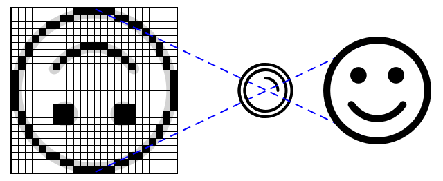

<!--
CO_OP_TRANSLATOR_METADATA:
{
  "original_hash": "557f4ee96b752e0651d2e6e74aa6bd14",
  "translation_date": "2025-08-28T16:05:26+00:00",
  "source_file": "4-manufacturing/lessons/2-check-fruit-from-device/README.md",
  "language_code": "my"
}
-->
# အိုင်အိုတီ (IoT) စက်ပစ္စည်းမှ သစ်သီးအရည်အသွေး စစ်ဆေးခြင်း


> [Nitya Narasimhan](https://github.com/nitya) မှ ရေးမှတ်ပုံ။ ပုံကို နှိပ်ပြီး ပိုကြီးမားသော ဗားရှင်းကို ကြည့်ပါ။

## သင်ခန်းစာမတိုင်မီ မေးခွန်းများ

[သင်ခန်းစာမတိုင်မီ မေးခွန်းများ](https://black-meadow-040d15503.1.azurestaticapps.net/quiz/31)

## အကျဉ်းချုပ်

ပြီးခဲ့သင်ခန်းစာတွင် သင်သည် ပုံရိပ်ခွဲခြားစနစ်များနှင့် သစ်သီးကောင်း/မကောင်းကို ရှာဖွေဖို့ သင်ကြားခဲ့ပါသည်။ အိုင်အိုတီ (IoT) အက်ပလီကေးရှင်းတွင် ဒီပုံရိပ်ခွဲခြားစနစ်ကို အသုံးပြုရန်အတွက် ကင်မရာတစ်ခုမှ ပုံရိပ်ကို ဖမ်းယူပြီး ကောင်းမွန်မှုကို စစ်ဆေးရန် ကောင်းကောင်းအလုပ်လုပ်နိုင်ဖို့ Cloud သို့ ပေးပို့ရပါမည်။

ဒီသင်ခန်းစာတွင် သင်သည် ကင်မရာအာရုံခံစနစ်များနှင့် အိုင်အိုတီ (IoT) စက်ပစ္စည်းကို အသုံးပြု၍ ပုံရိပ်ကို ဖမ်းယူနည်းကို သင်ကြားပါမည်။ ထို့အပြင် အိုင်အိုတီ (IoT) စက်ပစ္စည်းမှ ပုံရိပ်ခွဲခြားစနစ်ကို ခေါ်ယူနည်းကိုလည်း သင်ကြားပါမည်။

ဒီသင်ခန်းစာတွင် အောက်ပါအကြောင်းအရာများကို လေ့လာပါမည်-

* [ကင်မရာအာရုံခံစနစ်များ](../../../../../4-manufacturing/lessons/2-check-fruit-from-device)
* [အိုင်အိုတီ (IoT) စက်ပစ္စည်းကို အသုံးပြု၍ ပုံရိပ်ဖမ်းယူခြင်း](../../../../../4-manufacturing/lessons/2-check-fruit-from-device)
* [သင့်ပုံရိပ်ခွဲခြားစနစ်ကို ထုတ်ဝေခြင်း](../../../../../4-manufacturing/lessons/2-check-fruit-from-device)
* [အိုင်အိုတီ (IoT) စက်ပစ္စည်းမှ ပုံရိပ်များကို ခွဲခြားခြင်း](../../../../../4-manufacturing/lessons/2-check-fruit-from-device)
* [မော်ဒယ်ကို တိုးတက်အောင် ပြုပြင်ခြင်း](../../../../../4-manufacturing/lessons/2-check-fruit-from-device)

## ကင်မရာအာရုံခံစနစ်များ

ကင်မရာအာရုံခံစနစ်များသည် အိုင်အိုတီ (IoT) စက်ပစ္စည်းနှင့် ချိတ်ဆက်နိုင်သော ကင်မရာများဖြစ်သည်။ ၎င်းတို့သည် ရုပ်ပုံများကို ဖမ်းယူနိုင်သလို၊ ဗီဒီယိုစီးဆင်းမှုကိုလည်း ဖမ်းယူနိုင်သည်။ တချို့က raw image data ကို ပြန်ပေးသည်၊ တချို့က JPEG သို့မဟုတ် PNG အဖြစ် ဖိုင်ကို ဖိသိပ်ပြီး ပြန်ပေးသည်။ အိုင်အိုတီ (IoT) စက်ပစ္စည်းများနှင့် အလုပ်လုပ်နိုင်သော ကင်မရာများသည် သင်ရိုးရိုးအသုံးပြုနေသော ကင်မရာများထက် သေးငယ်ပြီး resolution ပိုနိမ့်နိုင်သည်။ သို့သော် resolution မြင့်မားသော ကင်မရာများကိုလည်း ရနိုင်ပြီး အဆင့်မြင့်ဖုန်းများနှင့် ယှဉ်နိုင်သည်။ အမျိုးမျိုးသော လှည့်လဲနိုင်သော ကင်မရာလက်နက်များ၊ များစွာသော ကင်မရာစနစ်များ၊ infra-red thermal ကင်မရာများ၊ သို့မဟုတ် UV ကင်မရာများကို ရနိုင်သည်။



အများစုသော ကင်မရာအာရုံခံစနစ်များသည် photodiode များဖြင့် ဖွဲ့စည်းထားသော image sensors ကို အသုံးပြုသည်။ ကင်မရာလက်နက်သည် ပုံရိပ်ကို image sensor တွင် အာရုံခံစနစ်အပေါ်တွင် အလင်းကို အာရုံခံပြီး pixel data အဖြစ် မှတ်တမ်းတင်သည်။

> 💁 လက်နက်များသည် ပုံရိပ်များကို လှည့်ပေးသည်၊ ကင်မရာအာရုံခံစနစ်သည် ပုံရိပ်ကို ပြန်လည်မှန်ကန်အောင် ပြန်လှည့်ပေးသည်။ သင်၏ မျက်လုံးတွင်လည်း အလားတူပင်ဖြစ်သည် - သင်မြင်သောအရာသည် မျက်လုံး၏ အနောက်ဘက်တွင် အပေါ်အောက်လှည့်နေပြီး သင့်ဉာဏ်က ပြန်လည်မှန်ကန်အောင် ပြင်ပေးသည်။

> 🎓 image sensor ကို Active-Pixel Sensor (APS) ဟု ခေါ်သည်၊ APS အမျိုးအစားများထဲတွင် CMOS sensor သည် အများဆုံးအသုံးပြုသော sensor ဖြစ်သည်။ သင်သည် CMOS sensor ဆိုသော စကားကို ကင်မရာ sensor များအတွက် ကြားဖူးနိုင်သည်။

ကင်မရာ sensor များသည် ဒစ်ဂျစ်တယ် sensor များဖြစ်ပြီး image data ကို ဒစ်ဂျစ်တယ်အနေဖြင့် ပေးပို့သည်။ ၎င်းသည် library တစ်ခုမှ ကူညီပေးသော communication ကို အသုံးပြုသည်။ ကင်မရာများသည် SPI ကဲ့သို့သော protocol များကို အသုံးပြု၍ data အများအပြားကို ပေးပို့သည် - image data သည် temperature sensor ကဲ့သို့သော sensor တစ်ခုမှ single number data ထက် အများကြီးကြီးမားသည်။

✅ အိုင်အိုတီ (IoT) စက်ပစ္စည်းများတွင် image size အပေါ် အကန့်အသတ်များရှိသည်။ microcontroller hardware အပေါ် အကန့်အသတ်များကို စဉ်းစားပါ။

## အိုင်အိုတီ (IoT) စက်ပစ္စည်းကို အသုံးပြု၍ ပုံရိပ်ဖမ်းယူခြင်း

သင်၏ အိုင်အိုတီ (IoT) စက်ပစ္စည်းကို အသုံးပြု၍ ခွဲခြားရန် ပုံရိပ်ကို ဖမ်းယူနိုင်သည်။

### လုပ်ငန်း - အိုင်အိုတီ (IoT) စက်ပစ္စည်းကို အသုံးပြု၍ ပုံရိပ်ဖမ်းယူခြင်း

သင့်အိုင်အိုတီ (IoT) စက်ပစ္စည်းကို အသုံးပြု၍ ပုံရိပ်ဖမ်းယူရန် လမ်းညွှန်ချက်ကို လေ့လာပါ-

* [Arduino - Wio Terminal](wio-terminal-camera.md)
* [Single-board computer - Raspberry Pi](pi-camera.md)
* [Single-board computer - Virtual device](virtual-device-camera.md)

## သင့်ပုံရိပ်ခွဲခြားစနစ်ကို ထုတ်ဝေခြင်း

ပြီးခဲ့သင်ခန်းစာတွင် သင်သည် သင့်ပုံရိပ်ခွဲခြားစနစ်ကို သင်ကြားခဲ့သည်။ အိုင်အိုတီ (IoT) စက်ပစ္စည်းမှ အသုံးပြုရန်အတွက် မော်ဒယ်ကို ထုတ်ဝေဖို့ လိုအပ်ပါသည်။

### မော်ဒယ် iteration များ

ပြီးခဲ့သင်ခန်းစာတွင် မော်ဒယ်ကို သင်ကြားနေစဉ် **Performance** tab တွင် iteration များကို တွေ့နိုင်သည်။ မော်ဒယ်ကို ပထမဆုံး သင်ကြားစဉ် *Iteration 1* ကို တွေ့နိုင်သည်။ prediction images ကို အသုံးပြု၍ မော်ဒယ်ကို တိုးတက်အောင် ပြုပြင်စဉ် *Iteration 2* ကို တွေ့နိုင်သည်။

မော်ဒယ်ကို သင်ကြားတိုင်း iteration အသစ်တစ်ခုရရှိသည်။ ၎င်းသည် မတူညီသော data set များကို အသုံးပြု၍ သင်ကြားထားသော မော်ဒယ်၏ ဗားရှင်းများကို မှတ်တမ်းတင်ရန် နည်းလမ်းတစ်ခုဖြစ်သည်။ **Quick Test** ပြုလုပ်စဉ် drop-down ကို အသုံးပြု၍ iteration များအကြား ရလဒ်များကို နှိုင်းယှဉ်နိုင်သည်။

သင် iteration တစ်ခုကို သင့်တော်သည်ဟု ယုံကြည်သောအခါ ၎င်းကို ထုတ်ဝေပြီး အပြင် application များမှ အသုံးပြုနိုင်အောင် ပြုလုပ်နိုင်သည်။ ၎င်းနည်းလမ်းဖြင့် သင့်စက်ပစ္စည်းများမှ အသုံးပြုသော iteration ကို ထုတ်ဝေထားပြီး iteration အသစ်ကို အကြိမ်ကြိမ် ပြုပြင်ပြီး ထုတ်ဝေနိုင်သည်။

### လုပ်ငန်း - iteration ကို ထုတ်ဝေခြင်း

Iteration များကို Custom Vision portal မှ ထုတ်ဝေပါ။

1. [CustomVision.ai](https://customvision.ai) တွင် Custom Vision portal ကို ဖွင့်ပြီး sign in လုပ်ပါ။ သင်၏ `fruit-quality-detector` project ကို ဖွင့်ပါ။

1. အပေါ်တွင် **Performance** tab ကို ရွေးပါ။

1. *Iterations* စာရင်းမှ နောက်ဆုံး iteration ကို ရွေးပါ။

1. Iteration အတွက် **Publish** ခလုတ်ကို ရွေးပါ။

    

1. *Publish Model* dialog တွင် *Prediction resource* ကို `fruit-quality-detector-prediction` resource သို့ ရွေးပါ။ နာမည်ကို `Iteration2` အဖြစ်ထားပြီး **Publish** ခလုတ်ကို ရွေးပါ။

1. ထုတ်ဝေပြီးနောက် **Prediction URL** ခလုတ်ကို ရွေးပါ။ ၎င်းသည် prediction API ၏ အသေးစိတ်ကို ပြသမည်။ သင်၏ အိုင်အိုတီ (IoT) စက်ပစ္စည်းမှ မော်ဒယ်ကို ခေါ်ရန် ၎င်းကို လိုအပ်ပါမည်။ *If you have an image file* ဟု အမည်ပေးထားသော အောက်ပိုင်းကို အသုံးပြုပါ။ URL ကို ကူးယူပါ၊ ၎င်းသည် အောက်ပါအတိုင်းဖြစ်နိုင်သည်-

    ```output
    https://<location>.api.cognitive.microsoft.com/customvision/v3.0/Prediction/<id>/classify/iterations/Iteration2/image
    ```

    `<location>` သည် သင်၏ custom vision resource ကို ဖန်တီးစဉ် အသုံးပြုသော location ဖြစ်ပြီး `<id>` သည် အက္ခရာနှင့် နံပါတ်များဖြင့် ဖွဲ့စည်းထားသော ID ဖြစ်သည်။

    ထို့အပြင် *Prediction-Key* တန်ဖိုးကိုလည်း ကူးယူပါ။ ၎င်းသည် မော်ဒယ်ကို ခေါ်စဉ် ပေးပို့ရမည့် လုံခြုံရေး key ဖြစ်သည်။ ၎င်း key ကို ပေးပို့သော application များသာ မော်ဒယ်ကို အသုံးပြုခွင့်ရရှိမည်၊ အခြား application များကို ပယ်ချမည်။

    

✅ iteration အသစ်ကို ထုတ်ဝေသောအခါ နာမည်က မတူနိုင်သည်။ အိုင်အိုတီ (IoT) စက်ပစ္စည်းမှ အသုံးပြုနေသော iteration ကို ဘယ်လိုပြောင်းနိုင်မလဲ?

## အိုင်အိုတီ (IoT) စက်ပစ္စည်းမှ ပုံရိပ်များကို ခွဲခြားခြင်း

ယခု သင်သည် connection details များကို အသုံးပြု၍ အိုင်အိုတီ (IoT) စက်ပစ္စည်းမှ ပုံရိပ်ခွဲခြားစနစ်ကို ခေါ်နိုင်ပါသည်။

### လုပ်ငန်း - အိုင်အိုတီ (IoT) စက်ပစ္စည်းမှ ပုံရိပ်များကို ခွဲခြားခြင်း

သင့်အိုင်အိုတီ (IoT) စက်ပစ္စည်းကို အသုံးပြု၍ ပုံရိပ်များကို ခွဲခြားရန် လမ်းညွှန်ချက်ကို လေ့လာပါ-

* [Arduino - Wio Terminal](wio-terminal-classify-image.md)
* [Single-board computer - Raspberry Pi/Virtual IoT device](single-board-computer-classify-image.md)

## မော်ဒယ်ကို တိုးတက်အောင် ပြုပြင်ခြင်း

သင့်အိုင်အိုတီ (IoT) စက်ပစ္စည်းမှ ကင်မရာကို အသုံးပြု၍ ရရှိသော ရလဒ်များသည် သင့်မျှော်လင့်ချက်နှင့် မကိုက်ညီနိုင်ပါ။ prediction များသည် သင့်ကွန်ပျူတာမှ upload လုပ်ထားသော ပုံရိပ်များကို အသုံးပြုသောအခါထက် တိကျမှုနည်းနိုင်သည်။ ၎င်းသည် မော်ဒယ်ကို သင်ကြားထားသော data နှင့် prediction data မတူသောကြောင့် ဖြစ်သည်။

ပုံရိပ်ခွဲခြားစနစ်အတွက် အကောင်းဆုံးရလဒ်ရရှိရန် prediction data နှင့် training data တူညီမှုရှိအောင် သင်ကြားရမည်။ ဥပမာအားဖြင့် သင် training data အတွက် ဖုန်းကင်မရာကို အသုံးပြုခဲ့ပါက အိုင်အိုတီ (IoT) စက်ပစ္စည်းမှ ကင်မရာ၏ image quality, sharpness, နှင့် color မတူနိုင်သည်။


အထက်ပါပုံတွင် ဘန်နားပုံရိပ်ကို ဘယ်ဘက်တွင် Raspberry Pi Camera ဖြင့် ရိုက်ကူးထားပြီး ညာဘက်တွင် iPhone ဖြင့် ရိုက်ကူးထားသည်။ quality တွင် ကြီးမားသော ကွာခြားမှုရှိသည် - iPhone ပုံရိပ်သည် ပိုရှင်းလင်းပြီး အရောင်ပိုတောက်ပသည်။

✅ အိုင်အိုတီ (IoT) စက်ပစ္စည်းမှ ဖမ်းယူထားသော ပုံရိပ်များတွင် မမှန်ကန်သော prediction ဖြစ်စေသော အခြားအကြောင်းအရာများက ဘာတွေလဲ? အိုင်အိုတီ (IoT) စက်ပစ္စည်းကို အသုံးပြုသော ပတ်ဝန်းကျင်နှင့် ပုံရိပ်ဖမ်းယူမှုကို ထိခိုက်စေသော အချက်များကို စဉ်းစားပါ။

မော်ဒယ်ကို တိုးတက်အောင် ပြုပြင်ရန် အိုင်အိုတီ (IoT) စက်ပစ္စည်းမှ ဖမ်းယူထားသော ပုံရိပ်များကို အသုံးပြု၍ ပြန်လည်သင်ကြားနိုင်သည်။

### လုပ်ငန်း - မော်ဒယ်ကို တိုးတက်အောင် ပြုပြင်ခြင်း

1. အိုင်အိုတီ (IoT) စက်ပစ္စည်းကို အသုံးပြု၍ သစ်သီးအရည်အသွေးကောင်း/မကောင်း ပုံရိပ်များစွာကို ခွဲခြားပါ။

1. Custom Vision portal တွင် *Predictions* tab မှ ပုံရိပ်များကို အသုံးပြု၍ မော်ဒယ်ကို ပြန်လည်သင်ကြားပါ။

    > ⚠️ [Lesson 1 တွင် သင်၏ classifier ကို ပြန်လည်သင်ကြားရန် လမ်းညွှန်ချက်ကို ကြည့်ပါ](../1-train-fruit-detector/README.md#retrain-your-image-classifier)။

1. သင်၏ training images များသည် မူလ training data နှင့် အလွန်ကွာခြားနေပါက *Training Images* tab တွင် မူလပုံရိပ်များအားလုံးကို ရွေးပြီး **Delete** ခလုတ်ကို နှိပ်၍ ဖျက်ပါ။ ပုံရိပ်ကို ရွေးရန် cursor ကို ပုံရိပ်အပေါ်တွင် ရွှေ့ပါ၊ tick တစ်ခုပေါ်လာမည်၊ tick ကို နှိပ်၍ ရွေးပါ။

1. မော်ဒယ်၏ iteration အသစ်ကို သင်ကြားပြီး အထက်ပါအဆင့်များကို အသုံးပြု၍ ထုတ်ဝေပါ။

1. သင့် code တွင် endpoint URL ကို update လုပ်ပြီး app ကို ပြန်လည် run လုပ်ပါ။

1. prediction ရလဒ်များကို သင့်တော်သည်ဟု ယုံကြည်သည်အထိ အဆင့်များကို ထပ်မံလုပ်ဆောင်ပါ။

---

## 🚀 စိန်ခေါ်မှု

ပုံရိပ် resolution သို့မဟုတ် အလင်းရောင်သည် prediction အပေါ် ဘယ်လောက်အကျိုးသက်ရောက်လဲ?

သင့်စက်ပစ္စည်း code တွင် ပုံရိပ် resolution ကို ပြောင်းလဲပြီး ပုံရိပ် quality အပေါ် သက်ရောက်မှုရှိမရှိ စမ်းသပ်ပါ။ အလင်းရောင်ကိုလည်း ပြောင်းလဲကြည့်ပါ။

သင်သည် စိုက်ပျိုးရေးခြံများ သို့မဟုတ် စက်ရုံများအတွက် ရောင်းရန် production device တစ်ခုကို ဖန်တီးလိုပါက အချိန်တိုင်း တိကျသောရလဒ်များရရှိစေရန် ဘယ်လိုလုပ်မလဲ

---

**ဝက်ဘ်ဆိုက်မှတ်ချက်**:  
ဤစာရွက်စာတမ်းကို AI ဘာသာပြန်ဝန်ဆောင်မှု [Co-op Translator](https://github.com/Azure/co-op-translator) ကို အသုံးပြု၍ ဘာသာပြန်ထားပါသည်။ ကျွန်ုပ်တို့သည် တိကျမှန်ကန်မှုအတွက် ကြိုးစားနေပါသော်လည်း၊ အလိုအလျောက်ဘာသာပြန်မှုများတွင် အမှားများ သို့မဟုတ် မတိကျမှုများ ပါဝင်နိုင်သည်ကို သတိပြုပါ။ မူရင်းစာရွက်စာတမ်းကို ၎င်း၏ မူလဘာသာစကားဖြင့် အာဏာတည်သောရင်းမြစ်အဖြစ် သတ်မှတ်သင့်ပါသည်။ အရေးကြီးသော အချက်အလက်များအတွက် လူ့ဘာသာပြန်ပညာရှင်များမှ ပြန်ဆိုမှုကို အကြံပြုပါသည်။ ဤဘာသာပြန်မှုကို အသုံးပြုခြင်းမှ ဖြစ်ပေါ်လာသည့် နားလည်မှုမှားများ သို့မဟုတ် အဓိပ္ပါယ်မှားများအတွက် ကျွန်ုပ်တို့သည် တာဝန်မယူပါ။