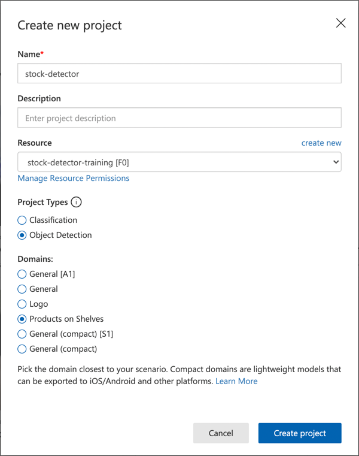

<!--
CO_OP_TRANSLATOR_METADATA:
{
  "original_hash": "8df310a42f902139a01417dacb1ffbef",
  "translation_date": "2025-08-28T17:33:50+00:00",
  "source_file": "5-retail/lessons/1-train-stock-detector/README.md",
  "language_code": "my"
}
-->
# စတော့ရှယ်ယာရှာဖွေမှုစက်ကိုလေ့ကျင့်ပါ

> [Nitya Narasimhan](https://github.com/nitya) မှရေးဆွဲထားသောပုံ။ ပုံကိုနှိပ်ပြီး ပိုမိုကြီးမားသောဗားရှင်းကိုကြည့်ပါ။

ဒီဗီဒီယိုသည် Azure Custom Vision ဝန်ဆောင်မှုဖြင့် Object Detection အကြောင်းကိုအကျဉ်းချုပ်ဖော်ပြသည်။ ဒီသင်ခန်းစာတွင်လည်းဖော်ပြသွားမည်။

> 🎥 အထက်ပါပုံကိုနှိပ်ပြီးဗီဒီယိုကိုကြည့်ပါ

## သင်ခန်းစာမတိုင်မီမေးခွန်းများ

[သင်ခန်းစာမတိုင်မီမေးခွန်းများ](https://black-meadow-040d15503.1.azurestaticapps.net/quiz/37)

## အကျဉ်းချုပ်

ယခင်ပရောဂျက်တွင် သင်သည် AI ကိုအသုံးပြုပြီး ပုံခွဲခြားစက်ကိုလေ့ကျင့်ခဲ့သည်။ ဒီစက်သည် ပုံတွင်အရာဝတ္ထုတစ်ခုခုရှိမရှိကိုပြောနိုင်သည်။ AI မော်ဒယ်တစ်မျိုးဖြစ်သော Object Detection သည် ပုံများနှင့်အတူအသုံးပြုနိုင်သည်။ ဒီမော်ဒယ်များသည် ပုံကို tag များဖြင့်ခွဲခြားခြင်းမဟုတ်ဘဲ ပုံတွင်ရှိသောအရာဝတ္ထုများကိုရှာဖွေခြင်းနှင့် အတိအကျဘယ်နေရာတွင်ရှိသည်ကိုဖော်ပြနိုင်သည်။ ဒါက ပုံတွင်ရှိသောအရာဝတ္ထုများကိုရေတွက်နိုင်စေသည်။

ဒီသင်ခန်းစာတွင် သင်သည် Object Detection အကြောင်းနှင့် ရောင်းချရေးတွင်ဘယ်လိုအသုံးပြုနိုင်သည်ကိုလေ့လာမည်။ Cloud တွင် Object Detector ကိုလေ့ကျင့်ပုံကိုလည်းသင်ယူမည်။

ဒီသင်ခန်းစာတွင်ဖော်ပြမည့်အကြောင်းအရာများမှာ -

* [Object detection](../../../../../5-retail/lessons/1-train-stock-detector)
* [ရောင်းချရေးတွင် Object detection ကိုအသုံးပြုခြင်း](../../../../../5-retail/lessons/1-train-stock-detector)
* [Object detector ကိုလေ့ကျင့်ခြင်း](../../../../../5-retail/lessons/1-train-stock-detector)
* [Object detector ကိုစမ်းသပ်ခြင်း](../../../../../5-retail/lessons/1-train-stock-detector)
* [Object detector ကိုပြန်လေ့ကျင့်ခြင်း](../../../../../5-retail/lessons/1-train-stock-detector)

## Object detection

Object detection သည် AI ကိုအသုံးပြုပြီး ပုံများတွင်ရှိသောအရာဝတ္ထုများကိုရှာဖွေခြင်းဖြစ်သည်။ ယခင်ပရောဂျက်တွင်လေ့ကျင့်ခဲ့သော image classifier ကဲ့သို့မဟုတ်ပုံကို tag ဖြင့်ခွဲခြားခြင်းမဟုတ်ဘဲ ပုံတွင်ရှိသောအရာဝတ္ထုများကိုရှာဖွေခြင်းဖြစ်သည်။

### Object detection နှင့် image classification

Image classification သည် ပုံတစ်ခုလုံးကို tag များဖြင့်ခွဲခြားခြင်းဖြစ်သည်။ ပုံတစ်ခုလုံးသည် tag တစ်ခုနှင့်တစ်ခုကိုတူညီမှုရှိမရှိကိုကိန်းဂဏန်းများဖြင့်ပြန်လည်ပေးသည်။

အထက်ပါပုံတွင် Cashew nuts နှင့် Tomato paste ကိုခွဲခြားထားသောပုံများကိုပြထားသည်။ ပထမပုံသည် Cashew nuts ဖြစ်ပြီး image classifier မှရရှိသောရလဒ်မှာ -

| Tag            | Probability |
| -------------- | ----------: |
| `cashew nuts`  | 98.4%       |
| `tomato paste` | 1.6%        |

ဒုတိယပုံသည် Tomato paste ဖြစ်ပြီးရလဒ်မှာ -

| Tag            | Probability |
| -------------- | ----------: |
| `cashew nuts`  | 0.7%        |
| `tomato paste` | 99.3%       |

ဒီကိန်းဂဏန်းများကို threshold percentage ဖြင့်အသုံးပြုပြီး ပုံတွင်ဘာရှိသည်ကိုခန့်မှန်းနိုင်သည်။ ဒါပေမယ့် ပုံတွင် Tomato paste အတူတူရှိသောအရာဝတ္ထုများစွာရှိပါက သင်လိုချင်သောရလဒ်ကိုမရနိုင်ပါ။ ဒီအချိန်မှာ Object detection ကိုအသုံးပြုရမည်ဖြစ်သည်။

Object detection သည် ပုံတွင်ရှိသောအရာဝတ္ထုများကိုသိရှိရန်မော်ဒယ်ကိုလေ့ကျင့်ခြင်းဖြစ်သည်။ ပုံတွင်ရှိသောအရာဝတ္ထုကို highlight လုပ်ပြီး tag ပေးရသည်။ ပုံတစ်ခုတွင်အရာဝတ္ထုတစ်ခုတည်းကို tag ပေးနိုင်သလို အများအပြားကိုလည်းပေးနိုင်သည်။ ဒီနည်းလမ်းဖြင့် မော်ဒယ်သည် ပုံတွင်ရှိသောအရာဝတ္ထုကိုသိရှိနိုင်သည်။

မော်ဒယ်ကိုအသုံးပြု၍ ပုံများကိုခန့်မှန်းသောအခါ tag များနှင့် percentage များကိုမရရှိဘဲ bounding box နှင့် tag ကိုတူညီမှုရှိသော percentage ကိုရရှိမည်။

> 🎓 *Bounding boxes* သည် အရာဝတ္ထုကိုဝိုင်းထားသော box များဖြစ်သည်။

အထက်ပါပုံတွင် Cashew nuts တစ်ခုနှင့် Tomato paste သုံးခုရှိသည်။ Object detector သည် Cashew nuts ကိုရှာဖွေပြီး bounding box နှင့် percentage ကိုပြန်ပေးသည်။ Tomato paste သုံးခုကိုလည်း bounding box သုံးခုနှင့် percentage များဖြင့်ပြန်ပေးသည်။

✅ ပုံအခြေပြု AI မော်ဒယ်များကိုအသုံးပြုရန်အခြေအနေများကိုစဉ်းစားပါ။ Classification လိုအပ်သောအခြေအနေများနှင့် Object detection လိုအပ်သောအခြေအနေများကိုခွဲခြားပါ။

### Object detection အလုပ်လုပ်ပုံ

Object detection သည် ML မော်ဒယ်များကိုအသုံးပြုသည်။ မော်ဒယ်များသည် ပုံကို cells များစွာခွဲပြီး bounding box ၏အလယ်ဗဟိုကို training image ၏အလယ်ဗဟိုနှင့်တူညီမှုရှိမရှိစစ်ဆေးသည်။ ဒါကို image classifier ကိုပုံ၏အပိုင်းအစများတွင်ပြုလုပ်သည့်နည်းလမ်းတစ်ခုအဖြစ်စဉ်းစားနိုင်သည်။

> 💁 ဒီနည်းလမ်းသည်အလွန်ရိုးရှင်းသောဖော်ပြချက်ဖြစ်သည်။ Object detection အတွက်နည်းလမ်းများစွာရှိပြီး [Wikipedia တွင် Object detection အကြောင်း](https://wikipedia.org/wiki/Object_detection)ကိုဖတ်ရှုနိုင်သည်။

Object detection ကိုပြုလုပ်နိုင်သောမော်ဒယ်များစွာရှိသည်။ [YOLO (You only look once)](https://pjreddie.com/darknet/yolo/) သည်အလွန်လျင်မြန်ပြီး လူ၊ ခွေး၊ ဘူး၊ ကားစသည်တို့ကိုရှာဖွေနိုင်သောမော်ဒယ်တစ်ခုဖြစ်သည်။

✅ [pjreddie.com/darknet/yolo/](https://pjreddie.com/darknet/yolo/) တွင် YOLO မော်ဒယ်အကြောင်းဖတ်ရှုပါ။

Object detection မော်ဒယ်များကို transfer learning ဖြင့်ပြန်လေ့ကျင့်ပြီး custom objects ကိုရှာဖွေနိုင်သည်။

## ရောင်းချရေးတွင် Object detection ကိုအသုံးပြုခြင်း

Object detection သည် ရောင်းချရေးတွင်အသုံးပြုနိုင်သောနည်းလမ်းများစွာရှိသည်။ အချို့မှာ -

* **စတော့ရှယ်ယာစစ်ဆေးခြင်းနှင့်ရေတွက်ခြင်း** - စတော့ရှယ်ယာအနည်းငယ်ကျန်ရှိသောအခါကိုသိရှိခြင်း။ စတော့ရှယ်ယာအနည်းငယ်ကျန်ရှိပါက ဝန်ထမ်းများသို့မဟုတ်ရိုဘော့များကိုအသိပေးနိုင်သည်။
* **မျက်နှာဖုံးစစ်ဆေးခြင်း** - လူများ mask များဝတ်ဆင်ထားခြင်းနှင့်မဝတ်ဆင်ထားခြင်းကိုသိရှိနိုင်သည်။
* **အလိုအလျောက်ငွေတောင်းခံခြင်း** - စတိုးဆိုင်များတွင်ပစ္စည်းများကိုရှာဖွေပြီးဖောက်သည်များကိုအလိုအလျောက်ငွေတောင်းခံနိုင်သည်။
* **အန္တရာယ်ရှာဖွေခြင်း** - ကြမ်းပြင်ပေါ်တွင်ပျက်စီးနေသောပစ္စည်းများသို့မဟုတ်ရေကျဲနေသောနေရာများကိုသိရှိပြီးသန့်ရှင်းရေးအဖွဲ့များကိုအသိပေးနိုင်သည်။

✅ သုတေသနလုပ်ပါ - ရောင်းချရေးတွင် Object detection ကိုအသုံးပြုနိုင်သောနည်းလမ်းများကိုထပ်မံရှာဖွေပါ။

## Object detector ကိုလေ့ကျင့်ခြင်း

Custom Vision ကိုအသုံးပြုပြီး Object detector ကိုလေ့ကျင့်နိုင်သည်။ ယခင် image classifier ကိုလေ့ကျင့်ခဲ့သည့်နည်းလမ်းနှင့်ဆင်တူသည်။

### Task - Object detector တစ်ခုဖန်တီးပါ

1. ဒီပရောဂျက်အတွက် `stock-detector` ဟုခေါ်သော Resource Group တစ်ခုဖန်တီးပါ။

1. `stock-detector` Resource Group တွင် Custom Vision training resource တစ်ခုနှင့် prediction resource တစ်ခုကိုအခမဲ့ဖန်တီးပါ။ `stock-detector-training` နှင့် `stock-detector-prediction` ဟုအမည်ပေးပါ။

    > 💁 အခမဲ့ training နှင့် prediction resource တစ်ခုသာရှိနိုင်သည်။ ယခင်သင်ခန်းစာများမှပရောဂျက်ကိုရှင်းလင်းထားပါ။

    > ⚠️ [Project 4, Lesson 1 မှ training နှင့် prediction resource ဖန်တီးခြင်းအတွက်လမ်းညွှန်ချက်များ](../../../4-manufacturing/lessons/1-train-fruit-detector/README.md#task---create-a-cognitive-services-resource) ကိုလိုအပ်ပါကပြန်လည်ကြည့်ရှုနိုင်သည်။

1. [CustomVision.ai](https://customvision.ai) တွင် Custom Vision portal ကိုဖွင့်ပြီး သင်၏ Microsoft Azure အကောင့်ဖြင့်လက်မှတ်ထိုးပါ။

1. [Microsoft Docs တွင် Build an object detector quickstart ၏ Create a new Project အပိုင်း](https://docs.microsoft.com/azure/cognitive-services/custom-vision-service/get-started-build-detector?WT.mc_id=academic-17441-jabenn#create-a-new-project) ကိုလိုက်နာပြီး Custom Vision project တစ်ခုဖန်တီးပါ။ UI သည်အချိန်အလိုက်ပြောင်းလဲနိုင်ပြီး ဒီ Docs သည်အမြဲတမ်းနောက်ဆုံးပေါ်ဖြစ်သည်။

    သင်၏ project ကို `stock-detector` ဟုအမည်ပေးပါ။

    Project ဖန်တီးသောအခါ `stock-detector-training` resource ကိုအသုံးပြုပါ။ *Object Detection* project type နှင့် *Products on Shelves* domain ကိုရွေးပါ။

    

    ✅ Products on shelves domain သည် စတိုးဆိုင်တွင်ရှိသောစတော့ရှယ်ယာကိုရှာဖွေရန်အထူးသင့်လျော်သည်။ [Microsoft Docs တွင် Select a domain documentation](https://docs.microsoft.com/azure/cognitive-services/custom-vision-service/select-domain?WT.mc_id=academic-17441-jabenn#object-detection) ကိုဖတ်ရှုပါ။

✅ သင်၏ Object detector အတွက် Custom Vision UI ကိုလေ့လာရန်အချိန်ယူပါ။

### Task - Object detector ကိုလေ့ကျင့်ပါ

မော်ဒယ်ကိုလေ့ကျင့်ရန် သင်ရှာဖွေလိုသောအရာဝတ္ထုများပါဝင်သောပုံများလိုအပ်သည်။

1. ရှာဖွေလိုသောအရာဝတ္ထုများပါဝင်သောပုံများကိုစုဆောင်းပါ။ အရာဝတ္ထုတစ်ခုစီအတွက် angle များကွဲပြားခြင်းနှင့်အလင်းအရိပ်ကွဲပြားခြင်းရှိသောပုံ 15 ခုအနည်းဆုံးလိုအပ်သည်။ ပုံများများလေ့ကျင့်မှုပိုကောင်းမည်။ Testing အတွက်ပုံများလည်းလိုအပ်သည်။ အရာဝတ္ထုများစွာရှိပါက testing images တွင်အရာဝတ္ထုအားလုံးပါဝင်သောပုံများလည်းလိုအပ်သည်။

    > 💁 အရာဝတ္ထုများစွာပါဝင်သောပုံများသည် အရာဝတ္ထုအားလုံးအတွက် 15 ပုံအနည်းဆုံးအတွက်ပါဝင်သည်။

    ပုံများသည် png သို့မဟုတ် jpeg ဖြစ်ရမည်။ 6MB ထက်မကြီးရ။ iPhone ကဲ့သို့သော high-resolution HEIC ပုံများကို convert လုပ်ရန်လိုအပ်နိုင်သည်။ ပုံများများလေ့ကျင့်မှုပိုကောင်းမည်။

    Cashew nuts နှင့် Tomato paste ပုံများကို [images](../../../../../5-retail/lessons/1-train-stock-detector/images) folder တွင်ရနိုင်သည်။

1. [Microsoft Docs တွင် Build an object detector quickstart ၏ Upload and tag images အပိုင်း](https://docs.microsoft.com/azure/cognitive-services/custom-vision-service/get-started-build-detector?WT.mc_id=academic-17441-jabenn#upload-and-tag-images) ကိုလိုက်နာပြီး training images ကို upload လုပ်ပါ။ အရာဝတ္ထုအမျိုးအစားများအလိုက် tag များဖန်တီးပါ။

    

    Bounding boxes ကို tight လုပ်ထားပါ။ Tool သည် bounding boxes ကိုအလိုအလျောက် detect လုပ်မည်။

    

    > 💁 အရာဝတ္ထုတစ်ခုစီအတွက် 15 ပုံထက်ပိုရှိပါက training ပြီး Suggested tags ကိုအသုံးပြုနိုင်သည်။ ဒီ feature သည် untagged images တွင်အရာဝတ္ထုများကို detect လုပ်ပြီး bounding boxes ကို confirm သို့မဟုတ် reject လုပ်နိုင်သည်။

1. [Microsoft Docs တွင် Build an object detector quickstart ၏ Train the detector အပိုင်း](https://docs.microsoft.com/azure/cognitive-services/custom-vision-service/get-started-build-detector?WT.mc_id=academic-17441-jabenn#train-the-detector) ကိုလိုက်နာပြီး tagged images များကို training လုပ်ပါ။

    Training type ကို **Quick Training** ရွေးပါ။

Object detector သည် training လုပ်မည်။ Training ပြီးစီးရန်မိနစ်အနည်းငယ်ကြာမည်။

## Object detector ကိုစမ်းသပ်ပါ

Object detector ကို training ပြီးစီးသောအခါ testing images များကိုအသုံးပြုပြီးအရာဝတ္ထုများကိုစမ်းသပ်နိုင်သည်။

### Task - Object detector ကိုစမ်းသပ်ပါ

1. **Quick Test** button ကိုအသုံးပြုပြီး testing images များကို upload လုပ်ပါ။ Training images မဟုတ်သော testing images များကိုအသုံးပြုပါ။

    

1. Testing images များအားလုံးကိုစမ်းသပ်ပြီး probabilities ကိုကြည့်ရှုပါ။

## Object detector ကိုပြန်လေ့ကျင့်ပါ

Object detector ကိုစမ်းသပ်သောအခါ သင်မျှော်လင့်ထားသောရလဒ်မရနိုင်ပါက testing images များကိုအသုံးပြုပြီးပြန်လေ့ကျင့်နိုင်သည်။

Quick test option ကိုအသုံးပြုသောအခါ prediction images များနှင့်ရလဒ်များကိုသိမ်းဆည်းထားသည်။ ဒီ images များကိုပြန်လေ့ကျင့်နိုင်သည်။

1. **Predictions** tab ကိုအသုံးပြုပြီး testing images များကိုရှာပါ။

1. မှန်ကန်သော detections များကို confirm လုပ်ပါ။ မှားယွင်းသော detections များကိုဖျက်ပါ။ မရှိသောအရာဝတ္ထုများကိုထည့်ပါ။

1. Model ကိုပြန်လေ့ကျင့်ပြီးပြန်စမ်းသပ်ပါ။

---

## 🚀 စိန်ခေါ်မှု

Tomato paste နှင့် chopped tomatoes ကဲ့သို့တူညီသောပစ္စည်းများကို Object detector ဖြင့်အသုံးပြုပါကဘာဖြစ်မည်ဟုထင်ပါသလဲ?

တူညီသောပစ္စည်းများရှိပါက ပုံများကို Object detector တွင်ထည့်ပြီးစမ်းသ
[Post-lecture quiz](https://black-meadow-040d15503.1.azurestaticapps.net/quiz/38)

## ပြန်လည်သုံးသပ်ခြင်းနှင့် ကိုယ်တိုင်လေ့လာခြင်း

* သင့်ရဲ့ object detector ကို training လုပ်တဲ့အခါ *Precision*, *Recall*, *mAP* ဆိုတဲ့ အတိအကျမှုနှုန်းတွေ၊ ပြန်လည်ခေါ်ယူမှုနှုန်းတွေ၊ နမူနာအမှန်နှုန်းတွေကို တွေ့ရမယ်။ ဒီ model ကို အကဲဖြတ်ပေးတဲ့ အချက်အလက်တွေကို Microsoft docs ရဲ့ [Build an object detector quickstart ရဲ့ Evaluate the detector အပိုင်း](https://docs.microsoft.com/azure/cognitive-services/custom-vision-service/get-started-build-detector?WT.mc_id=academic-17441-jabenn#evaluate-the-detector) မှာ ဖတ်ရှုပါ။
* Object detection အကြောင်းကို [Wikipedia ရဲ့ Object detection စာမျက်နှာ](https://wikipedia.org/wiki/Object_detection) မှာ ပိုမိုလေ့လာပါ။

## လုပ်ငန်းတာဝန်

[Compare domains](assignment.md)

---

**အကြောင်းကြားချက်**:  
ဤစာရွက်စာတမ်းကို AI ဘာသာပြန်ဝန်ဆောင်မှု [Co-op Translator](https://github.com/Azure/co-op-translator) ကို အသုံးပြု၍ ဘာသာပြန်ထားပါသည်။ ကျွန်ုပ်တို့သည် တိကျမှုအတွက် ကြိုးစားနေသော်လည်း၊ အလိုအလျောက် ဘာသာပြန်ခြင်းတွင် အမှားများ သို့မဟုတ် မတိကျမှုများ ပါရှိနိုင်သည်ကို သတိပြုပါ။ မူရင်းဘာသာစကားဖြင့် ရေးသားထားသော စာရွက်စာတမ်းကို အာဏာရှိသော ရင်းမြစ်အဖြစ် သတ်မှတ်သင့်ပါသည်။ အရေးကြီးသော အချက်အလက်များအတွက် လူ့ဘာသာပြန်ပညာရှင်များမှ ပရော်ဖက်ရှင်နယ် ဘာသာပြန်ခြင်းကို အကြံပြုပါသည်။ ဤဘာသာပြန်ကို အသုံးပြုခြင်းမှ ဖြစ်ပေါ်လာသော အလွဲအလွဲအချော်များ သို့မဟုတ် အနားလွဲမှုများအတွက် ကျွန်ုပ်တို့သည် တာဝန်မယူပါ။