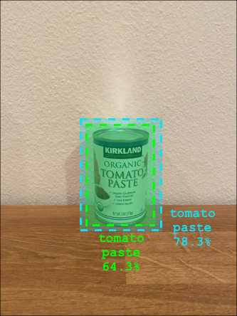

<!--
CO_OP_TRANSLATOR_METADATA:
{
  "original_hash": "1c9e5fa8b7be726c75a97232b1e41c97",
  "translation_date": "2025-08-28T17:35:43+00:00",
  "source_file": "5-retail/lessons/2-check-stock-device/README.md",
  "language_code": "my"
}
-->
# IoT Device မှ စတော့စစ်ဆေးခြင်း


> [Nitya Narasimhan](https://github.com/nitya) မှရေးသားထားသော Sketchnote။ ပုံကို click လုပ်ပြီး ပိုမိုကြီးမားသော ဗားရှင်းကို ကြည့်ပါ။

## သင်ခန်းစာမတိုင်မီ မေးခွန်းများ

[သင်ခန်းစာမတိုင်မီ မေးခွန်းများ](https://black-meadow-040d15503.1.azurestaticapps.net/quiz/39)

## အကျဉ်းချုပ်

ယခင်သင်ခန်းစာတွင် သင်သည် ရောင်းချရေးလုပ်ငန်းများတွင် object detection ကို အသုံးပြုနိုင်သော နည်းလမ်းများနှင့် stock ကို ရှာဖွေဖော်ထုတ်ရန် object detector ကို သင်ကြားခဲ့သည်။ ဒီသင်ခန်းစာတွင် သင်၏ IoT device မှ object detector ကို အသုံးပြု၍ stock ကို ရေတွက်နည်းကို သင်ယူပါမည်။

ဒီသင်ခန်းစာတွင် အောက်ပါအကြောင်းအရာများကို လေ့လာပါမည်-

* [Stock ရေတွက်ခြင်း](../../../../../5-retail/lessons/2-check-stock-device)
* [IoT device မှ object detector ကို ခေါ်ယူခြင်း](../../../../../5-retail/lessons/2-check-stock-device)
* [Bounding boxes](../../../../../5-retail/lessons/2-check-stock-device)
* [မော်ဒယ်ကို ပြန်လည်လေ့ကျင့်ခြင်း](../../../../../5-retail/lessons/2-check-stock-device)
* [Stock ရေတွက်ခြင်း](../../../../../5-retail/lessons/2-check-stock-device)

> 🗑 ဒီသင်ခန်းစာသည် ဒီ project ၏ နောက်ဆုံးသင်ခန်းစာဖြစ်ပြီး သင်ခန်းစာနှင့် assignment ကို ပြီးမြောက်ပြီးနောက် cloud services များကို ရှင်းလင်းရန် မမေ့ပါနှင့်။ သင်သည် assignment ကို ပြီးမြောက်ရန် services များလိုအပ်မည်ဖြစ်သောကြောင့် အရင်ဆုံး ပြီးမြောက်စေပါ။
>
> [Project ကို ရှင်းလင်းရန် လမ်းညွှန်ချက်](../../../clean-up.md) ကို လိုအပ်ပါက ကြည့်ပါ။

## Stock ရေတွက်ခြင်း

Object detectors များကို stock စစ်ဆေးရန် အသုံးပြုနိုင်သည်၊ stock ရေတွက်ခြင်း သို့မဟုတ် stock သည် သင့်နေရာတွင်ရှိနေသည်ကို အတည်ပြုခြင်းတို့အတွက် အသုံးပြုနိုင်သည်။ ကင်မရာပါရှိသော IoT devices များကို ဆိုင်တစ်ခုလုံးတွင် တပ်ဆင်နိုင်ပြီး အထူးသဖြင့် အရေးကြီးသော hot spots များတွင် stock ပြန်လည်ဖြည့်ရန် အရေးကြီးသောနေရာများတွင် စတင်စောင့်ကြည့်နိုင်သည်။

ဥပမာအားဖြင့် ကင်မရာတစ်ခုသည် 8 ကန်အထိ tomato paste ကို ထည့်နိုင်သော စင်တစ်ခုကို ဦးတည်ထားပြီး object detector သည် 7 ကန်သာ ရှာဖွေတွေ့ရှိခဲ့ပါက တစ်ခုပျောက်နေပြီး ပြန်လည်ဖြည့်ရန် လိုအပ်သည်။


အထက်ပါပုံတွင် object detector သည် 8 ကန်ထည့်နိုင်သော စင်ပေါ်တွင် 7 ကန်ရှိသော tomato paste ကို ရှာဖွေတွေ့ရှိခဲ့သည်။ IoT device သည် stock ပြန်လည်ဖြည့်ရန် အချက်ပေးနိုင်သလို ပျောက်နေသော item ၏ တည်နေရာကိုလည်း ဖော်ပြနိုင်သည်။ ဒါသည် စင်များကို ပြန်လည်ဖြည့်ရန် robots အသုံးပြုနေပါက အရေးကြီးသော ဒေတာဖြစ်သည်။

> 💁 ဆိုင်နှင့် item ၏ လူကြိုက်များမှုအပေါ် မူတည်၍ 1 ကန်ပျောက်နေသည့်အခါ stock ပြန်လည်ဖြည့်ခြင်း မဖြစ်နိုင်ပါ။ သင်၏ product, customer များနှင့် အခြားအချက်အလက်များအပေါ် မူတည်၍ stock ပြန်လည်ဖြည့်ရန် အချိန်ကို သတ်မှတ်သော algorithm တစ်ခုကို တည်ဆောက်ရန် လိုအပ်ပါမည်။

✅ Object detection နှင့် robots ကို ပေါင်းစပ်အသုံးပြုနိုင်သော အခြားအခြေအနေများကို သင်ထင်မြင်နိုင်ပါသလား?

တစ်ခါတစ်ရံ stock မှားနေသောအခါလည်း ရှိနိုင်သည်။ ဒါသည် stock ပြန်လည်ဖြည့်ရာတွင် လူ့အမှားဖြစ်နိုင်သလို၊ customer များသည် item ကို ဝယ်ယူရန် စိတ်ပြောင်းပြီး item ကို ပထမဆုံးရရှိသောနေရာတွင် ပြန်ထားခြင်းဖြစ်နိုင်သည်။ canned goods ကဲ့သို့ မပျက်စီးနိုင်သော item များအတွက် ဒါသည် အနှောင့်အယှက်ဖြစ်နိုင်သည်။ frozen goods သို့မဟုတ် chilled goods ကဲ့သို့ ပျက်စီးနိုင်သော item များအတွက် ဒါသည် item ကို အေးခဲထားသောအချိန်ကို မသိနိုင်သောကြောင့် ပြန်ရောင်းရန် မဖြစ်နိုင်တော့သည်။

Object detection ကို မမျှော်လင့်ထားသော item များကို ရှာဖွေဖော်ထုတ်ရန် အသုံးပြုနိုင်ပြီး item ကို ပြန်ထားရန် လူတစ်ဦး သို့မဟုတ် robot ကို အချက်ပေးနိုင်သည်။


အထက်ပါပုံတွင် baby corn ကန်တစ်ခုသည် tomato paste အနီးတွင် စင်ပေါ်တွင်ထားရှိထားသည်။ Object detector သည် ဒါကို ရှာဖွေတွေ့ရှိပြီး IoT device သည် လူတစ်ဦး သို့မဟုတ် robot ကို အချက်ပေးနိုင်သည်။

## IoT device မှ object detector ကို ခေါ်ယူခြင်း

သင်သည် ယခင်သင်ခန်းစာတွင် လေ့ကျင့်ထားသော object detector ကို IoT device မှ ခေါ်ယူနိုင်သည်။

### Task - သင်၏ object detector ၏ iteration ကို publish လုပ်ပါ

Iterations များကို Custom Vision portal မှ publish လုပ်ပါ။

1. [CustomVision.ai](https://customvision.ai) တွင် Custom Vision portal ကို ဖွင့်ပြီး login လုပ်ပါ။ `stock-detector` project ကို ဖွင့်ပါ။

1. အပေါ်ဘက် options များမှ **Performance** tab ကို ရွေးပါ။

1. *Iterations* စာရင်းမှ နောက်ဆုံး iteration ကို ရွေးပါ။

1. Iteration ၏ **Publish** ခလုတ်ကို ရွေးပါ။

    

1. *Publish Model* dialog တွင် *Prediction resource* ကို `stock-detector-prediction` resource သို့ ပြောင်းပါ။ Name ကို `Iteration2` အဖြစ်ထားပြီး **Publish** ခလုတ်ကို ရွေးပါ။

1. Publish ပြီးလျှင် **Prediction URL** ခလုတ်ကို ရွေးပါ။ ဒါသည် prediction API ၏ အသေးစိတ်ကို ဖော်ပြမည်ဖြစ်ပြီး IoT device မှ model ကို ခေါ်ရန် လိုအပ်ပါမည်။ *If you have an image file* အပိုင်းသည် သင်လိုအပ်သော အသေးစိတ်ဖြစ်သည်။ URL ကို ကူးယူပါ၊ ဒါသည် အောက်ပါအတိုင်းဖြစ်နိုင်သည်-

    ```output
    https://<location>.api.cognitive.microsoft.com/customvision/v3.0/Prediction/<id>/detect/iterations/Iteration2/image
    ```

    `<location>` သည် သင်၏ custom vision resource ကို ဖန်တီးစဉ် အသုံးပြုထားသော location ဖြစ်ပြီး `<id>` သည် အက္ခရာနှင့် နံပါတ်များဖြင့် ဖွဲ့စည်းထားသော ID ဖြစ်သည်။

    *Prediction-Key* တန်ဖိုးကိုလည်း ကူးယူပါ။ ဒါသည် secure key ဖြစ်ပြီး model ကို ခေါ်သည့်အခါ pass လုပ်ရန် လိုအပ်သည်။ ဒီ key ကို pass လုပ်သော application များသာ model ကို အသုံးပြုခွင့်ရမည်ဖြစ်ပြီး အခြား application များကို ပယ်ချမည်။

    

✅ အသစ်သော iteration ကို publish လုပ်သောအခါ name သည် ကွဲပြားနေမည်။ IoT device သည် အသုံးပြုနေသော iteration ကို ပြောင်းလဲရန် သင်ဘယ်လိုလုပ်မည်ဟု ထင်ပါသလဲ?

### Task - IoT device မှ object detector ကို ခေါ်ယူပါ

IoT device မှ object detector ကို အသုံးပြုရန် အောက်ပါလမ်းညွှန်ချက်များကို လိုက်နာပါ-

* [Arduino - Wio Terminal](wio-terminal-object-detector.md)
* [Single-board computer - Raspberry Pi/Virtual device](single-board-computer-object-detector.md)

## Bounding boxes

Object detector ကို အသုံးပြုသောအခါ tag နှင့် probability များအပြင် bounding boxes ကိုလည်း ရရှိမည်။ Bounding boxes များသည် object detector သည် object ကို ရှာဖွေတွေ့ရှိသောနေရာကို သတ်မှတ်သည်။

> 💁 Bounding box သည် object ရှိနေသောနေရာကို သတ်မှတ်ထားသော box ဖြစ်သည်။

Custom Vision ၏ **Predictions** tab တွင် prediction ရလဒ်များတွင် bounding boxes များကို ပုံပေါ်တွင် ရှာဖွေတွေ့ရှိထားသော object များအပေါ်တွင် ရေးဆွဲထားသည်။


အထက်ပါပုံတွင် tomato paste 4 ကန်ကို ရှာဖွေတွေ့ရှိခဲ့သည်။ ရလဒ်များတွင် object တစ်ခုစီအပေါ်တွင် bounding box များကို ရေးဆွဲထားသည်။

✅ Custom Vision တွင် prediction များကို ဖွင့်ပြီး bounding boxes ကို ကြည့်ပါ။

Bounding boxes များကို top, left, height နှင့် width တန်ဖိုး 4 ခုဖြင့် သတ်မှတ်သည်။ ဒီတန်ဖိုးများသည် 0-1 scale တွင်ရှိပြီး ပုံ၏ အရွယ်အစား၏ ရာခိုင်နှုန်းအနေဖြင့် သတ်မှတ်ထားသည်။ Origin (0,0) သည် ပုံ၏ အပေါ်ဘက် ဘယ်ဘက်ဖြစ်ပြီး top တန်ဖိုးသည် အပေါ်ဘက်မှ အကွာအဝေးကို ဖော်ပြသည်၊ bounding box ၏ အောက်ဘက်သည် top နှင့် height တန်ဖိုးကို ပေါင်းထားသည်။


အထက်ပါပုံသည် 600 pixels အကျယ်နှင့် 800 pixels အမြင့်ရှိသည်။ Bounding box သည် 320 pixels အောက်တွင် စတင်ပြီး top coordinate သည် 0.4 (800 x 0.4 = 320) ဖြစ်သည်။ Bounding box သည် 240 pixels ဘယ်ဘက်တွင် စတင်ပြီး left coordinate သည် 0.4 (600 x 0.4 = 240) ဖြစ်သည်။ Bounding box ၏ height သည် 240 pixels ဖြစ်ပြီး height value သည် 0.3 (800 x 0.3 = 240) ဖြစ်သည်။ Bounding box ၏ width သည် 120 pixels ဖြစ်ပြီး width value သည် 0.2 (600 x 0.2 = 120) ဖြစ်သည်။

| Coordinate | Value |
| ---------- | ----: |
| Top        | 0.4   |
| Left       | 0.4   |
| Height     | 0.3   |
| Width      | 0.2   |

Percentage values (0-1) ကို အသုံးပြုခြင်းသည် ပုံ၏ အရွယ်အစားကို မည်သို့ပဲ ပြောင်းလဲထားပါစေ bounding box သည် 0.4 အကွာအဝေးနှင့် 0.3 height, 0.2 width ရှိနေမည်ဖြစ်သည်။

Bounding boxes များကို probabilities နှင့် ပေါင်းစပ်၍ detection ၏ တိကျမှုကို အကဲဖြတ်နိုင်သည်။ ဥပမာအားဖြင့် object detector သည် တစ်ခုနှင့် တစ်ခု အပြိုင်ရှိသော object များကို detect လုပ်နိုင်သည်၊ ဥပမာအားဖြင့် တစ်ခု၏ bounding box အတွင်းတွင် တစ်ခုရှိနေသည်။ သင်၏ code သည် bounding boxes များကို စစ်ဆေးပြီး ဒါသည် မဖြစ်နိုင်ကြောင်းနားလည်ပြီး overlap အများကြီးရှိသော object များကို ပယ်ချနိုင်သည်။



အထက်ပါဥပမာတွင် bounding box တစ်ခုသည် tomato paste ကန်တစ်ခုကို 78.3% probability ဖြင့် detect လုပ်ထားသည်။ ဒုတိယ bounding box သည် ပိုမိုသေးငယ်ပြီး ပထမ bounding box ၏ အတွင်းရှိနေပြီး probability သည် 64.3% ဖြစ်သည်။ သင်၏ code သည် bounding boxes များကို စစ်ဆေးပြီး overlap ဖြစ်နေကြောင်း တွေ့ရှိပြီး အနိမ့်ဆုံး probability ကို ပယ်ချနိုင်သည်။

✅ Object တစ်ခုသည် တစ်ခု၏ အတွင်းရှိနေသည်ဟု သက်သေပြနိုင်သော အခြေအနေကို သင်ထင်မြင်နိုင်ပါသလား?

## မော်ဒယ်ကို ပြန်လည်လေ့ကျင့်ခြင်း

Image classifier ကဲ့သို့ IoT device မှ ရရှိသော ဒေတာကို အသုံးပြု၍ မော်ဒယ်ကို ပြန်လည်လေ့ကျင့်နိုင်သည်။ ဒီ real-world ဒေတာကို အသုံးပြုခြင်းသည် IoT device မှ အသုံးပြုသောအခါ မော်ဒယ်သည် ကောင်းမွန်စွာ အလုပ်လုပ်စေမည်ဖြစ်သည်။

Image classifier နှင့် မတူကွဲပြားသည်မှာ image ကို tag လုပ်ရုံမဟုတ်ပါ။ မော်ဒယ်မှ detect လုပ်ထားသော bounding box တစ်ခုစီကို ပြန်လည်သုံးသပ်ရန် လိုအပ်သည်။ Box သည် မှားနေပါက ဖျက်ရန် လိုအပ်ပြီး location မှားနေပါက ပြင်ဆင်ရန် လိုအပ်သည်။

### Task - မော်ဒယ်ကို ပြန်လည်လေ့ကျင့်ပါ

1. IoT device ကို အသုံးပြု၍ images များကို စုံလင်စွာ capture လုပ်ထားပါ။

1. **Predictions** tab မှ image တစ်ခုကို ရွေးပါ။ Red boxes များသည် detect လုပ်ထားသော object များ၏ bounding boxes ဖြစ်သည်။

1. Bounding box တစ်ခုစီကို စစ်ဆေးပါ။ Box ကို ရွေးပြီး pop-up တွင် tag ကို ကြည့်နိုင်သည်။ Box ၏ အရွယ်အစားကို ပြင်ဆင်ရန် corner handles များကို အသုံးပြုပါ။ Tag မှားနေပါက **X** ခလုတ်ကို အသုံးပြု၍ ဖျက်ပြီး မှန်ကန်သော tag ကို ထည့်ပါ။ Bounding box သည် object မပါရှိပါက trashcan ခလုတ်ကို အသုံးပြု၍ ဖျက်ပါ။

1. Editor ကို ပိတ်ပြီး image သည် **Predictions** tab မှ **Training Images** tab သို့ ပြောင်းမည်။ Prediction များအားလုံးအတွက် ဒီလုပ်ငန်းစဉ်ကို ထပ်လုပ်ပါ။

1. **Train** ခလုတ်ကို အသုံးပြု၍ မော်ဒယ်ကို ပြန်လည်လေ့ကျင့်ပါ။ လေ့ကျင့်ပြီးလျှင် iteration ကို publish လုပ်ပြီး IoT device ကို iteration အသစ်၏ URL ကို အသုံးပြုရန် update လုပ်ပါ။

1. သင်၏ code ကို ပြန်လည် deploy လုပ်ပြီး IoT device ကို စမ်းသပ်ပါ။

## Stock ရေတွက်ခြင်း

Detect လုပ်ထားသော object များ၏ အရေအတွက်နှင့် bounding boxes ကို ပေါင်းစပ်၍ စင်ပေါ်ရှိ stock ကို ရေတွက်နိုင်သည်။

### Task - Stock ရေတွက်ပါ

IoT device မှ object detector ၏ ရလဒ်များကို အသုံးပြု၍ stock ရေတွက်ရန် အောက်ပါလမ်းညွှန်ချက်များကို လိုက်နာပါ-

* [Arduino - Wio Terminal](wio-terminal-count-stock.md)
* [Single-board computer - Raspberry Pi/Virtual device](single-board-computer-count-stock.md)

---

## 🚀 စိန်ခေါ်မှု

မှားနေသော stock ကို detect လုပ်နိုင်ပါသလား? မော်ဒယ်ကို object များစုံလင်စွာ training လုပ်ပြီး app ကို update လုပ်ကာ မှားနေသော stock ကို detect လုပ်ပါ။

ဒါကို ပိုမိုတိုးတက်စေရန် shelf တစ်ခုပေါ်တွင် side by side ရှိသော stock များကို detect လုပ်ပြီး bounding boxes ၏ အကန့်အသတ်များကို သတ်မှတ်ကာ မှားနေသောနေရာများကို ရှာဖွေပါ။

## သင်ခန်းစာပြီးနောက် မေးခွန်းများ

[သင်ခန်းစာပြီးနောက် မေးခွန်းများ](https://black-meadow-040d15503.1.azurestaticapps.net/quiz/40)

## ပြန်လည်သုံးသပ်ခြင်းနှင့် ကိုယ်တိုင်လေ့လာခြင်း

* [Microsoft Docs](https://docs.microsoft.com/hybrid/app-solutions/pattern-out-of-stock-at-edge?

---

**အကြောင်းကြားချက်**:  
ဤစာရွက်စာတမ်းကို AI ဘာသာပြန်ဝန်ဆောင်မှု [Co-op Translator](https://github.com/Azure/co-op-translator) ကို အသုံးပြု၍ ဘာသာပြန်ထားပါသည်။ ကျွန်ုပ်တို့သည် တိကျမှုအတွက် ကြိုးစားနေသော်လည်း၊ အလိုအလျောက် ဘာသာပြန်ခြင်းတွင် အမှားများ သို့မဟုတ် မတိကျမှုများ ပါဝင်နိုင်သည်ကို သတိပြုပါ။ မူရင်းစာရွက်စာတမ်းကို ၎င်း၏ မူရင်းဘာသာစကားဖြင့် အာဏာတရားရှိသော အရင်းအမြစ်အဖြစ် သတ်မှတ်သင့်ပါသည်။ အရေးကြီးသော အချက်အလက်များအတွက် လူ့ဘာသာပြန်ပညာရှင်များမှ ပရော်ဖက်ရှင်နယ် ဘာသာပြန်ခြင်းကို အကြံပြုပါသည်။ ဤဘာသာပြန်ကို အသုံးပြုခြင်းမှ ဖြစ်ပေါ်လာသော အလွဲအလွတ်များ သို့မဟုတ် အနားယူမှုမှားများအတွက် ကျွန်ုပ်တို့သည် တာဝန်မယူပါ။