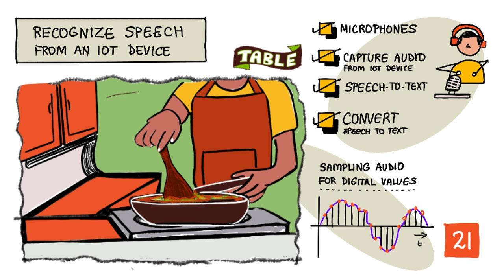

<!--
CO_OP_TRANSLATOR_METADATA:
{
  "original_hash": "6d6aa1be033625d201a190fc9c5cbfb4",
  "translation_date": "2025-08-28T16:24:38+00:00",
  "source_file": "6-consumer/lessons/1-speech-recognition/README.md",
  "language_code": "my"
}
-->
# IoT စက်ပစ္စည်းများနှင့် အသံအသိအမှတ်ပြုခြင်း



> ပုံရေးဆွဲသူ [Nitya Narasimhan](https://github.com/nitya)။ ပုံကို နှိပ်ပြီး ပိုကြီးမားသော ဗားရှင်းကို ကြည့်ပါ။

ဒီဗီဒီယိုမှာ Azure Speech Service အကြောင်းကို အကျဉ်းချုပ်ဖော်ပြထားပြီး၊ ဒီသင်ခန်းစာမှာ လေ့လာမည့် အကြောင်းအရာများကို ဖော်ပြထားပါတယ်။

[](https://www.youtube.com/watch?v=iW0Fw0l3mrA)

> 🎥 အထက်ပါပုံကို နှိပ်ပြီး ဗီဒီယိုကို ကြည့်ပါ။

## သင်ခန်းစာမတိုင်မီ စမ်းမေးခွန်း

[သင်ခန်းစာမတိုင်မီ စမ်းမေးခွန်း](https://black-meadow-040d15503.1.azurestaticapps.net/quiz/41)

## နိဒါန်း

'Alexa, ၁၂ မိနစ်အချိန်တင်ပေးပါ'

'Alexa, အချိန်တင်ထားတာ ဘယ်လောက်ကျန်လဲ'

'Alexa, ၈ မိနစ်အချိန်တင်ပေးပါ၊ steam broccoli လို့ အမည်ပေးပါ'

စမတ်စက်ပစ္စည်းတွေဟာ အခုခေတ်မှာ ပိုမိုကျယ်ပြန့်လာနေပါတယ်။ HomePods, Echos, Google Homes လို စမတ်စပီကာတွေမှာသာမက၊ ဖုန်းတွေ၊ နာရီတွေ၊ မီးအိမ်တွေ၊ အပူချိန်ထိန်းညှိစက်တွေထဲမှာပါ ပါဝင်လာပါတယ်။

> 💁 ကျွန်တော့်အိမ်မှာ အသံအကူအညီပေးစက်ပစ္စည်း ၁၉ ခုရှိတယ်၊ ဒါက ကျွန်တော်သိတဲ့အတိုင်းပါပဲ!

အသံထိန်းချုပ်မှုက အားနည်းမှုရှိသူတွေအတွက် စက်ပစ္စည်းတွေနဲ့ အလွယ်တကူ ဆက်သွယ်နိုင်စေတဲ့ အခွင့်အရေးကို ပိုမိုပေးစွမ်းပါတယ်။ ဥပမာအားဖြင့် လက်မရှိသူများ၊ လက်ကျိုးနေသူများ၊ သို့မဟုတ် လက်တွေက အဝတ်အစား သို့မဟုတ် ကလေးတွေကို ကိုင်ထားရတဲ့အချိန်တွေမှာ အသံနဲ့ အိမ်ကို ထိန်းချုပ်နိုင်ခြင်းက အသုံးဝင်တဲ့ နည်းလမ်းတစ်ခုဖြစ်ပါတယ်။ 'Hey Siri, ဂိုဒေါင်တံခါးပိတ်ပေးပါ' လို့ ပြောရုံနဲ့ ကလေးနှစ်ယောက်ကို ထိန်းချုပ်ရင်း အလုပ်တစ်ခုကို အဆင်ပြေစေပါတယ်။

အသံအကူအညီပေးစက်တွေကို အများဆုံး အသုံးပြုတဲ့ နည်းလမ်းတစ်ခုက အချိန်တင်ခြင်းဖြစ်ပါတယ်။ မုန့်ဖုတ်နေစဉ်၊ ဟင်းချက်နေစဉ်မှာ လက်တွေကို သန့်ရှင်းစရာမလိုဘဲ အသံနဲ့ အချိန်တင်နိုင်ခြင်းက မီးဖိုချောင်မှာ အလွန်အဆင်ပြေစေပါတယ်။

ဒီသင်ခန်းစာမှာ IoT စက်ပစ္စည်းတွေမှာ အသံအသိအမှတ်ပြုစနစ်ကို တည်ဆောက်နည်းကို သင်လေ့လာပါမယ်။ မိုက်ခရိုဖုန်းတွေကို အာရုံခံစနစ်အဖြစ် အသုံးပြုနည်း၊ IoT စက်ပစ္စည်းတွေနဲ့ အသံဖမ်းယူနည်း၊ AI ကို အသုံးပြုပြီး အသံကို စာသားအဖြစ် ပြောင်းလဲနည်းတို့ကို လေ့လာပါမယ်။ ဒီပရောဂျက်တစ်ခုလုံးအတွင်းမှာ သင်အသံနဲ့ အချိန်တင်နိုင်တဲ့ စမတ်မီးဖိုချောင်အချိန်တင်စက်တစ်ခုကို တည်ဆောက်ပါမယ်။

ဒီသင်ခန်းစာမှာ အောက်ပါအကြောင်းအရာများကို လေ့လာပါမယ်-

* [မိုက်ခရိုဖုန်းများ](../../../../../6-consumer/lessons/1-speech-recognition)
* [IoT စက်ပစ္စည်းမှ အသံဖမ်းယူခြင်း](../../../../../6-consumer/lessons/1-speech-recognition)
* [အသံမှ စာသားပြောင်းခြင်း](../../../../../6-consumer/lessons/1-speech-recognition)
* [AI အသုံးပြု၍ အသံမှ စာသားပြောင်းခြင်း](../../../../../6-consumer/lessons/1-speech-recognition)

## မိုက်ခရိုဖုန်းများ

မိုက်ခရိုဖုန်းတွေက အသံလှိုင်းတွေကို လျှပ်စစ်သံစဉ်အဖြစ် ပြောင်းလဲပေးတဲ့ အာရုံခံစနစ်တွေဖြစ်ပါတယ်။ လေထဲမှာ လှုပ်ရှားမှုတွေကြောင့် မိုက်ခရိုဖုန်းရဲ့ အစိတ်အပိုင်းတွေ အနည်းငယ်လှုပ်ရှားပြီး၊ ဒီလှုပ်ရှားမှုတွေက လျှပ်စစ်သံစဉ်အပြောင်းအလဲတွေကို ဖြစ်ပေါ်စေပါတယ်။ ဒီသံစဉ်တွေကို ပြန်လည်တိုးချဲ့ပြီး လျှပ်စစ်ထွက်ရှိမှုကို ဖန်တီးပါတယ်။

### မိုက်ခရိုဖုန်းအမျိုးအစားများ

မိုက်ခရိုဖုန်းတွေမှာ အမျိုးအစားအမျိုးမျိုးရှိပါတယ်-

* **Dynamic** - Dynamic မိုက်ခရိုဖုန်းတွေမှာ လှုပ်ရှားနေတဲ့ diaphragm နဲ့ သံလိုက်တစ်ခုရှိပြီး၊ သံလိုက်ဟာ ကြိုးကွိုင်ထဲမှာ လှုပ်ရှားပြီး လျှပ်စစ်သံစဉ်ကို ဖန်တီးပါတယ်။ Dynamic မိုက်ခရိုဖုန်းတွေကို လျှပ်စစ်ဓာတ်အားမလိုအပ်ပါဘူး။

    

* **Ribbon** - Ribbon မိုက်ခရိုဖုန်းတွေက Dynamic မိုက်ခရိုဖုန်းတွေနဲ့ ဆင်တူပြီး၊ diaphragm အစား သတ္တုရစ်ဘွန်ကို အသုံးပြုပါတယ်။

    

* **Condenser** - Condenser မိုက်ခရိုဖုန်းတွေမှာ သေးငယ်တဲ့ သတ္တု diaphragm နဲ့ သံလိုက်ပြားတစ်ခုပါဝင်ပါတယ်။ ဒီ diaphragm လှုပ်ရှားမှုကြောင့် လျှပ်စစ်သံစဉ်ကို ဖန်တီးပါတယ်။ Condenser မိုက်ခရိုဖုန်းတွေကို လျှပ်စစ်ဓာတ်အားလိုအပ်ပါတယ်။

    

* **MEMS** - MEMS မိုက်ခရိုဖုန်းတွေက chip ပေါ်မှာ တည်ဆောက်ထားတဲ့ မိုက်ခရိုဖုန်းတွေဖြစ်ပြီး၊ အလွန်သေးငယ်တဲ့ diaphragm ပါဝင်ပါတယ်။

    

    အထက်ပါပုံမှာ **LEFT** လို့ရေးထားတဲ့ chip က MEMS မိုက်ခရိုဖုန်းဖြစ်ပြီး၊ diaphragm က ၁ မီလီမီတာထက် သေးငယ်ပါတယ်။

✅ သင်ရှာဖွေရေးလုပ်ပါ- သင့်အနီးမှာရှိတဲ့ မိုက်ခရိုဖုန်းတွေကို စူးစမ်းကြည့်ပါ။ သင့်ဖုန်း၊ ကွန်ပျူတာ၊ နားကြပ် သို့မဟုတ် အခြားစက်ပစ္စည်းတွေမှာ ဘယ်လိုမိုက်ခရိုဖုန်းတွေပါဝင်လဲ။

### ဒစ်ဂျစ်တယ်အသံ

အသံဟာ အလွန်သေးငယ်တဲ့ analog သံစဉ်တစ်ခုဖြစ်ပါတယ်။ ဒီသံစဉ်ကို ဒစ်ဂျစ်တယ်အဖြစ် ပြောင်းဖို့အတွက် တစ်စက္ကန့်ကို ထောင်ပေါင်းများစွာ စမ်းသပ်ဖတ်ရှုရပါတယ်။

> 🎓 Sampling ဆိုတာက အသံသံစဉ်ကို တစ်ချိန်ချိန်မှာရှိတဲ့ ဒစ်ဂျစ်တယ်တန်ဖိုးအဖြစ် ပြောင်းလဲခြင်းဖြစ်ပါတယ်။


Digital audio ကို Pulse Code Modulation (PCM) နည်းလမ်းဖြင့် စမ်းသပ်ဖတ်ရှုပါတယ်။ PCM က သံစဉ်ရဲ့ ဗို့အားကို ဖတ်ပြီး၊ သတ်မှတ်ထားတဲ့ discrete တန်ဖိုးနဲ့ အနီးဆုံးတန်ဖိုးကို ရွေးချယ်ပါတယ်။

> 💁 PCM ကို PWM နဲ့ နှိုင်းယှဉ်ကြည့်နိုင်ပါတယ် (PWM ကို [သင်ခန်းစာ ၃](../../../1-getting-started/lessons/3-sensors-and-actuators/README.md#pulse-width-modulation) မှာ လေ့လာခဲ့ပြီးဖြစ်ပါတယ်)။ PCM က analog သံစဉ်ကို ဒစ်ဂျစ်တယ်အဖြစ် ပြောင်းတာဖြစ်ပြီး၊ PWM က ဒစ်ဂျစ်တယ်သံစဉ်ကို analog အဖြစ် ပြောင်းတာဖြစ်ပါတယ်။

ဥပမာအားဖြင့်၊ streaming music service တွေက 16-bit သို့မဟုတ် 24-bit audio ကို ပေးပါတယ်။ 16-bit audio က -32,768 မှ 32,767 အတွင်းရှိ တန်ဖိုးကို အသုံးပြုပြီး၊ 24-bit audio က −8,388,608 မှ 8,388,607 အတွင်းရှိ တန်ဖိုးကို အသုံးပြုပါတယ်။ Bit ပိုများလေ၊ သံစဉ်က သက်တောင့်သက်သာနားထောင်နိုင်တဲ့အထိ ပိုမိုတိကျလာပါတယ်။

> 💁 8-bit audio ကို LoFi လို့လည်း ခေါ်ကြပါတယ်။ 8-bit audio က hardware ကန့်သတ်ချက်ကြောင့် အရင်က အသုံးပြုခဲ့တဲ့ ပုံစံဖြစ်ပြီး၊ retro gaming တွေမှာ တွေ့ရပါတယ်။

ဒီ samples တွေကို တစ်စက္ကန့်ကို ထောင်ပေါင်းများစွာ ဖတ်ရှုရပါတယ်။ Sample rate ကို KHz (တစ်စက္ကန့်ကို ထောင်ပေါင်းများစွာ) ဖြင့် တိုင်းတာပါတယ်။ Streaming music service တွေက 48KHz ကို အသုံးပြုပြီး၊ lossless audio တွေက 96KHz သို့မဟုတ် 192KHz အထိ အသုံးပြုနိုင်ပါတယ်။

✅ သင်ရှာဖွေရေးလုပ်ပါ- သင်အသုံးပြုတဲ့ streaming music service က ဘယ် sample rate နဲ့ size ကို အသုံးပြုလဲ? CD အသုံးပြုရင် CD audio ရဲ့ sample rate နဲ့ size ဘယ်လိုလဲ?

Audio data တွေမှာ format အမျိုးမျိုးရှိပါတယ်။ mp3 files တွေက audio data ကို compress လုပ်ထားတာဖြစ်ပြီး၊ WAV files တွေက uncompressed audio data ကို သိမ်းဆည်းထားပါတယ်။

> 🎓 Channels ဆိုတာက audio stream အရေအတွက်ကို ဆိုလိုပါတယ်။ Stereo audio မှာ left နဲ့ right channels ၂ ခုရှိပြီး၊ 7.1 surround sound မှာ ၈ ခုရှိပါတယ်။

### အသံဒေတာအရွယ်အစား

အသံဒေတာတွေက အရွယ်အစားကြီးပါတယ်။ ဥပမာအားဖြင့်၊ 16-bit audio ကို 16KHz မှာ ဖမ်းယူရင် တစ်စက္ကန့်ကို 32KB ဖြစ်ပါတယ်-

* 16-bit ဆိုတာ 2 bytes per sample ဖြစ်တယ်။
* 16KHz ဆိုတာ တစ်စက္ကန့်ကို 16,000 samples ဖြစ်တယ်။
* 16,000 x 2 bytes = 32,000 bytes per second။

ဒီဒေတာအရွယ်အစားဟာ microcontroller တွေမှာ memory ကန့်သတ်ချက်ကြောင့် အခက်အခဲဖြစ်စေတတ်ပါတယ်။ Microcontroller တွေမှာ SD card သို့မဟုတ် flash memory တွေကို အသုံးပြုနိုင်ပါတယ်။

## IoT စက်ပစ္စည်းမှ အသံဖမ်းယူခြင်း

IoT စက်ပစ္စည်းတွေကို မိုက်ခရိုဖုန်းနဲ့ ချိတ်ဆက်ပြီး အသံဖမ်းယူနိုင်ပါတယ်။ 

### လုပ်ငန်းစဉ် - မိုက်ခရိုဖုန်းနဲ့ စပီကာကို ပြင်ဆင်ပါ

သင့် IoT စက်ပစ္စည်းအတွက် မိုက်ခရိုဖုန်းနဲ့ စပီကာကို ပြင်ဆင်ရန် လမ်းညွှန်ချက်ကို လိုက်နာပါ-

* [Arduino - Wio Terminal](wio-terminal-microphone.md)
* [Single-board computer - Raspberry Pi](pi-microphone.md)
* [Single-board computer - Virtual device](virtual-device-microphone.md)

### လုပ်ငန်းစဉ် - အသံဖမ်းယူပါ

သင့် IoT စက်ပစ္စည်းမှာ အသံဖမ်းယူရန် လမ်းညွှန်ချက်ကို လိုက်နာပါ-

* [Arduino - Wio Terminal](wio-terminal-audio.md)
* [Single-board computer - Raspberry Pi](pi-audio.md)
* [Single-board computer - Virtual device](virtual-device-audio.md)

## အသံမှ စာသားပြောင်းခြင်း

အသံမှ စာသားပြောင်းခြင်း (Speech to text) ဆိုတာ AI ကို အသုံးပြုပြီး အသံထဲက စကားလုံးတွေကို စာသားအဖြစ် ပြောင်းခြင်းဖြစ်ပါတယ်။

### အသံအသိအမှတ်ပြုမော်ဒယ်များ

အသံမှ စာသားပြောင်းဖို့ ML မော်ဒယ်တွေကို အသုံးပြုပါတယ်။ RNN (Recurrent Neural Network) မော်ဒယ်တွေက အရင်ရရှိထားတဲ့ ဒေတာကို အသုံးပြုပြီး လက်ရှိဒေတာကို ခွဲခြမ်းနိုင်ပါတယ်။

ML မော်ဒယ်တွေဟာ အချိန်တိုင်း တူညီတဲ့ အရွယ်အစားရှိတဲ့ ဒေတာကို လက်ခံရပါတယ်။ Speech မော်ဒယ်တွေကလည်း တိကျတဲ့ audio chunks တွေကို လက်ခံပြီး အဖြေကို ပေါင်းစပ်နိုင်ရပါတယ်။

Speech မော်ဒယ်တွေဟာ context ကိုလည်း နားလည်နိုင်ပါတယ်။ ဥပမာအားဖြင့် "I went to the shops to get two bananas and an apple too" ဆိုရင်၊ 'to', 'two', 'too' ဆိုတဲ့ အသံတူစကားလုံးတွေကို context အရ မှန်ကန်စွာ ခွဲခြားနိုင်ပါတယ်။
💁 အချို့သော စကားပြောဝန်ဆောင်မှုများသည် စက်ရုံများကဲ့သို့သော ဆူညံသောပတ်ဝန်းကျင်များတွင် သက်သာစွာအသုံးပြုနိုင်ရန် သို့မဟုတ် ဓာတုအမည်များကဲ့သို့သော စက်မှုလုပ်ငန်းနှင့်သက်ဆိုင်သော စကားလုံးများနှင့်အတူ ပိုမိုကောင်းမွန်စွာအလုပ်လုပ်စေရန် စိတ်ကြိုက်ပြင်ဆင်နိုင်သည်။ ဤစိတ်ကြိုက်ပြင်ဆင်မှုများကို နမူနာအသံဖိုင်များနှင့် ရေးသားထားသော စာသားများကို ပံ့ပိုးပေးခြင်းဖြင့် လေ့ကျင့်ပြီး၊ transfer learning ကို အသုံးပြုကာ အလုပ်လုပ်သည်။ ၎င်းသည် ယခင်သင်ခန်းစာတစ်ခုတွင် အနည်းငယ်သော ပုံများကိုသာ အသုံးပြု၍ ပုံသိမြင်စက်ကို သင်လေ့ကျင့်ခဲ့သည့် နည်းလမ်းနှင့် တူညီသည်။
### ကိုယ်ရေးအချက်အလက်လုံခြုံမှု

အသုံးပြုသူ IoT စက်ပစ္စည်းများတွင် အသံမှ စာသားသို့ ပြောင်းလဲသုံးစွဲရာတွင် ကိုယ်ရေးအချက်အလက်လုံခြုံမှုသည် အလွန်အရေးကြီးပါသည်။ ဒီစက်ပစ္စည်းများသည် အသံကို အမြဲတမ်း နားထောင်နေကြသည်၊ ထို့ကြောင့် အသုံးပြုသူအနေဖြင့် သင့်ပြောစကားအားလုံးကို cloud သို့ ပို့ပြီး စာသားအဖြစ် ပြောင်းလဲစေချင်မှာ မဟုတ်ပါ။ ဒါဟာ အင်တာနက် bandwidth အများကြီး အသုံးပြုရမည်ဖြစ်သလို၊ ကိုယ်ရေးအချက်အလက်ဆိုင်ရာ ပြဿနာကြီးများလည်း ဖြစ်ပေါ်စေနိုင်ပါသည်။ အထူးသဖြင့် အချို့သော smart device ထုတ်လုပ်သူများက မည်သည့်အချိန်တွင်မဆို အသံများကို ရွေးချယ်ပြီး [သူတို့၏ မော်ဒယ်တိုးတက်စေရန် လူသားများက စစ်ဆေးရန်](https://www.theverge.com/2019/4/10/18305378/amazon-alexa-ai-voice-assistant-annotation-listen-private-recordings) အသုံးပြုသောအခါတွင်လည်း ဖြစ်နိုင်ပါသည်။

သင့် smart device သည် သင့်အသုံးပြုမှုအချိန်တွင်သာ အသံကို cloud သို့ ပို့ပြီး ပြုလုပ်စေချင်ပါသည်၊ သင့်အိမ်တွင်းရှိ အသံများ (ကိုယ်ရေး meetings သို့မဟုတ် ပုဂ္ဂိုလ်ရေး အပြုအမူများ ပါဝင်နိုင်သော အသံများ) ကို မပို့စေချင်ပါ။ အများစုသော smart device များသည် *wake word* ဟုခေါ်သော အဓိကစကားစုတစ်ခုဖြင့် အလုပ်လုပ်ပါသည်၊ ဥပမာ "Alexa", "Hey Siri", သို့မဟုတ် "OK Google" စသည်ဖြင့် စက်ပစ္စည်းကို 'နိုး' စေပြီး သင့်ပြောစကားကို နားထောင်ကာ သင့်စကားပြောပြီးဆုံးသည်ဟု သတ်မှတ်သည်အထိ နားထောင်ပါသည်။

> 🎓 Wake word detection ကို *Keyword spotting* သို့မဟုတ် *Keyword recognition* ဟုလည်း ခေါ်ဆိုကြသည်။

ဒီ wake words များကို စက်ပစ္စည်းပေါ်တွင်သာ စစ်ဆေးကြသည်၊ cloud ပေါ်တွင်မဟုတ်ပါ။ ဒီ smart devices များတွင် wake word ကို နားထောင်ရန် အထူးပြုလုပ်ထားသော သေးငယ်သော AI မော်ဒယ်များ ပါဝင်ပြီး၊ wake word ကို တွေ့ရှိသည်နှင့်တစ်ပြိုင်နက် အသံကို cloud သို့ စတင်ပို့ပေးပါသည်။ ဒီမော်ဒယ်များသည် အထူးပြုလုပ်ထားပြီး wake word ကိုသာ နားထောင်ပါသည်။

> 💁 အချို့သော နည်းပညာကုမ္ပဏီများသည် သူတို့၏ စက်ပစ္စည်းများတွင် ပိုမိုလုံခြုံမှုရှိစေရန် အသံမှ စာသားသို့ ပြောင်းလဲမှုကို စက်ပစ္စည်းပေါ်တွင် ပြုလုပ်နေပါသည်။ Apple က 2021 iOS နှင့် macOS အပ်ဒိတ်များတွင် စက်ပစ္စည်းပေါ်တွင် အသံမှ စာသားသို့ ပြောင်းလဲမှုကို ပံ့ပိုးမည်ဖြစ်ပြီး cloud ကို အသုံးမပြုဘဲ တောင်းဆိုမှုများစွာကို ကိုင်တွယ်နိုင်မည်ဟု ကြေညာခဲ့သည်။ ၎င်းသည် သူတို့၏ စက်ပစ္စည်းများတွင် ML မော်ဒယ်များကို အလုပ်လုပ်စေနိုင်သော အင်အားကြီး processor များပါဝင်နေခြင်းကြောင့် ဖြစ်သည်။

✅ သင့်အမြင်အရ cloud သို့ ပို့သော အသံများကို သိမ်းဆည်းထားခြင်းသည် ကိုယ်ရေးအချက်အလက်နှင့် ကျင့်ဝတ်ဆိုင်ရာ ဘယ်လိုအကျိုးသက်ရောက်မှုများရှိမည်ဟု ထင်ပါသလဲ။ ဒီအသံများကို သိမ်းဆည်းထားသင့်သလား၊ သိမ်းဆည်းပါက ဘယ်လို သိမ်းဆည်းသင့်သလဲ။ ရဲတပ်ဖွဲ့အတွက် အသံမှတ်တမ်းများကို အသုံးပြုခြင်းသည် ကိုယ်ရေးအချက်အလက်ဆုံးရှုံးမှုအတွက် ကောင်းသော အတန်အဖိုးဖြစ်နိုင်ပါသလား။

Wake word detection သည် TinyML ဟုခေါ်သော နည်းလမ်းကို အသုံးပြုလေ့ရှိပြီး၊ ၎င်းသည် ML မော်ဒယ်များကို microcontroller များပေါ်တွင် အလုပ်လုပ်နိုင်ရန် ပြောင်းလဲခြင်းဖြစ်သည်။ ဒီမော်ဒယ်များသည် အရွယ်အစားသေးငယ်ပြီး၊ လျှပ်စစ်စွမ်းအင်ကို အနည်းငယ်သာ အသုံးပြုပါသည်။

ဒီသင်ခန်းစာတွင် သင်တည်ဆောက်မည့် smart timer သည် wake word မော်ဒယ်ကို သင်ကြားခြင်းနှင့် အသုံးပြုခြင်း၏ ရှုပ်ထွေးမှုကို ရှောင်ရှားရန် button ကို အသုံးပြုကာ အသံအသိအမှတ်ပြုမှုကို ဖွင့်ပါမည်။

> 💁 Wio Terminal သို့မဟုတ် Raspberry Pi ပေါ်တွင် အလုပ်လုပ်စေရန် wake word detection မော်ဒယ်တစ်ခု ဖန်တီးလိုပါက ဒီ [Edge Impulse ၏ သင်ခန်းစာ](https://docs.edgeimpulse.com/docs/responding-to-your-voice) ကို ကြည့်ပါ။ သင့်ကွန်ပျူတာကို အသုံးပြုလိုပါက Microsoft Docs တွင်ရှိသော [Custom Keyword quickstart](https://docs.microsoft.com/azure/cognitive-services/speech-service/keyword-recognition-overview?WT.mc_id=academic-17441-jabenn) ကို စမ်းသပ်ကြည့်နိုင်ပါသည်။

## အသံမှ စာသားသို့ ပြောင်းလဲခြင်း


ယခင်ပရောဂျက်တွင် ရုပ်ပုံခွဲခြားမှုနှင့် တူသလို၊ အသံဖိုင်ကို စာသားအဖြစ် ပြောင်းလဲနိုင်သော အဆင့်သတ်မှတ်ပြီးသား AI ဝန်ဆောင်မှုများလည်း ရှိပါသည်။ ဒီဝန်ဆောင်မှုများထဲမှ တစ်ခုမှာ Speech Service ဖြစ်ပြီး၊ Cognitive Services ၏ အစိတ်အပိုင်းတစ်ခုဖြစ်သည်။ ၎င်းကို သင့်အက်ပ်များတွင် အသုံးပြုနိုင်ပါသည်။

### Task - Speech AI resource ကို ပြင်ဆင်ပါ

1. ဒီပရောဂျက်အတွက် `smart-timer` ဟုခေါ်သော Resource Group တစ်ခု ဖန်တီးပါ။

1. အောက်ပါ command ကို အသုံးပြုကာ အခမဲ့ speech resource တစ်ခု ဖန်တီးပါ-

    ```sh
    az cognitiveservices account create --name smart-timer \
                                        --resource-group smart-timer \
                                        --kind SpeechServices \
                                        --sku F0 \
                                        --yes \
                                        --location <location>
    ```

    `<location>` ကို Resource Group ဖန်တီးစဉ် သုံးခဲ့သော location ဖြင့် အစားထိုးပါ။

1. Speech resource ကို သင့် code မှ အသုံးပြုရန် API key တစ်ခု လိုအပ်ပါမည်။ အောက်ပါ command ကို အသုံးပြုကာ key ကို ရယူပါ-

    ```sh
    az cognitiveservices account keys list --name smart-timer \
                                           --resource-group smart-timer \
                                           --output table
    ```

    Key တစ်ခုကို ကူးယူထားပါ။

### Task - အသံမှ စာသားသို့ ပြောင်းလဲပါ

သင့် IoT စက်ပစ္စည်းပေါ်တွင် အသံမှ စာသားသို့ ပြောင်းလဲရန် သက်ဆိုင်ရာ လမ်းညွှန်ချက်များကို လိုက်နာပါ-

* [Arduino - Wio Terminal](wio-terminal-speech-to-text.md)
* [Single-board computer - Raspberry Pi](pi-speech-to-text.md)
* [Single-board computer - Virtual device](virtual-device-speech-to-text.md)

---

## 🚀 စိန်ခေါ်မှု

အသံအသိအမှတ်ပြုမှုသည် အချိန်အတော်ကြာ ရှိပြီးသား နည်းပညာဖြစ်ပြီး၊ အဆက်မပြတ် တိုးတက်နေပါသည်။ လက်ရှိစွမ်းဆောင်ရည်များကို သုတေသနပြုကာ အချိန်အတွင်း ဘယ်လို တိုးတက်လာခဲ့သည်ကို နှိုင်းယှဉ်ကြည့်ပါ၊ လူသားများ၏ အသံမှတ်တမ်းရေးနှင့် ယှဉ်လျှင် စက်၏ တိကျမှုသည် ဘယ်လောက်တိုးတက်နေပါသလဲ။

သင့်အမြင်အရ အသံအသိအမှတ်ပြုမှု၏ အနာဂတ်မှာ ဘယ်လိုဖြစ်မည်ဟု ထင်ပါသလဲ။

## Post-lecture quiz

[Post-lecture quiz](https://black-meadow-040d15503.1.azurestaticapps.net/quiz/42)

## ပြန်လည်သုံးသပ်ခြင်းနှင့် ကိုယ်တိုင်လေ့လာမှု

* မိုက်ခရိုဖုန်းအမျိုးအစားများနှင့် ၎င်းတို့၏ လုပ်ဆောင်ပုံများကို [Musician's HQ တွင်ရှိသော dynamic နှင့် condenser မိုက်ခရိုဖုန်းများ၏ ကွာခြားချက်ဆောင်းပါး](https://musicianshq.com/whats-the-difference-between-dynamic-and-condenser-microphones/) တွင် ဖတ်ရှုပါ။
* Cognitive Services speech service အကြောင်းကို [Microsoft Docs တွင်ရှိသော speech service documentation](https://docs.microsoft.com/azure/cognitive-services/speech-service/?WT.mc_id=academic-17441-jabenn) တွင် ဖတ်ရှုပါ။
* Keyword spotting အကြောင်းကို [Microsoft Docs တွင်ရှိသော keyword recognition documentation](https://docs.microsoft.com/azure/cognitive-services/speech-service/keyword-recognition-overview?WT.mc_id=academic-17441-jabenn) တွင် ဖတ်ရှုပါ။

## လုပ်ငန်းတာဝန်

[](assignment.md)

---

**အကြောင်းကြားချက်**:  
ဤစာရွက်စာတမ်းကို AI ဘာသာပြန်ဝန်ဆောင်မှု [Co-op Translator](https://github.com/Azure/co-op-translator) ကို အသုံးပြု၍ ဘာသာပြန်ထားပါသည်။ ကျွန်ုပ်တို့သည် တိကျမှုအတွက် ကြိုးစားနေသော်လည်း၊ အလိုအလျောက် ဘာသာပြန်ခြင်းတွင် အမှားများ သို့မဟုတ် မတိကျမှုများ ပါရှိနိုင်သည်ကို သတိပြုပါ။ မူရင်းဘာသာစကားဖြင့် ရေးသားထားသော စာရွက်စာတမ်းကို အာဏာရှိသော ရင်းမြစ်အဖြစ် သတ်မှတ်သင့်ပါသည်။ အရေးကြီးသော အချက်အလက်များအတွက် လူ့ဘာသာပြန်ပညာရှင်များမှ ပရော်ဖက်ရှင်နယ် ဘာသာပြန်ခြင်းကို အကြံပြုပါသည်။ ဤဘာသာပြန်ကို အသုံးပြုခြင်းမှ ဖြစ်ပေါ်လာသော အလွဲအမှားများ သို့မဟုတ် အနားလည်မှုမှားများအတွက် ကျွန်ုပ်တို့သည် တာဝန်မယူပါ။