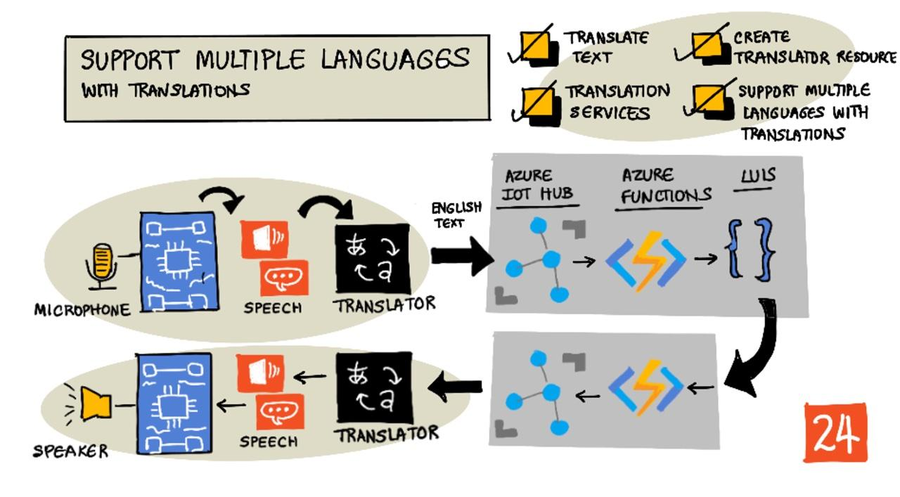

<!--
CO_OP_TRANSLATOR_METADATA:
{
  "original_hash": "c16de27b0074abe81d6a8bad5e5b1a6b",
  "translation_date": "2025-08-28T16:36:26+00:00",
  "source_file": "6-consumer/lessons/4-multiple-language-support/README.md",
  "language_code": "my"
}
-->
# ဘာသာစကားများစွာကို ပံ့ပိုးခြင်း



> Sketchnote ကို [Nitya Narasimhan](https://github.com/nitya) မှရေးသားထားသည်။ ပုံကို နှိပ်ပြီး အကြီးအကျယ်ကြည့်ရှုနိုင်ပါသည်။

ဒီဗီဒီယိုမှာ Azure speech services အကြောင်းကို အကျဉ်းချုပ်ဖော်ပြထားပြီး၊ ယခင်သင်ခန်းစာများတွင် ဖော်ပြခဲ့သော speech to text နှင့် text to speech အကြောင်း၊ အပြင် ဒီသင်ခန်းစာတွင် ဖော်ပြမည့် speech translation အကြောင်းကိုလည်း ပါဝင်သည်။

[](https://www.youtube.com/watch?v=h6xbpMPSGEA)

> 🎥 အထက်ပါပုံကို နှိပ်ပြီး ဗီဒီယိုကို ကြည့်ရှုပါ

## သင်ခန်းစာမတိုင်မီ မေးခွန်းများ

[သင်ခန်းစာမတိုင်မီ မေးခွန်းများ](https://black-meadow-040d15503.1.azurestaticapps.net/quiz/47)

## အကျဉ်းချုပ်

ယခင်သင်ခန်းစာ ၃ ခုတွင် သင်သည် speech to text, language understanding, နှင့် text to speech ကို AI အားဖြင့် အကောင်အထည်ဖော်ခြင်းအကြောင်းကို သင်ယူခဲ့ပါသည်။ လူ့ဆက်သွယ်မှု၏ အခြားသော အခန်းကဏ္ဍတစ်ခုမှာ ဘာသာပြန်ခြင်းဖြစ်ပြီး၊ AI က အင်္ဂလိပ်မှ ပြင်သစ်လိုသို့ ပြောင်းခြင်းကဲ့သို့ ဘာသာစကားတစ်ခုမှ အခြားဘာသာစကားသို့ ပြောင်းနိုင်စွမ်းရှိသည်။

ဒီသင်ခန်းစာတွင် သင်သည် AI ကို အသုံးပြု၍ စာသားများကို ဘာသာပြန်ခြင်းနှင့် သင့် smart timer ကို အသုံးပြုသူများနှင့် ဘာသာစကားများစွာဖြင့် ဆက်သွယ်နိုင်စေခြင်းအကြောင်းကို သင်ယူပါမည်။

ဒီသင်ခန်းစာတွင် ဖော်ပြမည့်အကြောင်းအရာများမှာ -

* [စာသားများကို ဘာသာပြန်ခြင်း](../../../../../6-consumer/lessons/4-multiple-language-support)
* [ဘာသာပြန်ဝန်ဆောင်မှုများ](../../../../../6-consumer/lessons/4-multiple-language-support)
* [ဘာသာပြန် resource တစ်ခုကို ဖန်တီးခြင်း](../../../../../6-consumer/lessons/4-multiple-language-support)
* [ဘာသာပြန်မှုများဖြင့် အက်ပလီကေးရှင်းများတွင် ဘာသာစကားများစွာကို ပံ့ပိုးခြင်း](../../../../../6-consumer/lessons/4-multiple-language-support)
* [AI ဝန်ဆောင်မှုကို အသုံးပြု၍ စာသားများကို ဘာသာပြန်ခြင်း](../../../../../6-consumer/lessons/4-multiple-language-support)

> 🗑 ဒီသင်ခန်းစာသည် ဒီပရောဂျက်၏ နောက်ဆုံးသင်ခန်းစာဖြစ်ပြီး၊ သင်ခန်းစာနှင့် လုပ်ငန်းတာဝန်ကို ပြီးမြောက်ပြီးနောက် cloud services များကို ရှင်းလင်းရန် မမေ့ပါနှင့်။ လုပ်ငန်းတာဝန်ကို ပြီးမြောက်ရန် ဝန်ဆောင်မှုများလိုအပ်မည်ဖြစ်သောကြောင့် အရင်ဆုံး လုပ်ငန်းတာဝန်ကို ပြီးမြောက်စေပါ။
>
> လိုအပ်ပါက [သင့်ပရောဂျက်ကို ရှင်းလင်းရန် လမ်းညွှန်ချက်](../../../clean-up.md) ကို ကိုးကားပါ။

## စာသားများကို ဘာသာပြန်ခြင်း

စာသားဘာသာပြန်ခြင်းသည် ၇၀ နှစ်ကျော်ကြာအောင် သုတေသနပြုခဲ့သော ကွန်ပျူတာသိပ္ပံပြဿနာတစ်ခုဖြစ်ပြီး၊ AI နှင့် ကွန်ပျူတာစွမ်းအားတိုးတက်မှုကြောင့် လူ့ဘာသာပြန်များနှင့် နီးစပ်သောအဆင့်အထိ ရောက်ရှိလာပါသည်။

> 💁 အစပြုသည်မှာ ၉ ရာစု အာရဗီ cryptographer [Al-Kindi](https://wikipedia.org/wiki/Al-Kindi) မှ ဘာသာပြန်နည်းလမ်းများကို ဖော်ထုတ်ခဲ့ခြင်းဖြစ်သည်။

### စက်မှဘာသာပြန်ခြင်း

စာသားဘာသာပြန်ခြင်းသည် စက်မှဘာသာပြန်ခြင်း (Machine Translation - MT) ဟုခေါ်သော နည်းပညာဖြင့် စတင်ခဲ့ပြီး၊ ဘာသာစကားအတွင်းရှိ စကားလုံးများကို အခြားဘာသာစကားသို့ အစားထိုးခြင်းဖြင့် ပြုလုပ်သည်။ MT သည် စကားလုံးများကို အစားထိုးခြင်းအပြင်၊ စကားစုများ သို့မဟုတ် စာကြောင်းအပိုင်းများကို အဓိပ္ပါယ်မမှီသောအခါ၊ အမှန်တကယ် ဘာသာပြန်နည်းလမ်းများကို ရွေးချယ်ရန် နည်းလမ်းများကို ထည့်သွင်းထားသည်။

> 🎓 ဘာသာပြန်များသည် ဘာသာစကားတစ်ခုမှ အခြားဘာသာစကားသို့ ပြောင်းနိုင်စွမ်းရှိပါက၊ ၎င်းတို့ကို *language pairs* ဟုခေါ်သည်။ ကိရိယာများသည် language pairs များကို ပံ့ပိုးပေးပြီး၊ အားလုံးကို မပံ့ပိုးနိုင်ပါ။ ဥပမာအားဖြင့် ဘာသာပြန်တစ်ခုသည် အင်္ဂလိပ်မှ စပိန်သို့ language pair ကို ပံ့ပိုးပေးပြီး၊ စပိန်မှ အီတလီသို့ language pair ကို ပံ့ပိုးပေးနိုင်သော်လည်း၊ အင်္ဂလိပ်မှ အီတလီသို့ မပံ့ပိုးနိုင်ပါ။

ဥပမာအားဖြင့် "Hello world" ကို အင်္ဂလိပ်မှ ပြင်သစ်သို့ ဘာသာပြန်ခြင်းသည် "Hello" ကို "Bonjour" နှင့် "world" ကို "le monde" အစားထိုးခြင်းဖြင့် "Bonjour le monde" ဟု မှန်ကန်သော ဘာသာပြန်မှုကို ရရှိစေပါသည်။

### နယူးရယ်ဘာသာပြန်ခြင်း

နယူးရယ်ဘာသာပြန်ခြင်းသည် AI ၏ စွမ်းအားကို အသုံးပြု၍ စာကြောင်းတစ်ခုလုံးကို ဘာသာပြန်ခြင်းဖြစ်ပြီး၊ တစ်ခုတည်းသော မော်ဒယ်ကို အသုံးပြုသည်။ မော်ဒယ်များကို လူ့ဘာသာပြန်ထားသော ဝက်ဘ်စာမျက်နှာများ၊ စာအုပ်များ၊ နှင့် ကုလသမဂ္ဂစာရွက်များကဲ့သို့သော အချက်အလက်များကို အသုံးပြု၍ လေ့ကျင့်ထားသည်။

နယူးရယ်ဘာသာပြန်မော်ဒယ်များသည် စကားစုများနှင့် idioms များကို သိမ်းဆည်းထားသော ဒေတာဘေ့စ်များမလိုအပ်သည့်အတွက် စက်မှဘာသာပြန်မော်ဒယ်များထက် သေးငယ်သည်။ ခေတ်သစ် AI ဝန်ဆောင်မှုများသည် စက်မှဘာသာပြန်နည်းလမ်းများနှင့် နယူးရယ်ဘာသာပြန်နည်းလမ်းများကို ပေါင်းစပ်အသုံးပြုသည်။

ဘာသာစကားအတွင်း 1:1 ဘာသာပြန်မှုမရှိပါ။ ဘာသာပြန်မော်ဒယ်များသည် လေ့ကျင့်ထားသော အချက်အလက်ပေါ်မူတည်၍ အနည်းငယ်ကွဲပြားသောရလဒ်များကို ထုတ်လုပ်နိုင်သည်။

✅ အွန်လိုင်းဘာသာပြန်များကို စမ်းသပ်ကြည့်ပါ - [Bing Translate](https://www.bing.com/translator), [Google Translate](https://translate.google.com), သို့မဟုတ် Apple translate app ကို အသုံးပြုပါ။ စာကြောင်းအနည်းငယ်ကို ဘာသာပြန်ပြီး၊ ရလဒ်များကို နှိုင်းယှဉ်ကြည့်ပါ။

## ဘာသာပြန်ဝန်ဆောင်မှုများ

AI ဝန်ဆောင်မှုများစွာကို speech နှင့် text ကို ဘာသာပြန်ရန် သင့်အက်ပလီကေးရှင်းများမှ အသုံးပြုနိုင်သည်။

### Cognitive services Speech service


ယခင်သင်ခန်းစာများတွင် သင်အသုံးပြုခဲ့သော speech service တွင် speech recognition အတွက် ဘာသာပြန်စွမ်းရည်ရှိသည်။ သင် speech ကို အသိအမှတ်ပြုသောအခါ၊ speech text ကို မူရင်းဘာသာစကားတွင်သာမက အခြားဘာသာစကားများတွင်လည်း တောင်းဆိုနိုင်သည်။

> 💁 ၎င်းသည် speech SDK မှသာ ရရှိနိုင်ပြီး၊ REST API တွင် built-in ဘာသာပြန်မှုမရှိပါ။

### Cognitive services Translator service


Translator service သည် dedicated translation service ဖြစ်ပြီး၊ စာသားများကို ဘာသာစကားတစ်ခုမှ တစ်ခု သို့မဟုတ် များစွာသော target languages သို့ ဘာသာပြန်နိုင်သည်။ ၎င်းသည် profanity masking ကဲ့သို့သော အပိုဆောင်း features များကိုလည်း ပံ့ပိုးပေးသည်။

ဥပမာအားဖြင့် "I have a Raspberry Pi" ဟု ပြောသောအခါ၊ Raspberry Pi သည် single-board computer ဖြစ်သည့်အတွက် ဘာသာပြန်မလုပ်ဘဲ၊ "J’ai un Raspberry Pi" ဟု ထားရှိရန်လိုအပ်သည်။

## ဘာသာပြန် resource တစ်ခုကို ဖန်တီးခြင်း

ဒီသင်ခန်းစာအတွက် Translator resource တစ်ခုလိုအပ်ပါမည်။ သင်သည် REST API ကို အသုံးပြု၍ စာသားများကို ဘာသာပြန်ပါမည်။

### Task - ဘာသာပြန် resource တစ်ခုကို ဖန်တီးခြင်း

1. သင့် terminal သို့မဟုတ် command prompt မှာ အောက်ပါ command ကို run လုပ်ပြီး၊ `smart-timer` resource group အတွင်း translator resource တစ်ခုကို ဖန်တီးပါ။

    ```sh
    az cognitiveservices account create --name smart-timer-translator \
                                        --resource-group smart-timer \
                                        --kind TextTranslation \
                                        --sku F0 \
                                        --yes \
                                        --location <location>
    ```

    `<location>` ကို Resource Group ဖန်တီးခဲ့သောနေရာဖြင့် အစားထိုးပါ။

1. translator service အတွက် key ကို ရယူပါ:

    ```sh
    az cognitiveservices account keys list --name smart-timer-translator \
                                           --resource-group smart-timer \
                                           --output table
    ```

    key တစ်ခုကို ကူးယူထားပါ။

## ဘာသာပြန်မှုများဖြင့် အက်ပလီကေးရှင်းများတွင် ဘာသာစကားများစွာကို ပံ့ပိုးခြင်း

အကောင်းဆုံးကမ္ဘာတစ်ခုတွင် သင့်အက်ပလီကေးရှင်းတစ်ခုလုံးသည် ဘာသာစကားများစွာကို နားလည်နိုင်စွမ်းရှိသင့်သည်။ speech ကို နားထောင်ခြင်းမှ language understanding, speech ဖြင့် ပြန်လည်တုံ့ပြန်ခြင်းအထိပါဝင်သည်။ translation services များသည် သင့်အက်ပလီကေးရှင်းကို အမြန်တိုးတက်စေပါသည်။


ဥပမာအားဖြင့် သင်သည် အင်္ဂလိပ်ကို အခြေခံထားသော smart timer တစ်ခုကို တည်ဆောက်နေသည်ဟု ဆိုပါစို့။ အင်္ဂလိပ် speech ကို နားလည်ပြီး၊ အင်္ဂလိပ် text သို့ ပြောင်းပြီး၊ အင်္ဂလိပ် language understanding ကို run လုပ်ပြီး၊ အင်္ဂလိပ် speech ဖြင့် ပြန်လည်တုံ့ပြန်သည်။ ဂျပန်ဘာသာစကားကို ထည့်သွင်းလိုပါက၊ ဂျပန် speech ကို အင်္ဂလိပ် text သို့ ဘာသာပြန်ပြီး၊ အက်ပလီကေးရှင်း core ကို အတူတူထားပြီး၊ ပြန်လည်တုံ့ပြန်မှု text ကို ဂျပန်ဘာသာစကားသို့ ပြောင်းပြီး၊ speech ဖြင့် ပြန်လည်တုံ့ပြန်နိုင်သည်။

> 💁 စက်မှဘာသာပြန်မှုကို အားထားခြင်း၏ downside တစ်ခုမှာ ဘာသာစကားနှင့် ယဉ်ကျေးမှုများသည် အတူတူသောအရာကို ပြောဆိုရန် နည်းလမ်းကွဲပြားမှုများရှိပြီး၊ ဘာသာပြန်မှုသည် သင့်မျှော်လင့်ချက်နှင့် မကိုက်ညီနိုင်ခြင်းဖြစ်သည်။

✅ သုတေသနပြုပါ - ဘာသာပြန် IoT devices များကို စျေးကွက်တွင် ရရှိနိုင်ပါသလား? Smart devices တွင် built-in ဘာသာပြန်စွမ်းရည်များရှိပါသလား?

## AI ဝန်ဆောင်မှုကို အသုံးပြု၍ စာသားများကို ဘာသာပြန်ခြင်း

သင့် smart timer တွင် ဘာသာပြန်စွမ်းရည်ကို ထည့်သွင်းရန် AI ဝန်ဆောင်မှုကို အသုံးပြုနိုင်သည်။

### Task - AI ဝန်ဆောင်မှုကို အသုံးပြု၍ စာသားများကို ဘာသာပြန်ခြင်း

သင့် IoT device တွင် စာသားများကို ဘာသာပြန်ရန် လမ်းညွှန်ချက်ကို လိုက်နာပါ:

* [Arduino - Wio Terminal](wio-terminal-translate-speech.md)
* [Single-board computer - Raspberry Pi](pi-translate-speech.md)
* [Single-board computer - Virtual device](virtual-device-translate-speech.md)

---

## 🚀 စိန်ခေါ်မှု

စက်မှဘာသာပြန်မှုသည် smart devices များအပြင် အခြား IoT applications များတွင် ဘယ်လိုအကျိုးရှိနိုင်မလဲ? စကားလုံးများသာမက စာသားများအတွက် ဘာသာပြန်မှုကူညီနိုင်သော နည်းလမ်းများကို စဉ်းစားပါ။

## သင်ခန်းစာပြီးနောက် မေးခွန်းများ

[Post-lecture quiz](https://black-meadow-040d15503.1.azurestaticapps.net/quiz/48)

## ပြန်လည်သုံးသပ်ခြင်းနှင့် ကိုယ်တိုင်လေ့လာခြင်း

* [machine translation page on Wikipedia](https://wikipedia.org/wiki/Machine_translation) တွင် စက်မှဘာသာပြန်ခြင်းအကြောင်းကို ဖတ်ရှုပါ
* [neural machine translation page on Wikipedia](https://wikipedia.org/wiki/Neural_machine_translation) တွင် နယူးရယ်ဘာသာပြန်ခြင်းအကြောင်းကို ဖတ်ရှုပါ
* Microsoft speech services အတွက် language support အကြောင်းကို [Microsoft Docs](https://docs.microsoft.com/azure/cognitive-services/speech-service/language-support?WT.mc_id=academic-17441-jabenn) တွင် ဖတ်ရှုပါ

## လုပ်ငန်းတာဝန်

[Build a universal translator](assignment.md)

---

**အကြောင်းကြားချက်**:  
ဤစာရွက်စာတမ်းကို AI ဘာသာပြန်ဝန်ဆောင်မှု [Co-op Translator](https://github.com/Azure/co-op-translator) ကို အသုံးပြု၍ ဘာသာပြန်ထားပါသည်။ ကျွန်ုပ်တို့သည် တိကျမှုအတွက် ကြိုးစားနေသော်လည်း၊ အလိုအလျောက် ဘာသာပြန်မှုများတွင် အမှားများ သို့မဟုတ် မတိကျမှုများ ပါရှိနိုင်သည်ကို သတိပြုပါ။ မူရင်းဘာသာစကားဖြင့် ရေးသားထားသော စာရွက်စာတမ်းကို အာဏာရှိသော ရင်းမြစ်အဖြစ် သတ်မှတ်သင့်ပါသည်။ အရေးကြီးသော အချက်အလက်များအတွက် လူ့ဘာသာပြန်ပညာရှင်များမှ ပရော်ဖက်ရှင်နယ် ဘာသာပြန်မှုကို အကြံပြုပါသည်။ ဤဘာသာပြန်မှုကို အသုံးပြုခြင်းမှ ဖြစ်ပေါ်လာသော အလွဲအလွတ်များ သို့မဟုတ် အနားယူမှားမှုများအတွက် ကျွန်ုပ်တို့သည် တာဝန်မယူပါ။