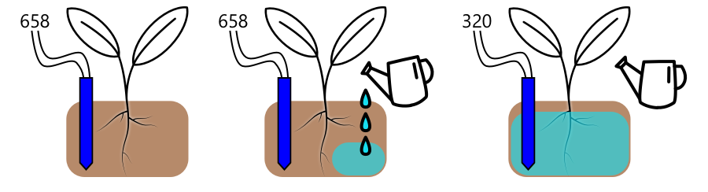

<!--
CO_OP_TRANSLATOR_METADATA:
{
  "original_hash": "f7bb24ba53fb627ddb38a8b24a05e594",
  "translation_date": "2025-08-27T11:15:03+00:00",
  "source_file": "2-farm/lessons/3-automated-plant-watering/README.md",
  "language_code": "ne"
}
-->
# स्वचालित बिरुवा सिंचाई


> स्केच नोट [नित्या नरसिंहन](https://github.com/nitya) द्वारा। ठूलो संस्करणको लागि तस्बिरमा क्लिक गर्नुहोस्।

यो पाठ [IoT for Beginners Project 2 - Digital Agriculture series](https://youtube.com/playlist?list=PLmsFUfdnGr3yCutmcVg6eAUEfsGiFXgcx) अन्तर्गत [Microsoft Reactor](https://developer.microsoft.com/reactor/?WT.mc_id=academic-17441-jabenn) बाट सिकाइएको थियो।

[](https://youtu.be/g9FfZwv9R58)

## पाठ अघि क्विज

[पाठ अघि क्विज](https://black-meadow-040d15503.1.azurestaticapps.net/quiz/13)

## परिचय

अघिल्लो पाठमा, तपाईंले माटोको चिस्यान कसरी निगरानी गर्ने भनेर सिक्नुभयो। यस पाठमा, तपाईं माटोको चिस्यानको आधारमा प्रतिक्रिया दिने स्वचालित सिंचाई प्रणालीका मुख्य कम्पोनेन्टहरू निर्माण गर्न सिक्नुहुनेछ। साथै, तपाईंले सेन्सरहरूले परिवर्तनहरूमा प्रतिक्रिया दिन समय लिन सक्छन् र एक्टुएटरहरूले सेन्सरहरूले मापन गरिरहेका गुणहरू परिवर्तन गर्न समय लिन सक्छन् भन्ने कुरा पनि बुझ्नुहुनेछ।

यस पाठमा हामी निम्न विषयहरू समेट्नेछौं:

* [कम पावर IoT उपकरणबाट उच्च पावर उपकरण नियन्त्रण गर्नुहोस्](../../../../../2-farm/lessons/3-automated-plant-watering)
* [रिले नियन्त्रण गर्नुहोस्](../../../../../2-farm/lessons/3-automated-plant-watering)
* [MQTT मार्फत आफ्नो बिरुवा नियन्त्रण गर्नुहोस्](../../../../../2-farm/lessons/3-automated-plant-watering)
* [सेन्सर र एक्टुएटरको समय व्यवस्थापन](../../../../../2-farm/lessons/3-automated-plant-watering)
* [तपाईंको बिरुवा नियन्त्रण सर्भरमा समय थप्नुहोस्](../../../../../2-farm/lessons/3-automated-plant-watering)

## कम पावर IoT उपकरणबाट उच्च पावर उपकरण नियन्त्रण गर्नुहोस्

IoT उपकरणहरूले कम भोल्टेज प्रयोग गर्छन्। यो सेन्सरहरू र LED जस्ता कम पावर एक्टुएटरहरूको लागि पर्याप्त हुन्छ, तर यो सिंचाईका लागि प्रयोग हुने पानी पम्प जस्ता ठूला हार्डवेयरहरू नियन्त्रण गर्न पर्याप्त हुँदैन। साना पम्पहरू जसलाई तपाईं घरका बिरुवाहरूका लागि प्रयोग गर्न सक्नुहुन्छ, तिनीहरूले IoT डिभाइस किटको लागि धेरै करेन्ट खपत गर्छन् र बोर्डलाई क्षति पुर्याउन सक्छन्।

> 🎓 करेन्ट, जसलाई एम्प्स (A) मा मापन गरिन्छ, सर्किटमा बगिरहेको बिजुलीको मात्रा हो। भोल्टेजले धक्का दिन्छ, करेन्ट भनेको कति धक्का दिइन्छ भन्ने हो। तपाईं [विकिपेडियाको इलेक्ट्रिक करेन्ट पृष्ठ](https://wikipedia.org/wiki/Electric_current) मा यसबारे थप पढ्न सक्नुहुन्छ।

यसको समाधान भनेको पम्पलाई बाह्य पावर सप्लाईमा जडान गर्नु हो, र पम्पलाई अन गर्न एक्टुएटर प्रयोग गर्नु हो, ठीक त्यस्तै जसरी तपाईं बत्ती अन गर्न स्विच प्रयोग गर्नुहुन्छ। तपाईंको औंलाले स्विच थिच्नका लागि सानो मात्रामा ऊर्जा चाहिन्छ, जसले बत्तीलाई 110v/240v मा चल्ने मुख्य बिजुलीमा जडान गर्छ।


> 🎓 [मेन बिजुली](https://wikipedia.org/wiki/Mains_electricity) भनेको संसारका धेरै भागहरूमा घर र व्यवसायहरूमा राष्ट्रिय पूर्वाधारमार्फत आपूर्ति गरिने बिजुली हो।

✅ IoT उपकरणहरूले सामान्यतया 3.3V वा 5V प्रदान गर्न सक्छन्, 1 एम्प (1A) भन्दा कम करेन्टमा। यसलाई मेन बिजुलीसँग तुलना गर्दा, जुन प्रायः 230V (उत्तर अमेरिकामा 120V र जापानमा 100V) मा हुन्छ, र 30A सम्मको करेन्ट खपत गर्ने उपकरणहरूको लागि पावर प्रदान गर्न सक्छ।

यसका लागि विभिन्न प्रकारका एक्टुएटरहरू उपलब्ध छन्, जसमा यान्त्रिक उपकरणहरू पनि समावेश छन् जसलाई तपाईंले विद्यमान स्विचहरूमा जडान गर्न सक्नुहुन्छ। सबैभन्दा लोकप्रिय एक्टुएटर भनेको रिले हो।

### रिलेहरू

रिले भनेको एक इलेक्ट्रोमेकेनिकल स्विच हो, जसले बिजुलीको संकेतलाई यान्त्रिक गतिमा रूपान्तरण गर्छ, जसले स्विच अन गर्छ। रिलेको मुख्य भाग भनेको इलेक्ट्रोम्याग्नेट हो।

> 🎓 [इलेक्ट्रोम्याग्नेट](https://wikipedia.org/wiki/Electromagnet) भनेको तारको कुण्डलमा बिजुली प्रवाह गराएर बनाइने चुम्बक हो। जब बिजुली प्रवाह गरिन्छ, कुण्डल चुम्बकीय हुन्छ। जब बिजुली बन्द गरिन्छ, कुण्डलले आफ्नो चुम्बकीय गुण गुमाउँछ।


रिलेमा, नियन्त्रण सर्किटले इलेक्ट्रोम्याग्नेटलाई पावर दिन्छ। जब इलेक्ट्रोम्याग्नेट अन हुन्छ, यसले एउटा लिभरलाई तान्छ, जसले स्विचलाई सार्छ, र आउटपुट सर्किट पूरा गर्छ।


जब नियन्त्रण सर्किट अफ हुन्छ, इलेक्ट्रोम्याग्नेट अफ हुन्छ, लिभरलाई छोड्छ, र सम्पर्कहरू खोल्छ, आउटपुट सर्किटलाई अफ गर्छ। रिलेहरू डिजिटल एक्टुएटरहरू हुन् - रिलेलाई अन गर्न उच्च संकेत चाहिन्छ, अफ गर्न कम संकेत चाहिन्छ।

आउटपुट सर्किटलाई थप हार्डवेयर, जस्तै सिंचाई प्रणालीलाई पावर दिन प्रयोग गर्न सकिन्छ। IoT उपकरणले रिले अन गर्न सक्छ, जसले आउटपुट सर्किट पूरा गर्छ, जसले सिंचाई प्रणालीलाई पावर दिन्छ, र बिरुवाहरूलाई पानी दिन्छ। IoT उपकरणले रिले अफ गर्न सक्छ, सिंचाई प्रणालीको पावर काट्छ, र पानी बन्द गर्छ।


माथिको भिडियोमा, रिले अन हुन्छ। रिलेमा रहेको LED बल्छ, जसले रिले अन भएको संकेत दिन्छ (केही रिले बोर्डहरूमा रिले अन वा अफ भएको संकेत दिन LED हुन्छ), र पम्पमा पावर पठाइन्छ, जसले पानी बिरुवामा पठाउँछ।

> 💁 रिलेहरूलाई दुई आउटपुट सर्किटहरू बीच स्विच गर्न पनि प्रयोग गर्न सकिन्छ, एउटा अन र अर्को अफ गर्नको सट्टा। जब लिभर सर्छ, यसले एउटा आउटपुट सर्किट पूरा गर्नबाट अर्को आउटपुट सर्किट पूरा गर्न स्विच गर्छ, प्रायः साझा पावर जडान वा साझा ग्राउन्ड जडान प्रयोग गरेर।

✅ अनुसन्धान गर्नुहोस्: रिलेका विभिन्न प्रकारहरू छन्, जस्तै नियन्त्रण सर्किटले पावर लागू गर्दा रिले अन हुन्छ वा अफ हुन्छ, वा बहु आउटपुट सर्किटहरू। यी विभिन्न प्रकारहरूको बारेमा पत्ता लगाउनुहोस्।

जब लिभर सर्छ, तपाईंले प्रायः यसले इलेक्ट्रोम्याग्नेटसँग सम्पर्क गर्दा स्पष्ट क्लिक आवाज सुन्न सक्नुहुन्छ।

> 💁 रिलेलाई यसरी तार गर्न सकिन्छ कि जडान गर्दा वास्तवमा रिलेको पावर काटिन्छ, जसले रिलेलाई अफ गर्छ, जसले फेरि रिलेमा पावर पठाउँछ, र यो प्रक्रिया निरन्तर चलिरहन्छ। यसले रिलेलाई धेरै छिटो क्लिक गर्न लगाउँछ, जसले गुनगुन आवाज निकाल्छ। यो नै पहिलो इलेक्ट्रिक डोरबेलहरूमा प्रयोग गरिएका बजरहरूको काम गर्ने तरिका हो।

### रिले पावर

इलेक्ट्रोम्याग्नेटलाई सक्रिय गर्न र लिभर तान्न धेरै पावर आवश्यक पर्दैन, यसलाई IoT डिभाइस किटको 3.3V वा 5V आउटपुट प्रयोग गरेर नियन्त्रण गर्न सकिन्छ। आउटपुट सर्किटले धेरै बढी पावर बोक्न सक्छ, रिलेमा निर्भर गर्दै, जसमा मेन भोल्टेज वा औद्योगिक प्रयोगका लागि अझ उच्च पावर स्तरहरू पनि समावेश छन्। यसरी IoT डिभाइस किटले सानो बिरुवाको लागि सानो पम्पदेखि लिएर व्यावसायिक फार्मका लागि ठूला औद्योगिक प्रणालीसम्मको सिंचाई प्रणालीलाई नियन्त्रण गर्न सक्छ।


माथिको तस्बिरमा ग्रोभ रिले देखाइएको छ। नियन्त्रण सर्किट IoT उपकरणमा जडान हुन्छ र 3.3V वा 5V प्रयोग गरेर रिले अन वा अफ गर्छ। आउटपुट सर्किटमा दुई टर्मिनलहरू छन्, जसमा कुनै पनि पावर वा ग्राउन्ड हुन सक्छ। आउटपुट सर्किटले 250V मा 10A सम्मको पावर ह्यान्डल गर्न सक्छ, जुन विभिन्न मेन-पावर उपकरणहरूको लागि पर्याप्त छ। तपाईं अझ उच्च पावर स्तरहरू ह्यान्डल गर्न सक्ने रिलेहरू पनि प्राप्त गर्न सक्नुहुन्छ।


माथिको तस्बिरमा, पम्पलाई रिले मार्फत पावर आपूर्ति गरिएको छ। एउटा रातो तारले USB पावर सप्लाईको +5V टर्मिनललाई रिलेको आउटपुट सर्किटको एउटा टर्मिनलसँग जडान गरेको छ, र अर्को रातो तारले आउटपुट सर्किटको अर्को टर्मिनललाई पम्पसँग जडान गरेको छ। एउटा कालो तारले पम्पलाई USB पावर सप्लाईको ग्राउन्डसँग जडान गरेको छ। जब रिले अन हुन्छ, यसले सर्किट पूरा गर्छ, पम्पमा 5V पठाउँछ, र पम्प अन हुन्छ।

## रिले नियन्त्रण गर्नुहोस्

तपाईं आफ्नो IoT डिभाइस किटबाट रिले नियन्त्रण गर्न सक्नुहुन्छ।

### कार्य - रिले नियन्त्रण गर्नुहोस्

तपाईंको IoT उपकरण प्रयोग गरेर रिले नियन्त्रण गर्न सम्बन्धित गाइड पूरा गर्नुहोस्:

* [Arduino - Wio Terminal](wio-terminal-relay.md)
* [Single-board computer - Raspberry Pi](pi-relay.md)
* [Single-board computer - Virtual device](virtual-device-relay.md)

## MQTT मार्फत आफ्नो बिरुवा नियन्त्रण गर्नुहोस्

अहिलेसम्म तपाईंको रिले IoT उपकरणले माटोको चिस्यानको एकल रीडिङको आधारमा सिधै नियन्त्रण गरेको छ। व्यावसायिक सिंचाई प्रणालीमा, नियन्त्रण प्रणाली केन्द्रीयकृत हुन्छ, जसले धेरै सेन्सरहरूको डाटाको आधारमा पानी दिने निर्णय गर्न सक्छ, र कुनै पनि कन्फिगरेसनलाई एउटै स्थानमा परिवर्तन गर्न अनुमति दिन्छ। यसलाई अनुकरण गर्न, तपाईं रिलेलाई MQTT मार्फत नियन्त्रण गर्न सक्नुहुन्छ।

### कार्य - MQTT मार्फत रिले नियन्त्रण गर्नुहोस्

1. तपाईंको `soil-moisture-sensor` प्रोजेक्टमा MQTT जडान गर्न सम्बन्धित MQTT लाइब्रेरीहरू/पिप प्याकेजहरू र कोड थप्नुहोस्। क्लाइन्ट ID लाई तपाईंको ID को उपसर्गसहित `soilmoisturesensor_client` राख्नुहोस्।

    > ⚠️ [प्रोजेक्ट 1, पाठ 4 मा MQTT जडान गर्ने निर्देशनहरू](../../../1-getting-started/lessons/4-connect-internet/README.md#connect-your-iot-device-to-mqtt) आवश्यक परेमा हेर्न सक्नुहुन्छ।

1. माटोको चिस्यान सेटिङ्सको साथ टेलिमेट्री पठाउन सम्बन्धित उपकरण कोड थप्नुहोस्। टेलिमेट्री सन्देशको लागि, प्रोपर्टीलाई `soil_moisture` नाम दिनुहोस्।

    > ⚠️ [प्रोजेक्ट 1, पाठ 4 मा MQTT मा टेलिमेट्री पठाउने निर्देशनहरू](../../../1-getting-started/lessons/4-connect-internet/README.md#send-telemetry-from-your-iot-device) आवश्यक परेमा हेर्न सक्नुहुन्छ।

1. `soil-moisture-sensor-server` नामक फोल्डरमा टेलिमेट्रीलाई सब्स्क्राइब गर्न र रिले नियन्त्रण गर्न कमाण्ड पठाउन स्थानीय सर्भर कोड बनाउनुहोस्। कमाण्ड सन्देशमा प्रोपर्टीलाई `relay_on` नाम दिनुहोस्, र क्लाइन्ट ID लाई तपाईंको ID को उपसर्गसहित `soilmoisturesensor_server` राख्नुहोस्। तपाईंले यस पाठमा यो कोड थप्ने भएकाले प्रोजेक्ट 1, पाठ 4 मा लेखिएको सर्भर कोडको संरचना समान राख्नुहोस्।

    > ⚠️ [MQTT मा टेलिमेट्री पठाउने निर्देशनहरू](../../../1-getting-started/lessons/4-connect-internet/README.md#write-the-server-code) र [MQTT मार्फत कमाण्ड पठाउने निर्देशनहरू](../../../1-getting-started/lessons/4-connect-internet/README.md#send-commands-to-the-mqtt-broker) आवश्यक परेमा हेर्न सक्नुहुन्छ।

1. प्राप्त कमाण्डहरूबाट रिले नियन्त्रण गर्न सम्बन्धित उपकरण कोड थप्नुहोस्, सन्देशको `relay_on` प्रोपर्टी प्रयोग गरेर। यदि `soil_moisture` 450 भन्दा बढी छ भने `relay_on` को लागि true पठाउनुहोस्, अन्यथा false पठाउनुहोस्, ठीक IoT उपकरणको लागि पहिले थपिएको तर्क जस्तै।

    > ⚠️ [MQTT बाट कमाण्डहरूको प्रतिक्रिया दिने निर्देशनहरू](../../../1-getting-started/lessons/4-connect-internet/README.md#handle-commands-on-the-iot-device) आवश्यक परेमा हेर्न सक्नुहुन्छ।

> 💁 तपाईं यो कोड [code-mqtt](../../../../../2-farm/lessons/3-automated-plant-watering/code-mqtt) फोल्डरमा फेला पार्न सक्नुहुन्छ।

तपाईंको उपकरण र स्थानीय सर्भरमा कोड चलिरहेको सुनिश्चित गर्नुहोस्, र माटोको चिस्यान स्तर परिवर्तन गरेर परीक्षण गर्नुहोस्, चाहे भर्चुअल सेन्सरले पठाउने मानहरू परिवर्तन गरेर, वा माटोमा पानी थपेर वा सेन्सरलाई माटोबाट हटाएर।

## सेन्सर र एक्टुएटरको समय व्यवस्थापन

पाठ 3 मा, तपाईंले नाइटलाइट बनाउनु भयो - एउटा LED जसले प्रकाश सेन्सरले कम प्रकाश स्तर पत्ता लगाउने बित्तिकै बल्छ। प्रकाश सेन्सरले प्रकाश स्तरको परिवर्तन तुरुन्तै पत्ता लगायो, र उपकरणले छिटो प्रतिक्रिया दिन सक्षम भयो, केवल `loop` फंक्शन वा `while True:` लूपको ढिलाइको लम्बाइले सीमित। IoT विकासकर्ताको रूपमा, तपाईं सधैं यति छिटो प्रतिक्रिया चक्रमा भर पर्न सक्नुहुन्न।

### माटोको चिस्यानको लागि समय व्यवस्थापन

यदि तपाईंले अघिल्लो पाठमा भौतिक सेन्सर प्रयोग गरेर माटोको चिस्यानको पाठ पूरा गर्नुभयो भने, तपाईंले बिरुवामा पानी थपेपछि माटोको चिस्यान रीडिङ घट्न केही सेकेन्ड लागेको देख्नुभयो। यो सेन्सर ढिलो भएको कारण होइन, तर पानीलाई माटोमा सोसिन समय लाग्ने कारण हो।
💁 यदि तपाईंले सेन्सरको नजिकै पानी हाल्नुभयो भने, तपाईंले मापन छिटो घटेको देख्न सक्नुहुन्छ, त्यसपछि फेरि बढेको - यो सेन्सरको नजिक पानी माटोको बाँकी भागमा फैलिँदा हुन्छ, जसले सेन्सरले मापन गर्ने माटोको चिस्यान घटाउँछ।


माथिको चित्रमा, माटोको आर्द्रता मापन 658 देखाउँछ। बिरुवामा पानी हालिन्छ, तर यो मापन तुरुन्त परिवर्तन हुँदैन किनभने पानीले सेन्सरसम्म पुग्न बाँकी छ। पानी हाल्ने प्रक्रिया सेन्सरसम्म पानी पुग्नुअघि नै सकिन सक्छ, र त्यसपछि मात्र मापनको मान नयाँ आर्द्रता स्तरलाई प्रतिबिम्बित गर्न घट्छ।

यदि तपाईं माटोको आर्द्रता स्तरको आधारमा रिलेमार्फत सिंचाइ प्रणाली नियन्त्रण गर्न कोड लेख्दै हुनुहुन्छ भने, तपाईंले यो ढिलाइलाई ध्यानमा राख्नुपर्छ र आफ्नो IoT उपकरणमा स्मार्ट टाइमिङ निर्माण गर्नुपर्छ।

✅ केही समय लिएर सोच्नुहोस् कि तपाईंले यो कसरी गर्न सक्नुहुन्छ।

### सेन्सर र एक्ट्युएटरको टाइमिङ नियन्त्रण गर्नुहोस्

कल्पना गर्नुहोस् कि तपाईंलाई एउटा फार्मको लागि सिंचाइ प्रणाली निर्माण गर्ने जिम्मा दिइएको छ। माटोको प्रकारको आधारमा, त्यहाँ उब्जनी गरिएका बिरुवाहरूको लागि आदर्श माटोको आर्द्रता स्तर 400-450 को एनालग भोल्टेज मापनसँग मेल खान्छ।

तपाईंले उपकरणलाई नाइटलाइटको जस्तै तरिकामा प्रोग्राम गर्न सक्नुहुन्छ - जबसम्म सेन्सरले 450 भन्दा माथि मापन गर्छ, रिले अन गरेर पम्प चालु गर्नुहोस्। समस्या यो हो कि पानी पम्पबाट माटो हुँदै सेन्सरसम्म पुग्न समय लाग्छ। सेन्सरले 450 स्तर पत्ता लगाउँदा पानी रोक्छ, तर पम्प गरिएको पानी माटोमा सोसिँदै गर्दा पानीको स्तर घटिरहन्छ। अन्ततः पानीको बर्बादी र जरामा क्षतिको जोखिम हुन्छ।

✅ सम्झनुहोस् - धेरै पानी बिरुवाहरूको लागि कम पानी जत्तिकै खराब हुन सक्छ, र यो एक अमूल्य स्रोतको बर्बादी हो।

राम्रो समाधान भनेको एक्ट्युएटर अन हुने र सेन्सरले पढ्ने सम्पत्तिमा परिवर्तन हुने बीचको ढिलाइलाई बुझ्नु हो। यसको मतलब सेन्सरले फेरि मान मापन गर्नु अघि केही समय पर्खनु पर्छ, र एक्ट्युएटरले अर्को सेन्सर मापन लिने अघि केही समय बन्द रहनु पर्छ।

प्रत्येक पटक रिले कति समय अन रहनु पर्छ? सावधानी अपनाउनु राम्रो हुन्छ र रिलेलाई छोटो समयको लागि मात्र अन गर्नुहोस्, त्यसपछि पानी माटोमा सोसिन दिनुहोस्, त्यसपछि आर्द्रता स्तर पुनः जाँच गर्नुहोस्। आखिर, तपाईंले सधैं थप पानी हाल्न पम्पलाई फेरि अन गर्न सक्नुहुन्छ, तर माटोबाट पानी हटाउन सक्नुहुन्न।

> 💁 यस्तो टाइमिङ नियन्त्रण तपाईंले निर्माण गरिरहेको IoT उपकरण, मापन गरिरहेको सम्पत्ति, र प्रयोग गरिएका सेन्सर र एक्ट्युएटरहरूमा धेरै निर्भर हुन्छ।


उदाहरणका लागि, मेरो स्ट्रबेरी बिरुवा छ जसमा माटोको आर्द्रता सेन्सर र रिलेद्वारा नियन्त्रित पम्प छ। मैले देखेको छु कि जब म पानी थप्छु, माटोको आर्द्रता मापन स्थिर हुन लगभग 20 सेकेन्ड लाग्छ। यसको मतलब म रिले बन्द गरेर 20 सेकेन्ड पर्खनु पर्छ आर्द्रता स्तर जाँच गर्नु अघि। म धेरै पानी हाल्नुभन्दा कम पानी हाल्न रुचाउँछु - म सधैं पम्पलाई फेरि अन गर्न सक्छु, तर बिरुवाबाट पानी हटाउन सक्दिन।


यसको मतलब उत्तम प्रक्रिया यस्तो सिंचाइ चक्र हुनेछ:

* पम्पलाई 5 सेकेन्डको लागि अन गर्नुहोस्
* 20 सेकेन्ड पर्खनुहोस्
* माटोको आर्द्रता जाँच गर्नुहोस्
* यदि स्तर अझै आवश्यक भन्दा माथि छ भने, माथिका चरणहरू दोहोर्याउनुहोस्

5 सेकेन्ड पम्पको लागि धेरै लामो हुन सक्छ, विशेष गरी यदि आर्द्रता स्तर आवश्यक स्तरभन्दा थोरै मात्र माथि छ। कुन टाइमिङ प्रयोग गर्ने भन्ने जान्नको लागि यो प्रयास गर्नुहोस्, त्यसपछि सेन्सर डेटा हुँदा समायोजन गर्नुहोस्, निरन्तर प्रतिक्रिया चक्रको साथ। यसले अझै बढी सूक्ष्म टाइमिङको नेतृत्व गर्न सक्छ, जस्तै आवश्यक माटोको आर्द्रता भन्दा प्रत्येक 100 माथिका लागि पम्पलाई 1 सेकेन्डको लागि अन गर्नु, स्थिर 5 सेकेन्डको सट्टा।

✅ अनुसन्धान गर्नुहोस्: के अन्य टाइमिङ विचारहरू छन्? माटोको आर्द्रता धेरै कम हुँदा बिरुवा कुनै पनि समयमा पानी हाल्न सकिन्छ, वा बिरुवामा पानी हाल्न राम्रो र नराम्रो समयहरू छन्?

> 💁 मौसमको पूर्वानुमान पनि बाहिरी उब्जनीको लागि स्वचालित सिंचाइ प्रणाली नियन्त्रण गर्दा विचार गर्न सकिन्छ। यदि पानी पर्ने सम्भावना छ भने, पानी हाल्ने प्रक्रिया रोक्न सकिन्छ जबसम्म पानी सकिँदैन। त्यसपछि माटो पर्याप्त आर्द्र हुन सक्छ कि यसलाई पानी हाल्न आवश्यक छैन, पानी बर्बाद गर्नुको सट्टा पानी पर्ने ठीक अघि पानी हाल्नु भन्दा धेरै प्रभावकारी।

## आफ्नो बिरुवा नियन्त्रण सर्भरमा टाइमिङ थप्नुहोस्

सर्भर कोडलाई सिंचाइ चक्रको टाइमिङ वरिपरि नियन्त्रण थप्न र माटोको आर्द्रता स्तर परिवर्तनको लागि पर्खन संशोधित गर्न सकिन्छ। रिले टाइमिङ नियन्त्रणको लागि सर्भरको तर्क यस्तो छ:

1. टेलिमेट्री सन्देश प्राप्त भयो
1. माटोको आर्द्रता स्तर जाँच गर्नुहोस्
1. यदि ठीक छ भने केही नगर्नुहोस्। यदि मापन धेरै उच्च छ (माटोको आर्द्रता धेरै कम छ भन्ने अर्थमा) भने:
    1. रिले अन गर्न आदेश पठाउनुहोस्
    1. 5 सेकेन्ड पर्खनुहोस्
    1. रिले बन्द गर्न आदेश पठाउनुहोस्
    1. माटोको आर्द्रता स्तर स्थिर हुन 20 सेकेन्ड पर्खनुहोस्

सिंचाइ चक्र, टेलिमेट्री सन्देश प्राप्त गर्ने प्रक्रियादेखि माटोको आर्द्रता स्तर पुनः प्रक्रिया गर्न तयार हुने समयसम्म, लगभग 25 सेकेन्ड लाग्छ। हामी प्रत्येक 10 सेकेन्डमा माटोको आर्द्रता स्तर पठाउँदैछौं, त्यसैले त्यहाँ ओभरल्याप छ जहाँ सन्देश प्राप्त हुन्छ जबकि सर्भर माटोको आर्द्रता स्तर स्थिर हुन पर्खिरहेको छ, जसले अर्को सिंचाइ चक्र सुरु गर्न सक्छ।

यसलाई समाधान गर्न दुई विकल्पहरू छन्:

* IoT उपकरण कोड परिवर्तन गरेर टेलिमेट्री प्रत्येक मिनेटमा मात्र पठाउनुहोस्, यसरी सिंचाइ चक्र अर्को सन्देश पठाउनु अघि पूरा हुनेछ
* सिंचाइ चक्रको समयमा टेलिमेट्रीबाट अनसब्सक्राइब गर्नुहोस्

पहिलो विकल्प ठूलो फार्महरूको लागि सधैं राम्रो समाधान होइन। किसानले माटोको आर्द्रता स्तरलाई पानी हाल्ने क्रममा पछि विश्लेषणको लागि क्याप्चर गर्न चाहन सक्छ, उदाहरणका लागि फार्मका विभिन्न क्षेत्रहरूमा पानीको प्रवाहको बारेमा सचेत हुन अधिक लक्षित सिंचाइको मार्गदर्शन गर्न। दोस्रो विकल्प राम्रो छ - कोडले टेलिमेट्रीलाई प्रयोग गर्न नसक्दा मात्र बेवास्ता गरिरहेको छ, तर टेलिमेट्री अन्य सेवाहरूको लागि अझै उपलब्ध छ जसले यसलाई सब्सक्राइब गर्न सक्छ।

> 💁 IoT डेटा केवल एक उपकरणबाट एक सेवामा मात्र पठाइँदैन, बरु धेरै उपकरणहरूले डेटा ब्रोकरसम्म पठाउन सक्छन्, र धेरै सेवाहरूले ब्रोकरबाट डेटा सुन्न सक्छन्। उदाहरणका लागि, एक सेवाले माटोको आर्द्रता डेटा सुनेर पछि विश्लेषणको लागि डेटाबेसमा भण्डारण गर्न सक्छ। अर्को सेवाले उही टेलिमेट्रीलाई सिंचाइ प्रणाली नियन्त्रण गर्न सुन्न सक्छ।

### कार्य - आफ्नो बिरुवा नियन्त्रण सर्भरमा टाइमिङ थप्नुहोस्

तपाईंको सर्भर कोडलाई 5 सेकेन्डको लागि रिले चलाउन, त्यसपछि 20 सेकेन्ड पर्खन अपडेट गर्नुहोस्।

1. यदि `soil-moisture-sensor-server` फोल्डर VS Code मा खुला छैन भने यसलाई खोल्नुहोस्। सुनिश्चित गर्नुहोस् कि भर्चुअल वातावरण सक्रिय छ।

1. `app.py` फाइल खोल्नुहोस्

1. निम्न कोडलाई `app.py` फाइलमा रहेको आयातहरू तल थप्नुहोस्:

    ```python
    import threading
    ```

    यो कथनले Python पुस्तकालयहरूबाट `threading` आयात गर्दछ, थ्रेडिङले पर्खँदा अन्य कोड कार्यान्वयन गर्न अनुमति दिन्छ।

1. सर्भर कोडद्वारा प्राप्त टेलिमेट्री सन्देशहरू ह्यान्डल गर्ने `handle_telemetry` फंक्शन अघि निम्न कोड थप्नुहोस्:

    ```python
    water_time = 5
    wait_time = 20
    ```

    यसले रिले चलाउने समय (`water_time`) र माटोको आर्द्रता जाँच गर्न पछि पर्खने समय (`wait_time`) परिभाषित गर्दछ।

1. यस कोडको तल निम्न थप्नुहोस्:

    ```python
    def send_relay_command(client, state):
        command = { 'relay_on' : state }
        print("Sending message:", command)
        client.publish(server_command_topic, json.dumps(command))
    ```

    यो कोडले `send_relay_command` नामक फंक्शन परिभाषित गर्दछ जसले रिले नियन्त्रण गर्न MQTT मार्फत आदेश पठाउँछ। टेलिमेट्रीलाई डिक्सनरीको रूपमा सिर्जना गरिन्छ, त्यसपछि JSON स्ट्रिङमा रूपान्तरण गरिन्छ। `state` मा पास गरिएको मानले रिले अन वा अफ हुनुपर्छ भन्ने निर्धारण गर्दछ।

1. `send_relay_code` फंक्शन पछि निम्न कोड थप्नुहोस्:

    ```python
    def control_relay(client):
        print("Unsubscribing from telemetry")
        mqtt_client.unsubscribe(client_telemetry_topic)
    
        send_relay_command(client, True)
        time.sleep(water_time)
        send_relay_command(client, False)
    
        time.sleep(wait_time)
    
        print("Subscribing to telemetry")
        mqtt_client.subscribe(client_telemetry_topic)
    ```

    यो आवश्यक टाइमिङको आधारमा रिले नियन्त्रण गर्न फंक्शन परिभाषित गर्दछ। यो टेलिमेट्रीबाट अनसब्सक्राइब गरेर सुरु हुन्छ ताकि सिंचाइ भइरहेको बेला माटोको आर्द्रता सन्देशहरू प्रक्रिया नगरियोस्। त्यसपछि यो रिले अन गर्न आदेश पठाउँछ। त्यसपछि `water_time` को लागि पर्खन्छ र रिले बन्द गर्न आदेश पठाउँछ। अन्ततः यो माटोको आर्द्रता स्तर स्थिर हुन `wait_time` सेकेन्डको लागि पर्खन्छ। त्यसपछि यो टेलिमेट्रीमा पुनः सब्सक्राइब गर्दछ।

1. `handle_telemetry` फंक्शनलाई निम्नमा परिवर्तन गर्नुहोस्:

    ```python
    def handle_telemetry(client, userdata, message):
        payload = json.loads(message.payload.decode())
        print("Message received:", payload)
    
        if payload['soil_moisture'] > 450:
            threading.Thread(target=control_relay, args=(client,)).start()
    ```

    यो कोडले माटोको आर्द्रता स्तर जाँच गर्दछ। यदि यो 450 भन्दा ठूलो छ भने, माटोलाई पानी हाल्न आवश्यक छ, त्यसैले यो `control_relay` फंक्शनलाई कल गर्दछ। यो फंक्शन अलग थ्रेडमा चल्छ, पृष्ठभूमिमा चलिरहेको छ।

1. सुनिश्चित गर्नुहोस् कि तपाईंको IoT उपकरण चलिरहेको छ, त्यसपछि यो कोड चलाउनुहोस्। माटोको आर्द्रता स्तर परिवर्तन गर्नुहोस् र रिलेमा के हुन्छ हेर्नुहोस् - यो 5 सेकेन्डको लागि अन हुनु पर्छ त्यसपछि कम्तिमा 20 सेकेन्डको लागि अफ रहनु पर्छ, केवल माटोको आर्द्रता स्तर पर्याप्त नभएमा मात्र अन हुनु पर्छ।

    ```output
    (.venv) ➜  soil-moisture-sensor-server ✗ python app.py
    Message received: {'soil_moisture': 457}
    Unsubscribing from telemetry
    Sending message: {'relay_on': True}
    Sending message: {'relay_on': False}
    Subscribing to telemetry
    Message received: {'soil_moisture': 302}
    ```

    सिमुलेटेड सिंचाइ प्रणालीमा यो परीक्षण गर्ने राम्रो तरिका भनेको सुक्खा माटो प्रयोग गर्नु हो, त्यसपछि रिले अन हुँदा म्यानुअली पानी हाल्नुहोस्, रिले बन्द हुँदा पानी हाल्न रोक्नुहोस्।

> 💁 तपाईं यो कोड [code-timing](../../../../../2-farm/lessons/3-automated-plant-watering/code-timing) फोल्डरमा पाउन सक्नुहुन्छ।

> 💁 यदि तपाईं पम्प प्रयोग गरेर वास्तविक सिंचाइ प्रणाली निर्माण गर्न चाहनुहुन्छ भने, तपाईं [6V पानी पम्प](https://www.seeedstudio.com/6V-Mini-Water-Pump-p-1945.html) र [USB टर्मिनल पावर सप्लाई](https://www.adafruit.com/product/3628) प्रयोग गर्न सक्नुहुन्छ। सुनिश्चित गर्नुहोस् कि पम्पको पावर रिलेमार्फत जोडिएको छ।

---

## 🚀 चुनौती

के तपाईं अन्य IoT वा अन्य विद्युतीय उपकरणहरूको बारेमा सोच्न सक्नुहुन्छ जसमा यस्तै समस्या छ जहाँ एक्ट्युएटरको परिणाम सेन्सरसम्म पुग्न समय लाग्छ। तपाईंको घर वा विद्यालयमा यस्ता उपकरणहरू हुन सक्छन्।

* तिनीहरूले कुन सम्पत्तिहरू मापन गर्छन्?
* एक्ट्युएटर प्रयोग गरेपछि सम्पत्ति परिवर्तन हुन कति समय लाग्छ?
* सम्पत्ति आवश्यक मानभन्दा पर जान ठीक छ?
* यदि आवश्यक परेमा यसलाई आवश्यक मानमा कसरी फर्काउन सकिन्छ?

## पोस्ट-व्याख्यान क्विज

[पोस्ट-व्याख्यान क्विज](https://black-meadow-040d15503.1.azurestaticapps.net/quiz/14)

## समीक्षा र आत्म अध्ययन

* [रिले विकिपीडिया पृष्ठ](https://wikipedia.org/wiki/Relay) मा रिलेहरूको बारेमा थप पढ्नुहोस्, टेलिफोन एक्सचेन्जहरूमा तिनीहरूको ऐतिहासिक प्रयोग सहित।

## असाइनमेन्ट

[अधिक प्रभावकारी सिंचाइ चक्र निर्माण गर्नुहोस्](assignment.md)

---

**अस्वीकरण**:  
यो दस्तावेज़ AI अनुवाद सेवा [Co-op Translator](https://github.com/Azure/co-op-translator) प्रयोग गरेर अनुवाद गरिएको छ। हामी शुद्धताको लागि प्रयास गर्छौं, तर कृपया ध्यान दिनुहोस् कि स्वचालित अनुवादहरूमा त्रुटि वा अशुद्धता हुन सक्छ। यसको मूल भाषा मा रहेको मूल दस्तावेज़लाई आधिकारिक स्रोत मानिनुपर्छ। महत्वपूर्ण जानकारीको लागि, व्यावसायिक मानव अनुवाद सिफारिस गरिन्छ। यस अनुवादको प्रयोगबाट उत्पन्न हुने कुनै पनि गलतफहमी वा गलत व्याख्याको लागि हामी जिम्मेवार हुने छैनौं।