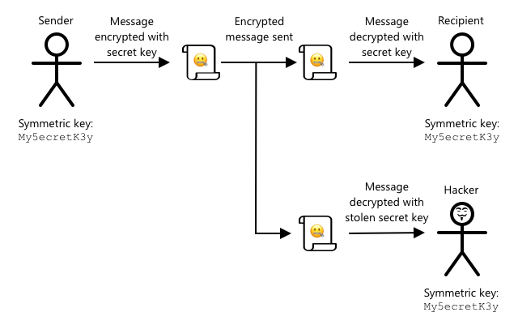

<!--
CO_OP_TRANSLATOR_METADATA:
{
  "original_hash": "81c437c568eee1b0dda1f04e88150d37",
  "translation_date": "2025-08-27T12:10:05+00:00",
  "source_file": "2-farm/lessons/6-keep-your-plant-secure/README.md",
  "language_code": "ne"
}
-->
# आफ्नो बिरुवा सुरक्षित राख्नुहोस्


> स्केच नोट [नित्या नरसिंहन](https://github.com/nitya) द्वारा। ठूलो संस्करणको लागि तस्बिरमा क्लिक गर्नुहोस्।

## प्रि-लेक्चर क्विज

[प्रि-लेक्चर क्विज](https://black-meadow-040d15503.1.azurestaticapps.net/quiz/19)

## परिचय

पछिल्ला केही पाठहरूमा तपाईंले माटो अनुगमन गर्ने IoT उपकरण बनाउनु भएको छ र यसलाई क्लाउडसँग जडान गर्नुभएको छ। तर के हुन्छ यदि प्रतिस्पर्धी किसानका लागि काम गर्ने ह्याकरहरूले तपाईंको IoT उपकरणहरूको नियन्त्रण कब्जा गरे भने? के हुन्छ यदि उनीहरूले उच्च माटोको चिस्यानको रिडिङहरू पठाए जसले गर्दा तपाईंको बिरुवाहरू कहिल्यै पानी नपाउने, वा तपाईंको पानी दिने प्रणालीलाई सधैं चलाउन लगाएर तपाईंको बिरुवाहरूलाई अत्यधिक पानीले मारे र तपाईंलाई पानीको ठूलो खर्च लाग्यो?

यस पाठमा तपाईं IoT उपकरणहरू सुरक्षित गर्ने बारे सिक्नुहुनेछ। यो परियोजनाको अन्तिम पाठ भएकाले, तपाईं क्लाउड स्रोतहरू सफा गर्ने तरिका पनि सिक्नुहुनेछ, सम्भावित लागतहरू घटाउँदै।

यस पाठमा हामी निम्न विषयहरू समेट्नेछौं:

* [किन IoT उपकरणहरू सुरक्षित गर्न आवश्यक छ?](../../../../../2-farm/lessons/6-keep-your-plant-secure)
* [क्रिप्टोग्राफी](../../../../../2-farm/lessons/6-keep-your-plant-secure)
* [आफ्नो IoT उपकरणहरू सुरक्षित गर्नुहोस्](../../../../../2-farm/lessons/6-keep-your-plant-secure)
* [X.509 प्रमाणपत्र उत्पन्न गर्नुहोस् र प्रयोग गर्नुहोस्](../../../../../2-farm/lessons/6-keep-your-plant-secure)

> 🗑 यो परियोजनाको अन्तिम पाठ हो, त्यसैले यो पाठ र असाइनमेन्ट पूरा गरेपछि, आफ्नो क्लाउड सेवाहरू सफा गर्न नबिर्सनुहोस्। असाइनमेन्ट पूरा गर्न सेवाहरू आवश्यक हुनेछ, त्यसैले पहिले असाइनमेन्ट पूरा गर्न सुनिश्चित गर्नुहोस्।
>
> आवश्यक परेमा [आफ्नो परियोजना सफा गर्ने मार्गदर्शन](../../../clean-up.md) हेर्नुहोस्।

## किन IoT उपकरणहरू सुरक्षित गर्न आवश्यक छ?

IoT सुरक्षा भनेको सुनिश्चित गर्नु हो कि केवल अपेक्षित उपकरणहरूले तपाईंको क्लाउड IoT सेवामा जडान गर्न सक्छन् र टेलिमेट्री पठाउन सक्छन्, र केवल तपाईंको क्लाउड सेवाले तपाईंको उपकरणहरूलाई आदेशहरू पठाउन सक्छ। IoT डेटा व्यक्तिगत पनि हुन सक्छ, जसमा चिकित्सा वा गोप्य डेटा समावेश हुन सक्छ, त्यसैले तपाईंको सम्पूर्ण एप्लिकेसनले यो डेटा चुहावट रोक्न सुरक्षा विचार गर्न आवश्यक छ।

यदि तपाईंको IoT एप्लिकेसन सुरक्षित छैन भने, धेरै जोखिमहरू हुन सक्छन्:

* नक्कली उपकरणले गलत डेटा पठाउन सक्छ, जसले गर्दा तपाईंको एप्लिकेसनले गलत प्रतिक्रिया दिन सक्छ। उदाहरणका लागि, उनीहरूले निरन्तर उच्च माटोको चिस्यानको रिडिङहरू पठाउन सक्छन्, जसले गर्दा तपाईंको सिंचाई प्रणाली कहिल्यै चालु हुँदैन र तपाईंको बिरुवाहरू पानीको अभावमा मर्छन्।
* अनधिकृत प्रयोगकर्ताहरूले IoT उपकरणहरूबाट डेटा पढ्न सक्छन्, जसमा व्यक्तिगत वा व्यवसायिक महत्त्वपूर्ण डेटा समावेश हुन सक्छ।
* ह्याकरहरूले उपकरणलाई नियन्त्रण गर्न आदेशहरू पठाउन सक्छन् जसले उपकरण वा जडान गरिएको हार्डवेयरलाई क्षति पुर्याउन सक्छ।
* IoT उपकरणमा जडान गरेर, ह्याकरहरूले यसलाई थप नेटवर्कहरूमा पहुँच गर्न प्रयोग गर्न सक्छन् ताकि निजी प्रणालीहरूमा पहुँच प्राप्त गर्न सकियोस्।
* दुर्भावनापूर्ण प्रयोगकर्ताहरूले व्यक्तिगत डेटा पहुँच गर्न सक्छन् र यसलाई ब्ल्याकमेलको लागि प्रयोग गर्न सक्छन्।

यी वास्तविक संसारका परिदृश्यहरू हुन्, र बारम्बार हुन्छन्। केही उदाहरणहरू पहिलेका पाठहरूमा दिइएको थियो, तर यहाँ केही थप छन्:

* २०१८ मा, ह्याकरहरूले माछा ट्याङ्की थर्मोस्ट्याटमा खुला वाइफाइ पहुँच बिन्दु प्रयोग गरेर क्यासिनोको नेटवर्कमा पहुँच प्राप्त गरे र डेटा चोरी गरे। [The Hacker News - Casino Gets Hacked Through Its Internet-Connected Fish Tank Thermometer](https://thehackernews.com/2018/04/iot-hacking-thermometer.html)
* २०१६ मा, मिराई बोटनेटले इन्टरनेट सेवा प्रदायक डाइनमाथि सेवा अस्वीकार गर्ने आक्रमण सुरु गर्‍यो, जसले इन्टरनेटको ठूलो भागलाई डाउन गर्‍यो। यो बोटनेटले DVR र क्यामेराजस्ता IoT उपकरणहरूमा जडान गर्न मालवेयर प्रयोग गर्‍यो जसले डिफल्ट प्रयोगकर्ता नाम र पासवर्ड प्रयोग गर्थ्यो। [The Guardian - DDoS attack that disrupted internet was largest of its kind in history, experts say](https://www.theguardian.com/technology/2016/oct/26/ddos-attack-dyn-mirai-botnet)
* स्पाइरल टॉयजले आफ्नो क्लाउडपेट्स जडान गरिएको खेलौनाका प्रयोगकर्ताहरूको डेटाबेस इन्टरनेटमा सार्वजनिक रूपमा उपलब्ध गराएको थियो। [Troy Hunt - Data from connected CloudPets teddy bears leaked and ransomed, exposing kids' voice messages](https://www.troyhunt.com/data-from-connected-cloudpets-teddy-bears-leaked-and-ransomed-exposing-kids-voice-messages/).
* स्ट्राभाले तपाईंले दौडने क्रममा भेटिएका धावकहरूलाई ट्याग गर्‍यो र उनीहरूको मार्ग देखायो, जसले अजनबीहरूलाई प्रभावकारी रूपमा तपाईं कहाँ बस्नुहुन्छ भन्ने देखाउन अनुमति दियो। [Kim Komndo - Fitness app could lead a stranger right to your home — change this setting](https://www.komando.com/security-privacy/strava-fitness-app-privacy/755349/).

✅ अनुसन्धान गर्नुहोस्: IoT ह्याकहरू र IoT डेटा उल्लङ्घनका थप उदाहरणहरू खोज्नुहोस्, विशेष गरी इन्टरनेट जडान गरिएको टूथब्रश वा तौलजस्ता व्यक्तिगत वस्तुहरूसँग। यी ह्याकहरूले पीडितहरू वा ग्राहकहरूमा कस्तो प्रभाव पार्न सक्छ भन्ने बारे सोच्नुहोस्।

> 💁 सुरक्षा एक विशाल विषय हो, र यो पाठले तपाईंको उपकरणलाई क्लाउडसँग जडान गर्ने आधारभूत पक्षहरू मात्र समेट्नेछ। अन्य विषयहरू समेटिने छैनन्, जस्तै ट्रान्जिटमा डेटा परिवर्तनहरूको अनुगमन, उपकरणहरूलाई प्रत्यक्ष रूपमा ह्याक गर्ने, वा उपकरण कन्फिगरेसनहरूमा परिवर्तन गर्ने। IoT ह्याकिङ यति ठूलो खतरा हो कि [Azure Defender for IoT](https://azure.microsoft.com/services/azure-defender-for-iot/?WT.mc_id=academic-17441-jabenn) जस्ता उपकरणहरू विकास गरिएको छ। यी उपकरणहरू तपाईंको कम्प्युटरमा हुने एन्टी-भाइरस र सुरक्षा उपकरणहरू जस्तै छन्, तर साना, कम पावर भएका IoT उपकरणहरूको लागि डिजाइन गरिएको।

## क्रिप्टोग्राफी

जब कुनै उपकरण IoT सेवामा जडान हुन्छ, यसले आफूलाई पहिचान गर्न ID प्रयोग गर्दछ। समस्या यो हो कि यो ID क्लोन गर्न सकिन्छ - ह्याकरले नक्कली उपकरण सेट अप गर्न सक्छ जसले वास्तविक उपकरणको जस्तै ID प्रयोग गर्दछ तर गलत डेटा पठाउँछ।


यसको समाधान भनेको पठाइएको डेटालाई स्क्र्याम्बल गरिएको ढाँचामा रूपान्तरण गर्नु हो, उपकरण र क्लाउडलाई मात्र थाहा हुने कुनै मूल्य प्रयोग गरेर। यस प्रक्रियालाई *एन्क्रिप्सन* भनिन्छ, र डेटा एन्क्रिप्ट गर्न प्रयोग गरिएको मूल्यलाई *एन्क्रिप्सन कुञ्जी* भनिन्छ।


क्लाउड सेवाले डेटा पुनः पढ्न मिल्ने ढाँचामा रूपान्तरण गर्न सक्छ, *डिक्रिप्सन* नामक प्रक्रियाको प्रयोग गरेर, या त समान एन्क्रिप्सन कुञ्जी प्रयोग गरेर, या *डिक्रिप्सन कुञ्जी* प्रयोग गरेर। यदि एन्क्रिप्ट गरिएको सन्देश कुञ्जीद्वारा डिक्रिप्ट गर्न सकिँदैन भने, उपकरण ह्याक गरिएको छ र सन्देश अस्वीकार गरिन्छ।

एन्क्रिप्सन र डिक्रिप्सन गर्ने प्रविधिलाई *क्रिप्टोग्राफी* भनिन्छ।

### प्रारम्भिक क्रिप्टोग्राफी

सबैभन्दा प्रारम्भिक प्रकारका क्रिप्टोग्राफी प्रतिस्थापन सिफरहरू थिए, जुन ३,५०० वर्ष पुरानो हो। प्रतिस्थापन सिफरहरूले एउटा अक्षरलाई अर्को अक्षरले प्रतिस्थापन गर्ने काम गर्थे। उदाहरणका लागि, [Caesar cipher](https://wikipedia.org/wiki/Caesar_cipher) ले वर्णमालालाई परिभाषित गरिएको मात्रामा सार्ने काम गर्थ्यो, केवल एन्क्रिप्ट गरिएको सन्देशको प्रेषक र इच्छित प्राप्तकर्तालाई कति अक्षर सार्ने थाहा हुन्थ्यो।

[Vigenère cipher](https://wikipedia.org/wiki/Vigenère_cipher) ले यसलाई अझ अगाडि बढायो, शब्दहरू प्रयोग गरेर पाठलाई एन्क्रिप्ट गर्न, जसले गर्दा मूल पाठको प्रत्येक अक्षरलाई फरक मात्रामा सारियो, सधैं समान संख्यामा अक्षरहरू सार्ने होइन।

क्रिप्टोग्राफी विभिन्न उद्देश्यहरूको लागि प्रयोग गरिन्थ्यो, जस्तै प्राचीन मेसोपोटामियामा माटोको चमकको रेसिपी सुरक्षित राख्न, भारतमा गोप्य प्रेम पत्र लेख्न, वा प्राचीन इजिप्टमा जादुई मन्त्रहरू गोप्य राख्न।

### आधुनिक क्रिप्टोग्राफी

आधुनिक क्रिप्टोग्राफी धेरै उन्नत छ, जसले प्रारम्भिक विधिहरूको तुलनामा क्र्याक गर्न गाह्रो बनाउँछ। आधुनिक क्रिप्टोग्राफीले जटिल गणित प्रयोग गरेर डेटा एन्क्रिप्ट गर्दछ, जसले ब्रुट फोर्स आक्रमणलाई असम्भव बनाउँछ।

क्रिप्टोग्राफी सुरक्षित सञ्चारका लागि धेरै तरिकामा प्रयोग गरिन्छ। यदि तपाईं यो पृष्ठ GitHub मा पढ्दै हुनुहुन्छ भने, तपाईंले वेब साइट ठेगाना *HTTPS* बाट सुरु भएको देख्न सक्नुहुन्छ, जसको अर्थ तपाईंको ब्राउजर र GitHub को वेब सर्भरहरू बीचको सञ्चार एन्क्रिप्ट गरिएको छ। यदि कसैले तपाईंको ब्राउजर र GitHub बीचको इन्टरनेट ट्राफिक पढ्न सक्षम छ भने, उनीहरूले डेटा पढ्न सक्दैनन् किनभने यो एन्क्रिप्ट गरिएको छ। तपाईंको कम्प्युटरले तपाईंको हार्ड ड्राइभमा सबै डेटा एन्क्रिप्ट गर्न सक्छ ताकि कसैले यसलाई चोरी गरे भने, तपाईंको पासवर्ड बिना तपाईंको कुनै पनि डेटा पढ्न सक्दैन।

> 🎓 HTTPS को अर्थ हो HyperText Transfer Protocol **Secure**

दुर्भाग्यवश, सबै कुरा सुरक्षित छैन। केही उपकरणहरूमा कुनै सुरक्षा छैन, अन्य सजिलै क्र्याक गर्न सकिने कुञ्जीहरू प्रयोग गरेर सुरक्षित छन्, वा कहिलेकाहीँ सबै प्रकारका उपकरणहरू समान कुञ्जी प्रयोग गरेर सुरक्षित छन्। धेरै व्यक्तिगत IoT उपकरणहरूको खाताहरू छन् जसले वाइफाइ वा ब्लुटुथमा जडान गर्न समान पासवर्ड प्रयोग गर्छन्। यदि तपाईं आफ्नो उपकरणमा जडान गर्न सक्नुहुन्छ भने, तपाईं अरूको उपकरणमा पनि जडान गर्न सक्नुहुन्छ। एकपटक जडान भएपछि तपाईंले धेरै गोप्य डेटा पहुँच गर्न सक्नुहुन्छ, वा उनीहरूको उपकरणमा नियन्त्रण प्राप्त गर्न सक्नुहुन्छ।

> 💁 आधुनिक क्रिप्टोग्राफीको जटिलता र एन्क्रिप्सन तोड्न अर्बौं वर्ष लाग्न सक्छ भन्ने दाबीहरूका बाबजुद, क्वान्टम कम्प्युटिङको उदयले सबै ज्ञात एन्क्रिप्सनलाई धेरै छोटो समयमा तोड्ने सम्भावना ल्याएको छ!

### सममित र असममित कुञ्जीहरू

एन्क्रिप्सन दुई प्रकारका हुन्छ - सममित र असममित।

**सममित** एन्क्रिप्सनले डेटा एन्क्रिप्ट गर्न र डिक्रिप्ट गर्न एउटै कुञ्जी प्रयोग गर्दछ। प्रेषक र प्राप्तकर्ताले एउटै कुञ्जी थाहा पाउनुपर्छ। यो कम सुरक्षित प्रकार हो, किनभने कुञ्जीलाई कुनै न कुनै रूपमा साझा गर्नुपर्छ। प्रेषकले एन्क्रिप्ट गरिएको सन्देश प्राप्तकर्तालाई पठाउन, प्रेषकले पहिले प्राप्तकर्तालाई कुञ्जी पठाउनुपर्छ।


यदि कुञ्जी ट्रान्जिटमा चोरी भयो, वा प्रेषक वा प्राप्तकर्ता ह्याक भयो र कुञ्जी फेला पर्‍यो भने, एन्क्रिप्सन क्र्याक गर्न सकिन्छ।



**असममित** एन्क्रिप्सनले २ वटा कुञ्जीहरू प्रयोग गर्दछ - एन्क्रिप्सन कुञ्जी र डिक्रिप्सन कुञ्जी, जसलाई सार्वजनिक/निजी कुञ्जी जोडी भनिन्छ। सार्वजनिक कुञ्जी सन्देश एन्क्रिप्ट गर्न प्रयोग गरिन्छ, तर यसलाई डिक्रिप्ट गर्न प्रयोग गर्न सकिँदैन। निजी कुञ्जी सन्देश डिक्रिप्ट गर्न प्रयोग गरिन्छ तर यसलाई एन्क्रिप्ट गर्न प्रयोग गर्न सकिँदैन।


प्राप्तकर्ताले आफ्नो सार्वजनिक कुञ्जी साझा गर्छ, र प्रेषकले यसलाई सन्देश एन्क्रिप्ट गर्न प्रयोग गर्छ। एकपटक सन्देश पठाएपछि, प्राप्तकर्ताले आफ्नो निजी कुञ्जी प्रयोग गरेर यसलाई डिक्रिप्ट गर्छ। असममित एन्क्रिप्सन अधिक सुरक्षित छ किनभने निजी कुञ्जी प्राप्तकर्ताले निजी राख्छ र कहिल्यै साझा गर्दैन। सार्वजनिक कुञ्जीलाई सबैले प्राप्त गर्न सक्छन् किनभने यसलाई केवल सन्देश एन्क्रिप्ट गर्न प्रयोग गर्न सकिन्छ।

सममित एन्क्रिप्सन असममित एन्क्रिप्सनभन्दा छिटो छ, असममित अधिक सुरक्षित छ। केही प्रणालीहरूले दुवै प्रयोग गर्छन् - सममित कुञ्जी साझा गर्न एन्क्रिप्ट गर्न र डिक्रिप्ट गर्न असममित एन्क्रिप्सन प्रयोग गरेर, त्यसपछि सबै डेटा एन्क्रिप्ट गर्न सममित कुञ्जी प्रयोग गरेर। यसले प्रेषक र प्राप्तकर्ताबीच सममित कुञ्जी साझा गर्न अधिक सुरक्षित बनाउँछ, र डेटा एन्क्रिप्ट गर्न र डिक्रिप्ट गर्न छिटो बनाउँछ।

## आफ्नो IoT उपकरणहरू सुरक्षित गर्नुहोस्

IoT उपकरणहरूलाई सममित वा असममित एन्क्रिप्सन प्रयोग गरेर सुरक्षित गर्न सकिन्छ। सममित सजिलो छ, तर कम सुरक्षित।

### सममित कुञ्जीहरू

जब तपाईंले आफ्नो IoT उपकरणलाई IoT हबसँग अन्तरक्रिया गर्न सेट अप गर्नुभयो, तपाईंले जडान स्ट्रिङ प्रयोग गर्नुभयो। जडान स्ट्रिङको उदाहरण हो:

```output
HostName=soil-moisture-sensor.azure-devices.net;DeviceId=soil-moisture-sensor;SharedAccessKey=Bhry+ind7kKEIDxubK61RiEHHRTrPl7HUow8cEm/mU0=
```

यो जडान स्ट्रिङ तीन भागहरूमा विभाजित छ, प्रत्येक भागमा कुञ्जी र मान छ, सेमी-कोलनले छुट्याइएको:

| कुञ्जी | मान | विवरण |
| --- | ----- | ----------- |
| HostName | `soil-moisture-sensor.azure-devices.net` | IoT हबको URL |
| DeviceId | `soil-moisture-sensor` | उपकरणको अद्वितीय ID |
| SharedAccessKey | `Bhry+ind7kKEIDxubK61RiEHHRTrPl7HUow8cEm/mU0=` | उपकरण र IoT हबद्वारा थाहा हुने सममित कुञ्जी |

यो जडान स्ट्रिङको अन्तिम भाग, `SharedAccessKey`, सममित कुञ्जी हो जुन उपकरण र IoT हबद्वारा थाहा हुन्छ। यो कुञ्जी कहिल्यै उपकरणबाट क्लाउडमा पठाइँदैन, वा क्लाउडबाट उपकरणमा पठाइँदैन। यसको सट्टा, यो पठाइएको वा प्राप्त गरिएको डेटा एन्क्रिप्ट गर्न प्रयोग गरिन्छ।

✅ एउटा प्रयोग गर्नुहोस्। तपाईंको IoT उपकरण जडान गर्दा जडान स्ट्रिङको `SharedAccessKey` भाग परिवर्तन गर्दा के हुन्छ जस्तो लाग्छ? प्रयास गर्नुहोस्।

जब उपकरणले पहिलो पटक जडान गर्न प्रयास गर्छ, यसले साझा पहुँच हस्ताक्षर (SAS) टोकन पठाउँछ जसमा IoT हबको URL, पहुँच हस्ताक्षर समाप्त हुने समय (सामान्यतया वर्तमान समयबाट १ दिन), र हस्ताक्षर समावेश हुन्छ। यो हस्ताक्षर URL र समाप्ति समय सममित कुञ्जी प्रयोग
💁 तपाईंको IoT उपकरणलाई समयको समाप्ति समयको कारणले सही समय थाहा हुन आवश्यक छ, जुन सामान्यतया [NTP](https://wikipedia.org/wiki/Network_Time_Protocol) सर्भरबाट पढिन्छ। यदि समय सही छैन भने, जडान असफल हुनेछ।
जडान पछि, उपकरणबाट IoT हबमा पठाइएको सबै डेटा, वा IoT हबबाट उपकरणमा पठाइएको डेटा साझा पहुँच कुञ्जीको साथ एन्क्रिप्ट गरिनेछ।

✅ तपाईं के सोच्नुहुन्छ यदि धेरै उपकरणहरूले एउटै जडान स्ट्रिङ साझा गरे भने के हुनेछ?

> 💁 स्रोत कोडमा यो कुञ्जी भण्डारण गर्नु खराब सुरक्षा अभ्यास हो। यदि ह्याकरले तपाईंको स्रोत कोड प्राप्त गर्छ भने, उसले तपाईंको कुञ्जी प्राप्त गर्न सक्छ। साथै, कोड जारी गर्दा यो कठिन हुन्छ किनभने प्रत्येक उपकरणको लागि अपडेट गरिएको कुञ्जीको साथ पुन: कम्पाइल गर्न आवश्यक हुन्छ। यो कुञ्जी हार्डवेयर सुरक्षा मोड्युलबाट लोड गर्नु राम्रो हुन्छ - IoT उपकरणमा रहेको चिप जसले एन्क्रिप्ट गरिएको मानहरू भण्डारण गर्दछ जुन तपाईंको कोडले पढ्न सक्छ।
>
> IoT सिक्दा, जस्तै तपाईंले पहिलेको पाठमा गर्नुभएको थियो, कोडमा कुञ्जी राख्नु सजिलो हुन्छ, तर तपाईंले सुनिश्चित गर्नुपर्छ कि यो कुञ्जी सार्वजनिक स्रोत कोड नियन्त्रणमा जाँच गरिएको छैन।

उपकरणहरूसँग २ कुञ्जीहरू र २ सम्बन्धित जडान स्ट्रिङहरू हुन्छन्। यसले कुञ्जीहरू घुमाउन अनुमति दिन्छ - यदि पहिलो कुञ्जी सम्झौता भयो भने अर्कोमा स्विच गर्न र पहिलो कुञ्जी पुन: उत्पन्न गर्न।

### X.509 प्रमाणपत्रहरू

जब तपाईं सार्वजनिक/निजी कुञ्जी जोडीको साथ असममित एन्क्रिप्शन प्रयोग गर्दै हुनुहुन्छ, तपाईंलाई डेटा पठाउन चाहने जो कोहीलाई आफ्नो सार्वजनिक कुञ्जी प्रदान गर्न आवश्यक छ। समस्या यो हो कि तपाईंको कुञ्जी प्राप्त गर्नेले यो वास्तवमै तपाईंको सार्वजनिक कुञ्जी हो भनेर कसरी सुनिश्चित गर्न सक्छ, न कि तपाईंको नक्कल गर्ने कसैको? कुञ्जी प्रदान गर्नुको सट्टा, तपाईं प्रमाणपत्र भित्र आफ्नो सार्वजनिक कुञ्जी प्रदान गर्न सक्नुहुन्छ जुन विश्वासयोग्य तेस्रो पक्षद्वारा प्रमाणित गरिएको छ, जसलाई X.509 प्रमाणपत्र भनिन्छ।

X.509 प्रमाणपत्रहरू डिजिटल कागजातहरू हुन् जसले सार्वजनिक/निजी कुञ्जी जोडीको सार्वजनिक कुञ्जी भाग समावेश गर्दछ। यी सामान्यतया [प्रमाणपत्र प्राधिकरणहरू](https://wikipedia.org/wiki/Certificate_authority) (CAs) भनिने विश्वासयोग्य संगठनहरूद्वारा जारी गरिन्छ, र CA द्वारा डिजिटल रूपमा हस्ताक्षर गरिन्छ कि कुञ्जी मान्य छ र तपाईंबाट आएको छ भनेर संकेत गर्न। तपाईं प्रमाणपत्रमा विश्वास गर्नुहुन्छ र सार्वजनिक कुञ्जी प्रमाणपत्रले भनेको व्यक्तिबाट आएको हो भनेर विश्वास गर्नुहुन्छ, किनभने तपाईं CA मा विश्वास गर्नुहुन्छ, जस्तै तपाईं पासपोर्ट वा ड्राइभिङ लाइसेन्समा विश्वास गर्नुहुन्छ किनभने तपाईं जारी गर्ने देशमा विश्वास गर्नुहुन्छ। प्रमाणपत्रहरू पैसा खर्च हुन्छन्, त्यसैले तपाईं 'आफैं हस्ताक्षर' गर्न सक्नुहुन्छ, अर्थात परीक्षणको उद्देश्यका लागि आफैंले हस्ताक्षर गरिएको प्रमाणपत्र सिर्जना गर्नुहोस्।

> 💁 उत्पादन रिलीजको लागि कहिल्यै आफैं हस्ताक्षर गरिएको प्रमाणपत्र प्रयोग गर्नु हुँदैन।

यी प्रमाणपत्रहरूमा धेरै क्षेत्रहरू हुन्छन्, जसमा सार्वजनिक कुञ्जी कसको हो, प्रमाणपत्र जारी गर्ने CA को विवरण, यो कति समयको लागि मान्य छ, र सार्वजनिक कुञ्जी आफैं। प्रमाणपत्र प्रयोग गर्नु अघि, यो मूल CA द्वारा हस्ताक्षर गरिएको थियो भनेर जाँच गरेर प्रमाणित गर्नु राम्रो अभ्यास हो।

✅ तपाईं प्रमाणपत्रमा क्षेत्रहरूको पूर्ण सूची [Microsoft Understanding X.509 Public Key Certificates tutorial](https://docs.microsoft.com/azure/iot-hub/tutorial-x509-certificates?WT.mc_id=academic-17441-jabenn#certificate-fields) मा पढ्न सक्नुहुन्छ।

X.509 प्रमाणपत्रहरू प्रयोग गर्दा, प्रेषक र प्राप्तकर्तासँग आफ्नै सार्वजनिक र निजी कुञ्जीहरू हुनेछन्, साथै X.509 प्रमाणपत्रहरू पनि हुनेछन् जसले सार्वजनिक कुञ्जी समावेश गर्दछ। तिनीहरूले कुनै न कुनै तरिकाले X.509 प्रमाणपत्रहरू आदानप्रदान गर्छन्, एक अर्काको सार्वजनिक कुञ्जीहरू प्रयोग गरेर तिनीहरूले पठाउने डेटा एन्क्रिप्ट गर्न, र प्राप्त गर्ने डेटा डिक्रिप्ट गर्न आफ्नै निजी कुञ्जी प्रयोग गर्छन्।


X.509 प्रमाणपत्रहरू प्रयोग गर्दा एउटा ठूलो फाइदा भनेको तिनीहरू उपकरणहरू बीच साझा गर्न सकिन्छ। तपाईं एउटा प्रमाणपत्र सिर्जना गर्न सक्नुहुन्छ, यसलाई IoT हबमा अपलोड गर्न सक्नुहुन्छ, र यो सबै उपकरणहरूको लागि प्रयोग गर्न सक्नुहुन्छ। प्रत्येक उपकरणले IoT हबबाट प्राप्त गर्ने सन्देशहरू डिक्रिप्ट गर्न निजी कुञ्जी मात्र जान्न आवश्यक छ।

तपाईंको उपकरणले IoT हबमा पठाउने सन्देशहरू एन्क्रिप्ट गर्न प्रयोग गरिएको प्रमाणपत्र Microsoft द्वारा प्रकाशित गरिएको छ। यो धेरै Azure सेवाहरूले प्रयोग गर्ने एउटै प्रमाणपत्र हो, र कहिलेकाहीँ SDKs मा निर्माण गरिएको हुन्छ।

> 💁 सम्झनुहोस्, सार्वजनिक कुञ्जी भनेको त्यही हो - सार्वजनिक। Azure सार्वजनिक कुञ्जी केवल Azure मा पठाइएको डेटा एन्क्रिप्ट गर्न प्रयोग गर्न सकिन्छ, डिक्रिप्ट गर्न होइन, त्यसैले यो सबै ठाउँमा साझा गर्न सकिन्छ, स्रोत कोडमा पनि। उदाहरणका लागि, तपाईं यसलाई [Azure IoT C SDK स्रोत कोड](https://github.com/Azure/azure-iot-sdk-c/blob/master/certs/certs.c) मा देख्न सक्नुहुन्छ।

✅ X.509 प्रमाणपत्रहरूसँग धेरै जर्गन हुन्छ। तपाईंले सामना गर्न सक्ने केही शब्दहरूको परिभाषा [The layman’s guide to X.509 certificate jargon](https://techcommunity.microsoft.com/t5/internet-of-things/the-layman-s-guide-to-x-509-certificate-jargon/ba-p/2203540?WT.mc_id=academic-17441-jabenn) मा पढ्न सक्नुहुन्छ।

## X.509 प्रमाणपत्र सिर्जना र प्रयोग गर्नुहोस्

X.509 प्रमाणपत्र सिर्जना गर्ने चरणहरू:

1. सार्वजनिक/निजी कुञ्जी जोडी सिर्जना गर्नुहोस्। सार्वजनिक/निजी कुञ्जी जोडी सिर्जना गर्न प्रयोग गरिने सबैभन्दा व्यापक एल्गोरिथ्मलाई [Rivest–Shamir–Adleman](https://wikipedia.org/wiki/RSA_(cryptosystem))(RSA) भनिन्छ।

1. सार्वजनिक कुञ्जीलाई सम्बन्धित डेटा सहित हस्ताक्षरको लागि पेश गर्नुहोस्, या त CA द्वारा, या आफैं हस्ताक्षर गरेर।

Azure CLI मा IoT हबमा नयाँ उपकरण पहिचान सिर्जना गर्न र स्वचालित रूपमा सार्वजनिक/निजी कुञ्जी जोडी सिर्जना गर्न र आफैं हस्ताक्षर गरिएको प्रमाणपत्र सिर्जना गर्न आदेशहरू छन्।

> 💁 यदि तपाईं Azure CLI प्रयोग नगरी चरणहरू विस्तारमा हेर्न चाहनुहुन्छ भने, तपाईं यसलाई [Using OpenSSL to create self-signed certificates tutorial in the Microsoft IoT Hub documentation](https://docs.microsoft.com/azure/iot-hub/tutorial-x509-self-sign?WT.mc_id=academic-17441-jabenn) मा फेला पार्न सक्नुहुन्छ।

### कार्य - X.509 प्रमाणपत्र प्रयोग गरेर उपकरण पहिचान सिर्जना गर्नुहोस्

1. नयाँ उपकरण पहिचान दर्ता गर्न निम्न आदेश चलाउनुहोस्, स्वचालित रूपमा कुञ्जीहरू र प्रमाणपत्रहरू सिर्जना गर्दै:

    ```sh
    az iot hub device-identity create --device-id soil-moisture-sensor-x509 \
                                      --am x509_thumbprint \
                                      --output-dir . \
                                      --hub-name <hub_name>
    ```

    `<hub_name>` लाई तपाईंले आफ्नो IoT हबको लागि प्रयोग गरेको नामले प्रतिस्थापन गर्नुहोस्।

    यसले `soil-moisture-sensor-x509` नामको उपकरण सिर्जना गर्नेछ, जुन तपाईंले अघिल्लो पाठमा सिर्जना गरेको उपकरण पहिचानबाट छुट्याउन। यस आदेशले वर्तमान निर्देशिकामा २ फाइलहरू पनि सिर्जना गर्नेछ:

    * `soil-moisture-sensor-x509-key.pem` - यो फाइल उपकरणको निजी कुञ्जी समावेश गर्दछ।
    * `soil-moisture-sensor-x509-cert.pem` - यो उपकरणको लागि X.509 प्रमाणपत्र फाइल हो।

    यी फाइलहरू सुरक्षित राख्नुहोस्! निजी कुञ्जी फाइल सार्वजनिक स्रोत कोड नियन्त्रणमा जाँच गर्नु हुँदैन।

### कार्य - आफ्नो उपकरण कोडमा X.509 प्रमाणपत्र प्रयोग गर्नुहोस्

X.509 प्रमाणपत्र प्रयोग गरेर आफ्नो IoT उपकरणलाई क्लाउडसँग जडान गर्न सम्बन्धित मार्गदर्शनको माध्यमबाट काम गर्नुहोस्:

* [Arduino - Wio Terminal](wio-terminal-x509.md)
* [Single-board computer - Raspberry Pi/Virtual IoT device](single-board-computer-x509.md)

---

## 🚀 चुनौती

Azure सेवाहरू जस्तै Resource Groups र IoT Hubs सिर्जना, व्यवस्थापन र मेट्नका लागि धेरै तरिकाहरू छन्। एउटा तरिका [Azure Portal](https://portal.azure.com?WT.mc_id=academic-17441-jabenn) हो - वेब-आधारित इन्टरफेस जसले तपाईंलाई Azure सेवाहरू व्यवस्थापन गर्न GUI प्रदान गर्दछ।

[portal.azure.com](https://portal.azure.com?WT.mc_id=academic-17441-jabenn) मा जानुहोस् र पोर्टल अन्वेषण गर्नुहोस्। हेर्नुहोस् कि तपाईं पोर्टल प्रयोग गरेर IoT हब सिर्जना गर्न सक्नुहुन्छ कि सक्नुहुन्न, त्यसपछि यसलाई मेट्नुहोस्।

**सुझाव** - पोर्टल मार्फत सेवाहरू सिर्जना गर्दा, तपाईंले Resource Group पहिले नै सिर्जना गर्न आवश्यक छैन, सेवा सिर्जना गर्दा एक सिर्जना गर्न सकिन्छ। तपाईं समाप्त भएपछि यो मेट्न सुनिश्चित गर्नुहोस्!

तपाईं [Azure portal documentation](https://docs.microsoft.com/azure/azure-portal/?WT.mc_id=academic-17441-jabenn) मा Azure पोर्टलमा प्रशस्त दस्तावेज, ट्यूटोरियल र मार्गदर्शन फेला पार्न सक्नुहुन्छ।

## पोस्ट-व्याख्यान क्विज

[पोस्ट-व्याख्यान क्विज](https://black-meadow-040d15503.1.azurestaticapps.net/quiz/20)

## समीक्षा र आत्म अध्ययन

* [History of cryptography page on Wikipedia](https://wikipedia.org/wiki/History_of_cryptography) मा क्रिप्टोग्राफीको इतिहास पढ्नुहोस्।
* [X.509 page on Wikipedia](https://wikipedia.org/wiki/X.509) मा X.509 प्रमाणपत्रहरूको बारेमा पढ्नुहोस्।

## असाइनमेन्ट

[नयाँ IoT उपकरण निर्माण गर्नुहोस्](assignment.md)

---

**अस्वीकरण**:  
यो दस्तावेज़ AI अनुवाद सेवा [Co-op Translator](https://github.com/Azure/co-op-translator) प्रयोग गरेर अनुवाद गरिएको छ। हामी यथार्थताको लागि प्रयास गर्छौं, तर कृपया ध्यान दिनुहोस् कि स्वचालित अनुवादहरूमा त्रुटिहरू वा अशुद्धताहरू हुन सक्छ। यसको मूल भाषा मा रहेको मूल दस्तावेज़लाई आधिकारिक स्रोत मानिनुपर्छ। महत्वपूर्ण जानकारीको लागि, व्यावसायिक मानव अनुवाद सिफारिस गरिन्छ। यस अनुवादको प्रयोगबाट उत्पन्न हुने कुनै पनि गलतफहमी वा गलत व्याख्याको लागि हामी जिम्मेवार हुने छैनौं।