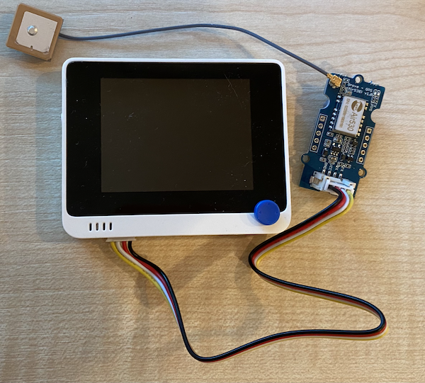

<!--
CO_OP_TRANSLATOR_METADATA:
{
  "original_hash": "da6ae0a795cf06be33d23ca5b8493fc8",
  "translation_date": "2025-08-27T14:37:26+00:00",
  "source_file": "3-transport/lessons/1-location-tracking/wio-terminal-gps-sensor.md",
  "language_code": "ne"
}
-->
# GPS डेटा पढ्नुहोस् - Wio Terminal

यस पाठको यस भागमा, तपाईं आफ्नो Wio Terminal मा GPS सेन्सर थप्नुहुनेछ र यसबाट मानहरू पढ्नुहुनेछ।

## हार्डवेयर

Wio Terminal लाई GPS सेन्सर चाहिन्छ।

तपाईंले प्रयोग गर्ने सेन्सर [Grove GPS Air530 सेन्सर](https://www.seeedstudio.com/Grove-GPS-Air530-p-4584.html) हो। यो सेन्सरले धेरै GPS प्रणालीहरूसँग जडान गर्न सक्छ जसले छिटो र सही स्थान निर्धारण गर्न मद्दत गर्दछ। सेन्सर दुई भागहरूमा बनेको छ - सेन्सरको मुख्य इलेक्ट्रोनिक्स र एक पातलो तारद्वारा जडित बाह्य एन्टेना जसले उपग्रहबाट रेडियो तरंगहरू समात्छ।

यो UART सेन्सर हो, जसले GPS डेटा UART मार्फत पठाउँछ।

### GPS सेन्सर जडान गर्नुहोस्

Grove GPS सेन्सरलाई Wio Terminal मा जडान गर्न सकिन्छ।

#### कार्य - GPS सेन्सर जडान गर्नुहोस्

GPS सेन्सर जडान गर्नुहोस्।


1. Grove केबलको एक छेउ GPS सेन्सरको सॉकेटमा राख्नुहोस्। यो केवल एक तरिकामा मात्र जडान हुन्छ।

1. Wio Terminal लाई तपाईंको कम्प्युटर वा अन्य पावर सप्लाईबाट डिस्कनेक्ट गरेर, Grove केबलको अर्को छेउलाई Wio Terminal को स्क्रिनतर्फ हेर्दा बायाँपट्टि रहेको Grove सॉकेटमा जडान गर्नुहोस्। यो सॉकेट पावर बटनको नजिक छ।

    

1. GPS सेन्सरलाई यस्तो स्थानमा राख्नुहोस् जहाँ जडित एन्टेनाले आकाश देख्न सक्दछ - आदर्श रूपमा खुला झ्यालको छेउमा वा बाहिर। एन्टेनाको अगाडि कुनै अवरोध नभएको अवस्थामा स्पष्ट सिग्नल प्राप्त गर्न सजिलो हुन्छ।

1. अब तपाईं Wio Terminal लाई आफ्नो कम्प्युटरमा जडान गर्न सक्नुहुन्छ।

1. GPS सेन्सरमा 2 LEDs छन् - नीलो LED जब डेटा ट्रान्समिट हुन्छ तब चम्किन्छ, र हरियो LED उपग्रहबाट डेटा प्राप्त गर्दा प्रत्येक सेकेन्डमा चम्किन्छ। Wio Terminal पावर अप गर्दा नीलो LED चम्किरहेको सुनिश्चित गर्नुहोस्। केही मिनेटपछि हरियो LED चम्किन्छ - यदि चम्किएन भने, तपाईंले एन्टेनाको स्थान परिवर्तन गर्न आवश्यक हुन सक्छ।

## GPS सेन्सर प्रोग्राम गर्नुहोस्

अब Wio Terminal लाई जडित GPS सेन्सर प्रयोग गर्न प्रोग्राम गर्न सकिन्छ।

### कार्य - GPS सेन्सर प्रोग्राम गर्नुहोस्

डिभाइस प्रोग्राम गर्नुहोस्।

1. PlatformIO प्रयोग गरेर नयाँ Wio Terminal प्रोजेक्ट बनाउनुहोस्। यस प्रोजेक्टलाई `gps-sensor` नाम दिनुहोस्। `setup` फङ्सनमा कोड थपेर सिरियल पोर्ट कन्फिगर गर्नुहोस्।

1. `main.cpp` फाइलको माथि निम्न include निर्देश थप्नुहोस्। यसले UART को लागि बायाँपट्टि रहेको Grove पोर्ट कन्फिगर गर्न फङ्सनहरू समावेश गर्दछ।

    ```cpp
    #include <wiring_private.h>
    ```

1. यसको तल, निम्न कोड लाइन थप्नुहोस् जसले UART पोर्टसँग सिरियल पोर्ट कनेक्शन घोषणा गर्दछ:

    ```cpp
    static Uart Serial3(&sercom3, PIN_WIRE_SCL, PIN_WIRE_SDA, SERCOM_RX_PAD_1, UART_TX_PAD_0);
    ```

1. तपाईंले केही आन्तरिक सिग्नल ह्यान्डलरहरूलाई यस सिरियल पोर्टमा पुनर्निर्देश गर्न कोड थप्न आवश्यक छ। `Serial3` घोषणाको तल निम्न कोड थप्नुहोस्:

    ```cpp
    void SERCOM3_0_Handler()
    {
        Serial3.IrqHandler();
    }
    
    void SERCOM3_1_Handler()
    {
        Serial3.IrqHandler();
    }
    
    void SERCOM3_2_Handler()
    {
        Serial3.IrqHandler();
    }
    
    void SERCOM3_3_Handler()
    {
        Serial3.IrqHandler();
    }
    ```

1. `setup` फङ्सनमा जहाँ `Serial` पोर्ट कन्फिगर गरिएको छ, त्यहाँ UART सिरियल पोर्ट निम्न कोड प्रयोग गरेर कन्फिगर गर्नुहोस्:

    ```cpp
    Serial3.begin(9600);

    while (!Serial3)
        ; // Wait for Serial3 to be ready

    delay(1000);
    ```

1. `setup` फङ्सनमा यस कोडको तल, Grove पिनलाई सिरियल पोर्टसँग जडान गर्न निम्न कोड थप्नुहोस्:

    ```cpp
    pinPeripheral(PIN_WIRE_SCL, PIO_SERCOM_ALT);
    ```

1. `loop` फङ्सनको अघि निम्न फङ्सन थप्नुहोस् जसले GPS डेटा सिरियल मोनिटरमा पठाउँछ:

    ```cpp
    void printGPSData()
    {
        Serial.println(Serial3.readStringUntil('\n'));
    }
    ```

1. `loop` फङ्सनमा, निम्न कोड थप्नुहोस् जसले UART सिरियल पोर्टबाट डेटा पढ्छ र सिरियल मोनिटरमा आउटपुट प्रिन्ट गर्दछ:

    ```cpp
    while (Serial3.available() > 0)
    {
        printGPSData();
    }
    
    delay(1000);
    ```

    यो कोड UART सिरियल पोर्टबाट डेटा पढ्छ। `readStringUntil` फङ्सनले टर्मिनेटर क्यारेक्टर (यस अवस्थामा नयाँ लाइन) सम्म पढ्छ। यसले सम्पूर्ण NMEA वाक्य पढ्छ (NMEA वाक्यहरू नयाँ लाइन क्यारेक्टरले समाप्त हुन्छन्)। जबसम्म UART सिरियल पोर्टबाट डेटा पढ्न सकिन्छ, यो डेटा पढिन्छ र `printGPSData` फङ्सन मार्फत सिरियल मोनिटरमा पठाइन्छ। जब डेटा पढ्न सकिँदैन, `loop` 1 सेकेन्ड (1,000ms) को लागि ढिलाइ गर्दछ।

1. कोड निर्माण गर्नुहोस् र Wio Terminal मा अपलोड गर्नुहोस्।

1. अपलोड गरेपछि, तपाईं सिरियल मोनिटर प्रयोग गरेर GPS डेटा अनुगमन गर्न सक्नुहुन्छ।

    ```output
    > Executing task: platformio device monitor <
    
    --- Available filters and text transformations: colorize, debug, default, direct, hexlify, log2file, nocontrol, printable, send_on_enter, time
    --- More details at http://bit.ly/pio-monitor-filters
    --- Miniterm on /dev/cu.usbmodem1201  9600,8,N,1 ---
    --- Quit: Ctrl+C | Menu: Ctrl+T | Help: Ctrl+T followed by Ctrl+H ---
    $GNGGA,020604.001,4738.538654,N,12208.341758,W,1,3,,164.7,M,-17.1,M,,*67
    $GPGSA,A,1,,,,,,,,,,,,,,,*1E
    $BDGSA,A,1,,,,,,,,,,,,,,,*0F
    $GPGSV,1,1,00*79
    $BDGSV,1,1,00*68
    ```

> 💁 तपाईं यो कोड [code-gps/wio-terminal](../../../../../3-transport/lessons/1-location-tracking/code-gps/wio-terminal) फोल्डरमा पाउन सक्नुहुन्छ।

😀 तपाईंको GPS सेन्सर प्रोग्राम सफल भयो!

---

**अस्वीकरण**:  
यो दस्तावेज़ AI अनुवाद सेवा [Co-op Translator](https://github.com/Azure/co-op-translator) प्रयोग गरेर अनुवाद गरिएको छ। हामी शुद्धताको लागि प्रयास गर्छौं, तर कृपया ध्यान दिनुहोस् कि स्वचालित अनुवादमा त्रुटिहरू वा अशुद्धताहरू हुन सक्छ। यसको मूल भाषा मा रहेको मूल दस्तावेज़लाई आधिकारिक स्रोत मानिनुपर्छ। महत्वपूर्ण जानकारीको लागि, व्यावसायिक मानव अनुवाद सिफारिस गरिन्छ। यस अनुवादको प्रयोगबाट उत्पन्न हुने कुनै पनि गलतफहमी वा गलत व्याख्याको लागि हामी जिम्मेवार हुने छैनौं।