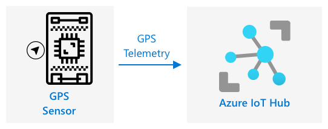

<!--
CO_OP_TRANSLATOR_METADATA:
{
  "original_hash": "e345843ccfeb7261d81500d19c64d476",
  "translation_date": "2025-08-27T15:00:05+00:00",
  "source_file": "3-transport/lessons/2-store-location-data/README.md",
  "language_code": "ne"
}
-->
# स्टोर लोकेशन डेटा


> स्केच नोट [नित्या नरसिम्हन](https://github.com/nitya) द्वारा। ठूलो संस्करणको लागि तस्बिरमा क्लिक गर्नुहोस्।

## प्रि-लेक्चर क्विज

[प्रि-लेक्चर क्विज](https://black-meadow-040d15503.1.azurestaticapps.net/quiz/23)

## परिचय

अघिल्लो पाठमा, तपाईंले GPS सेन्सर प्रयोग गरेर लोकेशन डेटा क्याप्चर गर्न सिक्नुभयो। यो डेटा प्रयोग गरेर खाना बोकेको ट्रकको लोकेशन र यसको यात्रा देखाउन, यसलाई क्लाउडमा IoT सेवामा पठाउन र कुनै ठाउँमा स्टोर गर्न आवश्यक छ।

यस पाठमा, तपाईं IoT डेटा स्टोर गर्ने विभिन्न तरिकाहरू सिक्नुहुनेछ, र IoT सेवाबाट डेटा स्टोर गर्न सर्वरलेस कोड प्रयोग गर्ने तरिका सिक्नुहुनेछ।

यस पाठमा हामी निम्न विषयहरू समेट्नेछौं:

* [संरचित र असंरचित डेटा](../../../../../3-transport/lessons/2-store-location-data)
* [GPS डेटा IoT हबमा पठाउनुहोस्](../../../../../3-transport/lessons/2-store-location-data)
* [हट, वार्म, र कोल्ड पाथहरू](../../../../../3-transport/lessons/2-store-location-data)
* [GPS घटनाहरूलाई सर्वरलेस कोड प्रयोग गरेर ह्यान्डल गर्नुहोस्](../../../../../3-transport/lessons/2-store-location-data)
* [Azure स्टोरेज अकाउन्टहरू](../../../../../3-transport/lessons/2-store-location-data)
* [तपाईंको सर्वरलेस कोडलाई स्टोरेजसँग जडान गर्नुहोस्](../../../../../3-transport/lessons/2-store-location-data)

## संरचित र असंरचित डेटा

कम्प्युटर प्रणालीहरूले डेटा प्रशोधन गर्छन्, र यो डेटा विभिन्न आकार र प्रकारमा आउँछ। यो एकल नम्बरदेखि लिएर ठूलो पाठ, भिडियो, तस्बिर, र IoT डेटा सम्म फरक हुन सक्छ। सामान्यतया, डेटा दुई प्रकारमा वर्गीकृत गर्न सकिन्छ - *संरचित* डेटा र *असंरचित* डेटा।

* **संरचित डेटा** भनेको राम्रोसँग परिभाषित, कडा संरचना भएको डेटा हो जसले परिवर्तन गर्दैन र प्रायः तालिकाहरूमा सम्बन्धित डेटा म्याप गर्दछ। उदाहरणका लागि, व्यक्तिको नाम, जन्म मिति, र ठेगाना समावेश गर्ने विवरण।

* **असंरचित डेटा** भनेको राम्रोसँग परिभाषित संरचना नभएको डेटा हो, जसले बारम्बार संरचना परिवर्तन गर्न सक्छ। उदाहरणका लागि, लेखिएका कागजातहरू वा स्प्रेडशीटहरू।

✅ अनुसन्धान गर्नुहोस्: के तपाईं संरचित र असंरचित डेटा का अन्य उदाहरण सोच्न सक्नुहुन्छ?

> 💁 त्यहाँ अर्ध-संरचित डेटा पनि हुन्छ, जुन संरचित हुन्छ तर निश्चित तालिकाहरूमा फिट हुँदैन।

IoT डेटा सामान्यतया असंरचित डेटा मानिन्छ।

कल्पना गर्नुहोस् कि तपाईं ठूलो व्यावसायिक फार्मको सवारी साधनहरूको बेडामा IoT उपकरणहरू थप्दै हुनुहुन्छ। तपाईं विभिन्न प्रकारका सवारी साधनहरूको लागि विभिन्न उपकरणहरू प्रयोग गर्न चाहनुहुन्छ। उदाहरणका लागि:

* फार्म सवारी साधनहरू जस्तै ट्र्याक्टरहरूको लागि GPS डेटा चाहिन्छ ताकि तिनीहरू सही खेतहरूमा काम गरिरहेका छन् भनेर सुनिश्चित गर्न सकियोस्।
* गोदाममा खाना पुर्‍याउने डेलिभरी ट्रकहरूको लागि GPS डेटा, गति, र एक्सेलेरेशन डेटा चाहिन्छ ताकि चालक सुरक्षित रूपमा चलाइरहेको छ भनेर सुनिश्चित गर्न सकियोस्, र चालकको पहिचान तथा सुरु/समाप्ति डेटा स्थानीय कानुन अनुसार काम गर्ने घण्टाको पालना सुनिश्चित गर्न।
* रेफ्रिजेरेटेड ट्रकहरूको लागि तापक्रम डेटा चाहिन्छ ताकि खाना धेरै तातो वा चिसो नहोस् र ट्रान्जिटमा बिग्रन नपाओस्।

यो डेटा निरन्तर परिवर्तन हुन सक्छ। उदाहरणका लागि, यदि IoT उपकरण ट्रकको क्याबमा छ भने, ट्रेलर परिवर्तन हुँदा यो पठाउने डेटा पनि परिवर्तन हुन सक्छ, जस्तै रेफ्रिजेरेटेड ट्रेलर प्रयोग गर्दा मात्र तापक्रम डेटा पठाउनु।

✅ अन्य IoT डेटा के क्याप्चर गर्न सकिन्छ? ट्रकहरूले बोक्न सक्ने प्रकारका सामानहरू र मर्मतसम्भार डेटा बारे सोच्नुहोस्।

यो डेटा सवारी साधन अनुसार फरक हुन्छ, तर यो सबै एउटै IoT सेवामा प्रशोधनको लागि पठाइन्छ। IoT सेवाले यो असंरचित डेटा प्रशोधन गर्न सक्षम हुनुपर्छ, यसलाई खोजी वा विश्लेषण गर्न मिल्ने तरिकामा स्टोर गर्नुपर्छ, तर यो डेटा संरचनासँग मिल्नुपर्छ।

### SQL बनाम NoSQL स्टोरेज

डाटाबेसहरू सेवाहरू हुन् जसले तपाईंलाई डेटा स्टोर गर्न र सोधपुछ गर्न अनुमति दिन्छ। डाटाबेस दुई प्रकारका हुन्छन् - SQL र NoSQL।

#### SQL डाटाबेस

पहिलो डाटाबेसहरू रिलेशनल डाटाबेस म्यानेजमेन्ट सिस्टम (RDBMS) वा रिलेशनल डाटाबेस थिए। यी SQL डाटाबेसका रूपमा चिनिन्छन् किनभने तिनीहरूमा संरचित क्वेरी भाषा (SQL) प्रयोग गरिन्छ। SQL डाटाबेसमा स्कीमा हुन्छ - राम्रोसँग परिभाषित तालिकाहरूको सेट, स्प्रेडशीट जस्तै। प्रत्येक तालिकामा धेरै नामित स्तम्भहरू हुन्छन्। जब तपाईं डेटा थप्नुहुन्छ, तपाईं तालिकामा पङ्क्ति थप्नुहुन्छ, प्रत्येक स्तम्भमा मानहरू राख्दै। यसले डेटा कडा संरचनामा राख्छ - यद्यपि तपाईं स्तम्भहरू खाली छोड्न सक्नुहुन्छ, यदि तपाईं नयाँ स्तम्भ थप्न चाहनुहुन्छ भने तपाईंले डाटाबेसमा यो गर्नुपर्छ।


उदाहरणका लागि, यदि तपाईंले प्रयोगकर्ताको व्यक्तिगत विवरणहरू तालिकामा स्टोर गर्नुभयो भने, तपाईंले प्रत्येक प्रयोगकर्ताको लागि आन्तरिक अद्वितीय ID राख्नुहुन्छ। यदि तपाईंले प्रयोगकर्ताको खरिदहरू जस्तै अन्य विवरणहरू अर्को तालिकामा स्टोर गर्न चाहनुभयो भने, तपाईंले नयाँ तालिकामा प्रयोगकर्ताको ID राख्नुहुन्छ। जब तपाईं प्रयोगकर्ताको विवरण हेर्न चाहनुहुन्छ, तपाईंले ID प्रयोग गरेर व्यक्तिगत विवरण र खरिदहरू प्राप्त गर्न सक्नुहुन्छ।

SQL डाटाबेस संरचित डेटा स्टोर गर्न आदर्श हो, र जब तपाईं डेटा स्कीमासँग मिल्न सुनिश्चित गर्न चाहनुहुन्छ।

✅ यदि तपाईंले SQL प्रयोग गर्नुभएको छैन भने, [SQL पृष्ठ Wikipedia मा](https://wikipedia.org/wiki/SQL) पढ्न समय निकाल्नुहोस्।

केही प्रख्यात SQL डाटाबेसहरू Microsoft SQL Server, MySQL, र PostgreSQL हुन्।

✅ अनुसन्धान गर्नुहोस्: यी SQL डाटाबेसहरू र तिनीहरूको क्षमताहरूको बारेमा पढ्नुहोस्।

#### NoSQL डाटाबेस

NoSQL डाटाबेसहरूलाई NoSQL भनिन्छ किनभने तिनीहरू SQL डाटाबेसको कडा संरचना जस्तै छैन। तिनीहरूलाई डकुमेन्ट डाटाबेस पनि भनिन्छ किनभने तिनीहरूले असंरचित डेटा जस्तै डकुमेन्टहरू स्टोर गर्न सक्छन्।

> 💁 तिनीहरूको नामको बाबजुद, केही NoSQL डाटाबेसहरूले SQL प्रयोग गरेर डेटा सोधपुछ गर्न अनुमति दिन्छ।


NoSQL डाटाबेसमा पूर्व-परिभाषित स्कीमा हुँदैन जसले डेटा स्टोर गर्ने तरिकालाई सीमित गर्छ। तपाईं कुनै पनि असंरचित डेटा, सामान्यतया JSON डकुमेन्टहरू, स्टोर गर्न सक्नुहुन्छ। यी डकुमेन्टहरू फोल्डरहरूमा व्यवस्थित गर्न सकिन्छ। प्रत्येक डकुमेन्टमा अन्य डकुमेन्टहरू भन्दा फरक क्षेत्रहरू हुन सक्छ। उदाहरणका लागि, यदि तपाईंले फार्म सवारी साधनहरूको IoT डेटा स्टोर गर्नुभयो भने, केहीमा एक्सेलेरोमिटर र गति डेटा क्षेत्रहरू हुन सक्छ, अन्यमा ट्रेलरको तापक्रम क्षेत्रहरू हुन सक्छ। यदि तपाईंले नयाँ ट्रक प्रकार थप्नुभयो भने, जस्तै तौल ट्र्याक गर्ने स्केलहरू भएको ट्रक, तपाईंको IoT उपकरणले नयाँ क्षेत्र थप्न सक्छ र यो डाटाबेसमा कुनै परिवर्तन बिना स्टोर गर्न सकिन्छ।

केही प्रख्यात NoSQL डाटाबेसहरू Azure CosmosDB, MongoDB, र CouchDB हुन्।

✅ अनुसन्धान गर्नुहोस्: यी NoSQL डाटाबेसहरू र तिनीहरूको क्षमताहरूको बारेमा पढ्नुहोस्।

यस पाठमा, तपाईं IoT डेटा स्टोर गर्न NoSQL स्टोरेज प्रयोग गर्नुहुनेछ।

## GPS डेटा IoT हबमा पठाउनुहोस्

अघिल्लो पाठमा तपाईंले GPS सेन्सरबाट GPS डेटा क्याप्चर गर्नुभयो। यो IoT डेटा क्लाउडमा स्टोर गर्न, तपाईंले यसलाई IoT सेवामा पठाउनुपर्छ। फेरि, तपाईंले Azure IoT Hub प्रयोग गर्नुहुनेछ, जुन तपाईंले अघिल्लो परियोजनामा प्रयोग गर्नुभएको IoT क्लाउड सेवा हो।



### कार्य - GPS डेटा IoT हबमा पठाउनुहोस्

1. निःशुल्क टियर प्रयोग गरेर नयाँ IoT हब सिर्जना गर्नुहोस्।

    > ⚠️ यदि आवश्यक छ भने, [परियोजना 2, पाठ 4 बाट IoT हब सिर्जना गर्ने निर्देशनहरू](../../../2-farm/lessons/4-migrate-your-plant-to-the-cloud/README.md#create-an-iot-service-in-the-cloud) हेर्न सक्नुहुन्छ।

    नयाँ रिसोर्स ग्रुप सिर्जना गर्न सम्झनुहोस्। नयाँ रिसोर्स ग्रुपलाई `gps-sensor` नाम दिनुहोस्, र नयाँ IoT हबलाई `gps-sensor` मा आधारित अद्वितीय नाम दिनुहोस्, जस्तै `gps-sensor-<तपाईंको नाम>`।

    > 💁 यदि तपाईंले अघिल्लो परियोजनाबाट आफ्नो IoT हब राख्नुभएको छ भने, तपाईंले यसलाई पुन: प्रयोग गर्न सक्नुहुन्छ। अन्य सेवाहरू सिर्जना गर्दा यस IoT हबको नाम र रिसोर्स ग्रुप प्रयोग गर्न सम्झनुहोस्।

1. IoT हबमा नयाँ उपकरण थप्नुहोस्। यस उपकरणलाई `gps-sensor` नाम दिनुहोस्। उपकरणको कनेक्शन स्ट्रिङ प्राप्त गर्नुहोस्।

1. आफ्नो उपकरणको कोड अपडेट गर्नुहोस् ताकि GPS डेटा नयाँ IoT हबमा उपकरण कनेक्शन स्ट्रिङ प्रयोग गरेर पठाउन सकियोस्।

    > ⚠️ यदि आवश्यक छ भने, [परियोजना 2, पाठ 4 बाट उपकरणलाई IoT सेवासँग जडान गर्ने निर्देशनहरू](../../../2-farm/lessons/4-migrate-your-plant-to-the-cloud/README.md#connect-your-device-to-the-iot-service) हेर्न सक्नुहुन्छ।

1. GPS डेटा JSON को निम्न स्वरूपमा पठाउनुहोस्:

    ```json
    {
        "gps" :
        {
            "lat" : <latitude>,
            "lon" : <longitude>
        }
    }
    ```

1. दैनिक सन्देशको सीमा नपुगोस् भनेर GPS डेटा प्रत्येक मिनेटमा पठाउनुहोस्।

यदि तपाईं Wio Terminal प्रयोग गर्दै हुनुहुन्छ भने, सबै आवश्यक लाइब्रेरीहरू थप्न सम्झनुहोस्, र NTP सर्भर प्रयोग गरेर समय सेट गर्नुहोस्। तपाईंको कोडले पनि सुनिश्चित गर्नुपर्छ कि यसले GPS लोकेशन पठाउनु अघि सिरियल पोर्टबाट सबै डेटा पढेको छ। JSON डकुमेन्ट निर्माण गर्न निम्न कोड प्रयोग गर्नुहोस्:

```cpp
DynamicJsonDocument doc(1024);
doc["gps"]["lat"] = gps.location.lat();
doc["gps"]["lon"] = gps.location.lng();
```

यदि तपाईं भर्चुअल IoT उपकरण प्रयोग गर्दै हुनुहुन्छ भने, भर्चुअल वातावरण प्रयोग गरेर सबै आवश्यक लाइब्रेरीहरू स्थापना गर्न सम्झनुहोस्।

Raspberry Pi र भर्चुअल IoT उपकरण दुवैका लागि, अघिल्लो पाठबाट कोड प्रयोग गरेर अक्षांश र देशान्तर मानहरू प्राप्त गर्नुहोस्, त्यसपछि निम्न JSON स्वरूपमा सही डेटा पठाउनुहोस्:

```python
message_json = { "gps" : { "lat":lat, "lon":lon } }
print("Sending telemetry", message_json)
message = Message(json.dumps(message_json))
```

> 💁 तपाईंले यो कोड [code/wio-terminal](../../../../../3-transport/lessons/2-store-location-data/code/wio-terminal), [code/pi](../../../../../3-transport/lessons/2-store-location-data/code/pi) वा [code/virtual-device](../../../../../3-transport/lessons/2-store-location-data/code/virtual-device) फोल्डरमा पाउन सक्नुहुन्छ।

तपाईंको उपकरणको कोड चलाउनुहोस् र `az iot hub monitor-events` CLI कमाण्ड प्रयोग गरेर IoT हबमा सन्देशहरू प्रवाहित भइरहेको सुनिश्चित गर्नुहोस्।

## हट, वार्म, र कोल्ड पाथहरू

IoT उपकरणबाट क्लाउडमा प्रवाहित हुने डेटा सधैं वास्तविक समयमा प्रशोधन गरिँदैन। केही डेटा वास्तविक समयमा प्रशोधन गर्न आवश्यक छ, अन्य डेटा केही समय पछि प्रशोधन गर्न सकिन्छ, र अन्य डेटा धेरै पछि प्रशोधन गर्न सकिन्छ। डेटा विभिन्न सेवाहरूमा प्रवाहित हुने प्रक्रिया, जुन विभिन्न समयमा डेटा प्रशोधन गर्छ, हट, वार्म, र कोल्ड पाथहरू भनेर चिनिन्छ।

### हट पाथ

हट पाथले वास्तविक समय वा नजिकको वास्तविक समयमा प्रशोधन गर्न आवश्यक डेटा जनाउँछ। तपाईं हट पाथ डेटा अलर्टहरूको लागि प्रयोग गर्नुहुन्छ, जस्तै कुनै सवारी साधन डिपो नजिक आइरहेको छ वा रेफ्रिजेरेटेड ट्रकको तापक्रम धेरै उच्च छ भन्ने अलर्ट प्राप्त गर्न।

हट पाथ डेटा प्रयोग गर्न, तपाईंको कोडले क्लाउड सेवाहरूले प्राप्त गरेपछि तुरुन्तै घटनाहरूमा प्रतिक्रिया दिनुपर्छ।

### वार्म पाथ

वार्म पाथले डेटा प्राप्त भएको केही समय पछि प्रशोधन गर्न सकिने डेटा जनाउँछ, उदाहरणका लागि रिपोर्टिङ वा छोटो समयको एनालिटिक्सका लागि। तपाईं वार्म पाथ डेटा दैनिक रिपोर्टहरूको लागि प्रयोग गर्नुहुन्छ, जस्तै अघिल्लो दिनको सवारी साधनको माइलेज डेटा प्रयोग गरेर।

वार्म पाथ डेटा क्लाउड सेवाले प्राप्त गरेपछि छिटो पहुँच गर्न सकिने स्टोरेजमा स्टोर गरिन्छ।

### कोल्ड पाथ

कोल्ड पाथले ऐतिहासिक डेटा जनाउँछ, दीर्घकालीनका लागि डेटा स्टोर गर्ने र आवश्यक पर्दा प्रशोधन गर्ने। उदाहरणका लागि, तपाईं वार्षिक माइलेज रिपोर्टहरू प्राप्त गर्न वा इन्धन लागत घटाउन सबैभन्दा उपयुक्त मार्ग पत्ता लगाउन कोल्ड पाथ प्रयोग गर्न सक्नुहुन्छ।

कोल्ड पाथ डेटा डेटा वेयरहाउसहरूमा स्टोर गरिन्छ - ठूलो मात्रामा डेटा स्टोर गर्न डिजाइन गरिएका डाटाबेसहरू जसले कहिल्यै परिवर्तन गर्दैन र छिटो र सजिलै सोधपुछ गर्न सकिन्छ। तपाईंको क्लाउड एप्लिकेसनमा नियमित रूपमा चल्ने कामले वार्म पाथ स्टोरेजबाट डेटा वेयरहाउसमा डेटा सार्ने काम गर्छ।

✅ तपाईंले यी पाठहरूमा अहिलेसम्म क्याप्चर गर्नुभएको डेटा बारे सोच्नुहोस्। यो हट, वार्म, वा कोल्ड पाथ डेटा हो?

## GPS घटनाहरूलाई सर्वरलेस कोड प्रयोग गरेर ह्यान्डल गर्नुहोस्

एकपटक डेटा तपाईंको IoT हबमा प्रवाहित भएपछि, तपाईंले केही सर्वरलेस कोड लेख्न सक्नुहुन्छ जसले इभेन्ट-हब कम्प्याटिबल एन्डप्वाइन्टमा प्रकाशित घटनाहरूको लागि सुन्छ। यो वार्म पाथ हो - यो डेटा स्टोर गरिनेछ र अर्को पाठमा यात्रा रिपोर्टिङका लागि प्रयोग गरिनेछ।


### कार्य - GPS घटनाहरूलाई सर्वरलेस कोड प्रयोग गरेर ह्यान्डल गर्नुहोस्

1. Azure Functions CLI प्रयोग गरेर Azure Functions एप सिर्जना गर्नुहोस्। Python रनटाइम प्रयोग गर्नुहोस्, र यसलाई `gps-trigger` नामक फोल्डरमा सिर्जना गर्नुहोस्, र Functions App प्रोजेक्ट नाम पनि `gps-trigger` राख्नुहोस्। यसका लागि भर्चुअल वातावरण सिर्जना गर्न सुनिश्चित गर्नुहोस्।
> ⚠️ तपाईंले आवश्यक परेमा [Azure Functions Project बनाउनको लागि परियोजना २, पाठ ५ को निर्देशनहरू](../../../2-farm/lessons/5-migrate-application-to-the-cloud/README.md#create-a-serverless-application) हेर्न सक्नुहुन्छ।
1. IoT हबको इभेन्ट हब अनुकूल अन्तर्क्रियात्मक अन्त बिन्दु प्रयोग गर्ने IoT हब इभेन्ट ट्रिगर थप्नुहोस्।

    > ⚠️ आवश्यक परेमा [प्रोजेक्ट २, पाठ ५ बाट IoT हब इभेन्ट ट्रिगर सिर्जना गर्ने निर्देशनहरू](../../../2-farm/lessons/5-migrate-application-to-the-cloud/README.md#create-an-iot-hub-event-trigger) हेर्न सक्नुहुन्छ।

1. `local.settings.json` फाइलमा इभेन्ट हब अनुकूल अन्तर्क्रियात्मक अन्त बिन्दुको कनेक्शन स्ट्रिङ सेट गर्नुहोस्, र त्यस प्रविष्टिको लागि कुञ्जी `function.json` फाइलमा प्रयोग गर्नुहोस्।

1. Azurite एपलाई स्थानीय भण्डारण इम्युलेटरको रूपमा प्रयोग गर्नुहोस्।

1. आफ्नो फङ्क्सन एप चलाउनुहोस् र यो तपाईंको GPS उपकरणबाट इभेन्टहरू प्राप्त गर्दैछ भनेर सुनिश्चित गर्नुहोस्। तपाईंको IoT उपकरण पनि चलिरहेको छ र GPS डाटा पठाइरहेको छ भनेर सुनिश्चित गर्नुहोस्।

    ```output
    Python EventHub trigger processed an event: {"gps": {"lat": 47.73481, "lon": -122.25701}}
    ```

## Azure स्टोरेज खाता


Azure स्टोरेज खाता एक सामान्य उद्देश्यको भण्डारण सेवा हो जसले विभिन्न तरिकामा डाटा भण्डारण गर्न सक्छ। तपाईं डाटालाई ब्लब, क्यु, तालिका, वा फाइलको रूपमा भण्डारण गर्न सक्नुहुन्छ, र यी सबै एकै समयमा गर्न सक्नुहुन्छ।

### ब्लब भण्डारण

*ब्लब* शब्दको अर्थ बाइनरी ठूला वस्तुहरू हो, तर यो कुनै पनि असंरचित डाटाको लागि प्रयोग गरिने शब्द बनेको छ। तपाईं ब्लब भण्डारणमा कुनै पनि डाटा भण्डारण गर्न सक्नुहुन्छ, IoT डाटासहितको JSON कागजातदेखि लिएर छवि र चलचित्र फाइलहरूसम्म। ब्लब भण्डारणमा *कन्टेनर* को अवधारणा हुन्छ, जसलाई तालिकाहरू जस्तै नाम दिइएका बाल्टिनहरूमा डाटा भण्डारण गर्न सकिन्छ। यी कन्टेनरहरूमा एक वा बढी फोल्डरहरू हुन सक्छन्, जसमा ब्लबहरू भण्डारण गर्न सकिन्छ, र प्रत्येक फोल्डरमा अन्य फोल्डरहरू समावेश गर्न सकिन्छ, तपाईंको कम्प्युटरको हार्ड डिस्कमा फाइलहरू भण्डारण गरिएजस्तै।

यस पाठमा तपाईं IoT डाटा भण्डारण गर्न ब्लब भण्डारण प्रयोग गर्नुहुनेछ।

✅ अनुसन्धान गर्नुहोस्: [Azure Blob Storage](https://docs.microsoft.com/azure/storage/blobs/storage-blobs-overview?WT.mc_id=academic-17441-jabenn) को बारेमा पढ्नुहोस्।

### तालिका भण्डारण

तालिका भण्डारणले अर्ध-संरचित डाटा भण्डारण गर्न अनुमति दिन्छ। तालिका भण्डारण वास्तवमा एक NoSQL डाटाबेस हो, जसले अगाडि नै तालिकाहरूको परिभाषा आवश्यक पर्दैन, तर यो एक वा बढी तालिकाहरूमा डाटा भण्डारण गर्न डिजाइन गरिएको हो, प्रत्येक पङ्क्तिलाई परिभाषित गर्न अद्वितीय कुञ्जीहरूको साथ।

✅ अनुसन्धान गर्नुहोस्: [Azure Table Storage](https://docs.microsoft.com/azure/storage/tables/table-storage-overview?WT.mc_id=academic-17441-jabenn) को बारेमा पढ्नुहोस्।

### क्यु भण्डारण

क्यु भण्डारणले 64KB सम्मको सन्देशहरू क्युमा भण्डारण गर्न अनुमति दिन्छ। तपाईं क्युको पछाडि सन्देशहरू थप्न सक्नुहुन्छ, र अगाडिबाट तिनीहरूलाई पढ्न सक्नुहुन्छ। क्युहरूले सन्देशहरू अनिश्चितकालसम्म भण्डारण गर्छ जबसम्म भण्डारण ठाउँ उपलब्ध छ, जसले सन्देशहरू लामो समयसम्म भण्डारण गर्न अनुमति दिन्छ। उदाहरणका लागि, यदि तपाईं मासिक GPS डाटा प्रशोधन गर्न चाहनुहुन्छ भने, तपाईं यसलाई प्रत्येक दिन क्युमा थप्न सक्नुहुन्छ, र महिनाको अन्त्यमा सबै सन्देशहरू प्रशोधन गर्न सक्नुहुन्छ।

✅ अनुसन्धान गर्नुहोस्: [Azure Queue Storage](https://docs.microsoft.com/azure/storage/queues/storage-queues-introduction?WT.mc_id=academic-17441-jabenn) को बारेमा पढ्नुहोस्।

### फाइल भण्डारण

फाइल भण्डारण भनेको क्लाउडमा फाइलहरूको भण्डारण हो, र कुनै पनि एप वा उपकरणहरूले उद्योग मानक प्रोटोकलहरू प्रयोग गरेर जडान गर्न सक्छन्। तपाईं फाइलहरू फाइल भण्डारणमा लेख्न सक्नुहुन्छ, त्यसपछि यसलाई तपाईंको पीसी वा म्याकमा ड्राइभको रूपमा माउन्ट गर्न सक्नुहुन्छ।

✅ अनुसन्धान गर्नुहोस्: [Azure File Storage](https://docs.microsoft.com/azure/storage/files/storage-files-introduction?WT.mc_id=academic-17441-jabenn) को बारेमा पढ्नुहोस्।

## आफ्नो सर्भरलेस कोडलाई भण्डारणसँग जडान गर्नुहोस्

अब तपाईंको फङ्क्सन एपले IoT हबबाट सन्देशहरू भण्डारण गर्न ब्लब भण्डारणसँग जडान गर्न आवश्यक छ। यो गर्नका लागि दुई तरिकाहरू छन्:

* फङ्क्सन कोडभित्र, ब्लब भण्डारणसँग जडान गर्न ब्लब भण्डारणको Python SDK प्रयोग गर्नुहोस् र डाटालाई ब्लबको रूपमा लेख्नुहोस्।
* आउटपुट फङ्क्सन बाइन्डिङ प्रयोग गर्नुहोस् र फङ्क्सनको रिटर्न मानलाई ब्लब भण्डारणसँग बाइन्ड गर्नुहोस्, जसले ब्लबलाई स्वचालित रूपमा सुरक्षित गर्दछ।

यस पाठमा, तपाईं ब्लब भण्डारणसँग अन्तरक्रिया गर्न Python SDK प्रयोग गर्नुहुनेछ।


डाटा निम्न ढाँचामा JSON ब्लबको रूपमा सुरक्षित हुनेछ:

```json
{
    "device_id": <device_id>,
    "timestamp" : <time>,
    "gps" :
    {
        "lat" : <latitude>,
        "lon" : <longitude>
    }
}
```

### कार्य - आफ्नो सर्भरलेस कोडलाई भण्डारणसँग जडान गर्नुहोस्

1. Azure स्टोरेज खाता सिर्जना गर्नुहोस्। यसलाई `gps<तपाईंको नाम>` जस्तो केही नाम दिनुहोस्।

    > ⚠️ आवश्यक परेमा [प्रोजेक्ट २, पाठ ५ बाट स्टोरेज खाता सिर्जना गर्ने निर्देशनहरू](../../../2-farm/lessons/5-migrate-application-to-the-cloud/README.md#task---create-the-cloud-resources) हेर्न सक्नुहुन्छ।

    यदि तपाईंसँग अघिल्लो प्रोजेक्टबाट स्टोरेज खाता छ भने, तपाईं यसलाई पुन: प्रयोग गर्न सक्नुहुन्छ।

    > 💁 तपाईंले यसै स्टोरेज खातालाई यस पाठको अन्त्यमा आफ्नो Azure Functions एपलाई परिनियोजन गर्न प्रयोग गर्न सक्नुहुनेछ।

1. स्टोरेज खाताको कनेक्शन स्ट्रिङ प्राप्त गर्न निम्न आदेश चलाउनुहोस्:

    ```sh
    az storage account show-connection-string --output table \
                                              --name <storage_name>
    ```

    `<storage_name>` लाई तपाईंले अघिल्लो चरणमा सिर्जना गर्नुभएको स्टोरेज खाताको नामले प्रतिस्थापन गर्नुहोस्।

1. `local.settings.json` फाइलमा आफ्नो स्टोरेज खाताको कनेक्शन स्ट्रिङको लागि नयाँ प्रविष्टि थप्नुहोस्, अघिल्लो चरणबाट प्राप्त मान प्रयोग गर्दै। यसलाई `STORAGE_CONNECTION_STRING` नाम दिनुहोस्।

1. `requirements.txt` फाइलमा Azure स्टोरेज Pip प्याकेजहरू स्थापना गर्न निम्न थप्नुहोस्:

    ```sh
    azure-storage-blob
    ```

    आफ्नो भर्चुअल वातावरणमा यो फाइलबाट प्याकेजहरू स्थापना गर्नुहोस्।

    > यदि तपाईंलाई त्रुटि आउँछ भने, आफ्नो भर्चुअल वातावरणमा Pip संस्करणलाई निम्न आदेश प्रयोग गरेर अद्यावधिक गर्नुहोस्, त्यसपछि पुन: प्रयास गर्नुहोस्:
    >
    > ```sh
    > pip install --upgrade pip
    > ```

1. `iot-hub-trigger` को `__init__.py` फाइलमा निम्न इम्पोर्ट स्टेटमेन्टहरू थप्नुहोस्:

    ```python
    import json
    import os
    import uuid
    from azure.storage.blob import BlobServiceClient, PublicAccess
    ```

    `json` प्रणाली मोड्युल JSON पढ्न र लेख्न प्रयोग हुनेछ, `os` प्रणाली मोड्युल कनेक्शन स्ट्रिङ पढ्न प्रयोग हुनेछ, `uuid` प्रणाली मोड्युल GPS रिडिङको लागि अद्वितीय ID सिर्जना गर्न प्रयोग हुनेछ।

    `azure.storage.blob` प्याकेज ब्लब भण्डारणसँग काम गर्न Python SDK समावेश गर्दछ।

1. `main` विधिको अघि निम्न सहायक फङ्क्सन थप्नुहोस्:

    ```python
    def get_or_create_container(name):
        connection_str = os.environ['STORAGE_CONNECTION_STRING']
        blob_service_client = BlobServiceClient.from_connection_string(connection_str)
    
        for container in blob_service_client.list_containers():
            if container.name == name:
                return blob_service_client.get_container_client(container.name)
        
        return blob_service_client.create_container(name, public_access=PublicAccess.Container)
    ```

    Python ब्लब SDK सँग कन्टेनर सिर्जना गर्ने सहायक विधि छैन यदि यो अवस्थित छैन भने। यो कोडले `local.settings.json` फाइल (वा क्लाउडमा परिनियोजन भएपछि एप्लिकेसन सेटिङ्स) बाट कनेक्शन स्ट्रिङ लोड गर्दछ, त्यसपछि ब्लब भण्डारण खातासँग अन्तरक्रिया गर्न `BlobServiceClient` वर्ग सिर्जना गर्दछ। यो ब्लब भण्डारण खाताका सबै कन्टेनरहरूमा लुप गर्दछ, प्रदान गरिएको नामको साथ एक खोज्दै - यदि यो फेला पार्छ भने यो कन्टेनरसँग अन्तरक्रिया गर्न `ContainerClient` वर्ग फिर्ता गर्दछ। यदि यो फेला पर्दैन भने, नयाँ कन्टेनर सिर्जना गरिन्छ र नयाँ कन्टेनरको लागि क्लाइन्ट फिर्ता गरिन्छ।

    नयाँ कन्टेनर सिर्जना गर्दा, कन्टेनरमा ब्लबहरू सोध्न सार्वजनिक पहुँच प्रदान गरिन्छ। यो अर्को पाठमा GPS डाटालाई नक्सामा देखाउन प्रयोग गरिनेछ।

1. माटोको चिस्यानको विपरीत, यस कोडसँग हामी प्रत्येक इभेन्ट भण्डारण गर्न चाहन्छौं, त्यसैले `main` फङ्क्सनको `for event in events:` लुपभित्र, `logging` स्टेटमेन्टको तल निम्न कोड थप्नुहोस्:

    ```python
    device_id = event.iothub_metadata['connection-device-id']
    blob_name = f'{device_id}/{str(uuid.uuid1())}.json'
    ```

    यो कोडले इभेन्ट मेटाडाटाबाट उपकरण ID प्राप्त गर्दछ, त्यसपछि यसलाई ब्लब नाम सिर्जना गर्न प्रयोग गर्दछ। ब्लबहरू फोल्डरहरूमा भण्डारण गर्न सकिन्छ, र उपकरण ID फोल्डर नामको लागि प्रयोग गरिनेछ, त्यसैले प्रत्येक उपकरणसँग यसको सबै GPS इभेन्टहरू एक फोल्डरमा हुनेछ। ब्लब नाम यो फोल्डर, त्यसपछि कागजात नाम, अगाडि स्ल्यासहरूद्वारा छुट्याइएको हुन्छ, Linux र macOS पथहरू जस्तै (Windows जस्तै, तर Windows पछाडि स्ल्यासहरू प्रयोग गर्दछ)। कागजात नाम Python `uuid` मोड्युल प्रयोग गरेर सिर्जना गरिएको अद्वितीय ID हो, `json` प्रकारको फाइलको साथ।

    उदाहरणका लागि, `gps-sensor` उपकरण ID को लागि, ब्लब नाम `gps-sensor/a9487ac2-b9cf-11eb-b5cd-1e00621e3648.json` हुन सक्छ।

1. यसको तल निम्न कोड थप्नुहोस्:

    ```python
    container_client = get_or_create_container('gps-data')
    blob = container_client.get_blob_client(blob_name)
    ```

    यो कोडले `get_or_create_container` सहायक वर्ग प्रयोग गरेर कन्टेनर क्लाइन्ट प्राप्त गर्दछ, त्यसपछि ब्लब नाम प्रयोग गरेर ब्लब क्लाइन्ट वस्तु प्राप्त गर्दछ। यी ब्लब क्लाइन्टहरूले अवस्थित ब्लबहरूलाई जनाउन सक्छन्, वा यस अवस्थामा, नयाँ ब्लबलाई जनाउन सक्छन्।

1. यसपछि निम्न कोड थप्नुहोस्:

    ```python
    event_body = json.loads(event.get_body().decode('utf-8'))
    blob_body = {
        'device_id' : device_id,
        'timestamp' : event.iothub_metadata['enqueuedtime'],
        'gps': event_body['gps']
    }
    ```

    यो ब्लबको सामग्री निर्माण गर्दछ जुन ब्लब भण्डारणमा लेखिनेछ। यो JSON कागजात हो जसमा उपकरण ID, IoT हबमा टेलिमेट्री पठाइएको समय, र टेलिमेट्रीबाट GPS निर्देशांकहरू समावेश छन्।

    > 💁 सन्देश पठाइएको समय प्राप्त गर्न सन्देशको समय प्रयोग गर्नु महत्त्वपूर्ण छ, किनभने यो सन्देश हबमा केही समयसम्म बस्न सक्छ यदि फङ्क्सन एप चलिरहेको छैन भने।

1. यस कोडको तल निम्न थप्नुहोस्:

    ```python
    logging.info(f'Writing blob to {blob_name} - {blob_body}')
    blob.upload_blob(json.dumps(blob_body).encode('utf-8'))
    ```

    यो कोडले ब्लब लेख्न लागेको विवरणहरू लग गर्दछ, त्यसपछि नयाँ ब्लबको सामग्रीको रूपमा ब्लबको सामग्री अपलोड गर्दछ।

1. फङ्क्सन एप चलाउनुहोस्। तपाईंले आउटपुटमा GPS इभेन्टहरूको लागि ब्लबहरू लेखिएको देख्नुहुनेछ:

    ```output
    [2021-05-21T01:31:14.325Z] Python EventHub trigger processed an event: {"gps": {"lat": 47.73092, "lon": -122.26206}}
    ...
    [2021-05-21T01:31:14.351Z] Writing blob to gps-sensor/4b6089fe-ba8d-11eb-bc7b-1e00621e3648.json - {'device_id': 'gps-sensor', 'timestamp': '2021-05-21T00:57:53.878Z', 'gps': {'lat': 47.73092, 'lon': -122.26206}}
    ```

    > 💁 सुनिश्चित गर्नुहोस् कि तपाईं IoT हब इभेन्ट मोनिटर एकै समयमा चलाइरहनुभएको छैन।

> 💁 तपाईं यो कोड [code/functions](../../../../../3-transport/lessons/2-store-location-data/code/functions) फोल्डरमा फेला पार्न सक्नुहुन्छ।

### कार्य - अपलोड गरिएका ब्लबहरू प्रमाणित गर्नुहोस्

1. सिर्जना गरिएका ब्लबहरू हेर्न, तपाईं [Azure Storage Explorer](https://azure.microsoft.com/features/storage-explorer/?WT.mc_id=academic-17441-jabenn), एक निःशुल्क उपकरण जसले तपाईंलाई तपाईंका स्टोरेज खाता हेर्न र व्यवस्थापन गर्न अनुमति दिन्छ, वा CLI प्रयोग गर्न सक्नुहुन्छ।

    1. CLI प्रयोग गर्न, पहिले तपाईंलाई खाता कुञ्जी आवश्यक हुनेछ। निम्न आदेश चलाएर यो कुञ्जी प्राप्त गर्नुहोस्:

        ```sh
        az storage account keys list --output table \
                                     --account-name <storage_name>
        ```

        `<storage_name>` लाई स्टोरेज खाताको नामले प्रतिस्थापन गर्नुहोस्।

        `key1` को मान प्रतिलिपि गर्नुहोस्।

    1. कन्टेनरमा ब्लबहरूको सूची हेर्न निम्न आदेश चलाउनुहोस्:

        ```sh
        az storage blob list --container-name gps-data \
                             --output table \
                             --account-name <storage_name> \
                             --account-key <key1>
        ```

        `<storage_name>` लाई स्टोरेज खाताको नामले प्रतिस्थापन गर्नुहोस्, र `<key1>` लाई अघिल्लो चरणमा प्रतिलिपि गरिएको `key1` को मानले प्रतिस्थापन गर्नुहोस्।

        यसले कन्टेनरमा सबै ब्लबहरूको सूची देखाउनेछ:

        ```output
        Name                                                  Blob Type    Blob Tier    Length    Content Type              Last Modified              Snapshot
        ----------------------------------------------------  -----------  -----------  --------  ------------------------  -------------------------  ----------
        gps-sensor/1810d55e-b9cf-11eb-9f5b-1e00621e3648.json  BlockBlob    Hot          45        application/octet-stream  2021-05-21T00:54:27+00:00
        gps-sensor/18293e46-b9cf-11eb-9f5b-1e00621e3648.json  BlockBlob    Hot          45        application/octet-stream  2021-05-21T00:54:28+00:00
        gps-sensor/1844549c-b9cf-11eb-9f5b-1e00621e3648.json  BlockBlob    Hot          45        application/octet-stream  2021-05-21T00:54:28+00:00
        gps-sensor/1894d714-b9cf-11eb-9f5b-1e00621e3648.json  BlockBlob    Hot          45        application/octet-stream  2021-05-21T00:54:28+00:00
        ```

    1. ब्लबहरू मध्ये एक डाउनलोड गर्न निम्न आदेश चलाउनुहोस्:

        ```sh
        az storage blob download --container-name gps-data \
                                 --account-name <storage_name> \
                                 --account-key <key1> \
                                 --name <blob_name> \
                                 --file <file_name>
        ```

        `<storage_name>` लाई स्टोरेज खाताको नामले प्रतिस्थापन गर्नुहोस्, र `<key1>` लाई अघिल्लो चरणमा प्रतिलिपि गरिएको `key1` को मानले प्रतिस्थापन गर्नुहोस्।

        `<blob_name>` लाई आउटपुटको `Name` स्तम्भबाट पूर्ण नामले प्रतिस्थापन गर्नुहोस्, जसमा फोल्डर नाम समावेश छ। `<file_name>` लाई ब्लबलाई बचत गर्नको लागि स्थानीय फाइलको नामले प्रतिस्थापन गर्नुहोस्।

    डाउनलोड भएपछि, तपाईं JSON फाइललाई VS Code मा खोल्न सक्नुहुन्छ, र तपाईं GPS स्थान विवरणहरू समावेश भएको ब्लब देख्नुहुनेछ:

    ```json
    {"device_id": "gps-sensor", "timestamp": "2021-05-21T00:57:53.878Z", "gps": {"lat": 47.73092, "lon": -122.26206}}
    ```

### कार्य - आफ्नो फङ्क्सन एपलाई क्लाउडमा परिनियोजन गर्नुहोस्

अब तपाईंको फङ्क्सन एप काम गरिरहेको छ, तपाईं यसलाई क्लाउडमा परिनियोजन गर्न सक्नुहुन्छ।

1. नयाँ Azure Functions एप सिर्जना गर्नुहोस्, तपाईंले अघिल्लो चरणमा सिर्जना गर्नुभएको स्टोरेज खाता प्रयोग गरेर। यसलाई `gps-sensor-` जस्तो केही नाम दिनुहोस् र अन्तमा केही अद्वितीय पहिचानकर्ता थप्नुहोस्, जस्तै केही अनियमित शब्दहरू वा तपाईंको नाम।

    > ⚠️ आवश्यक परेमा [प्रोजेक्ट २, पाठ ५ बाट Functions एप सिर्जना गर्ने निर्देशनहरू](../../../2-farm/lessons/5-migrate-application-to-the-cloud/README.md#task---create-the-cloud-resources) हेर्न सक्नुहुन्छ।

1. `IOT_HUB_CONNECTION_STRING` र `STORAGE_CONNECTION_STRING` मानहरू एप्लिकेसन सेटिङ्समा अपलोड गर्नुहोस्।

    > ⚠️ आवश्यक परेमा [प्रोजेक्ट २, पाठ ५ बाट एप्लिकेसन सेटिङ्स अपलोड गर्ने निर्देशनहरू](../../../2-farm/lessons/5-migrate-application-to-the-cloud/README.md#task---upload-your-application-settings) हेर्न सक्नुहुन्छ।

1. आफ्नो स्थानीय Functions एपलाई क्लाउडमा परिनियोजन गर्नुहोस्।
> ⚠️ तपाईंले आवश्यक परे [प्रोजेक्ट २, पाठ ५ बाट आफ्नो Functions एप्लिकेसन डिप्लोय गर्ने निर्देशनहरू](../../../2-farm/lessons/5-migrate-application-to-the-cloud/README.md#task---deploy-your-functions-app-to-the-cloud) हेर्न सक्नुहुन्छ।
## 🚀 चुनौती

GPS डाटा पूर्ण रूपमा सटीक हुँदैन, र पत्ता लगाइएका स्थानहरू केही मिटरले फरक हुन सक्छन्, विशेष गरी सुरुङहरू र अग्ला भवनहरूको क्षेत्रमा।

सैटेलाइट नेभिगेसनले यसलाई कसरी समाधान गर्न सक्छ भनेर सोच्नुहोस्? तपाईंको सैट-न्याभसँग कुन डाटा छ जसले तपाईंको स्थानको राम्रो अनुमान गर्न मद्दत गर्न सक्छ?

## व्याख्यानपछिको प्रश्नोत्तर

[व्याख्यानपछिको प्रश्नोत्तर](https://black-meadow-040d15503.1.azurestaticapps.net/quiz/24)

## समीक्षा र आत्म-अध्ययन

* [विकिपेडियाको डाटा मोडेल पृष्ठ](https://wikipedia.org/wiki/Data_model) मा संरचित डाटाबारे पढ्नुहोस्  
* [विकिपेडियाको सेमी-संरचित डाटा पृष्ठ](https://wikipedia.org/wiki/Semi-structured_data) मा सेमी-संरचित डाटाबारे पढ्नुहोस्  
* [विकिपेडियाको असंरचित डाटा पृष्ठ](https://wikipedia.org/wiki/Unstructured_data) मा असंरचित डाटाबारे पढ्नुहोस्  
* [Azure Storage को दस्तावेज](https://docs.microsoft.com/azure/storage/?WT.mc_id=academic-17441-jabenn) मा Azure Storage र विभिन्न भण्डारण प्रकारहरूबारे थप पढ्नुहोस्  

## असाइनमेन्ट

[फङ्सन बाइन्डिङहरूको अनुसन्धान गर्नुहोस्](assignment.md)  

---

**अस्वीकरण**:  
यो दस्तावेज़ AI अनुवाद सेवा [Co-op Translator](https://github.com/Azure/co-op-translator) प्रयोग गरी अनुवाद गरिएको हो। हामी यथासम्भव सटीकता सुनिश्चित गर्न प्रयास गर्छौं, तर कृपया ध्यान दिनुहोस् कि स्वचालित अनुवादहरूमा त्रुटि वा अशुद्धता हुन सक्छ। यसको मूल भाषामा रहेको मूल दस्तावेज़लाई आधिकारिक स्रोत मानिनुपर्छ। महत्त्वपूर्ण जानकारीका लागि, व्यावसायिक मानव अनुवाद सिफारिस गरिन्छ। यस अनुवादको प्रयोगबाट उत्पन्न हुने कुनै पनि गलतफहमी वा गलत व्याख्याका लागि हामी जिम्मेवार हुने छैनौं।  