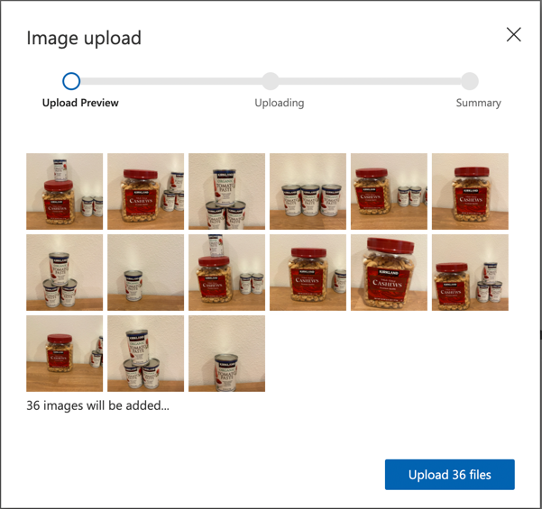

<!--
CO_OP_TRANSLATOR_METADATA:
{
  "original_hash": "8df310a42f902139a01417dacb1ffbef",
  "translation_date": "2025-08-27T10:02:09+00:00",
  "source_file": "5-retail/lessons/1-train-stock-detector/README.md",
  "language_code": "ne"
}
-->
# स्टक डिटेक्टर प्रशिक्षण गर्नुहोस्

> स्केच नोट [नित्या नरसिम्हन](https://github.com/nitya) द्वारा। ठूलो संस्करणको लागि तस्बिरमा क्लिक गर्नुहोस्।

यो भिडियोले Azure Custom Vision सेवा, जुन यस पाठमा समेटिनेछ, को वस्तु पहिचानको अवलोकन दिन्छ।

> 🎥 माथिको तस्बिरमा क्लिक गरेर भिडियो हेर्नुहोस्

## प्रि-लेक्चर क्विज

[प्रि-लेक्चर क्विज](https://black-meadow-040d15503.1.azurestaticapps.net/quiz/37)

## परिचय

अघिल्लो परियोजनामा, तपाईंले AI प्रयोग गरेर एउटा इमेज क्लासिफायर प्रशिक्षण गर्नुभयो - एउटा मोडेल जसले तस्बिरमा के छ भनेर बताउन सक्छ, जस्तै पाको फल वा अपाको फल। तस्बिरसँग प्रयोग गर्न सकिने अर्को प्रकारको AI मोडेल वस्तु पहिचान हो। यी मोडेलहरूले तस्बिरलाई ट्यागद्वारा वर्गीकृत गर्दैनन्, बरु तिनीहरूलाई वस्तुहरू चिन्न प्रशिक्षण दिइन्छ, र तस्बिरमा वस्तुहरू कहाँ छन् भनेर पत्ता लगाउन सक्छन्। यसले तस्बिरमा वस्तुहरूको गणना गर्न अनुमति दिन्छ।

यस पाठमा तपाईं वस्तु पहिचानको बारेमा सिक्नुहुनेछ, जसमा यसलाई खुद्रा व्यापारमा कसरी प्रयोग गर्न सकिन्छ भन्ने पनि समावेश छ। तपाईंले क्लाउडमा वस्तु पहिचानकर्ता कसरी प्रशिक्षण गर्ने भन्ने पनि सिक्नुहुनेछ।

यस पाठमा हामीले समेट्नेछौं:

* [वस्तु पहिचान](../../../../../5-retail/lessons/1-train-stock-detector)
* [खुद्रामा वस्तु पहिचानको प्रयोग](../../../../../5-retail/lessons/1-train-stock-detector)
* [वस्तु पहिचानकर्ता प्रशिक्षण गर्नुहोस्](../../../../../5-retail/lessons/1-train-stock-detector)
* [तपाईंको वस्तु पहिचानकर्ता परीक्षण गर्नुहोस्](../../../../../5-retail/lessons/1-train-stock-detector)
* [तपाईंको वस्तु पहिचानकर्ता पुनः प्रशिक्षण गर्नुहोस्](../../../../../5-retail/lessons/1-train-stock-detector)

## वस्तु पहिचान

वस्तु पहिचानले AI प्रयोग गरेर तस्बिरमा वस्तुहरू पत्ता लगाउने काम गर्दछ। अघिल्लो परियोजनामा तपाईंले प्रशिक्षण गरेको इमेज क्लासिफायरको विपरीत, वस्तु पहिचान तस्बिरलाई समग्र रूपमा ट्यागको लागि भविष्यवाणी गर्ने होइन, तर तस्बिरमा एक वा धेरै वस्तुहरू खोज्ने हो।

### वस्तु पहिचान बनाम तस्बिर वर्गीकरण

तस्बिर वर्गीकरण तस्बिरलाई समग्र रूपमा वर्गीकृत गर्ने हो - सम्पूर्ण तस्बिरले प्रत्येक ट्यागसँग मेल खाने सम्भावनाहरू के हुन्। तपाईंले मोडेल प्रशिक्षण गर्न प्रयोग गरिएका प्रत्येक ट्यागको लागि सम्भावनाहरू फिर्ता पाउनुहुन्छ।

माथिको उदाहरणमा, दुई तस्बिरहरू काजु नट्सको टब वा टमाटर पेस्टको क्यान वर्गीकृत गर्न प्रशिक्षित मोडेल प्रयोग गरेर वर्गीकृत गरिन्छ। पहिलो तस्बिर काजु नट्सको टब हो, र यसले इमेज क्लासिफायरबाट दुई परिणामहरू दिन्छ:

| ट्याग            | सम्भावना |
| ---------------- | --------: |
| `काजु नट्स`     | 98.4%     |
| `टमाटर पेस्ट`   | 1.6%      |

दोस्रो तस्बिर टमाटर पेस्टको क्यान हो, र परिणामहरू यस प्रकार छन्:

| ट्याग            | सम्भावना |
| ---------------- | --------: |
| `काजु नट्स`     | 0.7%      |
| `टमाटर पेस्ट`   | 99.3%     |

तपाईंले यी मानहरूलाई थ्रेसहोल्ड प्रतिशतको साथ प्रयोग गरेर तस्बिरमा के छ भनेर भविष्यवाणी गर्न सक्नुहुन्छ। तर यदि तस्बिरमा टमाटर पेस्टका धेरै क्यानहरू वा काजु नट्स र टमाटर पेस्ट दुवै छन् भने के हुन्छ? परिणामहरूले तपाईंलाई चाहिएको कुरा सम्भवतः दिन सक्दैन। यहीँ वस्तु पहिचान उपयोगी हुन्छ।

वस्तु पहिचानले मोडेललाई वस्तुहरू चिन्न प्रशिक्षण दिन्छ। तस्बिरमा वस्तु समावेश छ भनेर बताउने सट्टा, तपाईं तस्बिरको भागलाई हाइलाइट गर्नुहुन्छ जसमा विशिष्ट वस्तु समावेश छ, र त्यसलाई ट्याग गर्नुहुन्छ। तपाईं तस्बिरमा एकल वस्तु वा धेरै वस्तुहरू ट्याग गर्न सक्नुहुन्छ। यसरी मोडेलले वस्तु आफैं कस्तो देखिन्छ भनेर सिक्छ, केवल वस्तु समावेश भएका तस्बिरहरू कस्तो देखिन्छ भनेर मात्र होइन।

जब तपाईं यसलाई तस्बिरहरूको भविष्यवाणी गर्न प्रयोग गर्नुहुन्छ, ट्यागहरू र प्रतिशतहरूको सूची फिर्ता पाउने सट्टा, तपाईंले पत्ता लगाइएका वस्तुहरूको सूची फिर्ता पाउनुहुन्छ, तिनीहरूको बाउन्डिङ बक्स र बक्सले असाइन गरिएको ट्यागसँग मेल खाने सम्भावना सहित।

> 🎓 *बाउन्डिङ बक्सहरू* वस्तुको वरिपरि रहेको बक्सहरू हुन्।

माथिको तस्बिरमा काजु नट्सको टब र टमाटर पेस्टका तीन क्यानहरू छन्। वस्तु पहिचानकर्ताले काजु नट्स पत्ता लगाएको छ, बाउन्डिङ बक्स फिर्ता गरेको छ जसले काजु नट्स समावेश गरेको छ, यस अवस्थामा 97.6% सम्भावनाको साथ। वस्तु पहिचानकर्ताले टमाटर पेस्टका तीन क्यानहरू पनि पत्ता लगाएको छ, र तीन अलग बाउन्डिङ बक्सहरू प्रदान गरेको छ, प्रत्येक पत्ता लगाइएको क्यानको लागि, र प्रत्येकमा बाउन्डिङ बक्सले टमाटर पेस्टको क्यान समावेश गरेको सम्भावना छ।

✅ तस्बिर-आधारित AI मोडेलहरूको लागि तपाईंले प्रयोग गर्न सक्ने विभिन्न परिदृश्यहरूको बारेमा सोच्नुहोस्। कुन वर्गीकरण आवश्यक छ, र कुन वस्तु पहिचान आवश्यक छ?

### वस्तु पहिचान कसरी काम गर्छ

वस्तु पहिचानले जटिल ML मोडेलहरू प्रयोग गर्दछ। यी मोडेलहरूले तस्बिरलाई धेरै सेलहरूमा विभाजन गरेर काम गर्छन्, त्यसपछि बाउन्डिङ बक्सको केन्द्र मोडेल प्रशिक्षण गर्न प्रयोग गरिएका तस्बिरहरूसँग मेल खाने तस्बिरको केन्द्र हो कि होइन भनेर जाँच गर्छ। तपाईं यसलाई तस्बिरको विभिन्न भागहरूमा इमेज क्लासिफायर चलाएर मेल खोज्ने जस्तो सोच्न सक्नुहुन्छ।

> 💁 यो धेरै सरल व्याख्या हो। वस्तु पहिचानका लागि धेरै प्रविधिहरू छन्, र तपाईं [वस्तु पहिचानको विकिपिडिया पृष्ठ](https://wikipedia.org/wiki/Object_detection) मा थप पढ्न सक्नुहुन्छ।

वस्तु पहिचान गर्न सक्ने धेरै मोडेलहरू छन्। एउटा विशेष रूपमा प्रसिद्ध मोडेल [YOLO (You only look once)](https://pjreddie.com/darknet/yolo/) हो, जुन अत्यन्त छिटो छ र मानिस, कुकुर, बोतल र कार जस्ता 20 विभिन्न वर्गका वस्तुहरू पत्ता लगाउन सक्छ।

✅ YOLO मोडेलको बारेमा [pjreddie.com/darknet/yolo/](https://pjreddie.com/darknet/yolo/) मा पढ्नुहोस्।

वस्तु पहिचान मोडेलहरूलाई ट्रान्सफर लर्निङ प्रयोग गरेर कस्टम वस्तुहरू पत्ता लगाउन पुनः प्रशिक्षण गर्न सकिन्छ।

## खुद्रामा वस्तु पहिचानको प्रयोग

खुद्रामा वस्तु पहिचानको धेरै उपयोगहरू छन्। केही समावेश छन्:

* **स्टक जाँच र गणना** - शेल्फहरूमा स्टक कम हुँदा चिन्नु। यदि स्टक धेरै कम छ भने, कर्मचारीहरू वा रोबोटहरूलाई शेल्फहरू पुनः स्टक गर्न सूचनाहरू पठाउन सकिन्छ।
* **मास्क पहिचान** - सार्वजनिक स्वास्थ्य घटनाहरूको समयमा मास्क नीतिहरू भएका स्टोरहरूमा, वस्तु पहिचानले मास्क लगाएका मानिसहरू र मास्क नलगाएका मानिसहरूलाई चिन्न सक्छ।
* **स्वचालित बिलिङ** - स्वचालित स्टोरहरूमा शेल्फबाट उठाइएका वस्तुहरू पत्ता लगाउने र ग्राहकहरूलाई उपयुक्त रूपमा बिलिङ गर्ने।
* **खतराको पहिचान** - भुइँमा फुटेका वस्तुहरू वा पोखिएका तरल पदार्थहरू चिन्नु, सफाई टोलीलाई सचेत गराउने।

✅ केही अनुसन्धान गर्नुहोस्: खुद्रामा वस्तु पहिचानका लागि अन्य के उपयोगहरू हुन सक्छन्?

## वस्तु पहिचानकर्ता प्रशिक्षण गर्नुहोस्

तपाईंले इमेज क्लासिफायर प्रशिक्षण गरेको जस्तै, तपाईं Custom Vision प्रयोग गरेर वस्तु पहिचानकर्ता प्रशिक्षण गर्न सक्नुहुन्छ।

### कार्य - वस्तु पहिचानकर्ता सिर्जना गर्नुहोस्

1. यस परियोजनाको लागि `stock-detector` नामको एक Resource Group सिर्जना गर्नुहोस्।

1. `stock-detector` Resource Group मा एक नि:शुल्क Custom Vision प्रशिक्षण स्रोत र एक नि:शुल्क Custom Vision भविष्यवाणी स्रोत सिर्जना गर्नुहोस्। तिनीहरूलाई `stock-detector-training` र `stock-detector-prediction` नाम दिनुहोस्।

    > 💁 तपाईंले केवल एक नि:शुल्क प्रशिक्षण र भविष्यवाणी स्रोत राख्न सक्नुहुन्छ, त्यसैले सुनिश्चित गर्नुहोस् कि तपाईंले अघिल्लो पाठहरूबाट आफ्नो परियोजना सफा गर्नुभएको छ।

    > ⚠️ [परियोजना 4, पाठ 1 बाट प्रशिक्षण र भविष्यवाणी स्रोतहरू सिर्जना गर्ने निर्देशनहरू](../../../4-manufacturing/lessons/1-train-fruit-detector/README.md#task---create-a-cognitive-services-resource) आवश्यक परेमा सन्दर्भ गर्न सक्नुहुन्छ।

1. [CustomVision.ai](https://customvision.ai) मा Custom Vision पोर्टल सुरू गर्नुहोस्, र तपाईंको Azure खाता प्रयोग गरेर साइन इन गर्नुहोस्।

1. Microsoft Docs मा [Build an object detector quickstart को नयाँ परियोजना सिर्जना गर्ने खण्ड](https://docs.microsoft.com/azure/cognitive-services/custom-vision-service/get-started-build-detector?WT.mc_id=academic-17441-jabenn#create-a-new-project) अनुसरण गर्नुहोस्। UI परिवर्तन हुन सक्छ र यी दस्तावेजहरू सधैं सबैभन्दा अद्यावधिक सन्दर्भ हुन्।

    तपाईंको परियोजनालाई `stock-detector` नाम दिनुहोस्।

    जब तपाईं आफ्नो परियोजना सिर्जना गर्नुहुन्छ, सुनिश्चित गर्नुहोस् कि तपाईंले पहिले सिर्जना गरेको `stock-detector-training` स्रोत प्रयोग गर्नुभएको छ। *Object Detection* परियोजना प्रकार र *Products on Shelves* डोमेन प्रयोग गर्नुहोस्।

    

    ✅ *Products on Shelves* डोमेन विशेष रूपमा स्टोर शेल्फहरूमा स्टक पत्ता लगाउन लक्षित छ। Microsoft Docs मा [Select a domain documentation](https://docs.microsoft.com/azure/cognitive-services/custom-vision-service/select-domain?WT.mc_id=academic-17441-jabenn#object-detection) मा विभिन्न डोमेनहरूको बारेमा थप पढ्नुहोस्।

✅ आफ्नो वस्तु पहिचानकर्ताको लागि Custom Vision UI अन्वेषण गर्न केही समय लिनुहोस्।

### कार्य - आफ्नो वस्तु पहिचानकर्ता प्रशिक्षण गर्नुहोस्

तपाईंको मोडेल प्रशिक्षण गर्न तपाईंलाई पत्ता लगाउन चाहिएको वस्तुहरू समावेश भएका तस्बिरहरूको सेट आवश्यक हुनेछ।

1. पत्ता लगाउन चाहिएको वस्तु समावेश भएका तस्बिरहरू संकलन गर्नुहोस्। तपाईंलाई प्रत्येक वस्तु पत्ता लगाउन कम्तिमा 15 तस्बिरहरू आवश्यक हुनेछ, विभिन्न कोणहरूबाट र विभिन्न प्रकाश अवस्थाहरूमा, तर जति धेरै तस्बिरहरू उति राम्रो। यो वस्तु पहिचानकर्ता *Products on Shelves* डोमेन प्रयोग गर्दछ, त्यसैले वस्तुहरूलाई स्टोर शेल्फमा जस्तै सेटअप गर्न प्रयास गर्नुहोस्। तपाईंलाई मोडेल परीक्षण गर्न केही तस्बिरहरू पनि आवश्यक हुनेछ। यदि तपाईंले एकभन्दा बढी वस्तु पत्ता लगाउनुभएको छ भने, तपाईंले सबै वस्तुहरू समावेश भएका परीक्षण तस्बिरहरू चाहनुहुन्छ।

    > 💁 विभिन्न वस्तुहरू समावेश भएका तस्बिरहरू तस्बिरमा भएका सबै वस्तुहरूको लागि 15 तस्बिर न्यूनतममा गणना हुन्छ।

    तपाईंका तस्बिरहरू png वा jpeg हुनुपर्छ, 6MB भन्दा साना। यदि तपाईंले तिनीहरूलाई iPhone जस्तै उपकरणबाट सिर्जना गर्नुभयो भने तिनीहरू उच्च-रिजोल्युसन HEIC तस्बिरहरू हुन सक्छन्, त्यसैले तिनीहरूलाई रूपान्तरण र सम्भवतः सानो बनाउनु आवश्यक हुनेछ। जति धेरै तस्बिरहरू उति राम्रो, र तपाईंले पाको र अपाकोको समान संख्या राख्नुपर्छ।

    मोडेल उत्पादनहरू शेल्फमा पत्ता लगाउन डिजाइन गरिएको हो, त्यसैले वस्तुहरूलाई शेल्फमा राखेर तस्बिर लिन प्रयास गर्नुहोस्।

    तपाईं [images](../../../../../5-retail/lessons/1-train-stock-detector/images) फोल्डरमा काजु नट्स र टमाटर पेस्टका केही उदाहरण तस्बिरहरू पाउन सक्नुहुन्छ।

1. Microsoft Docs मा [Build an object detector quickstart को तस्बिर अपलोड र ट्याग गर्ने खण्ड](https://docs.microsoft.com/azure/cognitive-services/custom-vision-service/get-started-build-detector?WT.mc_id=academic-17441-jabenn#upload-and-tag-images) अनुसरण गर्नुहोस्। तपाईं पत्ता लगाउन चाहनुभएको वस्तुहरूको प्रकारहरू अनुसार सम्बन्धित ट्यागहरू सिर्जना गर्नुहोस्।

    

    जब तपाईं वस्तुहरूको लागि बाउन्डिङ बक्सहरू बनाउनुहुन्छ, तिनीहरूलाई वस्तुको वरिपरि राम्रोसँग टाइट राख्नुहोस्। सबै तस्बिरहरूलाई आउटलाइन गर्न समय लाग्न सक्छ, तर उपकरणले बाउन्डिङ बक्सहरू के हुन् भनेर पत्ता लगाउनेछ, जसले यसलाई छिटो बनाउँछ।

    

    > 💁 यदि तपाईं प्रत्येक वस्तुका लागि 15 भन्दा बढी तस्बिरहरू राख्नुभएको छ भने, तपाईंले 15 पछि प्रशिक्षण गर्न सक्नुहुन्छ र **Suggested tags** सुविधा प्रयोग गर्न सक्नुहुन्छ। यसले प्रशिक्षित मोडेललाई अनट्याग गरिएको तस्बिरमा वस्तुहरू पत्ता लगाउन प्रयोग गर्नेछ। त्यसपछि तपाईंले पत्ता लगाइएका वस्तुहरूलाई पुष्टि गर्न सक्नुहुन्छ, वा अस्वीकार गरेर बाउन्डिङ बक्सहरू पुनः बनाउनुहोस्। यसले *धेरै* समय बचत गर्न सक्छ।

1. Microsoft Docs मा [Build an object detector quickstart को डिटेक्टर प्रशिक्षण गर्ने खण्ड](https://docs.microsoft.com/azure/cognitive-services/custom-vision-service/get-started-build-detector?WT.mc_id=academic-17441-jabenn#train-the-detector) अनुसरण गर्नुहोस्। 

    तपाईंलाई प्रशिक्षण प्रकारको विकल्प दिइनेछ। **Quick Training** चयन गर्नुहोस्।

वस्तु पहिचानकर्ता प्रशिक्षण हुनेछ। प्रशिक्षण पूरा हुन केही मिनेट लाग्नेछ।

## आफ्नो वस्तु पहिचानकर्ता परीक्षण गर्नुहोस्

एकपटक तपाईंको वस्तु पहिचानकर्ता प्रशिक्षण भएपछि, तपाईं यसलाई नयाँ तस्बिरहरू दिन सक्नुहुन्छ र तस्बिरमा वस्तुहरू पत्ता लगाउन सक्नुहुन्छ।

### कार्य - आफ्नो वस्तु पहिचानकर्ता परीक्षण गर्नुहोस्

1. **Quick Test** बटन प्रयोग गरेर परीक्षण तस्बिरहरू अपलोड गर्नुहोस् र वस्तुहरू पत्ता लगाइएको पुष्टि गर्नुहोस्। तपाईंले पहिले सिर्जना गरेका परीक्षण तस्बिरहरू प्रयोग गर्नुहोस्, प्रशिक्षणका लागि प्रयोग गरिएका कुनै पनि तस्बिरहरू होइन।

    

1. तपाईंले पहुँच गर्न सक्ने सबै परीक्षण तस्बिरहरू प्रयास गर्नुहोस् र सम्भावनाहरू अवलोकन गर्नुहोस्।

## आफ्नो वस्तु पहिचानकर्ता पुनः प्रशिक्षण गर्नुहोस्

जब तपाईंले आफ्नो वस्तु पहिचानकर्ता परीक्षण गर्नुहुन्छ, यसले तपाईंले अपेक्षा गरेको परिणाम दिन नसक्न सक्छ, अघिल्लो परियोजनामा इमेज क्लासिफायरहरू जस्तै। तपाईं आफ्नो वस्तु पहिचानकर्तालाई गलत पाएको तस्बिरहरू प्रयोग गरेर पुनः प्रशिक्षण गरेर सुधार गर्न सक्नुहुन्छ।

प्रत्येक पटक तपाईंले Quick Test विकल्प प्रयोग गरेर भविष्यवाणी गर्नुहुन्छ, तस्बिर र परिणामहरू भण्डारण गरिन्छ। तपाईंले यी तस्बिरहरूलाई आफ्नो मोडेल पुनः प्रशिक्षण गर्न प्रयोग गर्न सक्नुहुन्छ।

1. **Predictions** ट्याब प्रयोग गरेर तपाईंले परीक्षणका लागि प्रयोग गरेका तस्बिरहरू पत्ता लगाउनुहोस्।

1. कुनै पनि सही पहिचानहरू पुष्टि गर्नुहोस्, गलतहरू मेटाउनुहोस् र कुनै पनि हराएका वस्तुहरू थप्नुहोस्।

1. मो
[पोस्ट-व्याख्यान क्विज](https://black-meadow-040d15503.1.azurestaticapps.net/quiz/38)

## समीक्षा र आत्म अध्ययन

* जब तपाईंले आफ्नो वस्तु डिटेक्टर प्रशिक्षण गर्नुभयो, तपाईंले *Precision*, *Recall*, र *mAP* को मानहरू देख्नुभएको थियो जसले बनाइएको मोडेललाई मूल्याङ्कन गर्छ। यी मानहरू के हुन् भनेर बुझ्नको लागि [Microsoft Docs मा रहेको Build an object detector quickstart को Evaluate the detector section](https://docs.microsoft.com/azure/cognitive-services/custom-vision-service/get-started-build-detector?WT.mc_id=academic-17441-jabenn#evaluate-the-detector) पढ्नुहोस्।
* वस्तु पहिचानको बारेमा थप जानकारी [विकिपीडियाको Object detection पृष्ठमा](https://wikipedia.org/wiki/Object_detection) पढ्नुहोस्।

## असाइनमेन्ट

[डोमेनहरूको तुलना गर्नुहोस्](assignment.md)

---

**अस्वीकरण**:  
यो दस्तावेज़ AI अनुवाद सेवा [Co-op Translator](https://github.com/Azure/co-op-translator) प्रयोग गरेर अनुवाद गरिएको छ। हामी शुद्धताको लागि प्रयास गर्छौं, तर कृपया ध्यान दिनुहोस् कि स्वचालित अनुवादमा त्रुटिहरू वा अशुद्धताहरू हुन सक्छ। यसको मूल भाषा मा रहेको मूल दस्तावेज़लाई आधिकारिक स्रोत मानिनुपर्छ। महत्वपूर्ण जानकारीको लागि, व्यावसायिक मानव अनुवाद सिफारिस गरिन्छ। यस अनुवादको प्रयोगबाट उत्पन्न हुने कुनै पनि गलतफहमी वा गलत व्याख्याको लागि हामी जिम्मेवार हुने छैनौं।