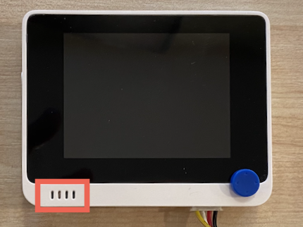

<!--
CO_OP_TRANSLATOR_METADATA:
{
  "original_hash": "93d352de36526b8990e41dd538100324",
  "translation_date": "2025-08-27T14:21:55+00:00",
  "source_file": "6-consumer/lessons/1-speech-recognition/wio-terminal-microphone.md",
  "language_code": "ne"
}
-->
# आफ्नो माइक्रोफोन र स्पिकरहरू सेटअप गर्नुहोस् - Wio Terminal

यस पाठको यस भागमा, तपाईं आफ्नो Wio Terminal मा स्पिकरहरू थप्नुहुनेछ। Wio Terminal मा पहिले नै बिल्ट-इन माइक्रोफोन छ, जसलाई आवाज रेकर्ड गर्न प्रयोग गर्न सकिन्छ।

## हार्डवेयर

Wio Terminal मा पहिले नै बिल्ट-इन माइक्रोफोन छ, जसलाई आवाज पहिचानको लागि प्रयोग गर्न सकिन्छ।

स्पिकर थप्नको लागि, तपाईं [ReSpeaker 2-Mics Pi Hat](https://www.seeedstudio.com/ReSpeaker-2-Mics-Pi-HAT.html) प्रयोग गर्न सक्नुहुन्छ। यो एउटा बाह्य बोर्ड हो जसमा २ MEMS माइक्रोफोनहरू, स्पिकर कनेक्टर, र हेडफोन सॉकेट समावेश छ।

तपाईंलाई हेडफोन, 3.5mm ज्याक भएको स्पिकर, वा JST कनेक्शन भएको स्पिकर जस्तै [Mono Enclosed Speaker - 2W 6 Ohm](https://www.seeedstudio.com/Mono-Enclosed-Speaker-2W-6-Ohm-p-2832.html) थप्न आवश्यक हुनेछ।

ReSpeaker 2-Mics Pi Hat जडान गर्नको लागि, तपाईंलाई 40 पिन-टु-पिन (पुरुष-टु-पुरुष) जम्पर केबलहरू चाहिन्छ।

> 💁 यदि तपाईं सोल्डर गर्न सहज हुनुहुन्छ भने, तपाईं [40 Pin Raspberry Pi Hat Adapter Board For Wio Terminal](https://www.seeedstudio.com/40-Pin-Raspberry-Pi-Hat-Adapter-Board-For-Wio-Terminal-p-4730.html) प्रयोग गरेर ReSpeaker जडान गर्न सक्नुहुन्छ।

तपाईंलाई अडियो डाउनलोड र प्लेब्याक गर्नको लागि SD कार्ड पनि चाहिन्छ। Wio Terminal ले १६GB सम्मको SD कार्डलाई मात्र समर्थन गर्दछ, र यी FAT32 वा exFAT रूपमा फर्म्याट गरिएको हुनुपर्छ।

### कार्य - ReSpeaker Pi Hat जडान गर्नुहोस्

1. Wio Terminal बन्द अवस्थामा राखेर, ReSpeaker 2-Mics Pi Hat लाई Wio Terminal मा जम्पर केबलहरू र GPIO सॉकेटहरू प्रयोग गरेर जडान गर्नुहोस्:

    पिनहरू यस प्रकार जडान गर्नुपर्छ:

    

1. ReSpeaker र Wio Terminal लाई GPIO सॉकेटहरू माथि फर्काएर, बायाँतर्फ राख्नुहोस्।

1. ReSpeaker को GPIO सॉकेटको माथिल्लो बायाँ सॉकेटबाट सुरु गर्नुहोस्। ReSpeaker को माथिल्लो बायाँ सॉकेटबाट Wio Terminal को माथिल्लो बायाँ सॉकेटमा पिन-टु-पिन जम्पर केबल जडान गर्नुहोस्।

1. यो प्रक्रिया GPIO सॉकेटको बायाँतर्फ तलसम्म दोहोर्याउनुहोस्। सुनिश्चित गर्नुहोस् कि पिनहरू मजबुत रूपमा जडान भएका छन्।

    

    

    > 💁 यदि तपाईंको जम्पर केबलहरू रिबनमा जडान छन् भने, तिनीहरूलाई सँगै राख्नुहोस् - यसले सबै केबलहरू सही क्रममा जडान गर्न सजिलो बनाउँछ।

1. यो प्रक्रिया ReSpeaker र Wio Terminal को दायाँ GPIO सॉकेटहरू प्रयोग गरेर दोहोर्याउनुहोस्। यी केबलहरू पहिले नै जडान भएका केबलहरूको वरिपरि जानुपर्छ।

    

    

    > 💁 यदि तपाईंको जम्पर केबलहरू रिबनमा जडान छन् भने, तिनीहरूलाई दुई रिबनमा विभाजन गर्नुहोस्। एउटा रिबनलाई पहिले जडान भएका केबलहरूको प्रत्येक पक्षमा पास गर्नुहोस्।

    > 💁 तपाईं पिनहरू ब्लकमा राख्नको लागि टेप प्रयोग गर्न सक्नुहुन्छ ताकि जडान गर्दा कुनै पनि पिन बाहिर नआओस्।
    >
    > 

1. तपाईंलाई स्पिकर थप्न आवश्यक हुनेछ।

    * यदि तपाईं JST केबल भएको स्पिकर प्रयोग गर्दै हुनुहुन्छ भने, यसलाई ReSpeaker को JST पोर्टमा जडान गर्नुहोस्।

      

    * यदि तपाईं 3.5mm ज्याक भएको स्पिकर वा हेडफोन प्रयोग गर्दै हुनुहुन्छ भने, यसलाई 3.5mm ज्याक सॉकेटमा हाल्नुहोस्।

      

### कार्य - SD कार्ड सेटअप गर्नुहोस्

1. SD कार्डलाई आफ्नो कम्प्युटरमा जडान गर्नुहोस्। यदि तपाईंको कम्प्युटरमा SD कार्ड स्लट छैन भने बाह्य रिडर प्रयोग गर्नुहोस्।

1. आफ्नो कम्प्युटरमा उपयुक्त टूल प्रयोग गरेर SD कार्डलाई फर्म्याट गर्नुहोस्। सुनिश्चित गर्नुहोस् कि FAT32 वा exFAT फाइल प्रणाली प्रयोग गरिएको छ।

1. SD कार्डलाई Wio Terminal को बायाँतर्फ पावर बटनको ठीक तल रहेको SD कार्ड स्लटमा हाल्नुहोस्। सुनिश्चित गर्नुहोस् कि कार्ड पूर्ण रूपमा भित्र छ र क्लिक गर्दछ - तपाईंलाई यसलाई पूर्ण रूपमा भित्र धकेल्न पातलो उपकरण वा अर्को SD कार्ड चाहिन सक्छ।

    

    > 💁 SD कार्डलाई बाहिर निकाल्नको लागि, तपाईंले यसलाई थोरै भित्र धकेल्नुपर्छ र यो बाहिर निस्कन्छ। तपाईंलाई यसका लागि पातलो उपकरण जस्तै फ्ल्याट-हेड स्क्रूड्राइभर वा अर्को SD कार्ड चाहिन सक्छ।

---

**अस्वीकरण**:  
यो दस्तावेज़ AI अनुवाद सेवा [Co-op Translator](https://github.com/Azure/co-op-translator) प्रयोग गरेर अनुवाद गरिएको छ। हामी शुद्धताको लागि प्रयास गर्छौं, तर कृपया ध्यान दिनुहोस् कि स्वचालित अनुवादमा त्रुटिहरू वा अशुद्धताहरू हुन सक्छ। यसको मूल भाषा मा रहेको मूल दस्तावेज़लाई आधिकारिक स्रोत मानिनुपर्छ। महत्वपूर्ण जानकारीको लागि, व्यावसायिक मानव अनुवाद सिफारिस गरिन्छ। यस अनुवादको प्रयोगबाट उत्पन्न हुने कुनै पनि गलतफहमी वा गलत व्याख्याको लागि हामी जिम्मेवार हुने छैनौं।