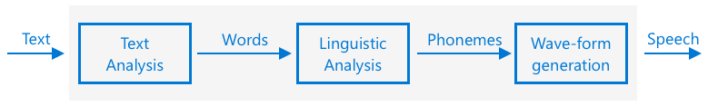

<!--
CO_OP_TRANSLATOR_METADATA:
{
  "original_hash": "b73fe10ec6b580fba2affb6f6e0a5c4d",
  "translation_date": "2025-08-27T13:48:19+00:00",
  "source_file": "6-consumer/lessons/3-spoken-feedback/README.md",
  "language_code": "ne"
}
-->
# टाइमर सेट गर्नुहोस् र बोल्ने प्रतिक्रिया प्रदान गर्नुहोस्


> स्केच नोट [नित्या नरसिंहन](https://github.com/nitya) द्वारा। ठूलो संस्करणको लागि तस्बिरमा क्लिक गर्नुहोस्।

## प्रि-लेक्चर क्विज

[प्रि-लेक्चर क्विज](https://black-meadow-040d15503.1.azurestaticapps.net/quiz/45)

## परिचय

स्मार्ट सहायकहरू एक-तर्फी सञ्चार उपकरणहरू होइनन्। तपाईं तिनीहरूसँग कुरा गर्नुहुन्छ, र तिनीहरूले प्रतिक्रिया दिन्छन्:

"एलेक्सा, ३ मिनेटको टाइमर सेट गर"

"ठीक छ, तपाईंको टाइमर ३ मिनेटको लागि सेट गरिएको छ।"

पछिल्ला २ पाठहरूमा तपाईंले सिक्नुभयो कि कसरी आवाजलाई पाठमा परिवर्तन गर्ने, त्यसपछि उक्त पाठबाट टाइमर सेट गर्ने अनुरोध निकाल्ने। यस पाठमा तपाईंले सिक्नुहुनेछ कि कसरी IoT उपकरणमा टाइमर सेट गर्ने, प्रयोगकर्तालाई बोल्ने शब्दहरूद्वारा टाइमर पुष्टि गर्दै प्रतिक्रिया दिने, र टाइमर समाप्त हुँदा तिनीहरूलाई सचेत गराउने।

यस पाठमा हामीले निम्न विषयहरू समेट्नेछौं:

* [पाठलाई आवाजमा रूपान्तरण गर्नुहोस्](../../../../../6-consumer/lessons/3-spoken-feedback)
* [टाइमर सेट गर्नुहोस्](../../../../../6-consumer/lessons/3-spoken-feedback)
* [पाठलाई आवाजमा रूपान्तरण गर्नुहोस्](../../../../../6-consumer/lessons/3-spoken-feedback)

## पाठलाई आवाजमा रूपान्तरण गर्नुहोस्

पाठलाई आवाजमा रूपान्तरण गर्नु भनेको पाठलाई बोल्ने शब्दहरूको रूपमा अडियोमा परिवर्तन गर्ने प्रक्रिया हो। यसको आधारभूत सिद्धान्त भनेको पाठका शब्दहरूलाई तिनीहरूको घटक ध्वनिहरूमा (जसलाई फोनिम भनिन्छ) तोड्नु हो, र ती ध्वनिहरूको अडियोलाई जोड्नु हो, या त पहिले रेकर्ड गरिएको अडियो प्रयोग गरेर वा AI मोडेलद्वारा उत्पन्न अडियो प्रयोग गरेर।



पाठलाई आवाजमा रूपान्तरण गर्ने प्रणालीहरू सामान्यतया ३ चरणहरूमा विभाजित हुन्छन्:

* पाठ विश्लेषण
* भाषाविज्ञान विश्लेषण
* वेभ-फर्म उत्पादन

### पाठ विश्लेषण

पाठ विश्लेषण भनेको दिइएको पाठलाई लिने र त्यसलाई बोल्न योग्य शब्दहरूमा रूपान्तरण गर्ने प्रक्रिया हो। उदाहरणका लागि, यदि तपाईं "Hello world" रूपान्तरण गर्नुहुन्छ भने कुनै पाठ विश्लेषण आवश्यक छैन, ती दुई शब्दहरूलाई सीधा आवाजमा रूपान्तरण गर्न सकिन्छ। तर यदि तपाईं "1234" रूपान्तरण गर्नुहुन्छ भने, यसलाई सन्दर्भ अनुसार "One thousand, two hundred thirty four" वा "One, two, three, four" मा रूपान्तरण गर्न आवश्यक हुन सक्छ। उदाहरणका लागि, "I have 1234 apples" भनेको "One thousand, two hundred thirty four" हुनेछ, तर "The child counted 1234" भनेको "One, two, three, four" हुनेछ।

शब्दहरू भाषा मात्र होइन, भाषा क्षेत्र अनुसार पनि फरक हुन्छन्। उदाहरणका लागि, अमेरिकी अंग्रेजीमा 120 लाई "One hundred twenty" भनिन्छ, तर ब्रिटिश अंग्रेजीमा "One hundred and twenty" भनिन्छ, जहाँ "and" प्रयोग गरिन्छ।

✅ अन्य उदाहरणहरूमा "in" लाई इन्चको छोटो रूप, र "st" लाई सन्त वा सडकको छोटो रूपको रूपमा प्रयोग गरिन्छ। तपाईंको भाषामा सन्दर्भ बिना अस्पष्ट हुने अन्य शब्दहरूको बारेमा सोच्न सक्नुहुन्छ?

शब्दहरू परिभाषित भएपछि, तिनीहरू भाषाविज्ञान विश्लेषणको लागि पठाइन्छ।

### भाषाविज्ञान विश्लेषण

भाषाविज्ञान विश्लेषणले शब्दहरूलाई फोनिममा तोड्छ। फोनिमहरू केवल अक्षरहरूमा आधारित हुँदैनन्, तर शब्दभित्रका अन्य अक्षरहरूमा पनि निर्भर हुन्छन्। उदाहरणका लागि, अंग्रेजीमा 'a' को ध्वनि 'car' र 'care' मा फरक हुन्छ। अंग्रेजी भाषामा २६ अक्षरहरूको लागि ४४ विभिन्न फोनिमहरू छन्, केही विभिन्न अक्षरहरूले साझा गरेका छन्, जस्तै 'circle' र 'serpent' को सुरुवातमा प्रयोग हुने समान फोनिम।

✅ अनुसन्धान गर्नुहोस्: तपाईंको भाषाका फोनिमहरू के हुन्?

फोनिमहरू उत्पन्न भएपछि, तिनीहरूलाई अतिरिक्त डाटा चाहिन्छ जसले स्वरको उतार-चढावलाई समर्थन गर्छ, सन्दर्भ अनुसार स्वरको टोन वा अवधि समायोजन गर्न। उदाहरणका लागि, अंग्रेजीमा स्वरको पिच बढाएर वाक्यलाई प्रश्नमा परिवर्तन गर्न सकिन्छ। अन्तिम शब्दको पिच बढ्दा प्रश्नको संकेत दिन्छ।

उदाहरणका लागि - "You have an apple" वाक्यले तपाईंसँग स्याउ छ भन्ने कुरा बताउँछ। यदि अन्तिम शब्द 'apple' को पिच बढ्छ भने, यो प्रश्न "You have an apple?" मा परिवर्तन हुन्छ, जसले तपाईंसँग स्याउ छ कि छैन भनेर सोध्छ। भाषाविज्ञान विश्लेषणले प्रश्न चिन्हको प्रयोग गरेर पिच बढाउने निर्णय गर्नुपर्छ।

फोनिमहरू उत्पन्न भएपछि, तिनीहरूलाई अडियो उत्पादन गर्न वेभ-फर्म उत्पादनको लागि पठाइन्छ।

### वेभ-फर्म उत्पादन

पहिलो इलेक्ट्रोनिक पाठलाई आवाजमा रूपान्तरण गर्ने प्रणालीहरूले प्रत्येक फोनिमको लागि एकल अडियो रेकर्डिङ प्रयोग गर्थे, जसले धेरै एकस्वर, रोबोटिक आवाजहरू उत्पादन गर्थ्यो। भाषाविज्ञान विश्लेषणले फोनिमहरू उत्पादन गर्थ्यो, ती फोनिमहरू ध्वनिको डेटाबेसबाट लोड गरिन्थ्यो र अडियो बनाउन जोडिन्थ्यो।

✅ अनुसन्धान गर्नुहोस्: प्रारम्भिक आवाज संश्लेषण प्रणालीहरूको केही अडियो रेकर्डिङहरू खोज्नुहोस्। यसलाई आधुनिक आवाज संश्लेषण, जस्तै स्मार्ट सहायकहरूमा प्रयोग हुने प्रणालीसँग तुलना गर्नुहोस्।

अधिक आधुनिक वेभ-फर्म उत्पादनले गहिरो शिक्षण (मस्तिष्कका न्यूरोनहरू जस्तै काम गर्ने धेरै ठूलो न्यूरल नेटवर्क) प्रयोग गरेर ML मोडेलहरू निर्माण गर्दछ, जसले मानव जस्तै प्राकृतिक आवाज उत्पादन गर्न सक्छ।

> 💁 यी ML मोडेलहरूलाई ट्रान्सफर लर्निङ प्रयोग गरेर वास्तविक व्यक्तिहरूको जस्तै आवाज बनाउन पुनः प्रशिक्षण गर्न सकिन्छ। यसले आवाजलाई सुरक्षा प्रणालीको रूपमा प्रयोग गर्ने विचारलाई असुरक्षित बनाउँछ, किनकि तपाईंको आवाजको केही मिनेटको रेकर्डिङले तपाईंलाई नक्कल गर्न सक्ने सम्भावना हुन्छ।

यी ठूला ML मोडेलहरूलाई तीन चरणहरूलाई एकीकृत गर्दै अन्त-देखि-अन्त आवाज संश्लेषकहरू बनाउन प्रशिक्षण दिइँदैछ।

## टाइमर सेट गर्नुहोस्

टाइमर सेट गर्न, तपाईंको IoT उपकरणले तपाईंले सिर्जना गरेको सर्वरलेस कोडको REST अन्त बिन्दुमा कल गर्नुपर्छ, त्यसपछि प्राप्त गरिएको सेकेन्डहरूको आधारमा टाइमर सेट गर्नुपर्छ।

### कार्य - सर्वरलेस फङ्सनलाई कल गरेर टाइमर समय प्राप्त गर्नुहोस्

तपाईंको IoT उपकरणबाट REST अन्त बिन्दुमा कल गरेर आवश्यक समयको लागि टाइमर सेट गर्न सम्बन्धित मार्गदर्शन अनुसरण गर्नुहोस्:

* [Arduino - Wio Terminal](wio-terminal-set-timer.md)
* [Single-board computer - Raspberry Pi/Virtual IoT device](single-board-computer-set-timer.md)

## पाठलाई आवाजमा रूपान्तरण गर्नुहोस्

तपाईंले आवाजलाई पाठमा रूपान्तरण गर्न प्रयोग गरेको उही आवाज सेवा पाठलाई पुनः आवाजमा रूपान्तरण गर्न प्रयोग गर्न सकिन्छ, र यो तपाईंको IoT उपकरणको स्पिकरमार्फत बजाउन सकिन्छ। रूपान्तरण गर्नुपर्ने पाठलाई आवाज सेवामा पठाइन्छ, अडियोको प्रकार (जस्तै नमूना दर) सहित, र अडियो समावेश गर्ने बाइनरी डाटा फिर्ता गरिन्छ।

जब तपाईं यो अनुरोध पठाउनुहुन्छ, तपाईं *Speech Synthesis Markup Language* (SSML) प्रयोग गरेर पठाउनुहुन्छ, जुन आवाज संश्लेषण अनुप्रयोगहरूको लागि XML-आधारित मार्कअप भाषा हो। यसले रूपान्तरण गर्नुपर्ने पाठ मात्र होइन, पाठको भाषा, प्रयोग गर्नुपर्ने आवाज, र केही वा सबै शब्दहरूको लागि गति, भोल्युम, र पिच पनि परिभाषित गर्न प्रयोग गर्न सकिन्छ।

उदाहरणका लागि, यो SSML ले "Your 3 minute 5 second time has been set" पाठलाई ब्रिटिश अंग्रेजी आवाज `en-GB-MiaNeural` प्रयोग गरेर आवाजमा रूपान्तरण गर्न अनुरोध परिभाषित गर्दछ।

```xml
<speak version='1.0' xml:lang='en-GB'>
    <voice xml:lang='en-GB' name='en-GB-MiaNeural'>
        Your 3 minute 5 second time has been set
    </voice>
</speak>
```

> 💁 अधिकांश पाठलाई आवाजमा रूपान्तरण गर्ने प्रणालीहरूमा विभिन्न भाषाका लागि धेरै आवाजहरू हुन्छन्, सम्बन्धित उच्चारणहरू सहित, जस्तै अंग्रेजी उच्चारण भएको ब्रिटिश अंग्रेजी आवाज र न्यूजिल्याण्ड उच्चारण भएको न्यूजिल्याण्ड अंग्रेजी आवाज।

### कार्य - पाठलाई आवाजमा रूपान्तरण गर्नुहोस्

तपाईंको IoT उपकरण प्रयोग गरेर पाठलाई आवाजमा रूपान्तरण गर्न सम्बन्धित मार्गदर्शन अनुसरण गर्नुहोस्:

* [Arduino - Wio Terminal](wio-terminal-text-to-speech.md)
* [Single-board computer - Raspberry Pi](pi-text-to-speech.md)
* [Single-board computer - Virtual device](virtual-device-text-to-speech.md)

---

## 🚀 चुनौती

SSML मा शब्दहरू कसरी बोलिन्छन् भन्ने परिवर्तन गर्ने तरिकाहरू छन्, जस्तै केही शब्दहरूमा जोड दिनु, विराम थप्नु, वा पिच परिवर्तन गर्नु। यी मध्ये केही प्रयास गर्नुहोस्, तपाईंको IoT उपकरणबाट विभिन्न SSML पठाएर उत्पादन तुलना गर्नुहोस्। SSML को बारेमा थप पढ्न सक्नुहुन्छ, जसमा शब्दहरू कसरी बोलिन्छन् भन्ने परिवर्तन गर्ने तरिकाहरू समावेश छन्, [Speech Synthesis Markup Language (SSML) Version 1.1 specification from the World Wide Web consortium](https://www.w3.org/TR/speech-synthesis11/) मा।

## पोस्ट-लेक्चर क्विज

[पोस्ट-लेक्चर क्विज](https://black-meadow-040d15503.1.azurestaticapps.net/quiz/46)

## समीक्षा र आत्म अध्ययन

* आवाज संश्लेषणको बारेमा [Wikipedia को आवाज संश्लेषण पृष्ठ](https://wikipedia.org/wiki/Speech_synthesis) मा थप पढ्नुहोस्।
* अपराधीहरूले पैसा चोर्न आवाज संश्लेषण प्रयोग गर्ने तरिकाहरूको बारेमा [BBC समाचारको 'fake voices 'help cyber crooks steal cash' कथा](https://www.bbc.com/news/technology-48908736) मा पढ्नुहोस्।
* आवाज अभिनेताहरूलाई उनीहरूको आवाजको संश्लेषित संस्करणबाट हुने जोखिमको बारेमा [Vice को 'this TikTok lawsuit is highlighting how AI is screwing over voice actors' लेख](https://www.vice.com/en/article/z3xqwj/this-tiktok-lawsuit-is-highlighting-how-ai-is-screwing-over-voice-actors) मा थप जान्नुहोस्।

## असाइनमेन्ट

[टाइमर रद्द गर्नुहोस्](assignment.md)

---

**अस्वीकरण**:  
यो दस्तावेज़ AI अनुवाद सेवा [Co-op Translator](https://github.com/Azure/co-op-translator) प्रयोग गरी अनुवाद गरिएको हो। हामी यथासम्भव सटीकता सुनिश्चित गर्न प्रयास गर्छौं, तर कृपया ध्यान दिनुहोस् कि स्वचालित अनुवादहरूमा त्रुटि वा अशुद्धता हुन सक्छ। यसको मूल भाषामा रहेको मूल दस्तावेज़लाई आधिकारिक स्रोत मानिनुपर्छ। महत्त्वपूर्ण जानकारीका लागि, व्यावसायिक मानव अनुवाद सिफारिस गरिन्छ। यस अनुवादको प्रयोगबाट उत्पन्न हुने कुनै पनि गलतफहमी वा गलत व्याख्याका लागि हामी जिम्मेवार हुने छैनौं।