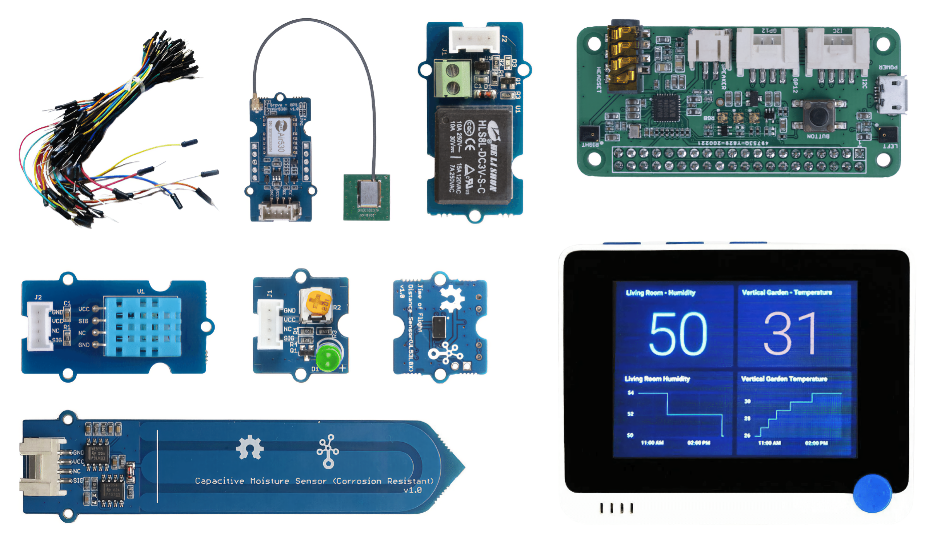

<!--
CO_OP_TRANSLATOR_METADATA:
{
  "original_hash": "3dce18fab38adf93ff30b8c221b1eec5",
  "translation_date": "2025-08-27T09:44:10+00:00",
  "source_file": "hardware.md",
  "language_code": "ne"
}
-->
# हार्डवेयर

IoT मा **T** भनेको **थिंग्स** हो, जसले हाम्रो वरपरको संसारसँग अन्तरक्रिया गर्ने उपकरणहरूलाई जनाउँछ। प्रत्येक परियोजना विद्यार्थीहरू र शौखिनहरूका लागि उपलब्ध वास्तविक हार्डवेयरमा आधारित छ। हामीसँग IoT हार्डवेयरको दुई विकल्पहरू छन्, जुन व्यक्तिगत रुचि, प्रोग्रामिङ भाषा ज्ञान वा प्राथमिकता, सिक्ने लक्ष्यहरू र उपलब्धतामा निर्भर गर्दछ। हार्डवेयरको पहुँच नभएका वा खरिद गर्नुअघि थप सिक्न चाहनेहरूका लागि 'भर्चुअल हार्डवेयर' संस्करण पनि उपलब्ध गराइएको छ।

> 💁 तपाईंलाई असाइनमेन्टहरू पूरा गर्न कुनै IoT हार्डवेयर खरिद गर्न आवश्यक छैन। तपाईं सबै कुरा भर्चुअल IoT हार्डवेयर प्रयोग गरेर गर्न सक्नुहुन्छ।

भौतिक हार्डवेयरका विकल्पहरू Arduino वा Raspberry Pi हुन्। प्रत्येक प्लेटफर्मका आफ्नै फाइदा र कमजोरीहरू छन्, जुन प्रारम्भिक पाठहरूमा समेटिएका छन्। यदि तपाईंले हार्डवेयर प्लेटफर्म छनोट गरिसक्नुभएको छैन भने, तपाईं [पहिलो परियोजनाको दोस्रो पाठ](./1-getting-started/lessons/2-deeper-dive/README.md) हेरेर कुन हार्डवेयर प्लेटफर्म सिक्न चाहनुहुन्छ भनेर निर्णय गर्न सक्नुहुन्छ।

विशेष हार्डवेयर पाठहरू र असाइनमेन्टहरूको जटिलता कम गर्न चयन गरिएको हो। अन्य हार्डवेयरले काम गर्न सक्छ, तर हामी तपाईंको उपकरणमा सबै असाइनमेन्टहरू अतिरिक्त हार्डवेयर बिना समर्थन हुने ग्यारेन्टी गर्न सक्दैनौं। उदाहरणका लागि, धेरै Arduino उपकरणहरूमा WiFi छैन, जुन क्लाउडसँग जडान गर्न आवश्यक छ - Wio टर्मिनल चयन गरिएको हो किनभने यसमा WiFi बिल्ट-इन छ।

तपाईंलाई केही गैर-प्राविधिक वस्तुहरू पनि आवश्यक पर्छ, जस्तै माटो वा गमलामा रोपिएको बिरुवा, र फलफूल वा तरकारी।

## किटहरू किन्ने

Seeed Studios ले सबै हार्डवेयरलाई सजिलै खरिद गर्न सकिने किटहरूका रूपमा उपलब्ध गराएको छ:

### Arduino - Wio टर्मिनल

**[Seeed र Microsoft सँग IoT को लागि शुरुवात - Wio टर्मिनल स्टार्टर किट](https://www.seeedstudio.com/IoT-for-beginners-with-Seeed-and-Microsoft-Wio-Terminal-Starter-Kit-p-5006.html)**

### Raspberry Pi

**[Seeed र Microsoft सँग IoT को लागि शुरुवात - Raspberry Pi 4 स्टार्टर किट](https://www.seeedstudio.com/IoT-for-beginners-with-Seeed-and-Microsoft-Raspberry-Pi-Starter-Kit-p-5004.html)**

## Arduino

Arduino को लागि सबै उपकरण कोड C++ मा छ। सबै असाइनमेन्टहरू पूरा गर्न तपाईंलाई निम्न आवश्यक हुनेछ:

### Arduino हार्डवेयर

* [Wio टर्मिनल](https://www.seeedstudio.com/Wio-Terminal-p-4509.html)
* *वैकल्पिक* - USB-C केबल वा USB-A देखि USB-C एडाप्टर। Wio टर्मिनलमा USB-C पोर्ट छ र USB-C देखि USB-A केबलसँग आउँछ। यदि तपाईंको PC वा Mac मा मात्र USB-C पोर्टहरू छन् भने तपाईंलाई USB-C केबल वा USB-A देखि USB-C एडाप्टर आवश्यक पर्छ।

### Arduino विशेष सेन्सरहरू र एक्ट्युएटरहरू

यी Wio टर्मिनल Arduino उपकरण प्रयोग गर्दा विशेष छन्, र Raspberry Pi प्रयोग गर्दा सान्दर्भिक छैनन्।

* [ArduCam Mini 2MP Plus - OV2640](https://www.arducam.com/product/arducam-2mp-spi-camera-b0067-arduino/)
* [ReSpeaker 2-Mics Pi HAT](https://www.seeedstudio.com/ReSpeaker-2-Mics-Pi-HAT.html)
* [Breadboard Jumper Wires](https://www.seeedstudio.com/Breadboard-Jumper-Wire-Pack-241mm-200mm-160mm-117m-p-234.html)
* हेडफोन वा अन्य स्पिकर 3.5mm ज्याकसहित, वा JST स्पिकर जस्तै:
  * [Mono Enclosed Speaker - 2W 6 Ohm](https://www.seeedstudio.com/Mono-Enclosed-Speaker-2W-6-Ohm-p-2832.html)
* microSD कार्ड 16GB वा कम, साथै कम्प्युटरमा SD कार्ड प्रयोग गर्न कनेक्टर। **NOTE** - Wio टर्मिनलले 16GB सम्मका SD कार्ड मात्र समर्थन गर्दछ, यसले उच्च क्षमता समर्थन गर्दैन।

## Raspberry Pi

Raspberry Pi को लागि सबै उपकरण कोड Python मा छ। सबै असाइनमेन्टहरू पूरा गर्न तपाईंलाई निम्न आवश्यक हुनेछ:

### Raspberry Pi हार्डवेयर

* [Raspberry Pi](https://www.raspberrypi.org/products/raspberry-pi-4-model-b/)
  > 💁 Pi 2B र माथिका संस्करणहरूले यी पाठहरूमा असाइनमेन्टहरू पूरा गर्न काम गर्नुपर्छ। यदि तपाईं VS Code सिधै Pi मा चलाउन योजना बनाउँदै हुनुहुन्छ भने, Pi 4 मा 2GB वा बढी RAM आवश्यक छ। यदि तपाईं Pi लाई टाढाबाट पहुँच गर्न चाहनुहुन्छ भने कुनै पनि Pi 2B र माथिका संस्करणहरूले काम गर्नेछन्।
* microSD कार्ड (Raspberry Pi किटहरूमा microSD कार्ड समावेश हुन सक्छ), साथै कम्प्युटरमा SD कार्ड प्रयोग गर्न कनेक्टर।
* USB पावर सप्लाई (Raspberry Pi 4 किटहरूमा पावर सप्लाई समावेश हुन सक्छ)। यदि तपाईं Raspberry Pi 4 प्रयोग गर्दै हुनुहुन्छ भने USB-C पावर सप्लाई आवश्यक छ, पुराना उपकरणहरूमा micro-USB पावर सप्लाई आवश्यक छ।

### Raspberry Pi विशेष सेन्सरहरू र एक्ट्युएटरहरू

यी Raspberry Pi प्रयोग गर्दा विशेष छन्, र Arduino उपकरण प्रयोग गर्दा सान्दर्भिक छैनन्।

* [Grove Pi बेस हाट](https://www.seeedstudio.com/Grove-Base-Hat-for-Raspberry-Pi.html)
* [Raspberry Pi क्यामेरा मोड्युल](https://www.raspberrypi.org/products/camera-module-v2/)
* माइक्रोफोन र स्पिकर:

  निम्नमध्ये कुनै एक प्रयोग गर्नुहोस् (वा समकक्ष):
  * कुनै पनि USB माइक्रोफोन र USB स्पिकर, वा 3.5mm ज्याक केबलसहितको स्पिकर, वा HDMI अडियो आउटपुट प्रयोग गर्नुहोस् यदि तपाईंको Raspberry Pi स्पिकर भएको मोनिटर वा TV मा जडान गरिएको छ भने।
  * बिल्ट-इन माइक्रोफोन भएको कुनै पनि USB हेडसेट
  * [ReSpeaker 2-Mics Pi HAT](https://www.seeedstudio.com/ReSpeaker-2-Mics-Pi-HAT.html) सँग
    * हेडफोन वा अन्य स्पिकर 3.5mm ज्याकसहित, वा JST स्पिकर जस्तै:
    * [Mono Enclosed Speaker - 2W 6 Ohm](https://www.seeedstudio.com/Mono-Enclosed-Speaker-2W-6-Ohm-p-2832.html)
  * [USB Speakerphone](https://www.amazon.com/USB-Speakerphone-Conference-Business-Microphones/dp/B07Q3D7F8S/ref=sr_1_1?dchild=1&keywords=m0&qid=1614647389&sr=8-1)
* [Grove Light सेन्सर](https://www.seeedstudio.com/Grove-Light-Sensor-v1-2-LS06-S-phototransistor.html)
* [Grove बटन](https://www.seeedstudio.com/Grove-Button.html)

## सेन्सरहरू र एक्ट्युएटरहरू

अधिकांश सेन्सरहरू र एक्ट्युएटरहरू Arduino र Raspberry Pi सिक्ने मार्गहरूमा प्रयोग गरिन्छ:

* [Grove LED](https://www.seeedstudio.com/Grove-LED-Pack-p-4364.html) x 2
* [Grove आर्द्रता र तापक्रम सेन्सर](https://www.seeedstudio.com/Grove-Temperature-Humidity-Sensor-DHT11.html)
* [Grove कैपेसिटिभ माटो आर्द्रता सेन्सर](https://www.seeedstudio.com/Grove-Capacitive-Moisture-Sensor-Corrosion-Resistant.html)
* [Grove रिले](https://www.seeedstudio.com/Grove-Relay.html)
* [Grove GPS (Air530)](https://www.seeedstudio.com/Grove-GPS-Air530-p-4584.html)
* [Grove टाइम अफ फ्लाइट दूरी सेन्सर](https://www.seeedstudio.com/Grove-Time-of-Flight-Distance-Sensor-VL53L0X.html)

## वैकल्पिक हार्डवेयर

स्वचालित पानी दिने पाठहरू रिले प्रयोग गरेर काम गर्छ। वैकल्पिक रूपमा, तपाईं USB द्वारा संचालित पानी पम्पलाई निम्न हार्डवेयर प्रयोग गरेर रिलेमा जडान गर्न सक्नुहुन्छ।

* [6V पानी पम्प](https://www.seeedstudio.com/6V-Mini-Water-Pump-p-1945.html)
* [USB टर्मिनल](https://www.adafruit.com/product/3628)
* सिलिकन पाइपहरू
* रातो र कालो तारहरू
* सानो फ्ल्याट-हेड स्क्रूड्राइभर

## भर्चुअल हार्डवेयर

भर्चुअल हार्डवेयर मार्गले सेन्सरहरू र एक्ट्युएटरहरूको लागि सिमुलेटरहरू प्रदान गर्नेछ, जुन Python मा कार्यान्वयन गरिएको छ। तपाईंको हार्डवेयर उपलब्धतामा निर्भर गर्दै, तपाईं यसलाई आफ्नो सामान्य विकास उपकरणमा चलाउन सक्नुहुन्छ, जस्तै Mac, PC, वा Raspberry Pi मा चलाउन सक्नुहुन्छ र तपाईंसँग नभएको हार्डवेयर मात्र सिमुलेट गर्न सक्नुहुन्छ। उदाहरणका लागि, यदि तपाईंसँग Raspberry Pi क्यामेरा छ तर Grove सेन्सरहरू छैनन् भने, तपाईं आफ्नो Pi मा भर्चुअल उपकरण कोड चलाउन सक्नुहुन्छ र Grove सेन्सरहरू सिमुलेट गर्न सक्नुहुन्छ, तर भौतिक क्यामेरा प्रयोग गर्न सक्नुहुन्छ।

भर्चुअल हार्डवेयरले [CounterFit परियोजना](https://github.com/CounterFit-IoT/CounterFit) प्रयोग गर्नेछ।

यी पाठहरू पूरा गर्न तपाईंलाई वेब क्यामेरा, माइक्रोफोन र अडियो आउटपुट जस्तै स्पिकर वा हेडफोन आवश्यक हुनेछ। यी बिल्ट-इन वा बाह्य हुन सक्छन्, र तपाईंको अपरेटिङ सिस्टमसँग काम गर्न कन्फिगर गरिएको हुनुपर्छ र सबै एप्लिकेसनहरूबाट प्रयोग गर्न उपलब्ध हुनुपर्छ।

---

**अस्वीकरण**:  
यो दस्तावेज़ AI अनुवाद सेवा [Co-op Translator](https://github.com/Azure/co-op-translator) प्रयोग गरेर अनुवाद गरिएको छ। हामी शुद्धताको लागि प्रयास गर्छौं, तर कृपया ध्यान दिनुहोस् कि स्वचालित अनुवादमा त्रुटिहरू वा अशुद्धताहरू हुन सक्छ। यसको मूल भाषामा रहेको मूल दस्तावेज़लाई आधिकारिक स्रोत मानिनुपर्छ। महत्वपूर्ण जानकारीको लागि, व्यावसायिक मानव अनुवाद सिफारिस गरिन्छ। यस अनुवादको प्रयोगबाट उत्पन्न हुने कुनै पनि गलतफहमी वा गलत व्याख्याको लागि हामी जिम्मेवार हुने छैनौं।