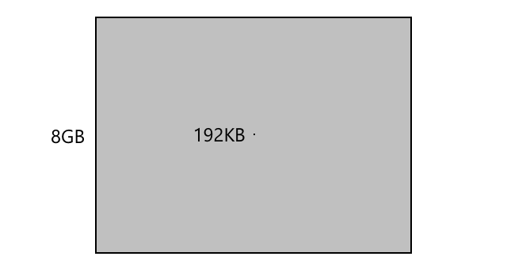

<!--
CO_OP_TRANSLATOR_METADATA:
{
  "original_hash": "9dd7f645ad1c6f20b72fee512987f772",
  "translation_date": "2025-08-27T22:09:19+00:00",
  "source_file": "1-getting-started/lessons/2-deeper-dive/README.md",
  "language_code": "nl"
}
-->
# Een diepere duik in IoT

> Sketchnote door [Nitya Narasimhan](https://github.com/nitya). Klik op de afbeelding voor een grotere versie.

Deze les werd gegeven als onderdeel van de [Hello IoT-serie](https://youtube.com/playlist?list=PLmsFUfdnGr3xRts0TIwyaHyQuHaNQcb6-) van de [Microsoft Reactor](https://developer.microsoft.com/reactor/?WT.mc_id=academic-17441-jabenn). De les bestond uit twee video's: een les van 1 uur en een kantooruur van 1 uur waarin dieper werd ingegaan op onderdelen van de les en vragen werden beantwoord.

> 🎥 Klik op de afbeeldingen hierboven om de video's te bekijken

## Quiz voorafgaand aan de les

[Quiz voorafgaand aan de les](https://black-meadow-040d15503.1.azurestaticapps.net/quiz/3)

## Introductie

Deze les gaat dieper in op enkele van de concepten die in de vorige les zijn behandeld.

In deze les behandelen we:

* [Componenten van een IoT-toepassing](../../../../../1-getting-started/lessons/2-deeper-dive)
* [Dieper ingaan op microcontrollers](../../../../../1-getting-started/lessons/2-deeper-dive)
* [Dieper ingaan op single-board computers](../../../../../1-getting-started/lessons/2-deeper-dive)

## Componenten van een IoT-toepassing

De twee componenten van een IoT-toepassing zijn het *Internet* en het *ding*. Laten we deze twee componenten in meer detail bekijken.

### Het Ding

Het **Ding**-gedeelte van IoT verwijst naar een apparaat dat kan communiceren met de fysieke wereld. Deze apparaten zijn meestal kleine, betaalbare computers die op lage snelheid werken en weinig energie verbruiken - bijvoorbeeld eenvoudige microcontrollers met kilobytes RAM (in tegenstelling tot gigabytes in een pc) die slechts enkele honderden megahertz draaien (in tegenstelling tot gigahertz in een pc), maar soms zo weinig energie verbruiken dat ze weken, maanden of zelfs jaren op batterijen kunnen werken.

Deze apparaten communiceren met de fysieke wereld, hetzij door sensoren te gebruiken om gegevens uit hun omgeving te verzamelen, hetzij door outputs of actuatoren te bedienen om fysieke veranderingen te veroorzaken. Een typisch voorbeeld hiervan is een slimme thermostaat - een apparaat met een temperatuursensor, een manier om een gewenste temperatuur in te stellen, zoals een draaiknop of touchscreen, en een verbinding met een verwarmings- of koelsysteem dat kan worden ingeschakeld wanneer de gedetecteerde temperatuur buiten het gewenste bereik ligt. De temperatuursensor detecteert dat de kamer te koud is en een actuator schakelt de verwarming in.

Er zijn een enorme hoeveelheid verschillende dingen die als IoT-apparaten kunnen fungeren, van speciale hardware die één ding detecteert tot algemene apparaten, zelfs je smartphone! Een smartphone kan sensoren gebruiken om de wereld om zich heen te detecteren en actuatoren om met de wereld te communiceren - bijvoorbeeld door een GPS-sensor te gebruiken om je locatie te bepalen en een luidspreker om je navigatie-instructies naar een bestemming te geven.

✅ Denk aan andere systemen om je heen die gegevens van een sensor lezen en deze gebruiken om beslissingen te nemen. Een voorbeeld zou de thermostaat van een oven kunnen zijn. Kun je er meer vinden?

### Het Internet

Het **Internet**-gedeelte van een IoT-toepassing bestaat uit toepassingen waarmee het IoT-apparaat verbinding kan maken om gegevens te verzenden en ontvangen, evenals andere toepassingen die de gegevens van het IoT-apparaat kunnen verwerken en helpen beslissingen te nemen over welke verzoeken naar de actuatoren van het IoT-apparaat moeten worden gestuurd.

Een typische opstelling zou een soort cloudservice zijn waarmee het IoT-apparaat verbinding maakt, en deze cloudservice behandelt zaken zoals beveiliging, evenals het ontvangen van berichten van het IoT-apparaat en het verzenden van berichten terug naar het apparaat. Deze cloudservice zou vervolgens verbinding maken met andere toepassingen die sensorgegevens kunnen verwerken of opslaan, of de sensorgegevens kunnen gebruiken in combinatie met gegevens van andere systemen om beslissingen te nemen.

Apparaten maken ook niet altijd rechtstreeks verbinding met het internet via WiFi of bekabelde verbindingen. Sommige apparaten gebruiken mesh-netwerken om met elkaar te communiceren via technologieën zoals Bluetooth, waarbij ze verbinding maken via een hub-apparaat dat een internetverbinding heeft.

In het voorbeeld van een slimme thermostaat zou de thermostaat verbinding maken via thuis-WiFi met een cloudservice die in de cloud draait. Het zou de temperatuurgegevens naar deze cloudservice sturen, en van daaruit worden ze geschreven naar een soort database, zodat de huiseigenaar de huidige en eerdere temperaturen kan controleren via een telefoon-app. Een andere service in de cloud zou weten welke temperatuur de huiseigenaar wil en berichten terugsturen naar het IoT-apparaat via de cloudservice om het verwarmingssysteem aan of uit te zetten.

Een nog slimmer versie zou AI in de cloud kunnen gebruiken met gegevens van andere sensoren die zijn verbonden met andere IoT-apparaten, zoals bezettingssensoren die detecteren welke kamers in gebruik zijn, evenals gegevens zoals het weer en zelfs je agenda, om beslissingen te nemen over hoe de temperatuur op een slimme manier in te stellen. Bijvoorbeeld, het zou je verwarming kunnen uitschakelen als het uit je agenda leest dat je op vakantie bent, of de verwarming kamer per kamer uitschakelen afhankelijk van welke kamers je gebruikt, waarbij het leert van de gegevens om steeds nauwkeuriger te worden.

✅ Welke andere gegevens zouden kunnen helpen om een internetverbonden thermostaat slimmer te maken?

### IoT aan de rand

Hoewel de I in IoT staat voor Internet, hoeven deze apparaten niet altijd verbinding te maken met het internet. In sommige gevallen kunnen apparaten verbinding maken met 'edge'-apparaten - gateway-apparaten die op je lokale netwerk draaien, zodat je gegevens kunt verwerken zonder een oproep via het internet te doen. Dit kan sneller zijn wanneer je veel gegevens hebt of een trage internetverbinding, het stelt je in staat offline te werken waar internetconnectiviteit niet mogelijk is, zoals op een schip of in een rampgebied bij het reageren op een humanitaire crisis, en het stelt je in staat om gegevens privé te houden. Sommige apparaten bevatten verwerkingscode die is gemaakt met cloudtools en draaien deze lokaal om gegevens te verzamelen en te reageren zonder een internetverbinding te gebruiken om een beslissing te nemen.

Een voorbeeld hiervan is een slim thuisapparaat zoals een Apple HomePod, Amazon Alexa of Google Home, dat je stem gebruikt met AI-modellen die in de cloud zijn getraind, maar lokaal op het apparaat draaien. Deze apparaten worden 'wakker' wanneer een bepaald woord of een bepaalde zin wordt uitgesproken, en sturen je spraak alleen dan via het internet voor verwerking. Het apparaat stopt met het verzenden van spraak op een geschikt moment, zoals wanneer het een pauze in je spraak detecteert. Alles wat je zegt voordat je het apparaat wakker maakt met het wake-woord, en alles wat je zegt nadat het apparaat is gestopt met luisteren, wordt niet via het internet naar de apparaatprovider gestuurd en blijft dus privé.

✅ Denk aan andere scenario's waarin privacy belangrijk is, zodat gegevensverwerking beter aan de rand kan worden gedaan in plaats van in de cloud. Als hint - denk aan IoT-apparaten met camera's of andere beeldapparaten erop.

### IoT-beveiliging

Bij elke internetverbinding is beveiliging een belangrijke overweging. Er is een oude grap dat 'de S in IoT staat voor Security' - er is geen 'S' in IoT, wat impliceert dat het niet veilig is.

IoT-apparaten maken verbinding met een cloudservice en zijn daarom alleen zo veilig als die cloudservice - als je cloudservice toestaat dat elk apparaat verbinding maakt, kan er kwaadaardige data worden verzonden of kunnen virusaanvallen plaatsvinden. Dit kan zeer reële gevolgen hebben, aangezien IoT-apparaten communiceren en andere apparaten bedienen. Bijvoorbeeld, de [Stuxnet-worm](https://wikipedia.org/wiki/Stuxnet) manipuleerde kleppen in centrifuges om ze te beschadigen. Hackers hebben ook misbruik gemaakt van [slechte beveiliging om toegang te krijgen tot babyfoons](https://www.npr.org/sections/thetwo-way/2018/06/05/617196788/s-c-mom-says-baby-monitor-was-hacked-experts-say-many-devices-are-vulnerable) en andere thuisbewakingsapparaten.

> 💁 Soms draaien IoT-apparaten en edge-apparaten op een netwerk dat volledig geïsoleerd is van het internet om de gegevens privé en veilig te houden. Dit staat bekend als [air-gapping](https://wikipedia.org/wiki/Air_gap_(networking)).

## Dieper ingaan op microcontrollers

In de vorige les hebben we microcontrollers geïntroduceerd. Laten we nu dieper op ze ingaan.

### CPU

De CPU is het 'brein' van de microcontroller. Het is de processor die je code uitvoert en gegevens kan verzenden naar en ontvangen van aangesloten apparaten. CPU's kunnen één of meer cores bevatten - in wezen één of meer CPU's die samen kunnen werken om je code uit te voeren.

CPU's vertrouwen op een klok die vele miljoenen of miljarden keren per seconde tikt. Elke tik, of cyclus, synchroniseert de acties die de CPU kan uitvoeren. Bij elke tik kan de CPU een instructie uit een programma uitvoeren, zoals gegevens ophalen van een extern apparaat of een wiskundige berekening uitvoeren. Deze regelmatige cyclus zorgt ervoor dat alle acties worden voltooid voordat de volgende instructie wordt verwerkt.

Hoe sneller de klokcyclus, hoe meer instructies per seconde kunnen worden verwerkt, en dus hoe sneller de CPU. CPU-snelheden worden gemeten in [Hertz (Hz)](https://wikipedia.org/wiki/Hertz), een standaard eenheid waarbij 1 Hz één cyclus of kloktik per seconde betekent.

> 🎓 CPU-snelheden worden vaak gegeven in MHz of GHz. 1MHz is 1 miljoen Hz, 1GHz is 1 miljard Hz.

> 💁 CPU's voeren programma's uit met behulp van de [fetch-decode-execute cyclus](https://wikipedia.org/wiki/Instruction_cycle). Voor elke kloktik haalt de CPU de volgende instructie uit het geheugen, decodeert deze en voert deze uit, zoals het gebruik van een rekenkundige logische eenheid (ALU) om 2 getallen op te tellen. Sommige uitvoeringen nemen meerdere tikken in beslag, dus de volgende cyclus wordt uitgevoerd bij de volgende tik nadat de instructie is voltooid.

Microcontrollers hebben veel lagere kloksnelheden dan desktop- of laptopcomputers, of zelfs de meeste smartphones. De Wio Terminal heeft bijvoorbeeld een CPU die draait op 120MHz of 120.000.000 cycli per seconde.

✅ Een gemiddelde pc of Mac heeft een CPU met meerdere cores die draaien op meerdere gigahertz, wat betekent dat de klok miljarden keren per seconde tikt. Onderzoek de kloksnelheid van je computer en vergelijk hoe vaak sneller deze is dan de Wio Terminal.

Elke klokcyclus verbruikt energie en genereert warmte. Hoe sneller de tikken, hoe meer energie wordt verbruikt en hoe meer warmte wordt gegenereerd. Pc's hebben koellichamen en ventilatoren om warmte af te voeren, zonder welke ze binnen enkele seconden zouden oververhitten en uitschakelen. Microcontrollers hebben vaak geen van beide, omdat ze veel koeler draaien en daarom veel langzamer. Pc's werken op netstroom of grote batterijen voor een paar uur, microcontrollers kunnen dagen, maanden of zelfs jaren werken op kleine batterijen. Microcontrollers kunnen ook cores hebben die op verschillende snelheden draaien, waarbij ze overschakelen naar langzamere, energiezuinige cores wanneer de vraag naar de CPU laag is om het energieverbruik te verminderen.

> 💁 Sommige pc's en Macs nemen dezelfde mix van snelle, krachtige cores en langzamere, energiezuinige cores over, waarbij ze schakelen om batterij te besparen. Bijvoorbeeld, de M1-chip in de nieuwste Apple-laptops kan schakelen tussen 4 prestatiecores en 4 efficiëntiecores om de batterijduur of snelheid te optimaliseren, afhankelijk van de taak die wordt uitgevoerd.

✅ Doe een beetje onderzoek: Lees meer over CPU's in het [Wikipedia-artikel over CPU's](https://wikipedia.org/wiki/Central_processing_unit)

#### Taak

Onderzoek de Wio Terminal.

Als je een Wio Terminal gebruikt voor deze lessen, probeer dan de CPU te vinden. Zoek het *Hardware Overzicht*-gedeelte van de [Wio Terminal productpagina](https://www.seeedstudio.com/Wio-Terminal-p-4509.html) voor een afbeelding van de interne onderdelen, en probeer de CPU te vinden door het doorzichtige plastic venster aan de achterkant.

### Geheugen

Microcontrollers hebben meestal twee soorten geheugen: programmageheugen en random-access geheugen (RAM).

Programmageheugen is niet-vluchtig, wat betekent dat alles wat erin wordt geschreven blijft bestaan wanneer er geen stroom naar het apparaat is. Dit is het geheugen dat je programmecode opslaat.

RAM is het geheugen dat door het programma wordt gebruikt om te draaien, met daarin variabelen die door je programma zijn toegewezen en gegevens die zijn verzameld van randapparatuur. RAM is vluchtig; wanneer de stroom uitvalt, gaan de inhoud verloren, wat in feite je programma reset.
> 🎓 Programmageheugen slaat je code op en blijft behouden wanneer er geen stroom is.
🎓 RAM wordt gebruikt om je programma uit te voeren en wordt gereset wanneer er geen stroom is

Net als bij de CPU is het geheugen op een microcontroller vele malen kleiner dan dat van een PC of Mac. Een typische PC heeft bijvoorbeeld 8 Gigabyte (GB) RAM, of 8.000.000.000 bytes, waarbij elke byte genoeg ruimte biedt om een enkele letter of een getal van 0-255 op te slaan. Een microcontroller heeft daarentegen slechts Kilobytes (KB) RAM, waarbij een kilobyte 1.000 bytes is. De hierboven genoemde Wio Terminal heeft 192KB RAM, of 192.000 bytes - meer dan 40.000 keer minder dan een gemiddelde PC!

Het diagram hieronder toont het relatieve verschil in grootte tussen 192KB en 8GB - de kleine stip in het midden vertegenwoordigt 192KB.

De opslagruimte voor programma's is ook kleiner dan die van een PC. Een typische PC heeft bijvoorbeeld een harde schijf van 500GB voor programma-opslag, terwijl een microcontroller slechts kilobytes of misschien een paar megabytes (MB) opslagruimte heeft (1MB is 1.000KB, of 1.000.000 bytes). De Wio Terminal heeft 4MB aan programma-opslag.

✅ Doe een beetje onderzoek: Hoeveel RAM en opslagruimte heeft de computer die je gebruikt om dit te lezen? Hoe verhoudt dit zich tot een microcontroller?

### Input/Output

Microcontrollers hebben input- en outputverbindingen (I/O) nodig om gegevens van sensoren te lezen en besturingssignalen naar actuatoren te sturen. Ze bevatten meestal een aantal algemene input/output (GPIO)-pinnen. Deze pinnen kunnen in software worden geconfigureerd als input (dat wil zeggen dat ze een signaal ontvangen) of output (ze sturen een signaal).

🧠⬅️ Input-pinnen worden gebruikt om waarden van sensoren te lezen

🧠➡️ Output-pinnen sturen instructies naar actuatoren

✅ Je leert hier meer over in een volgende les.

#### Taak

Onderzoek de Wio Terminal.

Als je een Wio Terminal gebruikt voor deze lessen, zoek dan de GPIO-pinnen. Zoek de sectie *Pinout diagram* op de [Wio Terminal productpagina](https://www.seeedstudio.com/Wio-Terminal-p-4509.html) om te leren welke pinnen welke functies hebben. De Wio Terminal wordt geleverd met een sticker die je op de achterkant kunt plakken met pinnummers, dus voeg deze nu toe als je dat nog niet hebt gedaan.

### Fysieke grootte

Microcontrollers zijn meestal klein van formaat, waarbij de kleinste, een [Freescale Kinetis KL03 MCU klein genoeg is om in de kuiltje van een golfbal te passen](https://www.edn.com/tiny-arm-cortex-m0-based-mcu-shrinks-package/). Alleen de CPU in een PC kan 40mm x 40mm meten, en dat is exclusief de koellichamen en ventilatoren die nodig zijn om ervoor te zorgen dat de CPU langer dan een paar seconden kan draaien zonder oververhit te raken, aanzienlijk groter dan een complete microcontroller. De Wio Terminal ontwikkelaarskit met een microcontroller, behuizing, scherm en een reeks verbindingen en componenten is niet veel groter dan een kale Intel i9 CPU, en aanzienlijk kleiner dan de CPU met een koellichaam en ventilator!

| Apparaat                        | Grootte               |
| ------------------------------- | --------------------- |
| Freescale Kinetis KL03          | 1,6mm x 2mm x 1mm     |
| Wio Terminal                    | 72mm x 57mm x 12mm    |
| Intel i9 CPU, koellichaam en ventilator | 136mm x 145mm x 103mm |

### Frameworks en besturingssystemen

Vanwege hun lage snelheid en geheugengrootte draaien microcontrollers geen besturingssysteem (OS) in de desktopzin van het woord. Het besturingssysteem dat je computer laat draaien (Windows, Linux of macOS) heeft veel geheugen en verwerkingskracht nodig om taken uit te voeren die volledig overbodig zijn voor een microcontroller. Onthoud dat microcontrollers meestal worden geprogrammeerd om één of meer zeer specifieke taken uit te voeren, in tegenstelling tot een algemene computer zoals een PC of Mac die een gebruikersinterface moet ondersteunen, muziek of films moet afspelen, tools moet bieden om documenten of code te schrijven, games moet spelen of op het internet moet surfen.

Om een microcontroller zonder OS te programmeren, heb je wel wat tooling nodig om je code op een manier te bouwen die de microcontroller kan uitvoeren, met behulp van API's die kunnen communiceren met eventuele randapparatuur. Elke microcontroller is anders, dus fabrikanten ondersteunen normaal gesproken standaardframeworks waarmee je een standaard 'recept' kunt volgen om je code te bouwen en deze te laten draaien op elke microcontroller die dat framework ondersteunt.

Je kunt microcontrollers programmeren met een OS - vaak aangeduid als een real-time besturingssysteem (RTOS), omdat deze zijn ontworpen om gegevens in realtime naar en van randapparatuur te verzenden. Deze besturingssystemen zijn zeer lichtgewicht en bieden functies zoals:

* Multithreading, waarmee je code meer dan één blok code tegelijk kan uitvoeren, hetzij op meerdere cores of door om de beurt op één core te draaien
* Netwerken om veilig te communiceren via het internet
* Grafische gebruikersinterface (GUI)-componenten voor het bouwen van gebruikersinterfaces (UI) op apparaten met schermen.

✅ Lees meer over verschillende RTOS'en: [Azure RTOS](https://azure.microsoft.com/services/rtos/?WT.mc_id=academic-17441-jabenn), [FreeRTOS](https://www.freertos.org), [Zephyr](https://www.zephyrproject.org)

#### Arduino

[Arduino](https://www.arduino.cc) is waarschijnlijk het meest populaire microcontrollerframework, vooral onder studenten, hobbyisten en makers. Arduino is een open source elektronica-platform dat software en hardware combineert. Je kunt Arduino-compatibele boards kopen van Arduino zelf of van andere fabrikanten, en vervolgens coderen met behulp van het Arduino-framework.

Arduino-boards worden gecodeerd in C of C++. Het gebruik van C/C++ zorgt ervoor dat je code zeer klein kan worden gecompileerd en snel kan draaien, iets wat nodig is op een beperkt apparaat zoals een microcontroller. De kern van een Arduino-applicatie wordt een sketch genoemd en is C/C++-code met 2 functies - `setup` en `loop`. Wanneer het board opstart, zal de Arduino-frameworkcode de `setup`-functie één keer uitvoeren, en vervolgens de `loop`-functie keer op keer uitvoeren, continu totdat de stroom wordt uitgeschakeld.

Je zou je setup-code in de `setup`-functie schrijven, zoals verbinding maken met WiFi en clouddiensten of pinnen initialiseren voor input en output. Je loop-code zou vervolgens verwerkingscode bevatten, zoals het lezen van een sensor en het verzenden van de waarde naar de cloud. Je zou normaal gesproken een vertraging toevoegen aan elke loop, bijvoorbeeld als je alleen sensorgegevens wilt verzenden om de 10 seconden, zou je een vertraging van 10 seconden toevoegen aan het einde van de loop zodat de microcontroller kan slapen, energie bespaart, en vervolgens de loop opnieuw uitvoert wanneer nodig 10 seconden later.

✅ Deze programmastructuur staat bekend als een *event loop* of *message loop*. Veel applicaties gebruiken dit onder de motorkap en het is de standaard voor de meeste desktopapplicaties die draaien op besturingssystemen zoals Windows, macOS of Linux. De `loop` luistert naar berichten van gebruikersinterfacecomponenten zoals knoppen, of apparaten zoals het toetsenbord, en reageert daarop. Je kunt meer lezen in dit [artikel over de event loop](https://wikipedia.org/wiki/Event_loop).

Arduino biedt standaardbibliotheken voor interactie met microcontrollers en de I/O-pinnen, met verschillende implementaties onder de motorkap om te draaien op verschillende microcontrollers. Bijvoorbeeld, de [`delay`-functie](https://www.arduino.cc/reference/en/language/functions/time/delay/) pauzeert het programma voor een bepaalde periode, de [`digitalRead`-functie](https://www.arduino.cc/reference/en/language/functions/digital-io/digitalread/) leest een waarde van `HIGH` of `LOW` van de opgegeven pin, ongeacht op welk board de code wordt uitgevoerd. Deze standaardbibliotheken betekenen dat Arduino-code geschreven voor één board opnieuw kan worden gecompileerd voor elk ander Arduino-board en zal draaien, ervan uitgaande dat de pinnen hetzelfde zijn en de boards dezelfde functies ondersteunen.

Er is een groot ecosysteem van externe Arduino-bibliotheken waarmee je extra functies kunt toevoegen aan je Arduino-projecten, zoals het gebruik van sensoren en actuatoren of het verbinden met cloud IoT-diensten.

##### Taak

Onderzoek de Wio Terminal.

Als je een Wio Terminal gebruikt voor deze lessen, lees dan opnieuw de code die je in de vorige les hebt geschreven. Zoek de `setup`- en `loop`-functie. Monitor de seriële output om te zien dat de loop-functie herhaaldelijk wordt aangeroepen. Probeer code toe te voegen aan de `setup`-functie om naar de seriële poort te schrijven en observeer dat deze code slechts één keer wordt aangeroepen telkens wanneer je opnieuw opstart. Probeer je apparaat opnieuw op te starten met de aan/uit-schakelaar aan de zijkant om te laten zien dat dit elke keer wordt aangeroepen wanneer het apparaat opnieuw opstart.

## Dieper duiken in single-board computers

In de vorige les hebben we single-board computers geïntroduceerd. Laten we nu dieper ingaan op deze apparaten.

### Raspberry Pi

De [Raspberry Pi Foundation](https://www.raspberrypi.org) is een liefdadigheidsinstelling uit het Verenigd Koninkrijk, opgericht in 2009 om de studie van informatica te bevorderen, vooral op schoolniveau. Als onderdeel van deze missie ontwikkelden ze een single-board computer, genaamd de Raspberry Pi. Raspberry Pi's zijn momenteel beschikbaar in 3 varianten - een volledige versie, de kleinere Pi Zero, en een compute module die kan worden ingebouwd in je uiteindelijke IoT-apparaat.

De nieuwste versie van de volledige Raspberry Pi is de Raspberry Pi 4B. Deze heeft een quad-core (4 core) CPU die draait op 1,5GHz, 2, 4 of 8GB RAM, gigabit ethernet, WiFi, 2 HDMI-poorten die 4k-schermen ondersteunen, een audio- en composiet video-uitgangspoort, USB-poorten (2 USB 2.0, 2 USB 3.0), 40 GPIO-pinnen, een camera-aansluiting voor een Raspberry Pi-camera module, en een SD-kaartsleuf. Dit alles op een board van 88mm x 58mm x 19,5mm en wordt gevoed door een 3A USB-C-voeding. Deze beginnen bij US$35, veel goedkoper dan een PC of Mac.

> 💁 Er is ook een Pi400 alles-in-één computer met een Pi4 ingebouwd in een toetsenbord.

De Pi Zero is veel kleiner, met een lager vermogen. Hij heeft een single-core 1GHz CPU, 512MB RAM, WiFi (in het Zero W-model), een enkele HDMI-poort, een micro-USB-poort, 40 GPIO-pinnen, een camera-aansluiting voor een Raspberry Pi-camera module, en een SD-kaartsleuf. Hij meet 65mm x 30mm x 5mm en verbruikt zeer weinig stroom. De Zero kost US$5, met de W-versie met WiFi US$10.

> 🎓 De CPU's in beide apparaten zijn ARM-processors, in tegenstelling tot de Intel/AMD x86 of x64-processors die je vindt in de meeste PC's en Macs. Deze zijn vergelijkbaar met de CPU's die je vindt in sommige microcontrollers, evenals bijna alle mobiele telefoons, de Microsoft Surface X, en de nieuwe Apple Silicon-gebaseerde Apple Macs.

Alle varianten van de Raspberry Pi draaien een versie van Debian Linux genaamd Raspberry Pi OS. Dit is beschikbaar als een lite-versie zonder desktop, wat perfect is voor 'headless'-projecten waarbij je geen scherm nodig hebt, of een volledige versie met een volledige desktopomgeving, inclusief webbrowser, kantoorapplicaties, programmeertools en games. Omdat het OS een versie van Debian Linux is, kun je elke applicatie of tool installeren die op Debian draait en is gebouwd voor de ARM-processor in de Pi.

#### Taak

Onderzoek de Raspberry Pi.

Als je een Raspberry Pi gebruikt voor deze lessen, lees dan meer over de verschillende hardwarecomponenten op het board.

* Je kunt details vinden over de processors die worden gebruikt op de [Raspberry Pi hardware documentatiepagina](https://www.raspberrypi.org/documentation/hardware/raspberrypi/). Lees meer over de processor die wordt gebruikt in de Pi die je gebruikt.
* Lokaliseer de GPIO-pinnen. Lees meer over deze pinnen in de [Raspberry Pi GPIO documentatie](https://www.raspberrypi.org/documentation/hardware/raspberrypi/gpio/README.md). Gebruik de [GPIO Pin Usage guide](https://www.raspberrypi.org/documentation/usage/gpio/README.md) om de verschillende pinnen op je Pi te identificeren.

### Programmeren van single-board computers

Single-board computers zijn volledige computers die een volledig OS draaien. Dit betekent dat er een breed scala aan programmeertalen, frameworks en tools beschikbaar is om ze te programmeren, in tegenstelling tot microcontrollers die afhankelijk zijn van ondersteuning voor het board in frameworks zoals Arduino. De meeste programmeertalen hebben bibliotheken die toegang bieden tot de GPIO-pinnen om gegevens te verzenden en ontvangen van sensoren en actuatoren.

✅ Welke programmeertalen ken je? Worden ze ondersteund op Linux?

De meest gebruikte programmeertaal voor het bouwen van IoT-toepassingen op een Raspberry Pi is Python. Er is een enorm ecosysteem van hardware ontworpen voor de Pi, en bijna al deze hardware bevat de relevante code die nodig is om ze te gebruiken als Python-bibliotheken. Sommige van deze ecosystemen zijn gebaseerd op 'hats' - zo genoemd omdat ze bovenop de Pi zitten als een hoed en verbinding maken met een grote socket naar de 40 GPIO-pinnen. Deze hats bieden extra mogelijkheden, zoals schermen, sensoren, op afstand bestuurbare auto's, of adapters om sensoren met gestandaardiseerde kabels aan te sluiten.
### Gebruik van single-board computers in professionele IoT-implementaties

Single-board computers worden gebruikt voor professionele IoT-implementaties, niet alleen als ontwikkelkits. Ze kunnen een krachtige manier bieden om hardware te besturen en complexe taken uit te voeren, zoals het draaien van machine learning-modellen. Zo is er bijvoorbeeld een [Raspberry Pi 4 compute module](https://www.raspberrypi.org/blog/raspberry-pi-compute-module-4/) die alle kracht van een Raspberry Pi 4 biedt, maar in een compactere en goedkopere vorm zonder de meeste poorten, ontworpen om in aangepaste hardware te worden geïnstalleerd.

---

## 🚀 Uitdaging

De uitdaging in de vorige les was om zoveel mogelijk IoT-apparaten op te sommen die zich in je huis, school of werkplek bevinden. Denk je dat elk apparaat in deze lijst is gebouwd rond microcontrollers, single-board computers, of zelfs een combinatie van beide?

## Quiz na de les

[Quiz na de les](https://black-meadow-040d15503.1.azurestaticapps.net/quiz/4)

## Herziening & Zelfstudie

* Lees de [Arduino beginnersgids](https://www.arduino.cc/en/Guide/Introduction) om meer te begrijpen over het Arduino-platform.  
* Lees de [introductie tot de Raspberry Pi 4](https://www.raspberrypi.org/products/raspberry-pi-4-model-b/) om meer te leren over Raspberry Pis.  
* Leer meer over enkele concepten en acroniemen in het artikel [What the FAQ are CPUs, MPUs, MCUs, and GPUs in de Electrical Engineering Journal](https://www.eejournal.com/article/what-the-faq-are-cpus-mpus-mcus-and-gpus/).  

✅ Gebruik deze gidsen, samen met de kosten die worden getoond via de links in de [hardwaregids](../../../hardware.md), om te beslissen welk hardwareplatform je wilt gebruiken, of dat je liever een virtueel apparaat gebruikt.

## Opdracht

[Vergelijk en contrasteer microcontrollers en single-board computers](assignment.md)

---

**Disclaimer**:  
Dit document is vertaald met behulp van de AI-vertalingsservice [Co-op Translator](https://github.com/Azure/co-op-translator). Hoewel we streven naar nauwkeurigheid, dient u zich ervan bewust te zijn dat geautomatiseerde vertalingen fouten of onnauwkeurigheden kunnen bevatten. Het originele document in zijn oorspronkelijke taal moet worden beschouwd als de gezaghebbende bron. Voor cruciale informatie wordt professionele menselijke vertaling aanbevolen. Wij zijn niet aansprakelijk voor eventuele misverstanden of verkeerde interpretaties die voortvloeien uit het gebruik van deze vertaling.