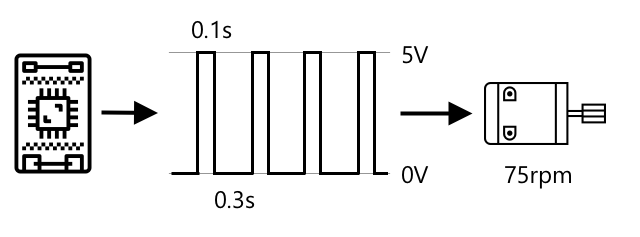

<!--
CO_OP_TRANSLATOR_METADATA:
{
  "original_hash": "e9ee00eb5fc55922a73762acc542166b",
  "translation_date": "2025-08-27T21:50:31+00:00",
  "source_file": "1-getting-started/lessons/3-sensors-and-actuators/README.md",
  "language_code": "nl"
}
-->
# Interactie met de fysieke wereld met sensoren en actuatoren


> Sketchnote door [Nitya Narasimhan](https://github.com/nitya). Klik op de afbeelding voor een grotere versie.

Deze les werd gegeven als onderdeel van de [Hello IoT-serie](https://youtube.com/playlist?list=PLmsFUfdnGr3xRts0TIwyaHyQuHaNQcb6-) van de [Microsoft Reactor](https://developer.microsoft.com/reactor/?WT.mc_id=academic-17441-jabenn). De les bestond uit twee video's: een les van 1 uur en een vragenuurtje van 1 uur waarin dieper werd ingegaan op onderdelen van de les en vragen werden beantwoord.

[](https://youtu.be/Lqalu1v6aF4)

[](https://youtu.be/qR3ekcMlLWA)

> 🎥 Klik op de afbeeldingen hierboven om de video's te bekijken

## Quiz voorafgaand aan de les

[Quiz voorafgaand aan de les](https://black-meadow-040d15503.1.azurestaticapps.net/quiz/5)

## Introductie

Deze les introduceert twee belangrijke concepten voor je IoT-apparaat: sensoren en actuatoren. Je gaat praktisch aan de slag met beide, door een lichtsensor toe te voegen aan je IoT-project en vervolgens een LED te gebruiken die wordt aangestuurd door lichtniveaus, waarmee je effectief een nachtlampje bouwt.

In deze les behandelen we:

* [Wat zijn sensoren?](../../../../../1-getting-started/lessons/3-sensors-and-actuators)
* [Een sensor gebruiken](../../../../../1-getting-started/lessons/3-sensors-and-actuators)
* [Soorten sensoren](../../../../../1-getting-started/lessons/3-sensors-and-actuators)
* [Wat zijn actuatoren?](../../../../../1-getting-started/lessons/3-sensors-and-actuators)
* [Een actuator gebruiken](../../../../../1-getting-started/lessons/3-sensors-and-actuators)
* [Soorten actuatoren](../../../../../1-getting-started/lessons/3-sensors-and-actuators)

## Wat zijn sensoren?

Sensoren zijn hardwareapparaten die de fysieke wereld waarnemen - ze meten één of meer eigenschappen om hen heen en sturen de informatie naar een IoT-apparaat. Sensoren omvatten een enorme reeks apparaten, omdat er zoveel dingen kunnen worden gemeten, van natuurlijke eigenschappen zoals luchttemperatuur tot fysieke interacties zoals beweging.

Enkele veelvoorkomende sensoren zijn:

* Temperatuursensoren - deze meten de luchttemperatuur of de temperatuur van wat ze ondergedompeld zijn. Voor hobbyisten en ontwikkelaars worden deze vaak gecombineerd met luchtdruk en luchtvochtigheid in één sensor.
* Knoppen - deze detecteren wanneer ze zijn ingedrukt.
* Lichtsensoren - deze detecteren lichtniveaus en kunnen specifiek zijn voor kleuren, UV-licht, IR-licht of algemeen zichtbaar licht.
* Camera's - deze nemen een visuele weergave van de wereld waar door een foto te maken of video te streamen.
* Versnellingsmeters - deze meten beweging in meerdere richtingen.
* Microfoons - deze detecteren geluid, ofwel algemene geluidsniveaus of gericht geluid.

✅ Doe wat onderzoek. Welke sensoren heeft jouw telefoon?

Alle sensoren hebben één ding gemeen: ze zetten wat ze waarnemen om in een elektrisch signaal dat kan worden geïnterpreteerd door een IoT-apparaat. Hoe dit elektrische signaal wordt geïnterpreteerd, hangt af van de sensor en het communicatieprotocol dat wordt gebruikt om met het IoT-apparaat te communiceren.

## Een sensor gebruiken

Volg de relevante handleiding hieronder om een sensor toe te voegen aan je IoT-apparaat:

* [Arduino - Wio Terminal](wio-terminal-sensor.md)
* [Single-board computer - Raspberry Pi](pi-sensor.md)
* [Single-board computer - Virtueel apparaat](virtual-device-sensor.md)

## Soorten sensoren

Sensoren zijn ofwel analoog of digitaal.

### Analoge sensoren

Sommige van de meest eenvoudige sensoren zijn analoge sensoren. Deze sensoren ontvangen een spanning van het IoT-apparaat, de sensorcomponenten passen deze spanning aan, en de spanning die wordt teruggestuurd door de sensor wordt gemeten om de sensorwaarde te bepalen.

> 🎓 Spanning is een maat voor hoeveel kracht er is om elektriciteit van de ene plaats naar de andere te verplaatsen, zoals van de positieve pool van een batterij naar de negatieve pool. Bijvoorbeeld, een standaard AA-batterij is 1,5V (V is het symbool voor volt) en kan elektriciteit met een kracht van 1,5V van zijn positieve pool naar zijn negatieve pool duwen. Verschillende elektrische hardware vereist verschillende spanningen om te werken, bijvoorbeeld, een LED kan licht geven met tussen 2-3V, maar een 100W gloeilamp zou 240V nodig hebben. Je kunt meer lezen over spanning op de [Wikipedia-pagina over spanning](https://wikipedia.org/wiki/Voltage).

Een voorbeeld hiervan is een potentiometer. Dit is een draaiknop die je kunt draaien tussen twee posities en de sensor meet de rotatie.


Het IoT-apparaat stuurt een elektrisch signaal naar de potentiometer met een spanning, bijvoorbeeld 5 volt (5V). Naarmate de potentiometer wordt aangepast, verandert de spanning die aan de andere kant uitkomt. Stel je voor dat je een potentiometer hebt die is gelabeld als een draaiknop die gaat van 0 tot [11](https://wikipedia.org/wiki/Up_to_eleven), zoals een volumeknop op een versterker. Wanneer de potentiometer in de volledig uit-positie (0) staat, komt er 0V (0 volt) uit. Wanneer deze in de volledig aan-positie (11) staat, komt er 5V (5 volt) uit.

> 🎓 Dit is een vereenvoudiging, en je kunt meer lezen over potentiometers en variabele weerstanden op de [Wikipedia-pagina over potentiometers](https://wikipedia.org/wiki/Potentiometer).

De spanning die uit de sensor komt, wordt vervolgens gelezen door het IoT-apparaat, en het apparaat kan hierop reageren. Afhankelijk van de sensor kan deze spanning een willekeurige waarde zijn of overeenkomen met een standaard eenheid. Bijvoorbeeld, een analoge temperatuursensor gebaseerd op een [thermistor](https://wikipedia.org/wiki/Thermistor) verandert zijn weerstand afhankelijk van de temperatuur. De uitgangsspanning kan vervolgens worden omgezet naar een temperatuur in Kelvin, en overeenkomstig naar °C of °F, door berekeningen in code.

✅ Wat denk je dat er gebeurt als de sensor een hogere spanning terugstuurt dan werd verzonden (bijvoorbeeld afkomstig van een externe stroombron)? ⛔️ TEST DIT NIET UIT.

#### Analoge naar digitale conversie

IoT-apparaten zijn digitaal - ze kunnen niet werken met analoge waarden, ze werken alleen met 0's en 1's. Dit betekent dat analoge sensorwaarden moeten worden omgezet naar een digitaal signaal voordat ze kunnen worden verwerkt. Veel IoT-apparaten hebben analoog-naar-digitaal converters (ADC's) om analoge inputs om te zetten naar digitale representaties van hun waarde. Sensoren kunnen ook werken met ADC's via een connectorbord. Bijvoorbeeld, in het Seeed Grove-ecosysteem met een Raspberry Pi, verbinden analoge sensoren met specifieke poorten op een 'hat' die op de Pi zit en verbonden is met de GPIO-pinnen van de Pi, en deze hat heeft een ADC om de spanning om te zetten in een digitaal signaal dat kan worden verzonden via de GPIO-pinnen van de Pi.

Stel je voor dat je een analoge lichtsensor hebt die is verbonden met een IoT-apparaat dat 3,3V gebruikt en een waarde van 1V terugstuurt. Deze 1V betekent niets in de digitale wereld, dus moet worden omgezet. De spanning wordt omgezet naar een analoge waarde met behulp van een schaal afhankelijk van het apparaat en de sensor. Een voorbeeld is de Seeed Grove-lichtsensor die waarden van 0 tot 1.023 retourneert. Voor deze sensor die werkt op 3,3V, zou een uitgang van 1V een waarde van 300 zijn. Een IoT-apparaat kan niet omgaan met 300 als een analoge waarde, dus de waarde zou worden omgezet naar `0000000100101100`, de binaire representatie van 300 door de Grove-hat. Dit zou vervolgens worden verwerkt door het IoT-apparaat.

✅ Als je geen kennis hebt van binaire getallen, doe dan wat onderzoek om te leren hoe getallen worden weergegeven door 0's en 1's. De [BBC Bitesize introductie tot binaire les](https://www.bbc.co.uk/bitesize/guides/zwsbwmn/revision/1) is een geweldige plek om te beginnen.

Vanuit een programmeerperspectief wordt dit meestal afgehandeld door bibliotheken die bij de sensoren worden geleverd, dus je hoeft je geen zorgen te maken over deze conversie zelf. Voor de Grove-lichtsensor zou je de Python-bibliotheek gebruiken en de `light`-eigenschap aanroepen, of de Arduino-bibliotheek gebruiken en `analogRead` aanroepen om een waarde van 300 te krijgen.

### Digitale sensoren

Digitale sensoren, net als analoge sensoren, detecteren de wereld om hen heen door veranderingen in elektrische spanning. Het verschil is dat ze een digitaal signaal uitsturen, ofwel door slechts twee toestanden te meten of door gebruik te maken van een ingebouwde ADC. Digitale sensoren worden steeds vaker gebruikt om de noodzaak van een ADC in een connectorbord of op het IoT-apparaat zelf te vermijden.

De eenvoudigste digitale sensor is een knop of schakelaar. Dit is een sensor met twee toestanden, aan of uit.


Pinnen op IoT-apparaten zoals GPIO-pinnen kunnen dit signaal direct meten als een 0 of 1. Als de spanning die wordt verzonden hetzelfde is als de spanning die wordt teruggestuurd, wordt de waarde gelezen als 1, anders wordt de waarde gelezen als 0. Er is geen noodzaak om het signaal te converteren, het kan alleen 1 of 0 zijn.

> 💁 Spanningen zijn nooit exact, vooral omdat de componenten in een sensor enige weerstand hebben, dus er is meestal een tolerantie. Bijvoorbeeld, de GPIO-pinnen op een Raspberry Pi werken op 3,3V en lezen een retourspanning boven 1,8V als een 1, onder 1,8V als een 0.

* 3,3V gaat naar de knop. De knop is uit, dus 0V komt eruit, wat een waarde van 0 geeft.
* 3,3V gaat naar de knop. De knop is aan, dus 3,3V komt eruit, wat een waarde van 1 geeft.

Meer geavanceerde digitale sensoren lezen analoge waarden en zetten deze vervolgens om met ingebouwde ADC's naar digitale signalen. Bijvoorbeeld, een digitale temperatuursensor zal nog steeds een thermokoppel gebruiken op dezelfde manier als een analoge sensor, en zal nog steeds de verandering in spanning meten die wordt veroorzaakt door de weerstand van het thermokoppel bij de huidige temperatuur. In plaats van een analoge waarde terug te sturen en te vertrouwen op het apparaat of connectorbord om deze om te zetten naar een digitaal signaal, zal een ADC ingebouwd in de sensor de waarde omzetten en deze als een reeks 0's en 1's naar het IoT-apparaat sturen. Deze 0's en 1's worden op dezelfde manier verzonden als het digitale signaal voor een knop, waarbij 1 volledige spanning is en 0 0V.


Het verzenden van digitale gegevens stelt sensoren in staat om complexer te worden en meer gedetailleerde gegevens te verzenden, zelfs versleutelde gegevens voor beveiligde sensoren. Een voorbeeld hiervan is een camera. Dit is een sensor die een afbeelding vastlegt en deze verzendt als digitale gegevens die die afbeelding bevatten, meestal in een gecomprimeerd formaat zoals JPEG, om te worden gelezen door het IoT-apparaat. Het kan zelfs video streamen door afbeeldingen vast te leggen en ofwel het volledige beeld frame voor frame te verzenden of een gecomprimeerde videostream.

## Wat zijn actuatoren?

Actuatoren zijn het tegenovergestelde van sensoren - ze zetten een elektrisch signaal van je IoT-apparaat om in een interactie met de fysieke wereld, zoals het uitzenden van licht of geluid, of het bewegen van een motor.

Enkele veelvoorkomende actuatoren zijn:

* LED - deze zenden licht uit wanneer ze worden ingeschakeld.
* Speaker - deze zenden geluid uit op basis van het signaal dat naar hen wordt gestuurd, van een eenvoudige zoemer tot een audiospeaker die muziek kan afspelen.
* Stappenmotor - deze zet een signaal om in een bepaalde hoeveelheid rotatie, zoals het draaien van een knop met 90°.
* Relais - dit zijn schakelaars die kunnen worden in- of uitgeschakeld door een elektrisch signaal. Ze maken het mogelijk dat een kleine spanning van een IoT-apparaat grotere spanningen inschakelt.
* Schermen - dit zijn meer complexe actuatoren en tonen informatie op een multi-segment display. Schermen variëren van eenvoudige LED-displays tot high-definition videomonitors.

✅ Doe wat onderzoek. Welke actuatoren heeft jouw telefoon?

## Een actuator gebruiken

Volg de relevante handleiding hieronder om een actuator toe te voegen aan je IoT-apparaat, aangestuurd door de sensor, om een IoT-nachtlampje te bouwen. Het zal lichtniveaus verzamelen van de lichtsensor en een actuator in de vorm van een LED gebruiken om licht uit te zenden wanneer het gedetecteerde lichtniveau te laag is.


* [Arduino - Wio Terminal](wio-terminal-actuator.md)
* [Single-board computer - Raspberry Pi](pi-actuator.md)
* [Single-board computer - Virtueel apparaat](virtual-device-actuator.md)

## Soorten actuatoren

Net als sensoren zijn actuatoren ofwel analoog of digitaal.

### Analoge actuatoren

Analoge actuatoren nemen een analoog signaal en zetten dit om in een soort interactie, waarbij de interactie verandert afhankelijk van de spanning die wordt geleverd.

Een voorbeeld hiervan is een dimbaar licht, zoals de lampen die je misschien in huis hebt. De hoeveelheid spanning die aan het licht wordt geleverd, bepaalt hoe helder het is.


Net als bij sensoren werken IoT-apparaten met digitale signalen, niet met analoge. Dit betekent dat om een analoog signaal te verzenden, het IoT-apparaat een digitaal-naar-analoog converter (DAC) nodig heeft, ofwel direct op het IoT-apparaat, of op een aansluitbord. Dit converteert de 0'en en 1'en van het IoT-apparaat naar een analoge spanning die de actuator kan gebruiken.

✅ Wat denk je dat er gebeurt als het IoT-apparaat een hogere spanning verzendt dan de actuator aankan?  
⛔️ TEST DIT NIET UIT.

#### Pulsbreedtemodulatie

Een andere optie om digitale signalen van een IoT-apparaat om te zetten naar een analoog signaal is pulsbreedtemodulatie. Dit houdt in dat er veel korte digitale pulsen worden verzonden die zich gedragen alsof het een analoog signaal is.

Bijvoorbeeld, je kunt PWM gebruiken om de snelheid van een motor te regelen.

Stel je voor dat je een motor bestuurt met een 5V voeding. Je stuurt een korte puls naar je motor, waarbij de spanning hoog wordt gezet (5V) gedurende twee honderdsten van een seconde (0,02s). In die tijd kan je motor een tiende van een rotatie maken, of 36°. Het signaal pauzeert vervolgens gedurende twee honderdsten van een seconde (0,02s), waarbij een laag signaal (0V) wordt verzonden. Elke cyclus van aan en uit duurt 0,04s. De cyclus herhaalt zich vervolgens.


Dit betekent dat je in één seconde 25 pulsen van 5V hebt van 0,02s die de motor laten draaien, elk gevolgd door een pauze van 0,02s van 0V waarbij de motor niet draait. Elke puls draait de motor een tiende van een rotatie, wat betekent dat de motor 2,5 rotaties per seconde voltooit. Je hebt een digitaal signaal gebruikt om de motor te laten draaien met 2,5 rotaties per seconde, of 150 [omwentelingen per minuut](https://wikipedia.org/wiki/Revolutions_per_minute) (een niet-standaard maat voor rotatiesnelheid).

```output
25 pulses per second x 0.1 rotations per pulse = 2.5 rotations per second
2.5 rotations per second x 60 seconds in a minute = 150rpm
```

> 🎓 Wanneer een PWM-signaal de helft van de tijd aan is en de helft van de tijd uit, wordt dit een [50% duty cycle](https://wikipedia.org/wiki/Duty_cycle) genoemd. Duty cycles worden gemeten als het percentage tijd dat het signaal in de aan-stand is vergeleken met de uit-stand.



Je kunt de motorsnelheid veranderen door de grootte van de pulsen te wijzigen. Bijvoorbeeld, met dezelfde motor kun je dezelfde cyclustijd van 0,04s behouden, waarbij de aan-puls wordt gehalveerd tot 0,01s en de uit-puls toeneemt tot 0,03s. Je hebt hetzelfde aantal pulsen per seconde (25), maar elke aan-puls is de helft zo lang. Een halve lengte puls draait de motor slechts een twintigste van een rotatie, en bij 25 pulsen per seconde voltooit de motor 1,25 rotaties per seconde of 75rpm. Door de pulsduur van een digitaal signaal te veranderen, heb je de snelheid van een analoge motor gehalveerd.

```output
25 pulses per second x 0.05 rotations per pulse = 1.25 rotations per second
1.25 rotations per second x 60 seconds in a minute = 75rpm
```

✅ Hoe zou je de motorrotatie soepel houden, vooral bij lage snelheden? Zou je een klein aantal lange pulsen met lange pauzes gebruiken of veel zeer korte pulsen met zeer korte pauzes?

> 💁 Sommige sensoren gebruiken ook PWM om analoge signalen om te zetten naar digitale signalen.

> 🎓 Je kunt meer lezen over pulsbreedtemodulatie op de [pulsbreedtemodulatie pagina op Wikipedia](https://wikipedia.org/wiki/Pulse-width_modulation).

### Digitale actuatoren

Digitale actuatoren, net als digitale sensoren, hebben ofwel twee toestanden die worden bestuurd door een hoge of lage spanning, of hebben een ingebouwde DAC zodat ze een digitaal signaal naar een analoog signaal kunnen omzetten.

Een eenvoudige digitale actuator is een LED. Wanneer een apparaat een digitaal signaal van 1 verzendt, wordt een hoge spanning verzonden die de LED laat oplichten. Wanneer een digitaal signaal van 0 wordt verzonden, daalt de spanning naar 0V en gaat de LED uit.


✅ Welke andere eenvoudige 2-toestandsactuatoren kun je bedenken? Een voorbeeld is een solenoïde, een elektromagneet die kan worden geactiveerd om dingen te doen zoals een deurgrendel verplaatsen om een deur te vergrendelen/ontgrendelen.

Meer geavanceerde digitale actuatoren, zoals schermen, vereisen dat de digitale gegevens in bepaalde formaten worden verzonden. Ze worden meestal geleverd met bibliotheken die het gemakkelijker maken om de juiste gegevens te verzenden om ze te besturen.

---

## 🚀 Uitdaging

De uitdaging in de laatste twee lessen was om zoveel mogelijk IoT-apparaten op te sommen die zich in je huis, school of werkplek bevinden en te bepalen of ze zijn gebouwd rond microcontrollers of single-board computers, of zelfs een mix van beide.

Voor elk apparaat dat je hebt opgesomd, welke sensoren en actuatoren zijn eraan gekoppeld? Wat is het doel van elke sensor en actuator die aan deze apparaten is gekoppeld?

## Quiz na de les

[Quiz na de les](https://black-meadow-040d15503.1.azurestaticapps.net/quiz/6)

## Review & Zelfstudie

* Lees meer over elektriciteit en circuits op [ThingLearn](http://thinglearn.jenlooper.com/curriculum/).  
* Lees over de verschillende soorten temperatuursensoren in de [Seeed Studios Temperature Sensors guide](https://www.seeedstudio.com/blog/2019/10/14/temperature-sensors-for-arduino-projects/)  
* Lees over LEDs op de [Wikipedia LED pagina](https://wikipedia.org/wiki/Light-emitting_diode)  

## Opdracht

[Onderzoek sensoren en actuatoren](assignment.md)

---

**Disclaimer**:  
Dit document is vertaald met behulp van de AI-vertalingsservice [Co-op Translator](https://github.com/Azure/co-op-translator). Hoewel we streven naar nauwkeurigheid, dient u zich ervan bewust te zijn dat geautomatiseerde vertalingen fouten of onnauwkeurigheden kunnen bevatten. Het originele document in zijn oorspronkelijke taal moet worden beschouwd als de gezaghebbende bron. Voor cruciale informatie wordt professionele menselijke vertaling aanbevolen. Wij zijn niet aansprakelijk voor eventuele misverstanden of verkeerde interpretaties die voortvloeien uit het gebruik van deze vertaling.