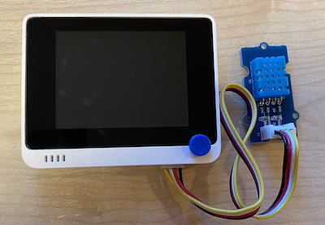

<!--
CO_OP_TRANSLATOR_METADATA:
{
  "original_hash": "59263d094f20b302053888cd236880c3",
  "translation_date": "2025-08-27T21:05:25+00:00",
  "source_file": "2-farm/lessons/1-predict-plant-growth/wio-terminal-temp.md",
  "language_code": "nl"
}
-->
# Meet temperatuur - Wio Terminal

In dit deel van de les voeg je een temperatuursensor toe aan je Wio Terminal en lees je temperatuurwaarden ervan af.

## Hardware

De Wio Terminal heeft een temperatuursensor nodig.

De sensor die je gaat gebruiken is een [DHT11 luchtvochtigheid- en temperatuursensor](https://www.seeedstudio.com/Grove-Temperature-Humidity-Sensor-DHT11.html), die twee sensoren in één pakket combineert. Deze sensor is vrij populair en er zijn verschillende commercieel beschikbare sensoren die temperatuur, luchtvochtigheid en soms luchtdruk combineren. Het temperatuurcomponent van de sensor is een negatieve temperatuurcoëfficiënt (NTC) thermistor, een thermistor waarbij de weerstand afneemt naarmate de temperatuur stijgt.

Dit is een digitale sensor en heeft een ingebouwde ADC om een digitaal signaal te creëren dat de temperatuur- en luchtvochtigheidsgegevens bevat die door de microcontroller kunnen worden gelezen.

### Verbind de temperatuursensor

De Grove temperatuursensor kan worden aangesloten op de digitale poort van de Wio Terminal.

#### Taak - verbind de temperatuursensor

Verbind de temperatuursensor.


1. Steek één uiteinde van een Grove-kabel in de aansluiting op de luchtvochtigheid- en temperatuursensor. De kabel past maar op één manier.

1. Terwijl de Wio Terminal niet is aangesloten op je computer of een andere stroombron, verbind je het andere uiteinde van de Grove-kabel met de rechter Grove-aansluiting op de Wio Terminal, zoals je naar het scherm kijkt. Dit is de aansluiting die het verst van de aan/uit-knop verwijderd is.



## Programmeer de temperatuursensor

De Wio Terminal kan nu worden geprogrammeerd om de aangesloten temperatuursensor te gebruiken.

### Taak - programmeer de temperatuursensor

Programmeur het apparaat.

1. Maak een gloednieuw Wio Terminal-project met PlatformIO. Noem dit project `temperature-sensor`. Voeg code toe in de `setup`-functie om de seriële poort te configureren.

    > ⚠️ Je kunt [de instructies voor het maken van een PlatformIO-project in project 1, les 1 indien nodig](../../../1-getting-started/lessons/1-introduction-to-iot/wio-terminal.md#create-a-platformio-project) raadplegen.

1. Voeg een bibliotheekafhankelijkheid toe voor de Seeed Grove luchtvochtigheid- en temperatuursensorbibliotheek aan het `platformio.ini`-bestand van het project:

    ```ini
    lib_deps =
        seeed-studio/Grove Temperature And Humidity Sensor @ 1.0.1
    ```

    > ⚠️ Je kunt [de instructies voor het toevoegen van bibliotheken aan een PlatformIO-project in project 1, les 4 indien nodig](../../../1-getting-started/lessons/4-connect-internet/wio-terminal-mqtt.md#install-the-wifi-and-mqtt-arduino-libraries) raadplegen.

1. Voeg de volgende `#include`-directives toe aan de bovenkant van het bestand, onder de bestaande `#include <Arduino.h>`:

    ```cpp
    #include <DHT.h>
    #include <SPI.h>
    ```

    Hiermee worden bestanden geïmporteerd die nodig zijn om met de sensor te communiceren. Het `DHT.h`-headerbestand bevat de code voor de sensor zelf, en het toevoegen van de `SPI.h`-header zorgt ervoor dat de code die nodig is om met de sensor te communiceren wordt gekoppeld wanneer de app wordt gecompileerd.

1. Verklaar de DHT-sensor vóór de `setup`-functie:

    ```cpp
    DHT dht(D0, DHT11);
    ```

    Hiermee wordt een instantie van de `DHT`-klasse gedeclareerd die de **D**igitale **H**umidity en **T**emperature sensor beheert. Deze is verbonden met poort `D0`, de rechter Grove-aansluiting op de Wio Terminal. De tweede parameter geeft aan dat de sensor die wordt gebruikt de *DHT11* sensor is - de bibliotheek die je gebruikt ondersteunt andere varianten van deze sensor.

1. Voeg in de `setup`-functie code toe om de seriële verbinding in te stellen:

    ```cpp
    void setup()
    {
        Serial.begin(9600);
    
        while (!Serial)
            ; // Wait for Serial to be ready
    
        delay(1000);
    }
    ```

1. Voeg aan het einde van de `setup`-functie, na de laatste `delay`, een oproep toe om de DHT-sensor te starten:

    ```cpp
    dht.begin();
    ```

1. Voeg in de `loop`-functie code toe om de sensor aan te roepen en de temperatuur naar de seriële poort te printen:

    ```cpp
    void loop()
    {
        float temp_hum_val[2] = {0};
        dht.readTempAndHumidity(temp_hum_val);
        Serial.print("Temperature: ");
        Serial.print(temp_hum_val[1]);
        Serial.println ("°C");
    
        delay(10000);
    }
    ```

    Deze code declareert een lege array van 2 floats en geeft deze door aan de oproep `readTempAndHumidity` op de `DHT`-instantie. Deze oproep vult de array met 2 waarden - de luchtvochtigheid komt in het 0e item van de array (onthoud dat arrays in C++ 0-gebaseerd zijn, dus het 0e item is het 'eerste' item in de array), en de temperatuur komt in het 1e item.

    De temperatuur wordt gelezen uit het 1e item van de array en naar de seriële poort geprint.

    > 🇺🇸 De temperatuur wordt gelezen in Celsius. Voor Amerikanen: om dit om te zetten naar Fahrenheit, deel je de Celsius-waarde door 5, vermenigvuldig je met 9 en tel je er 32 bij op. Bijvoorbeeld, een temperatuurmeting van 20°C wordt ((20/5)*9) + 32 = 68°F.

1. Bouw en upload de code naar de Wio Terminal.

    > ⚠️ Je kunt [de instructies voor het maken van een PlatformIO-project in project 1, les 1 indien nodig](../../../1-getting-started/lessons/1-introduction-to-iot/wio-terminal.md#write-the-hello-world-app) raadplegen.

1. Zodra de code is geüpload, kun je de temperatuur monitoren met de seriële monitor:

    ```output
    > Executing task: platformio device monitor <
    
    --- Available filters and text transformations: colorize, debug, default, direct, hexlify, log2file, nocontrol, printable, send_on_enter, time
    --- More details at http://bit.ly/pio-monitor-filters
    --- Miniterm on /dev/cu.usbmodem1201  9600,8,N,1 ---
    --- Quit: Ctrl+C | Menu: Ctrl+T | Help: Ctrl+T followed by Ctrl+H ---
    Temperature: 25.00°C
    Temperature: 25.00°C
    Temperature: 25.00°C
    Temperature: 24.00°C
    ```

> 💁 Je kunt deze code vinden in de [code-temperature/wio-terminal](../../../../../2-farm/lessons/1-predict-plant-growth/code-temperature/wio-terminal) map.

😀 Je programma voor de temperatuursensor is een succes!

---

**Disclaimer**:  
Dit document is vertaald met behulp van de AI-vertalingsservice [Co-op Translator](https://github.com/Azure/co-op-translator). Hoewel we streven naar nauwkeurigheid, dient u zich ervan bewust te zijn dat geautomatiseerde vertalingen fouten of onnauwkeurigheden kunnen bevatten. Het originele document in de oorspronkelijke taal moet worden beschouwd als de gezaghebbende bron. Voor cruciale informatie wordt professionele menselijke vertaling aanbevolen. Wij zijn niet aansprakelijk voor eventuele misverstanden of verkeerde interpretaties die voortvloeien uit het gebruik van deze vertaling.