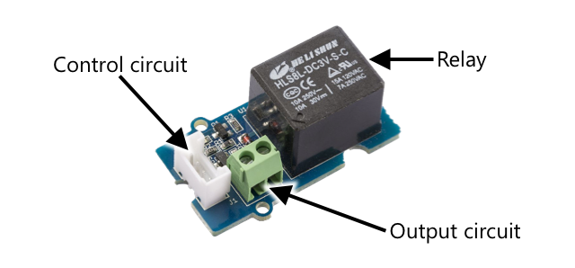

<!--
CO_OP_TRANSLATOR_METADATA:
{
  "original_hash": "f7bb24ba53fb627ddb38a8b24a05e594",
  "translation_date": "2025-08-27T21:09:55+00:00",
  "source_file": "2-farm/lessons/3-automated-plant-watering/README.md",
  "language_code": "nl"
}
-->
# Geautomatiseerd planten water geven


> Schetsnotitie door [Nitya Narasimhan](https://github.com/nitya). Klik op de afbeelding voor een grotere versie.

Deze les werd gegeven als onderdeel van de [IoT for Beginners Project 2 - Digital Agriculture serie](https://youtube.com/playlist?list=PLmsFUfdnGr3yCutmcVg6eAUEfsGiFXgcx) van de [Microsoft Reactor](https://developer.microsoft.com/reactor/?WT.mc_id=academic-17441-jabenn).

[](https://youtu.be/g9FfZwv9R58)

## Quiz voorafgaand aan de les

[Quiz voorafgaand aan de les](https://black-meadow-040d15503.1.azurestaticapps.net/quiz/13)

## Introductie

In de vorige les heb je geleerd hoe je bodemvocht kunt monitoren. In deze les leer je hoe je de kerncomponenten van een geautomatiseerd bewateringssysteem bouwt dat reageert op bodemvocht. Je leert ook over timing - hoe sensoren tijd nodig hebben om te reageren op veranderingen, en hoe actuatoren tijd nodig hebben om de eigenschappen te veranderen die door sensoren worden gemeten.

In deze les behandelen we:

* [Hogere vermogensapparaten aansturen met een laagvermogen IoT-apparaat](../../../../../2-farm/lessons/3-automated-plant-watering)
* [Een relais aansturen](../../../../../2-farm/lessons/3-automated-plant-watering)
* [Je plant aansturen via MQTT](../../../../../2-farm/lessons/3-automated-plant-watering)
* [Timing van sensoren en actuatoren](../../../../../2-farm/lessons/3-automated-plant-watering)
* [Timing toevoegen aan je plantbesturingsserver](../../../../../2-farm/lessons/3-automated-plant-watering)

## Hogere vermogensapparaten aansturen met een laagvermogen IoT-apparaat

IoT-apparaten gebruiken een lage spanning. Hoewel dit voldoende is voor sensoren en laagvermogen actuatoren zoals LED's, is dit te laag om grotere hardware aan te sturen, zoals een waterpomp voor irrigatie. Zelfs kleine pompen die je voor kamerplanten zou kunnen gebruiken, trekken te veel stroom voor een IoT-ontwikkelkit en zouden de printplaat beschadigen.

> 🎓 Stroom, gemeten in Ampère (A), is de hoeveelheid elektriciteit die door een circuit stroomt. Spanning zorgt voor de aandrijving, stroom is hoeveel er wordt aangedreven. Je kunt meer lezen over stroom op de [pagina over elektrische stroom op Wikipedia](https://wikipedia.org/wiki/Electric_current).

De oplossing hiervoor is een pomp die is aangesloten op een externe stroomvoorziening, en een actuator die de pomp aanzet, vergelijkbaar met hoe je een lichtschakelaar gebruikt. Het kost een kleine hoeveelheid energie (in de vorm van energie in je lichaam) om met je vinger een schakelaar om te zetten, en dit verbindt het licht met netstroom van 110v/240v.


> 🎓 [Netstroom](https://wikipedia.org/wiki/Mains_electricity) verwijst naar de elektriciteit die via nationale infrastructuur wordt geleverd aan huizen en bedrijven in veel delen van de wereld.

✅ IoT-apparaten kunnen meestal 3,3V of 5V leveren, met minder dan 1 ampère (1A) stroom. Vergelijk dit met netstroom, die meestal 230V is (120V in Noord-Amerika en 100V in Japan), en stroom kan leveren voor apparaten die 30A trekken.

Er zijn verschillende actuatoren die dit kunnen doen, waaronder mechanische apparaten die je aan bestaande schakelaars kunt bevestigen en die een vingerbeweging nabootsen. De meest populaire is een relais.

### Relais

Een relais is een elektromechanische schakelaar die een elektrisch signaal omzet in een mechanische beweging die een schakelaar aanzet. De kern van een relais is een elektromagneet.

> 🎓 [Elektromagneten](https://wikipedia.org/wiki/Electromagnet) zijn magneten die worden gecreëerd door elektriciteit door een spoel van draad te laten lopen. Wanneer de elektriciteit wordt ingeschakeld, wordt de spoel magnetisch. Wanneer de elektriciteit wordt uitgeschakeld, verliest de spoel zijn magnetisme.


In een relais voedt een besturingscircuit de elektromagneet. Wanneer de elektromagneet is ingeschakeld, trekt deze een hendel aan die een schakelaar beweegt, waardoor een paar contacten worden gesloten en een uitgangscircuit wordt voltooid.


Wanneer het besturingscircuit is uitgeschakeld, schakelt de elektromagneet uit, waardoor de hendel wordt losgelaten en de contacten worden geopend, waardoor het uitgangscircuit wordt uitgeschakeld. Relais zijn digitale actuatoren - een hoog signaal naar het relais schakelt het in, een laag signaal schakelt het uit.

Het uitgangscircuit kan worden gebruikt om extra hardware van stroom te voorzien, zoals een irrigatiesysteem. Het IoT-apparaat kan het relais inschakelen, waardoor het uitgangscircuit dat het irrigatiesysteem van stroom voorziet wordt voltooid, en de planten worden bewaterd. Het IoT-apparaat kan vervolgens het relais uitschakelen, waardoor de stroom naar het irrigatiesysteem wordt onderbroken en het water wordt uitgeschakeld.


In de bovenstaande video wordt een relais ingeschakeld. Een LED op het relais licht op om aan te geven dat het is ingeschakeld (sommige relaisborden hebben LED's om aan te geven of het relais aan of uit is), en stroom wordt naar de pomp gestuurd, waardoor deze wordt ingeschakeld en water naar een plant pompt.

> 💁 Relais kunnen ook worden gebruikt om te schakelen tussen twee uitgangscircuits in plaats van één in- of uit te schakelen. Terwijl de hendel beweegt, verplaatst deze een schakelaar van het voltooien van één uitgangscircuit naar het voltooien van een ander uitgangscircuit, meestal met een gemeenschappelijke stroom- of aardingsverbinding.

✅ Doe wat onderzoek: Er zijn meerdere soorten relais, met verschillen zoals of het besturingscircuit het relais in- of uitschakelt wanneer stroom wordt toegepast, of meerdere uitgangscircuits. Zoek meer uit over deze verschillende typen.

Wanneer de hendel beweegt, kun je meestal horen dat deze contact maakt met de elektromagneet met een goed gedefinieerde klik.

> 💁 Een relais kan zo worden bedraad dat het maken van de verbinding de stroom naar het relais daadwerkelijk onderbreekt, waardoor het relais wordt uitgeschakeld, wat vervolgens stroom naar het relais stuurt om het weer in te schakelen, enzovoort. Dit betekent dat het relais ongelooflijk snel zal klikken, waardoor een zoemend geluid ontstaat. Dit is hoe sommige van de eerste zoemers die in elektrische deurbellen werden gebruikt, werkten.

### Vermogen van het relais

De elektromagneet heeft niet veel stroom nodig om te activeren en de hendel aan te trekken; hij kan worden aangestuurd met de 3,3V of 5V uitgang van een IoT-ontwikkelkit. Het uitgangscircuit kan veel meer stroom dragen, afhankelijk van het relais, inclusief netspanning of zelfs hogere vermogensniveaus voor industrieel gebruik. Op deze manier kan een IoT-ontwikkelkit een irrigatiesysteem aansturen, van een kleine pomp voor een enkele plant tot een enorm industrieel systeem voor een hele commerciële boerderij.



De bovenstaande afbeelding toont een Grove-relais. Het besturingscircuit wordt aangesloten op een IoT-apparaat en schakelt het relais in of uit met 3,3V of 5V. Het uitgangscircuit heeft twee aansluitingen; beide kunnen stroom of aarde zijn. Het uitgangscircuit kan tot 250V bij 10A aan, genoeg voor een reeks apparaten op netstroom. Je kunt relais krijgen die nog hogere vermogensniveaus aankunnen.


In de bovenstaande afbeelding wordt stroom geleverd aan een pomp via een relais. Er is een rode draad die de +5V-aansluiting van een USB-voeding verbindt met één aansluiting van het uitgangscircuit van het relais, en een andere rode draad die de andere aansluiting van het uitgangscircuit verbindt met de pomp. Een zwarte draad verbindt de pomp met de aarde van de USB-voeding. Wanneer het relais wordt ingeschakeld, voltooit het het circuit, waardoor 5V naar de pomp wordt gestuurd en de pomp wordt ingeschakeld.

## Een relais aansturen

Je kunt een relais aansturen vanaf je IoT-ontwikkelkit.

### Taak - een relais aansturen

Werk de relevante handleiding door om een relais aan te sturen met je IoT-apparaat:

* [Arduino - Wio Terminal](wio-terminal-relay.md)
* [Single-board computer - Raspberry Pi](pi-relay.md)
* [Single-board computer - Virtueel apparaat](virtual-device-relay.md)

## Je plant aansturen via MQTT

Tot nu toe wordt je relais direct aangestuurd door het IoT-apparaat op basis van een enkele bodemvochtmeting. In een commercieel irrigatiesysteem wordt de besturingslogica gecentraliseerd, zodat beslissingen over bewatering kunnen worden genomen op basis van gegevens van meerdere sensoren, en zodat configuraties op één centrale plek kunnen worden gewijzigd. Om dit te simuleren, kun je het relais aansturen via MQTT.

### Taak - het relais aansturen via MQTT

1. Voeg de relevante MQTT-bibliotheken/pip-pakketten en code toe aan je `soil-moisture-sensor`-project om verbinding te maken met MQTT. Geef de client-ID de naam `soilmoisturesensor_client`, voorafgegaan door je ID.

    > ⚠️ Je kunt [de instructies voor verbinding maken met MQTT in project 1, les 4 indien nodig](../../../1-getting-started/lessons/4-connect-internet/README.md#connect-your-iot-device-to-mqtt) raadplegen.

1. Voeg de relevante apparaatcode toe om telemetrie te verzenden met de bodemvochtinstellingen. Geef de eigenschap in het telemetriebericht de naam `soil_moisture`.

    > ⚠️ Je kunt [de instructies voor het verzenden van telemetrie naar MQTT in project 1, les 4 indien nodig](../../../1-getting-started/lessons/4-connect-internet/README.md#send-telemetry-from-your-iot-device) raadplegen.

1. Maak lokale servercode om je te abonneren op telemetrie en een opdracht te verzenden om het relais aan te sturen in een map genaamd `soil-moisture-sensor-server`. Geef de eigenschap in het opdrachtbericht de naam `relay_on`, en stel de client-ID in als `soilmoisturesensor_server`, voorafgegaan door je ID. Houd dezelfde structuur aan als de servercode die je schreef voor project 1, les 4, aangezien je later in deze les code aan deze server zult toevoegen.

    > ⚠️ Je kunt [de instructies voor het verzenden van telemetrie naar MQTT](../../../1-getting-started/lessons/4-connect-internet/README.md#write-the-server-code) en [het verzenden van opdrachten via MQTT](../../../1-getting-started/lessons/4-connect-internet/README.md#send-commands-to-the-mqtt-broker) in project 1, les 4 indien nodig raadplegen.

1. Voeg de relevante apparaatcode toe om het relais aan te sturen op basis van ontvangen opdrachten, met behulp van de eigenschap `relay_on` uit het bericht. Stuur `true` voor `relay_on` als de `soil_moisture` groter is dan 450, anders stuur je `false`, hetzelfde als de logica die je eerder aan het IoT-apparaat hebt toegevoegd.

    > ⚠️ Je kunt [de instructies voor het reageren op opdrachten van MQTT in project 1, les 4 indien nodig](../../../1-getting-started/lessons/4-connect-internet/README.md#handle-commands-on-the-iot-device) raadplegen.

> 💁 Je kunt deze code vinden in de map [code-mqtt](../../../../../2-farm/lessons/3-automated-plant-watering/code-mqtt).

Zorg ervoor dat de code draait op je apparaat en lokale server, en test het door de bodemvochtwaarden te wijzigen, hetzij door de waarden die door de virtuele sensor worden verzonden te veranderen, hetzij door de vochtigheid van de grond te veranderen door water toe te voegen of de sensor uit de grond te halen.

## Timing van sensoren en actuatoren

In les 3 bouwde je een nachtlampje - een LED die aangaat zodra een laag lichtniveau wordt gedetecteerd door een lichtsensor. De lichtsensor detecteerde een verandering in lichtniveaus onmiddellijk, en het apparaat kon snel reageren, alleen beperkt door de lengte van de vertraging in de `loop`-functie of `while True:`-lus. Als IoT-ontwikkelaar kun je niet altijd rekenen op zo'n snelle feedbacklus.

### Timing voor bodemvocht

Als je de vorige les over bodemvocht hebt gedaan met een fysieke sensor, heb je waarschijnlijk gemerkt dat het een paar seconden duurde voordat de bodemvochtwaarde daalde nadat je je plant water had gegeven. Dit komt niet omdat de sensor traag is, maar omdat het tijd kost voor water om door de grond te dringen.
💁 Als je te dicht bij de sensor water hebt gegeven, heb je misschien gezien dat de meting snel daalde en daarna weer steeg - dit komt doordat water dichtbij de sensor zich verspreidt door de rest van de grond, waardoor het bodemvocht bij de sensor afneemt.


In het diagram hierboven toont een bodemvochtmeting 658. De plant wordt bewaterd, maar deze waarde verandert niet onmiddellijk, omdat het water de sensor nog niet heeft bereikt. Het water geven kan zelfs voltooid zijn voordat het water de sensor bereikt en de waarde daalt om het nieuwe vochtigheidsniveau weer te geven.

Als je code zou schrijven om een irrigatiesysteem via een relais te besturen op basis van bodemvochtigheidsniveaus, moet je rekening houden met deze vertraging en slimmere timing in je IoT-apparaat inbouwen.

✅ Neem even de tijd om na te denken over hoe je dit zou aanpakken.

### Beheer van sensor- en actuatorsynchronisatie

Stel je voor dat je de opdracht hebt gekregen om een irrigatiesysteem voor een boerderij te bouwen. Op basis van het bodemtype is vastgesteld dat het ideale bodemvochtigheidsniveau voor de gewassen overeenkomt met een analoge spanningsmeting van 400-450.

Je zou het apparaat op dezelfde manier kunnen programmeren als een nachtlampje: zolang de sensor een waarde boven 450 meet, schakel je een relais in om een pomp aan te zetten. Het probleem is dat het water even nodig heeft om van de pomp, door de grond, naar de sensor te komen. De sensor stopt het water wanneer hij een niveau van 450 detecteert, maar het waterniveau blijft dalen omdat het gepompte water door de grond blijft trekken. Het eindresultaat is verspild water en het risico op wortelschade.

✅ Onthoud - te veel water kan net zo slecht zijn voor planten als te weinig, en het verspilt een kostbare hulpbron.

De betere oplossing is te begrijpen dat er een vertraging is tussen het inschakelen van de actuator en de verandering van de eigenschap die de sensor meet. Dit betekent dat niet alleen de sensor een tijdje moet wachten voordat hij de waarde opnieuw meet, maar dat de actuator ook een tijdje moet worden uitgeschakeld voordat de volgende sensormeting wordt uitgevoerd.

Hoe lang moet het relais elke keer aanstaan? Het is beter om voorzichtig te zijn en het relais slechts kort aan te zetten, dan te wachten tot het water door de grond is getrokken en vervolgens de vochtigheidsniveaus opnieuw te controleren. Je kunt immers altijd meer water toevoegen, maar je kunt geen water uit de grond halen.

> 💁 Dit soort timingcontrole is zeer specifiek voor het IoT-apparaat dat je bouwt, de eigenschap die je meet en de gebruikte sensoren en actuatoren.


Bijvoorbeeld, ik heb een aardbeienplant met een bodemvochtsensor en een pomp die wordt bestuurd door een relais. Ik heb geobserveerd dat wanneer ik water toevoeg, het ongeveer 20 seconden duurt voordat de bodemvochtmeting stabiliseert. Dit betekent dat ik het relais moet uitschakelen en 20 seconden moet wachten voordat ik de vochtigheidsniveaus controleer. Ik heb liever te weinig water dan te veel - ik kan de pomp altijd opnieuw inschakelen, maar ik kan geen water uit de plant halen.


Dit betekent dat het beste proces een bewateringscyclus zou zijn zoals:

* Zet de pomp 5 seconden aan
* Wacht 20 seconden
* Controleer het bodemvocht
* Als het niveau nog steeds boven het gewenste niveau ligt, herhaal de bovenstaande stappen

5 seconden kan te lang zijn voor de pomp, vooral als de vochtigheidsniveaus slechts iets boven het vereiste niveau liggen. De beste manier om te weten welke timing je moet gebruiken, is door het uit te proberen en vervolgens aan te passen op basis van de sensorgegevens, met een constante feedbackloop. Dit kan zelfs leiden tot meer gedetailleerde timing, zoals het inschakelen van de pomp voor 1 seconde voor elke 100 boven het vereiste bodemvocht, in plaats van een vaste 5 seconden.

✅ Doe wat onderzoek: Zijn er andere timingoverwegingen? Kan de plant op elk moment worden bewaterd wanneer het bodemvocht te laag is, of zijn er specifieke tijden van de dag die goed of slecht zijn om planten water te geven?

> 💁 Weersvoorspellingen kunnen ook worden meegenomen bij het regelen van geautomatiseerde bewateringssystemen voor buitengewassen. Als er regen wordt verwacht, kan het water geven worden uitgesteld tot na de regen. Op dat moment kan de grond vochtig genoeg zijn, zodat water geven niet meer nodig is, wat veel efficiënter is dan water verspillen door net voor de regen water te geven.

## Voeg timing toe aan je plantbesturingsserver

De servercode kan worden aangepast om controle toe te voegen rond de timing van de bewateringscyclus en het wachten op veranderingen in de bodemvochtigheidsniveaus. De serverlogica voor het regelen van de relais-timing is:

1. Telemetriebericht ontvangen
1. Controleer het bodemvochtigheidsniveau
1. Als het in orde is, doe niets. Als de meting te hoog is (wat betekent dat het bodemvocht te laag is), dan:
    1. Stuur een opdracht om het relais in te schakelen
    1. Wacht 5 seconden
    1. Stuur een opdracht om het relais uit te schakelen
    1. Wacht 20 seconden tot de bodemvochtigheidsniveaus stabiliseren

De bewateringscyclus, het proces van het ontvangen van het telemetriebericht tot het opnieuw klaar zijn om bodemvochtigheidsniveaus te verwerken, duurt ongeveer 25 seconden. We sturen elke 10 seconden bodemvochtigheidsniveaus, dus er is een overlap waarbij een bericht wordt ontvangen terwijl de server wacht op stabilisatie van de bodemvochtigheidsniveaus, wat een nieuwe bewateringscyclus zou kunnen starten.

Er zijn twee opties om dit te omzeilen:

* Wijzig de IoT-apparaatcode zodat telemetrie slechts elke minuut wordt verzonden. Op deze manier is de bewateringscyclus voltooid voordat het volgende bericht wordt verzonden.
* Meld je af voor de telemetrie tijdens de bewateringscyclus.

De eerste optie is niet altijd een goede oplossing voor grote boerderijen. De boer wil misschien de bodemvochtigheidsniveaus vastleggen terwijl de grond wordt bewaterd voor latere analyse, bijvoorbeeld om zich bewust te zijn van de waterstroom in verschillende delen van de boerderij om gerichter te kunnen bewateren. De tweede optie is beter - de code negeert gewoon telemetrie wanneer deze niet kan worden gebruikt, maar de telemetrie is er nog steeds voor andere diensten die zich erop kunnen abonneren.

> 💁 IoT-gegevens worden niet alleen van één apparaat naar één dienst verzonden, maar veel apparaten kunnen gegevens naar een broker sturen, en veel diensten kunnen naar de gegevens van de broker luisteren. Bijvoorbeeld, één dienst kan luisteren naar bodemvochtgegevens en deze opslaan in een database voor latere analyse. Een andere dienst kan ook naar dezelfde telemetrie luisteren om een irrigatiesysteem te besturen.

### Taak - voeg timing toe aan je plantbesturingsserver

Werk je servercode bij om het relais 5 seconden te laten draaien en vervolgens 20 seconden te wachten.

1. Open de map `soil-moisture-sensor-server` in VS Code als deze nog niet is geopend. Zorg ervoor dat de virtuele omgeving is geactiveerd.

1. Open het bestand `app.py`.

1. Voeg de volgende code toe aan het bestand `app.py` onder de bestaande imports:

    ```python
    import threading
    ```

    Deze instructie importeert `threading` uit de Python-bibliotheken. Threading stelt Python in staat om andere code uit te voeren terwijl het wacht.

1. Voeg de volgende code toe vóór de functie `handle_telemetry` die telemetrieberichten verwerkt die door de servercode worden ontvangen:

    ```python
    water_time = 5
    wait_time = 20
    ```

    Dit definieert hoe lang het relais moet draaien (`water_time`) en hoe lang er daarna moet worden gewacht om het bodemvocht te controleren (`wait_time`).

1. Voeg hieronder de volgende code toe:

    ```python
    def send_relay_command(client, state):
        command = { 'relay_on' : state }
        print("Sending message:", command)
        client.publish(server_command_topic, json.dumps(command))
    ```

    Deze code definieert een functie genaamd `send_relay_command` die een opdracht via MQTT verzendt om het relais te bedienen. De telemetrie wordt gemaakt als een woordenboek en vervolgens omgezet in een JSON-string. De waarde die wordt doorgegeven aan `state` bepaalt of het relais aan of uit moet staan.

1. Voeg na de functie `send_relay_command` de volgende code toe:

    ```python
    def control_relay(client):
        print("Unsubscribing from telemetry")
        mqtt_client.unsubscribe(client_telemetry_topic)
    
        send_relay_command(client, True)
        time.sleep(water_time)
        send_relay_command(client, False)
    
        time.sleep(wait_time)
    
        print("Subscribing to telemetry")
        mqtt_client.subscribe(client_telemetry_topic)
    ```

    Dit definieert een functie om het relais te bedienen op basis van de vereiste timing. Het begint met het afmelden voor telemetrie, zodat bodemvochtberichten niet worden verwerkt terwijl de bewatering plaatsvindt. Vervolgens stuurt het een opdracht om het relais in te schakelen. Daarna wacht het gedurende de `water_time` voordat het een opdracht stuurt om het relais uit te schakelen. Ten slotte wacht het gedurende `wait_time` seconden tot de bodemvochtigheidsniveaus stabiliseren. Daarna meldt het zich opnieuw aan voor telemetrie.

1. Wijzig de functie `handle_telemetry` in het volgende:

    ```python
    def handle_telemetry(client, userdata, message):
        payload = json.loads(message.payload.decode())
        print("Message received:", payload)
    
        if payload['soil_moisture'] > 450:
            threading.Thread(target=control_relay, args=(client,)).start()
    ```

    Deze code controleert het bodemvochtigheidsniveau. Als het groter is dan 450, heeft de grond water nodig, dus roept het de functie `control_relay` aan. Deze functie wordt uitgevoerd op een aparte thread, die op de achtergrond draait.

1. Zorg ervoor dat je IoT-apparaat draait en voer deze code uit. Verander de bodemvochtigheidsniveaus en observeer wat er met het relais gebeurt - het zou 5 seconden moeten inschakelen en vervolgens minstens 20 seconden uit blijven, en alleen inschakelen als de bodemvochtigheidsniveaus niet voldoende zijn.

    ```output
    (.venv) ➜  soil-moisture-sensor-server ✗ python app.py
    Message received: {'soil_moisture': 457}
    Unsubscribing from telemetry
    Sending message: {'relay_on': True}
    Sending message: {'relay_on': False}
    Subscribing to telemetry
    Message received: {'soil_moisture': 302}
    ```

    Een goede manier om dit te testen in een gesimuleerd irrigatiesysteem is om droge grond te gebruiken en vervolgens handmatig water toe te voegen terwijl het relais aan staat, en te stoppen met gieten wanneer het relais uitschakelt.

> 💁 Je kunt deze code vinden in de map [code-timing](../../../../../2-farm/lessons/3-automated-plant-watering/code-timing).

> 💁 Als je een pomp wilt gebruiken om een echt irrigatiesysteem te bouwen, kun je een [6V waterpomp](https://www.seeedstudio.com/6V-Mini-Water-Pump-p-1945.html) gebruiken met een [USB-terminalvoeding](https://www.adafruit.com/product/3628). Zorg ervoor dat de stroom naar of van de pomp via het relais is aangesloten.

---

## 🚀 Uitdaging

Kun je andere IoT- of elektrische apparaten bedenken die een soortgelijk probleem hebben waarbij het even duurt voordat de resultaten van de actuator de sensor bereiken? Je hebt er waarschijnlijk een paar in je huis of school.

* Welke eigenschappen meten ze?
* Hoe lang duurt het voordat de eigenschap verandert nadat een actuator is gebruikt?
* Is het oké dat de eigenschap voorbij de vereiste waarde verandert?
* Hoe kan het indien nodig worden teruggebracht naar de vereiste waarde?

## Quiz na de les

[Quiz na de les](https://black-meadow-040d15503.1.azurestaticapps.net/quiz/14)

## Herziening & Zelfstudie

* Lees meer over relais, inclusief hun historische gebruik in telefooncentrales, op de [Wikipedia-pagina over relais](https://wikipedia.org/wiki/Relay).

## Opdracht

[Bouw een efficiëntere bewateringscyclus](assignment.md)

---

**Disclaimer**:  
Dit document is vertaald met behulp van de AI-vertalingsservice [Co-op Translator](https://github.com/Azure/co-op-translator). Hoewel we streven naar nauwkeurigheid, dient u zich ervan bewust te zijn dat geautomatiseerde vertalingen fouten of onnauwkeurigheden kunnen bevatten. Het originele document in de oorspronkelijke taal moet worden beschouwd als de gezaghebbende bron. Voor cruciale informatie wordt professionele menselijke vertaling aanbevolen. Wij zijn niet aansprakelijk voor misverstanden of verkeerde interpretaties die voortvloeien uit het gebruik van deze vertaling.