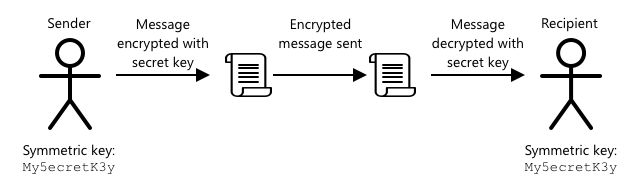

<!--
CO_OP_TRANSLATOR_METADATA:
{
  "original_hash": "81c437c568eee1b0dda1f04e88150d37",
  "translation_date": "2025-08-27T21:35:49+00:00",
  "source_file": "2-farm/lessons/6-keep-your-plant-secure/README.md",
  "language_code": "nl"
}
-->
# Houd je plant veilig


> Schetsnotitie door [Nitya Narasimhan](https://github.com/nitya). Klik op de afbeelding voor een grotere versie.

## Quiz voorafgaand aan de les

[Quiz voorafgaand aan de les](https://black-meadow-040d15503.1.azurestaticapps.net/quiz/19)

## Introductie

In de afgelopen lessen heb je een IoT-apparaat voor bodemmonitoring gemaakt en verbonden met de cloud. Maar wat als hackers die werken voor een concurrerende boer de controle over je IoT-apparaten overnemen? Wat als ze hoge bodemvochtigheidswaarden sturen, zodat je planten nooit water krijgen, of je bewateringssysteem continu laten draaien, waardoor je planten verdrinken en je een fortuin kwijt bent aan water?

In deze les leer je hoe je IoT-apparaten kunt beveiligen. Omdat dit de laatste les van dit project is, leer je ook hoe je je cloudbronnen kunt opruimen om mogelijke kosten te verminderen.

In deze les behandelen we:

* [Waarom moet je IoT-apparaten beveiligen?](../../../../../2-farm/lessons/6-keep-your-plant-secure)
* [Cryptografie](../../../../../2-farm/lessons/6-keep-your-plant-secure)
* [Beveilig je IoT-apparaten](../../../../../2-farm/lessons/6-keep-your-plant-secure)
* [Genereer en gebruik een X.509-certificaat](../../../../../2-farm/lessons/6-keep-your-plant-secure)

> 🗑 Dit is de laatste les in dit project, dus vergeet niet om na het voltooien van deze les en de opdracht je cloudservices op te ruimen. Je hebt de services nodig om de opdracht te voltooien, dus zorg ervoor dat je dat eerst doet.
>
> Raadpleeg [de gids voor het opruimen van je project](../../../clean-up.md) indien nodig voor instructies.

## Waarom moet je IoT-apparaten beveiligen?

IoT-beveiliging houdt in dat alleen verwachte apparaten verbinding kunnen maken met je cloud IoT-service en telemetrie kunnen verzenden, en dat alleen jouw cloudservice opdrachten kan sturen naar je apparaten. IoT-gegevens kunnen ook persoonlijk zijn, zoals medische of intieme gegevens, dus je hele toepassing moet rekening houden met beveiliging om te voorkomen dat deze gegevens uitlekken.

Als je IoT-toepassing niet veilig is, zijn er verschillende risico's:

* Een nepapparaat kan onjuiste gegevens verzenden, waardoor je toepassing verkeerd reageert. Bijvoorbeeld, ze kunnen constant hoge bodemvochtigheidswaarden sturen, waardoor je irrigatiesysteem nooit aanslaat en je planten sterven door gebrek aan water.
* Ongeautoriseerde gebruikers kunnen gegevens van IoT-apparaten lezen, inclusief persoonlijke of bedrijfskritieke gegevens.
* Hackers kunnen opdrachten sturen om een apparaat te besturen op een manier die schade kan veroorzaken aan het apparaat of aangesloten hardware.
* Door verbinding te maken met een IoT-apparaat, kunnen hackers toegang krijgen tot extra netwerken en privé-systemen binnendringen.
* Kwaadwillende gebruikers kunnen persoonlijke gegevens verkrijgen en deze gebruiken voor chantage.

Dit zijn scenario's uit de echte wereld en ze komen regelmatig voor. Enkele voorbeelden zijn eerder in de lessen genoemd, maar hier zijn er nog meer:

* In 2018 gebruikten hackers een open WiFi-toegangspunt op een thermostaat van een visbak om toegang te krijgen tot het netwerk van een casino en gegevens te stelen. [The Hacker News - Casino Gets Hacked Through Its Internet-Connected Fish Tank Thermometer](https://thehackernews.com/2018/04/iot-hacking-thermometer.html)
* In 2016 lanceerde het Mirai Botnet een denial-of-service-aanval op Dyn, een internetprovider, waardoor grote delen van het internet uitvielen. Dit botnet gebruikte malware om verbinding te maken met IoT-apparaten zoals DVR's en camera's die standaardgebruikersnamen en -wachtwoorden gebruikten, en lanceerde van daaruit de aanval. [The Guardian - DDoS attack that disrupted internet was largest of its kind in history, experts say](https://www.theguardian.com/technology/2016/oct/26/ddos-attack-dyn-mirai-botnet)
* Spiral Toys had een database van gebruikers van hun CloudPets verbonden speelgoed publiekelijk beschikbaar op internet. [Troy Hunt - Data from connected CloudPets teddy bears leaked and ransomed, exposing kids' voice messages](https://www.troyhunt.com/data-from-connected-cloudpets-teddy-bears-leaked-and-ransomed-exposing-kids-voice-messages/).
* Strava tagde hardlopers die je passeerde en toonde hun routes, waardoor vreemden effectief konden zien waar je woont. [Kim Komndo - Fitness app could lead a stranger right to your home — change this setting](https://www.komando.com/security-privacy/strava-fitness-app-privacy/755349/).

✅ Doe wat onderzoek: Zoek naar meer voorbeelden van IoT-hacks en datalekken van IoT-apparaten, vooral met persoonlijke items zoals internetverbonden tandenborstels of weegschalen. Denk na over de impact die deze hacks kunnen hebben op de slachtoffers of klanten.

> 💁 Beveiliging is een enorm onderwerp, en deze les behandelt alleen enkele basisprincipes rond het verbinden van je apparaat met de cloud. Andere onderwerpen die niet worden behandeld, zijn onder meer het monitoren van gegevenswijzigingen tijdens verzending, het hacken van apparaten rechtstreeks of wijzigingen in apparaatconfiguraties. IoT-hacking is zo'n grote bedreiging dat er tools zoals [Azure Defender for IoT](https://azure.microsoft.com/services/azure-defender-for-iot/?WT.mc_id=academic-17441-jabenn) zijn ontwikkeld. Deze tools zijn vergelijkbaar met de antivirus- en beveiligingstools die je mogelijk op je computer hebt, maar dan ontworpen voor kleine, energiezuinige IoT-apparaten.

## Cryptografie

Wanneer een apparaat verbinding maakt met een IoT-service, gebruikt het een ID om zichzelf te identificeren. Het probleem is dat dit ID gekloond kan worden - een hacker kan een kwaadaardig apparaat opzetten dat hetzelfde ID gebruikt als een echt apparaat, maar valse gegevens verzendt.


De oplossing hiervoor is om de verzonden gegevens om te zetten in een versleuteld formaat, met behulp van een waarde die alleen bekend is bij het apparaat en de cloud. Dit proces wordt *encryptie* genoemd, en de waarde die wordt gebruikt om de gegevens te versleutelen, wordt een *encryptiesleutel* genoemd.


De cloudservice kan de gegevens vervolgens terugzetten naar een leesbaar formaat met een proces dat *decryptie* wordt genoemd, met behulp van dezelfde encryptiesleutel of een *decryptiesleutel*. Als het versleutelde bericht niet kan worden gedecrypt met de sleutel, is het apparaat gehackt en wordt het bericht geweigerd.

De techniek voor het uitvoeren van encryptie en decryptie wordt *cryptografie* genoemd.

### Vroege cryptografie

De vroegste vormen van cryptografie waren substitutiecijfers, die teruggaan tot 3.500 jaar geleden. Substitutiecijfers houden in dat één letter wordt vervangen door een andere. Bijvoorbeeld, het [Caesar-cijfer](https://wikipedia.org/wiki/Caesar_cipher) houdt in dat het alfabet met een bepaald aantal posities wordt verschoven, waarbij alleen de verzender van het versleutelde bericht en de beoogde ontvanger weten hoeveel letters moeten worden verschoven.

Het [Vigenère-cijfer](https://wikipedia.org/wiki/Vigenère_cipher) ging nog een stap verder door woorden te gebruiken om tekst te versleutelen, zodat elke letter in de oorspronkelijke tekst met een ander aantal posities werd verschoven, in plaats van altijd met hetzelfde aantal.

Cryptografie werd voor allerlei doeleinden gebruikt, zoals het beschermen van een pottenbakkersglazuurrecept in het oude Mesopotamië, het schrijven van geheime liefdesbrieven in India, of het geheimhouden van oude Egyptische magische spreuken.

### Moderne cryptografie

Moderne cryptografie is veel geavanceerder, waardoor het moeilijker te kraken is dan vroege methoden. Moderne cryptografie maakt gebruik van ingewikkelde wiskunde om gegevens te versleutelen met te veel mogelijke sleutels om brute force-aanvallen mogelijk te maken.

Cryptografie wordt op veel verschillende manieren gebruikt voor veilige communicatie. Als je deze pagina op GitHub leest, zie je misschien dat het webadres begint met *HTTPS*, wat betekent dat de communicatie tussen je browser en de webservers van GitHub versleuteld is. Als iemand het internetverkeer tussen je browser en GitHub zou kunnen lezen, zou diegene de gegevens niet kunnen lezen omdat ze versleuteld zijn. Je computer kan zelfs alle gegevens op je harde schijf versleutelen, zodat als iemand deze steelt, diegene geen gegevens kan lezen zonder je wachtwoord.

> 🎓 HTTPS staat voor HyperText Transfer Protocol **Secure**

Helaas is niet alles veilig. Sommige apparaten hebben geen beveiliging, andere zijn beveiligd met gemakkelijk te kraken sleutels, of soms gebruiken alle apparaten van hetzelfde type dezelfde sleutel. Er zijn gevallen bekend van zeer persoonlijke IoT-apparaten die allemaal hetzelfde wachtwoord hebben om verbinding te maken via WiFi of Bluetooth. Als je verbinding kunt maken met je eigen apparaat, kun je ook verbinding maken met dat van iemand anders. Eenmaal verbonden kun je toegang krijgen tot zeer persoonlijke gegevens of controle hebben over hun apparaat.

> 💁 Ondanks de complexiteit van moderne cryptografie en de beweringen dat het kraken van encryptie miljarden jaren kan duren, heeft de opkomst van quantumcomputing geleid tot de mogelijkheid om alle bekende encryptie in zeer korte tijd te kraken!

### Symmetrische en asymmetrische sleutels

Encryptie komt in twee soorten: symmetrisch en asymmetrisch.

**Symmetrische** encryptie gebruikt dezelfde sleutel om gegevens te versleutelen en te ontsleutelen. Zowel de verzender als de ontvanger moeten dezelfde sleutel kennen. Dit is het minst veilige type, omdat de sleutel op de een of andere manier moet worden gedeeld. Om een versleuteld bericht naar een ontvanger te sturen, moet de verzender de sleutel eerst naar de ontvanger sturen.



Als de sleutel tijdens het transport wordt gestolen, of als de verzender of ontvanger wordt gehackt en de sleutel wordt gevonden, kan de encryptie worden gekraakt.


**Asymmetrische** encryptie gebruikt 2 sleutels: een encryptiesleutel en een decryptiesleutel, ook wel een openbaar/privé-sleutelpaar genoemd. De openbare sleutel wordt gebruikt om het bericht te versleutelen, maar kan niet worden gebruikt om het te ontsleutelen. De privésleutel wordt gebruikt om het bericht te ontsleutelen, maar kan niet worden gebruikt om het te versleutelen.


De ontvanger deelt zijn openbare sleutel, en de verzender gebruikt deze om het bericht te versleutelen. Zodra het bericht is verzonden, ontsleutelt de ontvanger het met zijn privésleutel. Asymmetrische encryptie is veiliger omdat de privésleutel privé wordt gehouden door de ontvanger en nooit wordt gedeeld. Iedereen kan de openbare sleutel hebben, omdat deze alleen kan worden gebruikt om berichten te versleutelen.

Symmetrische encryptie is sneller dan asymmetrische encryptie, maar asymmetrische encryptie is veiliger. Sommige systemen gebruiken beide: asymmetrische encryptie om de symmetrische sleutel te versleutelen en te delen, en vervolgens de symmetrische sleutel om alle gegevens te versleutelen. Dit maakt het veiliger om de symmetrische sleutel tussen verzender en ontvanger te delen, en sneller bij het versleutelen en ontsleutelen van gegevens.

## Beveilig je IoT-apparaten

IoT-apparaten kunnen worden beveiligd met symmetrische of asymmetrische encryptie. Symmetrisch is eenvoudiger, maar minder veilig.

### Symmetrische sleutels

Toen je je IoT-apparaat instelde om te communiceren met IoT Hub, gebruikte je een verbindingsreeks. Een voorbeeld van een verbindingsreeks is:

```output
HostName=soil-moisture-sensor.azure-devices.net;DeviceId=soil-moisture-sensor;SharedAccessKey=Bhry+ind7kKEIDxubK61RiEHHRTrPl7HUow8cEm/mU0=
```

Deze verbindingsreeks bestaat uit drie delen, gescheiden door puntkomma's, waarbij elk deel een sleutel en een waarde bevat:

| Sleutel | Waarde | Beschrijving |
| --- | ----- | ----------- |
| HostName | `soil-moisture-sensor.azure-devices.net` | De URL van de IoT Hub |
| DeviceId | `soil-moisture-sensor` | De unieke ID van het apparaat |
| SharedAccessKey | `Bhry+ind7kKEIDxubK61RiEHHRTrPl7HUow8cEm/mU0=` | Een symmetrische sleutel die bekend is bij zowel het apparaat als de IoT Hub |

Het laatste deel van deze verbindingsreeks, de `SharedAccessKey`, is de symmetrische sleutel die bekend is bij zowel het apparaat als de IoT Hub. Deze sleutel wordt nooit verzonden van het apparaat naar de cloud, of van de cloud naar het apparaat. In plaats daarvan wordt deze gebruikt om gegevens te versleutelen die worden verzonden of ontvangen.

✅ Doe een experiment. Wat denk je dat er gebeurt als je het `SharedAccessKey`-gedeelte van de verbindingsreeks wijzigt wanneer je IoT-apparaat verbinding maakt? Probeer het uit.

Wanneer het apparaat voor het eerst probeert verbinding te maken, stuurt het een gedeeld toegangstoken (SAS-token) bestaande uit de URL van de IoT Hub, een tijdstempel waarop het toegangstoken verloopt (meestal 1 dag vanaf de huidige tijd), en een handtekening. Deze handtekening bestaat uit de URL en de vervaltijd, versleuteld met de gedeelde toegangssleutel uit de verbindingsreeks.

De IoT Hub ontsleutelt deze handtekening met de gedeelde toegangssleutel, en als de ontsleutelde waarde overeenkomt met de URL en de vervaltijd, mag het apparaat verbinding maken. Het controleert ook of de huidige tijd vóór de vervaltijd ligt, om te voorkomen dat een kwaadaardig apparaat het SAS-token van een echt apparaat onderschept en gebruikt.

Dit is een elegante manier om te verifiëren dat de verzender het juiste apparaat is. Door enkele bekende gegevens zowel in een ontsleutelde als versleutelde vorm te verzenden, kan de server het apparaat verifiëren door ervoor te zorgen dat wanneer het de versleutelde gegevens ontsleutelt, het resultaat overeenkomt met de verzonden ontsleutelde versie. Als het overeenkomt, hebben zowel de verzender als de ontvanger dezelfde symmetrische encryptiesleutel.
💁 Omdat de vervaltijd belangrijk is, moet je IoT-apparaat de juiste tijd weten, meestal opgehaald van een [NTP](https://wikipedia.org/wiki/Network_Time_Protocol)-server. Als de tijd niet nauwkeurig is, zal de verbinding mislukken.
Na de verbinding wordt alle data die naar de IoT Hub wordt gestuurd vanaf het apparaat, of naar het apparaat vanaf de IoT Hub, versleuteld met de gedeelde toegangssleutel.

✅ Wat denk je dat er gebeurt als meerdere apparaten dezelfde verbindingsreeks delen?

> 💁 Het is een slechte beveiligingspraktijk om deze sleutel in de code op te slaan. Als een hacker je broncode in handen krijgt, kan hij ook je sleutel bemachtigen. Het maakt het ook lastiger bij het uitbrengen van code, omdat je de code opnieuw moet compileren met een bijgewerkte sleutel voor elk apparaat. Het is beter om deze sleutel te laden vanuit een hardwarebeveiligingsmodule - een chip op het IoT-apparaat die versleutelde waarden opslaat die door je code kunnen worden gelezen.
>
> Bij het leren van IoT is het vaak makkelijker om de sleutel in de code te plaatsen, zoals je in een eerdere les hebt gedaan, maar je moet ervoor zorgen dat deze sleutel niet wordt ingecheckt in openbare broncodebeheer.

Apparaten hebben 2 sleutels en 2 bijbehorende verbindingsreeksen. Dit stelt je in staat om de sleutels te roteren - dat wil zeggen, overschakelen van de ene sleutel naar de andere als de eerste wordt gecompromitteerd, en de eerste sleutel opnieuw te genereren.

### X.509-certificaten

Wanneer je asymmetrische encryptie gebruikt met een openbaar/privé-sleutelpaar, moet je je openbare sleutel verstrekken aan iedereen die je gegevens wil sturen. Het probleem is: hoe kan de ontvanger van je sleutel zeker weten dat het echt jouw openbare sleutel is, en niet iemand anders die zich voordoet als jou? In plaats van een sleutel te verstrekken, kun je je openbare sleutel opnemen in een certificaat dat is geverifieerd door een vertrouwde derde partij, een zogenaamd X.509-certificaat.

X.509-certificaten zijn digitale documenten die het openbare deel van het openbaar/privé-sleutelpaar bevatten. Ze worden meestal uitgegeven door een van de vele vertrouwde organisaties, genaamd [Certificeringsinstanties](https://wikipedia.org/wiki/Certificate_authority) (CAs), en digitaal ondertekend door de CA om aan te geven dat de sleutel geldig is en van jou afkomstig is. Je vertrouwt het certificaat en dat de openbare sleutel afkomstig is van wie het certificaat zegt dat het afkomstig is, omdat je de CA vertrouwt, vergelijkbaar met hoe je een paspoort of rijbewijs zou vertrouwen omdat je het land vertrouwt dat het uitgeeft. Certificaten kosten geld, dus je kunt ook 'zelfondertekenen', dat wil zeggen een certificaat zelf maken dat door jou is ondertekend, voor testdoeleinden.

> 💁 Je moet nooit een zelfondertekend certificaat gebruiken voor een productie-release.

Deze certificaten bevatten een aantal velden, waaronder van wie de openbare sleutel afkomstig is, de details van de CA die het heeft uitgegeven, hoe lang het geldig is, en de openbare sleutel zelf. Voordat je een certificaat gebruikt, is het een goede gewoonte om het te verifiëren door te controleren of het is ondertekend door de oorspronkelijke CA.

✅ Je kunt een volledige lijst van de velden in het certificaat lezen in de [Microsoft Understanding X.509 Public Key Certificates tutorial](https://docs.microsoft.com/azure/iot-hub/tutorial-x509-certificates?WT.mc_id=academic-17441-jabenn#certificate-fields)

Bij het gebruik van X.509-certificaten hebben zowel de verzender als de ontvanger hun eigen openbare en privé-sleutels, evenals beide een X.509-certificaat dat de openbare sleutel bevat. Ze wisselen vervolgens op de een of andere manier X.509-certificaten uit, waarbij ze elkaars openbare sleutels gebruiken om de gegevens die ze verzenden te versleutelen, en hun eigen privé-sleutel om de gegevens die ze ontvangen te ontsleutelen.


Een groot voordeel van het gebruik van X.509-certificaten is dat ze tussen apparaten kunnen worden gedeeld. Je kunt één certificaat maken, het uploaden naar IoT Hub, en dit gebruiken voor al je apparaten. Elk apparaat hoeft dan alleen de privé-sleutel te kennen om de berichten die het van IoT Hub ontvangt te ontsleutelen.

Het certificaat dat door je apparaat wordt gebruikt om berichten te versleutelen die het naar de IoT Hub stuurt, wordt gepubliceerd door Microsoft. Het is hetzelfde certificaat dat veel Azure-diensten gebruiken en is soms ingebouwd in de SDK's.

> 💁 Onthoud, een openbare sleutel is precies dat - openbaar. De openbare sleutel van Azure kan alleen worden gebruikt om gegevens naar Azure te versleutelen, niet om ze te ontsleutelen, dus het kan overal worden gedeeld, inclusief in broncode. Je kunt het bijvoorbeeld zien in de [Azure IoT C SDK broncode](https://github.com/Azure/azure-iot-sdk-c/blob/master/certs/certs.c).

✅ Er is veel jargon rondom X.509-certificaten. Je kunt de definities van enkele termen die je tegenkomt lezen in [The layman’s guide to X.509 certificate jargon](https://techcommunity.microsoft.com/t5/internet-of-things/the-layman-s-guide-to-x-509-certificate-jargon/ba-p/2203540?WT.mc_id=academic-17441-jabenn)

## Genereer en gebruik een X.509-certificaat

De stappen om een X.509-certificaat te genereren zijn:

1. Maak een openbaar/privé-sleutelpaar. Een van de meest gebruikte algoritmen om een openbaar/privé-sleutelpaar te genereren heet [Rivest–Shamir–Adleman](https://wikipedia.org/wiki/RSA_(cryptosystem))(RSA).

1. Dien de openbare sleutel in met bijbehorende gegevens voor ondertekening, hetzij door een CA, hetzij door zelfondertekening.

De Azure CLI heeft opdrachten om een nieuwe apparaatidentiteit in IoT Hub te maken, en automatisch het openbaar/privé-sleutelpaar te genereren en een zelfondertekend certificaat te maken.

> 💁 Als je de stappen in detail wilt zien, in plaats van de Azure CLI te gebruiken, kun je dit vinden in de [Using OpenSSL to create self-signed certificates tutorial in the Microsoft IoT Hub documentation](https://docs.microsoft.com/azure/iot-hub/tutorial-x509-self-sign?WT.mc_id=academic-17441-jabenn)

### Taak - maak een apparaatidentiteit met een X.509-certificaat

1. Voer de volgende opdracht uit om de nieuwe apparaatidentiteit te registreren en automatisch de sleutels en certificaten te genereren:

    ```sh
    az iot hub device-identity create --device-id soil-moisture-sensor-x509 \
                                      --am x509_thumbprint \
                                      --output-dir . \
                                      --hub-name <hub_name>
    ```

    Vervang `<hub_name>` door de naam die je hebt gebruikt voor je IoT Hub.

    Dit zal een apparaat maken met een ID van `soil-moisture-sensor-x509` om het te onderscheiden van de apparaatidentiteit die je in de vorige les hebt gemaakt. Deze opdracht zal ook 2 bestanden maken in de huidige map:

    * `soil-moisture-sensor-x509-key.pem` - dit bestand bevat de privé-sleutel voor het apparaat.
    * `soil-moisture-sensor-x509-cert.pem` - dit is het X.509-certificaatbestand voor het apparaat.

    Bewaar deze bestanden veilig! Het bestand met de privé-sleutel mag niet worden ingecheckt in openbare broncodebeheer.

### Taak - gebruik het X.509-certificaat in je apparaatcode

Werk de relevante handleiding door om je IoT-apparaat met de cloud te verbinden met behulp van het X.509-certificaat:

* [Arduino - Wio Terminal](wio-terminal-x509.md)
* [Single-board computer - Raspberry Pi/Virtual IoT device](single-board-computer-x509.md)

---

## 🚀 Uitdaging

Er zijn meerdere manieren om Azure-diensten zoals Resource Groups en IoT Hubs te maken, beheren en verwijderen. Een manier is via de [Azure Portal](https://portal.azure.com?WT.mc_id=academic-17441-jabenn) - een webinterface die je een GUI biedt om je Azure-diensten te beheren.

Ga naar [portal.azure.com](https://portal.azure.com?WT.mc_id=academic-17441-jabenn) en onderzoek de portal. Kijk of je een IoT Hub kunt maken via de portal en verwijder deze daarna.

**Hint** - bij het maken van diensten via de portal hoef je niet vooraf een Resource Group te maken; er kan er een worden gemaakt tijdens het aanmaken van de dienst. Zorg ervoor dat je deze verwijdert wanneer je klaar bent!

Je kunt veel documentatie, tutorials en handleidingen over de Azure Portal vinden in de [Azure portal documentation](https://docs.microsoft.com/azure/azure-portal/?WT.mc_id=academic-17441-jabenn).

## Quiz na de les

[Quiz na de les](https://black-meadow-040d15503.1.azurestaticapps.net/quiz/20)

## Review & Zelfstudie

* Lees meer over de geschiedenis van cryptografie op de [Geschiedenis van cryptografie-pagina op Wikipedia](https://wikipedia.org/wiki/History_of_cryptography).
* Lees meer over X.509-certificaten op de [X.509-pagina op Wikipedia](https://wikipedia.org/wiki/X.509).

## Opdracht

[Bouw een nieuw IoT-apparaat](assignment.md)

---

**Disclaimer**:  
Dit document is vertaald met behulp van de AI-vertalingsservice [Co-op Translator](https://github.com/Azure/co-op-translator). Hoewel we streven naar nauwkeurigheid, dient u zich ervan bewust te zijn dat geautomatiseerde vertalingen fouten of onnauwkeurigheden kunnen bevatten. Het originele document in de oorspronkelijke taal moet worden beschouwd als de gezaghebbende bron. Voor cruciale informatie wordt professionele menselijke vertaling aanbevolen. Wij zijn niet aansprakelijk voor eventuele misverstanden of verkeerde interpretaties die voortvloeien uit het gebruik van deze vertaling.