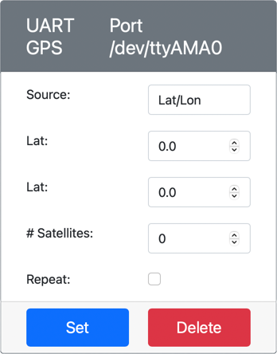

<!--
CO_OP_TRANSLATOR_METADATA:
{
  "original_hash": "64f18a8f8aaa1fef5e7320e0992d8b3a",
  "translation_date": "2025-08-27T22:50:22+00:00",
  "source_file": "3-transport/lessons/1-location-tracking/virtual-device-gps-sensor.md",
  "language_code": "nl"
}
-->
# Lees GPS-gegevens - Virtuele IoT-hardware

In dit deel van de les voeg je een GPS-sensor toe aan je virtuele IoT-apparaat en lees je waarden ervan uit.

## Virtuele hardware

Het virtuele IoT-apparaat maakt gebruik van een gesimuleerde GPS-sensor die toegankelijk is via UART via een seriële poort.

Een fysieke GPS-sensor heeft een antenne om radiogolven van GPS-satellieten op te vangen en de GPS-signalen om te zetten in GPS-gegevens. De virtuele versie simuleert dit door je in staat te stellen een breedte- en lengtegraad in te stellen, ruwe NMEA-zinnen te verzenden of een GPX-bestand met meerdere locaties te uploaden die opeenvolgend kunnen worden geretourneerd.

> 🎓 NMEA-zinnen worden later in deze les behandeld

### Voeg de sensor toe aan CounterFit

Om een virtuele GPS-sensor te gebruiken, moet je er een toevoegen aan de CounterFit-app.

#### Taak - voeg de sensor toe aan CounterFit

Voeg de GPS-sensor toe aan de CounterFit-app.

1. Maak een nieuwe Python-app op je computer in een map genaamd `gps-sensor` met een enkel bestand genaamd `app.py` en een Python-virtuele omgeving, en voeg de CounterFit pip-pakketten toe.

    > ⚠️ Je kunt [de instructies voor het maken en instellen van een CounterFit Python-project in les 1 raadplegen indien nodig](../../../1-getting-started/lessons/1-introduction-to-iot/virtual-device.md).

1. Installeer een extra Pip-pakket om een CounterFit shim te installeren die kan communiceren met op UART gebaseerde sensoren via een seriële verbinding. Zorg ervoor dat je dit installeert vanuit een terminal met de virtuele omgeving geactiveerd.

    ```sh
    pip install counterfit-shims-serial
    ```

1. Zorg ervoor dat de CounterFit-webapp draait.

1. Maak een GPS-sensor aan:

    1. In het vak *Create sensor* in het *Sensors*-paneel, open het dropdownmenu *Sensor type* en selecteer *UART GPS*.

    1. Laat de *Port* ingesteld op */dev/ttyAMA0*.

    1. Selecteer de knop **Add** om de GPS-sensor aan te maken op poort `/dev/ttyAMA0`.

    

    De GPS-sensor wordt aangemaakt en verschijnt in de sensorenlijst.

    

## Programmeer de GPS-sensor

Het virtuele IoT-apparaat kan nu worden geprogrammeerd om de virtuele GPS-sensor te gebruiken.

### Taak - programmeer de GPS-sensor

Programmeur de GPS-sensor-app.

1. Zorg ervoor dat de `gps-sensor`-app geopend is in VS Code.

1. Open het bestand `app.py`.

1. Voeg de volgende code toe aan de bovenkant van `app.py` om de app te verbinden met CounterFit:

    ```python
    from counterfit_connection import CounterFitConnection
    CounterFitConnection.init('127.0.0.1', 5000)
    ```

1. Voeg de volgende code hieronder toe om enkele benodigde bibliotheken te importeren, inclusief de bibliotheek voor de CounterFit seriële poort:

    ```python
    import time
    import counterfit_shims_serial
    
    serial = counterfit_shims_serial.Serial('/dev/ttyAMA0')
    ```

    Deze code importeert de `serial`-module uit het `counterfit_shims_serial` Pip-pakket. Vervolgens maakt het verbinding met de seriële poort `/dev/ttyAMA0` - dit is het adres van de seriële poort die de virtuele GPS-sensor gebruikt voor zijn UART-poort.

1. Voeg de volgende code hieronder toe om van de seriële poort te lezen en de waarden naar de console te printen:

    ```python
    def print_gps_data(line):
        print(line.rstrip())
    
    while True:
        line = serial.readline().decode('utf-8')
    
        while len(line) > 0:
            print_gps_data(line)
            line = serial.readline().decode('utf-8')
    
        time.sleep(1)
    ```

    Een functie genaamd `print_gps_data` wordt gedefinieerd die de doorgegeven regel naar de console print.

    Vervolgens loopt de code oneindig door, waarbij in elke lus zoveel mogelijk tekstregels van de seriële poort worden gelezen. Voor elke regel wordt de functie `print_gps_data` aangeroepen.

    Nadat alle gegevens zijn gelezen, slaapt de lus 1 seconde en probeert het opnieuw.

1. Voer deze code uit, zorg ervoor dat je een andere terminal gebruikt dan degene waarin de CounterFit-app draait, zodat de CounterFit-app blijft draaien.

1. Verander vanuit de CounterFit-app de waarde van de GPS-sensor. Dit kan op een van de volgende manieren:

    * Stel de **Source** in op `Lat/Lon` en stel een specifieke breedtegraad, lengtegraad en aantal satellieten in die worden gebruikt om de GPS-fix te krijgen. Deze waarde wordt slechts één keer verzonden, dus vink het vakje **Repeat** aan om de gegevens elke seconde te herhalen.

      

    * Stel de **Source** in op `NMEA` en voeg enkele NMEA-zinnen toe in het tekstvak. Al deze waarden worden verzonden, met een vertraging van 1 seconde voordat elke nieuwe GGA (positie-fix) zin kan worden gelezen.

      

      Je kunt een tool zoals [nmeagen.org](https://www.nmeagen.org) gebruiken om deze zinnen te genereren door op een kaart te tekenen. Deze waarden worden slechts één keer verzonden, dus vink het vakje **Repeat** aan om de gegevens één seconde na verzending opnieuw te laten herhalen.

    * Stel de **Source** in op GPX-bestand en upload een GPX-bestand met tracklocaties. Je kunt GPX-bestanden downloaden van een aantal populaire kaart- en wandelwebsites, zoals [AllTrails](https://www.alltrails.com/). Deze bestanden bevatten meerdere GPS-locaties als een route, en de GPS-sensor retourneert elke nieuwe locatie met intervallen van 1 seconde.

      

      Deze waarden worden slechts één keer verzonden, dus vink het vakje **Repeat** aan om de gegevens één seconde na verzending opnieuw te laten herhalen.

    Zodra je de GPS-instellingen hebt geconfigureerd, selecteer je de knop **Set** om deze waarden aan de sensor toe te wijzen.

1. Je ziet de ruwe uitvoer van de GPS-sensor, iets zoals het volgende:

    ```output
    $GNGGA,020604.001,4738.538654,N,12208.341758,W,1,3,,164.7,M,-17.1,M,,*67
    $GNGGA,020604.001,4738.538654,N,12208.341758,W,1,3,,164.7,M,-17.1,M,,*67
    ```

> 💁 Je kunt deze code vinden in de map [code-gps/virtual-device](../../../../../3-transport/lessons/1-location-tracking/code-gps/virtual-device).

😀 Je GPS-sensorprogramma is een succes!

---

**Disclaimer**:  
Dit document is vertaald met behulp van de AI-vertalingsservice [Co-op Translator](https://github.com/Azure/co-op-translator). Hoewel we streven naar nauwkeurigheid, dient u zich ervan bewust te zijn dat geautomatiseerde vertalingen fouten of onnauwkeurigheden kunnen bevatten. Het originele document in zijn oorspronkelijke taal moet worden beschouwd als de gezaghebbende bron. Voor cruciale informatie wordt professionele menselijke vertaling aanbevolen. Wij zijn niet aansprakelijk voor eventuele misverstanden of verkeerde interpretaties die voortvloeien uit het gebruik van deze vertaling.