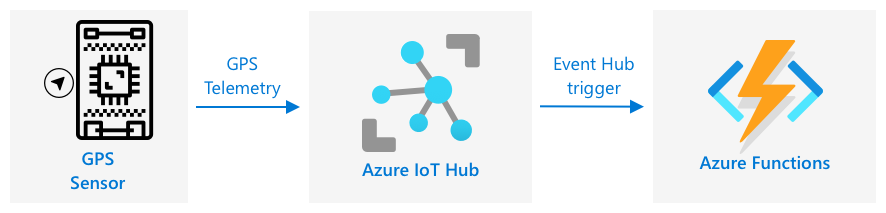

<!--
CO_OP_TRANSLATOR_METADATA:
{
  "original_hash": "e345843ccfeb7261d81500d19c64d476",
  "translation_date": "2025-08-27T23:01:16+00:00",
  "source_file": "3-transport/lessons/2-store-location-data/README.md",
  "language_code": "nl"
}
-->
# Opslag van locatiegegevens


> Sketchnote door [Nitya Narasimhan](https://github.com/nitya). Klik op de afbeelding voor een grotere versie.

## Quiz voorafgaand aan de les

[Quiz voorafgaand aan de les](https://black-meadow-040d15503.1.azurestaticapps.net/quiz/23)

## Introductie

In de vorige les heb je geleerd hoe je een GPS-sensor kunt gebruiken om locatiegegevens vast te leggen. Om deze gegevens te gebruiken om de locatie van een vrachtwagen vol voedsel en zijn reis te visualiseren, moeten ze naar een IoT-service in de cloud worden verzonden en ergens worden opgeslagen.

In deze les leer je over de verschillende manieren om IoT-gegevens op te slaan en hoe je gegevens van je IoT-service kunt opslaan met serverloze code.

In deze les behandelen we:

* [Gestructureerde en ongestructureerde gegevens](../../../../../3-transport/lessons/2-store-location-data)
* [GPS-gegevens verzenden naar een IoT Hub](../../../../../3-transport/lessons/2-store-location-data)
* [Hete, warme en koude paden](../../../../../3-transport/lessons/2-store-location-data)
* [GPS-evenementen verwerken met serverloze code](../../../../../3-transport/lessons/2-store-location-data)
* [Azure Storage Accounts](../../../../../3-transport/lessons/2-store-location-data)
* [Verbind je serverloze code met opslag](../../../../../3-transport/lessons/2-store-location-data)

## Gestructureerde en ongestructureerde gegevens

Computersystemen werken met gegevens, en deze gegevens komen in allerlei verschillende vormen en maten. Ze kunnen variëren van enkele cijfers tot grote hoeveelheden tekst, video's en afbeeldingen, en IoT-gegevens. Gegevens kunnen meestal worden onderverdeeld in een van twee categorieën: *gestructureerde* gegevens en *ongestructureerde* gegevens.

* **Gestructureerde gegevens** zijn gegevens met een goed gedefinieerde, rigide structuur die niet verandert en meestal overeenkomen met tabellen van gegevens met relaties. Een voorbeeld hiervan zijn de gegevens van een persoon, zoals hun naam, geboortedatum en adres.

* **Ongestructureerde gegevens** zijn gegevens zonder een goed gedefinieerde, rigide structuur, inclusief gegevens die vaak van structuur kunnen veranderen. Een voorbeeld hiervan zijn documenten zoals geschreven teksten of spreadsheets.

✅ Doe wat onderzoek: Kun je andere voorbeelden bedenken van gestructureerde en ongestructureerde gegevens?

> 💁 Er zijn ook semi-gestructureerde gegevens die gestructureerd zijn maar niet in vaste tabellen passen.

IoT-gegevens worden meestal beschouwd als ongestructureerde gegevens.

Stel je voor dat je IoT-apparaten toevoegt aan een vloot voertuigen voor een grote commerciële boerderij. Je zou verschillende apparaten willen gebruiken voor verschillende soorten voertuigen. Bijvoorbeeld:

* Voor landbouwvoertuigen zoals tractoren wil je GPS-gegevens om ervoor te zorgen dat ze op de juiste velden werken.
* Voor vrachtwagens die voedsel naar magazijnen vervoeren wil je GPS-gegevens, evenals snelheid- en acceleratiegegevens om ervoor te zorgen dat de chauffeur veilig rijdt, en gegevens over de identiteit van de chauffeur en start/stop-gegevens om te voldoen aan lokale wetten over werkuren.
* Voor gekoelde vrachtwagens wil je ook temperatuurgegevens om ervoor te zorgen dat het voedsel niet te warm of te koud wordt en bederft tijdens het transport.

Deze gegevens kunnen voortdurend veranderen. Bijvoorbeeld, als het IoT-apparaat zich in de cabine van een vrachtwagen bevindt, kunnen de gegevens die het verzendt veranderen afhankelijk van de aanhanger, bijvoorbeeld alleen temperatuurgegevens verzenden wanneer een gekoelde aanhanger wordt gebruikt.

✅ Welke andere IoT-gegevens zouden kunnen worden vastgelegd? Denk aan de soorten ladingen die vrachtwagens kunnen vervoeren, evenals onderhoudsgegevens.

Deze gegevens variëren van voertuig tot voertuig, maar ze worden allemaal naar dezelfde IoT-service verzonden voor verwerking. De IoT-service moet in staat zijn om deze ongestructureerde gegevens te verwerken, ze op te slaan op een manier die doorzoekbaar of analyseerbaar is, maar die werkt met verschillende structuren van deze gegevens.

### SQL versus NoSQL opslag

Databases zijn diensten waarmee je gegevens kunt opslaan en opvragen. Databases komen in twee soorten: SQL en NoSQL.

#### SQL-databases

De eerste databases waren Relationele Database Management Systemen (RDBMS), of relationele databases. Deze worden ook wel SQL-databases genoemd vanwege de Structured Query Language (SQL) die wordt gebruikt om gegevens toe te voegen, te verwijderen, bij te werken of op te vragen. Deze databases bestaan uit een schema - een goed gedefinieerde set tabellen van gegevens, vergelijkbaar met een spreadsheet. Elke tabel heeft meerdere benoemde kolommen. Wanneer je gegevens invoegt, voeg je een rij toe aan de tabel en plaats je waarden in elk van de kolommen. Dit houdt de gegevens in een zeer rigide structuur - hoewel je kolommen leeg kunt laten, moet je, als je een nieuwe kolom wilt toevoegen, dit doen in de database en waarden invullen voor de bestaande rijen. Deze databases zijn relationeel - in die zin dat één tabel een relatie kan hebben met een andere.


Bijvoorbeeld, als je persoonlijke gegevens van een gebruiker opslaat in een tabel, zou je een soort interne unieke ID per gebruiker hebben die wordt gebruikt in een rij in een tabel die de naam en het adres van de gebruiker bevat. Als je vervolgens andere gegevens over die gebruiker wilt opslaan, zoals hun aankopen, in een andere tabel, zou je één kolom in de nieuwe tabel hebben voor de ID van die gebruiker. Wanneer je een gebruiker opzoekt, kun je hun ID gebruiken om hun persoonlijke gegevens uit één tabel te halen en hun aankopen uit een andere.

SQL-databases zijn ideaal voor het opslaan van gestructureerde gegevens en voor wanneer je wilt dat de gegevens overeenkomen met je schema.

✅ Als je nog nooit SQL hebt gebruikt, neem dan even de tijd om erover te lezen op de [SQL-pagina op Wikipedia](https://wikipedia.org/wiki/SQL).

Enkele bekende SQL-databases zijn Microsoft SQL Server, MySQL en PostgreSQL.

✅ Doe wat onderzoek: Lees meer over enkele van deze SQL-databases en hun mogelijkheden.

#### NoSQL-databases

NoSQL-databases worden NoSQL genoemd omdat ze niet dezelfde rigide structuur hebben als SQL-databases. Ze worden ook wel documentdatabases genoemd omdat ze ongestructureerde gegevens zoals documenten kunnen opslaan.

> 💁 Ondanks hun naam staan sommige NoSQL-databases toe dat je SQL gebruikt om de gegevens op te vragen.


NoSQL-databases hebben geen vooraf gedefinieerd schema dat beperkt hoe gegevens worden opgeslagen; in plaats daarvan kun je ongestructureerde gegevens invoegen, meestal met JSON-documenten. Deze documenten kunnen worden georganiseerd in mappen, vergelijkbaar met bestanden op je computer. Elk document kan verschillende velden hebben ten opzichte van andere documenten - bijvoorbeeld, als je IoT-gegevens van je landbouwvoertuigen opslaat, kunnen sommige velden hebben voor versnellingsmeter- en snelheidsgegevens, terwijl andere velden hebben voor de temperatuur in de aanhanger. Als je een nieuw type vrachtwagen toevoegt, zoals een met ingebouwde weegschalen om het gewicht van de vervoerde producten te volgen, kan je IoT-apparaat dit nieuwe veld toevoegen en kan het worden opgeslagen zonder wijzigingen aan de database.

Enkele bekende NoSQL-databases zijn Azure CosmosDB, MongoDB en CouchDB.

✅ Doe wat onderzoek: Lees meer over enkele van deze NoSQL-databases en hun mogelijkheden.

In deze les ga je NoSQL-opslag gebruiken om IoT-gegevens op te slaan.

## GPS-gegevens verzenden naar een IoT Hub

In de vorige les heb je GPS-gegevens vastgelegd van een GPS-sensor die is aangesloten op je IoT-apparaat. Om deze IoT-gegevens in de cloud op te slaan, moet je ze naar een IoT-service verzenden. Je gebruikt opnieuw Azure IoT Hub, dezelfde IoT-cloudservice die je in het vorige project hebt gebruikt.


### Taak - GPS-gegevens verzenden naar een IoT Hub

1. Maak een nieuwe IoT Hub aan met behulp van de gratis tier.

    > ⚠️ Je kunt de [instructies voor het maken van een IoT Hub uit project 2, les 4](../../../2-farm/lessons/4-migrate-your-plant-to-the-cloud/README.md#create-an-iot-service-in-the-cloud) raadplegen indien nodig.

    Vergeet niet een nieuwe Resource Group aan te maken. Noem de nieuwe Resource Group `gps-sensor` en geef de nieuwe IoT Hub een unieke naam gebaseerd op `gps-sensor`, zoals `gps-sensor-<jouw naam>`.

    > 💁 Als je je IoT Hub uit het vorige project nog hebt, kun je deze hergebruiken. Vergeet niet de naam van deze IoT Hub en de Resource Group waarin deze zich bevindt te gebruiken bij het maken van andere services.

1. Voeg een nieuw apparaat toe aan de IoT Hub. Noem dit apparaat `gps-sensor`. Pak de verbindingsreeks voor het apparaat.

1. Werk je apparaatcode bij om de GPS-gegevens naar de nieuwe IoT Hub te verzenden met behulp van de verbindingsreeks van het apparaat uit de vorige stap.

    > ⚠️ Je kunt de [instructies voor het verbinden van je apparaat met een IoT-service uit project 2, les 4](../../../2-farm/lessons/4-migrate-your-plant-to-the-cloud/README.md#connect-your-device-to-the-iot-service) raadplegen indien nodig.

1. Wanneer je de GPS-gegevens verzendt, doe dit dan als JSON in het volgende formaat:

    ```json
    {
        "gps" :
        {
            "lat" : <latitude>,
            "lon" : <longitude>
        }
    }
    ```

1. Verzend GPS-gegevens elke minuut zodat je je dagelijkse berichtentoewijzing niet overschrijdt.

Als je de Wio Terminal gebruikt, vergeet dan niet alle benodigde bibliotheken toe te voegen en de tijd in te stellen met een NTP-server. Je code moet ook ervoor zorgen dat alle gegevens van de seriële poort zijn gelezen voordat je de GPS-locatie verzendt, met behulp van de bestaande code uit de vorige les. Gebruik de volgende code om het JSON-document te maken:

```cpp
DynamicJsonDocument doc(1024);
doc["gps"]["lat"] = gps.location.lat();
doc["gps"]["lon"] = gps.location.lng();
```

Als je een virtueel IoT-apparaat gebruikt, vergeet dan niet alle benodigde bibliotheken te installeren met behulp van een virtuele omgeving.

Voor zowel de Raspberry Pi als het virtuele IoT-apparaat, gebruik de bestaande code uit de vorige les om de breedte- en lengtegraadwaarden te verkrijgen en verzend ze vervolgens in het juiste JSON-formaat met de volgende code:

```python
message_json = { "gps" : { "lat":lat, "lon":lon } }
print("Sending telemetry", message_json)
message = Message(json.dumps(message_json))
```

> 💁 Je kunt deze code vinden in de [code/wio-terminal](../../../../../3-transport/lessons/2-store-location-data/code/wio-terminal), [code/pi](../../../../../3-transport/lessons/2-store-location-data/code/pi) of [code/virtual-device](../../../../../3-transport/lessons/2-store-location-data/code/virtual-device) map.

Voer je apparaatcode uit en zorg ervoor dat berichten naar IoT Hub stromen met behulp van de `az iot hub monitor-events` CLI-opdracht.

## Hete, warme en koude paden

Gegevens die van een IoT-apparaat naar de cloud stromen, worden niet altijd in realtime verwerkt. Sommige gegevens moeten in realtime worden verwerkt, andere gegevens kunnen kort daarna worden verwerkt, en andere gegevens kunnen veel later worden verwerkt. De stroom van gegevens naar verschillende services die de gegevens op verschillende tijdstippen verwerken, wordt aangeduid als hete, warme en koude paden.

### Hete pad

Het hete pad verwijst naar gegevens die in realtime of bijna realtime moeten worden verwerkt. Je zou hete pad-gegevens gebruiken voor waarschuwingen, zoals het ontvangen van meldingen dat een voertuig een depot nadert of dat de temperatuur in een gekoelde vrachtwagen te hoog is.

Om hete pad-gegevens te gebruiken, zou je code reageren op gebeurtenissen zodra ze door je cloudservices worden ontvangen.

### Warme pad

Het warme pad verwijst naar gegevens die kort na ontvangst kunnen worden verwerkt, bijvoorbeeld voor rapportage of korte termijnanalyses. Je zou warme pad-gegevens gebruiken voor dagelijkse rapporten over voertuigkilometrage, met behulp van gegevens die de vorige dag zijn verzameld.

Warme pad-gegevens worden opgeslagen zodra ze door de cloudservice zijn ontvangen in een soort opslag die snel toegankelijk is.

### Koude pad

Het koude pad verwijst naar historische gegevens, waarbij gegevens voor de lange termijn worden opgeslagen om te worden verwerkt wanneer dat nodig is. Bijvoorbeeld, je zou het koude pad kunnen gebruiken om jaarlijkse kilometragerapporten voor voertuigen te verkrijgen of analyses uit te voeren op routes om de meest optimale route te vinden om brandstofkosten te verlagen.

Koude pad-gegevens worden opgeslagen in datawarehouses - databases die zijn ontworpen voor het opslaan van grote hoeveelheden gegevens die nooit veranderen en snel en eenvoudig kunnen worden opgevraagd. Je zou normaal gesproken een reguliere taak in je cloudapplicatie hebben die op een vast tijdstip elke dag, week of maand wordt uitgevoerd om gegevens van warme pad-opslag naar het datawarehouse te verplaatsen.

✅ Denk na over de gegevens die je tot nu toe in deze lessen hebt vastgelegd. Zijn het hete, warme of koude pad-gegevens?

## GPS-evenementen verwerken met serverloze code

Zodra gegevens naar je IoT Hub stromen, kun je serverloze code schrijven om te luisteren naar gebeurtenissen die worden gepubliceerd naar het Event-Hub compatibele eindpunt. Dit is het warme pad - deze gegevens worden opgeslagen en gebruikt in de volgende les voor rapportage over de reis.



### Taak - GPS-evenementen verwerken met serverloze code

1. Maak een Azure Functions-app aan met behulp van de Azure Functions CLI. Gebruik de Python-runtime en maak deze in een map genaamd `gps-trigger`, en gebruik dezelfde naam voor de Functions App-projectnaam. Zorg ervoor dat je een virtuele omgeving aanmaakt om te gebruiken voor dit project.
> ⚠️ Je kunt verwijzen naar de [instructies voor het maken van een Azure Functions-project uit project 2, les 5](../../../2-farm/lessons/5-migrate-application-to-the-cloud/README.md#create-a-serverless-application) indien nodig.
1. Voeg een IoT Hub-eventtrigger toe die gebruikmaakt van het Event Hub-compatibele eindpunt van de IoT Hub.

    > ⚠️ Je kunt indien nodig de [instructies voor het maken van een IoT Hub-eventtrigger uit project 2, les 5](../../../2-farm/lessons/5-migrate-application-to-the-cloud/README.md#create-an-iot-hub-event-trigger) raadplegen.

1. Stel de verbindingsreeks van het Event Hub-compatibele eindpunt in het bestand `local.settings.json` in en gebruik de sleutel voor die invoer in het bestand `function.json`.

1. Gebruik de Azurite-app als een lokale opslagemulator.

1. Voer je Functions-app uit om te controleren of deze gebeurtenissen ontvangt van je GPS-apparaat. Zorg ervoor dat je IoT-apparaat ook actief is en GPS-gegevens verzendt.

    ```output
    Python EventHub trigger processed an event: {"gps": {"lat": 47.73481, "lon": -122.25701}}
    ```

## Azure Storage Accounts


Azure Storage Accounts is een algemene opslagservice waarmee je gegevens op verschillende manieren kunt opslaan. Je kunt gegevens opslaan als blobs, in wachtrijen, in tabellen of als bestanden, en dit allemaal tegelijkertijd.

### Blob-opslag

Het woord *Blob* staat voor binaire grote objecten, maar wordt gebruikt als term voor ongestructureerde gegevens. Je kunt allerlei gegevens opslaan in blob-opslag, van JSON-documenten met IoT-gegevens tot afbeeldingen en videobestanden. Blob-opslag heeft het concept van *containers*, genaamd buckets, waarin je gegevens kunt opslaan, vergelijkbaar met tabellen in een relationele database. Deze containers kunnen één of meer mappen bevatten om blobs op te slaan, en elke map kan andere mappen bevatten, vergelijkbaar met hoe bestanden op je harde schijf worden opgeslagen.

In deze les gebruik je blob-opslag om IoT-gegevens op te slaan.

✅ Doe wat onderzoek: Lees meer over [Azure Blob Storage](https://docs.microsoft.com/azure/storage/blobs/storage-blobs-overview?WT.mc_id=academic-17441-jabenn)

### Tabelopslag

Tabelopslag stelt je in staat om semi-gestructureerde gegevens op te slaan. Tabelopslag is eigenlijk een NoSQL-database, dus het vereist geen vooraf gedefinieerde set tabellen, maar is ontworpen om gegevens op te slaan in één of meer tabellen, met unieke sleutels om elke rij te definiëren.

✅ Doe wat onderzoek: Lees meer over [Azure Table Storage](https://docs.microsoft.com/azure/storage/tables/table-storage-overview?WT.mc_id=academic-17441-jabenn)

### Wachtrijopslag

Wachtrijopslag stelt je in staat om berichten van maximaal 64KB groot op te slaan in een wachtrij. Je kunt berichten toevoegen aan de achterkant van de wachtrij en ze lezen vanaf de voorkant. Wachtrijen slaan berichten onbeperkt op zolang er opslagruimte beschikbaar is, zodat berichten langdurig kunnen worden opgeslagen en gelezen wanneer nodig. Bijvoorbeeld, als je een maandelijkse taak wilt uitvoeren om GPS-gegevens te verwerken, kun je elke dag berichten toevoegen aan een wachtrij en aan het einde van de maand alle berichten verwerken.

✅ Doe wat onderzoek: Lees meer over [Azure Queue Storage](https://docs.microsoft.com/azure/storage/queues/storage-queues-introduction?WT.mc_id=academic-17441-jabenn)

### Bestandsopslag

Bestandsopslag is het opslaan van bestanden in de cloud, en alle apps of apparaten kunnen verbinding maken via standaardprotocollen. Je kunt bestanden schrijven naar bestandsopslag en deze vervolgens als een schijf koppelen aan je pc of Mac.

✅ Doe wat onderzoek: Lees meer over [Azure File Storage](https://docs.microsoft.com/azure/storage/files/storage-files-introduction?WT.mc_id=academic-17441-jabenn)

## Verbind je serverloze code met opslag

Je Functions-app moet nu verbinding maken met blob-opslag om de berichten van de IoT Hub op te slaan. Er zijn 2 manieren om dit te doen:

* Binnen de functiecode, maak verbinding met blob-opslag met behulp van de blob-opslag Python SDK en schrijf de gegevens als blobs.
* Gebruik een outputfunctiebinding om de retourwaarde van de functie te koppelen aan blob-opslag en de blob automatisch op te slaan.

In deze les gebruik je de Python SDK om te leren hoe je met blob-opslag kunt werken.


De gegevens worden opgeslagen als een JSON-blob met het volgende formaat:

```json
{
    "device_id": <device_id>,
    "timestamp" : <time>,
    "gps" :
    {
        "lat" : <latitude>,
        "lon" : <longitude>
    }
}
```

### Taak - verbind je serverloze code met opslag

1. Maak een Azure Storage-account. Geef het een naam zoals `gps<jouw naam>`.

    > ⚠️ Je kunt indien nodig de [instructies voor het maken van een opslagaccount uit project 2, les 5](../../../2-farm/lessons/5-migrate-application-to-the-cloud/README.md#task---create-the-cloud-resources) raadplegen.

    Als je nog een opslagaccount hebt van het vorige project, kun je dit hergebruiken.

    > 💁 Je kunt hetzelfde opslagaccount gebruiken om je Azure Functions-app later in deze les te implementeren.

1. Voer de volgende opdracht uit om de verbindingsreeks voor het opslagaccount op te halen:

    ```sh
    az storage account show-connection-string --output table \
                                              --name <storage_name>
    ```

    Vervang `<storage_name>` door de naam van het opslagaccount dat je in de vorige stap hebt gemaakt.

1. Voeg een nieuwe invoer toe aan het bestand `local.settings.json` voor de verbindingsreeks van je opslagaccount, met behulp van de waarde van de vorige stap. Noem het `STORAGE_CONNECTION_STRING`.

1. Voeg het volgende toe aan het bestand `requirements.txt` om de Azure Storage Pip-pakketten te installeren:

    ```sh
    azure-storage-blob
    ```

    Installeer de pakketten uit dit bestand in je virtuele omgeving.

    > Als je een foutmelding krijgt, werk dan je Pip-versie in je virtuele omgeving bij naar de nieuwste versie met de volgende opdracht en probeer het opnieuw:
    >
    > ```sh
    > pip install --upgrade pip
    > ```

1. Voeg in het bestand `__init__.py` voor de `iot-hub-trigger` de volgende importverklaringen toe:

    ```python
    import json
    import os
    import uuid
    from azure.storage.blob import BlobServiceClient, PublicAccess
    ```

    De `json`-systeemmodule wordt gebruikt om JSON te lezen en te schrijven, de `os`-systeemmodule wordt gebruikt om de verbindingsreeks te lezen, de `uuid`-systeemmodule wordt gebruikt om een unieke ID voor de GPS-lezing te genereren.

    Het pakket `azure.storage.blob` bevat de Python SDK om met blob-opslag te werken.

1. Voeg vóór de `main`-methode de volgende hulpfunctie toe:

    ```python
    def get_or_create_container(name):
        connection_str = os.environ['STORAGE_CONNECTION_STRING']
        blob_service_client = BlobServiceClient.from_connection_string(connection_str)
    
        for container in blob_service_client.list_containers():
            if container.name == name:
                return blob_service_client.get_container_client(container.name)
        
        return blob_service_client.create_container(name, public_access=PublicAccess.Container)
    ```

    De Python blob SDK heeft geen hulpfunctie om een container te maken als deze niet bestaat. Deze code laadt de verbindingsreeks uit het bestand `local.settings.json` (of de Application Settings zodra deze in de cloud is geïmplementeerd), maakt vervolgens een `BlobServiceClient`-klasse aan om met het blob-opslagaccount te werken. Het doorloopt alle containers van het blob-opslagaccount, zoekt naar een container met de opgegeven naam - als het er een vindt, retourneert het een `ContainerClient`-klasse die met de container kan werken om blobs te maken. Als het er geen vindt, wordt de container gemaakt en wordt de client voor de nieuwe container geretourneerd.

    Wanneer de nieuwe container wordt gemaakt, wordt openbare toegang verleend om de blobs in de container op te vragen. Dit wordt in de volgende les gebruikt om de GPS-gegevens op een kaart te visualiseren.

1. In tegenstelling tot bodemvocht willen we met deze code elk event opslaan, dus voeg de volgende code toe binnen de `for event in events:`-lus in de `main`-functie, onder de `logging`-verklaring:

    ```python
    device_id = event.iothub_metadata['connection-device-id']
    blob_name = f'{device_id}/{str(uuid.uuid1())}.json'
    ```

    Deze code haalt de apparaat-ID op uit de metadata van het event en gebruikt deze om een blob-naam te maken. Blobs kunnen worden opgeslagen in mappen, en de apparaat-ID wordt gebruikt voor de mapnaam, zodat elk apparaat al zijn GPS-events in één map heeft. De blob-naam is deze map, gevolgd door een documentnaam, gescheiden door schuine strepen, vergelijkbaar met Linux- en macOS-paden (ook vergelijkbaar met Windows, maar Windows gebruikt backslashes). De documentnaam is een unieke ID die wordt gegenereerd met behulp van de Python `uuid`-module, met het bestandstype `json`.

    Bijvoorbeeld, voor de apparaat-ID `gps-sensor` kan de blob-naam zijn: `gps-sensor/a9487ac2-b9cf-11eb-b5cd-1e00621e3648.json`.

1. Voeg de volgende code hieronder toe:

    ```python
    container_client = get_or_create_container('gps-data')
    blob = container_client.get_blob_client(blob_name)
    ```

    Deze code haalt de containerclient op met behulp van de hulpfunctie `get_or_create_container` en haalt vervolgens een blobclient-object op met behulp van de blob-naam. Deze blobclients kunnen verwijzen naar bestaande blobs, of zoals in dit geval, naar nieuwe blobs.

1. Voeg de volgende code hierna toe:

    ```python
    event_body = json.loads(event.get_body().decode('utf-8'))
    blob_body = {
        'device_id' : device_id,
        'timestamp' : event.iothub_metadata['enqueuedtime'],
        'gps': event_body['gps']
    }
    ```

    Dit bouwt de inhoud van de blob die naar blob-opslag wordt geschreven. Het is een JSON-document dat de apparaat-ID, de tijd dat de telemetrie naar IoT Hub is verzonden, en de GPS-coördinaten uit de telemetrie bevat.

    > 💁 Het is belangrijk om de tijd te gebruiken waarop het bericht in de wachtrij is geplaatst in plaats van de huidige tijd om de tijd te krijgen waarop het bericht is verzonden. Het kan een tijdje in de hub blijven staan voordat het wordt opgehaald als de Functions-app niet actief is.

1. Voeg de volgende code hieronder toe:

    ```python
    logging.info(f'Writing blob to {blob_name} - {blob_body}')
    blob.upload_blob(json.dumps(blob_body).encode('utf-8'))
    ```

    Deze code logt dat er een blob wordt geschreven met de details ervan en uploadt vervolgens de blob-inhoud als de inhoud van de nieuwe blob.

1. Voer de Functions-app uit. Je zult zien dat blobs worden geschreven voor alle GPS-events in de uitvoer:

    ```output
    [2021-05-21T01:31:14.325Z] Python EventHub trigger processed an event: {"gps": {"lat": 47.73092, "lon": -122.26206}}
    ...
    [2021-05-21T01:31:14.351Z] Writing blob to gps-sensor/4b6089fe-ba8d-11eb-bc7b-1e00621e3648.json - {'device_id': 'gps-sensor', 'timestamp': '2021-05-21T00:57:53.878Z', 'gps': {'lat': 47.73092, 'lon': -122.26206}}
    ```

    > 💁 Zorg ervoor dat je de IoT Hub-eventmonitor niet tegelijkertijd uitvoert.

> 💁 Je kunt deze code vinden in de [code/functions](../../../../../3-transport/lessons/2-store-location-data/code/functions) map.

### Taak - controleer de geüploade blobs

1. Om de gemaakte blobs te bekijken, kun je ofwel de [Azure Storage Explorer](https://azure.microsoft.com/features/storage-explorer/?WT.mc_id=academic-17441-jabenn) gebruiken, een gratis tool waarmee je opslagaccounts kunt bekijken en beheren, of via de CLI.

    1. Om de CLI te gebruiken, heb je eerst een accountsleutel nodig. Voer de volgende opdracht uit om deze sleutel op te halen:

        ```sh
        az storage account keys list --output table \
                                     --account-name <storage_name>
        ```

        Vervang `<storage_name>` door de naam van het opslagaccount.

        Kopieer de waarde van `key1`.

    1. Voer de volgende opdracht uit om de blobs in de container te bekijken:

        ```sh
        az storage blob list --container-name gps-data \
                             --output table \
                             --account-name <storage_name> \
                             --account-key <key1>
        ```

        Vervang `<storage_name>` door de naam van het opslagaccount en `<key1>` door de waarde van `key1` die je in de vorige stap hebt gekopieerd.

        Dit zal alle blobs in de container weergeven:

        ```output
        Name                                                  Blob Type    Blob Tier    Length    Content Type              Last Modified              Snapshot
        ----------------------------------------------------  -----------  -----------  --------  ------------------------  -------------------------  ----------
        gps-sensor/1810d55e-b9cf-11eb-9f5b-1e00621e3648.json  BlockBlob    Hot          45        application/octet-stream  2021-05-21T00:54:27+00:00
        gps-sensor/18293e46-b9cf-11eb-9f5b-1e00621e3648.json  BlockBlob    Hot          45        application/octet-stream  2021-05-21T00:54:28+00:00
        gps-sensor/1844549c-b9cf-11eb-9f5b-1e00621e3648.json  BlockBlob    Hot          45        application/octet-stream  2021-05-21T00:54:28+00:00
        gps-sensor/1894d714-b9cf-11eb-9f5b-1e00621e3648.json  BlockBlob    Hot          45        application/octet-stream  2021-05-21T00:54:28+00:00
        ```

    1. Download een van de blobs met de volgende opdracht:

        ```sh
        az storage blob download --container-name gps-data \
                                 --account-name <storage_name> \
                                 --account-key <key1> \
                                 --name <blob_name> \
                                 --file <file_name>
        ```

        Vervang `<storage_name>` door de naam van het opslagaccount en `<key1>` door de waarde van `key1` die je eerder hebt gekopieerd.

        Vervang `<blob_name>` door de volledige naam uit de kolom `Name` van de uitvoer van de vorige stap, inclusief de mapnaam. Vervang `<file_name>` door de naam van een lokaal bestand om de blob in op te slaan.

    Zodra gedownload, kun je het JSON-bestand openen in VS Code, en je zult de blob zien met de GPS-locatiedetails:

    ```json
    {"device_id": "gps-sensor", "timestamp": "2021-05-21T00:57:53.878Z", "gps": {"lat": 47.73092, "lon": -122.26206}}
    ```

### Taak - implementeer je Functions-app in de cloud

Nu je Functions-app werkt, kun je deze in de cloud implementeren.

1. Maak een nieuwe Azure Functions-app, gebruikmakend van het opslagaccount dat je eerder hebt gemaakt. Geef het een naam zoals `gps-sensor-` en voeg een unieke identificator toe, zoals een paar willekeurige woorden of je naam.

    > ⚠️ Je kunt indien nodig de [instructies voor het maken van een Functions-app uit project 2, les 5](../../../2-farm/lessons/5-migrate-application-to-the-cloud/README.md#task---create-the-cloud-resources) raadplegen.

1. Upload de waarden `IOT_HUB_CONNECTION_STRING` en `STORAGE_CONNECTION_STRING` naar de Application Settings.

    > ⚠️ Je kunt indien nodig de [instructies voor het uploaden van Application Settings uit project 2, les 5](../../../2-farm/lessons/5-migrate-application-to-the-cloud/README.md#task---upload-your-application-settings) raadplegen.

1. Implementeer je lokale Functions-app in de cloud.
> ⚠️ Je kunt indien nodig verwijzen naar de [instructies voor het implementeren van je Functions-app uit project 2, les 5](../../../2-farm/lessons/5-migrate-application-to-the-cloud/README.md#task---deploy-your-functions-app-to-the-cloud).
---

## 🚀 Uitdaging

GPS-gegevens zijn niet perfect nauwkeurig, en de gedetecteerde locaties kunnen enkele meters afwijken, vooral in tunnels en gebieden met hoge gebouwen.

Denk na over hoe satellietnavigatie dit zou kunnen oplossen. Welke gegevens heeft jouw navigatiesysteem die het in staat stellen betere voorspellingen te doen over jouw locatie?

## Quiz na de les

[Quiz na de les](https://black-meadow-040d15503.1.azurestaticapps.net/quiz/24)

## Review & Zelfstudie

* Lees over gestructureerde gegevens op de [Data model pagina op Wikipedia](https://wikipedia.org/wiki/Data_model)
* Lees over semi-gestructureerde gegevens op de [Semi-structured data pagina op Wikipedia](https://wikipedia.org/wiki/Semi-structured_data)
* Lees over ongestructureerde gegevens op de [Unstructured data pagina op Wikipedia](https://wikipedia.org/wiki/Unstructured_data)
* Lees meer over Azure Storage en de verschillende opslagtypes in de [Azure Storage documentatie](https://docs.microsoft.com/azure/storage/?WT.mc_id=academic-17441-jabenn)

## Opdracht

[Onderzoek functiebindings](assignment.md)

---

**Disclaimer**:  
Dit document is vertaald met behulp van de AI-vertalingsservice [Co-op Translator](https://github.com/Azure/co-op-translator). Hoewel we streven naar nauwkeurigheid, dient u zich ervan bewust te zijn dat geautomatiseerde vertalingen fouten of onnauwkeurigheden kunnen bevatten. Het originele document in zijn oorspronkelijke taal moet worden beschouwd als de gezaghebbende bron. Voor cruciale informatie wordt professionele menselijke vertaling aanbevolen. Wij zijn niet aansprakelijk voor eventuele misverstanden of verkeerde interpretaties die voortvloeien uit het gebruik van deze vertaling.