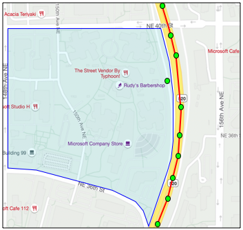

<!--
CO_OP_TRANSLATOR_METADATA:
{
  "original_hash": "078ae664c7b686bf069545e9a5fc95b2",
  "translation_date": "2025-08-27T22:46:05+00:00",
  "source_file": "3-transport/lessons/4-geofences/README.md",
  "language_code": "nl"
}
-->
# Geofences


> Schetsnotitie door [Nitya Narasimhan](https://github.com/nitya). Klik op de afbeelding voor een grotere versie.

Deze video geeft een overzicht van geofences en hoe je ze kunt gebruiken in Azure Maps, onderwerpen die in deze les aan bod komen:

[](https://www.youtube.com/watch?v=nsrgYhaYNVY)

> 🎥 Klik op de afbeelding hierboven om de video te bekijken

## Quiz voorafgaand aan de les

[Quiz voorafgaand aan de les](https://black-meadow-040d15503.1.azurestaticapps.net/quiz/27)

## Introductie

In de afgelopen 3 lessen heb je IoT gebruikt om de vrachtwagens te lokaliseren die jouw producten van de boerderij naar een verwerkingshub vervoeren. Je hebt GPS-gegevens vastgelegd, deze naar de cloud gestuurd om op te slaan en ze op een kaart gevisualiseerd. De volgende stap in het verbeteren van de efficiëntie van je toeleveringsketen is een melding ontvangen wanneer een vrachtwagen bijna bij de verwerkingshub aankomt, zodat het team dat nodig is om te lossen klaar kan staan met heftrucks en andere apparatuur zodra het voertuig arriveert. Op deze manier kan er snel worden gelost en betaal je niet voor een wachtende vrachtwagen en chauffeur.

In deze les leer je over geofences - gedefinieerde geospatiale gebieden, zoals een gebied binnen een rijafstand van 2 km van een verwerkingshub, en hoe je kunt testen of GPS-coördinaten binnen of buiten een geofence liggen, zodat je kunt zien of je GPS-sensor een gebied is binnengekomen of verlaten.

In deze les behandelen we:

* [Wat zijn geofences](../../../../../3-transport/lessons/4-geofences)
* [Een geofence definiëren](../../../../../3-transport/lessons/4-geofences)
* [Punten testen tegen een geofence](../../../../../3-transport/lessons/4-geofences)
* [Geofences gebruiken vanuit serverloze code](../../../../../3-transport/lessons/4-geofences)

> 🗑 Dit is de laatste les in dit project, dus vergeet niet om na het voltooien van deze les en de opdracht je cloudservices op te ruimen. Je hebt de services nodig om de opdracht te voltooien, dus zorg ervoor dat je dat eerst doet.
>
> Raadpleeg [de gids voor het opruimen van je project](../../../clean-up.md) indien nodig voor instructies over hoe je dit kunt doen.

## Wat zijn geofences

Een geofence is een virtuele omtrek voor een geografisch gebied in de echte wereld. Geofences kunnen cirkels zijn, gedefinieerd als een punt en een straal (bijvoorbeeld een cirkel van 100 meter rond een gebouw), of een veelhoek die een gebied beslaat, zoals een schoolzone, stadsgrenzen of een universiteits- of kantoorcampus.


> 💁 Misschien heb je al eerder geofences gebruikt zonder het te weten. Als je een herinnering hebt ingesteld met de iOS-herinneringen-app of Google Keep op basis van een locatie, heb je een geofence gebruikt. Deze apps stellen een geofence in op basis van de opgegeven locatie en waarschuwen je wanneer je telefoon de geofence binnenkomt.

Er zijn veel redenen waarom je zou willen weten of een voertuig binnen of buiten een geofence is:

* Voorbereiding op lossen - een melding ontvangen dat een voertuig op locatie is aangekomen, stelt een team in staat zich voor te bereiden om het voertuig te lossen, waardoor wachttijd wordt verminderd. Dit kan een chauffeur in staat stellen meer leveringen per dag te doen met minder wachttijd.
* Belastingnaleving - sommige landen, zoals Nieuw-Zeeland, heffen wegenbelasting voor dieselvoertuigen op basis van het voertuiggewicht, maar alleen wanneer ze op openbare wegen rijden. Met geofences kun je de afgelegde kilometers op openbare wegen bijhouden in tegenstelling tot privéwegen op locaties zoals boerderijen of bosbouwgebieden.
* Diefstalmonitoring - als een voertuig alleen in een bepaald gebied mag blijven, zoals op een boerderij, en het verlaat de geofence, kan het gestolen zijn.
* Locatienaleving - sommige delen van een werkterrein, boerderij of fabriek kunnen verboden terrein zijn voor bepaalde voertuigen, zoals het weghouden van voertuigen die kunstmest en pesticiden vervoeren van velden met biologische gewassen. Als een geofence wordt betreden, is een voertuig buiten de naleving en kan de chauffeur worden gewaarschuwd.

✅ Kun je andere toepassingen bedenken voor geofences?

Azure Maps, de service die je in de vorige les hebt gebruikt om GPS-gegevens te visualiseren, stelt je in staat geofences te definiëren en vervolgens te testen of een punt binnen of buiten de geofence ligt.

## Een geofence definiëren

Geofences worden gedefinieerd met GeoJSON, net zoals de punten die in de vorige les aan de kaart zijn toegevoegd. In dit geval is het in plaats van een `FeatureCollection` van `Point`-waarden een `FeatureCollection` die een `Polygon` bevat.

```json
{
   "type": "FeatureCollection",
   "features": [
     {
       "type": "Feature",
       "geometry": {
         "type": "Polygon",
         "coordinates": [
           [
             [
               -122.13393688201903,
               47.63829579223815
             ],
             [
               -122.13389128446579,
               47.63782047131512
             ],
             [
               -122.13240802288054,
               47.63783312249837
             ],
             [
               -122.13238388299942,
               47.63829037035086
             ],
             [
               -122.13393688201903,
               47.63829579223815
             ]
           ]
         ]
       },
       "properties": {
         "geometryId": "1"
       }
     }
   ]
}
```

Elk punt op de veelhoek wordt gedefinieerd als een lengte- en breedtegraadpaar in een array, en deze punten bevinden zich in een array die is ingesteld als de `coordinates`. In een `Point` in de vorige les was de `coordinates` een array met 2 waarden, breedte- en lengtegraad. Voor een `Polygon` is het een array van arrays met 2 waarden, lengte- en breedtegraad.

> 💁 Onthoud, GeoJSON gebruikt `lengtegraad, breedtegraad` voor punten, niet `breedtegraad, lengtegraad`.

De array met veelhoekcoördinaten heeft altijd 1 invoer meer dan het aantal punten op de veelhoek, waarbij de laatste invoer hetzelfde is als de eerste, zodat de veelhoek wordt gesloten. Voor een rechthoek zijn er bijvoorbeeld 5 punten.


In de bovenstaande afbeelding is er een rechthoek. De veelhoekcoördinaten beginnen linksboven op 47,-122, gaan vervolgens naar rechts naar 47,-121, dan naar beneden naar 46,-121, dan naar links naar 46,-122, en vervolgens weer omhoog naar het startpunt op 47,-122. Dit geeft de veelhoek 5 punten - linksboven, rechtsboven, rechtsonder, linksonder en dan linksboven om het af te sluiten.

✅ Probeer een GeoJSON-veelhoek te maken rond je huis of school. Gebruik een tool zoals [GeoJSON.io](https://geojson.io/).

### Taak - een geofence definiëren

Om een geofence in Azure Maps te gebruiken, moet deze eerst worden geüpload naar je Azure Maps-account. Zodra deze is geüpload, ontvang je een unieke ID die je kunt gebruiken om een punt te testen tegen de geofence. Om geofences naar Azure Maps te uploaden, moet je de web-API van Maps gebruiken. Je kunt de Azure Maps-web-API aanroepen met een tool genaamd [curl](https://curl.se).

> 🎓 Curl is een opdrachtregeltool om verzoeken te doen aan webendpoints.

1. Als je Linux, macOS of een recente versie van Windows 10 gebruikt, is curl waarschijnlijk al geïnstalleerd. Voer het volgende uit in je terminal of opdrachtregel om dit te controleren:

    ```sh
    curl --version
    ```

    Als je geen versie-informatie voor curl ziet, moet je het installeren via de [curl-downloadpagina](https://curl.se/download.html).

    > 💁 Als je ervaring hebt met Postman, kun je dat ook gebruiken als je dat liever doet.

1. Maak een GeoJSON-bestand met een veelhoek. Je gaat dit testen met je GPS-sensor, dus maak een veelhoek rond je huidige locatie. Je kunt er handmatig een maken door het GeoJSON-voorbeeld hierboven te bewerken, of een tool zoals [GeoJSON.io](https://geojson.io/) gebruiken.

    De GeoJSON moet een `FeatureCollection` bevatten met een `Feature` met een `geometry` van het type `Polygon`.

    Je **MOET** ook een `properties`-element toevoegen op hetzelfde niveau als het `geometry`-element, en dit moet een `geometryId` bevatten:

    ```json
    "properties": {
        "geometryId": "1"
    }
    ```

    Als je [GeoJSON.io](https://geojson.io/) gebruikt, moet je dit item handmatig toevoegen aan het lege `properties`-element, ofwel na het downloaden van het JSON-bestand, of in de JSON-editor in de app.

    Deze `geometryId` moet uniek zijn in dit bestand. Je kunt meerdere geofences uploaden als meerdere `Features` in de `FeatureCollection` in hetzelfde GeoJSON-bestand, zolang elk een andere `geometryId` heeft. Veelhoeken kunnen dezelfde `geometryId` hebben als ze worden geüpload vanuit een ander bestand op een ander moment.

1. Sla dit bestand op als `geofence.json` en navigeer naar de locatie waar het is opgeslagen in je terminal of console.

1. Voer het volgende curl-commando uit om de geofence te maken:

    ```sh
    curl --request POST 'https://atlas.microsoft.com/mapData/upload?api-version=1.0&dataFormat=geojson&subscription-key=<subscription_key>' \
         --header 'Content-Type: application/json' \
         --include \
         --data @geofence.json
    ```

    Vervang `<subscription_key>` in de URL door de API-sleutel van je Azure Maps-account.

    De URL wordt gebruikt om kaartgegevens te uploaden via de `https://atlas.microsoft.com/mapData/upload` API. De oproep bevat een `api-version`-parameter om aan te geven welke Azure Maps-API moet worden gebruikt. Dit is om de API in de loop van de tijd te laten veranderen, maar achterwaartse compatibiliteit te behouden. Het gegevensformaat dat wordt geüpload, is ingesteld op `geojson`.

    Dit voert het POST-verzoek uit naar de upload-API en retourneert een lijst met antwoordheaders, waaronder een header genaamd `location`.

    ```output
    content-type: application/json
    location: https://us.atlas.microsoft.com/mapData/operations/1560ced6-3a80-46f2-84b2-5b1531820eab?api-version=1.0
    x-ms-azuremaps-region: West US 2
    x-content-type-options: nosniff
    strict-transport-security: max-age=31536000; includeSubDomains
    x-cache: CONFIG_NOCACHE
    date: Sat, 22 May 2021 21:34:57 GMT
    content-length: 0
    ```

    > 🎓 Bij het aanroepen van een webendpoint kun je parameters doorgeven aan de oproep door een `?` toe te voegen, gevolgd door sleutel-waardeparen als `key=value`, waarbij de sleutel-waardeparen worden gescheiden door een `&`.

1. Azure Maps verwerkt dit niet onmiddellijk, dus je moet controleren of het uploadverzoek is voltooid door de URL te gebruiken die in de `location`-header wordt gegeven. Voer een GET-verzoek uit naar deze locatie om de status te bekijken. Je moet je abonnementsleutel toevoegen aan het einde van de `location`-URL door `&subscription-key=<subscription_key>` toe te voegen, waarbij `<subscription_key>` wordt vervangen door de API-sleutel van je Azure Maps-account. Voer het volgende commando uit:

    ```sh
    curl --request GET '<location>&subscription-key=<subscription_key>'
    ```

    Vervang `<location>` door de waarde van de `location`-header en `<subscription_key>` door de API-sleutel van je Azure Maps-account.

1. Controleer de waarde van `status` in het antwoord. Als deze niet `Succeeded` is, wacht dan een minuut en probeer het opnieuw.

1. Zodra de status `Succeeded` terugkomt, kijk je naar de `resourceLocation` in het antwoord. Dit bevat details over de unieke ID (bekend als een UDID) voor het GeoJSON-object. De UDID is de waarde na `metadata/`, exclusief de `api-version`. Als de `resourceLocation` bijvoorbeeld was:

    ```json
    {
      "resourceLocation": "https://us.atlas.microsoft.com/mapData/metadata/7c3776eb-da87-4c52-ae83-caadf980323a?api-version=1.0"
    }
    ```

    Dan zou de UDID `7c3776eb-da87-4c52-ae83-caadf980323a` zijn.

    Bewaar een kopie van deze UDID, want je hebt deze nodig om de geofence te testen.

## Punten testen tegen een geofence

Zodra de veelhoek is geüpload naar Azure Maps, kun je een punt testen om te zien of het binnen of buiten de geofence ligt. Dit doe je door een web-API-verzoek te doen, waarbij je de UDID van de geofence en de breedte- en lengtegraad van het te testen punt doorgeeft.

Bij het maken van dit verzoek kun je ook een waarde genaamd de `searchBuffer` doorgeven. Dit geeft de Maps-API aan hoe nauwkeurig de resultaten moeten zijn. De reden hiervoor is dat GPS niet perfect nauwkeurig is en locaties soms meters of meer kunnen afwijken. De standaardwaarde voor de zoekbuffer is 50 meter, maar je kunt waarden instellen van 0 meter tot 500 meter.

Wanneer resultaten worden geretourneerd door de API-oproep, is een van de onderdelen van het resultaat een `distance`, gemeten tot het dichtstbijzijnde punt op de rand van de geofence, met een positieve waarde als het punt buiten de geofence ligt en een negatieve waarde als het binnen de geofence ligt. Als deze afstand kleiner is dan de zoekbuffer, wordt de werkelijke afstand in meters geretourneerd. Anders is de waarde 999 of -999. 999 betekent dat het punt meer dan de zoekbuffer buiten de geofence ligt, -999 betekent dat het meer dan de zoekbuffer binnen de geofence ligt.


In de bovenstaande afbeelding heeft de geofence een zoekbuffer van 50 meter.

* Een punt in het midden van de geofence, ruim binnen de zoekbuffer, heeft een afstand van **-999**.
* Een punt ruim buiten de zoekbuffer heeft een afstand van **999**.
* Een punt binnen de geofence en binnen de zoekbuffer, 6 meter van de geofence, heeft een afstand van **6 meter**.
* Een punt buiten de geofence en binnen de zoekbuffer, 39 meter van de geofence, heeft een afstand van **39 meter**.

Het is belangrijk om de afstand tot de rand van de geofence te kennen en dit te combineren met andere informatie, zoals andere GPS-metingen, snelheid en weggegevens, bij het nemen van beslissingen op basis van de locatie van een voertuig.

Stel je bijvoorbeeld voor dat GPS-metingen laten zien dat een voertuig langs een weg rijdt die naast een geofence loopt. Als een enkele GPS-waarde onnauwkeurig is en het voertuig binnen de geofence plaatst, ondanks dat er geen toegang voor voertuigen is, kan dit worden genegeerd.


In de bovenstaande afbeelding is er een geofence over een deel van de Microsoft-campus. De rode lijn toont een vrachtwagen die langs de 520 rijdt, met cirkels die de GPS-metingen aangeven. De meeste hiervan zijn nauwkeurig en bevinden zich langs de 520, met één onnauwkeurige meting binnen de geofence. Het is onmogelijk dat die meting correct is - er zijn geen wegen waar de vrachtwagen plotseling van de 520 naar de campus kan afwijken en vervolgens weer terug naar de 520. De code die deze geofence controleert, moet rekening houden met de eerdere metingen voordat er actie wordt ondernomen op basis van de resultaten van de geofence-test.

✅ Welke aanvullende gegevens zou je nodig hebben om te controleren of een GPS-meting als correct kan worden beschouwd?

### Taak - test punten tegen een geofence

1. Begin met het bouwen van de URL voor de web-API-query. Het formaat is:

    ```output
    https://atlas.microsoft.com/spatial/geofence/json?api-version=1.0&deviceId=gps-sensor&subscription-key=<subscription-key>&udid=<UDID>&lat=<lat>&lon=<lon>
    ```

    Vervang `<subscription_key>` door de API-sleutel voor je Azure Maps-account.

    Vervang `<UDID>` door de UDID van de geofence uit de vorige taak.

    Vervang `<lat>` en `<lon>` door de breedte- en lengtegraad die je wilt testen.

    Deze URL gebruikt de `https://atlas.microsoft.com/spatial/geofence/json` API om een geofence te queryen die is gedefinieerd met GeoJSON. Het richt zich op de `1.0` API-versie. De parameter `deviceId` is vereist en moet de naam zijn van het apparaat waarvan de breedte- en lengtegraad afkomstig zijn.

    De standaard zoekbuffer is 50m, en je kunt dit wijzigen door een extra parameter `searchBuffer=<distance>` door te geven, waarbij `<distance>` de zoekbufferafstand in meters instelt, van 0 tot 500.

1. Gebruik curl om een GET-verzoek naar deze URL te sturen:

    ```sh
    curl --request GET '<URL>'
    ```

    > 💁 Als je een antwoordcode `BadRequest` krijgt, met een foutmelding:
    >
    > ```output
    > Invalid GeoJSON: All feature properties should contain a geometryId, which is used for identifying the geofence.
    > ```
    >
    > dan mist je GeoJSON de `properties`-sectie met de `geometryId`. Je moet je GeoJSON corrigeren en vervolgens de bovenstaande stappen herhalen om opnieuw te uploaden en een nieuwe UDID te verkrijgen.

1. Het antwoord bevat een lijst van `geometries`, één voor elke polygon die is gedefinieerd in de GeoJSON die is gebruikt om de geofence te maken. Elke geometrie heeft 3 interessante velden: `distance`, `nearestLat` en `nearestLon`.

    ```output
    {
        "geometries": [
            {
                "deviceId": "gps-sensor",
                "udId": "7c3776eb-da87-4c52-ae83-caadf980323a",
                "geometryId": "1",
                "distance": 999.0,
                "nearestLat": 47.645875,
                "nearestLon": -122.142713
            }
        ],
        "expiredGeofenceGeometryId": [],
        "invalidPeriodGeofenceGeometryId": []
    }
    ```

    * `nearestLat` en `nearestLon` zijn de breedte- en lengtegraad van een punt op de rand van de geofence dat het dichtst bij de locatie ligt die wordt getest.

    * `distance` is de afstand van de locatie die wordt getest tot het dichtstbijzijnde punt op de rand van de geofence. Negatieve getallen betekenen binnen de geofence, positieve buiten. Deze waarde zal minder dan 50 (de standaard zoekbuffer) of 999 zijn.

1. Herhaal dit meerdere keren met locaties binnen en buiten de geofence.

## Gebruik geofences vanuit serverloze code

Je kunt nu een nieuwe trigger toevoegen aan je Functions-app om de GPS-gegevens van IoT Hub te testen tegen de geofence.

### Consumer groups

Zoals je je herinnert uit eerdere lessen, stelt de IoT Hub je in staat om gebeurtenissen opnieuw af te spelen die door de hub zijn ontvangen maar niet zijn verwerkt. Maar wat gebeurt er als meerdere triggers verbinding maken? Hoe weet het welke triggers welke gebeurtenissen hebben verwerkt?

Het antwoord is dat het dat niet kan! In plaats daarvan kun je meerdere afzonderlijke verbindingen definiëren om gebeurtenissen te lezen, en elk kan het opnieuw afspelen van ongelezen berichten beheren. Dit worden *consumer groups* genoemd. Wanneer je verbinding maakt met het eindpunt, kun je specificeren met welke consumer group je verbinding wilt maken. Elk onderdeel van je applicatie zal verbinding maken met een andere consumer group.


In theorie kunnen maximaal 5 applicaties verbinding maken met elke consumer group, en ze zullen allemaal berichten ontvangen wanneer deze binnenkomen. Het is best practice om slechts één applicatie toegang te geven tot elke consumer group om dubbele berichtverwerking te voorkomen en ervoor te zorgen dat bij het opnieuw starten alle wachtrijberichten correct worden verwerkt. Bijvoorbeeld, als je je Functions-app lokaal lanceert terwijl deze ook in de cloud draait, zouden beide berichten verwerken, wat leidt tot dubbele blobs die in het opslagaccount worden opgeslagen.

Als je het `function.json`-bestand voor de IoT Hub-trigger bekijkt die je in een eerdere les hebt gemaakt, zie je de consumer group in de event hub-triggerbindingsectie:

```json
"consumerGroup": "$Default"
```

Wanneer je een IoT Hub maakt, krijg je standaard de `$Default` consumer group. Als je een extra trigger wilt toevoegen, kun je dit doen met een nieuwe consumer group.

> 💁 In deze les gebruik je een andere functie om de geofence te testen dan degene die wordt gebruikt om de GPS-gegevens op te slaan. Dit is om te laten zien hoe je consumer groups kunt gebruiken en de code kunt scheiden om het gemakkelijker te maken om te lezen en te begrijpen. In een productieapplicatie zijn er veel manieren waarop je dit kunt ontwerpen - beide in één functie plaatsen, een trigger op het opslagaccount gebruiken om een functie te laten draaien om de geofence te controleren, of meerdere functies gebruiken. Er is geen 'juiste manier', het hangt af van de rest van je applicatie en je behoeften.

### Taak - maak een nieuwe consumer group

1. Voer de volgende opdracht uit om een nieuwe consumer group genaamd `geofence` te maken voor je IoT Hub:

    ```sh
    az iot hub consumer-group create --name geofence \
                                     --hub-name <hub_name>
    ```

    Vervang `<hub_name>` door de naam die je hebt gebruikt voor je IoT Hub.

1. Als je alle consumer groups voor een IoT Hub wilt zien, voer je de volgende opdracht uit:

    ```sh
    az iot hub consumer-group list --output table \
                                   --hub-name <hub_name>
    ```

    Vervang `<hub_name>` door de naam die je hebt gebruikt voor je IoT Hub. Dit zal alle consumer groups weergeven.

    ```output
    Name      ResourceGroup
    --------  ---------------
    $Default  gps-sensor
    geofence  gps-sensor
    ```

> 💁 Toen je eerder de IoT Hub event monitor uitvoerde, maakte deze verbinding met de `$Default` consumer group. Dit was de reden waarom je de event monitor en een event trigger niet tegelijkertijd kon uitvoeren. Als je beide wilt uitvoeren, kun je andere consumer groups gebruiken voor al je Functions-apps en `$Default` behouden voor de event monitor.

### Taak - maak een nieuwe IoT Hub-trigger

1. Voeg een nieuwe IoT Hub-eventtrigger toe aan je `gps-trigger` Functions-app die je in een eerdere les hebt gemaakt. Noem deze functie `geofence-trigger`.

    > ⚠️ Je kunt [de instructies voor het maken van een IoT Hub-eventtrigger uit project 2, les 5 raadplegen indien nodig](../../../2-farm/lessons/5-migrate-application-to-the-cloud/README.md#create-an-iot-hub-event-trigger).

1. Configureer de IoT Hub-verbindingstring in het `function.json`-bestand. Het `local.settings.json`-bestand wordt gedeeld tussen alle triggers in de Functions-app.

1. Werk de waarde van de `consumerGroup` in het `function.json`-bestand bij om te verwijzen naar de nieuwe `geofence` consumer group:

    ```json
    "consumerGroup": "geofence"
    ```

1. Je zult de abonnementsleutel voor je Azure Maps-account nodig hebben in deze trigger, dus voeg een nieuwe invoer toe aan het `local.settings.json`-bestand genaamd `MAPS_KEY`.

1. Voer de Functions-app uit om te controleren of deze berichten verwerkt. De `iot-hub-trigger` uit de eerdere les zal ook draaien en blobs uploaden naar opslag.

    > Om dubbele GPS-metingen in blobopslag te vermijden, kun je de Functions-app die je in de cloud hebt draaien stoppen. Gebruik hiervoor de volgende opdracht:
    >
    > ```sh
    > az functionapp stop --resource-group gps-sensor \
    >                     --name <functions_app_name>
    > ```
    >
    > Vervang `<functions_app_name>` door de naam die je hebt gebruikt voor je Functions-app.
    >
    > Je kunt deze later opnieuw starten met de volgende opdracht:
    >
    > ```sh
    > az functionapp start --resource-group gps-sensor \
    >                     --name <functions_app_name>
    > ```
    >
    > Vervang `<functions_app_name>` door de naam die je hebt gebruikt voor je Functions-app.

### Taak - test de geofence vanuit de trigger

Eerder in deze les gebruikte je curl om een geofence te queryen om te zien of een punt zich binnen of buiten bevond. Je kunt een vergelijkbaar webverzoek doen vanuit je trigger.

1. Om de geofence te queryen, heb je de UDID nodig. Voeg een nieuwe invoer toe aan het `local.settings.json`-bestand genaamd `GEOFENCE_UDID` met deze waarde.

1. Open het `__init__.py`-bestand van de nieuwe `geofence-trigger` trigger.

1. Voeg de volgende import toe aan de bovenkant van het bestand:

    ```python
    import json
    import os
    import requests
    ```

    Het `requests`-pakket stelt je in staat om web-API-aanroepen te doen. Azure Maps heeft geen Python SDK, je moet web-API-aanroepen doen om het vanuit Python-code te gebruiken.

1. Voeg de volgende 2 regels toe aan het begin van de `main`-methode om de Maps-abonnementsleutel te verkrijgen:

    ```python
    maps_key = os.environ['MAPS_KEY']
    geofence_udid = os.environ['GEOFENCE_UDID']    
    ```

1. Binnen de `for event in events`-lus, voeg het volgende toe om de breedte- en lengtegraad van elk evenement te verkrijgen:

    ```python
    event_body = json.loads(event.get_body().decode('utf-8'))
    lat = event_body['gps']['lat']
    lon = event_body['gps']['lon']
    ```

    Deze code converteert de JSON van de event body naar een dictionary en haalt vervolgens de `lat` en `lon` op uit het `gps`-veld.

1. Bij gebruik van `requests`, in plaats van een lange URL op te bouwen zoals je deed met curl, kun je alleen het URL-gedeelte gebruiken en de parameters doorgeven als een dictionary. Voeg de volgende code toe om de URL te definiëren en de parameters te configureren:

    ```python
    url = 'https://atlas.microsoft.com/spatial/geofence/json'

    params = {
        'api-version': 1.0,
        'deviceId': 'gps-sensor',
        'subscription-key': maps_key,
        'udid' : geofence_udid,
        'lat' : lat,
        'lon' : lon
    }
    ```

    De items in de `params`-dictionary komen overeen met de sleutel-waardeparen die je gebruikte bij het aanroepen van de web-API via curl.

1. Voeg de volgende regels code toe om de web-API aan te roepen:

    ```python
    response = requests.get(url, params=params)
    response_body = json.loads(response.text)
    ```

    Dit roept de URL aan met de parameters en krijgt een response-object terug.

1. Voeg de volgende code hieronder toe:

    ```python
    distance = response_body['geometries'][0]['distance']

    if distance == 999:
        logging.info('Point is outside geofence')
    elif distance > 0:
        logging.info(f'Point is just outside geofence by a distance of {distance}m')
    elif distance == -999:
        logging.info(f'Point is inside geofence')
    else:
        logging.info(f'Point is just inside geofence by a distance of {distance}m')
    ```

    Deze code gaat uit van 1 geometrie en haalt de afstand op van die enkele geometrie. Vervolgens logt het verschillende berichten op basis van de afstand.

1. Voer deze code uit. Je zult in de loguitvoer zien of de GPS-coördinaten zich binnen of buiten de geofence bevinden, met een afstand als het punt binnen 50m ligt. Probeer deze code met verschillende geofences op basis van de locatie van je GPS-sensor, probeer de sensor te verplaatsen (bijvoorbeeld gekoppeld aan WiFi van een mobiele telefoon, of met verschillende coördinaten op het virtuele IoT-apparaat) om deze verandering te zien.

1. Wanneer je klaar bent, implementeer deze code in je Functions-app in de cloud. Vergeet niet de nieuwe Application Settings te implementeren.

    > ⚠️ Je kunt [de instructies voor het uploaden van Application Settings uit project 2, les 5 raadplegen indien nodig](../../../2-farm/lessons/5-migrate-application-to-the-cloud/README.md#task---upload-your-application-settings).

    > ⚠️ Je kunt [de instructies voor het implementeren van je Functions-app uit project 2, les 5 raadplegen indien nodig](../../../2-farm/lessons/5-migrate-application-to-the-cloud/README.md#task---deploy-your-functions-app-to-the-cloud).

> 💁 Je kunt deze code vinden in de [code/functions](../../../../../3-transport/lessons/4-geofences/code/functions) map.

---

## 🚀 Uitdaging

In deze les heb je één geofence toegevoegd met een GeoJSON-bestand met één polygon. Je kunt meerdere polygons tegelijkertijd uploaden, zolang ze verschillende `geometryId`-waarden hebben in de `properties`-sectie.

Probeer een GeoJSON-bestand met meerdere polygons te uploaden en pas je code aan om te vinden bij welke polygon de GPS-coördinaten het dichtst in de buurt zijn of zich bevinden.

## Quiz na de les

[Quiz na de les](https://black-meadow-040d15503.1.azurestaticapps.net/quiz/28)

## Review & Zelfstudie

* Lees meer over geofences en enkele van hun toepassingen op de [Geofencing-pagina op Wikipedia](https://en.wikipedia.org/wiki/Geo-fence).
* Lees meer over de Azure Maps geofencing API in de [Microsoft Azure Maps Spatial - Get Geofence documentatie](https://docs.microsoft.com/rest/api/maps/spatial/getgeofence?WT.mc_id=academic-17441-jabenn).
* Lees meer over consumer groups in de [Features and terminology in Azure Event Hubs - Event consumers documentatie op Microsoft docs](https://docs.microsoft.com/azure/event-hubs/event-hubs-features?WT.mc_id=academic-17441-jabenn#event-consumers).

## Opdracht

[Stuur meldingen met Twilio](assignment.md)

---

**Disclaimer**:  
Dit document is vertaald met behulp van de AI-vertalingsservice [Co-op Translator](https://github.com/Azure/co-op-translator). Hoewel we streven naar nauwkeurigheid, dient u zich ervan bewust te zijn dat geautomatiseerde vertalingen fouten of onnauwkeurigheden kunnen bevatten. Het originele document in zijn oorspronkelijke taal moet worden beschouwd als de gezaghebbende bron. Voor cruciale informatie wordt professionele menselijke vertaling aanbevolen. Wij zijn niet aansprakelijk voor eventuele misverstanden of verkeerde interpretaties die voortvloeien uit het gebruik van deze vertaling.